<!-- Generated by `python -m nardis_neural.docgen` from docs/*.md and the code. Edit the sources, not this file. -->

# nardis-neural

**A continually learning, multi-expert neural "market-state brain" for a Solana trading
system.**

It takes structured market state (a current feature vector, multi-resolution temporal
sequences and optional wallet/token graphs) and returns **probabilistic forecasts**:
expected returns, upside and downside event probabilities, expected maximum upside and
maximum drawdown, volatility, calibrated confidence, epistemic and aleatoric
uncertainty, an out-of-distribution score, a latent market-state embedding and per-observation
expert weights. It keeps learning from newly labelled outcomes through a guarded
champion → challenger lifecycle.

> **Scope.** This repository is the ML brain *only*. It contains no wallets, keys, signing,
> transaction execution, order routing or trading strategy, and it never emits BUY/SELL
> commands. Its only chain access is a **read-only** RPC client (`solana/ingest/`) that fetches
> public pump.fun and PumpSwap transactions to learn from. The existing trading system decides
> what to do with the forecasts.

> **Merging this into Nardis? Start with [docs/HANDOFF.md](docs/HANDOFF.md)** (the integration in one
> page, the merge plan and checklist, setup, operations, signals, invariants and project status),
> then [docs/API.md](docs/API.md) (the full HTTP contract with real example responses).

---

## Contents

- [At a glance](#at-a-glance)
- [Quick start](#quick-start)
- [Architecture](#architecture)
  - [Neural pathways](#neural-pathways)
  - [Multi-timescale processing](#multi-timescale-processing)
  - [Mixture of experts](#mixture-of-experts)
  - [Latent embedding & outputs](#latent-embedding--outputs)
- [Uncertainty, calibration, OOD](#uncertainty-calibration-ood)
- [Training](#training)
- [Continual learning](#continual-learning)
- [Champion / challenger lifecycle](#champion--challenger-lifecycle)
- [Regimes & drift](#regimes--drift)
- [Inference API](#inference-api)
- [CLI](#cli)
- [Configuration](#configuration)
- [Repository layout](#repository-layout)
- [Testing & quality gates](#testing--quality-gates)
- [Performance](#performance)
- [Nardis integration](#nardis-integration)
- [Solana intelligence layer](#solana-intelligence-layer)
- [Edge engine](#edge-engine)
- [Moonshot engine](#moonshot-engine)
- [Tape Transformer](#tape-transformer)
- [Criticality engine](#criticality-engine)
- [Capital engine](#capital-engine)
- [Optimal-stopping exits](#optimal-stopping-exits)
- [The chase](#the-chase)
- [Real-data results](#real-data-results)
- [Optional / not included](#optional--not-included)
- **[Part II — In depth](#part-ii--in-depth)**: merging into Nardis (start here), the HTTP API
  reference, architecture, continual learning, integration, Solana layer, edge engine, moonshot engine, Tape Transformer, criticality engine, capital
  engine, optimal-stopping exits, real-data results (the full contents of `docs/`)
- **[Part III — Generated reference](#part-iii--generated-reference)**: every CLI command and
  option, every configuration field and default, every feature, every output field, the
  public Python API and the test inventory

## At a glance

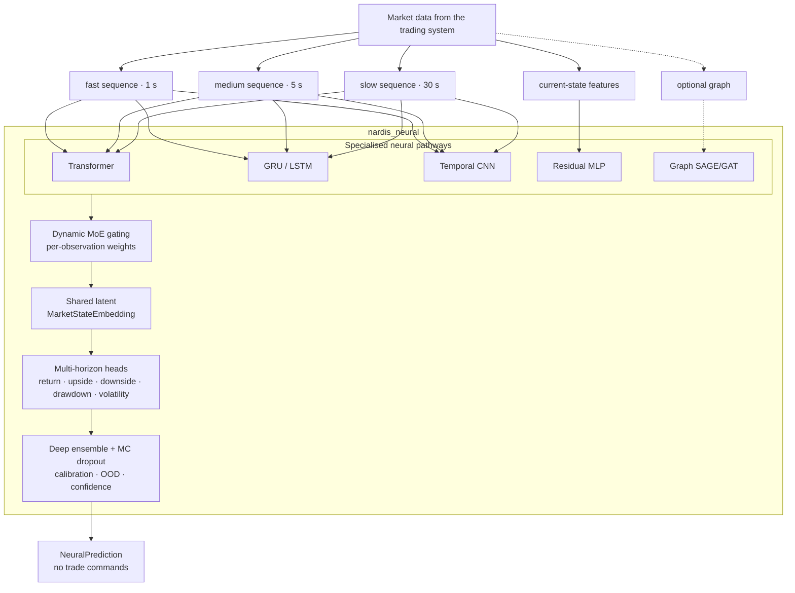

| Capability | Implementation |
|---|---|
| Temporal pathways | causal pre-LN Transformer, packed GRU/LSTM, dilated causal TCN, selective state-space (Mamba-style) SSM, residual MLP, optional relational GraphSAGE/GAT (pure PyTorch) |
| Hardware | one code path from a laptop CPU to a large GPU: `cpu-lite` / `cpu` / `gpu` / `gpu-frontier` profiles (≈0.17 M → 16.6 M parameters per member), auto-detected |
| Fusion | learned, per-observation softmax gate with load-balance, entropy and z-loss regularisers; expert dropout and noisy gating |
| Outputs | per horizon: return mean + variance + quantiles, max upside, max drawdown, volatility (heteroscedastic), upside/downside event probabilities |
| Uncertainty | deep ensemble (independent members), seeded MC dropout, epistemic / aleatoric / total decomposition, member disagreement |
| Calibration | temperature, Platt or isotonic, fitted on validation data only; Brier score, ECE, reliability bins |
| OOD & drift | Mahalanobis embedding distance, input z-score and disagreement OOD score; PSI / KS / Wasserstein / moment input drift, embedding, prediction and error drift |
| Continual learning | 3-pool replay (recent FIFO, historical reservoir, protected rare events), 5 sampling strategies, candidate cloning, distillation, EWC, full retraining with configurable weights |
| Lifecycle | immutable checkpoints, champion/candidate/challenger/retired/failed registry with audit log, shadow mode, 10-gate promotion, manual and optional automatic rollback |
| Representation | self-supervised pretraining (masked timestep, masked feature, contrastive), embedding export to Parquet/NumPy, KMeans / GMM / HDBSCAN regime discovery |
| Engineering | Pydantic v2 + YAML config, Typer CLI, CPU/CUDA/MPS, safe mixed precision, `mypy --strict`, `ruff`, 288 test functions |

## Quick start

```bash
# Python ≥ 3.12
python -m venv .venv && source .venv/bin/activate
pip install -e ".[dev]"

# synthetic demo data (testing only — not a market simulator)
nardis-neural generate-synthetic --out data/history --n 4000 --config configs/small.yaml
nardis-neural generate-synthetic --out data/live    --n 1500 --seed 1 --start-time 1700100000 --config configs/small.yaml

# train a calibrated deep ensemble and register it as champion of a workspace
nardis-neural train --data data/history --config configs/small.yaml --workspace workspaces/demo

# predict
nardis-neural predict --model workspaces/demo --data data/live --limit 5
```

In Python:

```python
from nardis_neural import NeuralEngine

engine = NeuralEngine.load("workspaces/demo")
prediction = engine.predict(observation)  # observation: NeuralObservation
```

## Architecture

The full design rationale is in [docs/ARCHITECTURE.md](docs/ARCHITECTURE.md).

### Neural pathways

| Expert | Highlights |
|---|---|
| **Transformer** (`models/transformer.py`) | pre-LayerNorm blocks, causal + key-padding attention mask via `scaled_dot_product_attention`, recency positional embedding + continuous time encoding, residuals, dropout, configurable depth/heads/width. Tests cover causality and padding invariance. |
| **Recurrent** (`models/recurrent.py`) | GRU by default (LSTM configurable). Observed steps are compacted and run as a packed sequence, so padding and interior gaps never enter the state. |
| **TCN** (`models/tcn.py`) | dilated causal convolutions, residual blocks, per-timestep LayerNorm (no future-leaking norms), unobserved steps held at zero, learned mixture over receptive-field scales. Tests cover causality and receptive field. |
| **SSM** (`models/ssm.py`) | selective state-space layers (Mamba-style): causal depthwise conv, input-dependent step size Δ and B/C matrices, diagonal stable A, gated output. Unobserved steps get Δ = 0 so the state passes through unchanged. Linear in sequence length, pure PyTorch (CPU / CUDA / MPS). Tests cover causality, gaps and padding invariance. |
| **Tabular** (`models/tabular.py`) | residual MLP with LayerNorm, GELU/SiLU and dropout for the immediate state vector. |
| **Graph** (`models/graph.py`, optional) | relational GraphSAGE or GAT over wallet→token / wallet→wallet / token→token edges, in pure PyTorch (no PyG dependency). Disabled by default; everything works without it. |

### Multi-timescale processing

Each sequence expert projects every timescale (feature dims may differ) together with
`log1p(age)` and the mask, adds a continuous time encoding and a **learned timescale
embedding**, and runs a **temporal core shared across timescales** (independent cores are
one config flag away). Masked last-step + mean pooling summarise each resolution, and an
attention-based **TimescaleFusion** combines them while masking missing timescales. At
inference all timescales are encoded in one stacked call. This is exact, because every
core is invariant to extra left padding.

### Mixture of experts

The gating network sees every expert's latent plus availability flags and outputs a
softmax over experts **for each observation**. Weights sum to 1, are returned with each
prediction, are exactly 0 for unavailable or runtime-disabled experts, start uniform
(zero-initialised gate) and are regularised against collapse by load-balance, entropy and
z-loss terms plus noisy gating and expert dropout. Experts are fused as `Σ w_e · A_e(h_e)`,
not by concatenation.

### Latent embedding & outputs

The mixture feeds a residual latent encoder that produces the **MarketStateEmbedding**,
used for regimes, nearest-neighbour search, OOD detection, drift monitoring and downstream
models. Separate per-horizon heads (default 30 s / 2 min / 5 min) predict:

- return: mean, heteroscedastic variance and non-crossing quantiles;
- max upside, max drawdown, volatility: softplus means with variances;
- `P(return > threshold)` and `P(drawdown > threshold)`: calibrated at inference.

## Uncertainty, calibration, OOD

- **Deep ensemble**: `ensemble.size` (default 3) independently initialised networks, each
  trained with its own optimiser, seed and data order (bootstrap optional).
- **MC dropout**: seeded extra passes through the decode stack, so inference is
  deterministic and cheap.
- **Decomposition**: aleatoric `E[σ²]`, epistemic `Var[μ]`, total; for events, expected
  entropy vs mutual information (BALD); plus member disagreement.
- **Calibration**: temperature, Platt or isotonic per (event, horizon), fitted on
  validation data only, with Brier / ECE / reliability reports.
- **OOD**: `ood_score` combines embedding Mahalanobis distance, input z-scores and
  disagreement, each normalised by its training 99th percentile.
- **Confidence** falls with epistemic uncertainty and with OOD.

## Training

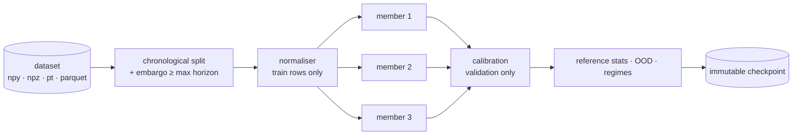

`Trainer` supports CPU/CUDA/MPS, mixed precision (CUDA bf16/fp16, MPS opt-in), gradient
clipping and accumulation, cosine / one-cycle / plateau schedules, early stopping,
per-epoch checkpoints with exact resume, deterministic seeds, NaN/Inf detection, JSONL
metrics, configurable batch size and workers, class weighting, focal loss, balanced
sampling and rare-event oversampling. Multi-task losses (Gaussian NLL / Huber / MSE,
pinball, BCE / weighted BCE / focal, static or learned uncertainty task weights) are
logged per component. Datasets are memory-mapped, so they never have to fit in RAM.

**Self-supervised pretraining** (`nardis-neural pretrain`) trains the temporal encoders on
unlabelled sequences with masked-timestep reconstruction, masked-feature reconstruction and
NT-Xent contrastive learning. Load the result with `train --pretrained`.

## Continual learning

Details are in [docs/CONTINUAL_LEARNING.md](docs/CONTINUAL_LEARNING.md).

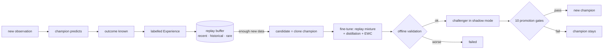

- **Replay**: a recent FIFO, a historical reservoir (old data is never simply dropped) and
  a protected rare-event store. Sampling can be uniform, recency-weighted, prioritized
  (with importance weights), rare-event or regime-balanced, and pools can be mixed.
- **Frequent adaptation**: clone the champion, fine-tune conservatively (low LR, few
  epochs, clipping) on a configurable mixture of recent, historical, rare and difficult
  samples, validate on the newest window with an embargo, and keep the input normaliser.
- **Anti-forgetting**: experience replay, **teacher/student distillation** from a frozen
  champion copy (tempered binary KL, regression and embedding terms, detached teacher) and
  optional **EWC** with a normalised diagonal Fisher.
- **Full retraining**: a fresh ensemble and normaliser trained on replay (plus optional
  external data), with configurable recent / historical / rare / difficult weights.
  Triggered by volume or input drift.

## Champion / challenger lifecycle

- **Registry** (`lifecycle/champion.py`): states `champion`, `candidate`, `challenger`,
  `retired`, `failed`. Model directories are immutable, `registry.json` is written
  atomically, and every transition goes to an audit log.
- **Shadow mode** (`lifecycle/shadow.py`): the challenger gets identical observations and
  its predictions are recorded but never returned. It is compared on regression, log loss,
  Brier, calibration, ranking, uncertainty quality and tails, per horizon, regime and time
  window.
- **Promotion** (`lifecycle/promotion.py`): minimum observations, return RMSE, log loss,
  tail MAE (required), plus Brier, ECE, rank correlation, NLL, time consistency and regime
  consistency. It produces JSON and Markdown reports.
- **Rollback** (`lifecycle/rollback.py`): manual, or automatic when live error degrades
  (**off by default**). It restores weights, normaliser, calibration, config and ensemble
  together.

## Regimes & drift

- `extract-embeddings` exports embeddings, gate weights, predictions and targets to
  Parquet or NPZ.
- `cluster-regimes` runs KMeans, GMM or HDBSCAN (optional automatic *k* via silhouette or
  BIC) and reports, per cluster: size, expert-weight profile, predicted and realised
  returns, errors, time span. Regimes are **discovered, never hand-defined**. Each engine
  also carries a fitted clusterer, so every prediction includes `regime_cluster`.
- `drift-report` covers four levels: raw input (PSI, KS, Wasserstein, moments), latent
  embedding (Mahalanobis distance ratio, KS, whitened mean shift), predictions, and model
  error.

## Inference API

```python
from nardis_neural import NeuralEngine, NeuralObservation, SequenceInput

engine = NeuralEngine.load("workspaces/prod")  # workspace → current champion
p = engine.predict(
    NeuralObservation(
        observation_id="tok:1718000000",
        timestamp=1718000000.0,
        current_features=current_vec,
        sequences={"fast": SequenceInput(values=bars_1s), "medium": SequenceInput(values=bars_5s)},
    )
)
p.expected_returns  # {"30s": …, "2m": …, "5m": …}
p.upside_probabilities, p.downside_probabilities, p.maximum_upside, p.maximum_drawdown
p.predicted_volatility, p.epistemic_uncertainty, p.aleatoric_uncertainty, p.total_uncertainty
p.confidence, p.ood_score, p.market_embedding, p.expert_weights, p.regime_cluster
```

The continual-learning API:

```python
from nardis_neural import ContinualLearner

trainer = ContinualLearner("workspaces/prod")
trainer.predict(observation)  # champion; challenger shadows
trainer.add_experience(observation, outcome)
trainer.adapt_if_needed()
trainer.full_retrain_if_needed()
trainer.promote_if_ready()
```

## CLI

| Command | Purpose |
|---|---|
| `init-config` | write the default YAML config |
| `generate-synthetic` | synthetic multi-regime dataset (npy / npz / pt / parquet, optional graphs, optional distribution shift) |
| `train` | train + calibrate an ensemble; `--workspace` registers it as champion (or as a challenger if a champion exists); `--pretrained`, `--resume` |
| `pretrain` | self-supervised encoder pretraining |
| `evaluate` | full metric report on a labelled dataset |
| `predict` | predictions from JSON observations or a dataset (JSONL out) |
| `extract-embeddings` | embeddings + gates + predictions → Parquet / NPZ |
| `cluster-regimes` | unsupervised regime discovery + per-cluster statistics |
| `ingest` | add labelled outcomes to the replay buffer (and to the shadow comparison) |
| `adapt` | continual adaptation (`--force` ignores the threshold) |
| `full-retrain` | weighted full retraining (`--data` for external data) |
| `shadow-evaluate` | challenger vs champion report (`--data` replays a dataset) |
| `promote` | evaluate promotion gates; `--version` forces a promotion |
| `rollback` | restore the previous (or `--to`) champion |
| `drift-report` | input / embedding / prediction / error drift |
| `inspect-model` | metadata, architecture and reference statistics |
| `status` | workspace lifecycle state |
| `benchmark` | latency, throughput and memory |
| `hardware` | detected device and recommended compute profile (`train --profile auto` applies it) |

## Configuration

Everything important is in YAML and validated by Pydantic (`src/nardis_neural/config.py`):
dimensions, timescales and sequence lengths, horizons and event thresholds, transformer
layers and heads, hidden sizes, TCN channels, recurrent depth and cell, dropout, experts
enabled, gating regularisers, ensemble size and MC samples, losses and task weights,
optimiser and LR, replay capacities and strategies, retraining thresholds and weights,
distillation and EWC weights, drift thresholds, promotion gates and rollback. Presets:

- `configs/default.yaml`: production-sized defaults (GPU or strong CPU);
- `configs/small.yaml`: compact model for CPU experiments.

## Repository layout

```
├── configs/                 default.yaml · small.yaml
├── README.md                generated: python -m nardis_neural.docgen (a test keeps it in sync)
├── docs/                    HANDOFF.md (start here) · API.md · OVERVIEW.md · ARCHITECTURE.md ·
│                            CONTINUAL_LEARNING.md · INTEGRATION.md · SOLANA.md · EDGE.md · MOONSHOT.md ·
│                            TAPE.md · CRITICALITY.md · CAPITAL.md · STOPPING.md · CHASE.md · REAL_DATA.md
│                            (README sources)
├── examples/                nardis_integration.py (runnable, tested)
├── src/nardis_neural/
│   ├── config.py            Pydantic config tree
│   ├── schemas.py           NeuralObservation / NeuralOutcome / NeuralPrediction
│   ├── synthetic.py         multi-regime synthetic market generator (tests/demos)
│   ├── benchmark.py         latency / throughput / memory
│   ├── hardware.py          device detection + cpu-lite / cpu / gpu / gpu-frontier profiles
│   ├── docgen.py            builds README.md from docs/ + the code (CLI, config, features, API)
│   ├── cli.py               Typer CLI
│   ├── data/                loaders · datasets · sequences · splits · normalization · replay
│   ├── models/              transformer · recurrent · tcn · ssm · tabular · graph · experts ·
│   │                        gating · fusion · heads · ensemble · main · common
│   ├── training/            trainer · losses · metrics · scheduling · pipeline ·
│   │                        continual · distillation · ewc · pretraining
│   ├── inference/           engine · uncertainty · calibration · ood
│   ├── regimes/             embeddings · clustering
│   ├── lifecycle/           checkpoints · champion · candidate · shadow · promotion · rollback
│   ├── monitoring/          drift
│   └── solana/              amm · events · market · wallets · features · labels · dataset ·
│                            risk · simulator · brain · config · cli · streaming · hawkes ·
│                            forward · suite · stopping · metalabel · service · chase · archive ·
│                            runners · narrative
│                            capital/ (allocator · bankroll · overfit · research)
│                            ingest/ (decoder · rpc · stream · history · encode · pumpfun · base58)
│                            edge/ (barriers · model · trees · backtest · research)
│                            moonshot/ (labels · tail · guard · online · research)
│                            tape/ (features · dataset · model · research · policy)
└── tests/                   288 test functions incl. synthetic end-to-end pipeline
```

## Testing & quality gates

```bash
ruff check .        # lint
ruff format --check .
mypy                # strict mode: src, tests and examples
pytest              # CUDA / MPS tests auto-skip when unavailable
```

The suite covers:

- Transformer shapes, causality and masking; recurrent and TCN causality; padding and gap
  invariance;
- gating sums, disabled experts and dynamic routing; gradients reaching every expert;
- probabilistic and multi-task losses; trainer resume and determinism;
- ensemble disagreement, calibration and OOD;
- checkpoint and normaliser persistence; replay strategies and persistence;
- candidate/champion isolation, adaptation, distillation, EWC and pretraining;
- regimes and drift; shadow mode, promotion gates and rollback;
- leakage-free chronological and walk-forward splits (property-based), deterministic
  inference, devices, every CLI command, the integration example;
- a **synthetic end-to-end test**: data → train ensemble → predict → uncertainty →
  experiences → replay → adaptation → shadow → promotion → checkpoint → reload → identical
  inference → rollback.

## Performance

Default configuration (3 members × 729 k parameters, 5 experts incl. SSM, 2 MC samples),
CPU only, 4-core Xeon @ 2.1 GHz:

| | p50 latency | throughput |
|---|---|---|
| single observation (full API) | ~49 ms | – |
| batch 32 | ~190 ms | ~170 obs/s |
| batch 256 | ~1.2 s | ~215 obs/s |
| single observation, `mc_dropout_samples: 0` | ~39 ms | – |
| single observation, `--profile cpu-lite` (2 × 168 k) | ~21 ms | ~640 obs/s at batch 256 |

Peak RSS is about 1 GB (0.8 GB for `cpu-lite`). GPUs are much faster. Run `nardis-neural benchmark` on your
hardware.

## Nardis integration

**Start with [docs/HANDOFF.md](docs/HANDOFF.md)**: it is the single document for merging this repository
into Nardis. For a Solana memecoin bot the recommended shape is the **sidecar**: run
`nardis-neural solana serve` next to Nardis and call its HTTP/JSON API
([docs/API.md](docs/API.md)) before every trade (`/advise_trade`), while a position is open
(`/hold_advice`) and after it closes (`/settle_trade`); it pushes moonshot alerts and keeps
training itself on Nardis's Parquet/SQLite trade archive.

For the generic (non-Solana) brain, see [docs/INTEGRATION.md](docs/INTEGRATION.md) and the runnable
[`examples/nardis_integration.py`](examples/nardis_integration.py). In short: build a
`NeuralObservation` from generic tensors (`build_bars` turns raw event streams into
leakage-free bars), call `predict`, report `NeuralOutcome`s as horizons elapse, and run
`adapt_if_needed` / `full_retrain_if_needed` / `promote_if_ready` on a background timer.
The trading system never touches model internals.

## Solana intelligence layer

`nardis_neural.solana` specialises the brain for Solana memecoin markets. See
[docs/SOLANA.md](docs/SOLANA.md).

- exact **pump.fun bonding-curve and AMM maths**: bonding progress, graduation,
  round-trip cost (fees + two-way impact) for a reference size;
- a **causal market state** fed by decoded events (launches, swaps, migrations, LP changes,
  SOL transfers) that rejects time travel;
- **wallet intelligence**: union-find funding clusters with exchange-hub detection
  (sybil / bundle discovery) and Beta-posterior reputations learned online *only* from
  outcomes that have already resolved, plus rug attribution to creator clusters. A second,
  **runner-specific skill** credits wallets that buy early into tokens that later run 10x;
- **76 named on-chain features**: holder concentration, dev / sniper / bundle /
  creator-cluster exposure, fresh wallets, smart-money flow, runner-skilled buyers,
  sybil-resistant counts per funding cluster, the supply held by a hidden multi-wallet cluster, the **creator family's track record** (prior
  launches, best peak, rug and graduation rates), market-wide heat, bots, priority fees and
  Jito tips, authorities, liquidity. Also 1 s / 5 s / 30 s trade bars with forward-filled
  prices, and a live wallet→token / funding / cluster **graph** for the graph expert;
- **hindsight labels** (returns, cost-aware net returns, rug / graduation / dev-dump events)
  joined with **causally replayed features**; a test proves snapshots equal what a
  past-only market would compute;
- a **launch-risk ensemble** (P rug, P graduation, P dev dump) on
  `[embedding ‖ on-chain features]`, with token-disjoint validation and calibration;
- **`SolanaBrain`**: `ingest → assess_many → resolve → maintenance`, returning forecasts,
  risk, expected net return after costs, P(beat costs) and human-readable red flags. It
  plugs into the continual-learning, shadow, promotion and rollback machinery;
- **real-chain ingestion**: a decoder for `getTransaction` JSON (pump.fun Anchor events,
  venue-agnostic AMM vault-delta swaps and LP changes, SOL funding transfers, Jito tips,
  priority fees), a **read-only** RPC client, and a cursor-based live streamer
  (`solana backfill`, `solana stream`, `solana decode`);
- an **agent-based launch simulator** (retail, smart money, snipers, bots, loud and stealth
  rug crews, decoys, graduations, LP pulls) and the `nardis-neural solana …` CLI
  (`simulate`, `build-dataset`, `bootstrap`, `replay`, `assess`, `decode`, `backfill`, `stream`,
  `stream-train`, `init-config`);
- **training by streaming history** (`solana stream-train`): walks an archival RPC such as
  Old Faithful oldest → newest, fetching only pump.fun / PumpSwap transactions, and learns
  online with bounded memory (token eviction, compact wallet state, rolling buffers),
  gated online refits of the tail model and resumable checkpoints. Nothing is stored.

```python
from nardis_neural.solana import SolanaBrain, EventStore

brain = SolanaBrain.bootstrap("workspaces/sol", EventStore.load("history/"))
brain.ingest(event)  # decoded on-chain events, in time order
for report in brain.assess_active():  # one batched forward pass per round
    report.risk["rug"], report.expected_net_return["60s"], report.flags
brain.resolve()
brain.maintenance()
```

## Edge engine

`nardis_neural.solana.edge` hunts for **edge after costs** and checks whether it is real.
See [docs/EDGE.md](docs/EDGE.md).

- **executable triple-barrier labels**: latency-delayed entry and exit, exact bonding-curve
  and AMM impact plus fees on both legs, take-profit / stop-loss / time exits;
- **walk-forward out-of-fold** retraining of the neural ensemble and risk model, so the
  second stage only ever learns from forecasts a live system would have seen;
- a **meta-labeling edge model**: a bootstrap ensemble predicting calibrated P(win) and
  expected net return; a lower-confidence-bound edge score; a capped fractional-Kelly hint;
- an **honest backtest**: fit / tune / test in time order, threshold chosen on tune, one
  shot on test, position constraints, bootstrap confidence intervals, compared with random,
  momentum and take-everything baselines at the same trade budget;
- `nardis-neural solana edge-research` installs the model; every `SolanaAssessment` then
  carries `edge` (p_win, expected_net, edge_score, kelly_fraction, above_threshold).

## Moonshot engine

`nardis_neural.solana.moonshot` is for the other end of the distribution: the rare launch
that runs 100x to 1000x. See [docs/MOONSHOT.md](docs/MOONSHOT.md).

- **executable peak-multiple labels**: the best liquidation multiple a ticket bought now
  could have realised (latency on both legs, own impact, fees). Labels are
  **right-censored** while a token is still running, and dead tokens resolve causally;
- a **censored power-law tail model**: a deep ensemble of mixture-of-log-logistic
  networks gives calibrated P(peak ≥ 2x, 5x, 10x, 100x, 1000x) per token, with a learned
  tail index and epistemic spread;
- **decision helpers**: expected payoff of a take-profit ladder with a trailing moon bag,
  and a **lottery-Kelly** fraction that maximises expected log-wealth;
- **hard to fool**: per-level tail calibration on held-out tokens, inputs clamped to the
  training range, and a manipulation guard (rug risk, authorities, wash trading, bundles,
  creator clusters, OOD, ensemble disagreement) whose `trust` score and hard vetoes only
  ever lower the output. `SolanaBrain.moonshot_ranking()` returns active tokens by
  `chase_score`, best first;
- **honest research**: train on earlier tokens with labels truncated at the cutoff, score
  once on later tokens against every-launch, random and momentum tickets;
- `runner` launches in the simulator (`solana simulate --market degen`) so there are real
  100–1000x+ tails to find; `nardis-neural solana moonshot-research` installs the model and
  every `SolanaAssessment` then carries `moonshot` (`p_ge_10x`, `p_ge_1000x`,
  `expected_multiple`, `lottery_kelly`, `tail_index`, `in_entry_window`, …).

## Tape Transformer

`nardis_neural.solana.tape` reads the **raw trade tape** instead of aggregates. See
[docs/TAPE.md](docs/TAPE.md).

- the last 96 trades, each with 18 features (side, size, timing, price move, fees, and the
  trader's skill, runner skill, cluster, creator link and freshness as known now), plus a
  **learned wallet embedding** keyed by a stable hash of the address;
- a small pre-LayerNorm **Transformer** with a summary token, fused with the 76 current
  features. Frequency gating and wallet dropout stop the wallet table from memorising noise;
- two heads: the censored power-law **tail** (P ≥ 2x … 1000x) and a discrete-time **collapse
  hazard** (P value halves within 1 min / 5 min / 15 min / 1 h), which is the exit signal;
- causal tape replay, research scored head-to-head against the tail model on identical rows,
  `nardis-neural solana tape-research`, and `SolanaAssessment.tape` on every assessment.
  Across two simulated markets the collapse head reaches AUC 0.90–0.97. Neither entry
  model ranked the tail best every time, so `chase_score` uses their blend. A learned exit
  alarm is evaluated too; it is not yet a reliable edge (+3 % and −12 % test PnL).
- a **forward-test ledger** in `SolanaBrain` settles every paper ticket the signals would
  have taken, with and without the exit alarm (`solana forward-report`). It is a
  walk-forward backtest during `stream-train` and a paper scorecard live;
- `solana research-suite` repeats the research on several independent markets and
  reports mean ± sd; the `adversarial` market adds staged "trap" launches.

## Criticality engine

`nardis_neural.solana.hawkes` measures how close each token's buying is to a **phase
transition**: its viral R₀. See [docs/CRITICALITY.md](docs/CRITICALITY.md).

- an online **self-exciting (Hawkes) process** fit: exact maximum likelihood by vectorised
  EM, with exact O(N) kernel sums, history conditioning and a **detrended background**, so
  a fading launch rush is not mistaken for a cascade. An optional second, fast kernel
  separates same-slot reflexes from human herding;
- five features: buy and sell **branching ratios** (follow-on buys each buy triggers),
  their trend (is the token *approaching* criticality?), the herding timescale and the
  **endogenous share** (herding vs scripted flow);
- self-exciting **herding** in the simulator (`--herding`), and an ablation measured with
  and without the features on identical splits.

## Capital engine

`nardis_neural.solana.capital` turns signals into a sized book and checks whether the edge
is real. See [docs/CAPITAL.md](docs/CAPITAL.md).

- a **capital allocator**. The stake is the lottery-Kelly fraction, scaled by trust,
  uncertainty and the forward ledger's live **track record**, then capped per position,
  per **pool liquidity**, per **creator family**, by total exposure and by position count.
  A **drawdown governor** and a **daily loss stop** sit on top (`brain.allocate`,
  `solana allocate`); it gives advice and never places orders;
- an event-driven **bankroll simulator** (capital locked while open) with a bootstrap risk
  profile (P(loss), P(−50 %), drawdown quantiles) and **stress tests** that scale every
  payoff down;
- **Deflated Sharpe Ratio** and **Probability of Backtest Overfitting** (combinatorially
  symmetric cross-validation) in every moonshot research report.

## Optimal-stopping exits

`nardis_neural.solana.stopping` treats holding a position as an American option on its own
executable liquidation value and solves for the exit. See [docs/STOPPING.md](docs/STOPPING.md).

- **Longstaff–Schwartz** regression of the **continuation value** (the Snell envelope),
  with **log utility** so the exit maximises compounding rather than the lottery mean;
- **fitted policy iteration** over paths of any length, with gradient-boosted trees on the
  full causal market state plus time held, log multiple, running peak and drawdown;
- honest evaluation: fitted on earlier tokens with paths truncated at the cutoff, scored
  once on later tokens against hold, timers, the take-profit ladder and the hindsight-best
  exit (`solana stopping-research`; `brain.hold_advice` gives sell-vs-hold values, never
  orders).

## The chase

The addon always chases 2x, 5x, 10x, 100x and 1000x; the targets are a constant, not a setting.
Every assessment, ranking and trade advice reports each target's probability, its break-even
probability and the edge ratio, plus the **`chase_target`**: the most ambitious multiple
that is proven (at least 3 real hits) and +EV. See [docs/CHASE.md](docs/CHASE.md).

## Real-data results

Measured on real pump.fun mainnet history. See [docs/REAL_DATA.md](docs/REAL_DATA.md).

- **Runner identification (3 h 40 min, 5 006 launches, 760 fully observed test tokens).** The
  production tail model ranks tokens that go on to 2x / 5x / 10x within 30 minutes with AUC
  **0.896 / 0.917 / 0.923**; its top 10 % held 7 of the 10 tokens that reached 10x (base rate
  1.3 %). Narrative features added +0.028 / +0.044 AUC at 5x / 10x (intervals exclude zero).
  Six attempts with bigger or different models did not beat it.
- **Buying every launch loses.** On the first 1.5-hour window (1 985 launches) it lost about
  3 % per ticket (−8.3 SOL on 659 tickets).
- **Exit: transfers.** The log-utility stopping rule lost 39 % less than the ladder and 76 %
  less than holding, out of sample; its median hold on real launches is 10 seconds.
- **Crash model: transfers.** Collapse AUC 0.962 / 0.965 / 0.969 within 1 / 5 / 15 minutes,
  well calibrated.
- The capital allocator broke even where a flat stake lost 7.8 %.

## Optional / not included

- **Graph pathway**: implemented and tested, but disabled by default. It needs graph
  inputs from the trading system and no extra dependency.
- **Parquet datasets** carry features and targets but not graphs; use `.npy` directories,
  `.npz` or `.pt` for graph data.
- **Regime cluster ids are per model version**: each adaptation refits clusters on its own
  embedding space.
- **Offline candidate validation** uses a held-out half of the newest window, which is
  small by design. Shadow mode on genuinely new data is the decisive test.
- **Distributed or multi-node training** is intentionally out of scope (no Ray, Spark,
  Kafka and so on). Single-GPU or CPU training is supported.
- **Execution** is out of scope: there are no wallets, keys, signing or order routing. The
  Solana layer reads public chain data through a read-only RPC client (an allowlist of read
  methods) or from transactions the trading system pushes to it. For the generic brain, the
  trading system produces the datasets; the synthetic generator exists to test the ML system,
  not to model profitability.

# Part II — In depth

The complete contents of every document in `docs/`.

## Merging into Nardis: start here

This is the first document to read when a coding session opens both repositories, this one
(`nardis-neural`) and Nardis, to merge them. It says what this repository is, how it plugs into
Nardis, how to merge and run it, what is proven, what is broken and what is left to do. The
per-endpoint HTTP contract is in [API.md](docs/API.md). Everything else links to the in-depth docs in
this folder.

State as of 29 September 2026, branch `solana-neural-ml-addon`, head `c40edaa`.

### What this repository is, and is not

`nardis-neural` (Python package `nardis_neural`, version 0.1.0) is a machine-learning addon for
Nardis, a Solana memecoin trading bot. It learns from the chain and from Nardis's own trades and
answers questions with numbers:

* how likely a token is to reach 2x, 5x, 10x, 100x or 1000x, and whether chasing each multiple is
  worth it at those odds;
* how likely an open position is to crash (halve) within 1, 5 or 15 minutes, and whether holding
  is worth more than selling now;
* how good one of Nardis's own proposed trades looks, learned from Nardis's settled trades;
* launch risk (rug, graduation, dev dump), manipulation red flags, and recommended stake sizes.

It **never trades**:

* no wallet, key, seed phrase or keypair is read anywhere in the code;
* no signing, no transaction building, no transaction sending, no order routing;
* no output field is a command: tests assert that `NeuralPrediction` and `SolanaAssessment`
  contain none of `action`, `signal`, `buy`, `sell`, `order`, `side`, `size`, `position`;
* its only chain access is read-only JSON-RPC. [rpc.py](src/nardis_neural/solana/ingest/rpc.py)
  refuses any method outside an allowlist of 11 read methods with a `PermissionError` before
  anything is sent (see [The no-execution guarantee](#the-no-execution-guarantee)).

Nardis keeps every decision and every order. The addon is advice.

The repository has two layers: a generic neural "brain" (`nardis_neural`, no Solana knowledge)
and the Solana layer (`nardis_neural.solana`) built on top of it. Nardis talks to the Solana
layer, normally through its HTTP sidecar.

### The integration in one page

#### Recommended shape: a sidecar over HTTP

There are two ways for Nardis to call the addon.

| | HTTP sidecar (`nardis-neural solana serve`) | in-process Python (`SolanaBrain`) |
|---|---|---|
| Nardis language | any | Python 3.12 or newer only |
| per-call cost | JSON over loopback; `advise_trade` 1.3 ms median without the market view, about 20 ms with it (4-core CPU, [INTEGRATION.md](docs/INTEGRATION.md)) | no serialisation; on the tiny test workspace `assess` about 20 ms and `advise_trade(..., with_market=False)` about 0.07 ms |
| dependencies in Nardis's environment | none | PyTorch, NumPy, Polars, scikit-learn, SciPy, Pydantic; `import nardis_neural.solana` took 2.7 s |
| locking | done by `AddonService` (one lock) | Nardis must serialise every call itself |
| upkeep (`resolve`, `maintenance`, `save`, eviction) | done by the stream thread (only with the stream on) | Nardis must schedule it, or reuse `AddonService.stream` |
| crash isolation | separate process | a crash in the addon is a crash in Nardis |

**Recommendation: run the sidecar and call it over HTTP on `127.0.0.1`.** Reasons:

1. It works whatever language Nardis is written in, and needs no change to Nardis's Python
   version.
2. PyTorch (several GB with CUDA) and the addon's pins (`polars>=1.0`, `pydantic>=2.6`,
   `numpy>=1.26`) stay out of Nardis's environment.
3. The lock, the upkeep threads and the archive self-training are already built into
   `AddonService`. In-process, Nardis would have to rebuild them.
4. A crash, a stall or a long retrain in the ML process cannot take Nardis's trading loop down.
   Nardis treats a timeout as "no advice" and keeps trading.
5. The per-call cost (1.3 ms, or about 20 ms with the market view) is small next to chain
   latency.

Use in-process calls only if Nardis is Python 3.12+ and needs the lowest latency. See
[Using it from Python](#using-it-from-python).

#### A trade's life

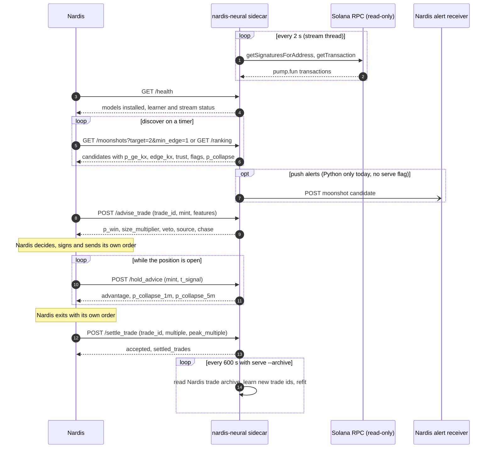

#### The five calls Nardis must make

| # | call | when | why |
|---|---|---|---|
| 1 | `GET /health` | at start-up and on a timer | check `ok`, which `models` are installed, stream counters, learner status |
| 2 | `GET /moonshots?target=K&min_edge=E` or `GET /ranking` | on a timer | candidates at entry; polling also feeds continual learning and the forward-test ledger, because `serve` has no assessment timer of its own |
| 3 | `POST /advise_trade` | before **every** trade, with a unique `trade_id` and Nardis's own signals as `features` | scores the proposal and records it as pending; a trade that was never advised cannot be learned |
| 4 | `POST /hold_advice` | while a position is open | sell-now versus hold, and crash odds |
| 5 | `POST /settle_trade` | after **every** close, with `multiple` net of fees and `peak_multiple` when known | this is where learning from Nardis happens |

With `serve --no-stream` (Nardis pushes transactions to `POST /ingest`), add `POST /save` on a
timer and before shutdown. Error handling: 400 is a client bug, 409 is "model not installed", a
closed connection or a timeout is "no advice". Never block trading on the sidecar being up.
Full contract: [API.md](docs/API.md).

### Merging the repositories

The source is branch `solana-neural-ml-addon` of
`https://github.com/paloaltovisitor57-cloud/Machines-learning-at-full-speed` (the `origin`
remote). Its history is 55 commits from a single root commit (`3708a1e`), 167 tracked files, and
`.git` is about 10 MB.

There are three options. They differ in where the code lives and how Nardis calls it, and they
combine: the recommendation uses (a1) for the code and (c) for the runtime.

#### (a) One repository, the addon in a subdirectory, history kept

Keep the addon's whole tree together in one subdirectory, for example `nardis-neural/`. Do not
split `src/nardis_neural` away from `docs/`, `tests/`, `examples/`, `configs/`, `pyproject.toml`
and `README.md` (see [Keep the tree together](#keep-the-tree-together)).

**(a1) Move, then merge unrelated histories.** Per-file history survives under the new path
(`git log --follow` works).

```bash
# 1. A throwaway clone of the addon, with everything moved into nardis-neural/
git clone --branch solana-neural-ml-addon \
    https://github.com/paloaltovisitor57-cloud/Machines-learning-at-full-speed nardis-neural-move
cd nardis-neural-move
mkdir nardis-neural
git ls-tree --name-only HEAD | grep -v '^nardis-neural$' | while read -r f; do git mv "$f" nardis-neural/; done
git commit -m "Move nardis-neural into nardis-neural/"

# 2. In the Nardis repository, on a new branch
cd /path/to/nardis
git switch -c merge-nardis-neural
git remote add neural ../nardis-neural-move
git fetch neural
git merge --allow-unrelated-histories neural/solana-neural-ml-addon -m "Merge nardis-neural into nardis-neural/"
git remote remove neural
```

**(a2) `git subtree add`.** One command, but per-file history is hidden under the new path.

```bash
cd /path/to/nardis
git switch -c merge-nardis-neural
git subtree add --prefix=nardis-neural \
    https://github.com/paloaltovisitor57-cloud/Machines-learning-at-full-speed solana-neural-ml-addon
```

Both were tried on a scratch repository. Each brought in all 167 tracked files, including the
14 files of `src/nardis_neural/models` and the 7 of `src/nardis_neural/data`. After (a2),
`git log -- nardis-neural/<file>` shows only the subtree merge commit, because the old commits
use the old paths. After (a1), `git log --follow -- nardis-neural/<file>` shows the original
commits. `git subtree` is a contrib command that some git installs lack. Later updates from the
old repository can be pulled with `git subtree pull --prefix=nardis-neural <url> <branch>` after
(a2) (not tested), or by repeating the move-and-merge after (a1).

#### (b) Separate repository, installed as a package

Keep the repositories apart and install the addon into Nardis's Python environment:

```bash
pip install -e /path/to/Machines-learning-at-full-speed          # add ".[dev]" for the test tools
```

Nardis can then `import nardis_neural` and call `SolanaBrain` in-process. The costs:

* Nardis's interpreter must be Python 3.12 or newer (`requires-python = ">=3.12"`).
* Nardis inherits every dependency, including PyTorch, and any version conflict.
* `SolanaBrain` is not thread-safe. Nardis must serialise every call itself, as `AddonService`
  does with a lock.
* Two repositories to keep in step.
* Use an editable install (`-e`). `docgen` finds `docs/` and `README.md` relative to its own file,
  so a regular install into `site-packages` cannot regenerate or check the README.

#### (c) Sidecar process only

Install the addon in its own virtual environment and run it as a local HTTP/JSON service. Nardis
calls it over `127.0.0.1` from any language:

```bash
python3.12 -m venv nardis-neural/.venv
nardis-neural/.venv/bin/pip install -e ./nardis-neural
nardis-neural/.venv/bin/nardis-neural solana serve --workspace ws --port 8787 --no-stream
curl -s localhost:8787/health
```

No shared interpreter, no dependency conflicts, and a crash in the ML process cannot take Nardis
down. One more process to supervise. Requests are serialised by one lock, which is fine for one
trading system.

#### Trade-offs

| | (a) subdirectory | (b) `pip install -e` | (c) sidecar |
|---|---|---|---|
| one repository, one history | yes | no | independent of layout |
| Nardis must run Python ≥ 3.12 | only with in-process use | yes | no |
| PyTorch and other deps in Nardis's environment | only with in-process use | yes | no |
| Nardis language | any (via the sidecar) | Python | any |
| process isolation | with the sidecar | no | yes |
| per-call overhead | HTTP (sidecar) or none | none | HTTP on loopback |

#### Recommendation

Use (a1) for the code and (c) for the runtime:

1. Merge with move-then-merge, so the addon lives in `nardis-neural/` with its full history.
2. Give it its own virtual environment and run `nardis-neural solana serve` next to Nardis.
3. Nardis calls the HTTP API. It never imports `nardis_neural`.

This keeps one repository, keeps `git log --follow` useful, keeps PyTorch and the addon's pins
out of Nardis's environment, and needs no change to Nardis's Python version. If Nardis is Python
3.12+ and in-process calls are needed later, `pip install -e ./nardis-neural` into Nardis's
environment still works from the same subdirectory.

#### Merge checklist

1. **Prerequisites.** On the Nardis machine: git, Python 3.12 or newer, and clean working trees in
   both repositories.
2. **Branch.** In Nardis: `git switch -c merge-nardis-neural`.
3. **Merge with history** (option a1): move everything into `nardis-neural/` in a throwaway
   clone, then `git merge --allow-unrelated-histories` into Nardis.
4. **Check the files arrived.** `git ls-files nardis-neural | wc -l` prints 167 plus any files
   added since this document (this document and [API.md](docs/API.md) make 169);
   `git ls-files nardis-neural/src/nardis_neural/models | wc -l` prints 14 and
   `git ls-files nardis-neural/src/nardis_neural/data | wc -l` prints 7.
5. **Check `.gitignore`.** No Nardis rule may hide `nardis-neural/src/nardis_neural/data` or
   `…/models`: `git check-ignore -v nardis-neural/src/nardis_neural/models/new.py` must print
   nothing. An unanchored `models/` in Nardis's root `.gitignore` does hide it (reproduced on a
   scratch merge); files already tracked stay tracked, but new files there would be silently
   ignored.
6. **READMEs.** Leave `nardis-neural/README.md` as generated. Add one line to Nardis's own README
   that links to it.
7. **Environment.** Create the addon's own venv and install it editable with the dev tools:
   ```bash
   python3.12 -m venv nardis-neural/.venv
   nardis-neural/.venv/bin/pip install -e "./nardis-neural[dev]"
   ```
   The addon's own `.gitignore` already ignores `.venv/` inside `nardis-neural/`.
8. **Do not rename** `nardis_neural`, the `nardis-neural` script or the `solana` subcommand. Do not
   move `src/nardis_neural` out of `nardis-neural/`.
9. **Lint and types** (from `nardis-neural/`): `ruff check .`,
   `ruff format --check src tests examples`, `mypy`.
10. **Tests** (from `nardis-neural/`, or `pytest nardis-neural/tests` from the root; never in the
    same run as Nardis's own `tests` package): `pytest -m "not slow"`, then `pytest`.
11. **Docs.** If anything in `docs/` changed, run `python -m nardis_neural.docgen`, commit the
    README, then `python -m nardis_neural.docgen --check` must exit 0. This document and
    [API.md](docs/API.md) are not in the README until they are added to `PARTS` in
    [docgen.py](src/nardis_neural/docgen.py); adding them is optional and needs a README
    regeneration.
12. **Workspace.** Point the sidecar at an existing workspace, or build one (see the
    [Setup runbook](#setup-runbook)). Keep workspaces out of git (`/workspaces/` is ignored in the
    addon's tree only).
13. **Start the sidecar** bound to loopback:
    ```bash
    nardis-neural/.venv/bin/nardis-neural solana serve --workspace ws --port 8787 --no-stream
    curl -s localhost:8787/health
    ```
    Use `--rpc` or `SOLANA_RPC_URL` and drop `--no-stream` for the live feed. A workspace with no
    research models installed is enough for a smoke test: `/health` then answers `"ok": true`
    with all four `models` flags false (checked on a tiny simulated workspace).
14. **Done when:** tests pass, `docgen --check` passes, and the sidecar's `/health` answers with
    `"ok": true`.

### Install

The package is `nardis-neural` (import name `nardis_neural`, version 0.1.0). It installs one
console script, `nardis-neural`. Every Solana command lives under `nardis-neural solana …`.

| requirement | value | source |
|---|---|---|
| Python | ≥ 3.12 | `requires-python` in [pyproject.toml](pyproject.toml) |
| runtime dependencies | torch ≥ 2.2, numpy ≥ 1.26, polars ≥ 1.0, pyarrow ≥ 15, scikit-learn ≥ 1.4, scipy ≥ 1.11, pydantic ≥ 2.6, typer ≥ 0.12, pyyaml ≥ 6.0 | [pyproject.toml](pyproject.toml) |
| `dev` extra | pytest ≥ 8, pytest-timeout ≥ 2.2, hypothesis ≥ 6.100, mypy ≥ 1.10, ruff ≥ 0.5, types-PyYAML | [pyproject.toml](pyproject.toml) |
| GPU | not needed; CPU, CUDA and Apple MPS all work | [hardware.py](src/nardis_neural/hardware.py) |

```bash
cd /path/to/nardis-neural
python3.12 -m venv .venv && source .venv/bin/activate
pip install -e ".[dev]"          # runtime + test and lint tools
# pip install -e .               # runtime only, for a production box
```

**CPU-only PyTorch.** `pip` resolves `torch>=2.2` from PyPI. On Linux that is the CUDA build. The
reference venv holds `2.14.0+cu130` and is 5.9 GB, of which `torch` is 1.2 GB and the `nvidia`
CUDA libraries 3.2 GB. The sidecar runs fine on a CPU. A CPU-only machine can install the CPU
wheel from PyTorch's own index first; the exact command is standard PyTorch guidance and was not
tested in this repository.

**Verify the install.**

```bash
nardis-neural --help
nardis-neural hardware                                      # detected device + recommended profile
pytest tests/test_solana_service.py tests/test_docs.py      # sidecar HTTP API, README in sync
pytest -m "not slow"                                        # skips the 4 slow integration tests
pytest                                                      # everything; CUDA / MPS tests skip themselves
ruff check . && ruff format --check src tests examples && mypy
```

* The two test files above pass on a 4-core CPU box (8 tests, about 20 s, of which 13.7 s is the
  service fixture training a tiny workspace).
* `nardis-neural hardware` on a 4-core CPU box prints `"recommended_profile": "cpu-lite"`. Eight
  or more cores give `cpu`; CUDA gives `gpu` (or `gpu-frontier` with ≥ 16 GB VRAM); Apple MPS
  gives `gpu`.
* `ruff format --check .` (without paths) currently fails: it also formats Python blocks inside
  Markdown and reports `README.md`, `docs/INTEGRATION.md` and `docs/STOPPING.md`. Use the paths
  above.

Reference venv versions: Python 3.12.3, torch 2.14.0+cu130, numpy 2.5.3, polars 1.44.2, pyarrow
25.0.1, scikit-learn 1.9.1, scipy 1.18.1, pydantic 2.13.5, typer 0.27.2, pyyaml 6.0.3. The numpy
floor admits 1.x, but only 2.x has been run.

### Setup runbook

The sidecar needs a **workspace**: one directory that holds the neural champion, the market state
and every installed model. This is the order that builds one from real mainnet history and starts
serving it.

| step | command | reads | writes | time | memory |
|---|---|---|---|---|---|
| 0 | `nardis-neural hardware` | the machine | nothing | seconds | – |
| 1 | `export SOLANA_RPC_URL=…` | – | – | – | – |
| 2 | `solana fetch-history` | RPC (read-only) | event directory | 12 h of history ≈ 7–8 h, plus graduate following (unmeasured) | unmeasured |
| 3 | `solana init-config` (optional) | – | a `solana.yaml` | seconds | – |
| 4 | `solana bootstrap` | event directory | new workspace | unmeasured on real data | unmeasured |
| 5 | `solana moonshot-research` | workspace history | `ws/moonshot/` | unmeasured on real data | unmeasured |
| 6 | `solana tape-research` | workspace history | `ws/tape/` | unmeasured | 1.5 h at 10 s snapshots exceeded 15 GB; 60 s fitted |
| 7 | `solana stopping-research` | workspace history | `ws/stopping/` | ≈ 10 min for a 150-token simulated market | unmeasured |
| 8 | `solana runner-research` (optional) | workspace history | `ws/runners/` | unmeasured | unmeasured |
| 9 | `solana meta-train` (optional) | Nardis's trade archive | `ws/meta/` | unmeasured | unmeasured |
| 10 | `solana serve` | workspace, RPC, archive | workspace checkpoints | starts in seconds on a tiny workspace; real-workspace start-up unmeasured | unmeasured |

Measured numbers come from [INTEGRATION.md](docs/INTEGRATION.md) (fetch speed),
[REAL_DATA.md](docs/REAL_DATA.md) §4 (tape memory) and [STOPPING.md](docs/STOPPING.md) §5 (stopping time).

**Run steps 5 to 8 before the first `serve` on a workspace.** When `serve` streams, it switches
the brain to bounded-memory mode and its first autosave writes `ws/stream/market.pkl`. From then
on the workspace loads that compact market state and **no event history**, so every research
command on it fails with `ValueError: no labelled snapshots could be built from this history`
(reproduced). The research commands have no `--events` option. See
[Retraining the research models](#retraining-the-research-models).

#### Step 0: check the machine

A CPU is enough. The docs measured inference on a 4-core Xeon at 2.1 GHz: about 49 ms per
observation with the default model and 21 ms with `cpu-lite`, peak RSS about 1 GB (0.8 GB for
`cpu-lite`), including PyTorch ([ARCHITECTURE.md](docs/ARCHITECTURE.md) §9). That is the inference
benchmark, not the whole sidecar. The research steps are the memory peak.

#### Step 1: the RPC endpoint

```bash
export SOLANA_RPC_URL=https://your-provider.example/?api-key=…   # read-only; never a wallet key
```

`--rpc` overrides the variable on every command that reads the chain. `fetch-history` needs an
endpoint that serves old slots for the whole window (an archival node or Old Faithful). `serve`
only needs recent data.

#### Step 2: fetch history

```bash
nardis-neural solana fetch-history --out data/hist --hours 12
```

| | |
|---|---|
| reads | the RPC endpoint: pump.fun program signatures, then each transaction |
| window | `--hours` (default 12) ending at `--end` (default: 15 minutes ago) |
| writes | `data/hist/window.json` (the fixed window), `data/hist/segments/seg_NNNN/` (one 10-minute segment each, `done` marker when complete), `data/hist/graduates/seg_NNNN/` (1-hour segments following graduated tokens through PumpSwap), and the merged, cleaned history as one Parquet file per event type in `data/hist/` (`launches`, `swaps`, `liquidity`, `migrations`, `transfers`) |
| keeps | only tokens created inside the window on pump.fun with a known creator, SOL-priced ([history.py](src/nardis_neural/solana/ingest/history.py) `clean_history`) |
| graduates | followed through PumpSwap for `--follow-graduates-hours` (default 6, `0` = off) past the window, capped at 10 minutes before now |
| time | 0.63x real time with 6 workers on a hosted node, so 12 hours of history takes about 7 to 8 hours ([INTEGRATION.md](docs/INTEGRATION.md)); graduate following adds unmeasured time |
| memory | unmeasured; transactions are fetched in batches of 2 000 per segment, and the final merge loads every segment at once |

**Resuming.** Rerun the identical command. Finished segments are skipped. The window is pinned by
`window.json`, so `--hours` and `--end` are ignored on a rerun; use a new `--out` directory for a
new window. Each segment is retried 5 times, 30 seconds apart, over an RPC client that itself
retries 8 times; after that the command exits and a rerun continues. The top-level tables are
written only after every segment and the graduate follow-up are complete.
`EventStore.load(data/hist)`, `bootstrap --events data/hist` and `stream-train --events data/hist`
read only the top-level tables.

#### Step 3 (optional): Solana configuration

```bash
nardis-neural solana init-config --out configs/solana.yaml
```

This writes the defaults of `SolanaConfig`. Every threshold, horizon and window lives there. The
setting operators change is `sample_interval_seconds` (default `10.0`). For long windows on a
16 GB machine, set it to `60` before `tape-research`. `bootstrap` copies the config into
`ws/solana.yaml`, and every later command reads that copy, so the value can also be edited there.

#### Step 4: bootstrap the workspace

```bash
nardis-neural solana bootstrap --events data/hist --workspace ws --profile auto
```

* Builds leakage-free snapshots from the history, trains the neural ensemble, registers it as
  champion, copies the history to `ws/events/`, fits the risk model into `ws/risk/`, and writes
  `ws/solana.yaml` and the continual-learning files (`registry.json`, `models/`, replay and shadow
  state).
* `--profile` has **no default** on `bootstrap`. Without it the default model is trained.
  `--profile auto` picks `cpu-lite` on fewer than 8 cores and `cpu` on 8 or more. `--epochs` and
  `--device` override the config.
* Bootstrap into an empty directory. Re-running it on an existing workspace keeps the old
  champion but replaces `events/`, `solana.yaml`, `config.yaml` and the risk model (reproduced).

#### Steps 5 to 8: install the research models

```bash
nardis-neural solana moonshot-research --workspace ws    # entry (tail) model  → ws/moonshot/
nardis-neural solana tape-research --workspace ws        # crash / collapse    → ws/tape/
nardis-neural solana stopping-research --workspace ws    # exit model          → ws/stopping/
nardis-neural solana runner-research --workspace ws      # optional detector   → ws/runners/
```

Each command trains on the earlier tokens of the workspace history, scores once on the later
tokens (`--test-fraction`, default 0.35), prints a markdown report and installs the model.

| command | key defaults | notes |
|---|---|---|
| `moonshot-research` | `--inputs raw`, `--horizon-hours 6`, `--max-entry-age 600`, `--size 0.5`, `--min-ev 1.0` | The real-data runs in [REAL_DATA.md](docs/REAL_DATA.md) §8–§10 used a 30-minute horizon, because longer horizons leave test labels censored on short windows (§2). Picking the horizon is an operator decision. |
| `tape-research` | `--members 3`, `--epochs 40`, `--d 64`, `--layers 2`, `--max-trades 96` | Memory is the constraint (step 3). |
| `stopping-research` | `--utility log`, `--spacing 30` | `--utility power --gamma 0.5` installs runner mode ([STOPPING.md](docs/STOPPING.md)). |
| `runner-research` | `--horizon-minutes 30` | Optional. The detector feeds a chase target only where it matched or beat the tail model out of sample ([REAL_DATA.md](docs/REAL_DATA.md) §9). |
| `edge-research` | `--folds 4`, `--take-profit 0.25`, `--stop-loss 0.15`, `--max-hold 180` | Optional. Not evaluated on real data. |

#### Step 9 (optional): train on Nardis's past trades

```bash
nardis-neural solana meta-train --workspace ws --archive /data/nardis/parquet
nardis-neural solana meta-train --workspace ws --archive /data/nardis/buffer.db --table trades
```

* Reads a Parquet file, a Parquet directory (recursively, so date partitions work) or an SQLite
  `.db` / `.sqlite` / `.sqlite3` opened **read-only** (`mode=ro`).
* Adds only trades whose id it has not seen, then refits once. Rerunning it is safe.
* Writes `ws/meta/`. Skip it if `serve --archive` will be used: the service's first archive scan
  does the same thing. Do not run it while `serve` runs on the same workspace (the service's
  next save overwrites `meta/`).
* The archive loader turns every numeric column into a feature unless `--features` is given, so
  keep exit-time columns out of the feature set. Column names, `--map field=column`, `--features`
  and `--return-percent` are described in [INTEGRATION.md](docs/INTEGRATION.md).

#### Step 10: start the sidecar

```bash
nardis-neural solana serve --workspace ws --port 8787 --archive /data/nardis/parquet
curl -s --noproxy '*' http://127.0.0.1:8787/health
```

The service prints `addon listening on http://127.0.0.1:8787 (stream on)`. The HTTP API is
specified in [API.md](docs/API.md).

**Moonshot push alerts are not available from the command line.** The `--alert-url` /
`--alert-target` / `--alert-min-edge` / `--alert-every` flags shown in
[INTEGRATION.md](docs/INTEGRATION.md) are not defined on `serve`; the command exits with
`No such option: --alert-url`. The code exists (`AddonService.alerts`) and is tested, but only
from Python. Until the flags are wired, Nardis polls `GET /moonshots?target=10&min_edge=2`.

### Command map

"Nardis needs it" means: **setup** (once, to build the workspace), **daily** (while running),
**research** (to re-measure or reinstall models), **optional** (convenience or alternatives),
**dev** (testing on the simulator).

| command | purpose | RPC | writes to the workspace | Nardis needs it |
|---|---|---|---|---|
| `init-config` | write the default `SolanaConfig` YAML (default `configs/solana.yaml`) | no | no | optional |
| `simulate` | simulate memecoin launches into an event directory (+ `archetypes.json`) | no | no | dev |
| `build-dataset` | causal replay + hindsight labels → canonical neural dataset (inspection) | no | no | optional |
| `bootstrap` | train the neural ensemble + risk model from history; create the workspace | no | creates it | setup |
| `replay` | stream a saved event directory through a workspace as if live | no | yes (maintenance saves) | dev |
| `assess` | print assessments at the workspace's market time | no | no | optional |
| `decode` | decode a JSONL of `getTransaction` results into events, offline | no | no | optional |
| `backfill` | fetch the latest pump.fun / PumpSwap transactions (`--limit` per program) | yes | no | optional |
| `stream` | live stream into a workspace, assessments to JSONL, no HTTP API | yes | yes | optional (`serve` covers it) |
| `edge-research` | walk-forward triple-barrier edge research; installs `ws/edge/` | no | yes | research |
| `moonshot-research` | P(≥2x … ≥1000x) tail model research; installs `ws/moonshot/` | no | yes | setup, research |
| `stream-train` | learn by streaming history (RPC `--start/--end`, or `--events`) without storing it | yes (RPC mode) | creates or resumes | research |
| `tape-research` | Tape Transformer (tail + collapse); installs `ws/tape/` | no | yes | setup, research |
| `stopping-research` | optimal-stopping exit model; installs `ws/stopping/` | no | yes | setup, research |
| `fetch-history` | resumable fetch of a pump.fun window into an event directory | yes | no | setup |
| `meta-train` | train the trade meta-learner on Nardis's archive | no | `ws/meta/` | setup (or use `serve --archive`) |
| `serve` | the HTTP/JSON sidecar | yes (unless `--no-stream`) | yes (autosave with the stream on) | daily |
| `runner-research` | runner detector P(reach 2x … 1000x); installs `ws/runners/` | no | yes | research |
| `forward-report` | paper-ticket scorecard from `ws/forward/` | no | no | daily (monitoring) |
| `research-suite` | moonshot (and `--tape`) research over several simulated markets | no | no (JSON only with `--out`) | dev |
| `allocate` | recommended stakes for current opportunities (`--equity`, `--peak`) | no | no | optional (same as `POST /allocate`) |

All of these are `nardis-neural solana <command>`. Top-level commands an operator may use on a
Solana workspace (it is also a continual-learning registry root):

| command | purpose |
|---|---|
| `nardis-neural hardware` | detected device and recommended profile |
| `nardis-neural status --workspace ws` | champion, challenger, replay sizes, adaptation / retrain / promotion counters |
| `nardis-neural rollback --workspace ws [--to VERSION]` | restore the previous (or a named) neural champion |
| `nardis-neural benchmark --model ws --data …` | inference latency, throughput and memory on this machine |

The top-level `nardis-neural init-config` (not `solana init-config`) defaults to
`configs/default.yaml`. Run from the addon directory, it overwrites the tracked file that a test
compares with the code defaults.

### Environment and network

#### Environment variables

These are all the variables the code reads (a search for `os.environ`, `getenv` and Typer
`envvar` across `src/`).

| variable | read by | effect |
|---|---|---|
| `SOLANA_RPC_URL` | `--rpc` of `backfill`, `stream`, `stream-train`, `fetch-history`, `serve` | default RPC endpoint; `--rpc` wins; `serve --no-stream` does not need it |
| `SSL_CERT_FILE` | [rpc.py](src/nardis_neural/solana/ingest/rpc.py) | CA bundle for TLS to the RPC endpoint, used only if the file exists; otherwise the system CAs |
| `HTTPS_PROXY` / `https_proxy` | rpc.py, for `https://` endpoints | TLS through the proxy's `CONNECT` tunnel; the certificate is still verified end to end |
| `HTTP_PROXY` / `http_proxy` | rpc.py, for `http://` endpoints | the connection is tunnelled through the proxy |
| `NO_PROXY` / `no_proxy` | rpc.py | comma-separated host names that bypass the proxy; exact match only, no wildcards, suffixes or ports |

Credentials in a proxy URL (`user:pass@`) are not sent, so a proxy that needs authentication
refuses the tunnel.

#### Outbound: read-only JSON-RPC only

`SolanaRpc` is the only chain client. It refuses any method outside `READ_ONLY_METHODS` with a
`PermissionError` before anything is sent. The allowlist: `getSignaturesForAddress`,
`getTransaction`, `getSlot`, `getBlockTime`, `getBlock`, `getAccountInfo`, `getMultipleAccounts`,
`getTokenLargestAccounts`, `getTokenSupply`, `getHealth`, `getVersion`.

| method | parameters | used by |
|---|---|---|
| `getSignaturesForAddress` | program (or graduated mint) address, `limit` ≤ 1000, `before` / `until`, `commitment: confirmed` | `fetch-history`, `stream-train`, `serve`, `stream`, `backfill` |
| `getTransaction` | `encoding: jsonParsed`, `maxSupportedTransactionVersion: 1`, `commitment: confirmed` | all of the above |
| `getSlot`, `getBlockTime`, `getBlock` (`transactionDetails: signatures`) | slot search to start listing at the window's end | `fetch-history`, `stream-train` (RPC mode) |
| `getAccountInfo` (`jsonParsed`) | a new mint's mint / freeze authority, once per launch | live decoding: `serve`, `stream`, `backfill`; never in history replays, where today's authorities would leak the future |

The other five allowed methods are not called by the current code.

**Connections and retries.** Each worker thread keeps one HTTP connection alive. A fresh TLS
connection per request capped a hosted node at about 12 requests/s; kept-alive connections
reached about 58/s ([REAL_DATA.md](docs/REAL_DATA.md) §1). HTTP 429, JSON-RPC `-32005`, 5xx and
network errors are retried with exponential backoff (`backoff × 2^(attempt−1)`); other 4xx errors
fail at once.

| caller | retries | first backoff | timeout |
|---|---|---|---|
| `fetch-history` | 8 | 1.0 s | 30 s |
| `serve` | 6 | 1.0 s | 20 s |
| everything else | 4 | 0.5 s | 20 s |

**Throughput.** A hosted node fetched about 58 transactions/s, below pump.fun's peak of about 80
successful transactions/s. On a busy day the live feed lags; when a poll's backlog exceeds 50 000
signatures, the oldest part is skipped ([INTEGRATION.md](docs/INTEGRATION.md)). `--pumpswap` adds
PumpSwap, which the help text calls heavy. If Nardis already receives the chain (for example over
Yellowstone gRPC), it can push transactions to `POST /ingest` instead; read the `--no-stream`
caveats first. Whether such a feed converts losslessly to `getTransaction` `jsonParsed` JSON has
not been checked.

#### Inbound: the sidecar port

* `serve` binds `127.0.0.1:8787` by default (`--host`, `--port`). The API has no authentication
  and no TLS. Keep it on loopback, or firewall it.
* If the machine sets `HTTP_PROXY` / `HTTPS_PROXY`, make sure Nardis's HTTP client does not send
  `127.0.0.1` through the proxy (`NO_PROXY=127.0.0.1,localhost`, or `curl --noproxy '*'`).
* The sidecar makes no other outbound calls. The push-alert loop would POST to a URL Nardis
  chooses, but it is not wired to the command line.

#### Secrets

The only secret is the RPC URL, which often carries an API key. Keep it out of the repository and
logs. The code never reads a keypair, a seed phrase or a wallet file, and it cannot sign.

### Running it every day

#### Start

```bash
nardis-neural solana serve --workspace ws --port 8787 \
    --archive /data/nardis/parquet            # or: --archive /data/nardis/buffer.db --table trades
```

| flag | default | recommendation |
|---|---|---|
| `--host` | `127.0.0.1` | keep it |
| `--port` | `8787` | any free port |
| `--stream / --no-stream` | stream | stream, unless Nardis pushes a full feed to `POST /ingest` (read the `--no-stream` caveats first) |
| `--poll-interval` | `2.0` s | keep |
| `--workers` | `6` | 6 was measured; raise only if the node allows more requests/s |
| `--pumpswap` | off | off (suggestion): on the measured window every peak came at or before graduation ([REAL_DATA.md](docs/REAL_DATA.md) §7) |
| `--archive`, `--table` | none | point at Nardis's trade archive so the trade learner keeps training |
| `--archive-every` | `600` s | keep |
| `--map`, `--features`, `--return-percent` | – | only if the archive's columns need mapping ([INTEGRATION.md](docs/INTEGRATION.md)) |
| `--device` | auto (CUDA, then MPS, then CPU) | leave it, or `cpu` to keep a GPU free |

#### What runs inside `serve`

Three loops share one lock, so API calls wait while any of them holds it. The thread table is in
[API.md](docs/API.md#operations).

| loop | cadence | work |
|---|---|---|
| HTTP requests | on demand | each call takes the lock |
| stream thread | every `--poll-interval` | poll the chain, ingest events in chunks of 50 (the lock is released between chunks); every 10 s resolve matured outcomes; every 600 s run maintenance and evict tokens idle for 2 hours; every 300 s save the workspace |
| archive thread | every `--archive-every` | re-read the whole archive, learn trades not yet seen, save `ws/meta/` when something was added |

Maintenance runs neural adaptation, full retraining and promotion when due, the risk-model refit
and the gated tail-model refit, all under the lock. How long a maintenance run or an archive scan
blocks requests on a real workspace has not been measured.

**`--no-stream` caveats.** The stream thread is the only place that resolves outcomes, runs
maintenance, evicts idle tokens, autosaves and switches the brain to bounded-memory mode. With
`--no-stream` none of that happens: pushed transactions are kept in the in-memory event history
without limit, idle tokens are never evicted, outcomes never resolve (so the neural, risk and tail
models and the paper ledger do not learn), and nothing is saved until `POST /save` or Ctrl-C. The
trade meta-learner and the archive thread still work. Until this is fixed (open work item 2),
`--no-stream` suits short sessions, not a feed that runs for weeks.

#### How it keeps learning

| model | learns while serving? | trigger |
|---|---|---|
| trade meta-learner (`/advise_trade`) | yes | every `POST /settle_trade` and every archive scan; base rates until 50 trades have settled, then a refit every 25, deployed only if it beats the base rate on the newest 20 % |
| neural ensemble | yes, with the stream on | continual-learning loop at maintenance (adapt, retrain, shadow, promote) |
| risk model | yes, with the stream on | at maintenance, once 200 new labelled samples exist and every risk label has at least 3 positives |
| moonshot tail model | yes, with the stream on, only if installed with `--inputs raw` (the default) | every 6 hours of market time, with at least 40 tokens, trained on the older 80 % and kept only if it matches the installed model's NLL (within 0.02) on the newest 20 % |
| tape, stopping, runner, edge models | **no** | only by re-running their research command |

The neural, risk and tail-model learning is fed by **assessments**. `serve` does not assess on a
timer: it assesses when Nardis calls `/ranking`, `/moonshots`, `/assess`, `/allocate`,
`/advise_trade` (with the market view) or `/hold_advice`. The paper-ticket ledger behind
`forward-report` is fed the same way. If Nardis rarely calls those endpoints, these models rarely
learn.

**Archive self-training.** Each scan reads the full archive, skips trade ids already known,
replays the new settled trades in exit-time order and refits once at the end. Open trades (no
result yet) are skipped until they close. A half-written file makes the scan fail; the error is
counted and the next scan retries. A file that stays corrupt blocks every scan until it is
removed (reproduced with `meta-train`), so watch `archive.errors` and `archive.last_error`.

**Cold start.** With no settled trades, `advise_trade` answers `"source": "prior"`,
`"evidence": 0` and 0.5 for every probability, which makes `edge_100x` and `edge_1000x` very
large (about 1665 at 1000x). `chase_target` stays 0 until real hits exist. Ignore the edges while
`source` is `"prior"`.

#### Monitoring

`GET /health` ([API.md](docs/API.md#get-health)):

| field | watch for |
|---|---|
| `ok` | no answer at all |
| `market_time` | wall clock minus `market_time` growing: the feed is lagging or stalled |
| `tokens` | steady growth over days (expected with `--no-stream`) |
| `models.moonshot / tape / stopping / edge` | `false` for a model Nardis relies on (`/ranking` and `/moonshots` answer 409 without the tail model) |
| `learner.pending_trades` | proposals that never settle (they never expire) |
| `stream.polls`, `stream.errors` | `polls` not increasing; `errors` rising |
| `archive.errors`, `archive.last_error` | rising errors |
| `alerts` | empty until alerts are wired |

Not exposed: the runner detector under `models`, and the count of polls whose backlog was skipped
(`ChainStreamer.gaps`).

Also useful, read-only, while the service runs (they read the last saved state):

```bash
nardis-neural solana forward-report --workspace ws   # paper tickets, PnL, hit rates, P(≥10x) predicted vs observed
nardis-neural status --workspace ws                  # neural champion / challenger, counters
```

#### Saving and stopping

* With the stream on, the service saves every 5 minutes. With `--no-stream` it **never saves on a
  timer**; call `POST /save`.
* Ctrl-C (SIGINT) stops the threads and saves (reproduced). **SIGTERM does not save**: the process
  exits at once and everything since the last save is lost (reproduced). `docker stop` and
  `systemctl stop` send SIGTERM by default. Send SIGINT, or call `POST /save` first.
* The market checkpoint `ws/stream/market.pkl` is written atomically (temp file, then rename). The
  other files (`meta/`, `forward/`, `moonshot/online.npz`, `solana_state.json`,
  `risk_samples.npz`, `registry.json`, `events/`) are plain writes.
* The chain cursor (`stream_cursor.json`) is saved at every poll, independently of the brain
  checkpoint. After a crash or SIGTERM, activity between the last save and the stop is not
  fetched again.

Example systemd unit (not tested):

```ini
[Unit]
Description=nardis-neural sidecar (advice only)
After=network-online.target

[Service]
WorkingDirectory=/opt/nardis-neural
EnvironmentFile=/etc/nardis-neural.env        # SOLANA_RPC_URL=…
ExecStart=/opt/nardis-neural/.venv/bin/nardis-neural solana serve --workspace /var/lib/nardis-neural/ws --archive /data/nardis/parquet
KillSignal=SIGINT                              # SIGINT triggers the final save
TimeoutStopSec=60
Restart=on-failure
RestartSec=10

[Install]
WantedBy=multi-user.target
```

With Docker, the equivalent is `--stop-signal SIGINT` (Compose: `stop_signal: SIGINT`) and a
`stop_grace_period` long enough for the save. Also not tested.

#### Backups

Suggested practice, not tested: back up the whole workspace directory once a day and before every
research re-run or upgrade. The pieces that cannot be rebuilt from chain history are `ws/meta/`
(what was learned from Nardis's trades, unless the archive is kept) and `ws/forward/` (the
paper-ticket record). Take the copy after `POST /save`, or with the service stopped.

```bash
curl -s --noproxy '*' -X POST http://127.0.0.1:8787/save
tar -czf ws-$(date +%F).tgz ws
```

#### Do not share a workspace between processes

`serve` loads every model once, at start-up, and overwrites `meta/`, `forward/` and the market
checkpoint on every save. While `serve` runs on `ws`, a research command on `ws` installs a model
that the running service will not use (and with streaming on, it has no history to train on), and
`meta-train` on `ws` is overwritten by the service's next save. Restart `serve` after installing
any model. Never open one workspace from two processes.

#### Retraining the research models

The tape, stopping, runner and edge models never refit while serving, and a streamed workspace has
no event history. A way to refresh them (suggested, not tested end to end):

1. Fetch a new window into a new directory: `solana fetch-history --out data/hist-2 --hours 12`.
2. Build a new workspace: `solana bootstrap --events data/hist-2 --workspace ws-2 --profile auto`.
3. Run the research commands on `ws-2` and compare their reports with the previous ones.
4. Stop `serve` with SIGINT and start it on `ws-2` with the same `--archive`. The first archive
   scan relearns every trade in the archive. Trades only ever sent through `/settle_trade` and not
   in the archive are lost unless `ws/meta/` is copied over.
5. Keep `ws` as the rollback.

In Python, the research methods take `history=EventStore.load(...)`, which also works on a
streamed workspace. How often to retrain is not established. The docs call for windows of at
least 8 to 12 hours before entry labels resolve, and for days of history before a 10x edge can be
judged ([REAL_DATA.md](docs/REAL_DATA.md) §2, §8). `stream-train` is the alternative for long
histories ([SOLANA.md](docs/SOLANA.md) §11); its result is also a streaming workspace.

#### Upgrades

The install is editable, so `git pull` changes the running code on the next start. Suggested
order, not tested: back up the workspace, pull, run `pip install -e ".[dev]"` and
`pytest tests/test_solana_service.py`, then restart `serve`. `ws/stream/market.pkl` is a pickle of
the market object, so a change to that class can stop an old checkpoint from loading (see
[Persisted formats](#persisted-formats-and-backward-compatibility)). Feature lists change between
versions (73 → 76 features in [REAL_DATA.md](docs/REAL_DATA.md) §10); models trained on old features
then need their research re-run on a new workspace.

#### Failure recovery

| failure | what happens | what to do |
|---|---|---|
| `fetch-history` interrupted or out of retries | finished segments stay (`done` markers) | rerun the identical command |
| RPC down or rate-limiting while serving | requests retried (6 times, backoff from 1 s); a failed poll counts in `stream.errors` and the loop continues | check `stream.errors` and `market_time` lag |
| a poll fails after its retries | that poll's transactions are skipped: the in-memory cursor had already moved past them | nothing; it shows as one more `stream.errors` |
| service killed (crash, SIGKILL, SIGTERM) | on restart the market loads from the last `market.pkl` (at most 5 minutes old with the stream on); activity between that checkpoint and the kill is not replayed | restart; stop with SIGINT to avoid the gap |
| restart after a long outage | the streamer pages back to its cursor, up to 50 000 signatures; beyond that the oldest backlog is skipped | nothing |
| half-written archive file | scan fails, counted, retried next scan | nothing |
| permanently corrupt archive file | every scan fails | remove or fix the file; check `archive.last_error` |
| a research run installs a worse model | the new model replaces the old one in the workspace | restore that model's directory from the backup, restart |
| the neural champion regresses | – | `nardis-neural rollback --workspace ws` (optionally `--to VERSION`), then restart |
| `market.pkl` cannot be loaded (for example after an upgrade) | `serve` fails at start | restore the backup, or build a new workspace |
| `maintenance()` raises `ValueError: no experiences old enough …` | the serve stream loop counts it and skips the rest of that maintenance, including its save; `solana stream` and `stream-train` crash | the next periodic save still runs under `serve`; see known defects |

### Using it from Python

If Nardis is Python 3.12+, it can import the addon and drive one `SolanaBrain` directly. The HTTP
sidecar wraps the same object, so every number also comes back over HTTP. This path is not the
recommendation (see [The integration in one page](#the-integration-in-one-page)).

#### A minimal loop

Run as written against a tiny synthetic workspace (8 simulated launches, one-member tiny model,
one epoch) and a directory of later simulated events.

```python
import threading

from nardis_neural.solana import EventStore, SolanaBrain
from nardis_neural.solana.metalabel import TradeOutcome, TradeProposal

brain = SolanaBrain("ws", device="cpu")  # an existing workspace
lock = threading.Lock()  # the brain is not thread-safe: every call goes through one lock

# Live loop. Events must arrive in time order; here they come from a saved event directory.
next_round = brain.market.now + 10.0
for event in EventStore.load("events").sorted():
    with lock:
        try:
            brain.ingest(event)
        except (KeyError, ValueError):  # unknown token, repeated launch, out-of-order event
            continue
        if brain.market.now >= next_round:  # every 10 s of market time
            next_round = brain.market.now + 10.0
            reports = brain.assess_active()  # batched assessment of every active token
            brain.resolve()  # label matured assessments, feed continual learning

with lock:
    mint = next(iter(brain.market.tokens))
    a = brain.assess(mint)
    print(a.risk, a.round_trip_cost, a.prob_net_positive, a.flags)

    # Around one of the trading system's own trades
    advice = brain.advise_trade(TradeProposal("t-1", mint, brain.market.now, {"nardis_score": 0.82}))
    print(advice.p_win, advice.size_multiplier, advice.veto, advice.source, advice.evidence)
    brain.settle_trade(TradeOutcome("t-1", brain.market.now + 60.0, multiple=1.8, peak_multiple=3.1))

    print(brain.hold_advice(mint, brain.market.now - 60.0))  # {} until an exit model is installed

    # Upkeep, off the hot path (seconds to minutes); it ends with save()
    try:
        print(brain.maintenance())
    except ValueError as exc:  # see the caveats below
        print("maintenance skipped:", exc)
        brain.save()
```

On the tiny workspace this printed a risk dict, a round-trip cost of 0.0199, per-horizon
`prob_net_positive`, one red flag, then `0.5 1.0 False prior 0` for the advice, `{}` for
`hold_advice`, and a maintenance summary with `'adapted': 'failed'` (the fine-tuned candidate
failed its offline validation gate, the expected outcome on a toy model). The numbers show call
shapes, not quality.

Clock rule: `brain.market.now` is the time of the latest ingested event (Unix seconds), not the
wall clock.

#### Constructor and bootstrap

| call | returns | notes |
|---|---|---|
| `SolanaBrain(workspace, device=None)` | `SolanaBrain` | Loads `solana.yaml`, the neural champion, the market state (from `stream/market.pkl` if present, else by replaying `events/`), and every installed model. Raises if `solana.yaml`, `config.yaml`, `registry.json` or the champion's model directory is missing. `device` accepts `"cpu"`, `"cuda"` or a `torch.device`; every saved model is loaded with `map_location="cpu"` first. |
| `SolanaBrain.bootstrap(workspace, history, cfg=None, neural_cfg=None, device=None, log=None)` | `SolanaBrain` | Trains the neural ensemble and the risk model from an `EventStore` and writes a new workspace. `cfg` is a `SolanaConfig`; `neural_cfg` is the base `NeuralConfig`, whose input dimensions are overwritten to match the Solana features. Bootstrap into an empty directory. |

#### Methods Nardis uses

| method | returns | what it does |
|---|---|---|
| `ingest(event)` / `ingest_many(events)` | `None` | Feeds events into the market (and the event history unless streaming). Raises `ValueError` for a repeated or evicted launch or an event older than the token's last event, `KeyError` for an event of an unknown token. |
| `assess(mint)` | `SolanaAssessment` | One token at the current market time. `KeyError` if the mint is unknown or evicted. |
| `assess_many(mints)` | `list[SolanaAssessment]` | One batched forward pass for several tokens. |
| `assess_active(max_idle_seconds=120.0, min_age_seconds=None)` | `list[SolanaAssessment]` | Every token that traded within `max_idle_seconds` and is at least `min_age_seconds` old (default `cfg.min_token_age_seconds`, 3 s). |
| `moonshot_ranking(max_idle_seconds=120.0, include_vetoed=False)` | `list[SolanaAssessment]` | Active tokens inside the entry window (20 s to 600 s by default), best `chase_score` first. `RuntimeError` without a tail model. |
| `allocate(equity_sol, open_stakes=None, peak_equity_sol=None, cfg=None, max_idle_seconds=120.0)` | `list[Allocation]` | Recommended stakes (`mint`, `stake_sol`, `fraction`, `reason`). Needs a tail model. See [CAPITAL.md](docs/CAPITAL.md). |
| `hold_advice(mint, t_signal)` | `dict[str, float]` | `liquidation_multiple`, `sell_now_utility`, `continuation_utility`, `advantage`. `{}` without a fitted exit model. See [STOPPING.md](docs/STOPPING.md). |
| `trade_context(mint)` | `dict[str, float]` | The addon's view of a token, flattened to `moonshot_*`, `tape_*`, `edge_*`, `risk_*` and four `feature_*` keys. `{}` for an unknown mint. |
| `advise_trade(proposal, with_market=True)` | `TradeAdvice` | Advice on a Nardis trade; with `with_market`, the `trade_context` values are joined as `addon_*` features (a full `assess` of the mint, about 20 ms on the tiny workspace). |
| `settle_trade(outcome)` | `bool` | Reports a closed trade. `False` if the `trade_id` was never proposed or was already settled. Refits when due. |
| `resolve()` | `int` | Labels every assessment whose longest horizon (and risk horizon) has elapsed, adds it to the replay buffer and risk samples, settles forward-ledger tickets. Returns the count labelled. |
| `maintenance(risk_refit_min_new=200)` | `dict` | Neural adapt, full retrain and promotion (all gated), risk refit, online tail refit, then `save()`. Keys: `moonshot_online`, `adapted`, `full_retrain`, `promoted`, `risk_refit`, `champion`, `pending`, `forward`. Seconds to minutes. |
| `enable_streaming(evict_idle_seconds=7200.0)` | `None` | Bounded-memory mode: no event history is kept, `save()` writes `stream/market.pkl` instead of `events/`. |
| `evict()` | `list[str]` | In streaming mode: labels finished moonshot rows, then forgets tokens idle for `evict_idle_seconds`. |
| `refit_moonshot_online(every_seconds=21600.0, min_tokens=40, members=3, epochs=60, tolerance=0.02)` | `dict` or `None` | Retrains a raw-input tail model from the online buffer behind a hold-out gate. Called by `maintenance`. |
| `save()` | `None` | Checkpoints the workspace. |

Research methods train on `history` (default `brain.history`), write a model directory, install
the model in memory and return the research report as a dict. They are what the CLI research
commands run. They never call `save()`; the rest of the brain state is written at the next
`save()` or `maintenance()`.

| method | writes | CLI equivalent |
|---|---|---|
| `fit_moonshot(spec=None, inputs="raw", n_folds=4, test_fraction=0.35, min_expected_multiple=1.0, history=None, archetypes=None, log=None)` | `moonshot/` | `moonshot-research` |
| `fit_tape(spec=None, tape=None, test_fraction=0.35, members=3, epochs=40, history=None, archetypes=None, log=None, d=64, layers=2)` | `tape/` | `tape-research` |
| `fit_stopping(spec=None, test_fraction=0.35, spacing=30.0, history=None, archetypes=None, log=None, utility="log", gamma=0.5)` | `stopping/` | `stopping-research` |
| `fit_runners(spec=None, test_fraction=0.35, history=None, log=None)` | `runners/` | `runner-research` |
| `fit_edge(spec=None, n_folds=4, max_positions=5, history=None, log=None)` | `edge/` | `edge-research` |

`spec` defaults to the installed tail model's `MoonshotSpec`, else `MoonshotSpec()` (6-hour
horizon). `runner-research` on the CLI passes a 30-minute horizon, so `fit_runners()` with no
arguments differs from the CLI default. On the 8-token tiny workspace, `fit_moonshot`,
`fit_stopping`, `fit_tape` (1 member, 2 epochs) and `fit_edge` (2 folds) each ran in 7 to 13 s;
`fit_runners` raised `ValueError: not enough tokens for a train / test split` (its test uses 40
tokens).

#### Types

`SolanaAssessment` is a Pydantic model (`model_dump()`, `model_dump_json()`) with the fields of
[/assess](docs/API.md#get-assess) plus `features` (the named current-state features,
[SOLANA.md](docs/SOLANA.md) §3). From `nardis_neural.solana.metalabel`:

| type | fields |
|---|---|
| `TradeProposal` | `trade_id: str`, `mint: str`, `t: float`, `features: dict[str, float]` (any names; keep them stable) |
| `TradeOutcome` | `trade_id: str`, `t_exit: float`, `multiple: float` (SOL back per SOL staked, fees included), `peak_multiple: float \| None` |
| `TradeAdvice` | `trade_id`, `p_win`, `p_10x`, `p_100x`, `expected_multiple`, `size_multiplier`, `veto`, `reason`, `evidence`, `source`, `chase` (see [API.md](docs/API.md#post-advise_trade)) |

`nardis_neural.solana.archive.train_from_archive(brain.meta, path, mapping, table)` replays
Nardis's trade archive into the same learner as `meta-train`.

#### Thread safety

`SolanaBrain` is not thread-safe. `ingest` mutates the market; `assess*` appends to the pending
list, the moonshot tracker, the forward ledger and the learner's shadow records; `resolve`,
`maintenance` and `save` rewrite the same state. Put every call behind one lock. `maintenance()`
holds that lock for as long as adaptation or retraining takes (the tiny config's adaptation
report recorded 9.8 s). Do not open the same workspace from two processes.

#### Reusing `AddonService` in-process

`nardis_neural.solana.service.AddonService` wraps a brain with the lock, the JSON contract and the
background threads. It works without HTTP:

```python
from nardis_neural.solana import SolanaBrain
from nardis_neural.solana.service import AddonService

service = AddonService(SolanaBrain("ws", device="cpu"))
status, body = service.handle("GET", f"/assess?mint={mint}", {})   # (200, {...})
status, body = service.handle("POST", "/advise_trade", {"trade_id": "x1", "mint": mint, "features": {"s": 1.0}})
service.stream(my_feed)            # my_feed.poll() -> list of events, in time order
service.alerts("in-process", target=10.0, min_edge=2.0, post=lambda url, body: queue.put(body))
service.stop()                     # stops the threads and saves
```

* `handle(method, path, payload)` returns `(http_status, body)` with the same routes and errors
  as the HTTP server.
* `stream(streamer, poll_interval=2.0, resolve_every=10.0, maintenance_every=600.0,
  save_every=300.0, chunk=50, bounded_memory=True)` accepts any object with a `poll()` method that
  returns events. It is the easiest way for a Python Nardis with its own decoded feed to get the
  full upkeep schedule, all on the wall clock. Exceptions inside the loop are counted in
  `service.stream_stats["errors"]` and never stop it.
* `alerts(...)` with `post` set to a callable sends candidates to that callable (verified: 10
  scans, 0 errors).
* `train_on_archive(path, mapping=None, table=None, every=600.0)` keeps the meta-learner training
  on Nardis's trade archive.

The generic neural API (`NeuralEngine`, `ContinualLearner`, `NeuralObservation`,
`NeuralOutcome`; [INTEGRATION.md](docs/INTEGRATION.md) sections 1 to 6 and
[nardis_integration.py](examples/nardis_integration.py)) is for feeding the neural core with
features Nardis computes itself. `SolanaBrain` builds its own observations, so Nardis does not
need it.

#### Caveats

* **`maintenance()` can raise `ValueError`.** When adaptation is due but every buffered
  experience is within the embargo (the longest horizon, 300 s by default) of the newest 20 %,
  `ContinualLearner.adapt` raises "no experiences old enough to train on without overlapping
  validation". Reproduced with the adapt threshold lowered to 30 samples; with the default of 500
  it needs a busy start. Catch it and call `save()`, because the `save()` at the end of
  `maintenance()` is skipped.
* **Pending assessments are not saved**, only their count. Assessments not yet resolved at
  shutdown are never labelled.
* **Streamed workspaces have no event history.** Pass `history=EventStore.load(...)` to the
  research methods explicitly.
* **Non-streaming mode grows without bound.** Use `enable_streaming()` for anything that runs for
  more than a few hours.

### The workspace on disk

A workspace is one directory that holds everything the addon knows. `SolanaBrain(ws)`, every
`--workspace` command and the sidecar read and write the same layout.

```text
ws/
  solana.yaml                     Solana configuration
  config.yaml                     neural learner configuration
  registry.json                   model lifecycle state and audit log (relative model paths)
  models/m-<timestamp>-<id>/      the champion checkpoint (immutable)
    manifest.json  config.yaml  normalizer.json  calibration.json  ood.json  regimes.json
    members/member_0.pt
  models/cand-*/ models/full-*/   candidates from adaptation and full retraining
  replay/                         experience replay buffer
  shadow/records.jsonl            challenger shadow predictions
  state.json                      learner counters
  reports/                        adapt-*.json, full_retrain-*.json, promotion-*.json/.md
  events/                         event history: launches / swaps / ... .parquet (non-streaming)
  stream/market.pkl               market checkpoint, only in streaming mode (replaces events/ as the source)
  stream_cursor.json              RPC cursor, only when serve / stream polled the chain
  solana_state.json               market clock and counters
  risk/                           risk model: members.pt  scaler.npz  risk.json
  risk_samples.npz                resolved risk training rows
  moonshot/                       tail.json tail.pt tail_scaler.npz research.json REPORT.md online.npz
  tape/                           tape.json tape.pt tape_scaler.npz research.json REPORT.md
  stopping/                       stopping.json continuation.npz REPORT.md
  edge/                           edge.json members.pt scaler.npz trees.npz research.json REPORT.md
  runners/                        runners.json runner_<k>x.npz REPORT.md
  forward/                        ledger.json summary.json
  meta/                           meta.json level_<k>.npz value.npz
```

`runner_<k>x.npz` and `level_<k>.npz` exist only for the targets or levels that were trained and
deployed. `value.npz` exists only when the meta-learner's value model beat its base rate.

"If missing" was tested by deleting each entry from a complete tiny workspace, then loading,
assessing, calling `hold_advice` and saving. Sizes are from the tiny synthetic workspace (8
launches, one-member tiny model); production sizes will be larger.

| path | written by | if missing | tiny size | notes |
|---|---|---|---|---|
| `solana.yaml` | `bootstrap` | load fails (`FileNotFoundError`) | 1 KB | edit before research to change e.g. `sample_interval_seconds` |
| `config.yaml` | `bootstrap` | load fails (`FileNotFoundError`) | 5 KB | neural learner, replay and promotion settings |
| `registry.json` | learner | load fails (`RuntimeError: workspace has no champion`) | 9 KB, 28 KB after two candidates | |
| `models/<version>/` | learner | champion dir missing: load fails | 0.36 MB per one-member tiny model | failed candidates stay until the next promotion prunes them; up to 5 former champions are kept |
| `replay/` | learner `save()` | empty buffer | 3.8 MB for 359 experiences | pools capped at 5 000 recent, 20 000 historical, 5 000 rare |
| `shadow/records.jsonl` | learner `save()` | graceful | 0 bytes without a challenger | |
| `state.json` | learner `save()` | counters reset | 0.2 KB | |
| `reports/` | learner | graceful | under 1 KB per report | never pruned |
| `events/` | `bootstrap`; `save()` when not streaming | empty market (0 tokens, clock 0) | 0.97 MB for 22 267 events | rewritten in full at every non-streaming `save()` |
| `stream/market.pkl` | `save()` in streaming mode (atomic rename) | falls back to `events/` and non-streaming mode | 383 KB with 4 tokens and 168 wallets | a Python pickle: load only your own, same package version |
| `solana_state.json` | `save()` | defaults | 0.2 KB | contains `-Infinity` before the first online tail refit |
| `risk/` | `bootstrap`, maintenance refit | `risk` empty, no rug flag, guard runs without P(rug) | 0.13 MB | |
| `risk_samples.npz` | `save()` | refit starts from zero | 149 KB | rolling window of 50 000 rows |
| `moonshot/` model files | `fit_moonshot`, `refit_moonshot_online` | `moonshot` empty, ranking and allocate raise, no forward tickets | 0.22 MB | `research.json` and `REPORT.md` are not read by the brain |
| `moonshot/online.npz` | `save()` | empty online buffer | 27 KB | rolling window of 200 000 rows |
| `tape/` | `fit_tape` | `tape` empty; without `research.json` no exit alarm | 0.32 MB (d = 16); an untrained default model saves a 26.4 MB `tape.pt` | wallet embeddings keyed by a stable hash of the address |
| `stopping/` | `fit_stopping` | `hold_advice` returns `{}` | 0.17 MB | |
| `edge/` | `fit_edge` | `edge` empty | 0.29 MB | if `edge.json` exists, `research.json` is required, else the load fails |
| `runners/` | `fit_runners` | no `runner_p_*` keys | not measured | |
| `forward/` | `save()` | empty ledger | under 1 KB with no tickets | tickets open only with a tail model; closed tickets are never pruned |
| `meta/` | `save()`, `meta-train`, archive thread | fresh meta-learner (cold start) | 0.8 KB after one trade | holds every settled trade's features and all pending proposals |
| `stream_cursor.json` | `ChainStreamer` at every poll | next poll starts from the latest 1 000 signatures per program | tiny | not used by the brain |

**Copying a workspace.** Stop the process first (only `market.pkl` is written atomically). The
directory is relocatable: model paths in `registry.json` are relative and no absolute path was
found in any tested file. Weights load with `map_location="cpu"`, so a GPU-trained workspace
should load on a CPU (not tested). Install the same package version on both machines. Never load
a workspace from an untrusted source: `stream/market.pkl` is unpickled, and unpickling runs code.

**Event directories.** One Parquet table per event type, written by `EventStore.save` only when
it has rows. Columns are the dataclass fields in [events.py](src/nardis_neural/solana/events.py).
Times are Unix seconds (float), SOL amounts in SOL, token amounts in whole tokens; `slot` is -1
when unknown.

| file | class | columns |
|---|---|---|
| `launches.parquet` | `TokenLaunch` | `mint`, `t`, `creator`, `venue` (`"pump_fun"`), `supply` (1 000 000 000), `sol_reserve` (30.0), `token_reserve` (1 073 000 000), `mint_authority_revoked` (true), `freeze_authority_revoked` (true), `lp_burned_fraction` (0.0), `slot` (-1), `name`, `symbol` |
| `swaps.parquet` | `Swap` | `mint`, `t`, `wallet`, `is_buy`, `sol_amount`, `token_amount`, `sol_reserve`, `token_reserve` (pricing reserves after the swap), `priority_fee`, `jito_tip`, `slot` |
| `liquidity.parquet` | `LiquidityChange` | `mint`, `t`, `wallet`, `sol_delta`, `token_delta`, `sol_reserve`, `token_reserve`, `slot` |
| `migrations.parquet` | `Migration` | `mint`, `t`, `venue`, `sol_reserve`, `token_reserve`, `slot` |
| `transfers.parquet` | `Transfer` | `t`, `source`, `dest`, `sol_amount`, `slot` |

`venue` is one of `pump_fun`, `pumpswap`, `raydium`, `orca`, `meteora`. `EventStore.sorted()`
orders by time; at equal times launches come first, then transfers, migrations, liquidity changes
and swaps. A token's launch must be ingested before its other events. To build events from
Nardis's own feed in Python, construct these frozen dataclasses (exported from
`nardis_neural.solana`) and call `brain.ingest`, or decode raw `getTransaction` JSON with
`nardis_neural.solana.ingest.decoder.TransactionDecoder`.

### Models and signals

The addon runs several models side by side. Each answers a different question. None of them
trades. A model that has not been trained leaves its block empty (`{}`) and the rest keep
working. "Real" means measured on mainnet pump.fun history ([REAL_DATA.md](docs/REAL_DATA.md));
"simulator" means measured only on the synthetic launch simulator, which is known to be generous.
Numbers are in [Evidence](#evidence).

| model | what it predicts | output fields | trained by | evidence |
|---|---|---|---|---|
| Tail model ([tail.py](src/nardis_neural/solana/moonshot/tail.py)) | P(peak multiple ≥ 2x … 1000x) of a 0.5 SOL ticket bought now, after latency, impact and fees | `moonshot.p_ge_{k}x`, `median_multiple`, `expected_multiple`, `lottery_kelly`, `tail_index`, `epistemic`, … | `moonshot-research`; online refit | real, ranking only |
| Manipulation guard ([guard.py](src/nardis_neural/solana/moonshot/guard.py)) | how far to trust the tail model, and hard vetoes | `moonshot.trust`, `vetoed`, `guard.*`, `moonshot veto: …` flags | nothing: hand-set monotone rules (`GuardConfig`) | not measured; can only lower optimism |
| Chase profile ([chase.py](src/nardis_neural/solana/chase.py)) | whether chasing each fixed multiple is +EV | `edge_{k}x`, `chase_target`, `chase_edge`, `tail_ev`, `crazy_shot`; `/advise_trade` `chase` | nothing: arithmetic | as good as its inputs |
| Runner detector ([runners.py](src/nardis_neural/solana/runners.py)) | P(reach k), one boosted classifier per target | `moonshot.runner_p_{k}x`; averaged into `edge_{k}x` only for its `blend_targets` | `runner-research` | real; below the tail model at 2x and 10x |
| Tape Transformer, tail head ([tape/model.py](src/nardis_neural/solana/tape/model.py)) | P(peak ≥ k) from the last 96 trades and wallet identities | `tape.p_ge_{k}x`, `expected_multiple`, … | `tape-research` | simulator only; averaged into `chase_score` when installed |
| Tape Transformer, collapse head | P(value halves) within 1 min, 5 min, 15 min, 1 h | `tape.p_collapse_*`, candidate and `/hold_advice` `p_collapse_*` | `tape-research` | **real, strong** |
| Learned exit alarm | a (window, threshold) on the collapse probability | not in the API; `ws/tape/research.json` (`exit_policy.tune.chosen`), used by the forward ledger | `tape-research` | not a reliable edge |
| Optimal-stopping exit ([stopping.py](src/nardis_neural/solana/stopping.py)) | continuation value of holding versus selling now | `/hold_advice` utilities | `stopping-research` | **real** (log utility); runner mode simulator only |
| Launch-risk model ([risk.py](src/nardis_neural/solana/risk.py)) | P(rug), P(graduation), P(dev dump) within 300 s | `risk.*`, `risk_uncertainty.*` | `bootstrap`; maintenance refit | simulator only; feeds the guard |
| Neural ensemble | per-horizon return forecasts, event probabilities, uncertainty, OOD | `prediction.*`, `expected_net_return`, `prob_net_positive` | `bootstrap`; continual learning | simulator only |
| Edge engine ([edge/model.py](src/nardis_neural/solana/edge/model.py)) | executable round-trip win probability and net return (TP / SL / time barriers) | `edge.*` | `edge-research` | simulator only |
| Meta-learner ([metalabel.py](src/nardis_neural/solana/metalabel.py)) | how good Nardis's own proposal is, from Nardis's settled trades | `/advise_trade` | `/settle_trade`, `meta-train`, `serve --archive` | no Nardis trades yet |
| Capital allocator ([allocator.py](src/nardis_neural/solana/capital/allocator.py)) | recommended stake per candidate | `/allocate` | nothing: formula + limits, scaled by the forward ledger's track record | real, one bankroll test |
| Criticality features ([hawkes.py](src/nardis_neural/solana/hawkes.py)) | Hawkes branching ratio of buys and sells (herding) | inputs only (`buy_branching_ratio`, `endogenous_buy_share`, …) | computed live | simulator ablation; real importance only |
| Narratives ([narrative.py](src/nardis_neural/solana/narrative.py)) | theme heat of a token's name words, copycats | inputs only (`narrative_heat_log`, `name_copycats_3600s_log`, `copies_recent_runner`) | computed live, causally | **real, significant** at 5x and 10x |
| Wallet intelligence ([wallets.py](src/nardis_neural/solana/wallets.py)) | funding clusters, reputations, runner skill | inputs only | computed live | clustering bug fixed in `c40edaa`; not re-measured |

`GET /health` reports which of `moonshot`, `tape`, `stopping` and `edge` are installed. It does
not list the runner detector or the risk model.

### The chase, hard-coded

`CHASE_TARGETS = (2.0, 5.0, 10.0, 100.0, 1000.0)` in [chase.py](src/nardis_neural/solana/chase.py)
is a `Final` constant, not a setting. `MoonshotSpec` adds back any target missing from its
`levels`. Every assessment, candidate and trade advice is scored against all five. More in
[CHASE.md](docs/CHASE.md).

**Loss multiple.** A chase that misses its target is assumed to end at `L`.
`DEFAULT_LOSS_MULTIPLE = 0.7` (cut losers averaged about 0.7x on real data). The moonshot view
always uses 0.7. Trade advice uses the mean multiple of Nardis's losing trades (multiple ≤ 1),
clipped to [0, 0.99], once it has 20 of them.

**Break-even.** Chasing `k` is +EV when

```
p · k + (1 − p) · L > 1   ⇔   p > p* = (1 − L) / (k − L)
```

| target | 2x | 5x | 10x | 100x | 1000x |
|---|---|---|---|---|---|
| break-even P(reach), L = 0.7 | 23.1 % | 6.98 % | 3.23 % | 0.302 % | 0.0300 % |

**Edge ratio.** `edge_{k}x = p / p*`. Above 1 the chase pays on average; 2 means twice the odds
needed. Probabilities are first made non-increasing in k.

**Chase target.** The highest k with edge > 1 that is also proven, or 0. `chase_edge` is its
edge.

**Proven-hits rule.** In trade advice, target k is proven only when at least 3 of Nardis's
settled trades reached k (peak or realised). The moonshot view (`/ranking`, `/moonshots`,
`/assess`, alerts) passes no hit counts, so every target counts as proven there, and a
market-side `chase_target` can be 100 or 1000 on model probabilities alone. Only a guard veto
forces `chase_target` and `chase_edge` to 0; trust does not lower them.

**Size tilt.** In trade advice, a learned proposal with a proven `chase_target` has its
`size_multiplier` multiplied by `min(1 + 0.25 · log2(chase_edge), 1.5)`, inside the overall cap of
2. The tilt reaches its 1.5 limit at an edge of 4.

**Tail value.** `tail_ev = (1 − p_2x) · L + Σ (p_k − p_next) · k`: a position that exits at the
highest rung it reaches. `crazy_shot = max(edge_100x, edge_1000x)`.

### Response fields

Every response field, with units, meaning and the model that produces it, is in
[API.md](docs/API.md): candidate rows under [GET /ranking](docs/API.md#get-ranking), the full assessment
under [GET /assess](docs/API.md#get-assess), trade advice and the `chase` object under
[POST /advise_trade](docs/API.md#post-advise_trade), exit fields under
[POST /hold_advice](docs/API.md#post-hold_advice), stakes under [POST /allocate](docs/API.md#post-allocate).
The fields that drive decisions:

| field | where | read it as |
|---|---|---|
| `p_ge_{k}x`, `edge_{k}x` | candidates, `/assess` `moonshot` | ranking of which tokens run; odds only up to 10x |
| `chase_score` | candidates | trust × expected multiple; the ranking key |
| `trust`, `flags`, `vetoed` | candidates, `/assess` | manipulation guard; check `trust` yourself, it does not lower `p_ge_*` |
| `p_collapse_1m`, `p_collapse_5m` | candidates, `/hold_advice`, `/assess` `tape` | crash risk; the strongest real signal |
| `advantage` | `/hold_advice` | > 0 favours holding, < 0 favours selling now |
| `veto`, `size_multiplier`, `source`, `evidence` | `/advise_trade` | learned advice on Nardis's own proposal; inert while `source` is `prior` |
| `chase.chase_target`, `chase.proven_{k}x` | `/advise_trade` | hit-gated target; safe to use under `prior` |
| `stake_sol`, `reason` | `/allocate` | upper bound for a stake |

### Using the signals in Nardis

Everything here is advice. Nardis decides.

#### What is proven and what is not

| signal | status |
|---|---|
| Crash risk `p_collapse_1m` / `_5m` / `_15m` | Proven on real data (AUC ≥ 0.96, well calibrated). The strongest signal the addon has. |
| Log-utility stopping (`/hold_advice`) | Proven on real data: lost 39 % less than the ladder and 76 % less than holding, out of sample. Still a loss in absolute terms on that window. |
| Ranking by P(≥2x) / chase score | Real ranking skill (AUC about 0.84 to 0.90). One small sample (18 tokens in the top 5 %) put the 2x hit rate above break-even. |
| 5x and 10x ranking | Real AUC 0.78 to 0.92 across windows, but too few hits to prove a 10x hit rate above its 3.2 % break-even. |
| 100x and 1000x | Never observed in real data. Probabilities are rankings, not odds. |
| Entry P&L | Not demonstrated. Buying every launch lost about 3 % per ticket on real data. |
| Learned exit alarm | Not a reliable edge. |
| Allocator | Real: the only sizing that did not lose on the one real bankroll test. |
| Edge engine, risk model, neural forecasts | Simulator only. |
| Meta-learner | Not measured yet; only as good as Nardis's settled history. |

#### At entry: filtering and ranking

1. Pull candidates from `GET /moonshots?target=2&min_edge=1` or `GET /ranking`. Vetoed tokens are
   already removed.
2. Drop or down-rank tokens whose `flags` Nardis does not accept, and tokens with low `trust`.
3. Rank by `chase_score` or by `edge_2x`. Do not read a market-side `chase_target` of 100 or 1000
   as a real opportunity: that view has no proven-hits gate and the far tail is unmeasured (on
   the simulator the 1000x probabilities were too high, about 0.01 to 0.02 predicted against about
   0.001 observed).
4. Before every trade call `POST /advise_trade` with Nardis's own signals as `features`. Honour
   `veto`. Read `p_*`, `edge_*`, `tail_ev` and `crazy_shot` in `chase` only when `source` is
   `learned`. `chase_target` there is gated by real hits, so it is safe to use.
5. After every trade call `POST /settle_trade`, with `peak_multiple` when Nardis tracks it.
   Without settlements the learner never leaves `prior`.

#### Sizing

* Start from Nardis's own stake and multiply by `size_multiplier` (1.0 until a model is deployed,
  at most 2).
* Use `POST /allocate` as an upper bound and keep its defaults. On the real bankroll test it broke
  even with a 1.6 % drawdown while flat staking lost 7.8 %.
* Pass `open_stakes` and `peak_equity_sol` on every call. Enforce Nardis's own daily loss stop:
  the endpoint cannot.
* Raise `kelly_scale` (Python only) only after the forward ledger's track record confirms the
  edge.

These sizing rules are recommendations derived from the code, not a measured policy.

#### Holding and exit

* While a position is open, poll `POST /hold_advice` with the signal time. A rising
  `p_collapse_1m` or `p_collapse_5m` is the model's view that the run is about to break.
* `advantage < 0` means the stopping model prefers selling now. On real launches its median hold
  was 10 seconds: most tokens decay from the first minute.
* The advice is computed for a 0.5 SOL ticket bought at `t_signal` + 1 s. Nardis's own fill, size
  and slippage are not used.
* Treat graduation as a decision point, not a reason to hold. On the real window every peak came
  within 17 minutes of launch, at or before graduation, and 16 of 21 graduates ended under 0.1x.
* Runner mode (`--utility power`) holds longer for the tail. It has only been measured on the
  simulator.
* The learned exit alarm is an input to Nardis's exit logic, not a rule.

### Invariants and hazards

#### Keep the tree together

Several files find each other by relative path. Keep these siblings in one directory:
`pyproject.toml`, `README.md`, `docs/`, `src/`, `tests/`, `examples/`, `configs/`.

| file | assumption |
|---|---|
| [docgen.py](src/nardis_neural/docgen.py) line 30 | `ROOT = Path(__file__).resolve().parents[2]`: reads `ROOT/docs/*.md`, `ROOT/tests/test_*.py`, writes `ROOT/README.md` |
| [test_docs.py](tests/test_docs.py) | README is `parents[1] / "README.md"` |
| [test_example.py](tests/test_example.py) | example is `parents[1] / "examples" / "nardis_integration.py"` |
| [test_config_schemas.py](tests/test_config_schemas.py) | `parents[1] / "configs" / "default.yaml"` must equal `NeuralConfig()` |

If `src/nardis_neural` were moved into Nardis's own `src/`, `ROOT` would become Nardis's root, and
`python -m nardis_neural.docgen` would read Nardis's `docs/` and overwrite Nardis's `README.md`.

#### Names and entry point

| item | value | why it must stay |
|---|---|---|
| distribution | `nardis-neural` 0.1.0 | pip metadata |
| import package | `nardis_neural` | `stream/market.pkl` stores classes by module path (`nardis_neural.solana.market.SolanaMarket`, …); renaming or re-nesting the package breaks every streamed workspace. Tests, docgen and the example import it by name. |
| console script | `nardis-neural = "nardis_neural.cli:app"` | the docs, the README CLI reference and the ops commands use it |
| Solana commands | `nardis-neural solana …` (`app.add_typer(solana_app, name="solana")`) | same |

#### Dependencies

`requires-python = ">=3.12"`; ruff targets `py312` and mypy checks as `3.12`. Possible conflicts
with Nardis's environment (only relevant for in-process use): a pin to polars 0.x, pydantic 1.x
or numpy < 1.26. The chain client uses the standard library only; there is no Solana SDK, signing
or wallet dependency.

#### Lint, types and tests

* **ruff**: line length 110, `target-version = "py312"`, `src = ["src", "tests"]`, rules
  `E F W I B UP N SIM RUF PTH NPY PL C4` with a documented ignore list and `per-file-ignores` for
  `tests/*`. ruff uses the closest `pyproject.toml`, so these settings keep applying inside
  `nardis-neural/`.
* **mypy**: `strict = true`, `mypy_path = "src"`, `files = ["src/nardis_neural", "tests",
  "examples"]`, `plugins = ["pydantic.mypy"]`. The paths are relative, so run mypy from the addon
  directory.
* Current state (ruff 0.16.9, mypy 2.3.1): `mypy` reports no issues in 148 source files (45 s),
  `ruff check .` passes, `ruff format --check src tests examples` passes. Do not run
  `ruff format .` over the docs without regenerating the README afterwards.
* **Tests**: 34 test modules, 249 test functions, 276 collected items, 4 marked `slow`. pytest
  settings: `-q`, `timeout = 900` per test, markers `slow`, `cuda`, `mps`.
  `pytest -m "not slow"` passed in about 20 minutes wall time (46 minutes of CPU time) on a shared
  4-core machine, with 3 device tests skipped. The slowest items were
  `test_walk_forward_edge_research_and_brain_integration` (297 s),
  `test_runner_research_and_brain_integration` (152 s) and
  `test_stream_train_bootstraps_bounds_memory_learns_online_and_resumes` (120 s). The 4 slow items
  were not timed.
* `tests/` is a Python package, and 18 test modules import `tests.conftest`. If Nardis also has a
  top-level `tests` package, one pytest run over both trees fails at collection (reproduced).
  Run them separately. `pytest nardis-neural/tests` from Nardis's root works: pytest picks
  `nardis-neural/pyproject.toml` as its config and `nardis-neural/` as rootdir.

#### The generated README

* `python -m nardis_neural.docgen` rewrites the addon's `README.md`; `--check` exits 1 when it is
  stale. `tests/test_docs.py::test_readme_is_generated_and_up_to_date` compares them byte for
  byte.
* The README includes the CLI reference, every config field, the public API with docstrings, and
  the test inventory. Regenerate after any change to `docs/*.md` listed in `PARTS`, CLI options or
  help text, config fields or descriptions, public docstrings, or tests.
* A new document in `docs/` is **not** included until it is added to `PARTS` in
  [docgen.py](src/nardis_neural/docgen.py). Links are rewritten only for upper-case names
  matching `[A-Z_]+\.md`. `docs/OVERVIEW.md` holds a `{{TESTS}}` placeholder filled with the
  test-function count.
* After the merge, keep this README at `nardis-neural/README.md`. `pyproject.toml` points at
  `readme = "README.md"`, relative to itself.

#### Causality and no-leakage invariants

The tests lock these. A merge must not weaken them, and Nardis features fed to the addon must
respect them too.

| invariant | tests |
|---|---|
| chronological splits never put a later row in training; walk-forward is expanding or rolling | `test_splits.py`: `test_chronological_split_never_leaks` (property-based), `test_leakage_check_detects_overlap`, `test_walk_forward_expanding_and_rolling`, `test_training_pipeline_split_has_no_future_rows` |
| bars use only events at or before `now` | `test_config_schemas.py::test_build_bars_is_causal` |
| temporal experts are causal and padding-invariant | `test_models.py`: `test_transformer_is_causal`, `test_tcn_causality_and_receptive_field`, `test_ssm_causal_masked_and_padding_invariant` |
| Solana features, reputations and criticality are causal | `test_solana.py::test_features_are_causal`, `test_reputation_is_learned_causally`, `test_solana_hawkes.py::test_criticality_features_are_finite_and_causal` |
| datasets are leakage-free | `test_solana.py::test_dataset_is_leakage_free_and_labelled` |
| the tape sees only the past | `test_solana_tape.py::test_tape_is_causal_left_padded_and_stable`, `test_replay_matches_a_past_only_market` |
| narrative heat never credits the token itself | `test_solana_narrative.py::test_heat_credits_the_theme_but_never_the_token_itself` |
| holdout is chronological and disjoint; candidates are isolated; shadow never replaces the champion's output | `test_continual_lifecycle.py`: `test_holdout_split_is_chronological_and_disjoint`, `test_candidate_isolation`, `test_shadow_never_replaces_champion_outputs` |
| the meta-learner only deploys models that beat the base rate on the newest trades | `test_solana_metalabel.py::test_noise_features_do_not_get_deployed` |

Normalisation is fitted on training rows only
([normalization.py](src/nardis_neural/data/normalization.py)) and calibration on validation
rows only ([calibration.py](src/nardis_neural/inference/calibration.py)). History replays never
look up today's mint authorities (live decoding does). Keep exit-time columns out of the archive's
feature set.

#### Fixed constants

* **Chase targets.** `CHASE_TARGETS = (2, 5, 10, 100, 1000)` is a constant (see
  [The chase, hard-coded](#the-chase-hard-coded)).
* **Stable wallet hash.** `wallet_bucket` in
  [tape/features.py](src/nardis_neural/solana/tape/features.py) is
  `1 + blake2b(address, digest_size=8)` as a little-endian int `% (buckets - 1)`, with 0 reserved
  for padding; `wallet_buckets` defaults to 131 072. The Tape Transformer's wallet embeddings are
  indexed by this bucket, so changing the hash, the byte order or the bucket count invalidates
  every installed tape model. It does not use Python's salted `hash()`.

#### Persisted formats and backward compatibility

The workspace files are listed in [The workspace on disk](#the-workspace-on-disk). Compatibility
hooks that must be kept, and extended when state is added:

* `SolanaMarket.__setstate__` ([market.py](src/nardis_neural/solana/market.py) line 226) fills
  `_tail_waiting`, `_tail_done`, `_tail_seq`, `tail_early_hits` and `narrative` for pickles
  written before those fields existed. Tested by
  `test_solana_signals.py::test_market_checkpoints_from_before_early_crediting_still_load`.
* `WalletIntel.__setstate__` ([wallets.py](src/nardis_neural/solana/wallets.py) line 247) fills
  `paid_by`; `WalletIntel.from_dict` defaults `tail_prior`, `tail_alpha`, `tail_beta`, `paid_by`.
* JSON loaders read newer keys with `.get(default)`: `MetaLearner.load` (`trade_ids`,
  `since_fit`, `smear`, `report`), `SolanaBrain` state (`evict_idle_seconds`,
  `moonshot_last_refit`), `TailModel.load` (`inputs`, `report`), `StoppingModel.load` (`gamma`,
  `report`), `RunnerDetector.load` (`report`, `blend_targets`), `EdgeModel.load` (`report`).
* Rule for new state: a new attribute on a pickled class needs a `state.setdefault(...)` in
  `__setstate__`; a new JSON key needs a `.get(key, default)` in the loader.
* Model weights are loaded with `torch.load(..., weights_only=True)`, except the trainer's resume
  checkpoint (`training/trainer.py` line 262, `weights_only=False`).

#### Thread safety

`SolanaBrain` is not thread-safe. `AddonService` holds one `threading.RLock` around every request
and every background step. The stream thread releases the lock between 50-event chunks; the
archive thread holds it for a whole scan and refit; maintenance holds it for the whole
adaptation or retrain.

#### Security

* The HTTP API has **no authentication and no TLS** and no request size limit. `serve --host` and
  `make_server` default to `127.0.0.1`. Never bind it to a public interface without a firewall.
* `stream/market.pkl` is loaded with `pickle.load`. Only load workspaces this system wrote.
* The RPC URL may carry a provider key. Keep it out of the repository and logs.
* Model checkpoints record the current git commit by running `git rev-parse HEAD` in the package
  directory. After the merge this is Nardis's commit.

#### The no-execution guarantee

| where | what |
|---|---|
| [ingest/rpc.py](src/nardis_neural/solana/ingest/rpc.py) | `READ_ONLY_METHODS` allowlist of 11 read methods; `SolanaRpc.call` raises `PermissionError` for anything else. Tested by `test_solana_ingest.py::test_rpc_is_read_only_and_retries` (`sendTransaction`, `requestAirdrop`). |
| [pyproject.toml](pyproject.toml) | no Solana SDK, signing or key-handling dependency |
| output schemas | `test_inference.py` and `test_solana_brain.py` assert that `NeuralPrediction` and `SolanaAssessment` contain none of `action`, `signal`, `buy`, `sell`, `order`, `side`, `size`, `position` |
| [service.py](src/nardis_neural/solana/service.py) | every endpoint returns numbers; none builds a transaction. The only other outbound HTTP is `AddonService.alerts`, which POSTs candidate JSON to a URL the operator gives |

`SolanaRpc._http` is private and skips the allowlist; only `call` is the public path. Keep it that
way in the merge: Nardis's own signing code must not be wired into `nardis_neural`, and no
`nardis_neural` module should import Nardis's wallet code.

#### Other hazards

* **`.gitignore`.** An unanchored `data/` or `models/` in Nardis's root `.gitignore` hides new
  files under `nardis-neural/src/nardis_neural/data` or `…/models`. The addon's own `.gitignore`
  anchors its data folders to its root (`/data/`, `/models/`, `/workspaces/`) for that reason.
* **`serve --alert-url` does not exist.** Leave it out of any start-up script until it is wired.
* **`init-config` writes into the working directory** (see [Command map](#command-map)).
* **`benchmark.py` imports `resource`**, which exists only on Unix.

### Status at hand-off

The addon gives advice and never trades. On real pump.fun data three things hold up out of
sample: the crash (collapse) probabilities, the log-utility exit rule, and the ranking of which
tokens reach 2x, 5x and 10x. Three things are **not** demonstrated: a profitable entry at 10x or
above, any 100x or 1000x event (none has occurred in the real data scored so far), and learning
from Nardis's own trades (no Nardis trade has been fed to it yet). The real windows are hours
long, not days, and they overlap.

| question | answer today |
|---|---|
| Can it place, sign or route an order? | No. Every output is a number or a flag for Nardis to act on. |
| Is anything measured on real data? | Yes: exits, crash risk and 2x / 5x / 10x ranking, on 1.5 h to 3 h 40 min of pump.fun history. |
| Is there a proven entry edge in SOL? | Not yet. Only a 2x chase on 18 tokens, with a wide interval ([REAL_DATA.md](docs/REAL_DATA.md) §8). |
| Has 100x or 1000x been seen in real data? | No. Every chase level above 10x is unmeasured. |
| Has it learned from Nardis? | No. The meta-learner answers with base rates until 50 trades have settled. |
| Has it been forward-tested live? | No forward-test results are recorded in the docs. |

#### What was built

55 commits between 27 and 29 September 2026. Run `git log --format='%h %ad %s' --date=short` for
the full list.

| area (date) | commit | what |
|---|---|---|
| neural core (27 Sep) | `3708a1e` | config, schemas, data layer, experts, mixture of experts, heads, training, inference, lifecycle, CLI |
| | `b09afd0` | test suite, synthetic end-to-end test and default config |
| | `b4b2d89` | faster inference: stacked timescale encoding and decode-stack MC dropout |
| | `2d0248f` | audit: dead code removed, CLI-trained models registered as challengers |
| | `43d789b` | offline validation of candidates on a held-out window they never saw |
| | `70f8802` | selective state-space expert and hardware profiles |
| | `a16398e`, `229eb1e`, `4fe4fd1`, `8000eae`, `a690991` | runnable Nardis example, small CPU config, architecture and integration docs, README, lint fixes |
| Solana layer (27 Sep) | `21a5d1a` | on-chain features, wallet intelligence, launch risk, `SolanaBrain` |
| | `8eddc9f` | real-chain ingestion: transaction decoder, read-only RPC client, live streamer |
| | `cdcf625` | edge engine: executable triple-barrier labels, stacked meta-labeling, walk-forward research |
| | `3a9541b` | runner launches and market presets in the simulator |
| | `150209c`, `cbe545a` | moonshot engine (censored power-law tail model), then hardening against manipulation and overconfidence |
| | `6850d66` | training by streaming history with bounded memory |
| | `7f6013b` | runner skill, creator families, cluster counts, market heat; generated README |
| tape, exits, criticality, capital (28 Sep) | `15381cc` | Tape Transformer: attention over the raw trade tape with wallet embeddings |
| | `9882a89`, `7964eb5` | learned exit research, model blend, forward-test ledger |
| | `7acacb0` | adversarial traps, hidden-cluster signal, multi-seed robustness suite |
| | `45cf977` | measured end-to-end assessment latency |
| | `a722f8f` | criticality engine: online Hawkes branching ratios |
| | `b2440bc` | capital engine: sized book, bankroll risk, overfitting statistics |
| | `860d7cd`, `f4f51c4`, `c006838` | optimal-stopping exit (Longstaff-Schwartz, log utility) on six simulated markets; Tape scaling study |
| ingestion hardening (28–29 Sep) | `4afaa43` | fetch version-1 transactions (about 16 % of pump.fun traffic had been rejected) |
| | `93ca2c7` | seek straight to old history windows (archival RPC) |
| | `b425f1d` | keep RPC connections alive per thread (about 12 to about 58 requests/s) |
| | `3281522` | fix a zero-division on one-sided pool changes; skip undecodable transactions |
| | `6129586` | decode only pump.fun's own events; skip non-SOL-quoted BuyV2 / SellV2 curves |
| | `92a3962` | mark the first sighting of an existing AMM pool as an inferred launch |
| | `92f1156` | decode PumpSwap trades from the program's own `BuyEvent` / `SellEvent` logs |
| | `af5ed84` | `fetch-history`: resumable real history |
| | `a29dcd2` | follow graduated tokens through PumpSwap |
| | `eb29a30` | fetch and decode history 2 000 transactions at a time |
| | `c40edaa` | stop program payments from merging all buyers of a token into one funding cluster |
| Nardis integration (29 Sep) | `6d930f6` | meta-labeling: learn from Nardis's own trades |
| | `0ba2b12` | runner mode for the optimal-stopping exit (CRRA power utility) |
| | `f490bf9` | HTTP/JSON sidecar (`nardis-neural solana serve`) |
| | `132a8cc` | sidecar hardened for a live day |
| | `6b91598` | `meta-train` on Nardis's trade archive (Parquet or SQLite) |
| | `b1af737` | the chase: 2x to 1000x hard-coded in every layer |
| real-data results (29 Sep) | `1bc2703`, `456d5f9`, `4e310d5` | first real results (1.5 h window) and graduates followed through PumpSwap |
| | `7352b60` | out-of-sample 2x / 10x ranking on a second real window |
| | `070ae6d`, `32549dc` | runner detector, gated on out-of-sample evidence |
| | `1be49c5` | runner hits credited the moment they happen; `GET /moonshots` and the push-alert scanner |
| | `3574822` | narrative signals |
| | `75d2ca6` | the 3 h 40 min benchmark and the measured value of narratives |

#### Evidence

"Real" means mainnet pump.fun history replayed through a hosted archival RPC node. Three real
windows were scored:

| window | span | SOL-priced launches | used for |
|---|---|---|---|
| W1 | 28 Sep 20:24 to 21:54 UTC (1.5 h) | 1 985 | exits, crash model, sizing, graduates |
| W2 | 2 h 20 min | 2 969 | 2x / 10x ranking, runner detector |
| W3 | 28 Sep 18:14 to 21:54 UTC (3 h 40 min) | 5 006 | runner benchmark, narratives, six attempts to beat the model |

W1 lies inside W3, so these are not independent samples. All come from one evening of one day.

| component | real data | headline (out of sample) | simulator only |
|---|---|---|---|
| Collapse probabilities (Tape Transformer) | **yes**, W1: trained on 982 tokens, scored on 688, 60 s snapshots | AUC 0.962 / 0.965 / 0.969 for value halving within 1 / 5 / 15 min; predicted 0.040 / 0.077 / 0.129 against observed 0.032 / 0.066 / 0.133 | 0.87–0.94 / 0.96–0.97 / 0.96–0.98 |
| Optimal-stopping exit, log utility | **yes**, W1: 645 paths | −4.60 SOL against −7.50 for the ladder and −18.81 for holding (39 % and 76 % smaller loss); median hold 10 s; no confidence interval given | best log growth in 6 of 6 markets (+0.81 ± 0.26 against +0.52 for the ladder) |
| Runner mode (power utility) | no | – | unit-test lottery only |
| Learned exit alarm | weak, W1 | ladder −14.81 → −13.88 SOL | +3 % PnL on one seed, −12 % on the other |
| Tail model: which tokens reach 2x / 5x / 10x | **yes**, W3: 760 fully observed test tokens, 30-minute horizon | AUC 0.896 / 0.917 / 0.923; top 10 % by P(≥10x) held 7 of the 10 tokens that reached 10x | – |
| Tail model: 2x chase in SOL | partly, W2: 351 resolved test tokens | top 5 % (18 tokens) reached 2x 44.4 % of the time (95 % CI 25–66 %) against 11.4 % (8.5–15.1 %) for all launches; AUC 0.87 for 2x, 0.78 for 10x | – |
| Tail model: 10x chase in SOL | **not measurable** | 4 of 351 test tokens reached 10x in W2; the top-5 % rate (1 of 18) could be 1 % to 26 % | – |
| Tail model: 100x / 1000x | **no hits in any real window** | – | ranked well, but 1000x probabilities too high (about 0.01–0.02 against about 0.001) |
| Entry model at a 1-hour horizon | not measurable, W1 | 64 % of training labels censored; the policy bought every launch; buying every launch lost 8.31 SOL on 659 tickets (about 3 % per ticket) | large simulated edge, which did not transfer |
| Narrative features | **yes**, W3, paired token bootstrap | 5x AUC +0.028 [+0.007, +0.050]; 10x +0.044 [+0.008, +0.081]; 2x +0.004 (not significant) | – |
| Early runner-skill credit | yes, W3 | neutral (−0.004 / −0.002 / −0.015, none significant) | – |
| Runner detector (boosted trees) | yes, W2 | AUC 0.770 / 0.809 / 0.746 at 2x / 5x / 10x against the tail model's 0.842 / 0.824 / 0.846 on the same rows; joins the chase only where it proved itself (5x on that window) | – |
| Six attempts to beat the tail model | yes, W3 | none beat it (tuned trees, stacking, ensembles, capacity, feature ablation, weighting) | – |
| Capital allocator | **yes**, W1, 100 SOL book | +0.0 % return, 1.6 % drawdown, 145 tickets, against −7.8 % / 12.5 % for a flat 0.5 SOL stake; bootstrap P(loss) 69 % against 82 % | Deflated Sharpe 1.00 on two markets |
| Graduates after PumpSwap | yes, W1: 22 graduates, 21 with an entry price | 10 peaked ≥ 2x, 2 ≥ 10x (31.3x, 28.4x), 0 ≥ 50x, 16 ended under 0.1x; every peak within 17 min of launch | – |
| Cluster features after the funding fix | **not re-measured** | median largest-cluster share of a token's buyers fell from 0.71 to 0.04 (p90 0.91 → 0.11) | – |
| Criticality (Hawkes) features | indirect only | branching ratios in the top 8 permutation importances for 2x and 10x runners (W2) | ablation: test NLL 0.188 against 0.283 with herding |
| Edge engine | no | – | +25.8 % and +20.1 % mean net per trade on two 60-launch markets, 20–25 trades each |
| Risk model | no | – | AUC about 0.99; the simulated world is easy |
| Neural core | no | – | tiny model: downside AUC 0.84, return rank correlation 0.13 |
| Meta-learner | **no Nardis trades yet** | – | synthetic stream: after 800 trades, AUC > 0.75 on 400 later proposals |
| Manipulation guard | not measured as a unit | hand-set, monotone factors and hard vetoes | – |
| Forward-test ledger | no results recorded | – | – |
| `advise_trade` latency | – | 1.3 ms median without the market view, about 20 ms with it (4-core CPU) | – |

Sources: [REAL_DATA.md](docs/REAL_DATA.md) sections 1 to 11, [TAPE.md](docs/TAPE.md),
[MOONSHOT.md](docs/MOONSHOT.md), [STOPPING.md](docs/STOPPING.md), [CAPITAL.md](docs/CAPITAL.md),
[CRITICALITY.md](docs/CRITICALITY.md), [EDGE.md](docs/EDGE.md), [SOLANA.md](docs/SOLANA.md) and
[INTEGRATION.md](docs/INTEGRATION.md).

#### Known limitations

| limitation | detail | what to do |
|---|---|---|
| Live feed throughput | a hosted node fetches about 58 transactions/s; pump.fun peaks at about 80. On a busy day the feed lags; a poll backlog beyond 50 000 signatures is skipped and counted in `ChainStreamer.gaps` (not shown by `/health`) | if Nardis already has a full feed, push it through `POST /ingest` with `--no-stream`, after fixing open-work item 2 |
| Short real windows | the longest scored window is 3 h 40 min, all from one evening; 10x has 4 to 10 hits per test set, 100x and 1000x none | treat every real number as a first measurement; fetch days before judging a 10x chase |
| Graduates peaked at graduation | in W1 every graduate peaked within 17 minutes of launch, at or before graduation | treat graduation as a decision point |
| Wallet reputations need time | runner skill, wallet skill and creator track record are learned from what the market has seen; 3.7 hours gave them little time | keep the sidecar running for days before judging these features |
| Memory for 10 s snapshots | on W1, 10 s snapshots for the Tape Transformer exceeded 15 GB | set `sample_interval_seconds: 60` in `ws/solana.yaml` before `tape-research` on a 16 GB machine |
| Exit alarm | mixed on the simulator (+3 % and −12 %), small gain on W1 | log it as an input; do not use it as a rule |
| Meta-learner cold start | base rates, `size_multiplier` 1 and no veto until 50 trades have settled; refits every 25; the 10x and 100x classifiers need 8 hits and 8 misses; a chase target needs 3 real hits | settle every trade; expect days before any learned answer |
| `settle_trade` needs `advise_trade` first | an unadvised `trade_id` returns `"accepted": false` and is not learned | advise every trade, even in shadow mode |
| Market-side chase is not hit-gated | `/ranking`, `/moonshots`, `/assess` and alerts can report `chase_target` 100 or 1000 | treat it as a ranking, not odds |
| Entry model at long horizons | with a 1-hour horizon on a short window most labels are censored | use windows of 8 to 12 hours or more for entry research |
| No authentication | the HTTP API has none | bind to `127.0.0.1` (the default) |

#### Known defects

Found during the hand-off review by reading the code and, where marked, reproducing on a tiny
synthetic workspace. None is fixed yet.

| # | where | defect | reproduced |
|---|---|---|---|
| 1 | [cli.py](src/nardis_neural/solana/cli.py) 669–742, docstring line 709; [INTEGRATION.md](docs/INTEGRATION.md) lines 35–47; README | `serve` has no `--alert-url`, `--alert-target`, `--alert-min-edge`, `--alert-every`; `AddonService.alerts` (service.py 179) is never started outside tests; the documented command fails with `No such option` | yes |
| 2 | [service.py](src/nardis_neural/solana/service.py) 302–362 with cli.py 715–731 | with `serve --no-stream` nothing calls `resolve`, `maintenance`, `evict`, the periodic `save` or `enable_streaming`: no autosave, unbounded memory, no labels, forward tickets never settle; contradicts INTEGRATION.md lines 78 and 107–108 | by reading and test |
| 3 | cli.py 736–742 | only `KeyboardInterrupt` is handled; SIGTERM skips `service.stop()` and the final save | yes |
| 4 | brain.py 196–207 with the research commands in cli.py | once `stream/market.pkl` exists the workspace has no event history and every research command fails; the CLI research commands have no `--events` option | yes |
| 5 | brain.py 593–614 | `ValueError` from `ContinualLearner.adapt` (continual.py 337–338) propagates out of `maintenance()`; `solana stream` (ingest/stream.py 162) and `stream-train` (streaming.py 120–121) crash; `serve` skips that maintenance's save | yes (threshold lowered) |
| 6 | service.py 283; ingest/decoder.py 92 and 100; service.py 90–96 | a non-object element in `/ingest` or a transaction with `"meta": null` plus a `transaction` object raises `AttributeError`, which is not caught: the client gets no HTTP response. No catch-all for other exception types, and every `RuntimeError` (including internal ones) is reported as 409 | yes |
| 7 | service.py 273–295 | `/ingest` has no signature de-duplication (the stream has one, ingest/stream.py 101–104); re-sent transactions are double counted | yes |
| 8 | brain.py 558–563 with capital/allocator.py 123–126 | `/allocate` and `solana allocate` build a fresh book per call, so the 15 % daily loss stop never fires and the family cap ignores families of `open_stakes` | by reading |
| 9 | ingest/stream.py 93 and 95–124 | the in-memory cursor advances before transactions are fetched and decoded; a failure after retries, or a decoder exception, skips the whole batch for good | by reading |
| 10 | ingest/stream.py 124 vs service.py 308 | the cursor is saved every poll, the brain every 300 s; after a crash up to 5 minutes of chain activity is never ingested | by reading |
| 11 | service.py 101–120, 321 | `/health` omits `ChainStreamer.gaps` (INTEGRATION.md 104–105 says skips are "counted, never silent"), the runner detector and the risk model | by reading |
| 12 | service.py 344–351 | after `brain.evict()` the stream thread never calls `streamer.decoder.forget(gone)` (streaming.py 122 does), so decoder per-mint state grows for the life of the sidecar | by reading |
| 13 | service.py 342–356, 364–381 | maintenance and the whole archive scan and refit run under the service lock and block every request; the module docstring (service.py 25–26) says each call takes milliseconds | not measured |
| 14 | service.py | `serve` has no periodic assessment round (unlike `solana stream`, ingest/stream.py 154): continual learning and the forward ledger only advance when Nardis calls assessing endpoints | by reading |
| 15 | brain.py 215–217 | if `edge/edge.json` exists and `edge/research.json` does not, the whole brain fails to load | yes |
| 16 | brain.py 263–294 with continual.py 171–176 | `bootstrap` on an existing workspace keeps the old champion but overwrites `events/`, `solana.yaml`, `config.yaml` and refits `risk/` on the new, discarded engine's embeddings | yes |
| 17 | brain.py 252, 961–975 | `solana_state.json` holds `"moonshot_last_refit": -Infinity` until the first online tail refit; not valid for strict JSON parsers | yes |
| 18 | brain.py 936–975; metalabel.py 168, 334 | pending assessments are not persisted (only their count); pending trade proposals never expire | by reading |
| 19 | metalabel.py 167–168, 231–249 | `settle` does not check known ids: advising an already settled `trade_id` again and settling it adds a duplicate history row | by reading |
| 20 | metalabel.py 305–340; brain.py 962; forward.py 180–181 | `meta/`, `solana_state.json` and `forward/` are written in place, not atomically; a crash mid-save can leave `meta/` inconsistent | by reading |
| 21 | training/continual.py 566 | `ModelRegistry.prune` runs only on promotion, so failed candidate directories accumulate in `models/` | yes |
| 22 | archive.py 69–72 | one permanently corrupt Parquet file blocks every archive scan | yes |
| 23 | moonshot/guard.py 9; brain.py 452–480 | the docstring says trust multiplies the tail probabilities; the code applies trust only to `chase_score` and `lottery_kelly` (a toy token with trust 0.20 got `chase_target` 1000) | yes |
| 24 | brain.py 468–475 | market-side `chase_profile` gets no hit counts, so `chase_target` can be 100 or 1000 from unmeasured far-tail probabilities (documented in CHASE.md §2, but a design risk) | by reading |
| 25 | service.py 148–153 | candidate `p_ge_{k}x` is the tail model alone while `edge_{k}x` averages in the runner detector for `blend_targets`; undocumented before [API.md](docs/API.md) | by reading |
| 26 | metalabel.py 153–157, 192 | with no or few settled trades the chase reports `edge_1000x` about 1665, `tail_ev` about 500 under `source: "prior"`; misleading if read directly | yes |
| 27 | service.py 176 vs 157 | `/moonshots` slices `rows[:limit]`, so a negative limit drops rows from the end; `/ranking` clamps to 0 | by reading |
| 28 | service.py 246–253 | `settle_trade` accepts `t_exit` but the learner never uses it | by reading |
| 29 | service.py 126 | `/tokens` reports the launch venue while `/assess` reports the current venue; INTEGRATION.md line 69 just says "venue" | by reading |
| 30 | service.py 424 | the request body is read by `Content-Length` with no upper bound on an unauthenticated server | by reading |
| 31 | ingest/rpc.py 95–112 | proxy credentials (`user:pass@`) are ignored; `NO_PROXY` matches exact host names only | by reading |
| 32 | cli.py 258–259 (`backfill`) | the live decoder looks up today's mint authorities while decoding recent-history transactions, which history.py deliberately avoids | by reading |
| 33 | cli.py 611 with history.py `follow_graduates` | a graduates segment already marked `done` is never extended when a rerun computes a later follow-until time | plausible, not reproduced |
| 34 | ingest/stream.py `run_live` | `brain.save()` at the end of `solana stream` is not in a `finally` block, so Ctrl-C skips the final save | by reading |
| 35 | pyproject.toml `[tool.setuptools.package-data]` | `configs/*.yaml` matches nothing under `src/nardis_neural/`, so a non-editable install ships no YAML presets | by reading |
| 36 | docgen.py 30 | with a non-editable install `ROOT` points inside the environment, so docgen and `tests/test_docs.py` work only from a source checkout | by reading |
| 37 | docs/OVERVIEW.md (scope note near line 14, "Optional / not included" near line 624), docs/ARCHITECTURE.md lines 10–12, src/nardis_neural/__init__.py lines 17–18 | say the repository has no Solana RPC or real-market ingestion; `solana/ingest/` contradicts this. OVERVIEW.md lines 598–610 summarise only the first 1.5 h window; its repository layout omits `runners.py` and `narrative.py` | by reading |
| 38 | docs/REAL_DATA.md line 274, commit `c40edaa` | "the 12-hour window" was fetched only in part (22 of 72 segments, the same 3 h 40 min as §10) | from fetch logs outside the repository |
| 39 | README.md, docs/INTEGRATION.md line 283, docs/STOPPING.md line 158 | `ruff format --check .` (the quality gate in OVERVIEW.md) fails on Python blocks inside Markdown | yes |

#### Open work

Ranked by value for the merge. Items 1 to 3 are small code fixes; the rest are measurements.

1. **Wire the alert scanner into `serve`.** Add the four `--alert-*` options and call
   `service.alerts(...)` when `--alert-url` is set (defect 1).
2. **Give `--no-stream` an upkeep thread.** Run `resolve`, `maintenance`, `evict` and `save` on a
   timer, and enable bounded-memory mode, when events arrive by `POST /ingest` (defect 2).
   Optionally add an assessment round so the forward ledger fills without Nardis's polling
   (defect 14).
3. **Harden the sidecar for production.** Handle SIGTERM like SIGINT (defect 3), catch
   `AttributeError` in `/ingest` and add a 500 catch-all (defect 6), de-duplicate `/ingest`
   signatures (defect 7), expose `gaps` and the runner detector in `/health` (defect 11), catch
   the `maintenance()` `ValueError` in `solana stream` and `stream-train` (defect 5).
4. **Re-measure the cluster features after the funding-cluster fix (`c40edaa`).** The stored
   segments were decoded before the fix, so the cluster features (`holder_clusters_log`,
   `top_cluster_share`, `bundle_share`, `creator_cluster_share` and the graph and tape cluster
   fields) were trained on "bought something", not "shares an operator". A fresh fetch is needed,
   then the paired bootstrap of [REAL_DATA.md](docs/REAL_DATA.md) §10.
5. **Count 100x+ among graduates followed through PumpSwap.** `fetch-history` follows graduates
   6 hours past the window by default. Re-fetch, then count peaks at 10x, 100x and 1000x from a
   20 s entry, as in [REAL_DATA.md](docs/REAL_DATA.md) §7.
6. **Fetch a full 12-hour window or longer.** The "12-hour window" in §11 was fetched only in
   part. At 0.63x real time, 12 hours takes about 7 to 8 hours.
7. **Finish the two cut-short experiments** named in [REAL_DATA.md](docs/REAL_DATA.md) §11: label
   engineering and entry timing. Both were stopped by an infrastructure restart; no result exists.
8. **Forward-test the signals live before trusting them.** Run the sidecar through Nardis's paper
   trading and read `nardis-neural solana forward-report --workspace ws`: tickets, paper PnL, mean
   and median multiple with a bootstrap interval, alarm exits (`alarm_minus_ladder_pnl_sol`),
   predicted against observed P(≥10x), and the top quintile by `chase_score` against the rest
   (once 10 tickets have settled).
9. **Better inputs**, from the research sweep in [REAL_DATA.md](docs/REAL_DATA.md) §11. Six attempts
   showed a bigger or different model does not help; better inputs might:
   * hidden supply: in 47 % of fully observed launches a wallet sells more than it was seen buying
     (9 % of sell SOL); read pre-trade token balances;
   * real funding graph: only 5 % of buyers appear as a transfer destination; backfill each new
     wallet's first funder;
   * deployer fingerprints: link serial deployers that rotate addresses (creator track record is
     already the second-strongest 2x feature);
   * co-signed multi-wallet transactions: 3 301 in 3.7 h, 2 372 of them all-sell dumps across 585
     tokens;
   * wash-adjusted order flow: 19.6 % of trades reverse the same wallet's previous trade in the
     same token within 10 s.
10. **Fix the stale docs** (defects 37 to 39), and add this document and [API.md](docs/API.md) to
    `PARTS` in docgen if they should appear in the README.

#### First week after merging

The goal of the first week is evidence, not profit. The addon changes nothing Nardis does until
its own forward test says it should.

**Day 1: wire up and run in shadow mode.**

```bash
export SOLANA_RPC_URL=https://…      # read-only RPC; never a wallet key
nardis-neural solana fetch-history --out data/hist --hours 12      # resumable, about 7 to 8 h
nardis-neural solana bootstrap --events data/hist --workspace ws --profile auto
# before tape-research on a 16 GB machine: sample_interval_seconds: 60 in ws/solana.yaml
nardis-neural solana moonshot-research --workspace ws
nardis-neural solana tape-research --workspace ws
nardis-neural solana stopping-research --workspace ws
nardis-neural solana serve --workspace ws --port 8787 --archive /data/nardis/parquet
```

In Nardis:

* call `POST /advise_trade` before every trade and **log** the answer next to Nardis's own
  decision; do not apply `size_multiplier` or `veto` yet;
* call `POST /settle_trade` after every close, with `peak_multiple` when known;
* call `POST /hold_advice` for open positions and log `advantage` and `p_collapse_1m` /
  `p_collapse_5m` next to Nardis's own exits;
* poll `GET /ranking` (or `GET /moonshots`) on a timer, so the forward ledger opens paper tickets;
* check `GET /health` for stream counters and learner status.

If Nardis pushes its own feed with `--no-stream`, fix open-work item 2 first, or call `POST /save`
on a timer.

**Days 2 to 5: compare, do not act.**

* Once a day: `POST /save`, then `nardis-neural solana forward-report --workspace ws`.
* Compare the forward report with Nardis's own paper results on the same days.
* From the logs, check three questions. Did vetoed setups lose? Did high `p_collapse_1m` or
  `p_collapse_5m` come before drops that Nardis held through? Did top-ranked tokens do better than
  the rest?

**Days 6 to 7: decide.** Let the advice gate sizing only when the evidence supports it. These
criteria are suggestions; no code enforces them.

* `advise_trade` reports `source: "learned"`, which needs at least 50 settled trades and a model
  that beat the base rate on the newest 20 %;
* the forward report shows the top quintile by `chase_score` beating the rest, over enough tickets
  that the bootstrap interval of the mean multiple means something;
* start with the veto and a capped `size_multiplier`. Keep Nardis's own risk limits in force.

If the forward test does not support it, keep shadow mode and let the history grow. The
allocator's track record stays at 1.0 until 10 forward tickets have settled, and a chase target in
trade advice needs 3 real hits at that level.

### Repository map

One installable Python package, `nardis_neural`, plus its tests, docs, configs and one example.

#### Top level

| path | what it is |
|---|---|
| [pyproject.toml](pyproject.toml) | package metadata, dependencies, the `nardis-neural` entry point, ruff, mypy and pytest settings |
| [README.md](README.md) | generated by `python -m nardis_neural.docgen` from `docs/*.md` and the code; never edit by hand |
| `docs/` | hand-written sources of the README (OVERVIEW, then the 12 docs in `PARTS`), plus this document and [API.md](docs/API.md) |
| `configs/` | `default.yaml` (must equal the code defaults; a test checks it) and `small.yaml` (compact CPU model) |
| `examples/` | [nardis_integration.py](examples/nardis_integration.py): runnable reference integration of the generic brain; a test runs it |
| `tests/` | 34 test modules, a Python package (`tests/__init__.py`, `tests/conftest.py`) |
| `src/nardis_neural/` | the package |
| [.gitignore](.gitignore) | ignores caches, `.venv/` and ML artifacts; data folders are anchored to the root |

#### Generic brain (`src/nardis_neural/`, no Solana knowledge)

| module | purpose |
|---|---|
| `__init__.py` | public surface: `NeuralEngine`, `ContinualLearner` (alias `NeuralTrainer`), `NeuralConfig`, `load_config`, the schemas |
| `config.py` | Pydantic configuration tree for every subsystem (YAML in and out) |
| `schemas.py` | `NeuralObservation`, `SequenceInput`, `GraphInput`, `NeuralOutcome`, `NeuralPrediction` |
| `cli.py` | Typer app behind `nardis-neural`; mounts `solana/cli.py` as `nardis-neural solana` |
| `docgen.py` | builds README.md from `docs/` and the live code; `--check` exits 1 when stale |
| `synthetic.py` | synthetic multi-regime market generator, for tests only |
| `benchmark.py` | latency, throughput and memory measurement (Unix only) |
| `hardware.py` | device detection and the `cpu-lite` / `cpu` / `gpu` / `gpu-frontier` profiles |
| `data/` | `datasets.py` (batches, collation), `loaders.py` (Parquet, NumPy, PyTorch storage), `normalization.py` (fitted on training rows only), `replay.py` (three-pool experience replay), `sequences.py` (padding, causal `build_bars`), `splits.py` (leakage-free chronological and walk-forward splits) |
| `models/` | `transformer.py`, `recurrent.py` (GRU / LSTM), `tcn.py`, `ssm.py` (Mamba-style), `tabular.py`, `graph.py` (disabled by default), `experts.py`, `gating.py`, `fusion.py`, `heads.py`, `ensemble.py` (deep ensemble, MC dropout), `main.py` (the full network), `common.py` |
| `training/` | `trainer.py`, `losses.py`, `metrics.py`, `scheduling.py`, `pipeline.py` (trains a calibrated `NeuralEngine`), `pretraining.py`, `continual.py` (`ContinualLearner`), `distillation.py`, `ewc.py` |
| `inference/` | `engine.py` (`NeuralEngine`), `uncertainty.py`, `calibration.py` (validation data only), `ood.py` |
| `lifecycle/` | `checkpoints.py` (immutable model directories), `champion.py` (`registry.json`), `candidate.py`, `shadow.py`, `promotion.py`, `rollback.py` |
| `regimes/` | `embeddings.py`, `clustering.py` (KMeans / Gaussian mixture / HDBSCAN) |
| `monitoring/drift.py` | input, embedding, prediction and error drift |

#### Solana layer (`src/nardis_neural/solana/`)

| module | purpose |
|---|---|
| `__init__.py` | exports `SolanaBrain`, `SolanaAssessment`, `SolanaConfig`, `EventStore`, `SolanaMarket`, event types, the simulator |
| `brain.py` | `SolanaBrain`: the whole Solana ML module behind one API |
| `service.py` | HTTP/JSON sidecar (`AddonService`, `make_server`); the interface Nardis calls |
| `cli.py` | `nardis-neural solana …` commands |
| `config.py` | `SolanaConfig`, feature lists (76 current features) and their docs |
| `chase.py` | the fixed chase targets and their break-even maths |
| `events.py`, `market.py` | event types and per-token logs; causal market state (`SolanaMarket`) and `EventStore` |
| `amm.py` | pump.fun bonding-curve and constant-product pool maths |
| `wallets.py` | wallet intelligence: funding clusters and reputations |
| `features.py`, `labels.py`, `dataset.py` | market state to `NeuralObservation`; hindsight labels; leakage-free datasets |
| `risk.py` | launch-risk model |
| `hawkes.py`, `narrative.py` | criticality and narrative features |
| `runners.py` | runner detector |
| `metalabel.py`, `archive.py` | learning from Nardis's own trades; Parquet / SQLite archive reader |
| `stopping.py` | optimal-stopping exit model (Longstaff–Schwartz) |
| `forward.py` | forward-test ledger of paper tickets |
| `streaming.py` | train by streaming history with bounded memory |
| `suite.py`, `simulator.py` | robustness suite; agent-based launch simulator (tests and demos only) |
| `capital/` | `allocator.py` (advice only), `bankroll.py`, `overfit.py` (Deflated Sharpe, PBO), `research.py` |
| `edge/` | `barriers.py`, `model.py`, `trees.py`, `backtest.py` (paper only), `research.py` |
| `moonshot/` | `labels.py` (`MoonshotSpec`, peak-multiple labels), `tail.py`, `guard.py`, `online.py`, `research.py` |
| `tape/` | `features.py` (tape and stable wallet hash), `dataset.py`, `model.py`, `policy.py`, `research.py` |
| `ingest/` | `rpc.py` (read-only JSON-RPC, standard library only), `decoder.py`, `encode.py` (tests), `pumpfun.py`, `base58.py`, `stream.py` (live streaming, read-only), `history.py` (historical fetch) |

### Where to read more

| document | what it covers |
|---|---|
| [API.md](docs/API.md) | the complete HTTP sidecar contract: every endpoint, field, error, push alerts, `/ingest` format, operations |
| [OVERVIEW.md](docs/OVERVIEW.md) | Part I of the README: the generic neural brain, quick start, CLI, configuration, quality gates (some scope notes are stale, see defect 37) |
| [ARCHITECTURE.md](docs/ARCHITECTURE.md) | the neural network, uncertainty, calibration, OOD, measured inference latency (§9) |
| [CONTINUAL_LEARNING.md](docs/CONTINUAL_LEARNING.md) | replay, adaptation, full retraining, shadow mode, promotion and rollback |
| [INTEGRATION.md](docs/INTEGRATION.md) | sidecar quickstart, generic Python integration, forward test, meta-labeling and archive columns (alert flags and `--no-stream` claims are wrong, see defects 1 and 2) |
| [SOLANA.md](docs/SOLANA.md) | the Solana layer: events, features, risk, ingestion, streaming training |
| [EDGE.md](docs/EDGE.md) | the triple-barrier edge engine |
| [MOONSHOT.md](docs/MOONSHOT.md) | the tail model, the manipulation guard, online learning |
| [TAPE.md](docs/TAPE.md) | the Tape Transformer, collapse hazard, learned exit alarm |
| [CRITICALITY.md](docs/CRITICALITY.md) | Hawkes branching ratios |
| [CAPITAL.md](docs/CAPITAL.md) | the allocator, bankroll risk, overfitting statistics |
| [STOPPING.md](docs/STOPPING.md) | the optimal-stopping exit and runner mode |
| [CHASE.md](docs/CHASE.md) | the fixed chase targets and break-even maths |
| [REAL_DATA.md](docs/REAL_DATA.md) | every real-data measurement and the research sweep |

## HTTP API reference

The addon runs next to Nardis as a local HTTP/JSON sidecar. Nardis calls it from any language.
Every answer is advice. The service holds no keys, signs nothing and sends no transactions. Its
only chain access is the read-only RPC used by the optional stream thread.

Code: [service.py](src/nardis_neural/solana/service.py) (routing and endpoints),
[cli.py](src/nardis_neural/solana/cli.py) (`solana serve`),
[brain.py](src/nardis_neural/solana/brain.py) (everything the endpoints call).
Tests: [test_solana_service.py](tests/test_solana_service.py).
Start here for the merge: [HANDOFF.md](docs/HANDOFF.md).

Every example response below is a real response. A scratch script recorded them after starting
`make_server` on a tiny synthetic workspace: 8 simulated tokens (`simulate_launches`, seed 2), a
1-epoch, 1-member neural ensemble, and tail, stopping and Tape models fitted on that toy market
only, so that every field appears. **All numbers in the examples are synthetic and mean nothing
about real markets.** Long arrays are trimmed and marked with `…`.

Units everywhere: probabilities are in [0, 1]. Multiples are SOL returned per SOL staked, after
latency, price impact and fees, unless stated otherwise. Times are Unix seconds on the market
clock (the time of the latest ingested event). SOL amounts are in SOL, not lamports. NaN and
infinity are sent as `null`.

### Start the service

```bash
# live: stream pump.fun through a read-only RPC in the background
nardis-neural solana serve --workspace ws --port 8787 --rpc "$SOLANA_RPC_URL"

# no RPC: Nardis pushes the transactions it already receives through POST /ingest
nardis-neural solana serve --workspace ws --no-stream

# also keep learning from Nardis's trade archive
nardis-neural solana serve --workspace ws --no-stream --archive /data/nardis/parquet
```

| option | default | meaning |
|---|---|---|
| `--workspace`, `-w` | required | Solana workspace directory (from `solana bootstrap`) |
| `--host` | `127.0.0.1` | bind address |
| `--port` | `8787` | HTTP port |
| `--rpc` | env `SOLANA_RPC_URL` | read-only RPC endpoint; required unless `--no-stream` |
| `--stream / --no-stream` | `--stream` | run the background chain stream thread |
| `--poll-interval` | `2.0` | seconds between RPC polls |
| `--workers` | `6` | parallel `getTransaction` calls |
| `--pumpswap / --no-pumpswap` | `--no-pumpswap` | also poll PumpSwap (graduated tokens; much heavier) |
| `--archive`, `-a` | none | trade archive to keep training on (Parquet file or directory, or SQLite) |
| `--table` | none | SQLite table holding the trades |
| `--archive-every` | `600.0` | seconds between archive rescans |
| `--map` | none | `field=column`, repeatable |
| `--features` | none | comma-separated feature columns of the archive |
| `--return-percent` | off | the archive's return column is in percent |
| `--device` | auto | `cpu`, `cuda`, `cuda:0` or `mps` |

`serve` has **no** alert options. The push alerts described in
[INTEGRATION.md](docs/INTEGRATION.md) (`--alert-url`, `--alert-target`, `--alert-min-edge`,
`--alert-every`) are not implemented in the CLI. Passing them fails with
`No such option: --alert-url`. See [Push alerts](#push-alerts).

The server prints `addon listening on http://HOST:PORT (stream on|off)` and serves until
Ctrl-C. On Ctrl-C it closes the socket, stops the background threads and saves the workspace.

### Overview

| method | path | inputs | returns | needs | side effects |
|---|---|---|---|---|---|
| GET | `/health` | none | clock, token count, installed models, learner and thread status | nothing | none |
| GET | `/tokens` | `active_seconds=120` | active tokens, youngest first | nothing | none |
| GET | `/moonshots` | `target=10`, `min_edge=1`, `limit=20` | entry-window tokens whose odds of `target` beat break-even by `min_edge`, best edge first | tail model | assessment bookkeeping |
| GET | `/ranking` | `limit=20` | entry-window tokens, best `chase_score` first | tail model | assessment bookkeeping |
| GET | `/assess` | `mint` | the full assessment of one token | tracked mint | assessment bookkeeping |
| POST | `/advise_trade` | `trade_id`, `mint`, `t?`, `features?`, `with_market?` | P(win), P(10x), P(100x), expected multiple, size multiplier, veto, chase | nothing | stores the proposal as pending; assessment bookkeeping when `with_market` |
| POST | `/settle_trade` | `trade_id`, `multiple`, `t_exit?`, `peak_multiple?` | accepted flag and settled count | nothing | learns the trade; refits when due |
| POST | `/hold_advice` | `mint`, `t_signal` | sell-now vs continuation utility, P(collapse) | stopping and/or Tape model | assessment bookkeeping when the mint is tracked |
| POST | `/allocate` | `equity_sol`, `open_stakes?`, `peak_equity_sol?` | recommended stakes | tail model | assessment bookkeeping |
| POST | `/ingest` | `transactions` | events accepted, rejected, undecodable | nothing | feeds the market state |
| POST | `/save` | none | `{"saved": true}` | nothing | writes the workspace to disk |

Nothing else is routed ([service.py](src/nardis_neural/solana/service.py) lines 72 to 86).

"Assessment bookkeeping" means the call runs `SolanaBrain.assess_many`. That also queues the
assessment for continual learning (`brain.pending`), shadows the challenger model, feeds the
online moonshot buffer and feeds the forward-test ledger (paper tickets). Reads are therefore
not free of state. See [Operations](#operations).

### Conventions

* **Transport.** HTTP/1.0 (the `BaseHTTPRequestHandler` default), one connection per request,
  one thread per connection (`ThreadingHTTPServer`). Responses are
  `Content-Type: application/json` with a `Content-Length`.
* **Request bodies.** POST bodies are read by `Content-Length` and parsed as JSON. An empty body
  is `{}`. The request `Content-Type` is not checked. Chunked bodies are not supported: no
  `Content-Length` means an empty body.
* **Paths.** A trailing slash is ignored (`/health/` works). Query strings are parsed on every
  route; a repeated parameter keeps its last value. POST routes ignore the query string.
* **Numbers.** Times are Unix seconds of **chain time** (block time of the events ingested), not
  wall-clock time. SOL amounts are in SOL. Multiples are SOL returned per SOL staked.
  Probabilities are in [0, 1].
* **NaN and infinity.** Every response passes through `_clean`: non-finite floats become `null`.
* **Missing models.** Fields that come from a model that is not installed are empty objects
  (`{}`) or `null`, never invented. `GET /health` → `models` says which models are installed.
* **Concurrency.** Every request runs under one re-entrant lock (the brain is not thread-safe).
  Requests are served one at a time. Background threads take the same lock.

### Errors

| status | when | body |
|---|---|---|
| 404 | no route for this method and path (including a wrong method, e.g. `GET /advise_trade`) | `{"error": "unknown endpoint GET /advise_trade"}` |
| 400 | body is not valid JSON | `{"error": "invalid JSON: Expecting property name enclosed in double quotes: line 1 column 2 (char 1)"}` |
| 400 | body is valid JSON but not an object | `{"error": "the body must be a JSON object"}` |
| 400 | the handler raised `KeyError`, `ValueError` or `TypeError` (missing field, bad number, unknown mint) | `{"error": "<ExceptionType>: <message>"}` |
| 409 | the handler raised `RuntimeError` (a required model is not installed) | `{"error": "<message>"}` (no type prefix) |
| no response | the handler raised any other exception | the connection is closed without a status line; the server keeps running |

Recorded examples:

```text
GET  /nope                          404 {"error": "unknown endpoint GET /nope"}
POST /health                        404 {"error": "unknown endpoint POST /health"}
GET  /assess                        400 {"error": "ValueError: pass ?mint=<address>"}
GET  /assess?mint=unknown           400 {"error": "KeyError: 'token unknown is not tracked'"}
GET  /tokens?active_seconds=abc     400 {"error": "ValueError: could not convert string to float: 'abc'"}
GET  /ranking?limit=x               400 {"error": "ValueError: invalid literal for int() with base 10: 'x'"}
GET  /moonshots?target=7            400 {"error": "ValueError: target must be one of 2, 5, 10, 100, 1000"}
POST /advise_trade {"mint": "x"}    400 {"error": "KeyError: 'trade_id'"}
POST /advise_trade features {"a": "high"}
                                    400 {"error": "ValueError: could not convert string to float: 'high'"}
POST /settle_trade {"trade_id": "n2"}
                                    400 {"error": "KeyError: 'multiple'"}
POST /hold_advice {"mint": …}       400 {"error": "KeyError: 't_signal'"}
POST /allocate {}                   400 {"error": "KeyError: 'equity_sol'"}
POST /ingest {"transactions": "nope"}
                                    400 {"error": "ValueError: transactions must be a list"}
GET  /ranking   (no tail model)     409 {"error": "no tail model installed: run fit_moonshot / solana moonshot-research"}
```

A `KeyError` message keeps Python's quotes (`'trade_id'`). Any `RuntimeError`, including one
raised deep inside a model, is reported as 409. Treat 409 as "not ready", 400 as "fix the
request", and a closed connection or a timeout as "no advice".

---

### GET /health

Liveness and status. Cheap: it reads counters only (1 to 3 ms on the toy workspace, including
the HTTP round trip).

**Query:** none.

| field | type | meaning |
|---|---|---|
| `ok` | bool | always `true` when the service answers |
| `market_time` | float | chain time of the newest ingested event (Unix s); the clock every other answer uses |
| `tokens` | int | tokens held in memory (tracked, not necessarily active) |
| `models.moonshot` | bool | tail model installed (`moonshot-research` or online refit); needed by `/ranking`, `/moonshots`, `/allocate` |
| `models.tape` | bool | Tape Transformer installed (`tape-research`); gives `p_collapse_*` |
| `models.stopping` | bool | exit model installed (`stopping-research`); needed for `/hold_advice` utilities |
| `models.edge` | bool | edge model installed (`edge-research`); fills `edge` in `/assess` |
| `learner.settled_trades` | int | Nardis trades learned so far (HTTP settles plus archive) |
| `learner.pending_trades` | int | advised trades not settled yet |
| `learner.deployed_levels` | list[float] | outcome levels with a deployed classifier (subset of `1, 2, 5, 10, 100, 1000`); empty means base rates |
| `learner.value_model` | bool | expected-multiple model deployed |
| `stream` | object | stream thread counters `polls`, `events`, `rejected`, `errors`; `{}` when not streaming |
| `archive` | object | archive thread `scans`, `errors`, `last` (`added`, `already_known`, `total`, `features`), `last_error` after a failure; `{}` without `--archive` |
| `alerts` | object | alert thread `scans`, `sent`, `errors`, `url`; `{}` when not running |

```bash
curl -s localhost:8787/health
```

```json
{"ok": true, "market_time": 1750005776.0000057, "tokens": 11,
 "models": {"moonshot": true, "tape": true, "stopping": true, "edge": false},
 "learner": {"settled_trades": 2, "pending_trades": 2, "deployed_levels": [], "value_model": false},
 "stream": {"polls": 6, "events": 0, "rejected": 0, "errors": 0},
 "archive": {},
 "alerts": {"scans": 3, "sent": 1, "errors": 0, "url": "http://127.0.0.1:36915/moonshot"}}
```

A freshly bootstrapped workspace (neural ensemble and risk model only) answers
`"models": {"moonshot": false, "tape": false, "stopping": false, "edge": false}`.

Notes:

* `stream.rejected` counts events the market refused: a second launch of a known mint, an
  event older than the token's last event, or an event of an unknown token.
* Not exposed: the stream reader's own `gaps` counter (polls whose backlog exceeded 50 000
  signatures and skipped older activity), the runner detector (`runner-research`) and the risk
  model.

### GET /tokens

Tokens that traded recently.

**Query:**

| parameter | type | default | meaning |
|---|---|---|---|
| `active_seconds` | float | `120` | a token is listed if its last event is at most this many seconds before `market_time` |

**Response:**

| field | type | meaning |
|---|---|---|
| `time` | float | `market_time` of the answer |
| `tokens[]` | list | sorted by `age_seconds` ascending (youngest first) |
| `tokens[].mint` | string | mint address |
| `tokens[].age_seconds` | float | `market_time` minus the launch time |
| `tokens[].venue` | string | venue **at launch**: `pump_fun`, `pumpswap`, `raydium`, `orca` or `meteora` |

```bash
curl -s 'localhost:8787/tokens?active_seconds=120'
```

```json
{"time": 1750005776.0000057,
 "tokens": [{"mint": "2niH9kQ5LeWHbtBd8W9mVJ7G3b2LTp4YYSCcgTwZsgJu", "age_seconds": 1348.0000038146973, "venue": "pump_fun"}]}
```

`venue` is the launch venue, so a graduated pump.fun token still shows `pump_fun` here while
`/assess` shows its current venue. Cost is a scan of the in-memory tokens (about 1 ms on the toy
workspace). No model is run.

### GET /ranking

Moonshot candidates: active tokens inside the tail model's entry window, not vetoed by the
manipulation guard, best `chase_score` first. It is a ranking, not an order.

**Query:**

| parameter | type | default | meaning |
|---|---|---|---|
| `limit` | int | `20` | maximum rows; negative values give an empty list |

Selection (not configurable over HTTP): last event within 120 s of `market_time`; age between the
tail model's `min_entry_age_seconds` and `max_entry_age_seconds` (defaults 20 s and 600 s in
`MoonshotSpec`); vetoed tokens removed.

**Response:** `{"time": float, "candidates": [candidate, …]}`. The candidate row is built by
`AddonService._candidate` and is shared by `/ranking`, `/moonshots` and the push alert:

| field | type | meaning |
|---|---|---|
| `mint` | string | mint address |
| `age_seconds` | float | seconds since launch |
| `chase_score` | float | guard `trust` × expected multiple (the tail/Tape blend when both models are installed); 0 when vetoed; the sort key |
| `expected_multiple` | float | `expected_multiple_blend` (mean of tail and Tape expected ladder multiple) when the Tape model is installed, else the tail model's: the expected payoff of the take-profit ladder per SOL. Not trust-adjusted |
| `chase_target` | float | highest target in 2, 5, 10, 100, 1000 whose edge exceeds 1; `0` when none. There is no proven-hits gate on this view and trust does not lower it; only a veto zeroes it |
| `chase_edge` | float | edge of `chase_target`; `0` when none |
| `tail_ev` | float | expected multiple of a ladder that banks each target reached, losers at 0.7 |
| `lottery_kelly` | float | log-optimal fraction of bankroll under the predicted payoff, × 0.25, capped at 0.05, then × `trust`; 0 when vetoed |
| `trust` | float | product of the manipulation guard's factors, in [0, 1]; more red flags never raise it |
| `p_collapse_1m`, `p_collapse_5m` | float or null | Tape model: P(the value of a ticket bought now halves) within 1 / 5 minutes; `null` without a Tape model |
| `flags` | list[string] | human-readable red flags of the token, including `moonshot veto: …` reasons |
| `p_ge_{k}x` | float | calibrated P(peak multiple ≥ k) of a ticket bought now, for k in 2, 5, 10, 100, 1000, from the tail model alone; non-increasing in k |
| `edge_{k}x` | float | P(reach k) divided by its break-even probability (above 1: +EV). For targets in the runner detector's `blend_targets`, P is the average of `p_ge_{k}x` and `runner_p_{k}x`, so `edge_{k}x` can differ from `p_ge_{k}x` ÷ break-even |
| `runner_p_{k}x` | float | runner detector's P(reach k); present only for targets a runner detector was trained on (`runner-research`) |

Break-even probabilities with a 0.7x loser ([chase.py](src/nardis_neural/solana/chase.py)):
2x 0.2308, 5x 0.0698, 10x 0.0323, 100x 0.00302, 1000x 0.000300.

Trust does not lower `p_ge_*`, `edge_*` or `chase_target`. The guard docstring
([guard.py](src/nardis_neural/solana/moonshot/guard.py) line 9) says trust multiplies the tail
probabilities; the code applies it only to `chase_score` and `lottery_kelly`. Check `trust`
separately.

```bash
curl -s 'localhost:8787/ranking?limit=3'
```

```json
{"time": 1750005776.0000057,
 "candidates": [{"mint": "2niH9kQ5LeWHbtBd8W9mVJ7G3b2LTp4YYSCcgTwZsgJu", "age_seconds": 1348.0000038146973,
   "chase_score": 2.1655549353104893, "expected_multiple": 2.7588456465188127,
   "chase_target": 1000.0, "chase_edge": 3.0019421633196792, "tail_ev": 4.824028049044891,
   "lottery_kelly": 0.0392474826934056, "trust": 0.7849496538681119,
   "p_collapse_1m": 0.08593140542507172, "p_collapse_5m": 0.13963219629806367, "flags": [],
   "p_ge_2x": 0.31711482972125027, "edge_2x": 1.3741642621254178,
   "p_ge_5x": 0.22767657596076118, "edge_5x": 3.2633642554375766,
   "p_ge_10x": 0.1521002368487417, "edge_10x": 4.715107342310993,
   "p_ge_100x": 0.016190618996454895, "edge_100x": 5.359094887826569,
   "p_ge_1000x": 0.0009012134984448153, "edge_1000x": 3.0019421633196792}]}
```

The toy tail model was fitted with a widened entry window (0 s to 10^6 s) so that a
1348-second-old token could appear. With the default window a token older than 600 s is never a
candidate.

**Errors:** 409 without a tail model; 400 for a non-integer `limit`.

**Cost:** one batched assessment of every candidate (neural ensemble, risk, tail, Tape). 30 to
45 ms on the toy workspace with one active token; it grows with the number of active tokens in
the entry window.

### GET /moonshots

The same candidates as `/ranking`, filtered to those whose odds of one target beat its
break-even by a factor, sorted by that factor.

**Query:**

| parameter | type | default | meaning |
|---|---|---|---|
| `target` | float | `10` | one of `2`, `5`, `10`, `100`, `1000`; anything else is a 400 |
| `min_edge` | float | `1.0` | keep candidates with `edge_{target}x ≥ min_edge` (1 = break-even, 2 = twice the odds needed) |
| `limit` | int | `20` | maximum rows, applied after filtering |

**Response:**

| field | type | meaning |
|---|---|---|
| `time` | float | `market_time` |
| `target` | float | echo of `target` |
| `min_edge` | float | echo of `min_edge` |
| `candidates[]` | list | candidate rows (see [/ranking](#get-ranking)) plus `target` and `edge` (= `edge_{target}x`), sorted by `edge` descending |

```bash
curl -s 'localhost:8787/moonshots?target=10&min_edge=1'
```

```json
{"time": 1750005776.0000057, "target": 10.0, "min_edge": 1.0,
 "candidates": [{"mint": "2niH9kQ5LeWHbtBd8W9mVJ7G3b2LTp4YYSCcgTwZsgJu", "age_seconds": 1348.0000038146973,
   "chase_score": 2.1655549353104893, "expected_multiple": 2.7588456465188127, "…": "…",
   "p_ge_10x": 0.1521002368487417, "edge_10x": 4.715107342310993, "…": "…",
   "target": 10.0, "edge": 4.715107342310993}]}
```

**Errors:** 409 without a tail model; 400 for a target outside the five chase targets or a
non-numeric parameter. A negative `limit` drops rows from the end of the list (`rows[:limit]`),
unlike `/ranking`, which clamps it to 0.

**Cost:** as `/ranking` (29 to 39 ms on the toy workspace).

### GET /assess

Everything the addon knows about one token now. Use it for inspection and logging; `/ranking`
and `/moonshots` already carry the fields most decisions need.

**Query:**

| parameter | type | default | meaning |
|---|---|---|---|
| `mint` | string | required | a mint the market is tracking |

**Response** (`SolanaAssessment` without its `features` field):

| field | type | meaning |
|---|---|---|
| `mint` | string | mint address |
| `timestamp` | float | `market_time` of the assessment |
| `venue` | string | current venue (changes on graduation) |
| `model_version` | string | champion neural model version |
| `prediction` | object | `NeuralPrediction`, see below |
| `risk` | object | calibrated P(`rug`), P(`graduation`), P(`dev_dump`) within the 300 s risk horizon; `{}` without a risk model. A rug is a ≥ 60 % price fall (unless the token graduated) or a pull of ≥ 80 % of pool SOL; a dev dump is the creator selling ≥ 50 % of its holdings |
| `risk_uncertainty` | object | ensemble spread of each risk probability |
| `round_trip_cost` | float | fractional cost of buying and selling `trade_size_sol` (default 1 SOL) now |
| `expected_net_return` | object | per horizon: E[simple return] minus `round_trip_cost` |
| `prob_net_positive` | object | per horizon: P(return beats `round_trip_cost`) |
| `flags` | list[string] | red flags (live authorities, concentration, dev selling, bundles, snipers, fresh wallets, bots, thin liquidity, OOD > 1, P(rug) > 0.5), plus `moonshot veto: <reason>` for each guard veto |
| `edge` | object | edge engine, see below; `{}` until `edge-research` |
| `moonshot` | object | tail view, see below; `{}` until a tail model is installed |
| `tape` | object | Tape Transformer view, see below; `{}` until `tape-research` |

`prediction` (neural ensemble). Horizons come from `solana.yaml`; the defaults are `15s`, `60s`
and `5m`, with upside thresholds 0.05 / 0.12 / 0.25 and downside thresholds 0.05 / 0.10 / 0.20.

| key | meaning |
|---|---|
| `expected_returns` | expected log return per horizon |
| `return_std`, `return_quantiles` (`q10`, `q50`, `q90`) | spread and quantiles of the return per horizon |
| `upside_probabilities` | calibrated P(log return > upside threshold) per horizon |
| `downside_probabilities` | calibrated P(max drawdown > downside threshold) per horizon |
| `maximum_upside`, `maximum_drawdown`, `predicted_volatility` | per horizon |
| `epistemic_uncertainty`, `aleatoric_uncertainty`, `total_uncertainty`, `confidence`, `confidence_components` | uncertainty decomposition |
| `ood_score`, `member_disagreement` | out-of-distribution score and ensemble disagreement |
| `market_embedding`, `expert_weights`, `regime_cluster` | latent vector (list of floats), mixture-of-experts gate weights, regime cluster (int or null) |

`edge` (edge engine): `p_win`, `expected_net`, `uncertainty`, `edge_score` (E[net] − λ·σ, a
lower confidence bound), `kelly_fraction`, `threshold` (chosen by the research),
`above_threshold` (1.0 / 0.0).

`moonshot` (tail model, guard, chase profile, runner detector):

| key | meaning |
|---|---|
| everything in the candidate table of [/ranking](#get-ranking) | same meaning (`p_ge_{k}x`, `edge_{k}x`, `expected_multiple`, `lottery_kelly`, `trust`, `chase_score`, `chase_target`, `chase_edge`, `tail_ev`, `runner_p_{k}x`) |
| `median_multiple` | median predicted peak multiple |
| `tail_index` | far-tail exponent; smaller is heavier |
| `epistemic` | largest ensemble spread of P(≥ k) |
| `out_of_range_share` | share of inputs outside the training range |
| `in_entry_window` | 1.0 / 0.0 |
| `vetoed` | 1.0 / 0.0 |
| `chase_rank` | 1 = best `chase_score` within the batch assessed |
| `crazy_shot` | max of `edge_100x` and `edge_1000x` |
| `expected_multiple_blend` | 0.5 × (tail + Tape expected multiple); only with a Tape model |
| `guard.<factor>` | one trust factor each, 0 to 1: `guard.rug`, `guard.mint_authority`, `guard.freeze_authority`, `guard.lp`, `guard.wash`, `guard.bundle`, `guard.creator_cluster`, `guard.rug_wallets`, `guard.hidden_cluster`, `guard.concentration`, `guard.dev_selling`, `guard.ood`, `guard.out_of_range`, `guard.epistemic` |

Guard vetoes (defaults in `GuardConfig`): P(rug) ≥ 0.6, live mint or freeze authority, bundled
supply ≥ 20 %, creator cluster ≥ 30 %, bots ≥ 80 % of the last 60 s's traders, one hidden wallet
cluster ≥ 25 % of supply, OOD score ≥ 4, or ≥ 25 % of inputs outside the training range.

`tape` (Tape Transformer): `p_ge_{k}x`, `expected_multiple`, `median_multiple`, `lottery_kelly`
(not trust-scaled), `tail_index`, `epistemic`, `p_collapse_1m`, `p_collapse_5m`,
`p_collapse_15m`, `p_collapse_1h`.

```bash
curl -s 'localhost:8787/assess?mint=2niH9kQ5LeWHbtBd8W9mVJ7G3b2LTp4YYSCcgTwZsgJu'
```

```json
{"mint": "2niH9kQ5LeWHbtBd8W9mVJ7G3b2LTp4YYSCcgTwZsgJu", "timestamp": 1750005776.0000057,
 "venue": "pump_fun", "model_version": "m-20260929T152816-f411e7",
 "prediction": {"observation_id": "2niH9kQ5LeWHbtBd8W9mVJ7G3b2LTp4YYSCcgTwZsgJu@1750005776.000",
   "horizons": ["15s", "60s", "5m"],
   "expected_returns": {"15s": -4.38987735833507e-05, "60s": 0.008976126089692116, "5m": -0.007524493150413036},
   "upside_probabilities": {"15s": 0.4229918801307934, "60s": 0.15567938814767576, "5m": 0.21436748849104295},
   "ood_score": 0.36355089675319663, "market_embedding": [0.15528155863285065, 2.4403328895568848, "…"],
   "regime_cluster": 0, "…": "…"},
 "risk": {"rug": 2.77974308830164e-06, "graduation": 0.19360276063283285, "dev_dump": 1.0335622087499622e-06},
 "risk_uncertainty": {"rug": 0.04492320628594413, "graduation": 0.04258397680960071, "dev_dump": 0.01620270425999051},
 "round_trip_cost": 0.019899999722838402,
 "expected_net_return": {"15s": -0.019055127607989004, "60s": -0.008143536418427633, "5m": -0.016923468885910262},
 "prob_net_positive": {"15s": 0.31971300392319807, "60s": 0.4420875147380754, "5m": 0.4254662016173831},
 "flags": [],
 "edge": {},
 "moonshot": {"p_ge_2x": 0.31711482972125027, "p_ge_10x": 0.1521002368487417, "p_ge_1000x": 0.0009012134984448153,
   "median_multiple": 1.3256734563689214, "expected_multiple": 2.865287458923346,
   "lottery_kelly": 0.0392474826934056, "in_entry_window": 1.0, "trust": 0.7849496538681119,
   "vetoed": 0.0, "chase_score": 2.1655549353104893, "guard.wash": 1.0,
   "guard.hidden_cluster": 0.8003358662128448, "chase_target": 1000.0, "chase_edge": 3.0019421633196792,
   "chase_rank": 1.0, "expected_multiple_blend": 2.7588456465188127, "…": "…"},
 "tape": {"p_ge_10x": 0.11964339846562753, "expected_multiple": 2.65240383411428,
   "p_collapse_1m": 0.08593140542507172, "p_collapse_5m": 0.13963219629806367,
   "p_collapse_15m": 0.17105884817507133, "p_collapse_1h": 0.25905224331192445, "…": "…"}}
```

A vetoed token looked like this in an earlier toy run (a different pushed token):
`"flags": ["creator's funding cluster holds 18.8%", "volume dominated by high-frequency bots
(possible wash trading)", "moonshot veto: wash trading: bots are 91% of volume"]`, with
`"vetoed": 1.0`, `"chase_score": 0.0`, `"lottery_kelly": 0.0`, `"chase_target": 0.0`.

**Errors:** 400 `ValueError: pass ?mint=<address>` without `mint`; 400
`KeyError: 'token … is not tracked'` for a mint not in memory (never seen, or evicted after two
idle hours in streaming mode).

**Cost:** one assessment, 22 to 77 ms on the toy workspace. The docs measure the full neural
ensemble alone at about 49 ms p50 per observation on a CPU
([ARCHITECTURE.md](docs/ARCHITECTURE.md) §9); a real workspace will be slower than the toy one.

### POST /advise_trade

Call **before every trade**. The meta-learner scores the proposal from Nardis's own settled
trades and remembers it until `/settle_trade`.

**Body:**

| field | type | required | default | meaning |
|---|---|---|---|---|
| `trade_id` | string (any JSON value, converted with `str`) | yes | | Nardis's id of this trade; the same id must be used to settle |
| `mint` | string | yes | | token to trade; need not be tracked |
| `t` | float | no | `market_time` | proposal time (Unix s); orders trades for the time-ordered refit |
| `features` | object of name → number | no | `{}` | Nardis's own signal values at entry; each value goes through `float()` (numbers, numeric strings and booleans pass; `null` or text is a 400) |
| `with_market` | bool | no | `true` | join the addon's current view of the token as extra features |

With `with_market` and a tracked mint, the addon's view is added as features named
`addon_moonshot_*`, `addon_tape_*`, `addon_edge_*`, `addon_risk_*` and
`addon_feature_buy_branching_ratio`, `addon_feature_endogenous_buy_share`,
`addon_feature_top_cluster_share`, `addon_feature_liquidity_sol_log`. They are stored with the
proposal and are not echoed in the response.

**Response** (`TradeAdvice`):

| field | type | meaning |
|---|---|---|
| `trade_id` | string | echo |
| `p_win` | float | P(multiple > 1) |
| `p_10x` | float | P(best of peak and final multiple ≥ 10), capped by the lower targets and `p_win`; same as `chase.p_10x` |
| `p_100x` | float | same for 100 |
| `expected_multiple` | float | expected final multiple; the mean of Nardis's settled multiples before a value model is deployed (1.0 with no history), Duan-smeared model output after |
| `size_multiplier` | float | scale for Nardis's own stake, 0 to 2: (P(win) ÷ base P(win)) × (E[multiple] ÷ mean multiple), × the chase tilt, clipped to [0, 2]. Exactly 1.0 while `source` is `prior` |
| `veto` | bool | `true` only from a deployed model, when P(win) < 0.5 × base P(win) **and** expected multiple < 1. Never true from priors |
| `reason` | string | `no settled history`, `base rates only`, `learned`, or `similar trades have been losing: …`; `; chase Kx (edge E.Ex break-even)` is appended when a (proven) chase target exists and there is no veto |
| `evidence` | int | settled trades the answer rests on |
| `source` | string | `prior` (Jeffreys base rates) or `learned` (a deployed model) |
| `chase` | object | the chase profile of this proposal, next table |

The `chase` object, per target k in 2, 5, 10, 100, 1000:

| key | meaning |
|---|---|
| `p_{k}x` | P(reach k), made non-increasing in k |
| `break_even_{k}x` | (1 − L) ÷ (k − L), with L the mean losing multiple (multiple ≤ 1) of Nardis's trades, clipped to [0, 0.99], once it has 20 losers; else 0.7 |
| `edge_{k}x` | `p_{k}x` ÷ `break_even_{k}x` |
| `lift_{k}x` | `p_{k}x` ÷ Nardis's base rate of reaching k |
| `proven_{k}x` | 1.0 once at least 3 of Nardis's settled trades reached k (peak or realised), else 0.0 |
| `tail_ev` | expected multiple of a position that banks each rung reached, losers at L |
| `chase_target` | highest *proven* target with edge > 1, else 0 |
| `chase_edge` | its edge ratio |
| `crazy_shot` | max of `edge_100x` and `edge_1000x` |

```bash
curl -s localhost:8787/advise_trade -d '{"trade_id": "n2", "mint": "Mint0005RUG",
  "t": 1750004167.8084893, "features": {"nardis_score": 0.4}, "with_market": false}'
```

Response after one settled trade (a 2.5x winner with a 4x peak), so still base rates:

```json
{"trade_id": "n2", "p_win": 0.75, "p_10x": 0.25, "p_100x": 0.25, "expected_multiple": 2.5,
 "size_multiplier": 1.0, "veto": false, "reason": "base rates only", "evidence": 1, "source": "prior",
 "chase": {"p_2x": 0.75, "break_even_2x": 0.23076923076923078, "edge_2x": 3.25, "lift_2x": 1.0, "proven_2x": 0.0,
   "p_5x": 0.25, "break_even_5x": 0.06976744186046513, "edge_5x": 3.5833333333333326, "lift_5x": 1.0, "proven_5x": 0.0,
   "p_10x": 0.25, "break_even_10x": 0.03225806451612903, "edge_10x": 7.75, "lift_10x": 1.0, "proven_10x": 0.0,
   "p_100x": 0.25, "break_even_100x": 0.003021148036253777, "edge_100x": 82.74999999999999, "lift_100x": 1.0, "proven_100x": 0.0,
   "p_1000x": 0.25, "break_even_1000x": 0.00030021014710297214, "edge_1000x": 832.7499999999999, "lift_1000x": 1.0, "proven_1000x": 0.0,
   "tail_ev": 251.175, "chase_target": 0.0, "chase_edge": 0.0, "crazy_shot": 832.7499999999999}}
```

With no settled trades at all every probability is 0.5 (the Jeffreys prior (0 + 0.5) / (0 + 1)),
`reason` is `no settled history`, and the chase shows `edge_1000x` about 1665.5 and `tail_ev`
about 500.

Read the cold start carefully. With few trades, `edge_1000x` is in the hundreds or thousands
because the prior puts P(1000x) near 0.5. That is why `chase_target` stays 0 until a target is
proven by 3 real hits. While `source` is `prior`, act on `chase_target`, `proven_*`, `source` and
`evidence`, not on raw `edge_*`, `tail_ev` or `crazy_shot`.

Learning rules ([metalabel.py](src/nardis_neural/solana/metalabel.py)): base rates until 50
trades have settled; then a refit every 25 new trades; a level's classifier needs at least 8
positives; a model is deployed only if it beats the base rate on the newest 20 % of trades.

**Errors:** 400 without `trade_id` or `mint`, or with a non-numeric feature value.

**Side effects:** the proposal (with its features, frozen now) is stored as pending under
`trade_id`, replacing any earlier pending proposal with the same id. It is persisted by the next
save. Pending proposals never expire. With `with_market` and a tracked mint, the token is
assessed (bookkeeping as above).

**Cost:** measured in the docs on a 4-core CPU: 1.3 ms median with `"with_market": false`, about
20 ms with the market view ([INTEGRATION.md](docs/INTEGRATION.md)). The toy run measured 1.0 to 1.3 ms
and 17 to 39 ms, including the HTTP round trip.

### POST /settle_trade

Call **after every trade closes**. Learning happens here.

**Body:**

| field | type | required | default | meaning |
|---|---|---|---|---|
| `trade_id` | string | yes | | the id used in `/advise_trade` |
| `multiple` | float | yes | | SOL returned per SOL staked, fees included; negative values are stored as 0 |
| `peak_multiple` | float or null | no | `null` | best multiple the position reached; sharpens the 2x to 1000x labels (a target counts as reached when `max(peak_multiple, multiple) ≥ k`) |
| `t_exit` | float | no | `market_time` | exit time (Unix s); accepted but not used by the learner |

**Response:**

| field | type | meaning |
|---|---|---|
| `accepted` | bool | `true` if a pending proposal with this id was found and learned; `false` for an unknown or already settled id |
| `settled_trades` | int | settled trades after this call |

```bash
curl -s localhost:8787/settle_trade -d '{"trade_id": "n1", "multiple": 2.5, "peak_multiple": 4}'
```

```json
{"accepted": true, "settled_trades": 1}
```

Settling the same id again, or an id never advised, returns
`{"accepted": false, "settled_trades": 1}` with status 200. A trade that was never advised is
not learned, so call `/advise_trade` before every trade, even in shadow mode.

**Side effects and cost:** the trade is appended to the learner's history. Once at least 50
trades have settled and 25 have arrived since the last refit, the call refits every level (1x,
2x, 5x, 10x, 100x, 1000x) and the value model with gradient-boosted trees, champion /
challenger on the newest 20 % (see [INTEGRATION.md](docs/INTEGRATION.md)). That refit runs inside the
request and holds the lock. The toy run measured about 1 ms for a settle without a refit; the
refit duration was not measured. The learner is written to disk by the next save.

**Idempotency:** a settled id is removed from pending, so a repeated settle is ignored. But
advising an already settled id again creates a new pending proposal, and settling it then adds
the trade a second time. Use a fresh `trade_id` per trade.

### POST /hold_advice

Call while a position is open: is holding worth more than selling now?

**Body:**

| field | type | required | meaning |
|---|---|---|---|
| `mint` | string | yes | token held |
| `t_signal` | float | yes | Unix time (chain time) at which the position was signalled / entered |

The addon rebuilds a `MoonshotSpec.size_sol` ticket (the installed tail model's spec, default
0.5 SOL) bought at `t_signal` plus the spec's latency (1 s by default) from its own pool data. It
does not see Nardis's real fill, size or slippage.

**Response:** an object whose keys depend on the installed models.

| field | type | when present | meaning |
|---|---|---|---|
| `liquidation_multiple` | float | stopping model installed and the position could be marked | executable multiple of that ticket if sold now, latency, impact and fees included |
| `sell_now_utility` | float | same | utility of selling now (log utility, or power utility in runner mode) |
| `continuation_utility` | float | same | estimated utility of holding on under the exit model |
| `advantage` | float | same | `continuation_utility − sell_now_utility`; above 0 means holding is worth more |
| `p_collapse_1m`, `p_collapse_5m`, `p_collapse_15m` | float | Tape model installed and the mint tracked | P(value halves within 1 / 5 / 15 minutes) |

```bash
curl -s localhost:8787/hold_advice -d '{"mint": "2niH9kQ5LeWHbtBd8W9mVJ7G3b2LTp4YYSCcgTwZsgJu", "t_signal": 1750004458.000002}'
```

```json
{"liquidation_multiple": 1.792699375376497, "sell_now_utility": 0.5837225148524764,
 "continuation_utility": 0.7843400877896565, "advantage": 0.20061757293718008,
 "p_collapse_1m": 0.08593140542507172, "p_collapse_5m": 0.13963219629806367,
 "p_collapse_15m": 0.17105884817507133}
```

Other recorded cases:

* no stopping and no Tape model: `{}` (status 200);
* `t_signal` in the future (nothing to mark yet): only the `p_collapse_*` keys;
* stopping model installed and an untracked mint: 400 `KeyError: 'unknown token NotATrackedMint'`.
  Without a stopping model the same untracked mint returns `{}`.

Treat an empty object as "no advice", never as "hold".

**Cost:** marks the position on the exit model's decision grid (30 s by default) from `t_signal`
to now, then runs one assessment for the collapse odds. 30 to 65 ms on the toy workspace; it
grows with the holding time.

### POST /allocate

Recommended stakes for the current moonshot candidates under the capital engine's limits
([CAPITAL.md](docs/CAPITAL.md)). Advice only.

**Body:**

| field | type | required | default | meaning |
|---|---|---|---|---|
| `equity_sol` | float | yes | | current bankroll in SOL |
| `open_stakes` | object mint → SOL | no | `{}` | stakes Nardis already holds; they count toward exposure and position limits, and those mints get `already open` |
| `peak_equity_sol` | float or null | no | `equity_sol` | peak bankroll, for the drawdown governor |

Limits are the `AllocatorConfig` defaults and cannot be changed over HTTP: 4 % of equity per
position, 2 % of the pool's real SOL liquidity, 8 % per creator family, 30 % total exposure, 12
positions, 0.02 SOL minimum stake, stakes reaching zero at a 35 % drawdown, `kelly_scale` 1.

The fraction is `lottery_kelly × kelly_scale × exp(−epistemic ÷ 0.15) × track record × drawdown
governor`. `lottery_kelly` already includes the guard's trust. The track record is the forward
ledger's realised ÷ predicted payoff of paper tickets, 1.0 until 10 tickets have settled, clipped
to [0.25, 1.25]. Candidates with expected multiple < 1 or `lottery_kelly` ≤ 0 get `no edge`.

**Response:** `{"allocations": [allocation, …]}`, one row per candidate of `/ranking`, best
expected edge first.

| field | type | meaning |
|---|---|---|
| `mint` | string | candidate |
| `stake_sol` | float | recommended stake in SOL; 0 when cut |
| `fraction` | float | `stake_sol / equity_sol` |
| `reason` | string | binding limit: `sized`, `position cap`, `liquidity cap`, `family cap`, `exposure cap`, `position count cap`, any of these plus ` (below minimum)` when the stake fell under 0.02 SOL, `already open`, `no edge`, `drawdown governor`, `daily loss stop` |

```bash
curl -s localhost:8787/allocate -d '{"equity_sol": 10.0}'
```

```json
{"allocations": [{"mint": "2niH9kQ5LeWHbtBd8W9mVJ7G3b2LTp4YYSCcgTwZsgJu",
  "stake_sol": 0.392474826934056, "fraction": 0.0392474826934056, "reason": "sized"}]}
```

With `{"equity_sol": 10.0, "open_stakes": {"2niH9…sgJu": 0.3}, "peak_equity_sol": 14.0}` the
same candidate returns `"stake_sol": 0.0, "fraction": 0.0, "reason": "already open"`.

Notes:

* The HTTP call is stateless. Each call starts a fresh book, so the 15 % daily loss stop never
  triggers through this endpoint, and creator-family limits do not see the families of
  `open_stakes`. Nardis must enforce its own daily stop.
* Pass `peak_equity_sol` on every call. Without it the drawdown governor sees no drawdown.
* The CLI `solana allocate` prints the track-record scale; this endpoint does not.
* Errors: 409 without a tail model; 400 without `equity_sol`.
* Cost: as `/ranking` (27 to 41 ms on the toy workspace).

### POST /ingest

Push chain transactions that Nardis already receives, instead of (or in addition to) the
built-in RPC stream. See [/ingest transaction format](#ingest-transaction-format).

**Body:**

| field | type | required | meaning |
|---|---|---|---|
| `transactions` | list of objects | yes | `getTransaction` results in `jsonParsed` encoding; any order (sorted by `slot` before decoding) |

**Response:**

| field | type | meaning |
|---|---|---|
| `events` | int | decoded events the market accepted (launches, swaps, migrations, liquidity changes, SOL transfers) |
| `rejected` | int | decoded events the market refused (`KeyError` or `ValueError`: second launch of a mint, event older than the token's last event, event of an unknown token) |
| `undecodable_transactions` | int | transactions the decoder could not read (missing keys, bad indices, bad numbers) |

```bash
curl -s localhost:8787/ingest -d @batch.json      # {"transactions": [ … ]}
```

```json
{"events": 1956, "rejected": 0, "undecodable_transactions": 0}
```

That call carried 1956 synthetic transactions for 3 simulated tokens and took 147 to 442 ms in
two runs. Recorded edge cases:

| request | status and response |
|---|---|
| `{"transactions": [{"slot": 1, "meta": null}]}` | 200 `{"events": 0, "rejected": 0, "undecodable_transactions": 1}` |
| a failed transaction (`meta.err` not null) | 200 `{"events": 0, "rejected": 0, "undecodable_transactions": 0}` (ignored, not counted) |
| `{"transactions": [{"slot": "abc"}]}` | 400 `ValueError: invalid literal for int() with base 10: 'abc'` |
| `{"transactions": "nope"}` | 400 `ValueError: transactions must be a list` |
| `{}` | 400 `KeyError: 'transactions'` |
| `{"transactions": ["x"]}` | no response: the connection closes (unhandled `AttributeError`) |
| a transaction with `"meta": null` and a `transaction` object | no response: the connection closes (unhandled `AttributeError` in the decoder) |
| the first 5 transactions sent again | 200 `{"events": 5, …}`: accepted a second time |

Side effects: events enter the market state (and the event history unless the brain is in
streaming mode). The decoder is created on the first call and keeps per-token state (venue, pool
vaults, virtual reserves) for the life of the process; it is not saved.

There is **no de-duplication**. The built-in stream drops repeated signatures; `/ingest` does
not. A re-sent transaction is decoded again and gets a new timestamp just after the last one
(see below), so swaps and transfers are counted twice. Nardis must send each transaction once.

### POST /save

Checkpoint the workspace now: neural learner state, event history (or the compact market pickle
in streaming mode), online moonshot buffer, forward ledger, meta-learner (`meta/`), risk samples
and `solana_state.json`.

**Body:** none needed. A body, if sent, must still be a JSON object (else 400); its content is
ignored.

```bash
curl -s -X POST localhost:8787/save
```

```json
{"saved": true}
```

Cost: 112 to 121 ms on the toy workspace in non-streaming mode (it rewrites the event history
Parquet files). It holds the lock while writing.

---

### Push alerts

`AddonService.alerts(url, target=10.0, min_edge=2.0, every=5.0, limit=20, post=None,
remember_seconds=3600.0)` ([service.py](src/nardis_neural/solana/service.py) line 179) starts
a daemon thread named `addon-alerts` that pushes each new moonshot candidate to `url`. **The
`serve` command does not start it and has no flag for it.** To use it today, start the service
from Python (below) or add the options to `serve`. Until then, Nardis can poll
`GET /moonshots?target=10&min_edge=2`, which returns the same rows.

```python
from nardis_neural.solana.brain import SolanaBrain
from nardis_neural.solana.service import AddonService, make_server

service = AddonService(SolanaBrain("ws"))
service.alerts("http://127.0.0.1:9000/moonshot", target=10.0, min_edge=2.0)
server = make_server(service, "127.0.0.1", 8787)
try:
    server.serve_forever()
finally:
    server.server_close()
    service.stop()
```

Behaviour:

* Every `every` seconds it runs the `/moonshots` logic with `target`, `limit` and `min_edge`
  under the lock.
* Each candidate whose mint was not sent in the last `remember_seconds` (wall clock) is POSTed as
  JSON, one request per candidate, with `Content-Type: application/json` and a 5 s timeout.
  With `post` set to a callable, the payload goes to that callable instead of HTTP.
* A delivery counts as sent when the call returns without raising. For HTTP that means the
  receiver answered without a 4xx or 5xx status; the response body is ignored. The mint is
  remembered only after a successful send.
* A failed delivery (connection error, timeout, 4xx or 5xx status) increments `errors`. The mint
  is not remembered, so it is retried at the next scan if it still qualifies. There is no
  backoff.
* After `remember_seconds` a mint is forgotten, so a token that still qualifies an hour later is
  sent again. The memory is in-process: a restart re-sends current candidates.
* Without a tail model every scan fails with a counted error. The thread never stops on errors.
* Deliveries are sequential and outside the lock. A slow receiver delays the next scan (up to
  5 s per candidate) but not HTTP requests.
* Counters appear in `GET /health` → `alerts`: `scans`, `sent`, `errors`, `url`.

**Payload** (recorded; one POST per candidate):

```json
{"type": "moonshot", "target": 2.0,
 "candidate": {"mint": "2niH9kQ5LeWHbtBd8W9mVJ7G3b2LTp4YYSCcgTwZsgJu", "age_seconds": 1348.0000038146973,
   "chase_score": 2.1655549353104893, "expected_multiple": 2.7588456465188127,
   "chase_target": 1000.0, "chase_edge": 3.0019421633196792, "tail_ev": 4.824028049044891,
   "lottery_kelly": 0.0392474826934056, "trust": 0.7849496538681119,
   "p_collapse_1m": 0.08593140542507172, "p_collapse_5m": 0.13963219629806367, "flags": [],
   "p_ge_2x": 0.31711482972125027, "edge_2x": 1.3741642621254178, "…": "…",
   "p_ge_1000x": 0.0009012134984448153, "edge_1000x": 3.0019421633196792,
   "target": 2.0, "edge": 1.3741642621254178}}
```

`candidate` is exactly a `/moonshots` row, including `target` and `edge`. In the toy run three
scans at `every=0.2` produced one POST for the one qualifying mint (`scans: 3, sent: 1,
errors: 0`). The test suite checks that a failed first delivery is retried and then sent once.

### /ingest transaction format

Each element is the `result` of a Solana `getTransaction` call with `"encoding": "jsonParsed"`.
The built-in stream requests `"maxSupportedTransactionVersion": 1` and
`"commitment": "confirmed"`. The decoder
([decoder.py](src/nardis_neural/solana/ingest/decoder.py)) reads:

| path | use |
|---|---|
| `slot` | ordering within a batch (`int`) |
| `blockTime` | event time (1 s resolution); `null` becomes 0 |
| `meta.err` | not null: the transaction is ignored |
| `meta.fee` | priority fee = `fee − 5000 × signatures` lamports, attached to the first swap |
| `meta.logMessages` | pump.fun and PumpSwap `Program data:` events (create, trade, complete) |
| `meta.preTokenBalances`, `meta.postTokenBalances` | AMM pool vault deltas (direction, size, reserves) |
| `meta.innerInstructions` | inner instructions (programs invoked, inner transfers) |
| `meta.loadedAddresses` | extra account keys of versioned transactions |
| `transaction.signatures` | count for the fee split |
| `transaction.message.accountKeys` | strings or `{"pubkey": …}` objects; key 0 is the payer |
| `transaction.message.instructions` | `programId`; `parsed` system `transfer` / `transferWithSeed` for SOL transfers and Jito tips |

What comes out: pump.fun `CreateEvent` → launch, `TradeEvent` → swap (virtual reserves),
`CompleteEvent` → migration; PumpSwap `BuyEvent` / `SellEvent` → swaps with exact pool reserves;
Raydium AMM v4 / CPMM, Meteora DLMM and Orca Whirlpool pools → swaps or liquidity changes from
vault deltas; outer SOL transfers of at least 0.05 SOL → funding-graph transfers; transfers to
Jito tip accounts → `jito_tip` on the first swap. A token first seen mid-stream gets an implicit
launch with creator `unknown`. Mint authorities of AMM-launched tokens are assumed revoked,
because `/ingest` has no RPC to look them up.

Timing rule: the decoder's clock is `max(blockTime, previous + 1 µs)`. Send transactions in slot
order across calls. A transaction older than the last one pushed is stamped just after it, not at
its own block time.

A pump.fun buy (synthetic, from `nardis_neural.solana.ingest.encode`):

```json
{"slot": 4375010610, "blockTime": 1750004244,
 "meta": {"err": null, "fee": 793906,
   "logMessages": ["Program data: vdt/007mYe5T/DbykrEm2Yxfu2rQKOWBpcKHRX168Jcegcm4axIWgoDrFjgAAAAAqaF+…"],
   "preTokenBalances": [], "postTokenBalances": [], "innerInstructions": []},
 "transaction": {"signatures": ["5eW5T91qLGi7P58cJkxwThrT44MUBfxwRUtgN97HU3diwAv3CxNhssEwJY9m3cApi9JMngqJZWuZNHwEUTDGGf3u"],
   "message": {"accountKeys": [{"pubkey": "F4iUDZeQKbGpYgGtQwQJF6KqMnoRuDdtpbTWpvqXRvyo", "signer": true, "writable": true}],
     "instructions": [
       {"programId": "6EF8rrecthR5Dkzon8Nwu78hRvfCKubJ14M5uBEwF6P", "accounts": [], "data": ""},
       {"programId": "11111111111111111111111111111111", "program": "system",
        "parsed": {"type": "transfer", "info": {"source": "F4iUDZeQKbGpYgGtQwQJF6KqMnoRuDdtpbTWpvqXRvyo",
          "destination": "3AVi9Tg9Uo68tJfuvoKvqKNWKkC5wPdSSdeBnizKZ6jT", "lamports": 787668}}}]}}}
```

It decodes to a `TokenLaunch` (implicit) and `Swap(is_buy=True, sol_amount=0.941026176,
sol_reserve=30.931615914, priority_fee=0.000788906, jito_tip=0.000787668, …)`.

Only synthetic encoder output has been pushed through `/ingest` so far, not real mainnet
`getTransaction` JSON.

---

### Operations

#### Threads

| thread | started by | period | lock use | what it does |
|---|---|---|---|---|
| HTTP handlers | `make_server` (`ThreadingHTTPServer`) | per request | whole request | one thread per connection |
| `addon-stream` | `serve` unless `--no-stream` | poll every `--poll-interval` (2 s) | per 50-event chunk, then for upkeep | polls the RPC, ingests events; `resolve()` every 10 s; `maintenance()` and `evict()` every 600 s; `save()` every 300 s |
| `addon-archive` | `serve --archive` | every `--archive-every` (600 s) | whole scan | learns the archive trades it has not seen (by `trade_id`), refits once at the end when at least 50 trades are known, saves `meta/` when something was added |
| `addon-alerts` | Python only (`service.alerts`) | every 5 s | while scanning | pushes new moonshot candidates |

All three background threads are daemon threads. They stop when `service.stop()` sets the stop
event, and none of them dies on an exception: errors are counted in `/health`.

#### The lock

One `threading.RLock` serialises every request and the background work. A request waits while
the stream thread runs `maintenance()` (neural adaptation or retraining, risk refits and the
online tail-model refit every 6 hours of chain time) and while the archive thread replays a large
archive. How long those pauses last on a real workspace was not measured; the tiny config's
adaptation report recorded 9.8 s. Set Nardis's client timeouts accordingly and treat a timeout as
"no advice".

#### Streaming mode and memory

With the stream thread (the default) the brain switches to bounded memory: no event history is
kept, tokens idle for two hours are evicted at each maintenance, and `save()` writes
`stream/market.pkl`. Restarting on that workspace resumes from the checkpoint and from the RPC
cursor in `stream_cursor.json`.

#### `--no-stream` with `/ingest`

Only the stream thread calls `resolve()`, `maintenance()`, `evict()` and the periodic `save()`,
and only it switches the brain to streaming mode. In `--no-stream` mode none of that runs:

* no automatic checkpoint (call `POST /save` yourself, for example every 5 minutes and at
  shutdown);
* the brain is not in streaming mode, so every pushed event is kept in the event history and no
  token is ever evicted: memory grows for as long as the process runs;
* assessments queued for continual learning are never labelled, the forward-test ledger never
  settles tickets (the allocator's track record stays 1.0), and no model refits from the live
  market. Only the meta-learner (`/settle_trade`, `--archive`) keeps learning.

[INTEGRATION.md](docs/INTEGRATION.md) says the save is "also automatic every 5 minutes" and that the
sidecar runs in bounded-memory mode. Both are true only with the stream thread.

#### No assessment timer

`serve` does not assess on a timer, unlike `solana stream`. Assessments, and with them continual
learning, the online tail refit and the forward ledger's paper tickets, happen only when Nardis
calls `/ranking`, `/moonshots`, `/assess`, `/allocate`, `/advise_trade` (with the market view) or
`/hold_advice`. Poll `/ranking` or `/moonshots` on a timer if those should keep learning.

#### Shutdown

`serve` saves on Ctrl-C (`KeyboardInterrupt`). A plain `SIGTERM` (for example `systemctl stop` or
`docker stop`) is not handled, so the final save is skipped. What survives is the last periodic
save (at most 5 minutes old, stream mode only) or the last `POST /save`. Send `SIGINT`, or call
`POST /save` before stopping.

#### Latency

Measured numbers from the docs: `advise_trade` 1.3 ms median without the market view and about
20 ms with it on a 4-core CPU ([INTEGRATION.md](docs/INTEGRATION.md)); the neural ensemble alone about
49 ms p50 per observation, 39 ms with `mc_dropout_samples: 0`
([ARCHITECTURE.md](docs/ARCHITECTURE.md) §9). Every figure in the endpoint sections above comes from
the toy workspace (tiny network, 1 member) and includes the HTTP round trip on 127.0.0.1. Use
them only for relative cost.

#### Security

* No authentication, no TLS, no CORS headers, no request size limit (a body is read fully by its
  `Content-Length`).
* Any caller that can reach the port can poison the learner (`/settle_trade`), feed fake chain
  data (`/ingest`) and write to disk (`/save`).
* Keep the default `--host 127.0.0.1`. Binding to another address exposes all of the above. Do it
  only behind a firewall or an authenticating reverse proxy.
* The service cannot move funds: there is no wallet, key, signing or transaction-sending code on
  any path. `SOLANA_RPC_URL` is only used for read-only RPC calls.
* Access logging is switched off (`log_message` returns nothing).
* If the machine sets `HTTP_PROXY` / `HTTPS_PROXY`, make sure the client does not send
  `127.0.0.1` through the proxy (for example `NO_PROXY=127.0.0.1,localhost` or
  `curl --noproxy '*'`).

#### Integration checklist for Nardis

1. At start-up call `GET /health`. Check `models` before relying on `/ranking`, `/moonshots`,
   `/allocate` and `/hold_advice`.
2. Before each trade call `POST /advise_trade` with a unique `trade_id` and stable feature names.
3. After each trade call `POST /settle_trade` with the same id, `multiple` net of fees and, when
   known, `peak_multiple`.
4. While holding, poll `POST /hold_advice`. An empty object is no advice.
5. Poll `GET /moonshots` or `GET /ranking` on a timer if the forward ledger should record.
6. With `--no-stream`, push transactions once each, in slot order, and call `POST /save`
   periodically and before shutdown.
7. Treat 400 as a client bug, 409 as "model not installed", and a closed connection or a timeout
   as "no advice". Never block trading on the sidecar being up.

## Architecture

This document describes the neural architecture of `nardis_neural` and the reasoning
behind each design decision. For the learning lifecycle see
[CONTINUAL_LEARNING.md](docs/CONTINUAL_LEARNING.md); for wiring it into a trading system see
[INTEGRATION.md](docs/INTEGRATION.md).

### 1. Scope

The repository is the ML *brain* only. It receives generic tensors and returns
probabilistic forecasts. There is **no** wallet, key, signing, transaction-sending,
order-routing or strategy code, and no output is ever a BUY/SELL instruction. The only chain
access is the Solana layer's read-only RPC client, which fetches public transactions to learn
from (see [SOLANA.md](docs/SOLANA.md)).

### 2. Data contract

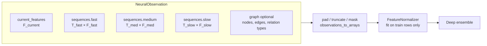

* Every sequence is ordered oldest → newest; `time_deltas[i]` is the age of step `i` in
  seconds relative to the observation time. Sequences are **left-padded** to `max_len`
  (the most recent step is always the last index) and carry a boolean mask. Rows that are
  all-NaN are treated as missing, so interior gaps are supported.
* Timescales, feature dimensions, horizons and thresholds all come from YAML — no
  Solana-specific names exist anywhere in the neural core.
* On disk, datasets use a flat `key → ndarray` layout: a directory of `.npy` files opened
  with `mmap_mode="r"` (never fully loaded), or `.npz`, `.pt`, or `.parquet` (streamed by
  row batch into memmaps). Optional graphs are stored as ragged arrays with offsets.
* `build_bars` turns a raw irregular event stream into fixed-resolution bars using only
  events at or before the observation time, which makes look-ahead impossible.

### 3. Network

```mermaid
flowchart TB
    subgraph Inputs
        cur[current features]
        fast[fast seq]
        med[medium seq]
        slow[slow seq]
        graph[graph - optional]
    end

    subgraph Experts[Specialised pathways]
        direction LR
        TR[Transformer expert<br/>pre-LN, causal, masked,<br/>time + recency encoding]
        RN[Recurrent expert<br/>GRU / LSTM, packed,<br/>gap-aware]
        TC[TCN expert<br/>dilated causal conv,<br/>multi-scale skips]
        SM[SSM expert<br/>selective state space,<br/>input-dependent Δ]
        TB[Tabular expert<br/>residual MLP]
        GR[Graph expert<br/>relational SAGE / GAT]
    end

    fast & med & slow --> TR & RN & TC & SM
    cur --> TB
    graph --> GR

    TR & RN & TC & SM & TB & GR --> Gate[Dynamic gating network<br/>softmax over available experts<br/>load-balance + entropy + z-loss]
    TR & RN & TC & SM & TB & GR --> Mix[Expert adapters<br/>Σ w_e · A_e h_e]
    Gate -- per-observation weights --> Mix
    Mix --> Lat[Latent encoder<br/>MarketStateEmbedding]
    Lat --> H1[return heads<br/>μ, log σ², quantiles]
    Lat --> H2[max-upside heads]
    Lat --> H3[max-drawdown heads]
    Lat --> H4[volatility heads]
    Lat --> H5[upside event heads]
    Lat --> H6[downside event heads]
```

#### 3.1 Multi-timescale processing (design choice)

Each sequence expert contains:

1. a **per-timescale input projection** of `[values·mask, log1p(age)·mask, mask]`
   (timescales may have different feature dimensions),
2. a **continuous time encoding** (learnable Fourier features of `log1p(age)`) plus a
   **learned timescale embedding**,
3. **one temporal core shared across timescales** (default) or one core per timescale,
4. masked pooling (last observed step + masked mean),
5. a **TimescaleFusion** module: attention pooling over the timescale summaries with
   missing timescales masked. Its weights are exposed for inspection.

**Why share the core?** The fast, medium and slow streams show the same kinds of
dynamics (momentum, bursts, reversals) at different speeds. A shared core sees roughly
three times more sequences per parameter, which regularises it strongly, and the
timescale embedding plus continuous age encoding still let it condition on resolution.
Independent cores stay available (`share_encoder_across_timescales: false`) for streams
that behave very differently.

At inference, a shared core encodes **all timescales in one call**: projected sequences
are left-padded to a common length and stacked on the batch axis. This is exact, not an
approximation: every core is invariant to extra left padding (key masking in the
Transformer, packed sequences in the RNN, zero-held unobserved steps in the TCN, Δ = 0
on unobserved steps in the SSM), and a
test asserts equality with per-timescale encoding. Training keeps per-timescale calls
so it doesn't pay for padding compute.

#### 3.2 Pathways

| Expert | Mechanism | What it specialises in |
|---|---|---|
| Transformer | pre-LayerNorm blocks, `scaled_dot_product_attention` with combined causal + key-padding mask, recency positional embedding + continuous time encoding, GELU feed-forward, residuals, dropout | long-range, content-addressed dependencies |
| Recurrent | GRU (default) or LSTM; observed steps are compacted chronologically and run as a *packed* sequence, so padding and interior gaps never touch the recurrent state | smooth sequential state accumulation |
| TCN | dilated causal convolutions (left padding only) in residual blocks; per-timestep LayerNorm (batch/group norm over time would leak the future); a learned softmax mixture of every block's output (multi-receptive-field skips) | local patterns, bursts, short shocks |
| SSM | selective state-space layers (Mamba-style): pre-LN, input projection into signal and gate, causal depthwise conv, input-dependent step Δ and B / C, diagonal scan `s_t = exp(Δ_t A) s_{t−1} + Δ_t B_t x_t`, `y_t = C_t s_t + D x_t`, SiLU gate, residual. Unobserved steps get Δ = 0 and zero input, so the state passes through gaps and padding unchanged. The scan is sequential in pure PyTorch: linear in length, no custom kernels | per-step choice of what to remember: bursts reset state, quiet periods keep it |
| Tabular | residual MLP (pre-LN residual blocks, GELU/SiLU, dropout) | immediate state without history |
| Graph (optional) | pure-PyTorch relational GraphSAGE or GAT (per-relation weights / attention bias), readout = target node ‖ mean pool | wallet→token, wallet→wallet, token→token structure |

**Why no PyTorch Geometric?** The graphs are small per-observation ego-graphs.
`index_add_`/`scatter_reduce` message passing is short, fast and dependency-free, so graph
support never breaks installation. Graphs are disabled by default and the repository works
without them.

#### 3.3 Mixture of experts

The gate receives every expert's layer-normalised latent plus availability flags and
outputs a per-observation softmax over experts:

* **Unavailable experts are masked**: a sequence expert whose timescales are all missing,
  the graph expert when a sample has no graph, and experts disabled at runtime
  (`set_disabled_experts`) all get weight exactly 0. If nothing is available the gate
  falls back to uniform weights instead of producing NaN.
* **Anti-collapse regularisation**:
  * *load balance* `E·Σ_e importance_e² − 1`, which is zero when batch-average usage is
    uniform but still allows sharp routing for individual samples;
  * a small *entropy bonus* on per-sample weights, so the gate doesn't saturate before
    evidence accumulates;
  * *z-loss* on gate logits, for stability;
  * *noisy gating* and *expert dropout* during training, so every expert keeps receiving
    gradient.
* The final gate layer is zero-initialised, so routing **starts uniform and is learned**.
  Nothing is hand-assigned.
* Fusion is `Σ_e w_e · A_e(h_e)` with an expert-specific adapter `A_e`, not a plain
  concatenation.

#### 3.4 MarketStateEmbedding

The mixture passes through a residual latent encoder with a final LayerNorm to give the
`latent_dim`-dimensional **MarketStateEmbedding**. It is returned with every prediction
and used for OOD scoring, drift detection, regime discovery, nearest-neighbour search and
downstream models. Deep-ensemble members learn different latent coordinate systems, so the
published embedding comes from one fixed member (`ensemble.embedding_member`) to keep its
geometry stable.

#### 3.5 Multi-task, multi-horizon heads

Each (task, horizon) pair has its own two-layer MLP. Per-horizon weights live in batched
tensors and are evaluated with one `einsum`.

| Task | Output | Activation |
|---|---|---|
| `return` | mean, log-variance, quantiles (default 10/50/90 %) | identity; quantiles are a base plus cumulative softplus increments, so they never cross |
| `max_upside` | mean, log-variance | softplus (non-negative) |
| `max_drawdown` | mean, log-variance | softplus (positive magnitude) |
| `volatility` | mean, log-variance | softplus |
| `upside` | logit of P(return > threshold_h) | sigmoid + calibration at inference |
| `downside` | logit of P(drawdown > threshold_h) | sigmoid + calibration at inference |

Log-variances are soft-bounded to `[-9, 5]` with `tanh`. The model works in *normalised
target space*: regression targets are scaled (not centred, so magnitudes stay
non-negative) by training-set RMS, and the engine maps outputs back to real units.

### 4. Losses

`MultiTaskLoss` combines the following (every component is logged separately):

* regression: heteroscedastic Gaussian NLL (default), Huber or MSE. With Huber or MSE, a
  detached-mean Gaussian NLL still trains the variance heads, so aleatoric uncertainty is
  always available;
* pinball loss on the return quantiles;
* classification: BCE, weighted BCE (`pos_weight` either automatic neg/pos or fixed) or
  focal loss;
* static task weights or learned homoscedastic uncertainty weighting (Kendall et al.);
* gate regularisers;
* target masks (unknown horizons) and per-sample weights (replay, retraining weights).

Class imbalance is handled with class weighting, focal loss, class-balanced sampling and
rare-event oversampling, each configurable independently.

### 5. Training engine

`Trainer.fit` trains a single network and is deliberately transparent. It supports:

* CPU, CUDA and MPS devices;
* mixed precision where safe (CUDA bf16, or fp16 with `GradScaler`; MPS only on explicit
  request);
* gradient accumulation and clipping;
* cosine-with-warmup, one-cycle, plateau or constant LR schedules;
* early stopping on validation loss, restoring the best weights;
* per-epoch checkpoints with exact resume (optimizer, scheduler, scaler and RNG states);
* deterministic seeding;
* NaN/Inf detection that skips bad steps and aborts after N consecutive ones;
* JSONL metrics.

`train_engine` (in `training/pipeline.py`) runs the complete recipe:

1. Chronological split with an **embargo** equal to the longest horizon, because a label at
   time *t* looks up to *t + horizon* into the future.
2. Fit the normaliser on **training rows only**.
3. Train each ensemble member independently (own seed, data order and optional bootstrap).
4. Fit probability calibration on the **validation** split.
5. Record reference uncertainty statistics.
6. Fit the OOD detector and regime clusters on training embeddings.
7. Compute validation metrics and write the checkpoint metadata.

### 6. Uncertainty

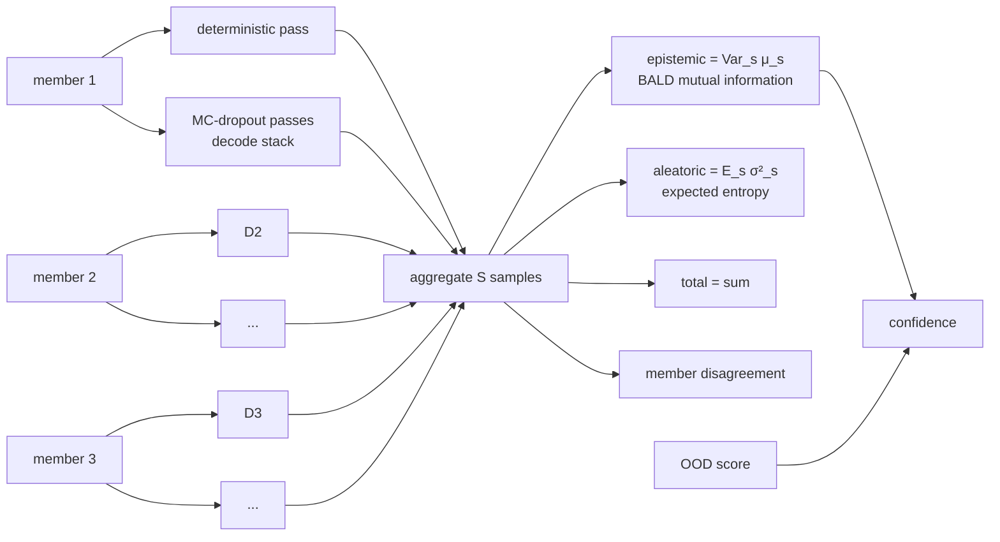

* **Deep ensemble**: `ensemble.size` independently initialised and independently trained
  full networks (default 3).
* **MC dropout**: `mc_dropout_samples` extra stochastic passes per member, seeded so
  inference stays deterministic. The expensive expert encoders run once per member; dropout
  is resampled only in the gate → mixture → latent → heads stack. This cut
  single-observation latency by about 3× and still gives within-member stochasticity, while
  encoder-level diversity comes from the ensemble.
* Regression uncertainty follows the law of total variance; classification uses the
  information-theoretic split (total entropy = expected entropy + mutual information).
* **Confidence** = `1/(1 + epistemic/median_val_epistemic) · exp(−penalty·max(0, ood−1))`.
  It is 0.5 at typical validation uncertainty, approaches 1 when members agree, and decays
  outside the training distribution.

### 7. Calibration and OOD

* `CalibrationSet` holds one calibrator per (event task, horizon): temperature scaling,
  Platt scaling or isotonic regression. Calibrators are fitted on validation data only and
  stored as plain JSON. Brier score, ECE, log loss and reliability bins are recorded
  before and after calibration.
* `OODDetector` combines three signals, each normalised by its 99th percentile on training
  data:
  1. Mahalanobis distance of the embedding (shrinkage covariance);
  2. RMS z-score of raw inputs;
  3. ensemble epistemic uncertainty.

  An `ood_score` above 1 means "outside familiar territory" and lowers confidence.

### 8. Checkpoints

Each model version is an immutable directory written atomically:

```
<version>/
  manifest.json      version, parent, created_at, git commit, data fingerprint,
                     ensemble metadata (size, seeds, embedding member, MC samples),
                     training statistics, reference statistics, target definitions,
                     horizons, expert names, format/torch/package versions
  config.yaml        full configuration (architecture, horizons, everything)
  members/member_i.pt   weights (loaded with torch.load(weights_only=True))
  normalizer.json    normalisation state
  calibration.json   calibrators + calibration report
  ood.json           OOD detector
  regimes.json       regime clusterer
```

Everything needed to reproduce inference exactly is in the directory. Tests check that a
reload gives bit-identical outputs.

### 9. Performance

Measured on a 4-core Intel Xeon @ 2.1 GHz (CPU only) with the **default** configuration
(3 members × ~729 k parameters, five experts including the SSM, sequence lengths 64/48/32):

| MC samples | single obs p50 | batch 32 | batch 256 |
|---|---|---|---|
| 2 (default) | ~49 ms | ~190 ms (≈170 obs/s) | ~1.2 s (≈215 obs/s) |
| 0 | ~39 ms | ~150 ms (≈210 obs/s) | ~1.1 s (≈235 obs/s) |
| `cpu-lite` profile (2 × 168 k, MC 0) | ~21 ms | ~88 ms (≈365 obs/s) | ~0.4 s (≈640 obs/s) |

The SSM scan is a plain loop over time. On CPUs it measured faster than a parallel prefix
scan, which is memory-bound at these batch sizes.
Peak RSS was about 1 GB (0.8 GB for `cpu-lite`), including PyTorch itself. A GPU is much faster; widths, depths
and sequence lengths can be scaled up or down in YAML. Measure your own hardware with
`nardis-neural benchmark`.

#### 9.1 Hardware profiles

`nardis_neural.hardware` scales one architecture to the machine. `nardis-neural hardware`
prints what was detected, and `train --profile auto` (or `solana bootstrap --profile …`)
applies it:

| profile | model per member | ensemble / MC passes | parameters per member | picked when |
|---|---|---|---|---|
| `cpu-lite` | d = 32, 1-layer experts, SSM state 8 | 2 / 0 | ≈ 0.17 M | CPU with < 8 cores |
| `cpu` | d = 48, 2-layer experts, SSM state 16 | 3 / 1 | ≈ 0.39 M | CPU with ≥ 8 cores |
| `gpu` | d = 128, 3-layer experts, 2 SSM layers | 5 / 2 | ≈ 3.2 M | CUDA or Apple MPS |
| `gpu-frontier` | d = 256, 6-layer Transformer, 4 SSM layers with state 32 | 5 / 4 | ≈ 16.6 M | CUDA with ≥ 16 GB |

Every profile produces the same inputs and outputs, so checkpoints, the lifecycle and the
Solana modules work unchanged. GPU profiles use mixed precision where it is safe.

## Continual learning

The model keeps learning from newly labelled market observations. The production champion
is never trained, mutated or overwritten in place.

### 1. The loop

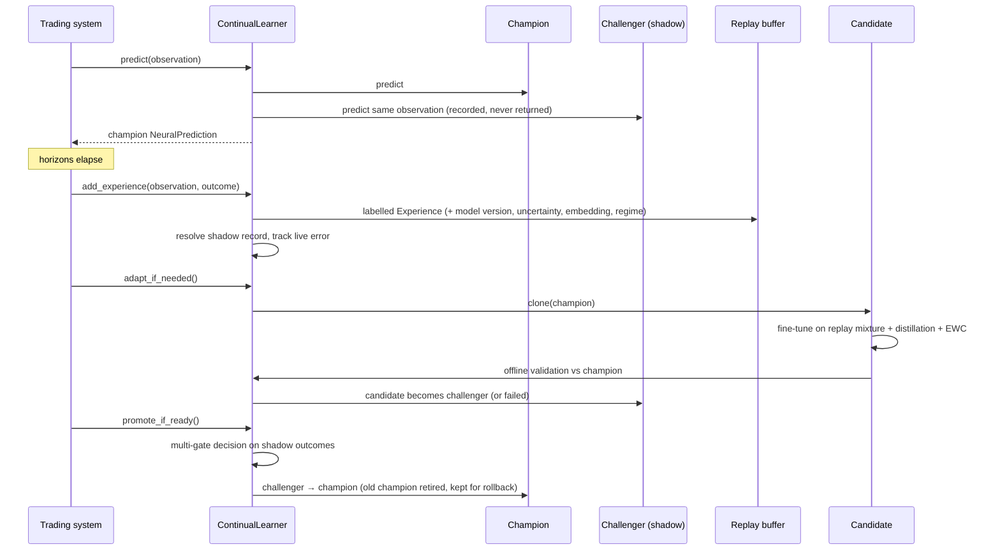

### 2. Experiences and replay

`Experience` holds the observation arrays, timestamp, targets and target mask, the version
of the model that made the original prediction, its prediction summary, its uncertainty,
the latent embedding and regime cluster at prediction time, a priority (the standardised
error of the original prediction) and a rare-event flag.

`ExperienceReplayBuffer` keeps three pools. None of them simply drops old data when full.

| Pool | Policy |
|---|---|
| recent | FIFO of the newest experiences |
| historical | reservoir sample (algorithm R) of everything that ever left the recent pool, i.e. unbiased long-term memory |
| rare | protected store of extreme outcomes; when full, the lowest-priority/oldest item is evicted |

Sampling strategies: `uniform`, `recency` (exponential half-life), `prioritized` (PER with
importance weights `(N·P)^-β`), `rare`, `regime_balanced`. `sample_mixture` combines pools
with configurable fractions. The buffer is persisted as memory-mappable arrays plus JSON
metadata and an embeddings matrix.

### 3. Frequent adaptation (`adapt`)

Triggered when `continual.min_new_samples` new experiences have arrived.

1. **Validation window**: the most recent `adapt_validation_fraction` of the *new*
   experiences. They are never used for training.
2. **Eligible training data**: experiences with timestamp ≤ `validation start − embargo`,
   so no label window overlaps validation.
3. **Replay mixture** (`adapt_samples` rows): recency-weighted recent
   (`recent_fraction`), uniform historical (`historical_fraction`), rare events
   (`rare_fraction`) and high-error "difficult" samples (`difficult_fraction`).
4. **Candidate = deep clone of the champion.** It shares no tensors, normaliser or
   calibrator objects, and a test asserts this.
5. **Conservative fine-tuning**: `adapt_learning_rate`, `adapt_epochs`, gradient clipping,
   early stopping on the validation window. The champion's normaliser is kept, so the input
   space doesn't move.
6. **Objective** = supervised multi-task loss
   + **distillation** from a frozen copy of the champion (teacher outputs computed under
   `no_grad`, i.e. detached): binary KL on tempered event probabilities (× T²), MSE on
   regression means and log-variances, and a cosine term on embeddings
   + **EWC** penalty `λ/2 Σ F_i(θ_i − θ*_i)²`, with the diagonal Fisher estimated on
   historical replay at the champion's parameters and normalised to mean 1.
7. Refit calibration, OOD and regimes for the candidate.
8. **Offline gate on a true holdout**: the validation window is split chronologically.
   The earlier half drives early stopping and calibration; the later half is never seen
   by the candidate. On that holdout, compare the mean relative change in return RMSE and
   event log losses against the champion. Above `offline_max_degradation` → status
   `failed`; otherwise → `challenger` (shadow mode). Windows under 20 samples are not
   split.

### 4. Periodic full retraining (`full_retrain`)

Triggered by `full_retrain_min_new_samples`, or by input drift between the historical and
recent replay pools (`full_retrain_on_drift`).

* A **fresh** ensemble is trained from scratch, with a new normaliser fitted on the new
  training split.
* Data: every replay experience plus an optional external dataset (e.g. a fresh export
  from the trading system).
* Per-sample loss weights, all configurable and none hard-coded:
  `recent_weight` (last `full_retrain_recent_window` experiences) versus
  `historical_weight`, multiplied by `rare_weight` for rare events and by
  `difficult_weight` for the top-20 % priority samples. Weights are normalised to mean 1.
* Chronological split with embargo; the same held-out offline gate; enters shadow mode as a
  challenger.

### 5. Self-supervised pretraining

`pretrain_encoders` trains the sequence experts on **unlabelled** data before supervised
training:

* **masked timestep reconstruction**: whole observed steps are blanked and reconstructed.
  With causal encoders this becomes a forecasting-style objective;
* **masked feature reconstruction**: individual (step, feature) entries are blanked and
  reconstructed;
* **contrastive**: NT-Xent between two augmentations (jitter, scaling, step dropout) of
  each sample's fused multi-timescale representation.

Encoder weights (`experts.*`) are then loaded into every ensemble member
(`train --pretrained`). Pretraining is optional; supervised training works without it.

### 6. Shadow mode

When a challenger exists, `ContinualLearner.predict` runs it on the **identical**
observation arrays, stores both predictions in `shadow/records.jsonl`, and returns only
the champion's `NeuralPrediction`. When outcomes arrive the records are resolved. The
`ShadowReport` then compares the two models:

* overall and per-horizon regression error, log loss, Brier score, ECE, AUC, ranking
  quality (Spearman), uncertainty quality (Gaussian NLL, 90 % coverage, uncertainty–error
  rank correlation), tail-event MAE for returns and drawdowns, downside tail recall;
* the same metrics per regime cluster;
* the same metrics per consecutive time window.

`shadow-evaluate --data` replays a labelled dataset through both models offline.

### 7. Promotion

`evaluate_promotion` produces an auditable `PromotionDecision`. It is saved as JSON and
Markdown in `reports/`.

| Gate | Default rule |
|---|---|
| `min_observations` (required) | ≥ `min_observations` resolved shadow samples |
| `return_rmse` (required) | challenger ≤ champion × `max_rmse_ratio` |
| `log_loss` (required) | mean event log loss ≤ champion × `max_log_loss_ratio` |
| `tail_mae` (required) | tail return/drawdown MAE ≤ champion × `max_tail_mae_ratio` |
| `brier` | ≤ champion × `max_brier_ratio` |
| `calibration_ece` | ≤ champion + `max_ece_increase` |
| `rank_corr` | ≥ champion + `min_rank_corr_delta` |
| `uncertainty_nll` | ≤ champion + `max_nll_increase` |
| `time_consistency` | challenger wins ≥ `min_window_win_fraction` of time windows |
| `regime_consistency` | no regime degrades by more than `max_regime_degradation` |

A challenger is promoted only if every required gate passes **and** at least
`min_passed_fraction` of all gates pass. It is never reduced to a single metric.

### 8. Rollback

Each model directory is complete and immutable, so a rollback only moves the registry's
champion pointer. That restores weights, normaliser, calibration state, configuration and
ensemble membership together.

* Manual: `nardis-neural rollback --workspace W [--to VERSION]`, or
  `learner.rollback()`.
* Automatic (**off by default**, `lifecycle.auto_rollback: true` to enable): after a
  promotion, the live mean absolute return error of the champion's resolved predictions is
  compared with the challenger's shadow MAE at promotion time. If it exceeds
  `baseline × (1 + auto_rollback_degradation)` over `auto_rollback_min_observations`
  samples, the previous champion is restored.
* After every promotion, `ModelRegistry.prune(lifecycle.keep_champions)` deletes the
  weights of failed models and of retired models beyond the newest `keep_champions` (5)
  former champions, which stay available as rollback targets. Registry entries and the
  audit log are kept. This keeps disk use bounded when the learner runs for months.

### 9. Lifecycle states

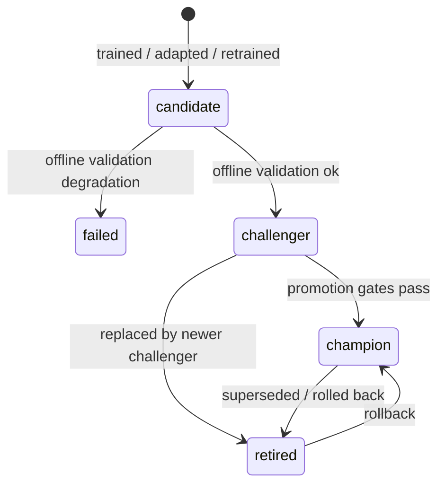

### 10. Time-series safety

* `chronological_split`, `walk_forward_splits` (expanding or rolling) and
  `rolling_window_splits` never shuffle across time and apply an embargo ≥ the longest
  label horizon.
* Normalisation, calibration, OOD references and regime clusters are fitted only on data
  that precedes the corresponding validation period.
* Hypothesis property tests assert `max(train time) ≤ min(validation time) − embargo` for
  arbitrary timestamp sets.

## Integrating with the trading system (Nardis)

The trading system only needs four calls and three schemas. It never needs to know about
experts, ensembles, normalisation or checkpoints.

### Quickstart: the Solana addon as a sidecar (any language)

Nardis does not need to be written in Python. Run the addon next to it as a local HTTP/JSON
service and call it from anything:

**One-time setup from real data** (on the machine that will run it):

```bash
export SOLANA_RPC_URL=https://…                          # read-only RPC; never a wallet key
nardis-neural solana fetch-history --out data/hist --hours 12   # resumable; rerun to continue
nardis-neural solana bootstrap --events data/hist --workspace ws
nardis-neural solana moonshot-research --workspace ws      # entry (tail) model
nardis-neural solana tape-research --workspace ws          # crash / collapse model
nardis-neural solana stopping-research --workspace ws      # exit model (--utility power for runner mode)
```

* `fetch-history` keeps only tokens created inside the window, SOL-priced. On a hosted node
  it replays about 1.6 hours of history per hour (measured: 0.63x real time with 6 workers),
  so 12 hours of history takes about 7 to 8 hours.
* For long windows on a 16 GB machine, set `sample_interval_seconds: 60` in `ws/solana.yaml`
  before `tape-research`. 10-second snapshots of a busy day exceed 16 GB.

**Train on Nardis's trade archive** (SQLite write buffer + Parquet archive):

```bash
nardis-neural solana meta-train --workspace ws --archive /data/nardis/parquet          # all history
nardis-neural solana meta-train --workspace ws --archive /data/nardis/buffer.db --table trades
```

**Run** (every day), training itself on the archive as it grows and pushing moonshots to Nardis:

```bash
nardis-neural solana serve --workspace ws --port 8787 --archive /data/nardis/parquet \
    --alert-url http://127.0.0.1:9000/moonshot --alert-target 10 --alert-min-edge 2
```

With `--alert-url`, the sidecar scans the live market every 5 seconds (`--alert-every`) and
**POSTs each new candidate to Nardis the moment it qualifies**, once per token per hour:
`{"type": "moonshot", "target": 10, "candidate": {mint, age_seconds, p_ge_2x … p_ge_1000x,
edge_2x … edge_1000x, chase_target, trust, p_collapse_1m, flags, …}}`. A failed delivery is
retried at the next scan and never stops the scanner. `GET /health` shows scans, sent alerts
and errors.

* The archive is a Parquet file or a directory (read recursively, so date-partitioned layouts
  work), or an SQLite `.db` with `--table`. The live service rescans it every 10 minutes
  (`--archive-every`) and learns **only trades it has not seen yet**, by trade id. It is
  crash-safe: a half-written file is retried at the next scan.
* Columns are found by common names:
  `trade_id|id|signature`, `mint|token|token_address`, `entry_time|open_time|…`,
  `exit_time|close_time|…`, and the result as `multiple`, or `entry_sol` + `exit_sol`, or `return`
  (fraction; `--return-percent` for percent), plus optional `peak_multiple|max_multiple`.
  Map anything else with `--map field=column` (repeatable). Timestamps can be Unix seconds,
  milliseconds or datetimes. Open trades (no result yet) are skipped until they close.
* **Every other numeric column becomes a feature** (Nardis's signals at entry), or choose them
  with `--features a,b,c`. Only use values Nardis knew *at entry*; an exit-time column used as
  a feature would leak the answer.
* A replay retrains once at the end (not every 25 trades), and the champion / challenger rule
  applies. The model is deployed only if it beats the base rate on the newest 20 % of the
  archive.

| call | when Nardis makes it | returns |
|---|---|---|
| `GET /health` | at start-up, then periodically | market clock, tracked tokens, installed models, learner status |
| `GET /tokens?active_seconds=120` | to see what is live | active tokens, youngest first, with age and venue |
| `GET /moonshots?target=10&min_edge=2` | to look for entries | tokens still in the entry window whose odds of reaching the target are at least `min_edge` times its break-even, best first, vetoed tokens excluded |
| `GET /ranking?limit=20` | to look for entries | moonshot candidates with `chase_score`, expected multiple, P(≥10x / ≥100x), trust, crash risk, flags |
| `GET /assess?mint=…` | for one token | the full assessment (risk, tail, tape, edge, guard) |
| `POST /advise_trade` | **before every trade** | P(win / 10x / 100x) learned from Nardis's own trades, expected multiple, size multiplier 0–2, veto + reason |
| `POST /settle_trade` | **after every trade closes** | the learner updates (and refits when due) |
| `POST /hold_advice` | while a position is open | sell-now vs continuation value, P(collapse within 1 / 5 / 15 min) |
| `POST /allocate` | when sizing | recommended stakes under the capital engine's limits |
| `POST /ingest` | optional: push the chain transactions Nardis already receives | decodes `getTransaction` JSON (`jsonParsed`) into the brain; lets you run with `--no-stream` |
| `POST /save` | on shutdown (also automatic every 5 minutes) | checkpoints the workspace |

```bash
curl -s localhost:8787/advise_trade -d '{"trade_id": "t-123", "mint": "<mint>",
     "features": {"nardis_score": 0.82, "signal_strength": 3.1}}'
# example response: {"p_win": 0.41, "p_10x": 0.05, "p_100x": 0.004, "expected_multiple": 1.12,
#  "size_multiplier": 1.3, "veto": false, "reason": "learned; chase 10x (edge 1.6x break-even)",
#  "evidence": 212, "source": "learned",
#  "chase": {"p_2x": 0.31, "edge_2x": 1.3, "p_5x": 0.11, "edge_5x": 1.6, "p_10x": 0.05, "edge_10x": 1.6,
#            "p_100x": 0.004, "edge_100x": 1.3, "chase_target": 10.0, "chase_edge": 1.6, "proven_100x": 0.0, …}}

curl -s localhost:8787/settle_trade -d '{"trade_id": "t-123", "multiple": 1.8, "peak_multiple": 3.1}'
curl -s localhost:8787/hold_advice -d '{"mint": "<mint>", "t_signal": 1790650000}'
```

* `features` is any set of named numbers Nardis has for the trade. Keep the names stable
  between trades; new names are picked up automatically.
* `multiple` is SOL returned per SOL staked, fees included. `peak_multiple` (optional) is the
  best the position reached, which sharpens the 10x / 100x learning.
* Every answer is advice. The service cannot sign or send transactions.
* Latency on a 4-core CPU: `advise_trade` 1.3 ms median (Nardis's features only,
  `"with_market": false`), about 20 ms with the addon's full market assessment of the token (the
  default). Requests are serialised with a lock, since the brain is not thread-safe.
* **Live feed.** `serve` polls pump.fun through the RPC with 6 parallel workers (`--workers`) and
  kept-alive connections; add `--pumpswap` to also follow graduated tokens (much heavier).
  A hosted node fetches about 58 transactions/s, below pump.fun's peak of about 80
  successful transactions/s, so on a busy day the feed lags and skips the oldest backlog
  (counted, never silent). If Nardis already has a full feed (e.g. Yellowstone gRPC), push
  it through `POST /ingest` instead and run with `--no-stream`.
* **Memory.** The sidecar runs in bounded-memory mode: it keeps no event history, and tokens idle
  for two hours are forgotten at each maintenance, so it can run for weeks.
* Bind to `127.0.0.1` (the default). The API has no authentication, so never expose it to a
  network without a firewall.

### 1. Install

```bash
pip install -e /path/to/this/repo      # Python ≥ 3.12, PyTorch ≥ 2.2
```

### 2. Build observations

Map your market state onto generic tensors. Feature *meaning* is up to you, but it must
be consistent between training data and live observations, and the dimensions must match
`features` in the config.

```python
import numpy as np
from nardis_neural import NeuralObservation, SequenceInput

obs = NeuralObservation(
    observation_id="SoLToken123:1718000000.25",  # any unique string
    timestamp=1718000000.25,  # prediction time, unix seconds
    current_features=np.asarray(current_vec, np.float32),  # (current_dim,)
    sequences={
        "fast": SequenceInput(values=bars_1s),  # (T, 6) oldest → newest
        "medium": SequenceInput(values=bars_5s),  # (T, 6)
        "slow": SequenceInput(
            values=bars_30s,  # (T, 7), optional
            time_deltas=ages_30s,
            mask=observed_30s,
        ),
    },
)
```

* Missing timescales can simply be omitted. Missing values may be NaN; all-NaN rows count
  as missing steps.
* Longer histories are truncated to the most recent `max_len` steps; shorter ones are
  padded internally.
* If you have a raw event stream instead of bars, use
  `nardis_neural.data.sequences.build_bars(event_times, event_values, now, timescale)`.
  It only uses events at or before `now`.
* An optional `GraphInput` (node features, `edge_index`, `edge_type`, `target_node`)
  carries wallet/token relations when `model.graph.enabled` is true.

### 3. Predict

```python
from nardis_neural import NeuralEngine

engine = NeuralEngine.load("workspaces/prod")  # registry root → loads current champion
pred = engine.predict(obs)  # or engine.predict_batch([...])

pred.expected_returns["2m"], pred.return_std["2m"]
pred.upside_probabilities["30s"], pred.downside_probabilities["5m"]  # calibrated
pred.maximum_upside, pred.maximum_drawdown, pred.predicted_volatility
pred.epistemic_uncertainty, pred.aleatoric_uncertainty, pred.total_uncertainty
pred.confidence, pred.ood_score, pred.member_disagreement
pred.market_embedding, pred.expert_weights, pred.regime_cluster
```

`NeuralPrediction` is a Pydantic model (`model_dump()` / `model_dump_json()`). It contains
**no trade decision**. How to act on probabilities, uncertainty and OOD scores is the
trading system's own responsibility.

### 4. Learn continuously

Use `ContinualLearner` instead of a bare engine when you want the loop that serves, shadows
and learns:

```python
from nardis_neural import ContinualLearner, NeuralOutcome

trainer = ContinualLearner("workspaces/prod")

pred = trainer.predict(obs)  # champion output; challenger shadows silently

# ... once the longest horizon has elapsed (partial horizons are fine):
trainer.add_experience(
    obs,
    NeuralOutcome(
        observation_id=obs.observation_id,
        returns={"30s": 0.012, "2m": -0.004, "5m": 0.031},  # log returns
        max_upside={"30s": 0.02, "2m": 0.02, "5m": 0.05},
        max_drawdown={"30s": 0.004, "2m": 0.015, "5m": 0.015},  # positive magnitudes
        volatility={"30s": 0.006, "2m": 0.011, "5m": 0.019},
    ),
)

# maintenance — on a timer or background worker, never on the hot path:
trainer.adapt_if_needed()  # clone champion → fine-tune → challenger
trainer.full_retrain_if_needed()  # fresh ensemble on weighted replay (+ drift trigger)
trainer.promote_if_ready()  # multi-gate decision on shadow outcomes
trainer.save()  # persist replay buffer, shadow records, counters
```

`examples/nardis_integration.py` is a complete runnable version of this, including a
`NeuralBrain` adapter class and bar construction from raw events. It is exercised by the
test suite.

### 5. Bootstrapping from historical data

Export historical observations with realised outcomes into any supported format (a
directory of `.npy`, `.npz`, `.pt` or `.parquet`; see `data/loaders.py` for keys and
columns), then:

```bash
nardis-neural init-config --out configs/nardis.yaml        # edit dims / horizons / thresholds
nardis-neural pretrain --data exports/unlabelled --config configs/nardis.yaml --out models/pre.pt   # optional
nardis-neural train --data exports/history.parquet --config configs/nardis.yaml \
    --workspace workspaces/prod --pretrained models/pre.pt
```

Parquet layout: `observation_id` (string), `timestamp` (float), `current` (list<float>),
`seq_<name>_values` (list<list<float>>, any length), optional `seq_<name>_time_deltas`,
`target_<task>_<horizon>` (float, null = unknown) for tasks `return`, `max_upside`,
`max_drawdown`, `volatility`.

### 6. Operational notes

* **Threading**: engines are read-only at inference. Maintenance (adapt, retrain) is CPU-
  or GPU-heavy, so run it in a separate process or worker that shares the workspace, and
  reload the champion (`NeuralEngine.load`) after a promotion.
* **Latency**: see `docs/ARCHITECTURE.md` §9 and `nardis-neural benchmark`.
  `ensemble.mc_dropout_samples: 0` and smaller sequence lengths reduce latency.
* **Monitoring**: `nardis-neural drift-report --reference … --current …` reports input,
  embedding, prediction and error drift. `nardis-neural status --workspace …` shows
  lifecycle state.
* **Safety**: the champion directory is immutable. Promotions and rollbacks only move a
  pointer in `registry.json`, and every transition is appended to its audit log.

### Forward test: score the ML signals before trusting them

`SolanaBrain` keeps a **forward-test ledger** (`nardis_neural.solana.forward`) that records
what the signals would have done, as they fire, with nothing chosen in hindsight:

* a paper ticket opens the first time a token is inside the moonshot entry window, is not
  vetoed by the manipulation guard, and its expected ladder payoff is at least the ticket;
* the Tape Transformer's collapse alarm (window and threshold chosen by `tape-research` on
  its tune period) arms an early exit;
* the ticket settles once its run is over, by simulating the ladder plus the alarm on the
  real pool path (latency, impact and fees included).

It runs inside every assessment round, so:

* during `solana stream` it is the **paper-trading scorecard** of the ML layer;
* during `solana stream-train` over weeks of history it is a **walk-forward backtest of the
  live system** at scale: every model refit, promotion and eviction happens exactly as it
  would live.

```bash
nardis-neural solana forward-report --workspace workspaces/sol
```

The report gives tickets, total paper PnL, mean and median multiple with a bootstrap CI,
hit rates, the number of alarm exits, predicted versus observed P(≥10x), and how the top
quintile by `chase_score` did compared with the rest. Compare it with your own algorithm's
paper results on the same days before letting the signals size real positions.


### Learning from Nardis's own trades (meta-labeling)

The rest of the addon learns from **the market**. `nardis_neural.solana.metalabel` learns from
**Nardis itself**: which of its own trades work, so that setups that keep failing get flagged
and shrunk and setups that keep working get more weight. Nardis stays in charge of every
decision; this layer only returns numbers.

```python
from nardis_neural.solana.metalabel import TradeOutcome, TradeProposal

# before each trade: send whatever named numbers Nardis has for it
advice = brain.advise_trade(
    TradeProposal("trade-123", mint, now, {"nardis_score": 0.82, "entry_reason": 3.0})
)
advice.p_win, advice.p_10x, advice.p_100x  # probabilities learned from Nardis's own history
advice.expected_multiple  # Duan-smeared, so fat tails are not underestimated
advice.size_multiplier  # scale Nardis's own stake: 0 … 2
advice.veto, advice.reason  # a pattern that has been losing
advice.source  # "prior" (base rates) or "learned"

# after the trade closes (peak_multiple optional; it sharpens the 10x / 100x labels)
brain.settle_trade(TradeOutcome("trade-123", exit_time, multiple=1.8, peak_multiple=3.1))
brain.save()  # persists history and models in ws/meta/
```

`advise_trade` joins Nardis's features with the addon's own view of the token at that moment
(moonshot, tape, edge and risk outputs, criticality and cluster features, all prefixed
`addon_`), so the learner can also discover *which addon signals matter for Nardis's style*.

How it stays honest:

* **Cold start.** Until 50 trades have settled, answers are Jeffreys-prior base rates of the
  trades so far (size 1, no vetoes). No model is ever used before it has evidence.
* **Champion / challenger.** Every 25 settled trades it refits in time order: trained on the
  older 80 %, scored on the newest 20 %. A model is deployed only if it beats the base rate
  there (log loss for the win / 10x / 100x classifiers, squared error for the value model).
  Otherwise the base rate stays. Pure-noise features are therefore never deployed (tested).
* **Tails need evidence.** The 10x and 100x classifiers need at least 8 positive and 8 negative
  trades before they are even tried. Until then P(10x) and P(100x) are base rates, capped by
  P(win).
* **Veto only when both signals agree.** A veto needs P(win) below half the average *and* an
  expected multiple below 1.

On a synthetic stream where a hidden quality drives outcomes, after 800 trades it ranks
winners at AUC > 0.75 on 400 later proposals. It sizes the best sixth of proposals above 1.2x and the
worst sixth below 0.8x, and the trades it vetoes lose on average while the rest make money. The
real test is Nardis's paper trades: the more it trades, the better this layer gets.

## Solana intelligence layer (`nardis_neural.solana`)

The generic neural brain forecasts from abstract tensors. This package teaches it
Solana. It turns raw on-chain activity (pump.fun launches, swaps, AMM migrations, LP
changes, SOL transfers) into causal, market-microstructure-aware observations, learns
which wallets matter, estimates launch risk, and produces cost-aware assessments.

It is still an ML module: **no private keys, no RPC writes, no transaction submission,
no BUY/SELL instructions.** Your trading system decides what to do with the numbers.


### 1. Protocol maths (`amm.py`)

* **pump.fun bonding curve**: virtual reserves 30 SOL / 1.073 B tokens, a 1 % fee,
  graduation after about 85 real SOL (≈ 793 M tokens sold), with bonding progress.
* **Constant-product AMM pools**: 0.25 % fee, exact buy and sell output.
* **`round_trip_cost(pool, size)`**: the fraction lost by buying `size` SOL and
  immediately selling everything back (two fees plus two-way price impact). This is the
  hurdle every forecast has to clear, and it feeds both the features and the labels.

### 2. Causal market state (`events.py`, `market.py`, `wallets.py`)

`SolanaMarket.ingest(event)` must be called in time order; it rejects events that go back
in time. For each token it keeps columnar NumPy logs of swaps, reserves and liquidity,
plus incremental holder balances, first-buy slots and creator bookkeeping.

**Wallet intelligence**
* *Funding clusters*: SOL transfers link funder and funded wallet in a union-find
  structure. **Hub detection** stops exchange hot wallets from gluing the whole market
  into one cluster (a source that funded more than `hub_threshold` wallets stops merging).
* *Reputation*: every buy is queued. Once `reputation_horizon` seconds of **market time**
  have passed, the realised move (read from state that now exists) updates a
  Beta-Bernoulli posterior for the buyer. Reputations are therefore learned online and are
  never informed by the future.
* *Rug attribution*: a creator dumping at least `dev_dump_fraction` of its bag marks the
  creator's whole funding cluster; an LP pull marks the wallet that pulled it.

`EventStore` persists history as one Parquet table per event type and replays it in
canonical order (launch → transfer → migration → LP → swap at equal timestamps).

### 3. Features (`features.py`)

76 named current-state features (`CURRENT_FEATURES`):

| Group | Features |
|---|---|
| Lifecycle / pool | age, #swaps, time since last trade, bonding progress, migrated, real liquidity and its 5-minute change, market cap, round-trip cost, drawdown from ATH, run-up from low |
| Price action | 5s / 30s / 60s / 300s log returns, 30s / 300s realised volatility |
| Order flow | buys and sells per minute, buy ratio, buy-SOL share, 60s and 300s net SOL flow, volume, unique buyers and sellers, new-trader share, average buy size |
| Holders & insiders | #holders, top-10 share, HHI, Gini, dev share, dev sold fraction, **sniper share** (first N slots), **bundle share** (co-funded early buyers), **fresh-wallet share**, **creator-cluster share** |
| Smart money & bots | reputation-weighted **smart flow**, #smart buyers, **bot share**, **rug-associated share** |
| Execution competition | priority fees, **Jito tip share**, slot density |
| Token safety | mint and freeze authority revoked, LP burned fraction |
| Edge dynamics | bonding-curve velocity, holder growth, smart-buyer share, top-holder sell share, buy acceleration |
| Runner skill | share of the last minute's buy SOL from wallets with proven **runner skill**, #runner-skilled buyers in 5 min, mean runner skill of the first 20 buyers |
| Sybil-resistant counts | #holder funding clusters, clusters ÷ holders, #buyer clusters per minute, **supply held by the largest hidden multi-wallet cluster** (not the creator's; relay hops included) |
| Creator family | prior launches, best prior peak multiple, prior rug rate, prior graduation rate, time since the family's last launch |
| Criticality | Hawkes branching ratio of buys and of sells, its two-minute trend, herding timescale, endogenous share of buys ([CRITICALITY.md](docs/CRITICALITY.md)) |
| Market heat | launches in 10 min, graduations in 1 h, total swap volume in 5 min (all tokens) |
| **Narratives** | heat of the token's hottest name/symbol word (other tokens with that word climbing 2x…1000x, 30-min half-life, its own run excluded), copycats with the same name or symbol in the last hour, copies a token that reached 5x in the last 6 h ([narrative.py](src/nardis_neural/solana/narrative.py)) |

**Runner skill** is a second, separate wallet reputation. A buy in a token's first
`tail_entry_window` seconds (300) counts as a success if the price later reaches
`tail_multiple` × the entry price (10x) within `tail_horizon_seconds` (1.5 h). The skill
is an evidence-shrunk log-lift of the wallet's hit rate over a Beta(0.1, 1.9) prior (base
rate 5 %). Being good at 60-second scalps and being early to runners are different skills.
A **hit is credited the moment the price crosses the target**; only a miss waits for the
full horizon. The first real-data runs showed why this matters: with 90-minute-late credit,
runner skill stayed blind for the first 1.5 hours of any window and live trading learned of
a wallet's hit long after it happened.

**Narratives** come from the token's name and symbol (carried on `TokenLaunch` from the
pump.fun creation event). Memecoins run in themes: when a cat token runs, other cat tokens
get bought, and a hot name draws copycats within minutes.

A **creator family** is the creator's funder, or the creator itself when the funder is an
exchange-like hub (more than `hub_threshold` funded wallets). Serial deployers who spin up
a fresh wallet for every launch from the same source are therefore tracked together. Its
record covers the family's earlier launches still in memory plus every finished one, with
peaks measured only up to the snapshot time.

**Trade bars** (fast 1 s × 60, medium 5 s × 48, slow 30 s × 40) carry 10 features each:
return, realised vol, volume, buy share, #trades, #unique wallets, net flow, liquidity,
priority fee, high-low range. Prices are **forward-filled through quiet bars**, so "nobody
traded" is information rather than missing data. Bars before launch are masked.

**Wallet graph**: the token plus its `graph_top_k` most active wallets (node features:
volume, position, reputation, evidence, is-creator, is-sniper, cluster size) with
three edge types: `wallet_trades_token`, `wallet_funded_wallet` and
`wallet_same_cluster`. This feeds the neural graph expert (GraphSAGE/GAT) directly.

### 4. Labels (`labels.py`)

Labels come from the **complete** history; features come from a causal replay. The two
never mix.

* Per horizon (default 15 s / 60 s / 5 m): log return, max upside, max drawdown, realised
  volatility. Horizons that aren't complete yet are omitted, and masked in training.
* **Cost-aware returns**: `expm1(return) − round_trip_cost(trade_size_sol)`.
* **Risk events** within `risk_horizon_seconds`:
  * `rug`: price crash ≥ `rug_price_drop`, or an LP pull ≥ `rug_liquidity_drop`, without
    graduating;
  * `graduation`: the bonding curve completes and migrates;
  * `dev_dump`: the creator sells ≥ `dev_dump_fraction` of what it held.

### 5. Datasets without leakage (`dataset.py`)

`build_solana_dataset(history, cfg)` replays history into a fresh market and takes
snapshots every `sample_interval_seconds` while a token is still trading. The sampling
schedule is itself causal, and each snapshot is labelled from the hindsight market. A test
rebuilds a random snapshot from a market that only ever saw the past and checks that the
features are identical.

### 6. Risk model (`risk.py`)

A three-member MLP ensemble on `[MarketStateEmbedding ‖ named Solana features]` predicts
P(rug), P(graduation) and P(dev dump). It uses class-balanced BCE, a chronological split
with early stopping, and per-label temperature calibration fitted on validation data. It
reports member disagreement as uncertainty and is refitted during `maintenance()` once
enough resolved live samples have accumulated.

### 7. `SolanaBrain` (`brain.py`)

```python
from nardis_neural.solana import SolanaBrain, EventStore

brain = SolanaBrain.bootstrap("workspaces/sol", EventStore.load("history/"))  # trains everything
# live loop (events decoded by your indexer):
brain.ingest(swap_or_launch_or_transfer)
report = brain.assess("MintAddress…")
report.prediction.expected_returns  # neural forecasts per horizon (+ uncertainty, OOD, experts)
report.risk  # {"rug": …, "graduation": …, "dev_dump": …}
report.round_trip_cost  # for SolanaConfig.trade_size_sol at current reserves
report.expected_net_return  # E[return] − cost, per horizon
report.prob_net_positive  # P(return beats the round-trip cost)
report.flags  # e.g. "bundled launch: 23.1% held by co-funded early wallets"
brain.resolve()  # label matured assessments → replay buffer + risk samples
brain.maintenance()  # adapt / full retrain / promote (shadow-gated) / refit risk
```

The brain keeps the whole event history in the workspace and rebuilds the market by
replaying it on restart. Continual learning, shadow mode, promotion gates and rollback all
come from the core engine (see [CONTINUAL_LEARNING.md](docs/CONTINUAL_LEARNING.md)).

### 8. Launch simulator (`simulator.py`)

An agent-based simulator used for tests and demos. It is not a market model.

* **Wallets**: retail (CEX-funded long ago), smart money (joins healthy launches early,
  takes profit), snipers (first slots, high priority fees and Jito tips, quick flips), wash
  bots, honest devs, and rug crews (dev plus 4–8 bundle wallets funded minutes before
  launch from shared funders).
* **Archetypes**: `organic`, `graduate` (completes the curve and migrates), `rug` (bundled
  hype then a dump, or an LP pull on AMM launches, often with live mint authority), `dud`,
  `wash`, and `runner`: a rare viral launch whose demand and ticket sizes keep compounding
  for hours after graduation, with heavy-tailed virality (roughly 100x to 3,000x from the
  launch price). Runners are off in the `default` mix; the `degen` preset
  (`solana simulate --market degen`, or `--runners 0.1`) is mostly duds and rugs with a few
  percent runners, for the [moonshot engine](docs/MOONSHOT.md).
  The `adversarial` preset adds **traps**: launches staged to look like early runners. A
  clean, aged creator; insiders funded through a relay wallet (two hops from the funder,
  hours before launch) who trickle in over the first minute; bot wash volume; runner-like
  demand; then an insider dump 5 to 30 minutes in. At three minutes, traps look like
  runners on every aggregate feature, including clusters ÷ holders (0.93 vs 0.94). What
  gives them away is `top_cluster_share`: 10 % of supply in one hidden cluster, against
  0.4 to 2.7 % for every other kind of launch (70-launch sample, seed 5).
* **Ambiguity on purpose**: 40 % of rugs are *stealth* (aged exchange-funded wallets,
  small crews trickling in over the first minute, authorities revoked); 25 % of honest
  launches are *decoys* (the dev's co-funded friends buy in the launch slots); honest
  launches also attract early whales.
* Pricing uses the exact curve and AMM maths above, and events are strictly time-ordered
  per token.

### 8b. Measured behaviour (synthetic data, 4-core CPU)

| | |
|---|---|
| simulate 40 launches (~50 k events) | ~4 s |
| replay 52 k events into a market | ~0.8 s |
| build one observation (73 features when measured + 3 bar streams + graph) | ~2.9 ms |
| extract one 96-trade tape | ~0.9 ms |
| dataset from 40 launches (~7.8 k leakage-free snapshots) | ~25 s |
| `assess_many` 1 / 8 / 32 tokens (tiny 2-member test model) | ~23 / 38 / 74 ms |
| full assessment with every model installed (`cpu-lite` neural ensemble, risk, moonshot + guard, 3-member Tape Transformer): 1 / 8 / 32 / 128 tokens | ~54 / 156 / 345 / 973 ms (7.6 ms per token at 128) |
| neural ensemble on held-out snapshots (tiny model) | downside AUC 0.84, return rank-corr 0.13 |
| risk model, **token-disjoint** validation | AUC ≈ 0.99 (rug, dev dump), ≈ 1.0 (graduation) |

For a single token, the neural ensemble takes about two-thirds of the time (its
sequence experts), feature building about a fifth and the Tape Transformer the rest.
Batching amortises most of it. Tighter budgets can use a smaller profile, a single
ensemble member, or `set_disabled_experts` at runtime.

**Read the risk numbers with care.** Validation holds out entire later-launched tokens,
and training only uses rows observed before the validation period, so the high AUC is
not leakage. The simulated world is simply easy: a ≥ 60 % crash requires a large insider
position, so holder concentration and early flow reveal rugs almost perfectly, and
graduation is predictable from buying momentum near the end of the curve. Real-world risk
accuracy will be lower, and you only find out by bootstrapping on real on-chain history.

### 9. CLI

```bash
nardis-neural solana simulate --out sim/history --tokens 40 --seed 1 --prefix A
nardis-neural solana simulate --out sim/live --tokens 10 --seed 2 --prefix B --start-time 1750014400
nardis-neural solana build-dataset --events sim/history --out sim/dataset      # optional inspection
nardis-neural solana bootstrap --events sim/history --workspace workspaces/sol --config configs/small.yaml
nardis-neural solana replay --workspace workspaces/sol --events sim/live --out sim/assessments.jsonl
nardis-neural solana assess --workspace workspaces/sol
```

### 10. Connecting real chain data (`solana/ingest/`)

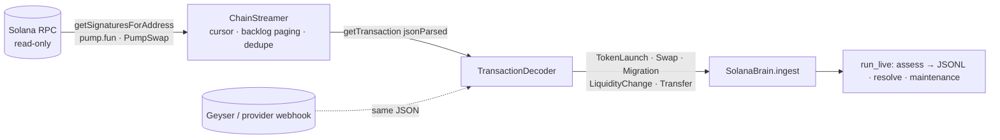

**Decoding (`decoder.py`)**
* **pump.fun**: Anchor events are read from `Program data:` logs.
  `CreateEvent` → launch, `TradeEvent` → swap (with the virtual reserves after the
  trade), `CompleteEvent` → migration. Discriminators are `sha256("event:<Name>")[:8]`.
  Only the stable leading fields are read, so program upgrades that append fields keep
  working.
* **AMMs** (PumpSwap, Raydium AMM v4 / CPMM, Meteora, Orca) are handled without
  per-venue layouts. A pool is a WSOL vault plus a token vault owned by the same non-signer
  authority in a transaction that invokes a known AMM program. Vault balance deltas give
  the event: SOL in + tokens out is a buy, the reverse a sell, both in a liquidity add,
  both out a removal. Post-transaction vault balances are the reserves. For
  concentrated-liquidity venues the reserves are re-expressed so that price equals the
  execution price. Tokens first seen on an AMM get an implicit launch, with mint and
  freeze authority looked up via `getAccountInfo`.
* **SOL transfers** of at least `min_transfer_sol` become funding edges.
  **Jito tips** (transfers to the eight tip accounts) and **priority fees**
  (`fee − 5000 × signatures`) are attached to the transaction's first swap.
* Failed transactions are skipped. Timestamps are `blockTime` plus a microsecond sequence,
  so events stay strictly ordered.

**Streaming (`stream.py`, `rpc.py`)**
* `SolanaRpc` is a standard-library JSON-RPC client that only allows query methods
  (`sendTransaction`, airdrops and so on raise `PermissionError`). It retries 429 and
  5xx responses with exponential backoff.
* `ChainStreamer` keeps a persisted per-program cursor and pages back to it on every
  poll, so bursts are never dropped. A backlog above `max_backlog` is counted in `gaps`.
  It de-duplicates signatures seen by several programs and decodes in slot order.
* `run_live` ingests, assesses every `assess_every` seconds (writing JSONL), resolves
  matured outcomes and runs maintenance periodically. Malformed or out-of-order events are
  counted and skipped, never crashing the loop.

**Verification.** `encode.py` renders market events back into realistic transaction JSON.
The test suite round-trips a whole simulated market through transactions and gets
identical swaps, reserves, tips, fees, holder statistics and insider features. It also
checks the streamer against a fake chain (bursts larger than a page, restarts, duplicate
programs) and runs chain → decoder → brain → assessments end to end. The event layouts
and program IDs follow the public pump.fun IDL and have not been re-checked here against
live mainnet transactions. Run `solana backfill --raw` on a real endpoint once to confirm.

```bash
export SOLANA_RPC_URL=https://your-provider.example/?api-key=…   # any standard Solana RPC
nardis-neural solana backfill --out history/ --limit 5000 --raw history/raw.jsonl
nardis-neural solana bootstrap --events history/ --workspace workspaces/sol
nardis-neural solana stream --workspace workspaces/sol --out assessments.jsonl
nardis-neural solana decode --input dump.jsonl --out events/   # offline: provider exports / archives
```

### 11. Training by streaming history (`ingest/history.py`, `streaming.py`)

The model can learn from weeks or months of chain history **without storing it**. Events
are streamed, decoded, fed through the brain and thrown away:

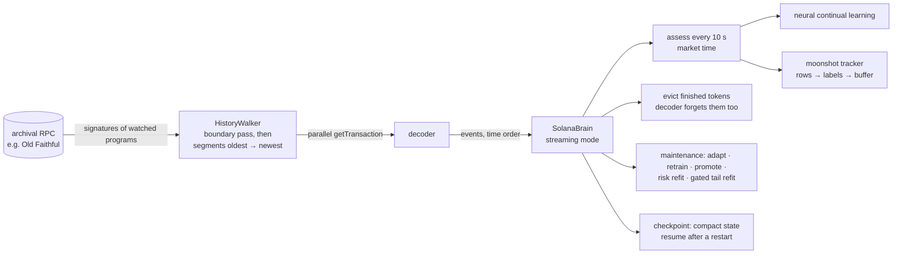

* **Only the watched programs are fetched** (pump.fun and PumpSwap by default), never whole
  blocks. The walker first pages each program's signature listing backwards once, keeping
  only the cursors at every segment edge (one hour by default). It then replays the
  segments oldest first. Only one segment's signatures are ever held in memory.
* **No look-ahead from today's chain state**: historical replays do not look up mint
  accounts, since their current authorities would leak the future.
* **Bounded memory**: tokens quiet for `--evict-idle-hours` (2 h by default) are
  forgotten after their moonshot rows are labelled, and the decoder drops their state too.
  What was learned stays in the wallet intelligence: reputations, rug marks and funding
  clusters. A later relaunch of an evicted mint is rejected rather than treated as a new
  token. Per-wallet state is stored in compact typed arrays. Risk samples and moonshot rows
  are rolling windows (50 k and 200 k rows).
* **Learning while streaming**:
  * the neural ensemble keeps using its continual-learning loop (replay, adaptation, full
    retraining, shadow and promotion gates);
  * the risk model refits on newly resolved samples;
  * the moonshot tail model is retrained from the tracker's buffer every 6 h of market
    time. Still-running tokens enter as right-censored rows. A candidate replaces the
    installed model only if it matches it on the most recent 20 % of tokens.
* **Resumable**: `stream/market.pkl` (written atomically) and `moonshot/online.npz`
  checkpoint the state. A restarted run skips everything up to the checkpointed market
  time.
* **A fresh workspace bootstraps itself** from the first `--warmup-hours` after the first
  launch.

```bash
export SOLANA_RPC_URL=https://…   # an endpoint that serves old slots (Old Faithful / archival)
nardis-neural solana stream-train --workspace workspaces/sol \
    --start 2025-09-01 --end 2025-09-22 --workers 16 --profile auto
# or replay a saved event directory through the same loop
nardis-neural solana stream-train --workspace workspaces/sol --events history/
```

Throughput is set by the RPC endpoint. There is one `getTransaction` per watched
transaction, run in parallel across `--workers`, so busy weeks of pump.fun take hours of
streaming per day of history. Model work is small by comparison with the `cpu-lite`
profile.

Every threshold, horizon, bar spec and window lives in `SolanaConfig`
(`nardis-neural solana init-config`).

## Edge engine (`nardis_neural.solana.edge`)

Forecasting prices is not the goal. The goal is **setups that make money after latency,
price impact and fees**, found and validated so that the result can be trusted. This
module turns the neural brain into an edge-seeking system and measures whether the edge
is real.


### 1. Executable labels (`barriers.py`)

For a signal at `t`, `triple_barrier` simulates what a position of `size_sol` would really
have done on the actual pool path:

* **entry** at `t + latency` against the pool at that instant, through exact bonding-curve
  or AMM maths, so fees and price impact are included;
* the position is **marked to liquidation value** (selling the whole bag back, fees and
  impact included) at every later pool state. Our own entry's reserve shift is carried
  forward;
* **exit** at the first take-profit, stop-loss or time barrier. The exit order also waits
  `latency` seconds, so in a crash it fills lower, which is exactly where paper edge
  usually dies;
* barriers can be fixed or scaled by recent realised volatility.

Labels include a migration if the token graduates while the position is open.

### 2. Out-of-fold forecasts (`research.walk_forward_oof`)

The neural ensemble and the launch-risk model are retrained **walk-forward**. Each fold
trains only on data that ended before the fold starts, minus an embargo covering both the
label horizons and the maximum holding period plus latency, then predicts that fold. The
edge model never sees an in-sample forecast.

### 3. Meta-labeling edge model (`model.py`)

The inputs are:
* the neural forecasts per horizon: mean, standard deviation, z-score, event
  probabilities, max upside and drawdown, volatility;
* uncertainty: epistemic, aleatoric, OOD, disagreement;
* expert gate weights, P(rug / graduation / dev dump), and all raw on-chain features (53 when the results below were measured, 76 now).

It is a bootstrap ensemble of MLPs with two heads:

* **P(win)**: the executable outcome beats zero. It is isotonic-calibrated on a later
  window;
* **E[net]**: Huber regression on the clipped executable net return.

`edge_score = E[net] − λ·σ_epistemic` is a lower confidence bound, which prefers setups
the model is sure about. `kelly_fraction` is a capped fractional Kelly derived from
P(win) and the empirical win/loss ratio. It is a research sizing hint only.

### 4. Honest evaluation (`research.run_edge_research`, `backtest.py`)

* OOF rows are split chronologically into **fit (50 %) / tune (25 %) / test (25 %)**, with
  gaps of one holding period between them.
* The edge model is fitted on *fit*. The entry threshold that maximises the per-trade
  t-statistic (at least `min_trades` trades) is chosen on *tune*. **Test is scored once.**
* The backtester enforces one open position per token and a maximum number of concurrent
  positions; a position occupies its slot until its barrier exit.
* Statistics: hit rate, mean and median net return, per-trade Sharpe, t-stat, **bootstrap
  95 % CI**, profit factor, cumulative PnL and max drawdown in SOL.
* **Baselines** run under the same constraints and trade budget: random picks
  (mean and 95th percentile over draws), momentum (`ret_60s`), and taking every
  candidate. The verdict asks three questions: is the CI above zero, does it beat the
  random p95, and does it beat momentum?

### 5. Results on the simulator

Two independent 60-launch, 6-hour synthetic markets (seeds 11 and 23), 4 walk-forward
folds, a tiny test-sized network, 1 s latency, TP 25 % / SL 15 % / 180 s holds, 1 SOL per
trade and at most 5 concurrent positions. Numbers are per trade, **net of latency, impact
and fees**, on the untouched test period:

| market | policy | trades | hit rate | mean net | 95 % CI | t-stat | max DD (SOL) |
|---|---|---|---|---|---|---|---|
| A | **edge model** | 20 | 90 % | **+25.8 %** | [+19.2 %, +31.0 %] | **8.26** | 0.18 |
| A | momentum (same budget) | 20 | 80 % | +52.5 % | [+13.8 %, +105.0 %] | 2.17 | 0.37 |
| A | take every candidate | 122 | 48 % | +11.8 % | [+3.7 %, +21.2 %] | 2.54 | 1.11 |
| A | random (same budget) | | | +0.3 % (p95 +6.6 %) | | | |
| B | **edge model** | 25 | 76 % | **+20.1 %** | [+7.1 %, +35.0 %] | 2.84 | 0.74 |
| B | momentum (same budget) | 25 | 72 % | +16.2 % | [+4.9 %, +26.0 %] | 2.86 | 0.68 |
| B | take every candidate | 111 | 48 % | +3.5 % | [−0.9 %, +7.8 %] | 1.50 | 1.68 |
| B | random (same budget) | | | +4.9 % (p95 +9.2 %) | | | |

How to read this:
* The edge is significantly positive after costs and beats random selection in both
  markets. In market A, momentum has a higher mean but a far noisier one (its CI is five
  times wider); the edge model has the best risk-adjusted result. In market B the edge
  model has the higher mean and momentum is roughly equal on t-stat.
* The test periods are short (20–25 trades), so the confidence intervals are wide.
* Model selection was done honestly. Five meta-learners (MLP, ridge, gradient-boosted
  trees, rank blend, stacked LCB) were compared on identical fit/tune/test splits in
  *both* markets before choosing the stacked lower-confidence-bound model. Trees and ridge
  carry most of the ranking power (validation rank-IC ≈ 0.31–0.35 in market A).
* An earlier result (+19 % vs −20 % for take-everything) came from a labelling bug that
  ignored the position's own entry impact. The test suite now pins the exact round-trip
  cost.

Reproduce:

```bash
nardis-neural solana simulate --out sim/hist --tokens 60 --seed 11 --hours 6
nardis-neural solana bootstrap --events sim/hist --workspace ws --config configs/small.yaml
nardis-neural solana edge-research --workspace ws --folds 4
cat ws/edge/REPORT.md
```

**This is a synthetic market.** Its structure (momentum regimes, smart money, rug hype
before dumps) is learnable, so these results show that the machinery finds edge without
leakage. They say nothing about live profitability. Run the same research on real chain
history (`solana backfill` → `bootstrap` → `edge-research`), trust only the test-period
verdict, expect much smaller edges, and re-validate regularly as markets adapt.

### 6. Using it live

```python
brain = SolanaBrain("workspaces/sol")  # edge model is loaded if edge-research was run
for a in brain.assess_active():
    a.edge["edge_score"], a.edge["p_win"], a.edge["expected_net"], a.edge["kelly_fraction"]
    a.edge["above_threshold"]  # 1.0 when the score clears the research threshold
```

The module never places orders. Your trading system decides whether and how to act.

## Moonshot engine (`nardis_neural.solana.moonshot`)

The [edge engine](docs/EDGE.md) looks for many small, repeatable wins. This module is for the
other end of the distribution: the rare launch that goes 100x or 1000x. That problem is
different in kind. The typical ticket loses, the result is decided by a handful of tokens,
and the useful question is not "what is the expected return?" but "**how heavy is this
token's right tail?**"

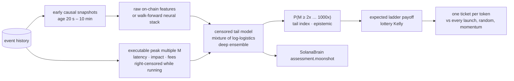

### 1. Labels (`labels.py`)

For a signal at `t`, a ticket of `size_sol` is bought at `t + latency` through the exact
curve or AMM maths. From then on the position is marked at its **liquidation multiple**:
the SOL you would get for selling the whole bag, with fees and impact, divided by the SOL
paid. The reserve shift from our own entry is carried forward and scaled through
liquidity adds and pulls. Every exit decided at `s` fills against the pool at
`s + latency`.

* **Peak multiple `M`**: the best such multiple within `horizon_seconds` (6 h by default).
  If the horizon runs past the end of the data while the token is still trading, the label
  is **right-censored**: we only know `M ≥ observed`. A token with no activity for
  `resolve_idle_seconds` before the end of the data is treated as finished, which is
  known causally.
* **Ladder multiple**: what a concrete exit plan actually returned. It sells 35 % of the
  original bag at 2x, 15 % at 10x, 15 % at 100x and 15 % at 1000x. After 2x, the
  remaining "moon bag" is sold when the mark falls 60 % from its running peak. Before 2x,
  everything is sold at a 50 % stop. Each tranche is priced exactly for its own size and
  moves the pool for the next one.

Censoring is what makes causal training possible. A model deployed at time `T` is trained
with every label **truncated at `T`**. A runner that was still climbing at `T` enters the
likelihood as "at least this much", which is exactly what a live system would have known.

### 2. Tail model (`tail.py`)

The model works on `y = log M` with a **mixture of logistic distributions**:

```
P(M ≥ k | x) = Σ_j π_j(x) · σ((μ_j(x) − log k) / s_j(x))
```

Each component is a log-logistic in `M`, whose survival decays as a power law
`k^(−1/s_j)`. The network therefore learns, per token, both where the bulk of outcomes
sits and how fat the tail is. Components for duds, normal pumps and runners emerge
without supervision.

* **Censored likelihood**: a density for resolved rows, `log P(M ≥ observed)` for censored
  rows.
* **Token weighting**: the snapshots of one token are strongly correlated, so each token
  carries the same total weight and bootstrap resampling is done by token.
* **Deep ensemble**: members are fitted on token-bootstrap resamples, with early stopping
  on the most recently launched tokens. The predictive survival is the members' average,
  and their spread is the epistemic uncertainty.
* **Inputs**: `raw` uses the 76 on-chain features and is fast on any CPU. `neural` adds
  the walk-forward out-of-fold neural forecasts, uncertainty, expert gates and risk
  probabilities, the same stack the edge model uses.

Outputs per token: `P(M ≥ k)` for 2/5/10/100/1000x, the median multiple, the **expected
ladder payoff** (quadrature over the predicted distribution with the ladder's payoff
function), the **tail index** of the heaviest active component, the ensemble spread, and a
**lottery-Kelly** fraction. That fraction is the bet size that maximises expected
log-wealth under the predicted payoff distribution, scaled by ¼ and capped at 5 %. For a
bet whose typical outcome is a loss, this is the sizing rule that avoids ruin. A mean-based
rule would size up exactly where the distribution is most dangerous.

### 3. Research protocol (`research.py`)

1. Early snapshots (20 s to 10 min after launch) are the ticket candidates.
2. Tokens are split by launch time. The model trains on the earlier 65 % of tokens with
   labels censored at the cutoff (the first test entry).
3. On the later 35 % of tokens it is scored **once**:
   * tail calibration and ranking AUC of `P(M ≥ k)` for every level, using resolved rows;
   * NLL against a feature-free tail model fitted on the same rows;
   * a portfolio with **one ticket per token**, bought at the first snapshot where the
     expected ladder payoff is at least the ticket (`--min-ev`, default 1.0) and
     lottery-Kelly > 0. It is compared with buying every launch, random tickets and
     momentum (highest 60 s return) at the same budget.
4. A threshold-sensitivity table is printed for transparency. It is never used to choose
   the threshold.
5. The production model is refitted on all tokens with labels up to the end of the data.

### 4. Results on the simulator

Two independent `degen` markets: 150 launches over 8 hours each (about 6 % runners, 42 %
duds, 30 % rugs), seeds 7 and 19. The settings were raw inputs, 0.5 SOL tickets, 1 s
latency, a 6 h horizon and a 5-member ensemble. The test period covers the 52 most recent
tokens of each market. Multiples are **net of latency, impact and fees** under the ladder
exit plan.

| market | policy | tickets | total PnL (SOL) | mean multiple | 95 % CI | median | best |
|---|---|---|---|---|---|---|---|
| A | **tail model** | 46 | **+172.0** | **8.48x** | [3.56, 14.39] | 1.64x | 95.6x |
| A | momentum (same budget) | 46 | +108.5 | 5.72x | [2.50, 10.12] | 1.37x | 66.7x |
| A | every launch | 52 | +172.1 | 7.62x | [3.27, 13.09] | 1.61x | 95.6x |
| A | random (same budget) | | +45.8 (p95 +72.3) | | | | |
| B | **tail model** | 37 | **+179.8** | **10.72x** | [3.77, 19.76] | 1.82x | 120.5x |
| B | momentum (same budget) | 37 | +108.7 | 6.88x | [2.32, 12.67] | 1.22x | 72.7x |
| B | every launch | 52 | +179.7 | 7.91x | [2.65, 14.26] | 1.09x | 120.5x |
| B | random (same budget) | | +40.8 (p95 +74.4) | | | | |

Tail quality on the test tokens:

| market | test NLL (feature-free) | AUC ≥2x | AUC ≥10x | AUC ≥100x | runners in test / ticketed |
|---|---|---|---|---|---|
| A | 0.10 (1.11) | 0.95 | 1.00 | 0.97 | 6 / 6 |
| B | 0.00 (1.44) | 0.95 | 0.97 | 0.96 | 5 / 5 |

How to read this:

* The model ranks the tail very well. It ticketed every runner in both test periods and
  skipped 6 of 52 launches (A) and 15 of 52 (B). It **matches the PnL of buying every
  launch with fewer tickets**, so more SOL per ticket, and beats momentum and random picks
  by a wide margin. In market B, a stricter threshold (E[payoff] ≥ 10x) kept 18 tickets
  and still made +172 SOL (20x per ticket). That figure comes from the test period, so it
  is not a result to rely on.
* **Calibration is imperfect where it matters most.** The 1000x probabilities are too
  high: about 0.01 to 0.02 predicted against about 0.001 observed. In market B, 5x and 10x
  were under-predicted. Power-law tails are fitted from a handful of runners. Treat the
  far-tail numbers as rankings, not as odds.
* Realised ladder multiples on runners were 26x to 120x, while their launch-to-peak runs
  were 100x to 3,000x. That gap is the honest cost of arriving 20 s or more after launch,
  paying latency on the way out, and banking tranches on the way up.
* **The simulator is generous.** Buying every launch is profitable in these markets, and
  rugs pump before they dump, so they often pay the 2x tranche. Real launch markets are far
  harsher. The results show that the machinery finds fat tails without look-ahead. They say
  nothing about live profitability.

Reproduce:

```bash
nardis-neural solana simulate --out sim/degen --market degen --tokens 150 --hours 8 --seed 7
nardis-neural solana bootstrap --events sim/degen --workspace ws --profile auto
nardis-neural solana moonshot-research --workspace ws --archetypes sim/degen/archetypes.json
cat ws/moonshot/REPORT.md
```

### 5. Hardening: calibration, input clamping, manipulation guard

A tail model is exactly what manipulators aim at. Fake volume, bundled supply and staged
"smart money" all look like the early footprint of a runner. Three layers keep the model
from being walked into a trap, and each of them can only **lower** its optimism:

1. **Tail calibration** (`TailModel.calibration`). After training, the predicted hit
   counts for each level (2x … 1000x) are compared with what actually happened on the
   held-out, most recent tokens. Each level gets a ratio, observed ÷ predicted, shrunk
   towards 1 by one pseudo-token and clipped to [0.05, 2]. Probabilities are then
   rescaled and kept non-increasing in `k`. This targets the far-tail overestimate
   measured in section 4. The results table there was produced before this step.
2. **Input clamping**. Each input is clamped to its training range (0.1 to 99.9 %
   quantiles) before the network, so a crafted extreme feature cannot push the
   prediction off a cliff. `out_of_range_share` reports how many inputs were clamped.
3. **Manipulation guard** (`moonshot/guard.py`). A `trust` score in [0, 1] multiplies the
   chase score and the Kelly hint. It combines:
   * P(rug) from the risk model;
   * live mint or freeze authority, and unburned LP;
   * wash trading, bundled supply, creator-cluster supply and rug-linked wallets;
   * holder concentration and dev selling;
   * supply held by a hidden multi-wallet funding cluster that is not the creator's, which
     catches staged insiders funded through relay wallets;
   * the neural OOD score, clamped inputs and ensemble disagreement.

   **Hard vetoes** zero the chase score. They fire on P(rug) ≥ 60 %, a live mint or freeze
   authority, one hidden wallet cluster holding ≥ 25 % of supply, bundled supply ≥ 20 %, a
   creator cluster holding ≥ 30 %, bots making up ≥ 80 % of volume, OOD ≥ 4, or ≥ 25 % of
   inputs outside the training range. Each veto
   appears in `flags` as a readable reason. The factors are hand-set and monotone: more red
   flags never raise trust. Thresholds are in `GuardConfig` (`brain.guard`).

### 6. Using it from the trading algorithm

```python
brain = SolanaBrain("workspaces/sol")  # the tail model loads if moonshot-research was run
for a in brain.moonshot_ranking():  # active tokens in the entry window, best first, vetoes removed
    m = a.moonshot
    m["chase_score"], m["chase_rank"]  # trust × expected ladder multiple; 1 = best
    m["p_ge_10x"], m["p_ge_100x"], m["p_ge_1000x"]  # calibrated survival probabilities
    m["expected_multiple"], m["lottery_kelly"]  # payoff expectation; sizing hint (× trust)
    m["trust"], m["vetoed"], m["tail_index"], m["epistemic"], m["out_of_range_share"]
    a.flags  # human-readable red flags, including "moonshot veto: …"
```

Every assessment from `assess` / `assess_many` / `assess_active` carries the same
`moonshot` block, with `chase_rank` computed within the batch. The trading system decides
what to do with it. This module never places orders.

Nothing here guarantees 1000x, and no model can promise it. What it gives you is a ranked,
manipulation-aware estimate of *how likely* a large run is, how uncertain that estimate is,
and how much of a bankroll such a lottery ticket can justify.

## Tape Transformer (`nardis_neural.solana.tape`)

Every other model in this repository sees a token through aggregates: per-minute bars and
76 summary features. That throws away the two things that decide a memecoin launch: **who**
is trading, and **in what order**. The Tape Transformer reads the raw trade tape directly.


### 1. The tape (`features.py`)

For a snapshot at `now`, the last `max_trades` (96) trades at or before `now` are kept,
left-padded, with the most recent last. Each trade is a vector of 18 features; the full
list is in the generated reference, *Trade tape*. They cover the trade itself (side, SOL,
signed flow, time since the previous trade, age, time until now, price relative to now,
priority fee, Jito tip) and the trader as the market knows them at `now` (60-s skill,
runner skill, creator, creator's cluster, fresh funding, cluster size, lifetime trades,
first trade in this token, bought within the launch slots).

Each trade also carries a **wallet hash bucket**: a blake2b hash of the wallet address. It
is stable, so the learned embedding means the same wallet in every workspace, replay and
live session. Training tapes are cut by a causal replay (`dataset.py`) under the same rule
as every other snapshot. A test checks that a replayed tape equals the tape from a market
that has only seen the past.

### 2. The network (`model.py`)

* **Trade embedding** is `Linear(trade features) + Linear(wallet embedding)`, plus a learned
  recency embedding counted from the most recent trade, so left padding changes nothing.
* **Wallet embeddings** start at unit scale; a small initialisation left wallet identity
  drowned out by the trade features. Two defences stop the table from memorising noise:
  * **frequency gating**: only wallets seen in at least `min_wallet_tokens` (3) distinct
    training tokens get their own embedding. Everyone else shares an "unknown wallet" slot,
    and their trades still count through their features;
  * **wallet dropout**: 20 % of identities are hidden during training, so no single wallet
    becomes a crutch.
* A learned **summary token** is appended, and a 2-layer pre-LayerNorm Transformer (d = 64,
  4 heads) attends over the tape with padding masked. The summary token keeps an empty
  tape well defined.
* The summary token, the masked mean of the trades and an MLP of the current features
  are fused into one vector.
* **Tail head**: a mixture of logistics on `log` peak multiple. It uses the same censored
  likelihood, per-level calibration, expected ladder payoff and lottery Kelly as the
  [moonshot tail model](docs/MOONSHOT.md), sharing the code.
* **Collapse head**: a discrete-time hazard over 1 min, 5 min, 15 min and 1 h. It gives the
  probability that the ticket's value falls to half of its entry value within each window.
  It is trained with the censored survival likelihood: a row survives every bin it was
  fully observed through, and its event bin if it collapsed. This is the **exit signal**.
* **Ensemble**: 3 members by default, trained on token-bootstrap resamples, with early
  stopping on the most recently launched tokens. Every token carries the same total weight.

About 2.2 M parameters per member, most of them in the wallet table (131 k buckets × 16).
It runs comfortably on a laptop CPU, an M1, or a 4-vCPU cloud VM.

### 3. Research (`research.py`)

The protocol matches the moonshot research: entry-window snapshots, tokens split by launch
time, training labels censored at the cutoff, and one scoring pass on the later tokens. The
raw-feature tail model is trained on the **same** rows and scored on the **same** test rows,
so the comparison is direct:

* tail: NLL, calibration and AUC per level for both models;
* collapse: for each window, predicted vs observed collapse rate, AUC and Brier score on
  rows whose outcome for that window is known;
* one ticket per token for both models, against buying every launch.

```bash
nardis-neural solana tape-research --workspace ws --archetypes sim/degen/archetypes.json
cat ws/tape/REPORT.md
```

### 4. Results on the simulator

One `degen` market: 150 launches over 8 hours (seed 7, the same market as market A in
[MOONSHOT.md](docs/MOONSHOT.md)). There were 98 training tokens and 52 test tokens, with 3
ensemble members of about 2.2 M parameters each; 851 wallets earned their own embedding.
Both models were trained and scored on identical rows. Training and scoring took about
20 minutes on a 4-core CPU, including the production refit.

| | Tape Transformer | raw-feature tail model |
|---|---|---|
| test NLL of log peak multiple | **0.210** | 0.300 |
| AUC P(≥2x) | 0.916 | 0.914 |
| AUC P(≥10x) | 0.958 | **0.982** |
| AUC P(≥100x) | 0.935 | **0.982** |
| AUC P(≥1000x) | 0.809 | **0.980** |

Collapse, the new exit signal (value halves within the window, 3,016 test rows):

| window | predicted | observed | AUC | Brier |
|---|---|---|---|---|
| 1 min | 0.035 | 0.042 | 0.926 | 0.034 |
| 5 min | 0.126 | 0.138 | 0.973 | 0.048 |
| 15 min | 0.148 | 0.157 | 0.970 | 0.050 |
| 1 h | 0.189 | 0.164 | 0.966 | 0.054 |

How to read this:

* **The collapse head is the win.** It separates tokens that are about to break from those
  that are not (AUC 0.93–0.97), and it is well calibrated at every window. No other model
  in the repository produces an exit signal.
* **The whole distribution fits better** (lower NLL), but the tape model **ranks the far
  tail worse** than the aggregate model. Runners are rare, and a tape of the last 96 trades
  sees less of a token's history than the aggregate features. For picking moonshot
  entries, keep using the tail model's `chase_score`; use the tape for exits.
* In this generous simulator every token cleared the "expected payoff ≥ ticket" rule for
  both models, so the one-ticket-per-token comparison could not separate them.
* One market, one seed. This is a synthetic benchmark, not evidence of live performance.

### 5. Entry and exit policies across two markets

`tape-research` also splits tokens three ways by launch time: 76 train, 22 tune and 52
test tokens per market. Entries come from the blend of both models. The exit alarm (window
and threshold) is chosen on the tune tokens, with their outcomes truncated before the test
period, then scored once on test. The runs used seeds 7 and 19 (market A and market B of
[MOONSHOT.md](docs/MOONSHOT.md)). Seed 19 also had the `top_cluster_share` feature, which did not
exist yet when seed 7 ran.

| | seed 7 | seed 19 |
|---|---|---|
| AUC P(≥10x): tape / tail / blend | 0.909 / **0.957** / 0.940 | **0.920** / 0.184 / 0.831 |
| AUC P(≥100x): tape / tail / blend | 0.931 / **0.967** / 0.964 | **0.964** / 0.164 / 0.941 |
| collapse AUC 1 min / 5 min / 15 min / 1 h | 0.92 / 0.97 / 0.96 / 0.95 | 0.90 / 0.97 / 0.97 / 0.97 |
| alarm chosen on tune | P(collapse ≤ 5 min) ≥ 0.7 | P(collapse ≤ 1 min) ≥ 0.3 |
| test PnL, ladder only | +172.1 SOL | +179.7 SOL |
| test PnL, ladder + learned exit | **+177.2 SOL** | +157.5 SOL |
| median ticket, ladder only → with alarm | 1.61x → 1.93x | 1.09x → 1.77x |

What this shows:

* **The collapse head generalises.** AUC is 0.90–0.97 at every window in both markets.
* **Neither entry model always wins.** On seed 7 the aggregate tail model ranked the tail
  best. On seed 19, trained on fewer tokens, its ranking broke (AUC below 0.5, i.e.
  inverted), while the tape stayed above 0.86 at every level. **The blend was never the
  worst**, so when both models are installed `chase_score` ranks by the blend
  (`expected_multiple_blend`).
* **The learned exit is not yet a reliable edge.** It lifted the median ticket in both
  markets, but it also sold some runners early: +3 % total PnL on seed 7, −12 % on
  seed 19. Treat the alarm as an input to your exit logic, not a rule. The forward-test
  ledger settles every paper ticket both with and without the alarm
  (`alarm_minus_ladder_pnl_sol`), so live data decides.
* Two synthetic markets are still a small sample (`research-suite --tape` runs more).

### 6. Scaling: does a bigger Tape Transformer help?

The default network is small on purpose. To test whether capacity is the bottleneck, the
research was run on the same markets and splits with the default (d=64, 2 layers, 3
members) and a **flagship** (d=128, 4 layers, 5 members):
`tape-research --d 128 --layers 4 --members 5`. Each run had one CPU thread, with four runs
side by side. Seeds 7 and 19 of the 150-launch `degen` market were used.

| | seed 7: default → flagship | seed 19: default → flagship |
|---|---|---|
| network parameters per member (excluding the 2.1M-entry wallet table) | 98k → 625k | 98k → 625k |
| all parameters, whole ensemble | 6.6M → 13.6M | 6.6M → 13.6M |
| tape test NLL (lower is better) | 0.512 → **0.464** | 0.713 → **0.541** |
| collapse AUC 1 min | 0.921 → **0.936** | 0.866 → **0.904** |
| collapse AUC 5 min / 15 min / 1 h | 0.974 / 0.970 / 0.964 → 0.974 / 0.967 / 0.964 | 0.965 / 0.968 / 0.966 → **0.975 / 0.978 / 0.975** |
| collapse Brier 1 h | 0.068 → 0.063 | 0.070 → **0.042** |
| log growth per ticket, tape entries | 0.786 → 0.820 | **0.730** → 0.643 |
| test PnL, tape entries | +172.1 → +172.1 SOL | +179.5 → +179.6 SOL |
| training time (1 thread) | 49 min → 192 min | 47 min → 211 min |
| latency, one token (1 thread) | 11.8 → 33.8 ms | 10.0 → 38.2 ms |

What this shows:

* **The flagship is a better forecaster.** Its test NLL is 9 % and 24 % lower, and its
  1-minute collapse AUC is higher in both markets, which is the exit alarm's hardest window.
* **It is not a better trader here.** The entry decisions barely change: PnL is identical,
  and log growth rose on one seed and fell on the other. The tokens worth buying are
  already separated by the small model; extra capacity refines probabilities that the
  entry decision does not depend on.
* **It costs 3.4x the latency and 4x the training time.**
* **The cheapest gain is elsewhere.** The research's tail-model comparator uses the same
  member count as the tape. With 5 members instead of 3, its test NLL fell from 0.571 to
  0.423 (seed 7) and from 0.457 to 0.225 (seed 19). That beats both tape sizes, from a
  47k-parameter model. The production moonshot tail model already uses 5 members.
* **Decision:** the default stays d=64, 2 layers and 3 members, which is the right trade
  for an M1, a CCX23 or a CPX32. Use the flagship when the collapse probabilities drive
  your exits and there is latency budget (or a GPU) to spare. Only 2 seeds were run, so
  re-check this on real data.

### 7. Using it

```python
brain = SolanaBrain("workspaces/sol")  # the tape model loads if tape-research was run
for a in brain.assess_active():
    a.tape["p_ge_10x"], a.tape["expected_multiple"]  # entry view from the tape
    a.tape["p_collapse_1m"], a.tape["p_collapse_5m"]  # exit view: will the run break soon?
```

The collapse probabilities are meant for positions you already hold. A sharp rise in
`p_collapse_1m` or `p_collapse_5m` is the model's view that the run is about to break. As
everywhere in this module, it is a probability for the trading system to act on, not an
order.

## Criticality engine (`nardis_neural.solana.hawkes`)

A runner is a **chain reaction**: buys trigger more buys, which trigger more buys. An
epidemic grows when each case infects more than one other person (R₀ > 1). A nuclear pile
goes critical when each fission triggers at least one more. Financial order flow shows the
same structure (Filimonov & Sornette measured the "endogeneity" of whole markets this way).

This module measures, for every token and in real time, **how close its buying is to that
phase transition**.

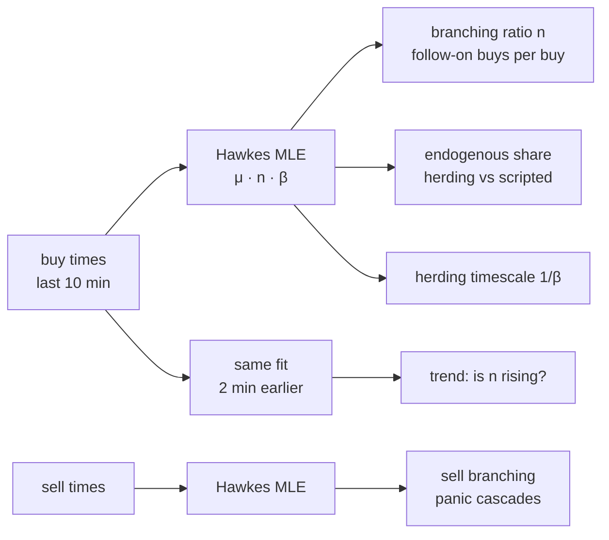

### 1. The model

An exponential Hawkes process has intensity

```
λ(t) = μ + Σ_{t_j < t} n · β · exp(−β (t − t_j))
```

* `μ` is the **exogenous** rate: activity that would happen anyway (insiders on a script,
  bots on a clock, outside news);
* `n` is the **branching ratio**: the expected number of follow-on events each event
  directly triggers;
* `β` is the decay rate of that influence; `1/β` is the herding timescale.

The branching ratio is the dimensionless number that matters:

| n | regime | meaning for a launch |
|---|---|---|
| ≪ 1 | subcritical | activity is driven from outside and stops when the drivers stop |
| → 1 | critical | cascades of any size become possible: the runner regime |
| share of events explained by excitation | endogenous share | organic herding (high) vs scripted flow such as wash bots and staged insiders (low) |

The last row is the manipulation angle. **Scripted flow does not self-excite.** Wash bots
and staged insiders trade on their own schedule rather than in reaction to other buyers,
so a token can look busy while its endogenous share stays low. That is a
signature that aggregate volume and holder counts cannot show.

### 2. The estimator

* **Exact maximum likelihood** by expectation–maximisation. The EM runs for every decay
  rate on a log-spaced grid at once (vectorised), and the best likelihood wins.
* **Exact O(N) kernel sums.** `Σ_{t_j<t_i} exp(−β(t_i − t_j))` is computed from prefix sums
  of `exp(βt)` in overflow-safe blocks with a carried remainder. Tied timestamps do not
  excite each other (whole-second chain timestamps have many ties). A test checks it
  against the O(N²) brute force to 1e-10.
* **History conditioning.** The likelihood covers the most recent events, and the events
  just before the window are kept as history. Otherwise the excitation they cause is
  misread as background, which is a classic edge effect.
* **Detrending.** A constant background rate cannot tell a *fading* launch rush (many
  buys early, fewer later) from a cascade: both look like "events followed by more
  events". The detrended fit lets the background rise or fade exponentially,
  `μ(t) = μ·exp(γ(t − T))`, and searches a grid of trends alongside the decay rates. On
  pure decaying Poisson streams (true n = 0) the plain fit reads 0.28–0.93 and the
  detrended fit 0.10–0.13. On stationary cascades the two agree (0.50 vs 0.52 at
  n = 0.5). The live buy features are detrended.
* **Two timescales (optional).** `fast_beta` adds a fixed sub-second kernel next to the fitted
  one. Order flow has a reflex layer (bots and bundles reacting in the same slot) and a
  slower human herding layer, and one exponential can only describe one of them.
  `HawkesFit.reflex` reports the fast part.
* **Speed.** About 1.5 ms per plain fit on 300 events and about 2.2 ms per detrended fit on
  the live grid (5 decay rates × 5 trends). The three fits behind the five features cost
  about 8 ms per token on the busiest tokens of a herding market.

Measured recovery on exactly simulated Hawkes processes (10 runs each, 600 s windows):

| true n (β = 0.5) | 0.1 | 0.5 | 0.8 |
|---|---|---|---|
| estimated | 0.17 ± 0.14 | 0.49 ± 0.09 | 0.72 ± 0.10 |

Near criticality with slow decay (n = 0.9, β = 0.1) the estimate reads about 0.55. That is
the known downward bias of short-window Hawkes estimation. The ordering of tokens by `n`,
which is what a ranking model uses, is preserved.

### 3. Features

Five features of the current-state vector (full definitions in the generated reference):

* `buy_branching_ratio`: n of the last 10 minutes of buys;
* `sell_branching_ratio`: n of sells, which catches panic cascades;
* `buy_branching_trend_120s`: n now minus n two minutes ago, i.e. *approaching
  criticality*;
* `herding_timescale_log`: `log1p(1/β)`;
* `endogenous_buy_share`: share of recent buys explained by excitation.

### 4. Herding in the simulator

The simulator's buyers used to arrive independently (an inhomogeneous Poisson process),
which has no cascades to find. `LaunchSimSpec(herding=True)` (or `solana simulate
--herding`) makes retail demand self-exciting. The average demand is the same, but it
arrives in cascades, with a branching ratio per launch type:

| runner | graduate | organic | rug | dud | trap | wash |
|---|---|---|---|---|---|---|
| 0.85 | 0.7 | 0.5 | 0.3 | 0.2 | 0.1 | 0.05 |

Herding is off by default, so every earlier simulation reproduces exactly.

### 5. Does it help? (ablation)

One `adversarial` market (150 launches, 8 h, seed 7) was run with herding on, plus a
`degen` market without herding as a control. The same moonshot tail model was trained
with and without the five criticality features, on identical token splits (98 train, 52
test tokens), three training seeds each.

| market | test NLL with / without | AUC P(≥5x) with / without | AUC P(≥10x) | AUC P(≥100x) |
|---|---|---|---|---|
| herding + adversarial | **0.188 / 0.283** (better in all 3 seeds) | **0.924 / 0.914** (all 3) | 0.948 / 0.944 | 0.903 / 0.902 |
| control, no herding | 0.242 / 0.261 (seed ranges overlap) | 0.936 / 0.944 | 0.987 / 0.992 | 0.972 / 0.975 |

What the measurements say:

* **Where cascades exist, criticality is a strong signal.** Test NLL falls by a third in
  every seed, and ≥5x ranking improves in every seed. Where there are no cascades (the
  control), the features add nothing and cost a little ranking noise, which is what a real
  signal (rather than a leak) should do.
* **Scripted flow is exposed.** Wash-trading tokens read a buy branching ratio of about
  **0.004**, against 0.3–0.7 for every other launch type at three minutes. Wash bots trade
  on a clock, not on each other.
* **The branching ratio is not pure herding.** Launches designed with n = 0.85 (runners)
  read only about 0.37 at three minutes, and duds read about 0.6. Two effects blur it. Early
  demand is non-stationary with *steps*, such as graduation to an AMM, which even a
  detrended background cannot absorb. And in the simulator, sub-second clumps of buys mix
  with slower herding. The estimator measures "self-excitation plus regime shifts", and
  the model learns what that is worth. It is not an oracle for R₀.
* The design choices were iterated on these measurements: history conditioning, then
  detrending (a fading rush went from n = 0.93 to about 0.1), then a smaller live grid
  that was re-validated before these numbers were taken.

On real chain data the reflex layer is physical (same-slot bots). Validating these
features on streamed history is the next step.

## Capital engine (`nardis_neural.solana.capital`)

Good probabilities are not a trading system. Capital compounds only if the *size* of each
bet matches its edge and its risk, if correlated bets are not stacked, and if the account
survives the losing streaks that fat-tailed strategies always produce. And none of it
matters if the backtested edge is an artefact of trying many variants. This module
handles all of those questions.

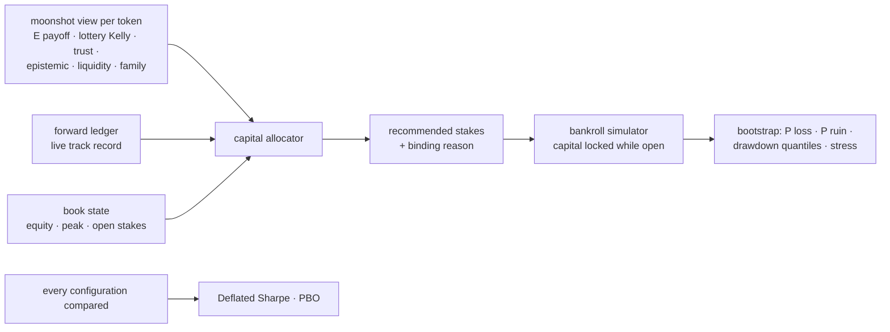

### 1. Allocator (`allocator.py`)

For each candidate, best expected edge first:

```
fraction = lottery Kelly × kelly_scale × trust × exp(−epistemic / uncertainty_scale)
           × track record × drawdown governor
```

* **Lottery Kelly** comes from the tail model and is already fractional and capped: the
  bet size that maximises expected log-wealth under the predicted payoff distribution.
* **Trust** comes from the manipulation guard, and **epistemic** from the ensemble's
  disagreement. The less the model knows, the less it bets.
* **Track record** is realised ÷ predicted payoff of the forward ledger's settled paper
  tickets, clipped to [0.25, 1.25]. When live results fall short of what the model
  promised, every stake shrinks in proportion.
* The **drawdown governor** scales stakes linearly from 1 at the equity peak to 0 at
  `max_drawdown` (35 %). The **daily loss stop** allows no new positions after losing 15 %
  of the day's opening equity.

Then the limits, each reported as the binding `reason`:

* per position: 4 % of equity;
* **liquidity**: 2 % of the pool's real SOL, so our own impact stays small;
* per **creator family**: 8 % of equity, because a serial deployer is one correlated bet;
* total exposure: 30 % of equity; at most 12 concurrent positions; stakes under 0.02 SOL
  are dropped.

```python
for a in brain.allocate(equity_sol=100.0, open_stakes={"Mint…": 1.2}, peak_equity_sol=120.0):
    a.mint, a.stake_sol, a.fraction, a.reason  # advice for the trading system, not an order
```

The command-line equivalent is `nardis-neural solana allocate --workspace ws --equity 100`.

### 2. Bankroll simulator (`bankroll.py`)

Tickets enter in time order. Capital is locked from entry to exit, open positions are
carried at cost (no mark-to-market optimism), and a ticket returns `stake × multiple` when
it closes. The outputs are:

* return, log growth, maximum drawdown and time underwater;
* a **bootstrap risk profile**: outcomes are resampled onto the same schedule of signals,
  giving the median and 5 % quantile of the return, P(loss), P(−50 %) and drawdown
  quantiles;
* **stress tests**: every payoff is scaled down (×0.6, ×0.35), because live edges are
  usually far smaller than backtested ones. Each sizing (flat, aggressive flat,
  allocator) is compared under the same stress.

### 3. Is the edge real? (`overfit.py`)

* **Deflated Sharpe Ratio** (Bailey & López de Prado, 2014). This is the probability that
  the chosen policy's true Sharpe ratio exceeds the Sharpe ratio expected from the *best
  of N* unskilled trials. It accounts for sample length, skew and fat tails.
* **Probability of Backtest Overfitting** (Bailey, Borwein, López de Prado & Zhu). Time is
  cut into 8 blocks. For all 70 ways of choosing 4 of them as in-sample, the in-sample
  winner is ranked out-of-sample. PBO is the share of splits in which it lands below the
  median.

Every moonshot research report now includes both. They are computed across the entry
thresholds compared on the test period, next to the bankroll comparison and the stress
test. Tests check that the luckiest of 50 noise strategies gets a low DSR, that pure noise
gets a high PBO, and that a genuinely better configuration gets a PBO near zero.

### 4. Results on the simulator

Moonshot research on two 150-launch markets (seed 7): `degen` without herding and
`adversarial` with herding. The book starts at 100 SOL and trades the test-period tickets
of the deployed policy. Payoffs were computed for 0.5 SOL tickets. Bootstrap figures come
from 300 resampled histories.

| | degen | adversarial + herding |
|---|---|---|
| per-ticket Sharpe · Deflated Sharpe Ratio (6 thresholds tried) | 0.36 · **1.00** | 0.58 · **1.00** |
| PBO across entry thresholds | 59 % | 86 % |
| flat 0.5 SOL: return / max drawdown | +172 % / 0.4 % | +37 % / 0.3 % |
| allocator: return / max drawdown | +129 % / 0.5 % | +23 % / 0.1 % |

Stress test, adversarial market (bootstrap median return, P(loss), P(−50 %)):

| payoff haircut | mean multiple | flat 0.5 SOL | flat 5 SOL | allocator |
|---|---|---|---|---|
| ×0.6 | 1.60x | +13 %, 0 %, 0 % | **+129 %**, 0 %, 0 % | +6 %, 1 %, 0 % |
| ×0.35 (no edge left) | 0.93x | −2 %, 73 %, 0 % | −17 %, 73 %, **16 %** | −1 %, 67 %, 0 % |

How to read this:

* **The edge is not a multiple-testing artefact.** The deployed policy's Sharpe ratio is far
  above the best-of-trials benchmark in both markets (DSR 1.00).
* **The entry threshold does not matter, so do not tune it.** PBO of 59 % and 86 % says the
  threshold that looks best in-sample is no better than the others out-of-sample. They
  all trade nearly the same tokens.
* **Sizing is a trade-off, and it is now measured.** While the edge holds, bigger stakes
  compound faster. If the live edge turns out much smaller than the backtest (the usual
  case), aggressive flat sizing ruins about one history in six. The conservative
  allocator never did, but it earned less in these generous markets. Its liquidity cap
  (2 % of a young pool's real SOL) is what binds most often.
* **The intended way to scale up** is to start with the defaults and let the forward
  ledger accumulate settled tickets. `track_record` then scales stakes by realised ÷
  predicted payoff, and `kelly_scale` should be raised only after the live record confirms
  the edge. It is the same logic the Deflated Sharpe Ratio applies to backtests: size to
  evidence, not to hope.
* Both markets are simulations. Real launch markets are harsher. The stress rows are the
  more realistic guide to what sizing does.

## Optimal-stopping exits (`nardis_neural.solana.stopping`)

Entries get most of the attention, but for a fat-tailed launch market the exit decides
most of the result. A token that prints 50x and then rugs is worth 50x only to a holder who
sold in time. This module treats the exit as what it is mathematically: an **optimal
stopping problem**.

### 1. The problem

Holding a ticket is an American option on its own liquidation value. At each decision
time `t_k` we may sell, receiving `V_k`, or continue. `V_k` is the executable multiple of
the whole ticket if it were sold at `t_k`: the sale fills at `t_k + latency` against the
pool, with our own reserve shift, price impact and fees (`moonshot.labels.position_marks`,
the same maths as every other label).

With a utility `u`, the value of the best possible exit rule is the **Snell envelope**

```
U_K = u(V_K)
U_k = max( u(V_k),  C_k ),      C_k = E[ U_{k+1} | state_k ]
```

and the optimal rule stops at the first `k` with `u(V_k) ≥ C_k`. `C_k` is the
**continuation value**: what holding on is worth, given everything known now.

#### Why log utility

With linear utility (maximise E[V]), fat tails dominate. A 1 % chance of 1000x is worth
10x, so the rule learns to hold almost everything "for the lottery". With `u(V) = log V`,
the rule maximises the expected growth rate of capital, which is the Kelly criterion
applied to the exit. It still holds a runner while its continuation value is high, but it
does not trade a likely 3x for a small chance at 100x. The installed model uses log by
default.

#### Runner mode: power utility for chasing 100x

For a strategy whose purpose is to catch the rare 100x, selling a likely 3x early is the
wrong trade. **Runner mode** uses the CRRA family between the two:

```
u(V) = (V^(1−γ) − 1) / (1 − γ)        γ → 1: log utility      γ = 0: linear (expected value)
```

With γ = 0.5 (`u = 2(√V − 1)`) a 100x outcome is worth 18 units against 0.83 for a sure 2x, so a
10 % chance of 100x justifies holding (E[u] = 1.27 > 0.83). Under log utility it does not: E[log V] = −0.16
against log 2 = 0.69. A unit test builds exactly this lottery (at 2x, one position in ten
later runs to 100x, the rest fall to 0.5x, indistinguishably). Log utility sells at 2x on
99 % of test paths. Runner mode holds to the end on about two thirds, which is far more
often; its continuation value is estimated from noisy features, so not on every path.

All three utilities (log, power, linear) are fitted and reported by the research;
`--utility power --gamma 0.5` installs runner mode.

### 2. The estimator

**Longstaff–Schwartz** (2001) estimates `C_k` by regressing realised future values on the
current state along observed paths. Here:

* **State**: all 76 causal market features at `t_k` (flow, wallets, criticality, curve
  state…), plus time held (log seconds), the current log multiple, the running peak log
  multiple and the drawdown from that peak. The peak and drawdown are path-dependent;
  they are what makes a trailing rule possible.
* **Regressor**: gradient-boosted trees (`max_depth` 4, learning rate 0.05, L2 1.0),
  exported to plain arrays (`continuation.npz`), so no scikit-learn object is pickled.
* **Fitted policy iteration**: paths have different lengths, so the regression is pooled
  across all decisions rather than run per date. Start from "hold to the end". Regress the
  realised utility of following the current policy from `k+1` on the state at `k`. Switch
  to "stop when `u(V_k) ≥ Ĉ(state_k)`", recompute the realised utilities and refit. Four
  rounds are used; the report lists how many decisions changed and the realised utility in
  each round.
* **Decision grid**: the token's own snapshots after entry, at most one per 30 s
  (`--spacing`), up to the moonshot horizon (6 h).

### 3. Honest evaluation

In-sample LSM is biased upward, because the same noise decides both the regression and
the stop. So:

* tokens are split by launch time, earliest 65 % for training;
* training paths are **truncated at the cutoff** (the first test signal): no training
  decision uses a sale that fills after the cutoff;
* the policy is scored **once** on the later tokens, over their full paths;
* **every** test token is entered at its first entry-window snapshot, so only the exit is
  compared. Entry selection is a separate engine.

Compared exits: the stopping policy (log and linear), hold to the horizon, sell after 5 or
30 minutes, the moonshot take-profit ladder (with its trailing and hard stops, which
react tick by tick rather than on the 30 s grid), and the **hindsight-best** exit (the
highest mark on the grid). The hindsight exit cannot be traded; it is the ceiling.

### 4. Results on the simulator

Two 150-launch, 12-hour markets (seed 7): `degen` and `adversarial` with herding. There are
52 test tokens in each, with 0.5 SOL tickets.

| exit | adversarial + herding: mean log x · PnL (SOL) · share > 1x | degen: mean log x · PnL (SOL) · share > 1x |
|---|---|---|
| **optimal stopping, log utility** | **+1.00** · +268 · **85 %** | **+1.07** · +171 · **88 %** |
| optimal stopping, linear utility | +0.49 · +138 · 60 % | +0.80 · +214 · 83 % |
| hold to horizon | +0.58 · +199 · 67 % | +0.66 · **+385** · 67 % |
| take-profit ladder | +0.52 · +37 · 73 % | +0.79 · +172 · 73 % |
| sell after 5 min | +0.50 · +61 · 67 % | +0.24 · +28 · 69 % |
| sell after 30 min | +0.48 · +56 · 67 % | +0.55 · +99 · 67 % |
| hindsight-best (ceiling) | +1.33 · +379 · 88 % | +1.41 · +449 · 98 % |

The log-utility policy holds for a median of about 6 minutes (355 s and 370 s).

#### Robustness: six markets

The same research was repeated on seeds 19 and 23 of both markets. The table shows mean
log multiple per ticket (52 test tokens each).

| exit | adv 7 | adv 19 | adv 23 | degen 7 | degen 19 | degen 23 | mean ± sd |
|---|---|---|---|---|---|---|---|
| **optimal stopping, log** | **+1.00** | **+0.92** | **+0.52** | **+1.07** | **+0.86** | **+0.46** | **+0.81 ± 0.26** |
| optimal stopping, linear | +0.49 | +0.53 | +0.14 | +0.80 | +0.61 | +0.23 | +0.47 ± 0.25 |
| hold to horizon | +0.58 | +0.54 | +0.38 | +0.66 | +0.53 | +0.11 | +0.47 ± 0.20 |
| take-profit ladder | +0.52 | +0.48 | +0.50 | +0.79 | +0.60 | +0.23 | +0.52 ± 0.18 |
| hindsight-best (ceiling) | +1.33 | +1.28 | +1.16 | +1.41 | +1.24 | +0.78 | +1.20 ± 0.22 |

Total PnL in SOL (0.5 SOL tickets), same order: log policy +268, +274, +46, +171, +436,
+91 (mean +214); hold +199, +271, +302, +385, +357, +275 (mean +298); ladder +37, +48,
+44, +172, +180, +61 (mean +90).

How to read this:

* **Log growth per ticket, the quantity that compounds, is highest for the log-utility
  policy in all six markets.** On average it is +0.81 against +0.52 for the ladder and
  +0.47 for holding, and it captures about two thirds of the hindsight ceiling, out of
  sample. The weakest win is adversarial seed 23 (+0.52 against +0.50 for the ladder).
* **Its median ticket is the best of every tradeable rule in all six markets** (1.15x to
  2.62x). It has the highest share of winning tickets in 5 of 6 markets (60 % to 88 %; on adversarial seed 23, selling after 5 minutes wins 62 % against 60 %).
* **The trade-off is the fat right tail, and it is intended.** Holding everything to the
  horizon makes more SOL on average (+298 against +214). A few tokens that never stop
  running pay for all the rugs, and the log policy sells some of them early, because a
  Kelly bettor should. The log policy beat holding on total PnL in 2 of 6 markets, tied in
  1 and lost in 3. It beat the ladder on total PnL in 4 of 6 and tied in 2.
* **Choose by objective.** For compounding a bankroll (sizing with the capital engine,
  where a drawdown shrinks every later stake), log growth is the right target and the
  stopping policy is the best exit measured. For a small fixed lottery budget, where only
  total SOL matters, holding the runners pays more on these simulated markets.
* **Linear utility behaves as theory predicts**: it holds more and gets a lower median.
  It does not reliably beat simply holding, because the fat tail makes its regression
  target very noisy.
* The policy iteration converges: decisions that change per round fall from about 2 600 to
  about 500, and the realised training utility plateaus by round 3 to 4.
* These are simulations. Real launch markets are harsher. Paper trade the advice next to
  the ladder and compare with the forward ledger before relying on it.

### 5. Use

```bash
nardis-neural solana stopping-research --workspace ws        # research + install ws/stopping/
nardis-neural solana stopping-research --workspace ws --utility power --gamma 0.5   # runner mode
```

```python
brain.fit_stopping()  # same as the command
advice = brain.hold_advice(mint, t_signal)  # a held ticket signalled at t_signal
advice["liquidation_multiple"]  # executable multiple if sold now
advice["sell_now_utility"], advice["continuation_utility"]
advice["advantage"]  # > 0: holding is worth more than selling now
```

`hold_advice` marks the position on the model's decision grid from the signal to now (for
the running peak and drawdown), builds the current features and compares the two values.
It is advice for the trading system, not an order. The workspace keeps
`stopping/continuation.npz`, `stopping/stopping.json` (with the research report) and
`stopping/REPORT.md`. Fitting takes seconds; the research on a 150-token market takes
about 10 minutes on a CPU, most of it building the feature snapshots.

## The chase: 2x, 5x, 10x, 100x, 1000x (`nardis_neural.solana.chase`)

The addon always chases the same five multiples. `CHASE_TARGETS = (2, 5, 10, 100, 1000)` is a
constant, not a setting. Every token assessment, every ranking and every piece of trade
advice is scored against all five, and a configuration cannot remove them: `MoonshotSpec`
adds back any target left out of its levels. Tests lock both.

### 1. When is a chase worth it?

A position that misses its target is assumed to end at `L`, a cut loser (0.7x measured on
real pump.fun data; the learning layer uses the average loser of Nardis's own history once
it has 20 of them). Chasing `k` has positive expectancy when

```
p · k + (1 − p) · L > 1   ⇔   p > p* = (1 − L) / (k − L)
```

| target | 2x | 5x | 10x | 100x | 1000x |
|---|---|---|---|---|---|
| break-even P(reach), L = 0.7 | 23 % | 7.0 % | 3.2 % | 0.30 % | 0.030 % |

`edge_{k}x = p / p*`. Above 1 the chase pays on average; 3 means three times the odds needed.

### 2. What every answer carries

For each target: `p_{k}x`, `break_even_{k}x`, `edge_{k}x`, `lift_{k}x` (against the average
trade, in trade advice) and `proven_{k}x`. Then:

* **`chase_target`**: the most ambitious multiple that is +EV (edge > 1) *and proven*, or 0.
  This is the number Nardis should aim for on this trade.
* `chase_edge`: its edge ratio.
* `tail_ev`: expected multiple of a position that banks each rung it reaches.
* `crazy_shot`: the edge of the 100x / 1000x chase.

Probabilities are made monotone (reaching 10x implies reaching 5x, and so on).

**Proven means real hits.** A Bayesian prior on a few hundred trades still gives 1000x a
probability above its 0.03 % break-even. So in trade advice a target can only become the
`chase_target` once Nardis's history holds at least 3 real hits at that level; until then
its edge is reported but marked unproven. A token the manipulation guard vetoes is never a
chase, whatever its tail looks like.

### 3. Where it shows up

| where | fields |
|---|---|
| `SolanaAssessment.moonshot` (every assessment) | `chase_target`, `chase_edge`, `tail_ev`, `crazy_shot`, `edge_2x` … `edge_1000x` |
| `GET /ranking` | the same, per candidate |
| `TradeAdvice.chase` / `POST /advise_trade` | the full profile for Nardis's proposal, learned from its own trades |
| `TradeAdvice.size_multiplier` | tilted up (at most 1.5x, within the overall cap of 2) for a proven chase: `1 + 0.25·log2(edge)` |
| `TradeAdvice.reason` | e.g. `learned; chase 10x (edge 2.4x break-even)` |

The learning layer trains a classifier for every target (win, 2x, 5x, 10x, 100x, 1000x) from
the peak multiples Nardis reports. Each one needs at least 8 hits and 8 misses before it is
tried, and it is only deployed if it beats the base rate on Nardis's newest trades.

### 4. What it does not do

It chases returns without betting the account. The size caps, the drawdown governor and the
daily loss stop stay in force. With 10x hit rates in the low single digits, a strategy
that stakes everything on each shot is ruined long before the hits compound. Staying in the
game is what lets a proven 10x edge compound.

## Real-data results (mainnet pump.fun)

Everything before this page was measured on the simulator. This is the first run on real
mainnet history. It is one short window, so read it as a first measurement, not a verdict.

### 1. Data

| | |
|---|---|
| window | 2026-09-28 20:24 → 21:54 UTC (1.5 hours) |
| source | pump.fun bonding-curve program, replayed through a hosted archival RPC node |
| transactions fetched | 469 060 successful transactions (failed bot transactions are skipped) |
| decoded events | 500 192 |
| tokens created in the window, SOL-priced | **1 985** (1 286 train, 693 test, split by launch time) |
| excluded | 452 tokens on pump.fun's newer BuyV2 / SellV2 curves, which report no SOL amounts or reserves; tokens created before the window; pre-existing AMM pools touched by the same transactions |

Ingesting real history found and fixed five problems the simulator could not show. All
five are covered by tests:

* version-1 transactions (about 16 % of pump.fun traffic) were rejected by the RPC request;
* a fresh TLS connection per request capped the node at about 12 requests/s. Kept-alive
  connections reach about 58/s, so a replay runs at 0.63x real time;
* one-sided pool balance changes were read as swaps and divided by zero;
* BuyV2 / SellV2 trades were decoded as zero-SOL trades;
* the first sighting of an established pool (e.g. SOL/USDC) was recorded as a new launch.

### 2. Entry model: not measurable on this window

With a 1-hour horizon, a test token's outcome is only *resolved* once it has been idle for
30 minutes or has run its full hour. Test tokens launched in the last ~32 minutes of a
90-minute window, so almost none can resolve. The only ones that do are the few whose
outcome is already settled by a large move. Consequences:

* the resolved test rows are 100 % "≥ 2x", so calibration, AUC and the test NLL (0.000 against
  0.286 feature-free) are artefacts of censoring, not skill;
* 64 % of training labels are censored. The tail model learns "still running" as "large
  tail", predicts an expected payoff above the ticket for every token, and so the entry
  policy buys **every launch**. All thresholds pick the same tokens (PBO 100 %).

What *is* measurable is the cost of buying everything, which is the base rate the entry
model must beat:

| policy (0.5 SOL tickets, test tokens) | tickets | total PnL | mean multiple | median | winners |
|---|---|---|---|---|---|
| every launch (= the model on this window) | 659 | **−8.31 SOL** | 0.97x | 0.98x | 12 % |
| momentum, same budget | 646 | −14.31 SOL | 0.96x | 0.98x | – |
| random, same budget | – | −14.33 SOL (p95 −8.01) | – | – | – |

| bankroll, 100 SOL | tickets | return | max drawdown | bootstrap P(loss) |
|---|---|---|---|---|
| flat 0.5 SOL | 659 | −7.8 % | 12.5 % | 82 % |
| capital allocator | 145 | **+0.0 %** | **1.6 %** | 69 % |

Deflated Sharpe Ratio: 0.23 (per-ticket Sharpe −0.03). **There is no demonstrated entry edge
on real data.** The simulator's entry results do not transfer until labels resolve. That
needs windows of at least 8 to 12 hours, so every test token has its full horizon.

### 3. Exit model: the part that transfers

Every test token entered, only the exit differs (645 paths, decisions every 30 s):

| exit | PnL (SOL) | mean multiple | mean log multiple | winners |
|---|---|---|---|---|
| **optimal stopping, log utility** | **−4.60** | 0.99x | **−0.088** | **12 %** |
| take-profit ladder | −7.50 | 0.98x | −0.142 | 11 % |
| optimal stopping, linear utility | −11.54 | 0.96x | −0.238 | 9 % |
| sell after 5 min | −18.20 | 0.94x | −0.312 | 9 % |
| hold to horizon | −18.81 | 0.94x | −0.329 | 9 % |
| hindsight-best (ceiling) | +63.65 | 1.20x | +0.008 | 21 % |

* The log-utility stopping rule loses **39 % less than the ladder and 76 % less than
  holding**, out of sample, which matches its ranking on all six simulated markets.
* Its median holding time is **10 seconds**. On real launches the best exit is usually
  "leave almost at once": the typical token decays from the first minute. The
  exception is the tokens it keeps holding while their continuation value stays high.

### 4. Crash model (Tape Transformer): transfers well

Trained on 982 tokens, scored on 688 later tokens (snapshots every 60 s; 10 s snapshots
exceeded the 15 GB of memory on this machine):

| collapse (value halves) within | AUC | predicted | observed | Brier |
|---|---|---|---|---|
| 1 minute | **0.962** | 0.040 | 0.032 | 0.022 |
| 5 minutes | **0.965** | 0.077 | 0.066 | 0.033 |
| 15 minutes | **0.969** | 0.129 | 0.133 | 0.044 |

The collapse probabilities rank real rugs and dumps almost perfectly, and they are well
calibrated. The learned exit alarm (chosen on the tune tokens) improved the ladder from
−14.81 to −13.88 SOL on the test tokens. The tape's entry (tail) head has the same
censoring problem as section 2.

### 5. Simulator against reality

| | simulator (six markets) | real (one 1.5 h window) |
|---|---|---|
| entry edge | large, Deflated Sharpe 1.00 | not measurable; buying everything loses about 3 % per ticket |
| log-utility stopping vs ladder | better in 6 / 6 | better (−0.088 vs −0.142) |
| collapse AUC 1 / 5 / 15 min | 0.87–0.94 / 0.96–0.97 / 0.96–0.98 | 0.962 / 0.965 / 0.969 |
| allocator vs flat stake | smaller, safer returns | break-even vs −7.8 % |

### 6. What this means for paper trading

* **Do not act on the entry score with real money yet.** On real data it has not been shown
  to beat buying every launch, which loses.
* **The exit side is the usable part today**: the collapse probabilities
  (`assessment.tape["p_collapse_1m" / "_5m"]`) and `brain.hold_advice`. Log them next to
  Nardis's own exits during paper trading.
* **Keep the capital allocator's defaults.** On this window it was the only sizing that did
  not lose.
* **Next measurement:** a window of 8 to 12 hours so that entry labels resolve, then the same
  report. The ingest can now do that at 0.63x real time.

### 7. Following graduates through PumpSwap

Of the 1 985 tokens, 22 graduated to PumpSwap. All 22 were followed from creation through their
PumpSwap trading, about 9 hours after the window, with prices from PumpSwap's own
`BuyEvent` / `SellEvent` reserves. Multiples are measured from an entry 20 seconds after launch;
21 tokens had an entry price.

| | tokens |
|---|---|
| peak ≥ 2x | 10 |
| peak ≥ 10x | **2** (31.3x after 1 minute, 28.4x after 17 minutes) |
| peak ≥ 50x / ≥ 100x | **0** / **0** |
| worth under 0.1x at their last trade | 16 |

* **Every peak came within 17 minutes of launch, at or before graduation.** After graduating,
  almost every token lost nearly all of its value within hours, and most stopped trading
  within 2 hours.
* On this window, runner mode (holding for the tail) would have been harmful after
  graduation. Nardis should treat graduation as a *decision point*, not a reason to hold.
* The first decoding pass mixed other pools into these prices (reserves above the 1 billion
  supply). They are now decoded from PumpSwap's own events, and the remaining 313 implausible
  swaps from the fallback heuristic were dropped.
* One 90-minute window of launches is a small sample for a 1-in-thousands event. 100x runners
  exist but did not occur here; measuring their frequency needs days of launches.

### 8. Does the model find the 2x and 10x tokens? (2 h 20 min window, 30-minute horizon)

A second real window: 2 hours 20 minutes of pump.fun (740 050 events, **2 969 SOL-priced
launches**). Here the outcome is measured over **30 minutes after entry**, so most test
tokens' outcomes resolve, unlike the 1-hour horizon of section 2. The tail model was trained on
the earlier 65 % of tokens (34 % of labels censored at the cutoff) and scored once on the 351
later tokens whose 30-minute outcome is known. It has one entry per token, 20 s to 10 min
after launch.

| out of sample | tokens | reached 2x | reached 10x | ladder mean / median multiple |
|---|---|---|---|---|
| every launch | 351 | 11.4 % (95 % CI 8.5–15.1 %) | 1.1 % (4 tokens) | 0.97x / 0.97x |
| model's top 25 % by P(≥10x) | 88 | 18.2 % | 2.3 % (2) | 1.08x / 0.95x |
| model's top 10 % | 35 | 25.7 % (14–42 %) | 2.9 % (1) | 1.00x / 0.97x |
| **model's top 5 %** | **18** | **44.4 % (25–66 %)** | 5.6 % (1) | **1.17x / 1.09x** |
| break-even (L = 0.7) | | 23 % | 3.2 % | 1.00x |

Ranking skill, out of sample: **AUC 0.87 for reaching 2x** and **0.78 for reaching 10x**.

* **The ranking is real.** The model's top 5 % reached 2x **3.9 times** as often as an
  average launch. The 95 % interval (25–66 %) sits above the 23 % break-even for a 2x chase.
  On a window this short, that is the first real evidence of a +EV chase target (2x), and
  those tickets returned 1.17x on average against 0.97x for buying everything.
* **10x is not measurable yet.** Only 4 of 351 test tokens reached 10x within 30 minutes, so
  the top-5 % rate (1 of 18) could be anywhere from 1 % to 26 %. Judging a 3.2 % break-even
  needs hundreds more resolved launches, i.e. days of history, not hours.
* **The ladder captured 1 of the 4 10x tokens** at 10x or more. Selling tranches on the way
  up banks part of a run, not all of it. Holding the rest for 10x is a decision for the exit
  model and Nardis.
* Small samples: 18 tokens in the top 5 %. Treat this as a direction, confirmed or refuted
  by the forward ledger and the learning layer as Nardis trades.

### 9. Runner identification: which tokens go to 2x, 5x, 10x?

Same 2 h 20 min window, 30-minute horizon, snapshots every 20 s; trained on the earlier 1 930
tokens and scored on the later 1 039 (838 entries). Here a row counts as a known positive as
soon as the token has reached the target, even if the window then ends, and censored rows
below the target are left out. That keeps the rare runners, but it makes the absolute hit
rates below **optimistic** (the 2x base rate is 22 % here against 11 % on resolved rows only).
The comparison between models is fair, because they are scored on the same rows.

| target (known rows / hits) | tail model AUC | runner detector AUC | average AUC | tail: top 10 % hits |
|---|---|---|---|---|
| 2x (399 / 88) | **0.842** | 0.770 | 0.830 | 26 of 40 |
| 5x (363 / 20) | 0.824 | 0.809 | **0.832** | 10 of 36 |
| 10x (354 / 7) | **0.846** | 0.746 | 0.838 | **5 of 35** |
| 100x / 1000x | no hits in the window | | | |

* **The tail model is already a strong runner identifier on real data** (AUC 0.82–0.85 for
  2x, 5x and 10x). Its top 10 % by P(≥10x) contained 5 of the 7 tokens that reached 10x.
* **The boosted runner detector does not beat it yet.** With 7 real 10x examples there is
  too little to learn feature interactions from. The detector therefore only feeds the chase
  for targets where the average matched or beat the tail model out of sample (here: 5x). This
  gate is re-decided by every `runner-research` run as history grows.

**What identifies runners** (permutation importance on the later tokens: how much the AUC
drops when a feature is scrambled):

| rank | 2x runners | 10x runners |
|---|---|---|
| 1 | `rv_30s`: 30-second realised volatility | `rv_300s`: 5-minute realised volatility |
| 2 | `creator_prior_best_peak_log`: the creator's best previous launch | `avg_buy_size_60s_log`: average buy size |
| 3 | `bot_share_60s`: share of bot trading | `market_volume_300s_log`: market-wide volume |
| 4 | `rv_300s` | `market_launches_600s_log`: how busy the launch market is |
| 5 | `since_last_trade_log` | `dev_sold_fraction`: how much the dev has sold |
| 6 | `net_flow_300s`: net buying | `sniper_share` |
| 7 | `sell_branching_ratio` (criticality) | `buy_branching_ratio` (criticality: herding) |
| 8 | `market_launches_600s_log` | `bot_share_60s` |

Runners are identified mainly through **early volatility, buy size, the creator's track
record, how busy the whole launch market is, who is trading (bots, snipers, the dev) and the
criticality (herding) measures**. Permutation importance says which signals matter, not in
which direction. One window of 7 10x runners is a first look; the ranking will firm up as
more history is added.

### 10. A larger benchmark, and what today's detection changes are worth

A third, larger window: 3 h 40 min of pump.fun (18:14–21:54 UTC, 28 Sep; 541 781 events,
**5 006 SOL-priced launches**, 4 707 with names backfilled from their creation transactions).
It uses snapshots every 20 s and a 30-minute horizon. The earliest 65 % of tokens are
used for training and the latest 35 % for testing. Only test tokens whose full 30 minutes
lie inside the window are scored (760 tokens), so no outcome is cut off by the end of the
data.

The production tail model on this benchmark:

| target | hits / 760 | AUC | average precision | top 10 % hit rate (base rate) |
|---|---|---|---|---|
| 2x | 74 | **0.896** | 0.391 | 39 % (9.7 %) |
| 5x | 23 | **0.917** | 0.168 | 18 % (3.0 %) |
| 10x | 10 | **0.923** | 0.106 | 9.2 % (1.3 %): 7 of the 10 10x tokens |

**Before / after on identical tokens.** The same model was trained on features from the code
before today's detection changes (73 features, runner skill credited only after 90 minutes)
and after them (76 features: hits credited the moment they happen, plus narratives). The
paired token bootstrap of the AUC difference gives:

| change | 2x | 5x | 10x |
|---|---|---|---|
| all of today's changes vs old | +0.000 [−0.010, +0.009] | **+0.026 [+0.006, +0.047]** (P = 99.3 %) | +0.029 [−0.007, +0.068] (P = 94 %) |
| early runner-skill credit alone | −0.004 (n.s.) | −0.002 (n.s.) | −0.015 (n.s.) |
| **narratives** on top | +0.004 (n.s.) | **+0.028 [+0.007, +0.050]** (P = 99.6 %) | **+0.044 [+0.008, +0.081]** (P = 98.5 %) |

* **Narratives are a significant improvement for identifying big runners** (5x and 10x).
  Their intervals exclude zero, and 2x is unaffected.
* **Early runner-skill credit is neutral on this benchmark.** It is kept because it is the
  correct causal behaviour (live, a wallet's hit is known the moment it happens), but it is
  not claimed as a gain: 3.7 hours give wallet track records little time to build either way.

### 11. Trying to beat the production runner model

Six independent attempts were made to beat the production tail model on the section 10
benchmark. Each chose its configuration on an inner, time-ordered validation split of the
training tokens only, then scored the 760 test tokens once against the control, using the
same paired token bootstrap.

| attempt | what was tried | result on test |
|---|---|---|
| tuned tree detector | 131 HistGradientBoosting configurations per target, top-3 ensemble | worse at 2x (AUC 0.879 vs 0.896) and 5x (0.890 vs 0.917), level at 10x |
| stacking | tail model + direct classifiers, out-of-fold combiners | no combiner beat the best single model; no test gain |
| diverse ensemble | tail + gradient boosting + logistic + extra trees, rank-averaged | 5x AP 0.168 → 0.199, but 2x slightly worse; nothing significant |
| tail capacity | hidden 32–128, 2–4 components, dropout, 5–10 members | significantly worse at 5x and 10x; seed variance exceeds capacity effects |
| feature ablation | drop each of 10 feature families | dropping narratives looked best on validation, but lost 0.028 / 0.044 AUC at 5x / 10x on test, confirming section 10 |
| token weighting | 21 row / token / first-K weighting schemes | worse at 5x and 10x; equal weight per token, as production does, is right |

Two further attempts (label engineering and entry timing) were cut short by an
infrastructure restart and are not reported.

**Verdict: the production tail model stays.** On about 5 000 tokens, no change of model family,
size, weighting or feature set beat it. The next gains have to come from better inputs, not a
bigger model.

**Bug found and fixed: buyers were glued into one funding cluster.** When a buy pays SOL to
the bonding curve, the payment is a System transfer made inside pump.fun's instruction. It was
being recorded as *funding*, so union-find joined every buyer of a token through the curve
account. On the 22 fetched 10-minute segments (the 3 h 40 min of section 10), the median share
of a token's buyers (tokens with ≥ 20 buyers) in its largest "cluster" was **0.71** (p90 0.91). That made every
cluster feature (`holder_clusters_log`, `top_cluster_share`, `bundle_share`,
`creator_cluster_share` and the graph and tape cluster fields) measure "bought something"
rather than "shares an operator". Two fixes:

* the decoder keeps only **top-level** System transfers; payments that a program makes
  inside its own instruction (curve, fee and creator-vault payments) are not funding;
* `WalletIntel` stops merging through a **sink**: a destination paid by more than
  `hub_threshold` distinct wallets, mirroring the existing rule for exchange-like sources.

Replaying the same transfers with both fixes, the median largest-cluster share falls to
**0.04** (p90 0.11). The cluster features now describe operators. Their value for runner
detection has not been re-measured yet: the stored segments were decoded before the fix, so
a fresh fetch is needed.

**Next inputs, from the research sweep (ranked, not yet built):**

1. *Hidden supply*: in 47 % of fully observed launches a wallet sells more than it was seen
   buying (9 % of all sell SOL), so concentration features understate insider supply.
   Reading pre-trade token balances fixes this.
2. *Real funding graph*: only 5 % of buyers ever appear as a transfer destination, because
   funding happens in separate System-program transactions that are not fetched. Backfilling
   each new wallet's first funder would make fresh-wallet, bundle and creator-family features
   work.
3. *Deployer fingerprints*: creator track record is already the second-strongest 2x feature.
   Linking serial deployers that rotate addresses extends it.
4. *Co-signed multi-wallet transactions*: 3 301 in 3.7 h, 2 372 of them all-sell dumps
   across 585 tokens; a clean operator link and a coordinated-dump alarm.
5. *Wash-adjusted order flow*: 19.6 % of trades reverse the same wallet's previous trade
   in the same token within 10 s, which inflates volume and buyer counts.

# Part III — Generated reference

Generated from the code; it cannot drift.

## Command line

Every command of the `nardis-neural` entry point (`--help` on any command prints the same).

### `nardis-neural hardware`

Detect CPU / CUDA / Apple GPU and show the recommended compute profile.

### `nardis-neural init-config`

Write the default configuration to a YAML file.

| option | type | default | description |
|---|---|---|---|
| `--out`, `-o` | path | "configs/default.yaml" | YAML file to write |

### `nardis-neural generate-synthetic`

Generate a synthetic multi-regime dataset (testing only, not a market model).

| option | type | default | description |
|---|---|---|---|
| `--out`, `-o` | path | required | output dataset path (file or directory) |
| `--n` | int | 4000 | number of observations to generate |
| `--seed` | int | 0 | random seed |
| `--format` | str | "npy" | output format: npy \| npz \| pt \| parquet |
| `--graph`, `--no-graph` | flag | false | include token-graph features |
| `--drift-shift` | float | 0.0 | extra drift/volatility in sigmas (simulates distribution shift) |
| `--start-time` | float | 1700000000.0 | first timestamp, unix seconds |
| `--config`, `-c` | path | null | YAML config file |

### `nardis-neural train`

Train a calibrated deep ensemble on a labelled dataset.

| option | type | default | description |
|---|---|---|---|
| `--data`, `-d` | path | required | dataset (.npy dir, .npz, .pt, .parquet) |
| `--config`, `-c` | path | null | YAML config file |
| `--workspace`, `-w` | path | null | register as champion here |
| `--out`, `-o` | path | null | save model directory here |
| `--epochs` | int | null | training epochs (default: from config) |
| `--ensemble-size` | int | null | ensemble members (default: from config) |
| `--pretrained` | path | null | encoder weights from `pretrain` |
| `--run-dir` | path | null | per-epoch checkpoints / metrics |
| `--resume` | flag | false | resume from checkpoints in --run-dir |
| `--profile` | str | null | auto \| cpu-lite \| cpu \| gpu \| gpu-frontier (scales the model) |
| `--device` | str | null | cpu \| cuda \| cuda:0 \| mps (default: auto) |

### `nardis-neural pretrain`

Self-supervised pretraining of the temporal encoders on (unlabelled) sequences.

| option | type | default | description |
|---|---|---|---|
| `--data`, `-d` | path | required | dataset (.npy dir, .npz, .pt, .parquet) |
| `--out`, `-o` | path | required | file to save the pretrained encoder weights to |
| `--config`, `-c` | path | null | YAML config file |
| `--epochs` | int | null | pretraining epochs (default: from config) |
| `--device` | str | null | cpu \| cuda \| cuda:0 \| mps (default: auto) |

### `nardis-neural evaluate`

Evaluate a model on a labelled dataset (regression, calibration, ranking, tails).

| option | type | default | description |
|---|---|---|---|
| `--model`, `-m` | path | required | workspace or model directory |
| `--data`, `-d` | path | required | dataset (.npy dir, .npz, .pt, .parquet) |
| `--out`, `-o` | path | null | also write all metrics as JSON here |
| `--device` | str | null | cpu \| cuda \| cuda:0 \| mps (default: auto) |

### `nardis-neural predict`

Predict from JSON observations or a dataset; prints / writes NeuralPrediction JSON.

| option | type | default | description |
|---|---|---|---|
| `--model`, `-m` | path | required | workspace or model directory |
| `--input`, `-i` | path | null | JSON observation(s) |
| `--data`, `-d` | path | null | dataset to predict |
| `--out`, `-o` | path | null | JSONL output |
| `--limit` | int | 10000 | max dataset rows to predict (--data only) |
| `--device` | str | null | cpu \| cuda \| cuda:0 \| mps (default: auto) |

### `nardis-neural extract-embeddings`

Save MarketStateEmbeddings + expert weights + predictions for a dataset.

| option | type | default | description |
|---|---|---|---|
| `--model`, `-m` | path | required | workspace or model directory |
| `--data`, `-d` | path | required | dataset (.npy dir, .npz, .pt, .parquet) |
| `--out`, `-o` | path | required | .parquet or .npz |
| `--device` | str | null | cpu \| cuda \| cuda:0 \| mps (default: auto) |

### `nardis-neural cluster-regimes`

Discover latent regimes from embeddings and report per-cluster statistics.

| option | type | default | description |
|---|---|---|---|
| `--model`, `-m` | path | required | workspace or model directory |
| `--data`, `-d` | path | required | dataset (.npy dir, .npz, .pt, .parquet) |
| `--method` | str | "kmeans" | kmeans \| gmm \| hdbscan |
| `--k` | int | null | number of clusters (default: from config) |
| `--auto-k` | flag | false | select the number of clusters automatically |
| `--out`, `-o` | path | null | also write the result as JSON here |
| `--device` | str | null | cpu \| cuda \| cuda:0 \| mps (default: auto) |

### `nardis-neural ingest`

Add labelled outcomes to the replay buffer (and shadow-compare if a challenger exists).

| option | type | default | description |
|---|---|---|---|
| `--workspace`, `-w` | path | required | registry workspace directory |
| `--data`, `-d` | path | required | dataset (.npy dir, .npz, .pt, .parquet) |
| `--device` | str | null | cpu \| cuda \| cuda:0 \| mps (default: auto) |

### `nardis-neural adapt`

Continual adaptation: fine-tune a champion clone on the replay mixture.

| option | type | default | description |
|---|---|---|---|
| `--workspace`, `-w` | path | required | registry workspace directory |
| `--force` | flag | false | adapt even below the sample threshold |
| `--device` | str | null | cpu \| cuda \| cuda:0 \| mps (default: auto) |

### `nardis-neural full-retrain`

Train a fresh ensemble on weighted recent/historical/rare/difficult data.

| option | type | default | description |
|---|---|---|---|
| `--workspace`, `-w` | path | required | registry workspace directory |
| `--data`, `-d` | path | null | extra external dataset |
| `--force` | flag | false | retrain even if not due |
| `--device` | str | null | cpu \| cuda \| cuda:0 \| mps (default: auto) |

### `nardis-neural shadow-evaluate`

Compare challenger vs champion on shadow predictions (optionally replaying a dataset).

| option | type | default | description |
|---|---|---|---|
| `--workspace`, `-w` | path | required | registry workspace directory |
| `--data`, `-d` | path | null | labelled data to replay in shadow |
| `--out`, `-o` | path | null | also write the full report as JSON here |
| `--device` | str | null | cpu \| cuda \| cuda:0 \| mps (default: auto) |

### `nardis-neural promote`

Evaluate promotion gates for the challenger and promote if they pass.

| option | type | default | description |
|---|---|---|---|
| `--workspace`, `-w` | path | required | registry workspace directory |
| `--version` | str | null | force-promote this version |
| `--device` | str | null | cpu \| cuda \| cuda:0 \| mps (default: auto) |

### `nardis-neural rollback`

Restore a previous champion (weights, normaliser, calibration, config, ensemble).

| option | type | default | description |
|---|---|---|---|
| `--workspace`, `-w` | path | required | registry workspace directory |
| `--to` | str | null | version to restore (default: previous champion) |
| `--reason` | str | "manual rollback" | reason recorded in the registry |

### `nardis-neural drift-report`

Input, embedding, prediction and error drift between two datasets.

| option | type | default | description |
|---|---|---|---|
| `--model`, `-m` | path | required | workspace or model directory |
| `--reference`, `-r` | path | required | reference (baseline) dataset |
| `--current`, `-k` | path | required | current dataset to compare |
| `--out`, `-o` | path | null | also write the full report as JSON here |
| `--device` | str | null | cpu \| cuda \| cuda:0 \| mps (default: auto) |

### `nardis-neural inspect-model`

Show model metadata, architecture summary and reference statistics.

| option | type | default | description |
|---|---|---|---|
| `--model`, `-m` | path | required | workspace or model directory |
| `--device` | str | null | cpu \| cuda \| cuda:0 \| mps (default: auto) |

### `nardis-neural status`

Show workspace lifecycle status (champion, challenger, replay, counters).

| option | type | default | description |
|---|---|---|---|
| `--workspace`, `-w` | path | required | registry workspace directory |

### `nardis-neural benchmark`

Measure inference latency, throughput and memory.

| option | type | default | description |
|---|---|---|---|
| `--model`, `-m` | path | required | workspace or model directory |
| `--data`, `-d` | path | required | dataset (.npy dir, .npz, .pt, .parquet) |
| `--batch-sizes` | str | "1,32,256" | comma-separated batch sizes |
| `--mc-samples` | int | null | override MC-dropout passes |
| `--out`, `-o` | path | null | also write the results as JSON here |
| `--device` | str | null | cpu \| cuda \| cuda:0 \| mps (default: auto) |

### `nardis-neural solana init-config`

Write the default Solana configuration.

| option | type | default | description |
|---|---|---|---|
| `--out`, `-o` | path | "configs/solana.yaml" | YAML file to write |

### `nardis-neural solana simulate`

Simulate memecoin launches (snipers, bundles, rugs, graduations, runners, smart money, bots).

| option | type | default | description |
|---|---|---|---|
| `--out`, `-o` | path | required | event directory (Parquet tables) |
| `--tokens` | int | 40 | number of token launches to simulate |
| `--seed` | int | 0 | random seed |
| `--prefix` | str | "Mint" | mint/wallet name prefix (distinguishes eras) |
| `--start-time` | float | 1750000000.0 | simulation start, unix seconds |
| `--hours` | float | 3.0 | simulated duration, hours |
| `--market` | str | "default" | archetype mix: default, or degen (mostly duds + runners) |
| `--runners` | float | null | override the share of 100–1000x runner launches |
| `--herding`, `--no-herding` | flag | false | self-exciting (Hawkes) retail demand |

### `nardis-neural solana build-dataset`

Causal replay + hindsight labelling → canonical neural dataset (+ risk labels).

| option | type | default | description |
|---|---|---|---|
| `--events`, `-e` | path | required | event directory (Parquet tables) |
| `--out`, `-o` | path | required | output .npy dataset directory |
| `--solana-config` | path | null | Solana YAML config |
| `--config`, `-c` | path | null | base neural YAML config |

### `nardis-neural solana bootstrap`

Train the neural ensemble + risk model from history and create a Solana workspace.

| option | type | default | description |
|---|---|---|---|
| `--events`, `-e` | path | required | historical event directory (Parquet tables) |
| `--workspace`, `-w` | path | required | Solana workspace directory to create |
| `--solana-config` | path | null | Solana YAML config |
| `--config`, `-c` | path | null | base neural YAML config |
| `--epochs` | int | null | training epochs (default: from config) |
| `--profile` | str | null | auto \| cpu-lite \| cpu \| gpu \| gpu-frontier |
| `--device` | str | null | cpu \| cuda \| cuda:0 \| mps (default: auto) |
| `--overwrite` | flag | false | replace an existing workspace (only once the new models have trained) |

### `nardis-neural solana replay`

Stream events through the brain as if live: assess, resolve outcomes, then maintain.

| option | type | default | description |
|---|---|---|---|
| `--workspace`, `-w` | path | required | Solana workspace directory |
| `--events`, `-e` | path | required | new events to stream in |
| `--assess-every` | float | 10.0 | seconds between assessment rounds |
| `--out`, `-o` | path | null | JSONL of assessments |
| `--device` | str | null | cpu \| cuda \| cuda:0 \| mps (default: auto) |

### `nardis-neural solana assess`

Assess token(s) at the workspace's current market time.

| option | type | default | description |
|---|---|---|---|
| `--workspace`, `-w` | path | required | Solana workspace directory |
| `--mint` | str | null | token mint to assess (default: all recently active tokens) |
| `--device` | str | null | cpu \| cuda \| cuda:0 \| mps (default: auto) |

### `nardis-neural solana decode`

Decode raw Solana transactions (pump.fun, AMMs, SOL transfers) into market events.

| option | type | default | description |
|---|---|---|---|
| `--input`, `-i` | path | required | JSONL of getTransaction results |
| `--out`, `-o` | path | required | event directory (Parquet tables) |
| `--min-transfer-sol` | float | 0.05 | ignore SOL transfers below this amount, SOL |

### `nardis-neural solana backfill`

Fetch recent pump.fun / PumpSwap history over RPC (read-only) and decode it.

| option | type | default | description |
|---|---|---|---|
| `--out`, `-o` | path | required | event directory (Parquet tables) |
| `--rpc` | str | null | read-only RPC endpoint URL (env `SOLANA_RPC_URL`) |
| `--limit` | int | 1000 | max signatures per program |
| `--raw` | path | null | also save raw transactions as JSONL |

### `nardis-neural solana stream`

Stream live chain activity into a Solana workspace (read-only) and emit assessments.

| option | type | default | description |
|---|---|---|---|
| `--workspace`, `-w` | path | required | Solana workspace directory |
| `--rpc` | str | null | read-only RPC endpoint URL (env `SOLANA_RPC_URL`) |
| `--out`, `-o` | path | null | append assessments as JSONL |
| `--polls` | int | null | stop after N polls (default: run forever) |
| `--poll-interval` | float | 2.0 | seconds between RPC polls |
| `--assess-every` | float | 10.0 | seconds between assessment rounds |
| `--maintenance-every` | float | 600.0 | seconds between maintenance runs |
| `--device` | str | null | cpu \| cuda \| cuda:0 \| mps (default: auto) |

### `nardis-neural solana edge-research`

Walk-forward edge research on the workspace history; installs the edge model.

Paper research: executable triple-barrier outcomes, out-of-fold meta-labeling, threshold
chosen on a tune period, one report on an untouched test period vs baselines.

| option | type | default | description |
|---|---|---|---|
| `--workspace`, `-w` | path | required | Solana workspace (history + champion) |
| `--folds` | int | 4 | walk-forward folds |
| `--take-profit` | float | 0.25 | take-profit barrier, fractional return (0.25 = +25%) |
| `--stop-loss` | float | 0.15 | stop-loss barrier, fractional loss (0.15 = -15%) |
| `--max-hold` | float | 180.0 | max holding time (time barrier), seconds |
| `--latency` | float | 1.0 | entry/exit latency, seconds |
| `--max-positions` | int | 5 | max concurrent open positions in the backtest |
| `--events`, `-e` | path | null | event directory to research (default: the workspace history; required once the workspace streams, since stream/market.pkl keeps no event history) |
| `--device` | str | null | cpu \| cuda \| cuda:0 \| mps (default: auto) |

### `nardis-neural solana moonshot-research`

Fat-tail research: P(≥2x … ≥1000x) per token, ladder payoff, lottery-Kelly sizing hints.

Train on earlier tokens with labels censored at the cutoff, score once on later tokens
against every-launch, random and momentum tickets; installs the tail model.

| option | type | default | description |
|---|---|---|---|
| `--workspace`, `-w` | path | required | Solana workspace (history + champion) |
| `--inputs` | str | "raw" | raw (on-chain features) or neural (walk-forward OOF stack) |
| `--size` | float | 0.5 | ticket size, SOL |
| `--latency` | float | 1.0 | entry/exit latency, seconds |
| `--horizon-hours` | float | 6.0 | outcome horizon after entry, hours |
| `--max-entry-age` | float | 600.0 | latest entry after launch, seconds |
| `--min-ev` | float | 1.0 | ticket when E[ladder payoff] per SOL is at least this |
| `--test-fraction` | float | 0.35 | share of later tokens held out for the test |
| `--folds` | int | 4 | walk-forward folds (neural inputs) |
| `--archetypes` | path | null | simulator archetypes.json for diagnostics |
| `--events`, `-e` | path | null | event directory to research (default: the workspace history; required once the workspace streams, since stream/market.pkl keeps no event history) |
| `--device` | str | null | cpu \| cuda \| cuda:0 \| mps (default: auto) |

### `nardis-neural solana stream-train`

Learn by streaming history through the brain — nothing is downloaded to disk.

RPC mode walks an archival endpoint (e.g. Old Faithful) from --start to --end, fetching
only pump.fun / PumpSwap transactions. A new workspace bootstraps from the first
--warmup-hours; an existing one resumes after its last checkpoint.

| option | type | default | description |
|---|---|---|---|
| `--workspace`, `-w` | path | required | Solana workspace (created if new, else resumed) |
| `--events`, `-e` | path | null | stream a saved event directory instead of RPC |
| `--rpc` | str | null | read-only RPC endpoint URL (env `SOLANA_RPC_URL`) |
| `--start` | str | null | unix seconds or ISO date (RPC mode) |
| `--end` | str | null | unix seconds or ISO date (RPC mode) |
| `--segment-minutes` | float | 60.0 | history segment length, minutes (RPC mode) |
| `--workers` | int | 8 | parallel getTransaction calls |
| `--warmup-hours` | float | 6.0 | hours of stream used to bootstrap a new workspace |
| `--evict-idle-hours` | float | 2.0 | forget tokens idle this many hours |
| `--solana-config` | path | null | Solana YAML config |
| `--config`, `-c` | path | null | base neural YAML config |
| `--profile` | str | "auto" | auto \| cpu-lite \| cpu \| gpu \| gpu-frontier |
| `--device` | str | null | cpu \| cuda \| cuda:0 \| mps (default: auto) |

### `nardis-neural solana tape-research`

Train the Tape Transformer (trade tape + wallet embeddings → tail and collapse) and
score it against the raw-feature tail model on later tokens; installs the model.

| option | type | default | description |
|---|---|---|---|
| `--workspace`, `-w` | path | required | Solana workspace (history + champion) |
| `--max-trades` | int | 96 | trades per tape (most recent kept) |
| `--members` | int | 3 | ensemble members |
| `--epochs` | int | 40 | maximum training epochs per member |
| `--d` | int | 64 | Transformer width |
| `--layers` | int | 2 | Transformer layers |
| `--test-fraction` | float | 0.35 | share of the latest-launched tokens held out for the test |
| `--archetypes` | path | null | simulator archetypes.json for diagnostics |
| `--events`, `-e` | path | null | event directory to research (default: the workspace history; required once the workspace streams, since stream/market.pkl keeps no event history) |
| `--device` | str | null | cpu \| cuda \| cuda:0 \| mps (default: auto) |

### `nardis-neural solana stopping-research`

Fit the optimal-stopping exit model (Longstaff–Schwartz, log utility), score it against
hold, timers and the ladder on later tokens, and install it.

| option | type | default | description |
|---|---|---|---|
| `--workspace`, `-w` | path | required | Solana workspace (history) |
| `--spacing` | float | 30.0 | minimum seconds between exit decisions |
| `--test-fraction` | float | 0.35 | share of the latest-launched tokens held out for the test |
| `--archetypes` | path | null | simulator archetypes.json for diagnostics |
| `--utility` | str | "log" | installed exit objective: log (compounding) or power (runner mode) |
| `--gamma` | float | 0.5 | risk aversion of power utility, 0 < gamma < 1 |
| `--events`, `-e` | path | null | event directory to research (default: the workspace history; required once the workspace streams, since stream/market.pkl keeps no event history) |

### `nardis-neural solana fetch-history`

Fetch pump.fun history into an event directory for `bootstrap` and the research commands.

Resumable: rerun the same command after an interruption and it continues.  The saved
history keeps only tokens created inside the window, SOL-priced (see clean_history).

| option | type | default | description |
|---|---|---|---|
| `--out`, `-o` | path | required | event directory to write (resumable) |
| `--hours` | float | 12.0 | length of history to fetch, hours |
| `--end` | str | null | end of the window: unix seconds or ISO date (default: 15 min ago) |
| `--workers` | int | 6 | parallel getTransaction calls (6 suits most nodes) |
| `--rpc` | str | null | read-only (archival) RPC endpoint URL (env `SOLANA_RPC_URL`) |
| `--follow-graduates-hours` | float | 6.0 | follow graduated tokens through PumpSwap this many hours past the window (0 = off) |

### `nardis-neural solana meta-train`

Train the meta-learner on the trading system's own trade archive (only new trades are added).

| option | type | default | description |
|---|---|---|---|
| `--workspace`, `-w` | path | required | Solana workspace |
| `--archive`, `-a` | path | required | trade archive: Parquet file/directory or SQLite .db |
| `--table` | str | null | SQLite table holding the trades |
| `--map` | str | null | field=column, e.g. --map mint=token_ca (repeatable) |
| `--features` | str | null | comma-separated feature columns (default: all numeric) |
| `--return-percent` | flag | false | the return column is in percent (50 = +50 %) |

### `nardis-neural solana serve`

Run the addon as a local HTTP/JSON sidecar for the trading system (advice only).

Endpoints: GET /health /tokens /moonshots /ranking /assess; POST /advise_trade /settle_trade
/hold_advice /allocate /ingest /save.  With or without the live stream (--no-stream: Nardis
pushes transactions to POST /ingest) a background thread assesses active tokens, resolves
outcomes, evicts idle tokens, maintains and checkpoints every 5 minutes.  --alert-url pushes
new moonshot candidates.  Ctrl-C or SIGTERM stops it with a final checkpoint.
See docs/INTEGRATION.md.

| option | type | default | description |
|---|---|---|---|
| `--workspace`, `-w` | path | required | Solana workspace |
| `--host` | str | "127.0.0.1" | bind address (keep 127.0.0.1 unless firewalled) |
| `--port` | int | 8787 | HTTP port |
| `--rpc` | str | null | read-only RPC endpoint URL (env `SOLANA_RPC_URL`) |
| `--stream`, `--no-stream` | flag | true | feed the live chain into the brain in the background |
| `--poll-interval` | float | 2.0 | seconds between RPC polls |
| `--workers` | int | 6 | parallel getTransaction calls |
| `--pumpswap`, `--no-pumpswap` | flag | false | also poll PumpSwap (heavy: hundreds of tx/s) |
| `--archive`, `-a` | path | null | trade archive to keep training on (Parquet or SQLite) |
| `--table` | str | null | SQLite table holding the trades |
| `--archive-every` | float | 600.0 | seconds between archive rescans |
| `--map` | str | null | field=column (repeatable) |
| `--features` | str | null | comma-separated feature columns |
| `--return-percent` | flag | false | return column in percent |
| `--alert-url` | str | null | POST each new moonshot candidate (JSON) to this URL |
| `--alert-target` | float | 10.0 | chase target of the alerts: 2, 5, 10, 100 or 1000 |
| `--alert-min-edge` | float | 2.0 | alert when the odds beat break-even this many times |
| `--alert-every` | float | 5.0 | seconds between alert scans of the live market |
| `--assess-every` | float | 10.0 | seconds between assessment rounds of active tokens (0 = off) |
| `--device` | str | null | cpu \| cuda \| cuda:0 \| mps (default: auto) |

### `nardis-neural solana runner-research`

Train the runner detector (P(reach 2x / 5x / 10x / 100x / 1000x)), score it against the tail
model on later tokens, show which signals identify runners, and install it.

| option | type | default | description |
|---|---|---|---|
| `--workspace`, `-w` | path | required | Solana workspace (history) |
| `--horizon-minutes` | float | 30.0 | minutes after entry to hit the target |
| `--test-fraction` | float | 0.35 | share of the latest-launched tokens held out for the test |
| `--events`, `-e` | path | null | event directory to research (default: the workspace history; required once the workspace streams, since stream/market.pkl keeps no event history) |

### `nardis-neural solana forward-report`

Paper-ticket scorecard of the ML signals (forward test recorded during stream / stream-train).

| option | type | default | description |
|---|---|---|---|
| `--workspace`, `-w` | path | required | Solana workspace |

### `nardis-neural solana research-suite`

Run the moonshot (and optionally tape) research on several independent simulated markets
and report every metric as mean ± sd across seeds.

| option | type | default | description |
|---|---|---|---|
| `--seeds` | str | "7,19,23" | comma-separated simulator seeds |
| `--market` | str | "degen" | archetype mix: default or degen |
| `--tokens` | int | 150 | launches per simulated market |
| `--hours` | float | 8.0 | simulated hours per market |
| `--tape`, `--no-tape` | flag | false | also run the (slower) tape research |
| `--out`, `-o` | path | null | write the JSON result here |

### `nardis-neural solana allocate`

Recommended stakes for the current moonshot opportunities (advice only, never orders).

| option | type | default | description |
|---|---|---|---|
| `--workspace`, `-w` | path | required | Solana workspace |
| `--equity` | float | required | current bankroll in SOL |
| `--peak` | float | null | peak bankroll in SOL (drawdown governor) |
| `--day-start-equity` | float | null | the day's opening bankroll in SOL (daily loss stop) |
| `--device` | str | null | cpu \| cuda \| cuda:0 \| mps (default: auto) |


## Configuration

Every field, its type, its default and its description. Nested keys use dots, as in the YAML files (`nardis-neural init-config`, `nardis-neural solana init-config`).

### Neural engine — `NeuralConfig` (YAML root)

| key | type | default | description |
|---|---|---|---|
| `features` | FeatureConfig | (section below) | Input feature shapes. |
| `targets` | TargetConfig | (section below) | Prediction horizons, event thresholds and return quantiles. |
| `model` | ModelConfig | (section below) | Network architecture. |
| `loss` | LossConfig | (section below) | Training objective. |
| `training` | TrainingConfig | (section below) | Supervised training loop. |
| `normalization` | NormalizationConfig | (section below) | Feature normalisation. |
| `ensemble` | EnsembleConfig | (section below) | Deep ensemble and MC dropout. |
| `calibration` | CalibrationConfig | (section below) | Event probability calibration. |
| `ood` | OODConfig | (section below) | Out-of-distribution scoring and confidence. |
| `replay` | ReplayConfig | (section below) | Experience replay buffer. |
| `continual` | ContinualConfig | (section below) | Continual adaptation and full retraining. |
| `pretrain` | PretrainConfig | (section below) | Self-supervised encoder pretraining. |
| `regimes` | RegimeConfig | (section below) | Unsupervised regime discovery on embeddings. |
| `drift` | DriftConfig | (section below) | Drift detection thresholds. |
| `promotion` | PromotionConfig | (section below) | Champion/challenger promotion gates. |
| `lifecycle` | LifecycleConfig | (section below) | Model registry retention and automatic rollback. |
| `features.current_dim` | int | 16 | Width of the current-state feature vector fed to the tabular expert. |
| `features.timescales` | list[config.TimescaleConfig] | [{"name": "fast", "feature_dim": 6, "max_len": 64, "resolution_seconds": 1.0}, {"name": "medium", "feature_dim": 6, "max_len": 48, "resolution_seconds": 5.0}, {"name": "slow", "feature_dim": 7, "max_len": 32, "resolution_seconds": 30.0}] | Temporal input streams; names must be unique. |
| `features.graph` | GraphInputConfig | (section below) | Shape of the optional relational graph input. |
| `features.graph.node_feature_dim` | int | 8 | Number of features per graph node. |
| `features.graph.num_edge_types` | int | 3 | Default relation vocabulary: wallet→token, wallet→wallet, token→token. |
| `targets.horizons` | list[config.HorizonConfig] | [{"name": "30s", "seconds": 30.0, "upside_threshold": 0.01, "downside_threshold": 0.01}, {"name": "2m", "seconds": 120.0, "upside_threshold": 0.02, "downside_threshold": 0.02}, {"name": "5m", "seconds": 300.0, "upside_threshold": 0.03, "downside_threshold": 0.03}] | Prediction horizons; at least one, names must be unique. |
| `targets.quantiles` | list[float] | [0.1, 0.5, 0.9] | Return quantile levels, sorted and inside (0, 1); empty disables the quantile head. |
| `model.d_model` | int | 64 | Width of expert representations; must be divisible by `transformer.heads`. |
| `model.latent_dim` | int | 64 | Size of the MarketStateEmbedding produced before the output heads. |
| `model.head_hidden_dim` | int | 64 | Hidden width of each per-horizon output head MLP. |
| `model.dropout` | float | 0.1 | Dropout rate used throughout the network (also drives MC dropout). |
| `model.experts` | list[str] | ["transformer", "recurrent", "tcn", "ssm", "tabular"] | Enabled expert pathways, any of transformer/recurrent/tcn/ssm/tabular/graph. |
| `model.share_encoder_across_timescales` | bool | true | Use one temporal core for all timescales instead of one each. |
| `model.transformer` | TransformerConfig | (section below) | Transformer expert settings. |
| `model.recurrent` | RecurrentConfig | (section below) | Recurrent (GRU/LSTM) expert settings. |
| `model.tcn` | TCNConfig | (section below) | Temporal convolution expert settings. |
| `model.ssm` | SSMConfig | (section below) | Selective state-space expert settings. |
| `model.tabular` | TabularConfig | (section below) | Residual MLP expert settings for the current-state features. |
| `model.graph` | GraphModelConfig | (section below) | Graph expert settings. |
| `model.gating` | GatingConfig | (section below) | Mixture-of-experts gating network settings. |
| `model.transformer.layers` | int | 2 | Number of pre-LN Transformer blocks. |
| `model.transformer.heads` | int | 4 | Attention heads; `model.d_model` must be divisible by this. |
| `model.transformer.ff_multiplier` | int | 2 | Feed-forward hidden width as a multiple of `d_model`. |
| `model.transformer.causal` | bool | true | If true, each step attends only to itself and earlier steps. |
| `model.transformer.max_positions` | int | 512 | Size of the learned recency embedding; older steps share the last position. |
| `model.recurrent.cell` | Literal['gru', 'lstm'] | "gru" | Recurrent cell type: `gru` or `lstm`. |
| `model.recurrent.hidden_dim` | int | 64 | Hidden state size of the recurrent layers. |
| `model.recurrent.layers` | int | 1 | Number of stacked recurrent layers. |
| `model.tcn.channels` | list[int] | [64, 64, 64] | Output channels of each residual block; block i uses dilation 2**i. |
| `model.tcn.kernel_size` | int | 3 | Kernel size of the dilated causal convolutions. |
| `model.ssm.state_dim` | int | 8 | State size per inner channel of the selective scan. |
| `model.ssm.expand` | int | 2 | Inner width as a multiple of `d_model`. |
| `model.ssm.conv_kernel` | int | 4 | Kernel size of the causal depthwise convolution. |
| `model.ssm.layers` | int | 1 | Number of stacked selective SSM layers. |
| `model.tabular.width` | int | 128 | Hidden width of the residual MLP. |
| `model.tabular.depth` | int | 3 | Number of residual blocks. |
| `model.tabular.activation` | Literal['gelu', 'silu'] | "gelu" | Activation in the residual blocks: `gelu` or `silu`. |
| `model.graph.enabled` | bool | false | Enable the graph expert; also requires `graph` in `model.experts`. |
| `model.graph.kind` | Literal['sage', 'gat'] | "sage" | Layer type: `sage` (relational GraphSAGE) or `gat` (graph attention). |
| `model.graph.hidden_dim` | int | 64 | Hidden width of the graph layers. |
| `model.graph.layers` | int | 2 | Number of message-passing layers. |
| `model.graph.heads` | int | 2 | Attention heads for `gat` (hidden_dim must be divisible); unused by `sage`. |
| `model.gating.hidden_dim` | int | 64 | Hidden width of the gating MLP. |
| `model.gating.temperature` | float | 1.0 | Gate logits are divided by this before the softmax (higher = softer routing). |
| `model.gating.noise_std` | float | 0.1 | Gaussian noise on gate logits during training (noisy gating). |
| `model.gating.expert_dropout` | float | 0.05 | Probability of dropping an expert for a sample during training. |
| `model.gating.load_balance_weight` | float | 0.01 | Weight of the load-balance loss that discourages expert collapse. |
| `model.gating.entropy_weight` | float | 0.001 | Weight of the per-sample gate entropy bonus. |
| `model.gating.z_loss_weight` | float | 0.0001 | Weight of the z-loss penalising large gate logits. |
| `loss.regression_loss` | Literal['gaussian', 'huber', 'mse'] | "gaussian" | Regression loss: `gaussian` NLL, `huber` or `mse`. |
| `loss.huber_delta` | float | 1.0 | Delta of the Huber loss (normalised target units). |
| `loss.variance_loss_weight` | float | 0.5 | When the point loss is huber/mse, weight of a detached-mean Gaussian NLL that still trains the aleatoric log-variance heads. |
| `loss.quantile_loss_weight` | float | 0.25 | Weight of the pinball loss on the return quantile heads (0 = off). |
| `loss.classification_loss` | Literal['bce', 'weighted_bce', 'focal'] | "bce" | Event loss: `bce`, `weighted_bce` (uses `pos_weight`) or `focal`. |
| `loss.focal_gamma` | float | 2.0 | Focusing exponent of the focal loss. |
| `loss.focal_alpha` | float \| None | null | Positive-class weight alpha of the focal loss; None = no alpha weighting. |
| `loss.pos_weight` | Union[float, Literal['auto']] | "auto" | Positive class weight for weighted BCE; "auto" = neg/pos ratio on training labels. |
| `loss.task_weights` | dict[str, float] | {"return": 1.0, "max_upside": 0.5, "max_drawdown": 0.5, "volatility": 0.5, "upside": 1.0, "downside": 1.0} | Static per-task loss weights (missing tasks = 1); unused with learned weighting. |
| `loss.learned_uncertainty_weighting` | bool | false | Learn task weights via homoscedastic uncertainty (Kendall et al.). |
| `training.epochs` | int | 20 | Maximum training epochs per ensemble member. |
| `training.batch_size` | int | 128 | Training batch size. |
| `training.eval_batch_size` | int | 512 | Batch size for validation and inference. |
| `training.optimizer` | Literal['adamw', 'adam', 'sgd'] | "adamw" | Optimizer: `adamw`, `adam` or `sgd` (Nesterov, momentum 0.9). |
| `training.learning_rate` | float | 0.001 | Base (peak) learning rate. |
| `training.weight_decay` | float | 0.0001 | Weight decay passed to the optimizer. |
| `training.scheduler` | Literal['cosine', 'onecycle', 'plateau', 'constant'] | "cosine" | LR schedule: `cosine` (warmup), `onecycle`, `plateau` (halve on stall) or `constant`. |
| `training.warmup_fraction` | float | 0.05 | Fraction of optimizer steps used for warmup (cosine / onecycle). |
| `training.grad_clip_norm` | float \| None | 1.0 | Max global gradient norm; None disables clipping. |
| `training.grad_accumulation_steps` | int | 1 | Batches accumulated per optimizer step. |
| `training.early_stopping_patience` | int | 5 | Epochs without validation improvement before stopping. |
| `training.early_stopping_min_delta` | float | 0.0001 | Minimum validation loss decrease that counts as an improvement. |
| `training.mixed_precision` | Literal['auto', 'off', 'fp16', 'bf16'] | "auto" | AMP mode: `auto` (bf16/fp16 on CUDA only), `off`, `fp16` or `bf16`. |
| `training.device` | str | "auto" | Torch device string; `auto` picks cuda, then mps, then cpu. |
| `training.seed` | int | 7 | Base random seed; ensemble member i uses seed + 1000 * (i + 1). |
| `training.deterministic` | bool | false | Request deterministic torch algorithms (warn-only) for reproducibility. |
| `training.num_workers` | int | 0 | DataLoader worker processes (0 = load in the main process). |
| `training.max_nonfinite_steps` | int | 10 | Abort training after this many consecutive non-finite losses/gradients. |
| `training.balanced_sampling` | bool | false | Oversample so samples with and without any event get equal total weight. |
| `training.rare_event_oversampling` | float | 1.0 | Sampling weight multiplier for rare events (1 = off). |
| `training.rare_event_return_quantile` | float | 0.95 | Quantile of max(\|return\|, drawdown) above which a sample is rare. |
| `training.validation_fraction` | float | 0.2 | Most recent fraction of samples held out for validation (chronological). |
| `training.embargo_seconds` | float \| None | null | Gap between train and validation; defaults to the longest horizon (label overlap). |
| `training.bootstrap_members` | bool | false | Train each ensemble member on a bootstrap resample of the training set. |
| `training.max_train_batches_per_epoch` | int \| None | null | Cap on training batches per epoch; None = full pass. |
| `normalization.method` | Literal['robust', 'standard'] | "robust" | robust = median / IQR scaling; standard = mean / std. |
| `normalization.clip` | float | 8.0 | Normalised values are clipped to [-clip, clip]; NaN becomes 0. |
| `normalization.max_fit_rows` | int | 200000 | Maximum rows (randomly subsampled) used to fit normalisation statistics. |
| `ensemble.size` | int | 3 | Number of independently trained ensemble members. |
| `ensemble.mc_dropout_samples` | int | 2 | Monte-Carlo dropout passes per member at inference (0 = deterministic single pass). |
| `ensemble.mc_seed` | int | 1234 | Base seed for MC dropout sampling, so inference is reproducible. |
| `ensemble.embedding_member` | int | 0 | Index of the member whose embedding is reported and used for OOD/regimes. |
| `calibration.method` | Literal['temperature', 'platt', 'isotonic', 'none'] | "temperature" | Per-task, per-horizon event calibrator fitted on validation: temperature/platt/isotonic/none. |
| `calibration.n_bins` | int | 10 | Bins used for ECE and reliability diagrams. |
| `calibration.min_samples` | int | 50 | Minimum validation samples to fit a calibrator; otherwise identity. |
| `ood.shrinkage` | float | 0.1 | Covariance shrinkage toward a scaled identity for the embedding Mahalanobis distance. |
| `ood.reference_quantile` | float | 0.99 | Training quantile each OOD signal is divided by (score 1 = edge of training). |
| `ood.embedding_weight` | float | 0.5 | Relative weight of the embedding-distance signal in `ood_score`. |
| `ood.input_weight` | float | 0.25 | Relative weight of the input z-score (RMS) signal in `ood_score`. |
| `ood.disagreement_weight` | float | 0.25 | Relative weight of the ensemble-disagreement signal in `ood_score`. |
| `ood.confidence_penalty` | float | 1.0 | How quickly confidence decays once ood_score exceeds 1. |
| `replay.recent_capacity` | int | 5000 | Size of the FIFO pool of the newest experiences. |
| `replay.historical_capacity` | int | 20000 | Size of the reservoir sample of experiences evicted from the recent pool. |
| `replay.rare_capacity` | int | 5000 | Size of the rare-event pool; the lowest-priority entry is evicted when full. |
| `replay.recency_half_life` | float | 3600.0 | Seconds for recency weight to halve. |
| `replay.priority_alpha` | float | 0.6 | Exponent applied to priorities in prioritised sampling (0 = uniform). |
| `replay.priority_beta` | float | 0.4 | Importance-sampling correction exponent for prioritised sampling. |
| `replay.priority_epsilon` | float | 0.001 | Constant added to priorities so none has zero probability. |
| `replay.rare_return_threshold` | float | 0.05 | \|return\| or drawdown above this at any horizon marks an experience as rare. |
| `replay.seed` | int | 11 | Random seed for replay sampling and reservoir replacement. |
| `continual.min_new_samples` | int | 500 | New experiences since the last adaptation needed to trigger one. |
| `continual.adapt_samples` | int | 4000 | Number of replay experiences sampled to fine-tune an adaptation candidate. |
| `continual.adapt_epochs` | int | 3 | Fine-tuning epochs per adaptation. |
| `continual.adapt_learning_rate` | float | 0.0002 | Learning rate for adaptation fine-tuning. |
| `continual.adapt_validation_fraction` | float | 0.2 | Fraction of the newest experiences held out for validation. |
| `continual.recent_fraction` | float | 0.5 | Relative share of the adaptation sample drawn recency-weighted from recent data. |
| `continual.historical_fraction` | float | 0.3 | Relative share drawn uniformly from the historical pool. |
| `continual.rare_fraction` | float | 0.1 | Relative share drawn from the rare-event pool. |
| `continual.difficult_fraction` | float | 0.1 | Relative share drawn by priority (high past error) from all experiences. |
| `continual.distillation_weight` | float | 0.5 | Weight of distillation toward the champion during adaptation (0 = off). |
| `continual.distillation_temperature` | float | 2.0 | Temperature for distilling the champion's event probabilities. |
| `continual.ewc_enabled` | bool | true | Apply Elastic Weight Consolidation during adaptation. |
| `continual.ewc_weight` | float | 10.0 | EWC penalty strength (lambda); the Fisher is normalised to mean 1. |
| `continual.ewc_fisher_batches` | int | 20 | Batches used to estimate the diagonal Fisher information for EWC. |
| `continual.offline_max_degradation` | float | 0.25 | Candidate is rejected before shadow if its validation loss exceeds the champion's by more than this relative margin. |
| `continual.full_retrain_min_new_samples` | int | 5000 | New experiences since the last full retrain needed to trigger one. |
| `continual.full_retrain_recent_weight` | float | 3.0 | Sample weight of recent experiences in a full retrain. |
| `continual.full_retrain_historical_weight` | float | 1.0 | Sample weight of older experiences and external data in a retrain. |
| `continual.full_retrain_rare_weight` | float | 2.0 | Extra sample weight multiplier for rare experiences in a full retrain. |
| `continual.full_retrain_difficult_weight` | float | 1.5 | Extra weight multiplier for the top-20% priority experiences. |
| `continual.full_retrain_recent_window` | int | 5000 | Number of newest experiences treated as recent in a full retrain. |
| `continual.full_retrain_epochs` | int \| None | null | Epochs for a full retrain; None = `training.epochs`. |
| `continual.full_retrain_on_drift` | bool | true | Also trigger a full retrain when input drift is detected in replay data. |
| `pretrain.tasks` | list[Literal['masked_timestep', 'masked_feature', 'contrastive']] | ["masked_timestep", "masked_feature", "contrastive"] | Self-supervised objectives: `masked_timestep`, `masked_feature`, `contrastive`. |
| `pretrain.mask_ratio` | float | 0.25 | Fraction of observed steps (or feature entries) masked for reconstruction. |
| `pretrain.epochs` | int | 5 | Pretraining epochs. |
| `pretrain.batch_size` | int | 128 | Pretraining batch size. |
| `pretrain.learning_rate` | float | 0.001 | AdamW learning rate for pretraining. |
| `pretrain.contrastive_temperature` | float | 0.2 | Temperature of the NT-Xent contrastive loss. |
| `pretrain.augmentation_noise` | float | 0.1 | Std of Gaussian noise added to normalised sequences for contrastive views. |
| `pretrain.contrastive_weight` | float | 0.5 | Weight of the contrastive loss relative to the reconstruction losses. |
| `regimes.method` | Literal['kmeans', 'gmm', 'hdbscan'] | "kmeans" | Clustering algorithm for regimes: `kmeans`, `gmm` or `hdbscan`. |
| `regimes.n_clusters` | int | 6 | Number of regimes for kmeans/gmm when `auto_select` is off. |
| `regimes.auto_select` | bool | false | Choose k by silhouette (kmeans) / BIC (gmm) over ``k_min..k_max``. |
| `regimes.k_min` | int | 2 | Smallest k tried when `auto_select` is on. |
| `regimes.k_max` | int | 10 | Largest k tried when `auto_select` is on. |
| `regimes.hdbscan_min_cluster_size` | int | 25 | Minimum cluster size for HDBSCAN. |
| `regimes.max_fit_samples` | int | 50000 | Maximum embeddings (randomly subsampled) used to fit the clusterer. |
| `regimes.seed` | int | 0 | Random seed for subsampling and clustering. |
| `drift.psi_bins` | int | 10 | Bins for the population stability index. |
| `drift.psi_threshold` | float | 0.2 | A feature drifts when its PSI exceeds this. |
| `drift.ks_pvalue_threshold` | float | 0.01 | A feature also drifts when its KS p-value is below this and Wasserstein exceeds its threshold. |
| `drift.wasserstein_threshold` | float | 0.5 | In reference standard deviations. |
| `drift.embedding_distance_threshold` | float | 1.5 | Current mean Mahalanobis distance / reference mean distance. |
| `drift.error_ratio_threshold` | float | 1.3 | Error drift when current / reference mean absolute return error exceeds this. |
| `drift.feature_fraction_threshold` | float | 0.25 | Fraction of drifting features needed to flag input drift overall. |
| `promotion.min_observations` | int | 200 | Minimum resolved shadow observations before promotion. |
| `promotion.max_rmse_ratio` | float | 1.0 | Challenger return RMSE must be at most this multiple of the champion's. |
| `promotion.max_log_loss_ratio` | float | 1.0 | Challenger mean event log loss must be at most this multiple of the champion's. |
| `promotion.max_brier_ratio` | float | 1.0 | Challenger mean event Brier score must be at most this multiple of the champion's. |
| `promotion.max_ece_increase` | float | 0.02 | Allowed absolute increase of mean event ECE over the champion. |
| `promotion.min_rank_corr_delta` | float | -0.02 | Challenger return rank correlation must be at least champion + this. |
| `promotion.max_tail_mae_ratio` | float | 1.05 | Challenger tail return/drawdown MAE must be at most this multiple. |
| `promotion.max_nll_increase` | float | 0.05 | Allowed increase of the return Gaussian NLL (uncertainty quality). |
| `promotion.min_window_win_fraction` | float | 0.5 | Fraction of time windows the challenger must win or tie. |
| `promotion.time_windows` | int | 4 | Number of consecutive time windows shadow records are split into. |
| `promotion.max_regime_degradation` | float | 0.15 | Maximum relative degradation allowed in any single regime. |
| `promotion.min_regime_observations` | int | 30 | Minimum observations for a regime to be included in the regime gate. |
| `promotion.required_gates` | list[str] | ["min_observations", "return_rmse", "log_loss", "tail_mae"] | Gate names that must all pass; a required gate that was not evaluated counts as failed. |
| `promotion.min_passed_fraction` | float | 0.7 | Fraction of all gates (required ones included) that must pass; required gates must pass too. |
| `lifecycle.keep_champions` | int | 5 | Former champions whose weights are kept (rollback targets); older retired and failed versions have their weights deleted after each promotion (registry entries stay). |
| `lifecycle.auto_rollback` | bool | false | Automatically roll back to the previous champion on live degradation. |
| `lifecycle.auto_rollback_min_observations` | int | 200 | Resolved live predictions averaged for the rollback check. |
| `lifecycle.auto_rollback_degradation` | float | 0.3 | Roll back if live return MAE exceeds the promotion-time baseline by this fraction. |

### Solana layer — `SolanaConfig`

| key | type | default | description |
|---|---|---|---|
| `horizons` | list[config.HorizonConfig] | [{"name": "15s", "seconds": 15.0, "upside_threshold": 0.05, "downside_threshold": 0.05}, {"name": "60s", "seconds": 60.0, "upside_threshold": 0.12, "downside_threshold": 0.1}, {"name": "5m", "seconds": 300.0, "upside_threshold": 0.25, "downside_threshold": 0.2}] | Prediction horizons: name, length in seconds and upside/downside label thresholds. |
| `bars` | list[solana.config.BarSpec] | [{"name": "fast", "resolution_seconds": 1.0, "length": 60}, {"name": "medium", "resolution_seconds": 5.0, "length": 48}, {"name": "slow", "resolution_seconds": 30.0, "length": 40}] | Multi-timescale bar series built for each token (one sequence input per entry). |
| `trade_size_sol` | float | 1.0 | Reference position size for cost-aware labels and net-edge estimates. |
| `graph_enabled` | bool | true | Build the wallet graph input and add the graph expert to the model. |
| `graph_top_k` | int | 16 | Maximum number of wallets (by recent SOL volume) included as graph nodes. |
| `graph_window_seconds` | float | 600.0 | Look-back window in seconds for choosing and weighting graph wallets. |
| `fresh_wallet_seconds` | float | 3600.0 | A wallet first funded less than this many seconds ago counts as fresh. |
| `sniper_slots` | int | 2 | Wallets whose first buy lands within this many slots of launch count as snipers. |
| `bundle_slots` | int | 5 | Early buys within this many slots of launch are checked for bundling (shared cluster). |
| `bot_trade_threshold` | int | 40 | Wallets with at least this many recorded trades are treated as bots. |
| `funding_min_sol` | float | 0.05 | SOL transfers below this size are ignored when linking funder and funded wallets. |
| `hub_threshold` | int | 50 | A funder of more than this many wallets is a hub (exchange-like) and does not cluster them. |
| `reputation_prior` | tuple[float, float] | [1.0, 1.0] | Beta prior (alpha, beta) of each wallet's buy success rate. |
| `reputation_horizon` | str | "60s" | Name of the horizon after which a wallet's buy is scored for reputation. |
| `reputation_success_return` | float | 0.1 | Log-price return over the reputation horizon above which a buy counts as a success. |
| `reputation_entry_window` | float | 60.0 | Reserved: not currently read by the Solana pipeline. |
| `tail_entry_window` | float | 300.0 | Buys in a token's first seconds that count towards runner-specific (tail) skill. |
| `tail_horizon_seconds` | float | 5400.0 | Seconds an early buy has to reach ``tail_multiple`` to count as a tail success. |
| `tail_multiple` | float | 10.0 | An early buy is a tail success if price reaches this multiple of its entry in time. |
| `tail_prior` | tuple[float, float] | [0.1, 1.9] | Beta prior of the tail hit rate (mean 5 %: runners are rare). |
| `risk_horizon_seconds` | float | 300.0 | Window in seconds after a snapshot over which rug, graduation and dev-dump labels are set. |
| `rug_price_drop` | float | 0.6 | Fractional price fall within the risk horizon that labels a rug (unless the token graduated). |
| `rug_liquidity_drop` | float | 0.8 | Fraction of pool SOL removed in a liquidity pull that labels a rug. |
| `dev_dump_fraction` | float | 0.5 | Share of the creator's holdings sold that counts as a dev dump. |
| `sample_interval_seconds` | float | 10.0 | Spacing of training snapshots per token when building datasets from event logs. |
| `min_token_age_seconds` | float | 3.0 | Minimum token age in seconds before it is first sampled or assessed. |

### Forecast horizon entries — `HorizonConfig`

| key | type | default | description |
|---|---|---|---|
| `name` | str | "PydanticUndefined" | Horizon label used in output keys and reports (e.g. `2m`). |
| `seconds` | float | "PydanticUndefined" | Prediction horizon length in seconds. |
| `upside_threshold` | float | 0.02 | Label `upside` = realised log-return > upside_threshold. |
| `downside_threshold` | float | 0.02 | Label `downside` = realised max drawdown (positive magnitude) > downside_threshold. |

### Solana bar streams — `BarSpec`

| key | type | default | description |
|---|---|---|---|
| `name` | str | "PydanticUndefined" | Timescale name for this bar series (e.g. fast, medium, slow). |
| `resolution_seconds` | float | "PydanticUndefined" | Width of each OHLCV bar in seconds. |
| `length` | int | "PydanticUndefined" | Number of most recent bars fed to the model for this timescale. |

### Edge labels — `BarrierSpec`

| key | type | default | description |
|---|---|---|---|
| `take_profit` | float | 0.25 | Net return (fraction of stake) at which the position is closed for a profit. |
| `stop_loss` | float | 0.15 | Net loss (fraction of stake) at which the position is closed. |
| `max_hold_seconds` | float | 180.0 | Maximum holding time in seconds before the position is closed on time. |
| `latency_seconds` | float | 1.0 | Delay in seconds between a signal or exit decision and its fill. |
| `size_sol` | float | 1.0 | Position size in SOL, used for fees and price impact on entry and exit. |
| `vol_scaled` | bool | false | Scale barriers by realised volatility over ``vol_lookback_seconds`` (clipped). |
| `vol_lookback_seconds` | float | 120.0 | Look-back in seconds for the realised volatility used by ``vol_scaled``. |
| `vol_multiple` | float | 3.0 | Barrier scale is this multiple of realised volatility, clipped to [0.5, 2]. |

### Moonshot labels and ladder — `MoonshotSpec`

| key | type | default | description |
|---|---|---|---|
| `size_sol` | float | 0.5 | Ticket size in SOL, used for fees and price impact on entry and exits. |
| `latency_seconds` | float | 1.0 | Delay in seconds between a signal or exit decision and its fill. |
| `horizon_seconds` | float | 21600.0 | Seconds after entry over which the peak multiple and ladder exits are measured. |
| `resolve_idle_seconds` | float | 1800.0 | A token with no activity for this long before the end of the data is treated as finished: its peak so far is final even if the horizon is incomplete (known causally). |
| `max_entry_age_seconds` | float | 600.0 | Moonshot tickets are only considered this early in a token's life. |
| `min_entry_age_seconds` | float | 20.0 | Moonshot tickets are only considered once a token is at least this old (seconds). |
| `ladder` | list[float] | [2.0, 10.0, 100.0, 1000.0] | Multiples of the stake at which ladder tranches are sold (strictly increasing). |
| `ladder_fractions` | list[float] | [0.35, 0.15, 0.15, 0.15] | Fraction of the position sold at each ladder level (sum at most 1). |
| `trail_activation` | float | 2.0 | Multiple the ticket must reach before the trailing stop on the remainder activates. |
| `trail_drop` | float | 0.6 | Once active, the remainder exits when value falls this fraction below its running peak. |
| `stop_loss` | float | 0.5 | Before trail activation, the remainder exits when value falls by this fraction of stake. |
| `levels` | list[float] | [2.0, 5.0, 10.0, 100.0, 1000.0] | Multiples reported as P(M ≥ k). Always contains every chase target (2x, 5x, 10x, 100x, 1000x): targets left out of a configuration are added back. |
| `collapse_drop` | float | 0.5 | A collapse is the ticket's value falling this fraction below its value at entry. |

### Manipulation guard — `GuardConfig`

| key | type | default | description |
|---|---|---|---|
| `veto_rug_probability` | float | 0.6 | Veto when the predicted rug probability is at least this. |
| `veto_bundle_share` | float | 0.2 | Veto when bundled early wallets hold at least this share of supply. |
| `veto_creator_cluster_share` | float | 0.3 | Veto when the creator's wallet cluster holds at least this share of supply. |
| `veto_bot_share` | float | 0.8 | Veto when at least this share of the last 60 s's traders are bots (wash trading). |
| `veto_ood_score` | float | 4.0 | Veto when the out-of-distribution score of the market state is at least this. |
| `veto_out_of_range_share` | float | 0.25 | Veto when this share of the inputs lies outside anything seen in training. |
| `veto_top_cluster_share` | float | 0.25 | Veto when one hidden multi-wallet funding cluster (not the creator's) holds this much supply. |

### Trade tape — `TapeSpec`

| key | type | default | description |
|---|---|---|---|
| `max_trades` | int | 96 | Most recent trades kept per snapshot (left-padded when fewer). |
| `wallet_buckets` | int | 131072 | Hash buckets of the wallet embedding (bucket 0 is padding). |

### Capital allocator — `AllocatorConfig`

| key | type | default | description |
|---|---|---|---|
| `kelly_scale` | float | 1.0 | Multiplier on the signal's (already fractional, capped) lottery-Kelly fraction. |
| `max_position_fraction` | float | 0.04 | Largest stake in one token as a share of equity. |
| `liquidity_fraction` | float | 0.02 | Largest stake as a share of the pool's real SOL liquidity (bounds our own impact). |
| `max_family_fraction` | float | 0.08 | Largest combined stake in one creator family as a share of equity. |
| `max_total_exposure` | float | 0.3 | Largest share of equity in open positions at once. |
| `max_positions` | int | 12 | Largest number of concurrent positions. |
| `min_stake_sol` | float | 0.02 | Stakes below this are dropped (fees and rent dominate). |
| `uncertainty_scale` | float | 0.15 | Epistemic spread at which the stake is discounted by a factor e. |
| `max_drawdown` | float | 0.35 | Drawdown from peak equity at which new stakes reach zero (linear governor). |
| `daily_loss_stop` | float | 0.15 | No new positions for the rest of the day after losing this share of the day's opening equity. |

## Solana features

### Current-state vector (76 features, in model input order)

| # | feature | meaning |
|---|---|---|
| 0 | `age_log` | log1p of seconds since launch |
| 1 | `n_swaps_log` | log1p of swaps so far |
| 2 | `since_last_trade_log` | log1p of seconds since the last trade |
| 3 | `bonding_progress` | share of the pump.fun bonding curve completed (1 on an AMM) |
| 4 | `migrated` | 1 once the token has graduated to an AMM pool |
| 5 | `liquidity_sol_log` | log1p of real SOL in the pool (virtual reserves excluded) |
| 6 | `liquidity_change_300s` | relative change of real liquidity over 5 min, clipped to [-1, 5] |
| 7 | `market_cap_sol_log` | log1p of market cap in SOL (spot price x supply) |
| 8 | `round_trip_cost` | fractional cost of buying and selling trade_size_sol now (fees + two-way impact) |
| 9 | `drawdown_from_ath` | log price now minus log of the highest traded price (<= 0) |
| 10 | `runup_from_low` | log price now minus log of the lowest traded price (>= 0) |
| 11 | `ret_5s` | log return over the last 5 s (forward-filled price) |
| 12 | `ret_30s` | log return over the last 30 s |
| 13 | `ret_60s` | log return over the last 60 s |
| 14 | `ret_300s` | log return over the last 5 min |
| 15 | `rv_30s` | realised volatility: root of summed squared per-trade log-price changes, 30 s |
| 16 | `rv_300s` | realised volatility over 5 min |
| 17 | `buys_60s_log` | log1p of buys in the last minute |
| 18 | `sells_60s_log` | log1p of sells in the last minute |
| 19 | `buy_ratio_60s` | buys / (buys + sells) in the last minute (0.5 when quiet) |
| 20 | `buy_sol_share_60s` | buy SOL / total SOL traded in the last minute (0.5 when quiet) |
| 21 | `net_flow_60s` | signed log1p of buy SOL minus sell SOL, last minute |
| 22 | `net_flow_300s` | signed log1p of buy SOL minus sell SOL, last 5 min |
| 23 | `volume_60s_log` | log1p of SOL volume in the last minute |
| 24 | `unique_buyers_60s_log` | log1p of distinct buying wallets in the last minute |
| 25 | `unique_sellers_60s_log` | log1p of distinct selling wallets in the last minute |
| 26 | `new_trader_share_60s` | share of last-minute trades by wallets new to this token in that minute |
| 27 | `avg_buy_size_60s_log` | log1p of the mean buy size (SOL) in the last minute |
| 28 | `holders_log` | log1p of wallets holding more than one token |
| 29 | `top10_share` | supply share of the 10 largest holders |
| 30 | `holder_hhi` | Herfindahl index of holder balances |
| 31 | `holder_gini` | Gini coefficient of holder balances |
| 32 | `dev_share` | creator's share of supply |
| 33 | `dev_sold_fraction` | creator's tokens sold / bought (capped at 1) |
| 34 | `sniper_share` | supply held by wallets whose first buy landed within sniper_slots of the launch |
| 35 | `bundle_share` | supply held by launch-window buyers co-funded with the creator or with each other |
| 36 | `fresh_wallet_share_60s` | share of last-minute buyers funded within fresh_wallet_seconds |
| 37 | `creator_cluster_share` | supply held by the creator's funding cluster |
| 38 | `smart_flow_300s` | signed log1p of 5-min flow weighted by each wallet's 60-s reputation skill |
| 39 | `smart_buyers_300s_log` | log1p of distinct 5-min buyers with reputation skill > 0.2 |
| 40 | `bot_share_60s` | share of last-minute trades from wallets with >= bot_trade_threshold lifetime trades |
| 41 | `rug_associated_share` | share of 5-min volume from wallets linked to earlier rugs |
| 42 | `priority_fee_60s_log` | log1p of the mean priority fee in the last minute (micro-SOL) |
| 43 | `jito_share_60s` | share of last-minute trades that paid a Jito tip |
| 44 | `slot_density_60s` | trades in the last minute / 150 (about one per slot) |
| 45 | `bonding_velocity_60s` | real curve SOL added in the last minute / 85 (0 once off the curve) |
| 46 | `holders_growth_60s` | log1p holders now minus log1p holders a minute ago |
| 47 | `smart_buyer_share_60s` | share of last-minute distinct buyers with reputation skill > 0.2 |
| 48 | `top_holder_sell_share_60s` | share of last-minute sell SOL coming from the current top-10 holders |
| 49 | `buy_acceleration_30s` | log1p buys in the last 30 s minus log1p buys in the 30 s before |
| 50 | `mint_authority_revoked` | 1 if the mint authority is revoked (supply cannot be inflated) |
| 51 | `freeze_authority_revoked` | 1 if the freeze authority is revoked (holders cannot be frozen) |
| 52 | `lp_burned_fraction` | share of LP tokens burned at launch (1 for bonding-curve launches) |
| 53 | `tail_smart_buy_share_60s` | share of last-minute buy SOL from wallets with runner skill > 0.5 |
| 54 | `tail_smart_buyers_300s_log` | log1p of distinct 5-min buyers with runner skill > 0.5 |
| 55 | `early_buyer_tail_skill` | mean runner skill of the token's first 20 buyers |
| 56 | `holder_clusters_log` | log1p of distinct funding clusters among holders |
| 57 | `holder_cluster_ratio` | holder clusters / holders (1 = independent wallets, low = sybil crowd) |
| 58 | `buyer_clusters_60s_log` | log1p of distinct funding clusters among last-minute buyers |
| 59 | `top_cluster_share` | supply held by the largest multi-wallet funding cluster other than the creator's |
| 60 | `creator_prior_launches_log` | log1p of the creator family's other launches |
| 61 | `creator_prior_best_peak_log` | log of the best peak multiple among the family's other launches |
| 62 | `creator_prior_rug_rate` | share of the family's other launches that rugged |
| 63 | `creator_prior_graduation_rate` | share of the family's other launches that graduated |
| 64 | `since_creator_last_launch_log` | log1p of seconds since the family's previous launch (1e7 if none) |
| 65 | `buy_branching_ratio` | Hawkes branching ratio of buys: follow-on buys each buy triggers (→1 = critical) |
| 66 | `sell_branching_ratio` | Hawkes branching ratio of sells (panic cascades) |
| 67 | `buy_branching_trend_120s` | buy branching ratio now minus two minutes ago (approaching criticality) |
| 68 | `herding_timescale_log` | log1p of the fitted excitation timescale 1/β of buys (seconds) |
| 69 | `endogenous_buy_share` | share of recent buys attributed to excitation by other buys (herding) |
| 70 | `market_launches_600s_log` | log1p of launches across the market in the last 10 min |
| 71 | `market_graduations_3600s_log` | log1p of graduations across the market in the last hour |
| 72 | `market_volume_300s_log` | log1p of SOL swapped across all tokens in the last 5 min |
| 73 | `narrative_heat_log` | log1p heat of the token's hottest name/symbol word: credit from other tokens with that word climbing 2x/5x/10x/100x/1000x, 30-min half-life (its own run excluded) |
| 74 | `name_copycats_3600s_log` | log1p of other tokens launched in the last hour with the same symbol or name |
| 75 | `copies_recent_runner` | 1 if its symbol or name matches another token that reached 5x in the last 6 h |

### Trade bars (`fast` 1 s × 60, `medium` 5 s × 48, `slow` 30 s × 40)

| # | bar feature | meaning |
|---|---|---|
| 0 | `log_return` | log return of the bar (forward-filled close) |
| 1 | `realized_vol` | realised volatility of per-trade log-price changes in the bar |
| 2 | `volume_log` | log1p of SOL volume |
| 3 | `buy_volume_share` | buy SOL / total SOL (0.5 when empty) |
| 4 | `trades_log` | log1p of trades |
| 5 | `unique_wallets_log` | log1p of distinct wallets |
| 6 | `net_flow` | signed log1p of buy SOL minus sell SOL |
| 7 | `liquidity_log` | log1p of real SOL liquidity at the bar's end |
| 8 | `priority_fee_log` | log1p of the mean priority fee (micro-SOL) |
| 9 | `range` | high minus low log price within the bar |

### Wallet graph

| # | node feature | meaning |
|---|---|---|
| 0 | `is_token` | 1 for the token node, 0 for wallets |
| 1 | `volume_log` | log1p of the wallet's SOL volume in this token within graph_window_seconds |
| 2 | `position_share` | wallet's balance / supply |
| 3 | `reputation` | wallet's 60-s reputation score (posterior mean) |
| 4 | `evidence_log` | log1p of the reputation evidence (resolved trades) |
| 5 | `is_creator` | 1 for the token's creator |
| 6 | `is_sniper` | 1 if the wallet bought within sniper_slots of launch |
| 7 | `cluster_size_log` | log1p of the wallet's funding-cluster size |

Edge types: `wallet_trades_token`, `wallet_funded_wallet`, `wallet_same_cluster`.

### Trade tape (last 96 trades, one vector per trade + a hashed wallet id)

| # | trade feature | meaning |
|---|---|---|
| 0 | `is_buy` | 1 for a buy, 0 for a sell |
| 1 | `sol_log` | log1p of the trade's SOL amount |
| 2 | `signed_flow` | log1p of SOL, positive for buys and negative for sells |
| 3 | `dt_prev_log` | log1p of seconds since the previous trade (since launch for the first) |
| 4 | `age_log` | log1p of the token's age at the trade |
| 5 | `since_now_log` | log1p of seconds between the trade and now |
| 6 | `price_vs_now` | log price after the trade minus log price now |
| 7 | `priority_fee_log` | log1p of the priority fee (micro-SOL) |
| 8 | `jito` | 1 if the trade paid a Jito tip |
| 9 | `wallet_skill` | wallet's 60-s reputation skill as known now |
| 10 | `wallet_tail_skill` | wallet's runner skill as known now |
| 11 | `is_creator` | 1 if the trader is the token's creator |
| 12 | `creator_cluster` | 1 if the trader shares the creator's funding cluster |
| 13 | `fresh_wallet` | 1 if the trader was funded within fresh_wallet_seconds before the trade |
| 14 | `cluster_size_log` | log1p of the trader's funding-cluster size |
| 15 | `wallet_trades_log` | log1p of the trader's lifetime trades (bot signal) |
| 16 | `first_trade_in_token` | 1 on the trader's first trade in this token |
| 17 | `launch_slots` | 1 if the trade landed within sniper_slots of the launch slot |

Launch-risk labels: `rug`, `graduation`, `dev_dump`.

Forecast horizons: `15s` (15 s, up ≥ 0.05, down ≥ 0.05), `60s` (60 s, up ≥ 0.12, down ≥ 0.1), `5m` (300 s, up ≥ 0.25, down ≥ 0.2).

## Inputs and outputs

### `NeuralObservation` (input)

| field | type | description |
|---|---|---|
| `observation_id` | str |   |
| `timestamp` | float | Unix seconds of the observation (prediction time). |
| `current_features` | NDArray[numpy.float32] | (F_current,) immediate state vector. NaN marks missing values. |
| `sequences` | dict[str, schemas.SequenceInput] | Timescale name → stream. Missing timescales are allowed. |
| `graph` | schemas.GraphInput \| None |   |
| `metadata` | dict[str, Any] |   |

### `NeuralOutcome` (label reported later)

| field | type | description |
|---|---|---|
| `observation_id` | str |   |
| `returns` | dict[str, float] |   |
| `max_upside` | dict[str, float] |   |
| `max_drawdown` | dict[str, float] |   |
| `volatility` | dict[str, float] |   |
| `resolved_at` | float |   |

### `NeuralPrediction` (output)

| field | type | description |
|---|---|---|
| `observation_id` | str |   |
| `model_version` | str |   |
| `timestamp` | float |   |
| `horizons` | list[str] |   |
| `expected_returns` | dict[str, float] |   |
| `return_std` | dict[str, float] |   |
| `return_quantiles` | dict[str, dict[str, float]] |   |
| `upside_probabilities` | dict[str, float] |   |
| `downside_probabilities` | dict[str, float] |   |
| `maximum_upside` | dict[str, float] |   |
| `maximum_drawdown` | dict[str, float] |   |
| `predicted_volatility` | dict[str, float] |   |
| `epistemic_uncertainty` | float |   |
| `aleatoric_uncertainty` | float |   |
| `total_uncertainty` | float |   |
| `confidence` | float |   |
| `confidence_components` | dict[str, float] |   |
| `ood_score` | float |   |
| `member_disagreement` | float |   |
| `market_embedding` | list[float] |   |
| `expert_weights` | dict[str, float] |   |
| `regime_cluster` | int \| None |   |

### `SolanaAssessment` (Solana output)

| field | type | description |
|---|---|---|
| `mint` | str |   |
| `timestamp` | float |   |
| `venue` | str |   |
| `model_version` | str |   |
| `prediction` | NeuralPrediction |   |
| `risk` | dict[str, float] | Calibrated P(rug), P(graduation), P(dev_dump) within the risk horizon. |
| `risk_uncertainty` | dict[str, float] |   |
| `round_trip_cost` | float | Fractional cost of entering and exiting ``trade_size_sol`` right now. |
| `expected_net_return` | dict[str, float] | E[simple return] − round-trip cost, per horizon. |
| `prob_net_positive` | dict[str, float] | P(return beats the round-trip cost) under the predictive distribution. |
| `flags` | list[str] |   |
| `features` | dict[str, float] |   |
| `edge` | dict[str, float] | Meta-labeling edge estimate for an executable round trip (latency, impact, fees): p_win, expected_net, uncertainty, edge_score (lower confidence bound), kelly_fraction, threshold and above_threshold (1.0 / 0.0). Empty until ``fit_edge`` has been run. |
| `moonshot` | dict[str, float] | Fat-tail view of a ticket bought now: calibrated P(peak ≥ k) for every level (``p_ge_10x`` …), median and expected ladder multiple, lottery-Kelly fraction, tail index, epistemic spread, ``in_entry_window``, and the manipulation guard's ``trust``, ``vetoed`` (1.0 / 0.0), ``chase_score`` (trust × expected multiple — the blend of the tail and tape models when both are installed, see ``expected_multiple_blend`` — 0 when vetoed) and ``chase_rank`` within the assessed batch (1 = best). Empty until ``fit_moonshot``. |
| `tape` | dict[str, float] | Tape Transformer view (reads the raw trade tape with learned wallet embeddings): calibrated ``p_ge_*x``, ``expected_multiple``, ``median_multiple``, ``lottery_kelly``, ``tail_index``, ``epistemic``, and the exit signal ``p_collapse_1m`` / ``_5m`` / ``_15m`` / ``_1h`` (probability the value halves within that window). Empty until ``fit_tape``. |

### `SolanaAssessment.edge` keys

| key | meaning |
|---|---|
| `p_win` | calibrated P(the executable round trip beats zero) |
| `expected_net` | expected net return of the round trip (stacked learners) |
| `uncertainty` | disagreement between the stacked learners |
| `edge_score` | expected_net − λ · uncertainty (lower confidence bound) |
| `kelly_fraction` | capped fractional-Kelly sizing hint |
| `threshold` | entry threshold chosen on the research tune period |
| `above_threshold` | 1.0 when edge_score ≥ threshold |

### `SolanaAssessment.moonshot` keys

| key | meaning |
|---|---|
| `p_ge_2x` | calibrated P(peak multiple ≥ 2x) |
| `p_ge_5x` | calibrated P(peak multiple ≥ 5x) |
| `p_ge_10x` | calibrated P(peak multiple ≥ 10x) |
| `p_ge_100x` | calibrated P(peak multiple ≥ 100x) |
| `p_ge_1000x` | calibrated P(peak multiple ≥ 1000x) |
| `median_multiple` | median of the predicted peak multiple |
| `expected_multiple` | expected ladder payoff per SOL under the predicted distribution |
| `lottery_kelly` | lottery-Kelly bankroll fraction × trust (0 when vetoed) |
| `tail_index` | power-law exponent of the predicted far tail (smaller = heavier) |
| `epistemic` | largest ensemble spread of P(peak ≥ k) |
| `out_of_range_share` | share of inputs outside the training range (clamped) |
| `in_entry_window` | 1.0 inside the moonshot entry window |
| `trust` | manipulation-guard trust in [0, 1] |
| `vetoed` | 1.0 when a hard veto fired |
| `expected_multiple_blend` | mean of the tail and tape models' expected payoffs (tape installed only) |
| `chase_score` | trust × expected payoff: the blend when the tape model is installed (0 when vetoed) |
| `chase_rank` | rank of chase_score within the assessed batch (1 = best) |
| `guard.rug` | guard factor `rug` (1 = no concern; the product is trust) |
| `guard.mint_authority` | guard factor `mint_authority` (1 = no concern; the product is trust) |
| `guard.freeze_authority` | guard factor `freeze_authority` (1 = no concern; the product is trust) |
| `guard.lp` | guard factor `lp` (1 = no concern; the product is trust) |
| `guard.wash` | guard factor `wash` (1 = no concern; the product is trust) |
| `guard.bundle` | guard factor `bundle` (1 = no concern; the product is trust) |
| `guard.creator_cluster` | guard factor `creator_cluster` (1 = no concern; the product is trust) |
| `guard.rug_wallets` | guard factor `rug_wallets` (1 = no concern; the product is trust) |
| `guard.hidden_cluster` | guard factor `hidden_cluster` (1 = no concern; the product is trust) |
| `guard.concentration` | guard factor `concentration` (1 = no concern; the product is trust) |
| `guard.dev_selling` | guard factor `dev_selling` (1 = no concern; the product is trust) |
| `guard.ood` | guard factor `ood` (1 = no concern; the product is trust) |
| `guard.out_of_range` | guard factor `out_of_range` (1 = no concern; the product is trust) |
| `guard.epistemic` | guard factor `epistemic` (1 = no concern; the product is trust) |

### `SolanaAssessment.tape` keys

| key | meaning |
|---|---|
| `p_ge_2x` | calibrated P(peak multiple ≥ 2x) from the tape |
| `p_ge_5x` | calibrated P(peak multiple ≥ 5x) from the tape |
| `p_ge_10x` | calibrated P(peak multiple ≥ 10x) from the tape |
| `p_ge_100x` | calibrated P(peak multiple ≥ 100x) from the tape |
| `p_ge_1000x` | calibrated P(peak multiple ≥ 1000x) from the tape |
| `expected_multiple` | expected ladder payoff per SOL |
| `median_multiple` | median predicted peak multiple |
| `lottery_kelly` | lottery-Kelly bankroll fraction (not trust-adjusted) |
| `tail_index` | power-law exponent of the predicted far tail |
| `epistemic` | largest ensemble spread of P(peak ≥ k) |
| `p_collapse_1m` | P(the ticket's value halves within 1m) |
| `p_collapse_5m` | P(the ticket's value halves within 5m) |
| `p_collapse_15m` | P(the ticket's value halves within 15m) |
| `p_collapse_1h` | P(the ticket's value halves within 1h) |

## Python API

Every public module, class, method and function, with its signature and summary.

### `nardis_neural`

nardis_neural — the continually-learning neural market-state brain.


### `nardis_neural.benchmark`

Inference latency / throughput / memory measurement.

- `benchmark_engine(engine: 'NeuralEngine', observations: 'list[NeuralObservation]', batch_sizes: 'tuple[int, ...]' = (1, 32, 256), repeats: 'int' = 5, mc_samples: 'int | None' = None) -> 'dict[str, Any]'` — Measure end-to-end latency for single observations and throughput for batches.

### `nardis_neural.cli`

``nardis-neural`` command-line interface.

- `adapt(workspace: 'WorkspaceOpt', force: "Annotated[bool, typer.Option('--force', help='adapt even below the sample threshold')]" = False, device: 'DeviceOpt' = None) -> 'None'` — Continual adaptation: fine-tune a champion clone on the replay mixture.
- `benchmark(model: 'ModelOpt', data: 'DataOpt', batch_sizes: "Annotated[str, typer.Option('--batch-sizes', help='comma-separated batch sizes')]" = '1,32,256', mc_samples: "Annotated[int | None, typer.Option('--mc-samples', help='override MC-dropout passes')]" = None, out: "Annotated[Path | None, typer.Option('--out', '-o', help='also write the results as JSON here')]" = None, device: 'DeviceOpt' = None) -> 'None'` — Measure inference latency, throughput and memory.
- `cluster_regimes(model: 'ModelOpt', data: 'DataOpt', method: "Annotated[str, typer.Option('--method', help='kmeans | gmm | hdbscan')]" = 'kmeans', k: "Annotated[int | None, typer.Option('--k', help='number of clusters (default: from config)')]" = None, auto_k: "Annotated[bool, typer.Option('--auto-k', help='select the number of clusters automatically')]" = False, out: "Annotated[Path | None, typer.Option('--out', '-o', help='also write the result as JSON here')]" = None, device: 'DeviceOpt' = None) -> 'None'` — Discover latent regimes from embeddings and report per-cluster statistics.
- `drift_report_cmd(model: 'ModelOpt', reference: "Annotated[Path, typer.Option('--reference', '-r', help='reference (baseline) dataset')]", current: "Annotated[Path, typer.Option('--current', '-k', help='current dataset to compare')]", out: "Annotated[Path | None, typer.Option('--out', '-o', help='also write the full report as JSON here')]" = None, device: 'DeviceOpt' = None) -> 'None'` — Input, embedding, prediction and error drift between two datasets.
- `evaluate(model: 'ModelOpt', data: 'DataOpt', out: "Annotated[Path | None, typer.Option('--out', '-o', help='also write all metrics as JSON here')]" = None, device: 'DeviceOpt' = None) -> 'None'` — Evaluate a model on a labelled dataset (regression, calibration, ranking, tails).
- `extract_embeddings_cmd(model: 'ModelOpt', data: 'DataOpt', out: "Annotated[Path, typer.Option('--out', '-o', help='.parquet or .npz')]", device: 'DeviceOpt' = None) -> 'None'` — Save MarketStateEmbeddings + expert weights + predictions for a dataset.
- `full_retrain(workspace: 'WorkspaceOpt', data: "Annotated[Path | None, typer.Option('--data', '-d', help='extra external dataset')]" = None, force: "Annotated[bool, typer.Option('--force', help='retrain even if not due')]" = False, device: 'DeviceOpt' = None) -> 'None'` — Train a fresh ensemble on weighted recent/historical/rare/difficult data.
- `generate_synthetic_cmd(out: "Annotated[Path, typer.Option('--out', '-o', help='output dataset path (file or directory)')]", n: "Annotated[int, typer.Option('--n', help='number of observations to generate')]" = 4000, seed: "Annotated[int, typer.Option('--seed', help='random seed')]" = 0, fmt: "Annotated[str, typer.Option('--format', help='output format: npy | npz | pt | parquet')]" = 'npy', graph: "Annotated[bool, typer.Option('--graph/--no-graph', help='include token-graph features')]" = False, drift_shift: "Annotated[float, typer.Option('--drift-shift', help='extra drift/volatility in sigmas (simulates distribution shift)')]" = 0.0, start_time: "Annotated[float, typer.Option('--start-time', help='first timestamp, unix seconds')]" = 1700000000.0, config: 'ConfigOpt' = None) -> 'None'` — Generate a synthetic multi-regime dataset (testing only, not a market model).
- `hardware() -> 'None'` — Detect CPU / CUDA / Apple GPU and show the recommended compute profile.
- `ingest(workspace: 'WorkspaceOpt', data: 'DataOpt', device: 'DeviceOpt' = None) -> 'None'` — Add labelled outcomes to the replay buffer (and shadow-compare if a challenger exists).
- `init_config(out: "Annotated[Path, typer.Option('--out', '-o', help='YAML file to write')]" = PosixPath('configs/default.yaml')) -> 'None'` — Write the default configuration to a YAML file.
- `inspect_model(model: 'ModelOpt', device: 'DeviceOpt' = None) -> 'None'` — Show model metadata, architecture summary and reference statistics.
- `predict(model: 'ModelOpt', input_file: "Annotated[Path | None, typer.Option('--input', '-i', help='JSON observation(s)')]" = None, data: "Annotated[Path | None, typer.Option('--data', '-d', help='dataset to predict')]" = None, out: "Annotated[Path | None, typer.Option('--out', '-o', help='JSONL output')]" = None, limit: "Annotated[int, typer.Option('--limit', help='max dataset rows to predict (--data only)')]" = 10000, device: 'DeviceOpt' = None) -> 'None'` — Predict from JSON observations or a dataset; prints / writes NeuralPrediction JSON.
- `pretrain(data: 'DataOpt', out: "Annotated[Path, typer.Option('--out', '-o', help='file to save the pretrained encoder weights to')]", config: 'ConfigOpt' = None, epochs: "Annotated[int | None, typer.Option('--epochs', help='pretraining epochs (default: from config)')]" = None, device: 'DeviceOpt' = None) -> 'None'` — Self-supervised pretraining of the temporal encoders on (unlabelled) sequences.
- `promote(workspace: 'WorkspaceOpt', version: "Annotated[str | None, typer.Option('--version', help='force-promote this version')]" = None, device: 'DeviceOpt' = None) -> 'None'` — Evaluate promotion gates for the challenger and promote if they pass.
- `rollback_cmd(workspace: 'WorkspaceOpt', to: "Annotated[str | None, typer.Option('--to', help='version to restore (default: previous champion)')]" = None, reason: "Annotated[str, typer.Option('--reason', help='reason recorded in the registry')]" = 'manual rollback') -> 'None'` — Restore a previous champion (weights, normaliser, calibration, config, ensemble).
- `shadow_evaluate(workspace: 'WorkspaceOpt', data: "Annotated[Path | None, typer.Option('--data', '-d', help='labelled data to replay in shadow')]" = None, out: "Annotated[Path | None, typer.Option('--out', '-o', help='also write the full report as JSON here')]" = None, device: 'DeviceOpt' = None) -> 'None'` — Compare challenger vs champion on shadow predictions (optionally replaying a dataset).
- `status(workspace: 'WorkspaceOpt') -> 'None'` — Show workspace lifecycle status (champion, challenger, replay, counters).
- `train(data: 'DataOpt', config: 'ConfigOpt' = None, workspace: "Annotated[Path | None, typer.Option('--workspace', '-w', help='register as champion here')]" = None, out: "Annotated[Path | None, typer.Option('--out', '-o', help='save model directory here')]" = None, epochs: "Annotated[int | None, typer.Option('--epochs', help='training epochs (default: from config)')]" = None, ensemble_size: "Annotated[int | None, typer.Option('--ensemble-size', help='ensemble members (default: from config)')]" = None, pretrained: "Annotated[Path | None, typer.Option('--pretrained', help='encoder weights from `pretrain`')]" = None, run_dir: "Annotated[Path | None, typer.Option('--run-dir', help='per-epoch checkpoints / metrics')]" = None, resume: "Annotated[bool, typer.Option('--resume', help='resume from checkpoints in --run-dir')]" = False, profile: 'ProfileOpt' = None, device: 'DeviceOpt' = None) -> 'None'` — Train a calibrated deep ensemble on a labelled dataset.

### `nardis_neural.config`

Typed, validated configuration for every subsystem.

- **class `CalibrationConfig`** — Post-hoc probability calibration of the event heads.
- **class `ContinualConfig`** — Continual adaptation, distillation, EWC and full-retraining triggers.
- **class `DriftConfig`** — Input, embedding, prediction and error drift thresholds.
- **class `EnsembleConfig`** — Deep-ensemble size and MC-dropout inference.
- **class `FeatureConfig`** — Input contract: current-state vector size, timescale sequences and optional graph.
  - `timescale(self, name: 'str') -> 'TimescaleConfig'` — Return the timescale config called ``name`` (``KeyError`` if absent).
- **class `GatingConfig`** — Mixture-of-experts gate and its anti-collapse regularisers.
- **class `GraphInputConfig`** — Shape of the optional per-observation wallet/token graph input.
- **class `GraphModelConfig`** — Optional relational graph expert (GraphSAGE or GAT).
- **class `HorizonConfig`** — One forecast horizon and the return thresholds that define its upside and downside events.
- **class `LifecycleConfig`** — Model registry retention and automatic rollback.
- `load_config(path: 'str | Path | None' = None) -> 'NeuralConfig'` — Load a YAML config, or return defaults when ``path`` is None.
- **class `LossConfig`** — Multi-task loss: regression, quantile and event-classification terms and their weights.
- **class `ModelConfig`** — Network architecture: widths, enabled experts and their settings.
- **class `NeuralConfig`** — Root configuration object.
  - `from_dict(cls, data: 'dict[str, Any]') -> 'NeuralConfig'` — Validate a plain dict into a config (unknown keys are rejected).
  - `load(cls, path: 'str | Path') -> 'NeuralConfig'` — Load and validate a YAML config file (an empty file yields the defaults).
  - `save(self, path: 'str | Path') -> 'None'` — Write the configuration as YAML to ``path``.
  - `to_dict(self) -> 'dict[str, Any]'` — JSON-compatible dict of the full configuration.
  - `to_yaml(self) -> 'str'` — Serialise the configuration to a YAML string (field order preserved).
- **class `NormalizationConfig`** — Feature normalisation fitted on training data only.
- **class `OODConfig`** — Out-of-distribution score: embedding distance, input z-scores and disagreement.
- **class `PretrainConfig`** — Self-supervised encoder pretraining.
- **class `PromotionConfig`** — Gates a challenger must pass before it replaces the champion.
- **class `RecurrentConfig`** — GRU / LSTM expert run on packed sequences.
- **class `RegimeConfig`** — Unsupervised regime discovery on the latent embedding.
- **class `ReplayConfig`** — Experience replay buffer: recent, historical and rare pools.
- **class `SSMConfig`** — Selective state-space (Mamba-style) expert.
- **class `TabularConfig`** — Residual MLP expert for the current-state vector.
- **class `TargetConfig`** — Forecast targets: horizons and predictive quantiles.
- **class `TCNConfig`** — Dilated causal temporal-convolution expert.
- **class `TimescaleConfig`** — One temporal stream (e.g. 1-second fast bars).
- **class `TrainingConfig`** — Optimisation, early stopping, device, precision and sampling.
- **class `TransformerConfig`** — Causal pre-LayerNorm Transformer expert.

### `nardis_neural.data`


### `nardis_neural.data.datasets`

Tensor batches, collation and the map-style dataset used for training/inference.

- `arrays_to_batch(arrays: 'Mapping[str, Array]', config: 'NeuralConfig') -> 'Batch'` — Collate a dict of row arrays (see :mod:`nardis_neural.data.loaders`) into a Batch.
- **class `Batch`** — A collated batch: current features, per-timescale sequences and optional graph/targets.
  - `to(self, device: 'torch.device') -> 'Batch'` — Copy with every tensor moved to ``device``; NumPy fields are shared.
- **class `BatchIndexSampler`** — Yields arrays of dataset positions. Optional weighted sampling with replacement.
- `compute_sampling_weights(dataset: 'MarketDataset', config: 'NeuralConfig') -> 'npt.NDArray[np.float64] | None'` — Class-balanced and/or rare-event oversampling weights (None when disabled).
- `derive_labels(regression: 'Mapping[str, Tensor]', config: 'NeuralConfig') -> 'dict[str, Tensor]'` — Binary event labels from raw (un-normalised) regression targets.
- **class `GraphBatch`** — A batch's ego-graphs merged into one disjoint graph with global node indices.
  - `to(self, device: 'torch.device') -> 'GraphBatch'` — Copy all tensors to ``device``.
- `make_loader(dataset: 'MarketDataset', batch_size: 'int', shuffle: 'bool', num_workers: 'int' = 0, seed: 'int' = 0, weights: 'npt.NDArray[np.float64] | None' = None, max_batches: 'int | None' = None) -> 'DataLoader[Batch]'` — ``DataLoader`` yielding whole :class:`Batch` objects drawn by a :class:`BatchIndexSampler`.
- **class `MarketDataset`** — Map-style dataset whose ``__getitem__`` takes an *array of indices* and returns a Batch.
  - `subset(self, positions: 'npt.NDArray[np.int64]') -> 'MarketDataset'` — Dataset over ``positions`` of this one (same store; sample weights carried over).
  - `target_array(self, task: 'str') -> 'npt.NDArray[np.float32]'` — Raw ``target.<task>`` values of the dataset's rows, shape (N, H).
- **class `SequenceBatch`** — One timescale's padded steps: values (B, T, F), observed mask (B, T), ages in seconds (B, T).
  - `to(self, device: 'torch.device') -> 'SequenceBatch'` — Copy to ``device`` (non-blocking).
- **class `TargetBatch`** — Regression targets and derived event labels, each (B, H), plus a (B, H) validity mask.
  - `to(self, device: 'torch.device') -> 'TargetBatch'` — Copy all tensors to ``device``.

### `nardis_neural.data.loaders`

Columnar storage of observations and loaders for Parquet / NumPy / PyTorch files.

- **class `ArrayStore`** — A (possibly memory-mapped) columnar collection of observations.
  - `from_npz(cls, file: 'str | Path') -> 'ArrayStore'` — Load every array of an ``.npz`` file into memory.
  - `from_parquet(cls, file: 'str | Path', config: 'NeuralConfig', cache_dir: 'str | Path | None' = None, batch_rows: 'int' = 4096) -> 'ArrayStore'` — Stream a Parquet file into (memory-mapped) arrays.
  - `from_torch(cls, file: 'str | Path') -> 'ArrayStore'` — Load a ``.pt`` dict of tensors/arrays (observation ids coerced to unicode).
  - `load(cls, directory: 'str | Path', mmap: 'bool' = True) -> 'ArrayStore'` — Open a directory written by :meth:`save`, memory-mapped read-only unless ``mmap=False``.
  - `save(self, directory: 'str | Path') -> 'Path'` — Write one ``.npy`` per key plus ``manifest.json`` into ``directory``; return its path.
  - `save_npz(self, file: 'str | Path') -> 'None'` — Write every array to an uncompressed ``.npz`` file.
  - `save_torch(self, file: 'str | Path') -> 'None'` — Save as a ``.pt`` dict of tensors (string arrays stored as lists).
  - `select(self, indices: 'Array') -> 'dict[str, Array]'` — Materialise rows ``indices`` as an in-memory array dict (see :func:`select_rows`).
  - `subset(self, indices: 'Array') -> 'ArrayStore'` — New in-memory store holding rows ``indices``.
  - `to_parquet(self, file: 'str | Path', config: 'NeuralConfig', row_group_size: 'int' = 4096) -> 'None'` — Write the canonical Parquet layout (graph data is not stored in Parquet).
  - `validate(self, config: 'NeuralConfig') -> 'None'` — Check array shapes against ``config``; raises ``ValueError`` on a mismatch.
- `concat_arrays(parts: 'Sequence[Mapping[str, Array]]') -> 'dict[str, Array]'` — Concatenate several array dicts that share the same keys.
- `fingerprint_arrays(arrays: 'Mapping[str, Array]', max_rows: 'int' = 4096) -> 'str'` — Stable content hash of a dataset (ids, timestamps and a sample of features).
- `has_graph(arrays: 'Mapping[str, Array]') -> 'bool'` — True when ``arrays`` carry the ragged graph arrays.
- `load_store(path: 'str | Path', config: 'NeuralConfig', cache_dir: 'str | Path | None' = None) -> 'ArrayStore'` — Load a dataset from a directory of ``.npy`` files, ``.npz``, ``.pt`` or ``.parquet``.
- `select_rows(arrays: 'Mapping[str, Array]', indices: 'Array') -> 'dict[str, Array]'` — Materialise rows ``indices`` (any order) including ragged graph arrays.
- `seq_key(name: 'str', part: 'str') -> 'str'` — Store key of a sequence array: ``seq.<name>.<part>`` (values, mask or time_deltas).
- `target_key(task: 'str') -> 'str'` — Store key of a regression target: ``target.<task>``.

### `nardis_neural.data.normalization`

Feature and target normalisation fitted strictly on training rows.

- **class `FeatureNormalizer`** — Centre/scale statistics for current features and sequences, and target scales.
  - `current_zscore(self, current: 'torch.Tensor') -> 'torch.Tensor'` — Unclipped z-scores of current features (for input-space OOD).
  - `denormalize(self, task: 'str', mean: 'torch.Tensor', var: 'torch.Tensor | None' = None) -> 'tuple[torch.Tensor, torch.Tensor | None]'` — Map normalised mean (…, H) and variance back to real units.
  - `fit(cls, store: 'ArrayStore', train_indices: 'npt.NDArray[np.int64]', config: 'NeuralConfig', seed: 'int' = 0) -> 'FeatureNormalizer'` — Fit on ``train_indices`` only (subsampled to ``max_fit_rows``).
  - `from_dict(cls, d: 'dict[str, Any]') -> 'FeatureNormalizer'` — Rebuild a normaliser from :meth:`to_dict` output.
  - `target_scale_tensor(self, task: 'str', like: 'torch.Tensor') -> 'torch.Tensor'` — Per-horizon scale of ``task`` as float32 on ``like``'s device.
  - `to_dict(self) -> 'dict[str, Any]'` — JSON-serialisable state, stored in checkpoints.
  - `transform_batch(self, batch: 'Batch') -> 'Batch'` — Return a normalised copy of ``batch`` (unchanged if it is already normalised).

### `nardis_neural.data.replay`

Experience replay for continual learning.

- `canonical_row(row: 'dict[str, Array]', config: 'NeuralConfig') -> 'dict[str, Array]'` — Keep only the keys an experience row may carry (drops diagnostics like ``regime``).
- **class `Experience`** — A resolved observation (features + realised targets) with its prediction metadata.
  - `create(cls, observation: 'NeuralObservation', outcome: 'NeuralOutcome', config: 'NeuralConfig', model_version: 'str | None' = None, prediction: 'dict[str, Any] | None' = None, uncertainty: 'float | None' = None, embedding: 'Sequence[float] | None' = None, regime: 'int | None' = None) -> 'Experience'` — Build an experience from an observation and its outcome (``ValueError`` if ids differ).
  - `target(self, task: 'str') -> 'npt.NDArray[np.float32]'` — Realised ``task`` values of this row, shape (H,).
- **class `ExperienceReplayBuffer`** — Replay memory with recent, historical (reservoir) and rare pools.
  - `add(self, exp: 'Experience') -> 'Experience'` — Insert ``exp`` and return it; assigns its ``seq`` and, if unset, the max priority.
  - `all(self) -> 'list[Experience]'` — Unique experiences across all pools, sorted by (timestamp, seq).
  - `extend(self, experiences: 'Iterable[Experience]') -> 'None'` — Add each experience in order.
  - `load(cls, directory: 'str | Path', cfg: 'ReplayConfig') -> 'ExperienceReplayBuffer'` — Restore a buffer written by :meth:`save` (empty if nothing was saved).
  - `pool(self, name: 'Pool') -> 'list[Experience]'` — Copy of one pool's items (``all`` → :meth:`all`).
  - `probabilities(self, items: 'Sequence[Experience]', strategy: 'Strategy', now: 'float | None' = None) -> 'npt.NDArray[np.float64]'` — Sampling probabilities of ``items`` under ``strategy`` (uniform if all weights are 0).
  - `sample(self, n: 'int', strategy: 'Strategy' = 'uniform', pool: 'Pool' = 'all', now: 'float | None' = None, items: 'Sequence[Experience] | None' = None, replace: 'bool' = True) -> 'tuple[list[Experience], npt.NDArray[np.float64]]'` — Returns (experiences, importance_weights). Importance weights are 1 except for ``prioritized`` sampling, where they correct the sampling bias (PER, ``beta``).
  - `sample_mixture(self, n: 'int', fractions: 'dict[str, float]', eligible: 'set[int] | None' = None, now: 'float | None' = None) -> 'list[Experience]'` — Mix of pools: keys ``recent`` (recency-weighted), ``historical`` (uniform), ``rare`` (rare-weighted), ``difficult`` (prioritised), ``regime`` (balanced).
  - `save(self, directory: 'str | Path') -> 'Path'` — Persist rows, metadata, embeddings and pool state to ``directory``.
  - `to_arrays(experiences: 'Sequence[Experience]') -> 'dict[str, Array]'` — Concatenate the experiences' rows into one canonical array dict.
  - `to_store(self, experiences: 'Sequence[Experience] | None' = None) -> 'ArrayStore'` — In-memory :class:`ArrayStore` of ``experiences`` (default: every buffered experience).
  - `update_priorities(self, seqs: 'Sequence[int]', priorities: 'Sequence[float]') -> 'None'` — Set priorities by ``seq`` and update the running max priority.
- `experiences_from_arrays(arrays: 'dict[str, Array]', config: 'NeuralConfig', model_version: 'str | None' = None) -> 'list[Experience]'` — Split a labelled array dataset into per-row experiences (e.g. bulk ingestion).
- `prediction_error_priority(exp: 'Experience', prediction: 'dict[str, Any]', config: 'NeuralConfig') -> 'float | None'` — Standardised absolute return error of the original prediction (None if unknown).

### `nardis_neural.data.sequences`

Sequence padding, observation → array conversion and causal bar construction.

- `arrays_to_observations(arrays: 'dict[str, Array]', config: 'NeuralConfig') -> 'list[NeuralObservation]'` — Inverse of :func:`observations_to_arrays` (only observed steps are kept).
- `arrays_to_outcomes(arrays: 'dict[str, Array]', config: 'NeuralConfig') -> 'list[NeuralOutcome]'` — Convert labelled rows to :class:`NeuralOutcome` objects (masked horizons omitted).
- `build_bars(event_times: 'npt.NDArray[np.float64]', event_values: 'F32', observation_time: 'float', ts: 'TimescaleConfig', aggregation: "Literal['mean', 'last', 'sum']" = 'mean') -> 'SequenceInput'` — Causally aggregate irregular events into fixed-resolution bars ending at ``observation_time``.
- `observations_to_arrays(observations: 'Sequence[NeuralObservation]', config: 'NeuralConfig') -> 'dict[str, Array]'` — Convert typed observations into the canonical padded array layout.
- `outcomes_to_arrays(outcomes: 'Sequence[NeuralOutcome]', config: 'NeuralConfig') -> 'dict[str, Array]'` — Targets + mask for a list of outcomes (missing horizons are masked out).
- `pad_sequence(values: 'F32', ts: 'TimescaleConfig', time_deltas: 'F32 | None' = None, mask: 'npt.NDArray[np.bool_] | None' = None) -> 'tuple[F32, npt.NDArray[np.bool_], F32]'` — Left-pad (or truncate to the most recent rows) a ``(T, F)`` sequence to ``max_len``.

### `nardis_neural.data.splits`

Leakage-free chronological splitting.

- `chronological_split(timestamps: 'npt.NDArray[np.float64]', validation_fraction: 'float' = 0.2, test_fraction: 'float' = 0.0, embargo_seconds: 'float' = 0.0) -> 'Split'` — Oldest data → train, then validation, then (optional) test.
- `rolling_window_splits(timestamps: 'npt.NDArray[np.float64]', train_seconds: 'float', validation_seconds: 'float', step_seconds: 'float | None' = None, embargo_seconds: 'float' = 0.0) -> 'list[Split]'` — Fixed-duration rolling windows in wall-clock time.
- **class `Split`** — Row indices of a chronological train / validation / optional test split.
  - `check_no_leakage(self, timestamps: 'npt.NDArray[np.float64]', embargo: 'float' = 0.0) -> 'None'` — Assert each split ends at least ``embargo`` seconds before the next one starts.
- `walk_forward_splits(timestamps: 'npt.NDArray[np.float64]', n_folds: 'int' = 4, min_train_fraction: 'float' = 0.4, embargo_seconds: 'float' = 0.0, expanding: 'bool' = True, window_fraction: 'float | None' = None) -> 'list[Split]'` — Walk-forward validation.

### `nardis_neural.docgen`

Build README.md: the hand-written docs plus a reference generated from the code.

- `build() -> 'str'` — Assemble the full README text: overview, every ``docs/`` part and the generated reference.
- `main(argv: 'list[str] | None' = None) -> 'int'` — Rewrite README.md, or with ``--check`` only compare it; returns the exit code (1 when stale).

### `nardis_neural.hardware`

Hardware detection and compute profiles.

- `apply_profile(cfg: 'NeuralConfig', profile: 'str' = 'auto', hw: 'HardwareInfo | None' = None) -> 'NeuralConfig'` — Return a copy of ``cfg`` scaled to ``profile`` (``auto`` = detected hardware).
- `detect() -> 'HardwareInfo'` — Detect CUDA, then Apple MPS, then CPU, and recommend a compute profile.
- **class `HardwareInfo`** — Detected compute device and resources, plus the profile recommended for them.
  - `to_dict(self) -> 'dict[str, Any]'` — Plain dict of the fields.

### `nardis_neural.inference`


### `nardis_neural.inference.calibration`

Post-hoc probability calibration fitted on *validation* data only.

- **class `BinaryCalibrator`** — Maps raw probabilities of one binary event at one horizon to calibrated ones.
  - `fit(self, prob: 'F64', labels: 'F64', method: 'str', min_samples: 'int' = 50) -> 'BinaryCalibrator'` — Fit ``method`` (``temperature``, ``platt``, ``isotonic`` or ``none``) in place; return self.
  - `from_dict(cls, d: 'dict[str, Any]') -> 'BinaryCalibrator'` — Rebuild a calibrator from :meth:`to_dict` output.
  - `to_dict(self) -> 'dict[str, Any]'` — JSON-serialisable state.
  - `transform(self, prob: 'F64') -> 'F64'` — Apply the fitted calibration to probabilities (identity for ``none``).
- **class `CalibrationSet`** — One calibrator per (event task, horizon) plus a before/after quality report.
  - `apply(self, task: 'str', prob: 'F64') -> 'F64'` — prob: (N, H) → calibrated (N, H).
  - `fit(self, probs: 'dict[str, F64]', labels: 'dict[str, F64]', mask: 'npt.NDArray[np.bool_]', cfg: 'CalibrationConfig') -> 'CalibrationSet'` — probs/labels: task → (N, H) arrays from the validation split.
  - `from_dict(cls, d: 'dict[str, Any]') -> 'CalibrationSet'` — Rebuild a calibration set from :meth:`to_dict` output.
  - `identity(cls, horizons: 'list[str]') -> 'CalibrationSet'` — Identity (uncalibrated) calibrators for every event task and horizon.
  - `to_dict(self) -> 'dict[str, Any]'` — JSON-serialisable state, including the fit report.

### `nardis_neural.inference.engine`

NeuralEngine — the tiny public inference API.

- **class `NeuralEngine`** — One immutable model version: ensemble, normaliser, calibration, OOD detector and regimes.
  - `clone(self, version: 'str', origin: 'str' = 'adapt') -> 'NeuralEngine'` — Deep, fully isolated copy (weights, normaliser, calibration, metadata).
  - `contents(self) -> 'CheckpointContents'` — The engine's components as :class:`CheckpointContents`.
  - `describe(self) -> 'dict[str, Any]'` — Summary of version lineage, architecture, calibration and reference statistics.
  - `forward_arrays(self, batch: 'Batch', mc_samples: 'int | None' = None) -> 'dict[str, Array]'` — Full probabilistic forward pass on a raw (un-normalised) batch → NumPy arrays.
  - `load(cls, path: 'str | Path', device: 'torch.device | str | None' = None) -> 'NeuralEngine'` — Load a model directory, or a model registry root (loads its champion).
  - `predict(self, observation: 'NeuralObservation') -> 'NeuralPrediction'` — Predict a single observation.
  - `predict_arrays(self, arrays: 'dict[str, Array]', mc_samples: 'int | None' = None) -> 'dict[str, Array]'` — Predict canonical row arrays; returns the :meth:`forward_arrays` dict.
  - `predict_batch(self, observations: 'Sequence[NeuralObservation]') -> 'list[NeuralPrediction]'` — Predict several observations in one pass (empty input → empty list).
  - `predict_dataset(self, dataset: 'MarketDataset', batch_size: 'int | None' = None, mc_samples: 'int | None' = None) -> 'dict[str, Array]'` — Predict every row of a dataset in its stored order.
  - `save(self, path: 'str | Path', overwrite: 'bool' = False) -> 'Path'` — Write a checkpoint directory to ``path`` and return it.
  - `to_predictions(self, out: 'dict[str, Array]') -> 'list[NeuralPrediction]'` — Convert a :meth:`forward_arrays` result to one :class:`NeuralPrediction` per row.

### `nardis_neural.inference.ood`

Out-of-distribution scoring.

- `mahalanobis(x: 'F64', mean: 'F64', precision: 'F64') -> 'F64'` — Row-wise Mahalanobis distance of ``x`` (N, D) given ``mean`` and ``precision``; (N,).
- **class `OODDetector`** — Training-distribution references that turn three signals into an OOD score.
  - `embedding_distance(self, embeddings: 'F64') -> 'F64'` — Mahalanobis distance of ``embeddings`` (N, D) to the training fit; (N,).
  - `fit(cls, embeddings: 'F64', input_rms: 'F64', epistemic: 'F64', cfg: 'OODConfig') -> 'OODDetector'` — Fit on training embeddings, input RMS z-scores and epistemic uncertainties.
  - `from_dict(cls, d: 'dict[str, Any]') -> 'OODDetector'` — Rebuild a detector from :meth:`to_dict` output.
  - `score(self, embeddings: 'F64', input_rms: 'F64', epistemic: 'F64') -> 'dict[str, F64]'` — Normalised ``embedding``, ``input``, ``disagreement`` signals and their weighted ``score``.
  - `to_dict(self) -> 'dict[str, Any]'` — JSON-serialisable state.
- `shrunk_precision(x: 'F64', shrinkage: 'float') -> 'tuple[F64, F64]'` — Mean and precision of ``x`` (N, D), the covariance shrunk towards a scaled identity.

### `nardis_neural.inference.uncertainty`

Uncertainty decomposition over ensemble members × MC-dropout samples.

- `aggregate_classification(logits: 'Tensor') -> 'ClassificationUncertainty'` — logits: (S, B, H).
- `aggregate_regression(means: 'Tensor', logvars: 'Tensor') -> 'RegressionUncertainty'` — means/logvars: (S, B, H).
- `binary_entropy(p: 'Tensor') -> 'Tensor'` — Elementwise Bernoulli entropy in nats (``p`` clamped away from 0 and 1).
- **class `ClassificationUncertainty`** — Mean event probability and its entropy decomposition, each (B, H).
- `confidence_score(epistemic: 'Tensor', epistemic_reference: 'float', ood_score: 'Tensor', ood_penalty: 'float') -> 'tuple[Tensor, Tensor, Tensor]'` — Confidence in [0, 1] = c_epistemic · c_ood.
- `member_disagreement(means: 'Tensor', member_index: 'Tensor') -> 'Tensor'` — Std across members' deterministic predictions, averaged over horizons → (B,).
- **class `RegressionUncertainty`** — Mean with aleatoric and epistemic variance, each (B, H).

### `nardis_neural.lifecycle`


### `nardis_neural.lifecycle.candidate`

Candidate creation with strict isolation from the champion.

- `assert_isolated(champion: 'NeuralEngine', candidate: 'NeuralEngine') -> 'None'` — Raise AssertionError if the candidate shares parameter storage, normaliser/calibration objects or its version id with the champion.
- `create_candidate(champion: 'NeuralEngine', origin: 'str' = 'adapt') -> 'NeuralEngine'` — Deep-copy the champion into a new, independently trainable candidate.

### `nardis_neural.lifecycle.champion`

Model registry: champion / candidate / challenger / retired / failed lifecycle.

- **class `ModelRegistry`** — Status pointers over immutable model directories, persisted in ``<root>/registry.json``.
  - `champion_path(self) -> 'Path'` — Checkpoint directory of the current champion; raises RuntimeError if there is none.
  - `entry(self, version: 'str') -> 'RegistryEntry'` — Registry entry of ``version``; raises KeyError if it is unknown.
  - `load_engine(self, version: 'str', device: 'torch.device | str | None' = None) -> 'NeuralEngine'` — Load ``version`` as a NeuralEngine; raises FileNotFoundError if its weights were pruned.
  - `path(self, version: 'str') -> 'Path'` — Checkpoint directory of ``version``.
  - `previous_champion(self) -> 'str | None'` — Most recent former champion that still has weights on disk.
  - `promote(self, version: 'str', reason: 'str' = '', report: 'dict[str, Any] | None' = None) -> 'None'` — Make a candidate, challenger or retired version champion and persist the registry.
  - `prune(self, keep_champions: 'int') -> 'list[str]'` — Delete weights of failed models and of retired models beyond the newest ``keep_champions`` former champions. Registry entries stay for auditability.
  - `register(self, engine: 'NeuralEngine', status: 'Status' = 'candidate', reason: 'str' = '') -> 'RegistryEntry'` — Save ``engine`` to ``models/<version>`` and record it with ``status``; returns the entry.
  - `restore(self, version: 'str', reason: 'str', demote_current_to: 'Status' = 'retired') -> 'str | None'` — Make an earlier model champion again (rollback). Returns the demoted version.
  - `save(self) -> 'None'` — Atomically write the registry state to ``registry.json``.
  - `set_status(self, version: 'str', status: 'Status', reason: 'str' = '') -> 'None'` — Move a non-champion version to ``status`` and persist the registry.
  - `versions(self, status: 'Status | None' = None) -> 'list[str]'` — Registered versions ordered by creation time, optionally only those with ``status``.
- **class `RegistryEntry`** — Registry record of one model version: status, checkpoint path (relative to the root), lineage, status history and validation metrics.
- **class `RegistryState`** — Persisted registry contents: entries, champion pointer, champion history and audit events.
- **class `StatusChange`** — One status transition of a model version, with timestamp and reason.

### `nardis_neural.lifecycle.checkpoints`

Self-contained, reproducible model checkpoints.

- **class `CheckpointContents`** — Everything a checkpoint directory holds, as loaded objects.
- `git_commit() -> 'str | None'` — HEAD commit of the source checkout, or None when git or the repository is unavailable.
- `load_checkpoint(path: 'str | Path', device: 'torch.device | str' = 'cpu') -> 'CheckpointContents'` — Load a checkpoint directory; ensemble members are put in eval mode on ``device``.
- **class `ModelMetadata`** — Checkpoint manifest (``manifest.json``): lineage, provenance, statistics and versions.
- `new_version_id(prefix: 'str' = 'm') -> 'str'` — New unique version id ``<prefix>-<UTC %Y%m%dT%H%M%S>-<6 hex chars>``.
- `save_checkpoint(path: 'str | Path', contents: 'CheckpointContents', overwrite: 'bool' = False) -> 'Path'` — Write ``contents`` atomically to ``path`` via a temporary sibling directory; returns ``path``.
- `target_definitions(config: 'NeuralConfig') -> 'dict[str, Any]'` — Human-readable definitions of every target, event label and horizon (in seconds).

### `nardis_neural.lifecycle.promotion`

Multi-criteria, auditable promotion decisions.

- `evaluate_promotion(report: 'ShadowReport', cfg: 'PromotionConfig') -> 'PromotionDecision'` — Apply the promotion gates of ``cfg`` to a shadow report and decide; nothing is saved.
- **class `GateResult`** — Outcome of one promotion gate, with the compared champion and challenger values.
- **class `PromotionDecision`** — Promote/reject verdict with every gate result and the underlying shadow report.
  - `to_markdown(self) -> 'str'` — Render the decision and its gate table as Markdown.

### `nardis_neural.lifecycle.rollback`

Manual and (opt-in) automatic rollback to a previous champion.

- **class `AutoRollbackMonitor`** — Watches live champion error against its promotion-time baseline.
  - `reset(self, baseline_mae: 'float | None') -> 'None'` — Set a new baseline MAE and discard the collected live errors.
  - `should_rollback(self) -> 'bool'` — True when enabled, the error window is full and live MAE exceeds the degraded baseline.
  - `update(self, abs_error: 'float') -> 'None'` — Record one live absolute return error (non-finite values are ignored).
- `rollback(registry: 'ModelRegistry', to_version: 'str | None' = None, reason: 'str' = 'manual rollback') -> 'str'` — Restore ``to_version`` (default: the previous champion). Returns the new champion.

### `nardis_neural.lifecycle.shadow`

Shadow mode: the challenger sees exactly the champion's observations, its predictions are recorded, and it *never* influences what is returned to the caller.

- **class `ShadowEvaluator`** — Shadow record store, optionally persisted to ``<directory>/records.jsonl``.
  - `clear(self, challenger_version: 'str | None' = None) -> 'None'` — Drop all records, or only those of ``challenger_version``, and persist.
  - `evaluate_dataset(self, champion: 'NeuralEngine', challenger: 'NeuralEngine', dataset: 'MarketDataset', batch_size: 'int' = 512) -> 'ShadowReport'` — Offline shadow run: feed identical labelled batches to both, record and resolve.
  - `load(self) -> 'None'` — Replace the in-memory records with those in ``records.jsonl``.
  - `record(self, champion_out: 'dict[str, Array]', challenger_out: 'dict[str, Array]', champion_version: 'str', challenger_version: 'str') -> 'None'` — Store one record per observation from both models' output arrays (in memory only).
  - `report(self, config: 'NeuralConfig', champion_version: 'str', challenger_version: 'str') -> 'ShadowReport'` — Compare the pair on its resolved records overall, per regime and per time window.
  - `resolve(self, observation_id: 'str', targets: 'dict[str, Array]', mask: 'Array') -> 'bool'` — Attach outcome targets and mask to a recorded observation; False if it is unknown.
  - `resolved_records(self, champion_version: 'str', challenger_version: 'str') -> 'list[ShadowRecord]'` — Resolved records of this champion/challenger pair, sorted by timestamp.
  - `save(self) -> 'None'` — Atomically write all records to ``records.jsonl`` (no-op without a directory).
- **class `ShadowRecord`** — Champion and challenger outputs for one observation, plus its targets once resolved.
- **class `ShadowReport`** — Champion vs challenger metrics on resolved records: overall, per regime, per time window.
  - `to_dict(self) -> 'dict[str, Any]'` — Plain-dict form of the report.

### `nardis_neural.models`


### `nardis_neural.models.common`

Small building blocks shared by several pathways.

- `last_valid(h: 'Tensor', mask: 'Tensor') -> 'Tensor'` — Hidden state at the most recent observed step (index 0 when none observed).
- `make_activation(name: 'str') -> 'nn.Module'` — Return the activation module for ``name`` (``gelu`` or ``silu``).
- `masked_mean(h: 'Tensor', mask: 'Tensor') -> 'Tensor'` — Mean over time of (B, T, D) with a (B, T) bool mask; zeros for empty rows.
- **class `ResidualBlock`** — Pre-norm residual MLP block: x + Drop(W2 act(W1 LN(x))).
  - `forward(self, x: 'Tensor') -> 'Tensor'` — Apply the block to (…, dim); the shape is unchanged.
- **class `TimeEncoding`** — Continuous encoding of irregular time offsets.
  - `forward(self, seconds: 'Tensor') -> 'Tensor'` — Encode offsets in seconds (…) as (…, d_model); negative offsets count as 0.

### `nardis_neural.models.ensemble`

Deep ensemble of independently initialised full networks + MC-dropout sampling.

- **class `DeepEnsemble`** — ``size`` independently initialised :class:`NardisNeuralNetwork` members.
  - `clone(self) -> 'DeepEnsemble'` — Deep copy with independent weights.
  - `create(cls, config: 'NeuralConfig', seed: 'int | None' = None) -> 'DeepEnsemble'` — Build ``config.ensemble.size`` members, member ``i`` seeded with ``seed + 1000 (i + 1)``.
  - `forward_samples(self, batch: 'Batch', mc_samples: 'int' = 0, mc_seed: 'int' = 0) -> 'StackedOutputs'` — Deterministic pass per member plus ``mc_samples`` MC-dropout passes per member.
  - `member(self, i: 'int') -> 'NardisNeuralNetwork'` — Member ``i`` as a :class:`NardisNeuralNetwork`.
- `seeded(seed: 'int', device: 'torch.device') -> 'Iterator[None]'` — Fork the RNG so MC-dropout masks are reproducible without touching global state.
- `set_mc_dropout(module: 'nn.Module', enabled: 'bool', scope: 'list[nn.Module] | None' = None) -> 'None'` — Put ``nn.Dropout`` layers (within ``scope``, default everywhere) in train mode, all else eval.
- **class `StackedOutputs`** — Outputs of S stochastic forward passes, stacked on dim 0.

### `nardis_neural.models.experts`

Expert pathways with a common interface: ``forward(batch) -> ExpertOutput``.

- `build_expert(name: 'str', config: 'NeuralConfig') -> 'Expert'` — Create the expert ``name``: ``tabular``, ``graph`` or a sequence core kind.
- **class `Expert`** — Base class of the expert pathways: ``forward(batch) -> ExpertOutput``.
  - `forward(self, batch: 'Batch') -> 'ExpertOutput'` — Encode ``batch``; implemented by subclasses.
- **class `ExpertOutput`** — An expert's latent (B, D), availability (B,) and optional diagnostic tensors.
- **class `GraphExpert`** — Expert over per-observation relational ego-graphs.
  - `forward(self, batch: 'Batch') -> 'ExpertOutput'` — Latent (B, D) per sample graph; samples without one get the learned missing vector.
- **class `SequenceExpert`** — Multi-timescale temporal expert built around one core type.
  - `core_for(self, timescale: 'str') -> 'nn.Module'` — Temporal core used for ``timescale`` (the shared core unless per-timescale).
  - `embed_inputs(self, timescale: 'str', seq: 'SequenceBatch') -> 'Tensor'` — Project raw (normalised) steps to (B, T, D) including time + timescale info.
  - `encode_timescales(self, batch: 'Batch') -> 'tuple[Tensor, Tensor]'` — (B, S, D) per-timescale summaries and (B, S) availability.
  - `encode_timesteps(self, timescale: 'str', seq: 'SequenceBatch') -> 'Tensor'` — Per-step representations (B, T, D) — used for self-supervised pretraining.
  - `forward(self, batch: 'Batch') -> 'ExpertOutput'` — Fuse per-timescale summaries into a latent (B, D).
  - `summarize(self, h: 'Tensor', mask: 'Tensor') -> 'Tensor'` — Pool steps (B, T, D) to (B, D) from the last observed step and the masked mean.
- **class `TabularExpert`** — Expert over the current-state feature vector (always available).
  - `forward(self, batch: 'Batch') -> 'ExpertOutput'` — Latent (B, D) from ``batch.current``; every sample is available.

### `nardis_neural.models.fusion`

Fusion modules: timescale fusion, expert mixture and the shared latent encoder.

- **class `ExpertMixture`** — Gate-weighted mixture of expert-specific adapters: Σ_e w_e · A_e(h_e).
  - `forward(self, latents: 'Tensor', weights: 'Tensor') -> 'Tensor'` — latents (B, E, D), weights (B, E) → (B, d_out).
- **class `LatentEncoder`** — Maps the fused representation to the reusable MarketStateEmbedding.
  - `forward(self, x: 'Tensor') -> 'Tensor'` — Map (B, d_in) to the (B, latent_dim) MarketStateEmbedding.
- **class `TimescaleFusion`** — Masked attention pooling across timescale representations.
  - `forward(self, tokens: 'Tensor', available: 'Tensor') -> 'tuple[Tensor, Tensor]'` — Fuse tokens (B, S, D) with availability (B, S) into (B, D); also return weights (B, S).

### `nardis_neural.models.gating`

Dynamic mixture-of-experts gating network.

- **class `GateOutput`** — Gate weights (B, E), raw logits (B, E) and the weighted auxiliary losses.
- **class `GatingNetwork`** — Per-observation softmax gate over experts with anti-collapse regularisers.
  - `forward(self, latents: 'Tensor', available: 'Tensor') -> 'GateOutput'` — Route expert latents (B, E, D) with availability (B, E).

### `nardis_neural.models.graph`

Pathway 5 (optional) — relational graph encoder in pure PyTorch.

- **class `GraphEncoder`** — Encodes a batch of ego-graphs; returns one vector per sample.
  - `forward(self, node_features: 'Tensor', edge_index: 'Tensor', edge_type: 'Tensor', node_batch: 'Tensor', target_node: 'Tensor', batch_size: 'int') -> 'Tensor'` — Encode the merged graph to (batch_size, out_dim) from target-node and mean-node states.
- **class `RelationalGATLayer`** — Multi-head graph attention with self loops and a learned per-relation bias.
  - `forward(self, h: 'Tensor', edge_index: 'Tensor', edge_type: 'Tensor') -> 'Tensor'` — Update node states (N, D) by attention over incoming edges and a self loop.
- **class `RelationalSAGELayer`** — Relational GraphSAGE layer with residual connection and LayerNorm.
  - `forward(self, h: 'Tensor', edge_index: 'Tensor', edge_type: 'Tensor') -> 'Tensor'` — Update node states (N, D) from mean neighbour messages per edge type.
- `scatter_mean(src: 'Tensor', index: 'Tensor', n: 'int') -> 'Tensor'` — Mean of rows ``src`` (E, D) grouped by ``index`` into ``n`` rows; empty groups are 0.
- `scatter_softmax(scores: 'Tensor', index: 'Tensor', n: 'int') -> 'Tensor'` — Softmax of (E, H) scores grouped by destination node ``index``.

### `nardis_neural.models.heads`

Multi-horizon, multi-task output heads.

- **class `HorizonHeads`** — H independent MLPs ``in_dim → hidden → out_dim`` evaluated in parallel.
  - `forward(self, z: 'Tensor') -> 'Tensor'` — z (B, in_dim) → (B, H, out_dim).
- **class `MultiTaskHeads`** — Per-(task, horizon) heads: regression mean/log-variance, event logits, quantiles.
  - `forward(self, z: 'Tensor') -> 'tuple[dict[str, Tensor], dict[str, Tensor], dict[str, Tensor], Tensor | None]'` — Map embeddings (B, latent_dim) to ``(means, logvars, logits, quantiles)``.

### `nardis_neural.models.main`

The complete network: experts → dynamic gate → mixture → latent → multi-task heads.

- **class `ModelOutput`** — All outputs live in *normalised target space* (see FeatureNormalizer).
- **class `NardisNeuralNetwork`** — Experts → dynamic gate → expert mixture → MarketStateEmbedding → task heads.
  - `decode(self, latents: 'Tensor', available: 'Tensor', ts_weights: 'dict[str, Tensor]') -> 'ModelOutput'` — Gate → mixture → MarketStateEmbedding → heads, from pre-computed expert latents.
  - `decode_modules(self) -> 'list[nn.Module]'` — Modules after the experts (gate, mixture, latent, heads) — the MC-dropout stack.
  - `forward(self, batch: 'Batch') -> 'ModelOutput'` — Full forward pass; ``ValueError`` unless ``batch`` is normalised.
  - `parameter_count(self) -> 'int'` — Total number of parameters.
  - `run_experts(self, batch: 'Batch') -> 'tuple[Tensor, Tensor, dict[str, Tensor]]'` — Run every expert: latents (B, E, D), availability (B, E), timescale weights per expert.
  - `sequence_experts(self) -> 'dict[str, SequenceExpert]'` — The enabled sequence (temporal) experts by name.
  - `set_disabled_experts(self, names: 'set[str] | None') -> 'None'` — Disable experts at runtime (their gate weight is forced to zero).

### `nardis_neural.models.recurrent`

Pathway 2 — recurrent (GRU default / LSTM) sequence encoder.

- **class `RecurrentCore`** — GRU/LSTM temporal core that runs only over observed steps.
  - `forward(self, x: 'Tensor', mask: 'Tensor') -> 'Tensor'` — Encode (B, T, D) with a (B, T) mask; unobserved steps output zero.

### `nardis_neural.models.ssm`

Selective state-space expert (Mamba-style), pure PyTorch.

- **class `SelectiveSSMLayer`** — One Mamba-style selective state-space layer with a residual connection.
  - `forward(self, x: 'Tensor', mask: 'Tensor') -> 'Tensor'` — Apply causally to (B, T, D); unobserved steps leave the state unchanged.
- **class `SSMCore`** — Stack of selective SSM layers followed by LayerNorm.
  - `forward(self, x: 'Tensor', mask: 'Tensor') -> 'Tensor'` — Encode (B, T, D) with a (B, T) mask; unobserved steps output zero.

### `nardis_neural.models.tabular`

Pathway 4 — deep residual MLP for the immediate (current-state) feature vector.

- **class `ResidualMLP`** — Input projection → pre-norm residual blocks → LayerNorm → output projection.
  - `forward(self, x: 'Tensor') -> 'Tensor'` — Map (B, in_dim) to (B, out_dim).

### `nardis_neural.models.tcn`

Pathway 3 — causal temporal convolution network.

- **class `CausalConv1d`** — Dilated 1-D convolution padded on the left only, so output ``t`` sees inputs ≤ ``t``.
  - `forward(self, x: 'Tensor') -> 'Tensor'` — Convolve (B, C_in, T) to (B, C_out, T) causally.
- **class `ChannelLayerNorm`** — LayerNorm over the channel axis of a (B, C, T) tensor — strictly per timestep.
  - `forward(self, x: 'Tensor') -> 'Tensor'` — Normalise (B, C, T) over C independently at every timestep.
- **class `TCNCore`** — Dilated causal TCN with a learned softmax mixture over its blocks' scales.
  - `forward(self, x: 'Tensor', mask: 'Tensor') -> 'Tensor'` — Encode (B, T, D) with a (B, T) mask; unobserved steps output zero.
- **class `TemporalBlock`** — Residual block of two causal convolutions with per-timestep LayerNorm and GELU.
  - `forward(self, x: 'Tensor', m: 'Tensor') -> 'Tensor'` — x (B, C, T); m (B, 1, T) float mask — unobserved steps are held at exactly zero.

### `nardis_neural.models.transformer`

Pathway 1 — temporal Transformer encoder (pre-LN, causal, masked, time-aware).

- `build_attention_mask(mask: 'Tensor', causal: 'bool') -> 'Tensor'` — (B, T) key-validity mask → (B, 1, T, T) boolean "may attend" mask.
- **class `MultiHeadSelfAttention`** — Multi-head self-attention via ``scaled_dot_product_attention``.
  - `forward(self, x: 'Tensor', attn_mask: 'Tensor') -> 'Tensor'` — Attend over (B, T, D) with a boolean (B, 1, T, T) mask; returns (B, T, D).
- **class `TemporalTransformerCore`** — Stack of pre-LN Transformer blocks over already-projected inputs (B, T, D).
  - `forward(self, x: 'Tensor', mask: 'Tensor') -> 'Tensor'` — Encode (B, T, D) with a (B, T) mask (causally if configured); unobserved steps output zero.
- **class `TransformerBlock`** — Pre-LN block: masked self-attention and a GELU feed-forward, both residual.
  - `forward(self, x: 'Tensor', attn_mask: 'Tensor') -> 'Tensor'` — Apply the block to (B, T, D) with a boolean (B, 1, T, T) attention mask.

### `nardis_neural.monitoring`


### `nardis_neural.monitoring.drift`

Drift detection on four levels, each with statistics suited to it.

- `drift_report(engine: 'NeuralEngine', reference: 'MarketDataset', current: 'MarketDataset') -> 'DriftReport'` — Full four-level drift report of ``current`` against ``reference`` data.
- **class `DriftReport`** — Four-level drift report (input, embedding, prediction, error) with sample sizes.
  - `summary(self) -> 'dict[str, Any]'` — Drifted flag per level (None where not computed) plus ``any_drift``.
- **class `DriftSection`** — Drift verdict for one level, with per-feature results and/or summary statistics.
- `embedding_drift(ref_distances: 'F64', cur_distances: 'F64', ref_emb: 'F64', cur_emb: 'F64', precision: 'F64', cfg: 'DriftConfig') -> 'DriftSection'` — Latent drift from Mahalanobis distances: mean-distance ratio (decides drift), KS test and whitened mean shift.
- `error_drift(ref_err: 'F64', cur_err: 'F64', cfg: 'DriftConfig') -> 'DriftSection'` — Model-error drift: current / reference mean absolute error (decides drift) plus KS test.
- **class `FeatureDrift`** — Drift statistics of one feature; Wasserstein and mean shift are in reference std units.
- `input_drift(ref: 'dict[str, Array]', cur: 'dict[str, Array]', config: 'NeuralConfig') -> 'DriftSection'` — Raw input drift between two array dicts (current features and sequence means).
- `input_features(arrays: 'dict[str, Array]', config: 'NeuralConfig') -> 'tuple[F64, list[str]]'` — Current features + masked means of each sequence's features.
- `multivariate_section(ref: 'F64', cur: 'F64', names: 'Sequence[str]', cfg: 'DriftConfig') -> 'DriftSection'` — Univariate drift per column; the section drifts when the drifted fraction reaches ``feature_fraction_threshold``.
- `population_stability_index(ref: 'F64', cur: 'F64', bins: 'int' = 10) -> 'float'` — PSI of ``cur`` against quantile bins of ``ref``; non-finite values are dropped.
- `prediction_matrix(preds: 'dict[str, Array]', horizons: 'Sequence[str]') -> 'tuple[F64, list[str]]'` — Stack the available prediction columns into an (N, C) matrix with per-horizon names.
- `univariate_drift(ref: 'F64', cur: 'F64', name: 'str', cfg: 'DriftConfig') -> 'FeatureDrift'` — PSI, KS, Wasserstein and moment shifts of one feature and whether it drifted.

### `nardis_neural.regimes`


### `nardis_neural.regimes.clustering`

Unsupervised regime discovery on MarketStateEmbeddings.

- `cluster_statistics(labels: 'I64', expert_weights: 'F64', expert_names: 'list[str]', horizons: 'list[str]', predicted_return: 'F64 | None' = None, realized_return: 'F64 | None' = None, timestamps: 'F64 | None' = None, extra: 'dict[str, F64] | None' = None) -> 'dict[str, dict[str, Any]]'` — Per-cluster summary: size, expert usage, prediction and error statistics.
- **class `RegimeClusterer`** — Fitted regime model (KMeans, Gaussian mixture or HDBSCAN) stored as plain arrays.
  - `fit(cls, embeddings: 'F64', cfg: 'RegimeConfig') -> 'tuple[RegimeClusterer, I64]'` — Fit ``cfg.method`` and return the model with labels for every embedding.
  - `from_dict(cls, d: 'dict[str, Any]') -> 'RegimeClusterer'` — Rebuild a clusterer from to_dict() output.
  - `predict(self, embeddings: 'F64') -> 'I64'` — Regime label per embedding: nearest centre, or most likely component for GMM.
  - `to_dict(self) -> 'dict[str, Any]'` — JSON-serialisable form, the inverse of from_dict().

### `nardis_neural.regimes.embeddings`

Extract MarketStateEmbeddings (plus expert weights, predictions, targets) from datasets and persist them to Parquet or NumPy for exploratory analysis / downstream models.

- **class `EmbeddingTable`** — Per-observation embeddings, expert gate weights, predictions, targets and extras.
  - `load_npz(cls, path: 'str | Path') -> 'EmbeddingTable'` — Load a table written by save() to an ``.npz`` file.
  - `save(self, path: 'str | Path') -> 'Path'` — Write to ``.parquet`` (flat table) or ``.npz`` (all arrays) by suffix; returns the path.
  - `to_polars(self) -> 'pl.DataFrame'` — Flat DataFrame with ``emb_<j>``, ``gate_<expert>`` and ``<key>.<horizon>`` columns.
- `extract_embeddings(engine: 'NeuralEngine', dataset: 'MarketDataset', batch_size: 'int | None' = None) -> 'EmbeddingTable'` — Run ``engine`` over ``dataset`` and collect embeddings, gate weights and key predictions, plus targets and true regimes when the dataset has them.

### `nardis_neural.schemas`

Public input/output contract.

- **class `GraphInput`** — Optional relational context (e.g. wallet→token, wallet→wallet, token→token).
- **class `NeuralObservation`** — Market state at one instant, expressed as generic tensors.
  - `from_dict(cls, data: 'dict[str, Any]') -> 'NeuralObservation'` — Validate a plain dict (e.g. parsed JSON) into an observation.
  - `to_dict(self) -> 'dict[str, Any]'` — JSON-serialisable dict of the observation (arrays become nested lists).
- **class `NeuralOutcome`** — Realised future of an observation, keyed by horizon name.
  - `task_values(self, task: 'str') -> 'dict[str, float]'` — Horizon name → realised value for regression ``task`` (``KeyError`` for unknown tasks).
- **class `NeuralPrediction`** — Probabilistic forecast. Contains no trading decision of any kind.
- **class `SequenceInput`** — One temporal stream for one observation.

### `nardis_neural.solana`

Solana intelligence layer: causal on-chain features, wallet intelligence, launch-risk models and cost-aware assessments on top of the neural core. See ``docs/SOLANA.md``.


### `nardis_neural.solana.amm`

Solana DEX pricing maths: pump.fun bonding curve and constant-product AMM pools.

- `bonding_progress(pool: 'Pool') -> 'float'` — Fraction of the curve completed (1.0 = graduation).
- `market_cap_sol(pool: 'Pool', supply: 'float' = 1000000000.0) -> 'float'` — Market cap in SOL: spot price times ``supply`` (default: the full token supply).
- **class `Pool`** — Constant-product pricing reserves (virtual reserves for a bonding curve).
  - `buy(self, sol_in: 'float') -> 'tuple[float, Pool]'` — Tokens received for ``sol_in`` SOL and the pool afterwards (fee taken on input).
  - `sell(self, tokens_in: 'float') -> 'tuple[float, Pool]'` — SOL received for ``tokens_in`` tokens (fee taken on output).
- `price_impact(pool: 'Pool', size_sol: 'float') -> 'float'` — Relative spot-price move caused by a buy of ``size_sol``.
- `pump_curve(real_sol: 'float' = 0.0) -> 'Pool'` — A pump.fun curve after ``real_sol`` SOL of net buying.
- `round_trip_cost(pool: 'Pool', size_sol: 'float') -> 'float'` — Fractional loss of buying ``size_sol`` and immediately selling everything back.

### `nardis_neural.solana.archive`

Train the meta-learner from the trading system's own trade archive.

- **class `ArchiveMapping`** — Explicit column names; anything left ``None`` is found through :data:`ALIASES`.
- `learn_trades(learner: 'MetaLearner', trades: 'pl.DataFrame', log: 'Callable[[str], None] | None' = None) -> 'dict[str, Any]'` — Learn the trades of a normalised archive (see :func:`normalise_trades`) the learner has not seen, in exit-time order, then refit once.
- `normalise_trades(df: 'pl.DataFrame', mapping: 'ArchiveMapping | None' = None) -> 'pl.DataFrame'` — One row per settled trade: ``trade_id, mint, t_entry, t_exit, multiple, peak_multiple`` + feature columns. Open trades (no exit or no result) are left out.
- `read_table(path: 'str | Path', table: 'str | None' = None, unreadable: 'list[str] | None' = None) -> 'pl.DataFrame'` — Read a Parquet file or directory (recursively, partitions included) or an SQLite table.
- `train_from_archive(learner: 'MetaLearner', path: 'str | Path', mapping: 'ArchiveMapping | None' = None, table: 'str | None' = None, log: 'Callable[[str], None] | None' = None) -> 'dict[str, Any]'` — Replay every settled trade the learner has not seen, in exit-time order, then refit.

### `nardis_neural.solana.brain`

SolanaBrain — the complete Solana ML module behind one small API.

- `fit_risk_model(embeddings: 'npt.NDArray[Any]', ds: 'SolanaDataset', members: 'int' = 3) -> 'SolanaRiskModel'` — Fit a :class:`SolanaRiskModel` on embeddings plus current features of ``ds``, validated on held-out later-launched tokens (token-disjoint).
- `red_flags(f: 'dict[str, float]', pred: 'NeuralPrediction', risk: 'dict[str, float]') -> 'list[str]'` — Human-readable explanations of on-chain red flags present in the features.
- **class `SolanaAssessment`** — Everything the ML module knows about one token right now (no trade decision).
- **class `SolanaBrain`** — Live Solana intelligence over one workspace: causal market, neural ensemble, risk, edge and moonshot models.
  - `advise_trade(self, proposal: 'TradeProposal', with_market: 'bool' = True) -> 'TradeAdvice'` — Advice on a trade the trading system is about to make, learned from its own settled trades, joined with this addon's market view of the token when ``with_market``.
  - `allocate(self, equity_sol: 'float', open_stakes: 'dict[str, float] | None' = None, peak_equity_sol: 'float | None' = None, cfg: 'AllocatorConfig | None' = None, max_idle_seconds: 'float' = 120.0, day_start_equity_sol: 'float | None' = None) -> 'list[Allocation]'` — Recommended stakes for the current moonshot opportunities (advice, never orders).
  - `assess(self, mint: 'str') -> 'SolanaAssessment'` — Assess one token at the current market time (see :meth:`assess_many`).
  - `assess_active(self, max_idle_seconds: 'float' = 120.0, min_age_seconds: 'float | None' = None) -> 'list[SolanaAssessment]'` — Assess every token that traded within ``max_idle_seconds`` and is at least ``min_age_seconds`` old (default ``cfg.min_token_age_seconds``).
  - `assess_many(self, mints: 'list[str]') -> 'list[SolanaAssessment]'` — Assess several tokens at the current market time with one batched forward pass.
  - `bootstrap(cls, workspace: 'str | Path', history: 'EventStore', cfg: 'SolanaConfig | None' = None, neural_cfg: 'NeuralConfig | None' = None, device: 'torch.device | str | None' = None, log: 'Callable[[str], None] | None' = None, overwrite: 'bool' = False) -> 'SolanaBrain'` — Train the neural ensemble and the risk model from historical events.
  - `enable_streaming(self, evict_idle_seconds: 'float' = 7200.0) -> 'None'` — Bounded-memory mode for long streams (months of history or live).
  - `evict(self) -> 'list[str]'` — Label finished moonshot rows, then drop tokens idle for ``evict_idle_seconds``.
  - `fit_edge(self, spec: 'BarrierSpec | None' = None, n_folds: 'int' = 4, max_positions: 'int' = 5, history: 'EventStore | None' = None, log: 'Callable[[str], None] | None' = None) -> 'dict[str, Any]'` — Walk-forward edge research on the workspace history; installs the edge model.
  - `fit_moonshot(self, spec: 'MoonshotSpec | None' = None, inputs: 'str' = 'raw', n_folds: 'int' = 4, test_fraction: 'float' = 0.35, min_expected_multiple: 'float' = 1.0, history: 'EventStore | None' = None, archetypes: 'dict[str, str] | None' = None, log: 'Callable[[str], None] | None' = None) -> 'dict[str, Any]'` — Fat-tail research on the workspace history; installs the tail model.
  - `fit_runners(self, spec: 'MoonshotSpec | None' = None, test_fraction: 'float' = 0.35, history: 'EventStore | None' = None, log: 'Callable[[str], None] | None' = None) -> 'dict[str, Any]'` — Runner-identification research on the workspace history; installs the refitted detector.
  - `fit_stopping(self, spec: 'MoonshotSpec | None' = None, test_fraction: 'float' = 0.35, spacing: 'float' = 30.0, history: 'EventStore | None' = None, archetypes: 'dict[str, str] | None' = None, log: 'Callable[[str], None] | None' = None, utility: 'str' = 'log', gamma: 'float' = 0.5) -> 'dict[str, Any]'` — Optimal-stopping exit research on the workspace history; installs the refitted model.
  - `fit_tape(self, spec: 'MoonshotSpec | None' = None, tape: 'TapeSpec | None' = None, test_fraction: 'float' = 0.35, members: 'int' = 3, epochs: 'int' = 40, history: 'EventStore | None' = None, archetypes: 'dict[str, str] | None' = None, log: 'Callable[[str], None] | None' = None, d: 'int' = 64, layers: 'int' = 2) -> 'dict[str, Any]'` — Tape Transformer research on the workspace history; installs the refitted model.
  - `hold_advice(self, mint: 'str', t_signal: 'float') -> 'dict[str, float]'` — Sell-or-hold advice for a ticket signalled at ``t_signal`` (an estimate, not an order).
  - `ingest(self, event: 'Event') -> 'None'` — Feed one event, in time order, into the market (and the event history unless streaming).
  - `ingest_many(self, events: 'Iterable[Event]') -> 'None'` — Ingest events in order (see :meth:`ingest`).
  - `maintenance(self, risk_refit_min_new: 'int' = 200) -> 'dict[str, Any]'` — Periodic upkeep: neural adaptation / retraining / promotion, risk refit, online tail refit, then :meth:`save`; returns a status summary.
  - `moonshot_ranking(self, max_idle_seconds: 'float' = 120.0, include_vetoed: 'bool' = False) -> 'list[SolanaAssessment]'` — Active tokens inside the moonshot entry window, best ``chase_score`` first.
  - `refit_moonshot_online(self, every_seconds: 'float' = 21600.0, min_tokens: 'int' = 40, members: 'int' = 3, epochs: 'int' = 60, tolerance: 'float' = 0.02) -> 'dict[str, Any] | None'` — Retrain the raw-input tail model from the streamed buffer, behind a hold-out gate.
  - `resolve(self) -> 'int'` — Label every assessment whose longest horizon has elapsed and learn from it.
  - `save(self) -> 'None'` — Checkpoint the workspace: learner, event history (or the pickled market when streaming), pending assessments, moonshot buffer, risk samples and ``solana_state.json``.
  - `settle_trade(self, outcome: 'TradeOutcome') -> 'bool'` — Report a closed trade; the learner updates (refits when due).
  - `trade_context(self, mint: 'str') -> 'dict[str, float]'` — The addon's market view of a token right now, flattened for :meth:`advise_trade`.

### `nardis_neural.solana.capital`

Capital engine: sizing under Kelly, uncertainty, liquidity, correlation and drawdown limits, event-driven bankroll simulation with a bootstrap risk profile, and multiple-testing-aware edge statistics (Deflated Sharpe Ratio, Probability of Backtest Overfitting). Advice only.


### `nardis_neural.solana.capital.allocator`

Capital allocator: from per-token signals to a sized, constrained book (advice only).

- **class `Allocation`** — Recommended stake for one signal and the binding reason when it was cut.
- **class `AllocatorConfig`** — Sizing and risk limits of the capital allocator.
- **class `BookState`** — Equity, open stakes and the governors' reference points.
- **class `CapitalAllocator`** — Sizes candidate tickets under Kelly, uncertainty, liquidity, correlation and drawdown limits.
  - `allocate(self, signals: 'list[Signal]', state: 'BookState') -> 'list[Allocation]'` — Stakes for ``signals`` (best expected edge first) given the current book.
  - `base_fraction(self, s: 'Signal') -> 'float'` — Uncapped fraction of equity for one signal before portfolio limits.
  - `governor(self, state: 'BookState') -> 'float'` — Stake multiplier from the drawdown governor (1 at the peak, 0 at ``max_drawdown``).
- **class `Signal`** — What the allocator needs to know about one candidate ticket.

### `nardis_neural.solana.capital.bankroll`

Event-driven bankroll simulation of a stream of tickets, and its bootstrap risk profile.

- `bootstrap_book(tickets: 'list[TicketRecord]', make_allocator: 'Any', initial_equity: 'float' = 100.0, flat_stake: 'float | None' = None, draws: 'int' = 300, ruin_level: 'float' = 0.5, seed: 'int' = 0) -> 'dict[str, float]'` — Risk profile over alternative histories: outcomes are resampled (with replacement) onto the same schedule of signals, so luck in the ordering and in which tickets hit is randomised while the signal flow stays realistic.
- `simulate_book(tickets: 'list[TicketRecord]', allocator: 'CapitalAllocator | None', initial_equity: 'float' = 100.0, flat_stake: 'float | None' = None) -> 'dict[str, Any]'` — Run the book through time. ``allocator=None`` with ``flat_stake`` stakes a fixed amount.
- **class `TicketRecord`** — One historical ticket: the signal at entry and the executable result.

### `nardis_neural.solana.capital.overfit`

Is the backtest edge real? Multiple-testing-aware statistics.

- `deflated_sharpe(returns: 'F64', n_trials: 'int', trial_sharpes: 'F64 | None' = None) -> 'dict[str, float]'` — Deflated Sharpe Ratio of ``returns`` after ``n_trials`` strategies were tried.
- `expected_max_sharpe(n_trials: 'int', sharpe_variance: 'float') -> 'float'` — Expected maximum Sharpe ratio of ``n_trials`` independent unskilled strategies.
- `probability_of_backtest_overfitting(performance: 'F64', blocks: 'int' = 8) -> 'dict[str, Any]'` — PBO by combinatorially symmetric cross-validation.
- `sharpe(returns: 'F64') -> 'float'` — Per-observation Sharpe ratio (mean / sample standard deviation); 0 when undefined.

### `nardis_neural.solana.capital.research`

Capital research: turn a research test period into bankroll and overfitting evidence.

- `capital_report(tickets: 'list[TicketRecord]', config_returns: 'dict[str, F64]', chosen: 'str', flat_stake: 'float', initial_equity: 'float' = 100.0, allocator: 'AllocatorConfig | None' = None, draws: 'int' = 300, pbo_blocks: 'int' = 8, haircuts: 'tuple[float, ...]' = (0.6, 0.35), aggressive_fraction: 'float' = 0.05) -> 'dict[str, Any]'` — Flat vs allocator bankroll, bootstrap risk, DSR of ``chosen`` and PBO across configs.
- `ticket_records(t_entry: 'F64', mints: 'npt.NDArray[np.str_]', t_exit: 'F64', multiple: 'F64', expected: 'F64', kelly: 'F64', epistemic: 'F64', liquidity: 'F64', family: 'list[str]', trust: 'F64 | None' = None) -> 'list[TicketRecord]'` — Pack per-ticket arrays into :class:`TicketRecord` objects.

### `nardis_neural.solana.chase`

The edge the addon always chases: 2x, 5x, 10x, 100x and 1000x.

- `break_even(target: 'float', loss_multiple: 'float' = 0.7) -> 'float'` — Probability of reaching ``target`` above which chasing it has positive expectancy.
- `chase_profile(p_reach: 'dict[float, float]', loss_multiple: 'float' = 0.7, base_rates: 'dict[float, float] | None' = None, hits: 'dict[float, int] | None' = None, min_hits: 'int' = 3) -> 'dict[str, float]'` — Flat dict of the chase for one opportunity.

### `nardis_neural.solana.cli`

``nardis-neural solana …`` commands.

- `allocate(workspace: "Annotated[Path, typer.Option('--workspace', '-w', help='Solana workspace')]", equity: "Annotated[float, typer.Option('--equity', help='current bankroll in SOL')]", peak: "Annotated[float | None, typer.Option('--peak', help='peak bankroll in SOL (drawdown governor)')]" = None, day_start: 'Annotated[float | None, typer.Option(\'--day-start-equity\', help="the day\'s opening bankroll in SOL (daily loss stop)")]' = None, device: 'DeviceOpt' = None) -> 'None'` — Recommended stakes for the current moonshot opportunities (advice only, never orders).
- `assess(workspace: "Annotated[Path, typer.Option('--workspace', '-w', help='Solana workspace directory')]", mint: "Annotated[str | None, typer.Option('--mint', help='token mint to assess (default: all recently active tokens)')]" = None, device: 'DeviceOpt' = None) -> 'None'` — Assess token(s) at the workspace's current market time.
- `backfill(out: "Annotated[Path, typer.Option('--out', '-o', help='event directory (Parquet tables)')]", rpc: 'RpcOpt' = None, limit: "Annotated[int, typer.Option('--limit', help='max signatures per program')]" = 1000, raw: "Annotated[Path | None, typer.Option('--raw', help='also save raw transactions as JSONL')]" = None) -> 'None'` — Fetch recent pump.fun / PumpSwap history over RPC (read-only) and decode it.
- `bootstrap(events: "Annotated[Path, typer.Option('--events', '-e', help='historical event directory (Parquet tables)')]", workspace: "Annotated[Path, typer.Option('--workspace', '-w', help='Solana workspace directory to create')]", solana_config: 'SolCfg' = None, config: 'BaseCfg' = None, epochs: "Annotated[int | None, typer.Option('--epochs', help='training epochs (default: from config)')]" = None, profile: "Annotated[str | None, typer.Option('--profile', help='auto | cpu-lite | cpu | gpu | gpu-frontier')]" = None, device: 'DeviceOpt' = None, overwrite: "Annotated[bool, typer.Option('--overwrite', help='replace an existing workspace (only once the new models have trained)')]" = False) -> 'None'` — Train the neural ensemble + risk model from history and create a Solana workspace.
- `build_dataset(events: "Annotated[Path, typer.Option('--events', '-e', help='event directory (Parquet tables)')]", out: "Annotated[Path, typer.Option('--out', '-o', help='output .npy dataset directory')]", solana_config: 'SolCfg' = None, config: 'BaseCfg' = None) -> 'None'` — Causal replay + hindsight labelling → canonical neural dataset (+ risk labels).
- `decode(input_file: "Annotated[Path, typer.Option('--input', '-i', help='JSONL of getTransaction results')]", out: "Annotated[Path, typer.Option('--out', '-o', help='event directory (Parquet tables)')]", min_transfer_sol: "Annotated[float, typer.Option('--min-transfer-sol', help='ignore SOL transfers below this amount, SOL')]" = 0.05) -> 'None'` — Decode raw Solana transactions (pump.fun, AMMs, SOL transfers) into market events.
- `edge_research(workspace: "Annotated[Path, typer.Option('--workspace', '-w', help='Solana workspace (history + champion)')]", folds: "Annotated[int, typer.Option('--folds', help='walk-forward folds')]" = 4, take_profit: "Annotated[float, typer.Option('--take-profit', help='take-profit barrier, fractional return (0.25 = +25%)')]" = 0.25, stop_loss: "Annotated[float, typer.Option('--stop-loss', help='stop-loss barrier, fractional loss (0.15 = -15%)')]" = 0.15, max_hold: "Annotated[float, typer.Option('--max-hold', help='max holding time (time barrier), seconds')]" = 180.0, latency: "Annotated[float, typer.Option('--latency', help='entry/exit latency, seconds')]" = 1.0, max_positions: "Annotated[int, typer.Option('--max-positions', help='max concurrent open positions in the backtest')]" = 5, events: 'ResearchEvents' = None, device: 'DeviceOpt' = None) -> 'None'` — Walk-forward edge research on the workspace history; installs the edge model.
- `fetch_history_cmd(out: "Annotated[Path, typer.Option('--out', '-o', help='event directory to write (resumable)')]", hours: "Annotated[float, typer.Option('--hours', help='length of history to fetch, hours')]" = 12.0, end: "Annotated[str | None, typer.Option('--end', help='end of the window: unix seconds or ISO date (default: 15 min ago)')]" = None, workers: "Annotated[int, typer.Option('--workers', help='parallel getTransaction calls (6 suits most nodes)')]" = 6, rpc: "Annotated[str | None, typer.Option('--rpc', envvar='SOLANA_RPC_URL', help='read-only (archival) RPC endpoint URL')]" = None, follow_hours: "Annotated[float, typer.Option('--follow-graduates-hours', help='follow graduated tokens through PumpSwap this many hours past the window (0 = off)')]" = 6.0) -> 'None'` — Fetch pump.fun history into an event directory for `bootstrap` and the research commands.
- `forward_report(workspace: "Annotated[Path, typer.Option('--workspace', '-w', help='Solana workspace')]") -> 'None'` — Paper-ticket scorecard of the ML signals (forward test recorded during stream / stream-train).
- `init_config(out: "Annotated[Path, typer.Option('--out', '-o', help='YAML file to write')]" = PosixPath('configs/solana.yaml')) -> 'None'` — Write the default Solana configuration.
- `meta_train(workspace: "Annotated[Path, typer.Option('--workspace', '-w', help='Solana workspace')]", archive: "Annotated[Path, typer.Option('--archive', '-a', help='trade archive: Parquet file/directory or SQLite .db')]", table: "Annotated[str | None, typer.Option('--table', help='SQLite table holding the trades')]" = None, maps: "Annotated[list[str] | None, typer.Option('--map', help='field=column, e.g. --map mint=token_ca (repeatable)')]" = None, features: "Annotated[str | None, typer.Option('--features', help='comma-separated feature columns (default: all numeric)')]" = None, return_percent: "Annotated[bool, typer.Option('--return-percent', help='the return column is in percent (50 = +50 %)')]" = False) -> 'None'` — Train the meta-learner on the trading system's own trade archive (only new trades are added).
- `moonshot_research(workspace: "Annotated[Path, typer.Option('--workspace', '-w', help='Solana workspace (history + champion)')]", inputs: "Annotated[str, typer.Option('--inputs', help='raw (on-chain features) or neural (walk-forward OOF stack)')]" = 'raw', size: "Annotated[float, typer.Option('--size', help='ticket size, SOL')]" = 0.5, latency: "Annotated[float, typer.Option('--latency', help='entry/exit latency, seconds')]" = 1.0, horizon_hours: "Annotated[float, typer.Option('--horizon-hours', help='outcome horizon after entry, hours')]" = 6.0, max_entry_age: "Annotated[float, typer.Option('--max-entry-age', help='latest entry after launch, seconds')]" = 600.0, min_ev: "Annotated[float, typer.Option('--min-ev', help='ticket when E[ladder payoff] per SOL is at least this')]" = 1.0, test_fraction: "Annotated[float, typer.Option('--test-fraction', help='share of later tokens held out for the test')]" = 0.35, folds: "Annotated[int, typer.Option('--folds', help='walk-forward folds (neural inputs)')]" = 4, archetypes: "Annotated[Path | None, typer.Option('--archetypes', help='simulator archetypes.json for diagnostics')]" = None, events: 'ResearchEvents' = None, device: 'DeviceOpt' = None) -> 'None'` — Fat-tail research: P(≥2x … ≥1000x) per token, ladder payoff, lottery-Kelly sizing hints.
- `replay(workspace: "Annotated[Path, typer.Option('--workspace', '-w', help='Solana workspace directory')]", events: "Annotated[Path, typer.Option('--events', '-e', help='new events to stream in')]", every: "Annotated[float, typer.Option('--assess-every', help='seconds between assessment rounds')]" = 10.0, out: "Annotated[Path | None, typer.Option('--out', '-o', help='JSONL of assessments')]" = None, device: 'DeviceOpt' = None) -> 'None'` — Stream events through the brain as if live: assess, resolve outcomes, then maintain.
- `research_suite(seeds: "Annotated[str, typer.Option('--seeds', help='comma-separated simulator seeds')]" = '7,19,23', market: "Annotated[str, typer.Option('--market', help='archetype mix: default or degen')]" = 'degen', tokens: "Annotated[int, typer.Option('--tokens', help='launches per simulated market')]" = 150, hours: "Annotated[float, typer.Option('--hours', help='simulated hours per market')]" = 8.0, tape: "Annotated[bool, typer.Option('--tape/--no-tape', help='also run the (slower) tape research')]" = False, out: "Annotated[Path | None, typer.Option('--out', '-o', help='write the JSON result here')]" = None) -> 'None'` — Run the moonshot (and optionally tape) research on several independent simulated markets and report every metric as mean ± sd across seeds.
- `runner_research(workspace: "Annotated[Path, typer.Option('--workspace', '-w', help='Solana workspace (history)')]", horizon_minutes: "Annotated[float, typer.Option('--horizon-minutes', help='minutes after entry to hit the target')]" = 30.0, test_fraction: "Annotated[float, typer.Option('--test-fraction', help='share of the latest-launched tokens held out for the test')]" = 0.35, events: 'ResearchEvents' = None) -> 'None'` — Train the runner detector (P(reach 2x / 5x / 10x / 100x / 1000x)), score it against the tail model on later tokens, show which signals identify runners, and install it.
- `serve(workspace: "Annotated[Path, typer.Option('--workspace', '-w', help='Solana workspace')]", host: "Annotated[str, typer.Option('--host', help='bind address (keep 127.0.0.1 unless firewalled)')]" = '127.0.0.1', port: "Annotated[int, typer.Option('--port', help='HTTP port')]" = 8787, rpc: "Annotated[str | None, typer.Option('--rpc', envvar='SOLANA_RPC_URL', help='read-only RPC endpoint URL')]" = None, stream: "Annotated[bool, typer.Option('--stream/--no-stream', help='feed the live chain into the brain in the background')]" = True, poll_interval: "Annotated[float, typer.Option('--poll-interval', help='seconds between RPC polls')]" = 2.0, workers: "Annotated[int, typer.Option('--workers', help='parallel getTransaction calls')]" = 6, pumpswap: "Annotated[bool, typer.Option('--pumpswap/--no-pumpswap', help='also poll PumpSwap (heavy: hundreds of tx/s)')]" = False, archive: "Annotated[Path | None, typer.Option('--archive', '-a', help='trade archive to keep training on (Parquet or SQLite)')]" = None, table: "Annotated[str | None, typer.Option('--table', help='SQLite table holding the trades')]" = None, archive_every: "Annotated[float, typer.Option('--archive-every', help='seconds between archive rescans')]" = 600.0, maps: "Annotated[list[str] | None, typer.Option('--map', help='field=column (repeatable)')]" = None, features: "Annotated[str | None, typer.Option('--features', help='comma-separated feature columns')]" = None, return_percent: "Annotated[bool, typer.Option('--return-percent', help='return column in percent')]" = False, alert_url: "Annotated[str | None, typer.Option('--alert-url', help='POST each new moonshot candidate (JSON) to this URL')]" = None, alert_target: "Annotated[float, typer.Option('--alert-target', help='chase target of the alerts: 2, 5, 10, 100 or 1000')]" = 10.0, alert_min_edge: "Annotated[float, typer.Option('--alert-min-edge', help='alert when the odds beat break-even this many times')]" = 2.0, alert_every: "Annotated[float, typer.Option('--alert-every', help='seconds between alert scans of the live market')]" = 5.0, assess_every: "Annotated[float, typer.Option('--assess-every', help='seconds between assessment rounds of active tokens (0 = off)')]" = 10.0, device: 'DeviceOpt' = None) -> 'None'` — Run the addon as a local HTTP/JSON sidecar for the trading system (advice only).
- `simulate(out: "Annotated[Path, typer.Option('--out', '-o', help='event directory (Parquet tables)')]", tokens: "Annotated[int, typer.Option('--tokens', help='number of token launches to simulate')]" = 40, seed: "Annotated[int, typer.Option('--seed', help='random seed')]" = 0, prefix: "Annotated[str, typer.Option('--prefix', help='mint/wallet name prefix (distinguishes eras)')]" = 'Mint', start_time: "Annotated[float, typer.Option('--start-time', help='simulation start, unix seconds')]" = 1750000000.0, hours: "Annotated[float, typer.Option('--hours', help='simulated duration, hours')]" = 3.0, market: "Annotated[str, typer.Option('--market', help='archetype mix: default, or degen (mostly duds + runners)')]" = 'default', runners: "Annotated[float | None, typer.Option('--runners', help='override the share of 100–1000x runner launches')]" = None, herding: "Annotated[bool, typer.Option('--herding/--no-herding', help='self-exciting (Hawkes) retail demand')]" = False) -> 'None'` — Simulate memecoin launches (snipers, bundles, rugs, graduations, runners, smart money, bots).
- `stopping_research(workspace: "Annotated[Path, typer.Option('--workspace', '-w', help='Solana workspace (history)')]", spacing: "Annotated[float, typer.Option('--spacing', help='minimum seconds between exit decisions')]" = 30.0, test_fraction: "Annotated[float, typer.Option('--test-fraction', help='share of the latest-launched tokens held out for the test')]" = 0.35, archetypes: "Annotated[Path | None, typer.Option('--archetypes', help='simulator archetypes.json for diagnostics')]" = None, utility: "Annotated[str, typer.Option('--utility', help='installed exit objective: log (compounding) or power (runner mode)')]" = 'log', gamma: "Annotated[float, typer.Option('--gamma', help='risk aversion of power utility, 0 < gamma < 1')]" = 0.5, events: 'ResearchEvents' = None) -> 'None'` — Fit the optimal-stopping exit model (Longstaff–Schwartz, log utility), score it against hold, timers and the ladder on later tokens, and install it.
- `stream(workspace: "Annotated[Path, typer.Option('--workspace', '-w', help='Solana workspace directory')]", rpc: 'RpcOpt' = None, out: "Annotated[Path | None, typer.Option('--out', '-o', help='append assessments as JSONL')]" = None, polls: "Annotated[int | None, typer.Option('--polls', help='stop after N polls (default: run forever)')]" = None, poll_interval: "Annotated[float, typer.Option('--poll-interval', help='seconds between RPC polls')]" = 2.0, assess_every: "Annotated[float, typer.Option('--assess-every', help='seconds between assessment rounds')]" = 10.0, maintenance_every: "Annotated[float, typer.Option('--maintenance-every', help='seconds between maintenance runs')]" = 600.0, device: 'DeviceOpt' = None) -> 'None'` — Stream live chain activity into a Solana workspace (read-only) and emit assessments.
- `stream_train_cmd(workspace: "Annotated[Path, typer.Option('--workspace', '-w', help='Solana workspace (created if new, else resumed)')]", events: "Annotated[Path | None, typer.Option('--events', '-e', help='stream a saved event directory instead of RPC')]" = None, rpc: 'RpcOpt' = None, start: "Annotated[str | None, typer.Option('--start', help='unix seconds or ISO date (RPC mode)')]" = None, end: "Annotated[str | None, typer.Option('--end', help='unix seconds or ISO date (RPC mode)')]" = None, segment_minutes: "Annotated[float, typer.Option('--segment-minutes', help='history segment length, minutes (RPC mode)')]" = 60.0, workers: "Annotated[int, typer.Option('--workers', help='parallel getTransaction calls')]" = 8, warmup_hours: "Annotated[float, typer.Option('--warmup-hours', help='hours of stream used to bootstrap a new workspace')]" = 6.0, evict_idle_hours: "Annotated[float, typer.Option('--evict-idle-hours', help='forget tokens idle this many hours')]" = 2.0, solana_config: 'SolCfg' = None, config: 'BaseCfg' = None, profile: "Annotated[str | None, typer.Option('--profile', help='auto | cpu-lite | cpu | gpu | gpu-frontier')]" = 'auto', device: 'DeviceOpt' = None) -> 'None'` — Learn by streaming history through the brain — nothing is downloaded to disk.
- `tape_research(workspace: "Annotated[Path, typer.Option('--workspace', '-w', help='Solana workspace (history + champion)')]", max_trades: "Annotated[int, typer.Option('--max-trades', help='trades per tape (most recent kept)')]" = 96, members: "Annotated[int, typer.Option('--members', help='ensemble members')]" = 3, epochs: "Annotated[int, typer.Option('--epochs', help='maximum training epochs per member')]" = 40, d: "Annotated[int, typer.Option('--d', help='Transformer width')]" = 64, layers: "Annotated[int, typer.Option('--layers', help='Transformer layers')]" = 2, test_fraction: "Annotated[float, typer.Option('--test-fraction', help='share of the latest-launched tokens held out for the test')]" = 0.35, archetypes: "Annotated[Path | None, typer.Option('--archetypes', help='simulator archetypes.json for diagnostics')]" = None, events: 'ResearchEvents' = None, device: 'DeviceOpt' = None) -> 'None'` — Train the Tape Transformer (trade tape + wallet embeddings → tail and collapse) and score it against the raw-feature tail model on later tokens; installs the model.

### `nardis_neural.solana.config`

Solana-specific configuration and its mapping onto the generic neural configuration.

- **class `BarSpec`** — One trade-bar stream: its name, bar width in seconds and number of bars.
- **class `SolanaConfig`** — Configuration of the Solana layer (``solana.yaml``): horizons, bars, graph, costs, labels and wallet intelligence.
  - `load(cls, path: 'str | Path') -> 'SolanaConfig'` — Read a configuration from a YAML file (an empty file gives the defaults).
  - `neural_config(self, base: 'NeuralConfig | None' = None) -> 'NeuralConfig'` — A neural configuration whose input contract matches the Solana feature builder.
  - `save(self, path: 'str | Path') -> 'None'` — Write the configuration to ``path`` as YAML.

### `nardis_neural.solana.dataset`

Leakage-free dataset construction from raw Solana event history.

- `build_solana_dataset(store: 'EventStore', cfg: 'SolanaConfig', neural_cfg: 'NeuralConfig | None' = None, archetypes: 'dict[str, str] | None' = None, max_age_seconds: 'float' = 7200.0, idle_stop_seconds: 'float' = 300.0) -> 'SolanaDataset'` — Build leakage-free snapshots: features from a causal replay, labels from hindsight.
- `hindsight_market(store: 'EventStore', cfg: 'SolanaConfig') -> 'SolanaMarket'` — A market that has ingested the whole history — used for labelling only, never for features.
- **class `SolanaDataset`** — Leakage-free snapshots: neural arrays, observations and outcomes plus per-row Solana labels.
  - `store(self) -> 'ArrayStore'` — The canonical arrays as an :class:`ArrayStore` (training input).

### `nardis_neural.solana.edge`

Edge engine: executable triple-barrier labels, meta-labeling edge model, walk-forward research and cost-aware backtesting (paper research only — no execution).


### `nardis_neural.solana.edge.backtest`

Research backtester for executable, cost-aware signals (paper only — no execution).

- `baselines(c: 'Candidates', n_trades: 'int', momentum: 'F64 | None' = None, max_positions: 'int' = 5, draws: 'int' = 30, seed: 'int' = 0) -> 'dict[str, dict[str, Any]]'` — Same constraints, same trade budget: random picks, momentum picks, and take-everything.
- **class `Candidates`** — Candidate trades: signal time, mint, executable net return, exit time and ticket size in SOL.
- `select_threshold(c: 'Candidates', scores: 'F64', max_positions: 'int' = 5, min_trades: 'int' = 20, quantiles: 'int' = 40) -> 'tuple[float, list[dict[str, float]]]'` — Pick the score threshold maximising the per-trade t-statistic (≥ ``min_trades``).
- `simulate(c: 'Candidates', selected: 'npt.NDArray[np.bool_]', max_positions: 'int' = 5) -> 'I64'` — Indices of rows that become trades, in time order, under position constraints.
- `trade_stats(c: 'Candidates', trades: 'I64', n_boot: 'int' = 2000, seed: 'int' = 0) -> 'dict[str, float]'` — Per-trade statistics of ``trades``: hit rate, net-return mean / median / t-stat, bootstrap 95 % CI of the mean, profit factor, and total PnL / max drawdown in SOL (by exit time).

### `nardis_neural.solana.edge.barriers`

Executable triple-barrier outcomes.

- **class `BarrierOutcome`** — Executable outcome of one signal under a :class:`BarrierSpec`.
- **class `BarrierSpec`** — Executable triple-barrier parameters: take-profit, stop-loss, time barrier, latency and size.
- `liquidation_values(tokens: 'float', sol: 'F64', tok: 'F64', virt: 'F64') -> 'F64'` — SOL received for selling ``tokens`` into each pool state (vectorised Pool.sell).
- `triple_barrier(log: 'TokenEventLog', t: 'float', spec: 'BarrierSpec', data_end: 'float') -> 'BarrierOutcome | None'` — Outcome of a position opened for a signal at ``t``; None if the history is too short.

### `nardis_neural.solana.edge.model`

Meta-labeling edge model.

- **class `EdgeModel`** — Meta-labeling edge model: bootstrap MLP ensemble, ridge and boosted trees on out-of-fold meta-features.
  - `fit(self, x: 'F32', net: 'F64', timestamps: 'F64', validation_fraction: 'float' = 0.25, epochs: 'int' = 80, lr: 'float' = 0.001, patience: 'int' = 10, weight_decay: 'float' = 0.001) -> 'dict[str, Any]'` — Fit on meta-features and executable net returns; returns the validation report.
  - `load(cls, directory: 'str | Path') -> 'EdgeModel'` — Load a model written by :meth:`save`.
  - `predict(self, x: 'F32') -> 'EdgePrediction'` — Calibrated P(win), stacked E[net], disagreement σ, ``edge_score = E[net] − λσ``, capped Kelly.
  - `predict_components(self, x: 'F32') -> 'F64'` — (3, N) expected-net predictions of the MLP ensemble, ridge and trees.
  - `save(self, directory: 'str | Path') -> 'None'` — Write members, scaler, trees and ``edge.json`` metadata to ``directory``.
- **class `EdgePrediction`** — Per-row edge outputs: calibrated P(win), stacked E[net], learner disagreement σ, the lower-confidence ``edge_score`` and the capped fractional-Kelly fraction.

### `nardis_neural.solana.edge.research`

Edge research: walk-forward out-of-fold predictions → meta-labeling → honest backtest.

- `build_edge_dataset(store: 'EventStore', cfg: 'SolanaConfig', spec: 'BarrierSpec', neural_cfg: 'NeuralConfig | None' = None, archetypes: 'dict[str, str] | None' = None) -> 'EdgeDataset'` — Leakage-free snapshots labelled with executable triple-barrier outcomes (from the hindsight market); snapshots without a complete outcome are dropped.
- `edge_features(preds: 'dict[str, Array]', risk: 'F64 | None', current: 'npt.NDArray[Any]', horizons: 'list[str]', experts: 'list[str]') -> 'tuple[npt.NDArray[np.float32], list[str]]'` — Meta-features: neural forecasts per horizon, uncertainty, experts, risk, raw features.
- **class `EdgeDataset`** — Snapshots with a complete executable barrier outcome: net return, exit reason, hold and exit time.
- **class `EdgeResearch`** — Result of :func:`run_edge_research`: report, production edge model, dataset and OOF outputs.
- **class `OOFPredictions`** — Walk-forward out-of-fold neural outputs and risk probabilities (0.5 where unavailable), the rows the folds covered and per-fold statistics.
- `research_markdown(report: 'dict[str, Any]') -> 'str'` — Render an edge research report as Markdown: test-period table versus baselines and the verdict.
- `run_edge_research(store: 'EventStore', cfg: 'SolanaConfig', ncfg: 'NeuralConfig', spec: 'BarrierSpec | None' = None, n_folds: 'int' = 4, max_positions: 'int' = 5, min_trades: 'int' = 20, archetypes: 'dict[str, str] | None' = None, device: 'torch.device | None' = None, log: 'Logger' = <function _quiet>) -> 'EdgeResearch'` — Run the causal edge protocol (see the module docstring) on an event history.
- `subset_dataset(ds: 'SolanaDataset', keep: 'npt.NDArray[np.int64]') -> 'SolanaDataset'` — Rows ``keep`` of a :class:`SolanaDataset` (every array, list and extra).
- `walk_forward_oof(ds: 'SolanaDataset', cfg: 'SolanaConfig', ncfg: 'NeuralConfig', hold_seconds: 'float' = 0.0, n_folds: 'int' = 4, min_train_fraction: 'float' = 0.4, device: 'torch.device | None' = None, log: 'Logger' = <function _quiet>) -> 'OOFPredictions'` — Walk-forward neural + risk predictions; ``hold_seconds`` extends the embargo.

### `nardis_neural.solana.edge.trees`

Portable gradient-boosted trees.

- **class `TreeEnsemble`** — Gradient-boosted regression trees as padded NumPy arrays, one ``(trees, nodes)`` array per field.
  - `export(cls, model: 'Any') -> 'TreeEnsemble'` — Convert a fitted ``HistGradientBoostingRegressor`` to arrays (reads its private predictors).
  - `fit(cls, x: 'npt.NDArray[Any]', y: 'F64', seed: 'int' = 0, **params: 'Any') -> 'TreeEnsemble'` — Train a shallow, early-stopped ``HistGradientBoostingRegressor`` (``params`` override the defaults) and export it.
  - `load(cls, file: 'str | Path') -> 'TreeEnsemble'` — Load an ensemble written by :meth:`save` (no pickles).
  - `predict(self, x: 'npt.NDArray[Any]') -> 'F64'` — Baseline plus the leaf values of every tree; NaN inputs follow each split's missing branch.
  - `save(self, file: 'str | Path') -> 'None'` — Write the arrays to an ``.npz`` file.

### `nardis_neural.solana.events`

Solana market events and fast columnar per-token logs.

- **class `Columns`** — Append-only columnar table backed by amortised-growth NumPy arrays.
  - `append(self, **row: 'Any') -> 'None'` — Append one row (omitted columns stay zero), doubling capacity when full.
  - `to_dict(self) -> 'dict[str, npt.NDArray[Any]]'` — Copies of every column, trimmed to the stored rows.
- `event_time(e: 'Event') -> 'float'` — Timestamp of an event in seconds.
- **class `LiquidityChange`** — LP add (positive deltas) or removal (negative deltas).
- **class `Migration`** — Bonding-curve graduation: trading moves to an AMM pool.
- `slot_of(t: 'float', slot: 'int') -> 'int'` — ``slot`` if known (≥ 0), else a slot derived from ``t`` at ``SLOT_SECONDS`` per slot.
- **class `Swap`** — A buy or sell of ``token_amount`` tokens for ``sol_amount`` SOL against a curve or pool.
- **class `TokenEventLog`** — Everything observed so far about one token, plus incremental holder state.
  - `add_liquidity(self, c: 'LiquidityChange', wallet_id: 'int') -> 'None'` — Record an LP add or removal and the resulting reserves (``ValueError`` if out of order).
  - `add_migration(self, m: 'Migration') -> 'None'` — Record graduation: switch venue, set ``migrated_at`` and append the AMM reserves (``ValueError`` if out of order).
  - `add_swap(self, s: 'Swap', wallet_id: 'int') -> 'None'` — Record a swap by ``wallet_id``: trade row, reserves, holder balance, bought / sold totals and first-buy slot. Raises ``ValueError`` if it is older than the last event.
  - `pool(self) -> 'Pool'` — Current pricing pool (latest reserves, else the launch reserves) with the venue's fee.
- **class `TokenLaunch`** — A new SPL token / pool became tradable.
- **class `Transfer`** — Native SOL transfer between wallets (used for funding / sybil analysis).

### `nardis_neural.solana.features`

Solana feature engineering: market state → :class:`NeuralObservation`.

- `gini(values: 'F64') -> 'float'` — Gini coefficient of the positive entries of ``values`` (0 with fewer than two).
- `slog(x: 'F64 | float') -> 'Any'` — Signed log1p — compresses heavy-tailed SOL flows while keeping direction.
- **class `SolanaFeatureBuilder`** — Turns causal market state into model inputs: current features, trade bars and wallet graph.
  - `bars(self, log: 'TokenEventLog', now: 'float', spec: 'BarSpec') -> 'SequenceInput'` — OHLCV-style bars ending at ``now`` from swaps with ``t <= now``.
  - `current_features(self, log: 'TokenEventLog', wallets: 'WalletIntel', now: 'float', market: 'SolanaMarket | None' = None) -> 'F64'` — The named feature vector; ``market`` adds creator-family and market-heat context.
  - `explain(current: 'F64') -> 'dict[str, float]'` — Map a current-feature vector to ``{name: value}`` in :data:`CURRENT_FEATURES` order.
  - `graph(self, log: 'TokenEventLog', wallets: 'WalletIntel', now: 'float') -> 'GraphInput'` — Wallet graph at ``now``: the token node plus its ``graph_top_k`` wallets by SOL volume in the last ``graph_window_seconds``.
  - `observation(self, market: 'SolanaMarket', mint: 'str', now: 'float | None' = None) -> 'NeuralObservation'` — Full model input for ``mint`` at ``now`` (default: market time), from state known at ``now``.

### `nardis_neural.solana.forward`

Forward-test ledger: what the ML signals would have earned, recorded as they fire.

- **class `ForwardLedger`** — Paper tickets opened and settled from live (or replayed) assessments.
  - `load(cls, path: 'str | Path', spec: 'MoonshotSpec', alarm: 'tuple[str, float] | None' = None) -> 'ForwardLedger'` — Restore a saved ledger (or start an empty one); ``alarm`` overrides the saved alarm.
  - `observe(self, reports: 'list[Any]', now: 'float') -> 'int'` — Open tickets and arm exit alarms from a round of ``SolanaAssessment`` objects.
  - `save(self) -> 'None'` — Write the ledger (open and closed tickets) and its summary as JSON, each atomically (temporary file, then rename), so a crash never leaves a torn ledger.
  - `settle(self, market: 'SolanaMarket', now: 'float', force: 'bool' = False) -> 'int'` — Settle tickets whose run is over (or all of them with ``force``).
  - `summary(self) -> 'dict[str, Any]'` — Realised ticket statistics and how well the entry signals ranked the outcomes.
  - `track_record(self, min_tickets: 'int' = 10) -> 'float'` — Realised / predicted payoff of settled tickets (1.0 until ``min_tickets`` have settled).
- **class `Ticket`** — One paper ticket and the signals it was opened on.

### `nardis_neural.solana.hawkes`

Criticality of trade flow: an online self-exciting (Hawkes) point-process estimator.

- `excitation_sums(times: 'F64', betas: 'F64') -> 'F64'` — ``A[k, i] = Σ_{j: t_j < t_i} exp(−β_k (t_i − t_j))`` for sorted ``times``, exactly, in O(N) per β.
- `fit_hawkes(times: 'F64', t_start: 'float', t_end: 'float', betas: 'F64' = array([0.02      , 0.0440142 , 0.09686251, 0.21316631, 0.46911728,
       1.03239118, 2.27199382, 5.        ]), trends: 'F64 | tuple[float, ...]' = (0.0,), fast_beta: 'float | None' = None, iterations: 'int' = 60, max_events: 'int' = 300, min_events: 'int' = 8, max_branching: 'float' = 1.5) -> 'HawkesFit'` — Fit an exponential Hawkes process to event ``times`` observed on ``[t_start, t_end]``.
- **class `HawkesFit`** — Maximum-likelihood exponential Hawkes parameters for one event stream.
- `simulate_hawkes(mu: 'float', branching: 'float', beta: 'float', horizon: 'float', rng: 'np.random.Generator') -> 'F64'` — Exact simulation of an exponential Hawkes process on ``[0, horizon]`` (Ogata thinning).

### `nardis_neural.solana.ingest`

Real-chain ingestion: decode Solana transactions into market events and stream them into :class:`~nardis_neural.solana.brain.SolanaBrain` through a read-only RPC client.


### `nardis_neural.solana.ingest.base58`

Base58 (Bitcoin alphabet) — the encoding of Solana public keys and signatures.

- `b58decode(text: 'str') -> 'bytes'` — Decode base58 text to bytes; raises ``ValueError`` on an invalid character.
- `b58encode(data: 'bytes') -> 'str'` — Encode bytes as base58; each leading zero byte becomes ``1``.

### `nardis_neural.solana.ingest.decoder`

Decode Solana transactions (``getTransaction`` JSON, ``jsonParsed`` encoding) into the market events consumed by :class:`~nardis_neural.solana.market.SolanaMarket`.

- `decode_transactions(txs: 'Iterable[Mapping[str, Any]]', decoder: 'TransactionDecoder | None' = None) -> 'list[Event]'` — Decode an iterable of transactions (sorted by slot) into a flat event list.
- **class `DecodeStats`** — Counts of decoded transactions, failed ones and emitted events by type.
  - `count(self, e: 'Event') -> 'None'` — Count one emitted event under its type name.
- **class `PoolInfo`** — An AMM pool recognised on chain: mint, authority, token and WSOL vaults, venue.
- **class `TransactionDecoder`** — Stateful decoder of ``getTransaction`` JSON into market events; feed transactions in slot order.
  - `decode(self, tx: 'Mapping[str, Any]') -> 'list[Event]'` — Decode one transaction into events (none if it failed) and update :attr:`stats`.
  - `forget(self, mints: 'Iterable[str]') -> 'None'` — Drop per-token decoding state (bounded memory for long streams).

### `nardis_neural.solana.ingest.encode`

Render market events as ``getTransaction``-style JSON (jsonParsed encoding).

- `as_pubkey(name: 'str') -> 'str'` — Valid 32-byte base58 keys pass through; any other name maps to a stable fake key.
- `events_to_transactions(events: 'Iterable[Event]') -> 'list[dict[str, Any]]'` — Encode events, sorted by :func:`event_sort_key`, skipping those without a transaction of their own.
- **class `TransactionEncoder`** — Renders events as synthetic ``getTransaction`` JSON, tracking venues and AMM vault balances.
  - `encode(self, e: 'Event') -> 'dict[str, Any] | None'` — One transaction for ``e``, or None for an AMM-venue launch (it appears through its first liquidity transaction). Feed events in time order: vault balances carry over between calls.

### `nardis_neural.solana.ingest.history`

Stream historical chain activity forward in time, storing nothing.

- `chain(*sources: 'Iterable[Event]') -> 'Iterator[Event]'` — Concatenate event sources in order (e.g. a history replay followed by the live stream).
- `clean_history(events: 'Iterable[Event]') -> 'tuple[list[Event], dict[str, int]]'` — Keep only tokens whose pump.fun creation is inside the history, SOL-priced throughout.
- `fetch_history(rpc: 'SolanaRpc', out: 'Any', start_time: 'float', end_time: 'float', segment_seconds: 'float' = 600.0, workers: 'int' = 6, programs: 'list[str] | None' = None, log: 'Any' = None, retries: 'int' = 5, retry_wait: 'float' = 30.0, follow_until: 'float | None' = None) -> 'dict[str, int]'` — Replay ``[start_time, end_time)`` into ``out`` resumably, then write the cleaned history.
- `follow_graduates(rpc: 'SolanaRpc', out: 'Any', events: 'list[Event]', end_time: 'float', segment_seconds: 'float' = 3600.0, workers: 'int' = 6, log: 'Any' = None, retries: 'int' = 5, retry_wait: 'float' = 30.0) -> 'tuple[list[Event], dict[str, int]]'` — Add what graduated tokens did after graduating, up to ``end_time``.
- **class `HistoryWalker`** — Replays the watched programs' history from ``start_time`` to ``end_time`` (Unix seconds), oldest first, one ``segment_seconds`` segment at a time.
  - `events(self) -> 'Iterator[Event]'` — Yield decoded events in time order, segment by segment, updating :attr:`stats`.

### `nardis_neural.solana.ingest.pumpfun`

pump.fun program constants and Anchor event (de)serialisation.

- `decode_event(payload: 'bytes') -> 'PumpEvent | None'` — Decode one ``Program data`` payload; None for unrelated events.
- `decode_log_events(logs: 'list[str]', program: 'str | None' = '6EF8rrecthR5Dkzon8Nwu78hRvfCKubJ14M5uBEwF6P') -> 'list[PumpEvent]'` — pump.fun events in a transaction's ``Program data:`` log lines; other or corrupt lines are skipped.
- `decode_pumpswap_event(payload: 'bytes') -> 'PumpSwapTrade | None'` — Decode one PumpSwap ``Program data`` payload; None for other events.
- `decode_pumpswap_log_events(logs: 'list[str]') -> 'list[PumpSwapTrade]'` — PumpSwap trades logged by the PumpSwap program itself (attributed like :func:`decode_log_events`).
- `discriminator(name: 'str') -> 'bytes'` — Anchor event discriminator: the first 8 bytes of ``sha256("event:<name>")``.
- `encode_event(ev: 'PumpEvent', trailing: 'bytes' = b'') -> 'str'` — Base64 ``Program data`` payload for an event (``trailing`` mimics newer appended fields).
- `pubkey_from_seed(seed: 'str') -> 'str'` — Deterministic fake public key (tests / simulations only).
- **class `PumpComplete`** — pump.fun ``CompleteEvent``: the bonding curve of ``mint`` completed.
- **class `PumpCreate`** — pump.fun ``CreateEvent``: token metadata, mint, bonding curve and creator.
- **class `PumpSwapTrade`** — PumpSwap ``BuyEvent`` / ``SellEvent``: a trade against one pool, in raw units.
- **class `PumpTrade`** — pump.fun ``TradeEvent``: amounts in lamports / raw token units, virtual reserves after the trade.

### `nardis_neural.solana.ingest.rpc`

Minimal **read-only** Solana JSON-RPC client (standard library only).

- **class `RpcError`** — Error object returned by the JSON-RPC endpoint.
- **class `SolanaRpc`** — Read-only Solana JSON-RPC client over HTTP or an injected ``transport``, with retries.
  - `block_signatures(self, slot: 'int') -> 'list[str] | None'` — Transaction signatures of a slot's block, or None when the slot was skipped.
  - `block_time(self, slot: 'int') -> 'float | None'` — Unix time of a slot's block, or None when the slot was skipped or is unavailable.
  - `call(self, method: 'str', params: 'list[Any]') -> 'Any'` — Call a read-only RPC method and return its ``result``.
  - `get_signatures(self, address: 'str', before: 'str | None' = None, until: 'str | None' = None, limit: 'int' = 1000) -> 'list[dict[str, Any]]'` — Up to ``limit`` confirmed signatures of ``address``, newest first.
  - `get_slot(self) -> 'int'` — The current confirmed slot.
  - `get_transaction(self, signature: 'str') -> 'dict[str, Any] | None'` — A confirmed transaction in ``jsonParsed`` encoding (legacy, v0 and v1), or None if unavailable.
  - `mint_authorities(self, mint: 'str') -> 'tuple[bool, bool] | None'` — (mint_authority_revoked, freeze_authority_revoked) from the parsed mint account.
  - `signature_near(self, t: 'float') -> 'str | None'` — Any transaction signature from a block at (or just after) Unix time ``t``, usable as a ``before`` cursor to start listing signatures at ``t`` instead of at the chain tip.
  - `slot_at(self, t: 'float', tolerance: 'float' = 5.0, max_steps: 'int' = 40) -> 'int'` — A slot whose block time is within ``tolerance`` seconds of Unix time ``t`` (secant search from the current slot; skipped slots are stepped over).

### `nardis_neural.solana.ingest.stream`

Live chain streaming into :class:`SolanaBrain` (read-only).

- **class `ChainStreamer`** — Polls the watched programs for new transactions and decodes them into events.
  - `commit(self, cursor: 'dict[str, str] | None' = None) -> 'None'` — Persist ``cursor`` (default: the current one) to ``state_file``.
  - `poll(self) -> 'list[Event]'` — Fetch and decode everything since the last poll; returns events in time order.
- `run_live(brain: 'Any', streamer: 'ChainStreamer', assess_every: 'float' = 10.0, maintenance_every: 'float' = 600.0, poll_interval: 'float' = 2.0, out: 'IO[str] | None' = None, max_polls: 'int | None' = None, sleep: 'Callable[[float], None]' = <built-in function sleep>, clock: 'Callable[[], float]' = <built-in function time>) -> 'dict[str, int]'` — Stream the chain into ``brain`` (a :class:`SolanaBrain`) until ``max_polls``.

### `nardis_neural.solana.labels`

Hindsight labelling of Solana snapshots.

- **class `SnapshotLabels`** — Hindsight labels of one snapshot: outcome, net returns per horizon, risk events (None when the risk horizon is incomplete) and round-trip cost.
- **class `SolanaLabeler`** — Labels snapshots from a token's complete event log (hindsight; never features).
  - `label(self, full: 'TokenEventLog', t: 'float', data_end: 'float') -> 'SnapshotLabels | None'` — Labels for a snapshot of ``full.mint`` at time ``t``; None if no horizon is complete.
  - `risk_labels(self, full: 'TokenEventLog', t: 'float', data_end: 'float') -> 'dict[str, float] | None'` — ``rug`` / ``graduation`` / ``dev_dump`` flags (0 or 1) within ``risk_horizon_seconds`` after ``t``; None if the history ends first. A graduation in the window cancels a rug.

### `nardis_neural.solana.market`

Causal Solana market state and event-history persistence.

- `event_sort_key(e: 'Event') -> 'tuple[float, int]'` — ``(t, rank)``: at equal times launches, then transfers, migrations, liquidity changes, swaps.
- **class `EventStore`** — Time-sortable history of raw events, persisted as one Parquet table per type.
  - `add(self, e: 'Event') -> 'None'` — Append one event (any order; :meth:`sorted` orders them).
  - `extend(self, events: 'Iterable[Event]') -> 'None'` — Append several events.
  - `load(cls, directory: 'str | Path') -> 'EventStore'` — Load a store written by :meth:`save`.
  - `of_type(self, kind: 'type[Any]') -> 'list[Any]'` — Events that are instances of ``kind``, in stored order.
  - `save(self, directory: 'str | Path') -> 'Path'` — Write one Parquet file per event type into ``directory``; returns its path.
  - `sorted(self) -> 'list[Event]'` — Events in time order (ties broken by :func:`event_sort_key`).
- **class `FamilyStats`** — Track record of a creator family (the creator's funder, or the creator itself).
- `merge_streams(*streams: 'Iterable[Event]') -> 'Iterator[Event]'` — Merge already time-sorted streams into one time-sorted stream.
- **class `SolanaMarket`** — Incremental market state built only from events seen so far.
  - `active_tokens(self, now: 'float', max_idle_seconds: 'float' = 600.0) -> 'list[str]'` — Tokens that traded recently — candidates for assessment.
  - `advance(self, now: 'float') -> 'int'` — Resolve every queued entry whose reputation (or tail) horizon has elapsed by ``now``.
  - `creator_record(self, mint: 'str', now: 'float') -> 'dict[str, float]'` — Track record of ``mint``'s creator family as known at ``now``: its earlier launches still in memory plus every finished one (only data up to ``now`` is used).
  - `evict(self, now: 'float', idle_seconds: 'float', keep: 'Callable[[str], bool] | None' = None) -> 'list[str]'` — Forget tokens that have been quiet for ``idle_seconds`` (bounded memory for long streams).
  - `heat_values(self, now: 'float') -> 'dict[str, float]'` — Market heat at ``now``: launches in the last 10 min, graduations in the last hour and SOL volume in the last 5 min.
  - `ingest(self, e: 'Event') -> 'None'` — Apply one event, in time order, to the market state.
  - `ingest_many(self, events: 'Iterable[Event]') -> 'None'` — Ingest events in order (see :meth:`ingest`).
  - `rugged(self, mint: 'str') -> 'bool'` — True once a rug (dev dump or LP pull) has been attributed to ``mint``.
  - `token(self, mint: 'str') -> 'TokenEventLog'` — The event log of ``mint``; ``KeyError`` if unknown or evicted.

### `nardis_neural.solana.metalabel`

Meta-labeling: learn from the trading system's own trades.

- `advice_dict(a: 'TradeAdvice') -> 'dict[str, Any]'` — Plain dict of an advice (for JSON transport to the trading system).
- **class `MetaLearner`** — Online meta-labeling of the trading system's proposals.
  - `advise(self, proposal: 'TradeProposal', market: 'dict[str, float] | None' = None, record: 'bool' = True) -> 'TradeAdvice'` — Score a proposal; with ``record`` it is kept pending until :meth:`settle` (or until ``max_pending`` newer proposals push it out). A trade id already settled is not recorded again.
  - `knows(self, trade_id: 'str') -> 'bool'` — True when this trade has already been settled into the history.
  - `load(cls, directory: 'str | Path') -> 'MetaLearner'` — Rebuild a learner saved by :meth:`save` (also the older layout without generations).
  - `refit(self) -> 'dict[str, Any]'` — Champion / challenger refit on all settled trades (see the module docstring).
  - `save(self, directory: 'str | Path') -> 'None'` — Write ``meta.json`` (history, pending proposals, report) and the deployed trees.
  - `settle(self, outcome: 'TradeOutcome') -> 'bool'` — Record a settled trade; refits when due. Returns False for unknown, dropped (see ``max_pending``) or already settled trade ids (a trade is learned once).
- **class `TradeAdvice`** — What the learner thinks of a proposal (advice only).
- **class `TradeOutcome`** — The settled result of a proposal.
- **class `TradeProposal`** — A trade the trading system is about to make.

### `nardis_neural.solana.moonshot`

Moonshot engine: executable peak-multiple labels, a censored power-law tail model of P(≥2x … ≥1000x), ladder-payoff expectations and lottery-Kelly sizing hints (paper research only — no execution).


### `nardis_neural.solana.moonshot.guard`

Manipulation guard for the moonshot view.

- `assess_manipulation(f: 'dict[str, float]', rug_probability: 'float | None', ood_score: 'float', epistemic: 'float', out_of_range_share: 'float', cfg: 'GuardConfig | None' = None) -> 'GuardVerdict'` — Trust and vetoes for one token from its named features, P(rug), OOD score, ensemble disagreement and out-of-range input share.
- **class `GuardConfig`** — Hard-veto thresholds of the moonshot manipulation guard.
- **class `GuardVerdict`** — Guard result: ``trust`` in [0, 1], human-readable vetoes and every trust factor.

### `nardis_neural.solana.moonshot.labels`

Executable moonshot outcomes: how far could a ticket bought *now* really have run?

- `ladder_payoff(peak: 'F64', spec: 'MoonshotSpec') -> 'F64'` — Model-implied ladder multiple as a function of the peak multiple ``M``.
- `moonshot_outcome(log: 'TokenEventLog', t: 'float', spec: 'MoonshotSpec', data_end: 'float', exit_at: 'float | None' = None) -> 'MoonshotOutcome | None'` — Outcome of a ticket for a signal at ``t`` using only data up to ``data_end``.
- **class `MoonshotOutcome`** — Executable outcome of one ticket: peak, ladder and final multiples of the stake, with timing.
- **class `MoonshotSpec`** — Ticket size, latency, horizon, entry window and ladder-exit policy of moonshot outcomes.
- `position_marks(log: 'TokenEventLog', t: 'float', spec: 'MoonshotSpec', decision_times: 'F64') -> 'tuple[F64, F64] | None'` — Liquidation multiple of a whole ticket (signal at ``t``) if sold at each decision time.

### `nardis_neural.solana.moonshot.online`

Online moonshot learning for long streams.

- **class `MoonshotTracker`** — Samples, labels and buffers moonshot ticket rows as events stream past (bounded memory).
  - `load(cls, path: 'str | Path', spec: 'MoonshotSpec') -> 'MoonshotTracker'` — Load a tracker written by :meth:`save`; ``spec`` comes from the caller.
  - `observe(self, mints: 'list[str]', current: 'F32', ages: 'F64', now: 'float') -> 'int'` — Record a candidate row for every token in the entry window (rate-limited).
  - `resolve(self, market: 'SolanaMarket', now: 'float', force: 'set[str] | None' = None) -> 'int'` — Label and archive the rows of every token whose run is over (or in ``force``).
  - `save(self, path: 'str | Path') -> 'None'` — Write resolved and pending rows plus settings to an ``.npz`` file (the spec is not stored).
  - `training_set(self, market: 'SolanaMarket', now: 'float') -> 'TrainingSet | None'` — Resolved rows plus open rows labelled at ``now`` (censored while still running).
- **class `TrainingSet`** — Tail-model training rows: features, peak multiples, censoring flags, times and mints.

### `nardis_neural.solana.moonshot.research`

Moonshot research: can the tail model find the rare launches that run 100–1000x?

- `build_moonshot_dataset(store: 'EventStore', cfg: 'SolanaConfig', spec: 'MoonshotSpec', neural_cfg: 'NeuralConfig | None' = None, archetypes: 'dict[str, str] | None' = None, base: 'SolanaDataset | None' = None) -> 'MoonshotDataset'` — Pick the entry-window snapshots of ``base`` (built from ``store`` if omitted) as ticket candidates; raises ``ValueError`` if there are none.
- `first_signal(order_t: 'F64', mints: 'npt.NDArray[np.str_]', selected: 'npt.NDArray[np.bool_]') -> 'I64'` — Index of the first selected row of every token (one ticket per token).
- `moonshot_features(mds: 'MoonshotDataset', oof: 'OOFPredictions | None', horizons: 'list[str]') -> 'tuple[npt.NDArray[np.float32], list[str]]'` — Tail-model inputs: raw current features, or the edge meta-feature stack when ``oof`` is given.
- `moonshot_markdown(report: 'dict[str, Any]') -> 'str'` — Render a moonshot research report as Markdown.
- **class `MoonshotDataset`** — Entry-window snapshots (moonshot ticket candidates) with a hindsight market to label them.
  - `labels(self, data_end: 'float | None' = None) -> 'MoonshotLabels'` — Outcomes of every candidate using only data up to ``data_end`` (default: all).
- **class `MoonshotLabels`** — Per-candidate peak, ladder and final multiples; ``valid`` marks rows that have a label.
- **class `MoonshotResearch`** — Result of :func:`run_moonshot_research`: report, production tail model and dataset.
- `run_moonshot_research(store: 'EventStore', cfg: 'SolanaConfig', ncfg: 'NeuralConfig', spec: 'MoonshotSpec | None' = None, inputs: 'str' = 'raw', n_folds: 'int' = 4, test_fraction: 'float' = 0.35, min_expected_multiple: 'float' = 1.0, members: 'int' = 5, archetypes: 'dict[str, str] | None' = None, device: 'torch.device | None' = None, log: 'Logger' = <function _quiet>, seed: 'int' = 0) -> 'MoonshotResearch'` — Run the causal moonshot protocol (see the module docstring) on an event history.
- `ticket_stats(ladder: 'F64', peak: 'F64', size_sol: 'float', n_boot: 'int' = 2000, seed: 'int' = 0) -> 'dict[str, float]'` — Statistics of a set of tickets from their ladder and peak multiples: PnL in SOL, mean / median multiple with a bootstrap 95 % CI of the mean, hit rates and profit concentration.

### `nardis_neural.solana.moonshot.tail`

Conditional power-law tail model of a ticket's peak multiple.

- `apply_calibration(sf: 'F64', k: 'F64', levels: 'list[float]', ratio: 'F64') -> 'F64'` — Rescale survival values at multiples ``k`` (last axis) by the per-level ratios (interpolated in log k, 1 at k ≤ 1) and keep them within [0, 1] and non-increasing in k.
- `censored_nll(log_pi: 'torch.Tensor', mu: 'torch.Tensor', s: 'torch.Tensor', y: 'torch.Tensor', censored: 'torch.Tensor') -> 'torch.Tensor'` — Per-row negative log-likelihood of a logistic mixture on ``y`` with right-censoring.
- `fit_calibration_ratio(p: 'F64', peak: 'F64', censored: 'npt.NDArray[np.bool_]', w: 'npt.NDArray[Any]', levels: 'F64', prior: 'float' = 0.5) -> 'F64'` — Observed / predicted hit count per level on held-out rows (weighted), shrunk towards 1 by ``prior`` pseudo-tokens and clipped to [0.05, 2]; ``p`` is (N, len(levels)).
- `mixture_nll(pi: 'F64', mu: 'F64', s: 'F64', peak: 'F64', censored: 'npt.NDArray[np.bool_]') -> 'F64'` — Per-row NLL of an ensemble of mixtures ``(E, N, K)``, members averaged in probability space.
- `mixture_survival(pi: 'F64', mu: 'F64', s: 'F64', k: 'F64') -> 'F64'` — P(M ≥ k) of logistic mixtures on log M: ``(..., N, K)`` parameters → ``(..., N, len(k))``.
- `summarize_tail(pi: 'F64', mu: 'F64', s: 'F64', spec: 'MoonshotSpec', calibration: 'F64', kelly_multiplier: 'float', max_kelly: 'float') -> 'TailPrediction'` — Decision view of ensemble mixtures ``(E, N, K)``: calibrated survival at ``spec.levels``, median, expected ladder payoff, capped lottery Kelly and far-tail index.
- **class `TailModel`** — Deep ensemble of logistic-mixture networks on the log peak multiple, trained with right-censoring.
  - `fit(self, x: 'npt.NDArray[Any]', peak: 'F64', censored: 'npt.NDArray[np.bool_]', timestamps: 'F64', groups: 'npt.NDArray[Any]', validation_fraction: 'float' = 0.25, epochs: 'int' = 150, lr: 'float' = 0.002, patience: 'int' = 15, weight_decay: 'float' = 0.001) -> 'dict[str, Any]'` — Fit on rows ordered in time; the latest groups (tokens) are held out for early stopping.
  - `load(cls, directory: 'str | Path') -> 'TailModel'` — Load a model written by :meth:`save`.
  - `nll(self, x: 'npt.NDArray[Any]', peak: 'F64', censored: 'npt.NDArray[np.bool_]') -> 'F64'` — Per-row NLL of the ensemble mixture (members averaged in probability space).
  - `out_of_range_share(self, x: 'npt.NDArray[Any]') -> 'F64'` — Share of each row's inputs outside the training range (a crafted-input alarm).
  - `predict(self, x: 'npt.NDArray[Any]') -> 'TailPrediction'` — Calibrated survival at ``spec.levels``, median and expected ladder multiple, capped lottery Kelly and tail index for every row.
  - `save(self, directory: 'str | Path') -> 'None'` — Write members, scaler, training range, calibration and ``tail.json`` to ``directory``.
  - `survival(self, x: 'npt.NDArray[Any]', k: 'list[float] | F64', calibrated: 'bool' = True) -> 'F64'` — Ensemble-mean P(M ≥ k) per row at multiples ``k`` (calibrated unless ``calibrated`` is False).
- **class `TailPrediction`** — Per-row tail outputs: P(M ≥ k), its epistemic spread, median / expected multiple, lottery Kelly fraction and tail index.

### `nardis_neural.solana.narrative`

Narratives: memecoins run in themes.

- `name_words(name: 'str', symbol: 'str') -> 'tuple[str, ...]'` — Distinct theme words of a token: name words of 3+ characters (no stopwords) and its symbol.
- **class `NarrativeBook`** — Causal word heat, copycat counts and recent-runner names across the market.
  - `features(self, mint: 'str', now: 'float') -> 'dict[str, float]'` — ``narrative_heat_log``, ``name_copycats_3600s_log`` and ``copies_recent_runner`` for ``mint``.
  - `forget(self, mint: 'str', now: 'float') -> 'None'` — Drop a token's own records (its credit stays in the word heat); prunes cold words.
  - `on_launch(self, mint: 'str', t: 'float', name: 'str', symbol: 'str') -> 'None'` — Register a launch (its theme words and copycat keys).
  - `on_peak(self, mint: 'str', t: 'float', peak_multiple: 'float') -> 'None'` — Credit the token's words when its running peak (vs launch) climbs a new rung.
- `normalise(text: 'str') -> 'str'` — Lower-case alphanumerics only (``"$PEPE 2.0"`` → ``"pepe20"``).

### `nardis_neural.solana.risk`

Solana launch-risk model: P(rug), P(graduation), P(dev dump) within the risk horizon.

- **class `RiskFitReport`** — Training / validation row counts and per-label validation metrics.
- **class `SolanaRiskModel`** — Deep ensemble of multi-label MLPs for P(rug), P(graduation) and P(dev dump), calibrated per label.
  - `fit(self, x: 'F32', y: 'F32', timestamps: 'npt.NDArray[np.float64]', epochs: 'int' = 60, lr: 'float' = 0.002, validation_fraction: 'float' = 0.25, patience: 'int' = 8, groups: 'npt.NDArray[Any] | None' = None) -> 'RiskFitReport'` — ``groups`` (e.g. mint per row) makes validation *token-disjoint*: the latest-launched tokens are held out and training uses only earlier-launched tokens' rows observed before the validation period starts — no token contributes to both sides.
  - `inputs(embedding: 'npt.NDArray[Any]', current: 'npt.NDArray[Any]') -> 'F32'` — Model inputs: neural embedding concatenated with the current features, NaN replaced by 0.
  - `load(cls, directory: 'str | Path') -> 'SolanaRiskModel'` — Load a model written by :meth:`save`.
  - `predict(self, x: 'F32') -> 'tuple[npt.NDArray[np.float64], npt.NDArray[np.float64]]'` — Calibrated probabilities (N, L) and member disagreement (std, N, L).
  - `save(self, directory: 'str | Path') -> 'None'` — Write members, scaler and ``risk.json`` (calibrators, report) to ``directory``.

### `nardis_neural.solana.runners`

Runner identification: recognise, early, the tokens that go on to 2x, 5x, 10x, 100x, 1000x.

- `run_runner_research(store: 'Any', cfg: 'Any', spec: 'Any' = None, test_fraction: 'float' = 0.35, seed: 'int' = 0, log: 'Any' = None, importance_repeats: 'int' = 5) -> 'tuple[dict[str, Any], RunnerDetector]'` — Train on earlier tokens (labels truncated at the cutoff), score once on later tokens.
- `runner_labels(peak: 'F64', censored: 'npt.NDArray[np.bool_]', target: 'float') -> 'tuple[F64, npt.NDArray[np.bool_]]'` — ``(label, known)`` for reaching ``target``: resolved rows, plus censored rows that already hit it.
- `runner_markdown(report: 'dict[str, Any]') -> 'str'` — Readable summary of :func:`run_runner_research`.
- **class `RunnerDetector`** — One boosted classifier per chase target, exported to plain arrays.
  - `fit(self, x: 'npt.NDArray[Any]', peak: 'F64', censored: 'npt.NDArray[np.bool_]') -> 'dict[str, Any]'` — Fit every target with enough known hits; returns per-target counts.
  - `load(cls, directory: 'str | Path') -> 'RunnerDetector'`
  - `predict(self, x: 'npt.NDArray[Any]') -> 'dict[float, F64]'` — P(reach k) per trained target, made monotone in k.
  - `save(self, directory: 'str | Path') -> 'None'`

### `nardis_neural.solana.service`

Local HTTP/JSON service: the addon as a sidecar the trading system calls from any language.

- **class `AddonService`** — Routes requests to the brain under a lock; see the module docstring for the API.
  - `advise_trade(self, p: 'dict[str, Any]') -> 'dict[str, Any]'`
  - `alerts(self, url: 'str', target: 'float' = 10.0, min_edge: 'float' = 2.0, every: 'float' = 5.0, limit: 'int' = 20, post: 'Any' = None, remember_seconds: 'float' = 3600.0) -> 'threading.Thread'` — Push each new moonshot candidate to ``url`` (JSON POST) the moment it qualifies.
  - `allocate(self, p: 'dict[str, Any]') -> 'dict[str, Any]'`
  - `assess(self, mint: 'str') -> 'dict[str, Any]'`
  - `handle(self, method: 'str', path: 'str', payload: 'dict[str, Any]') -> 'tuple[int, dict[str, Any]]'` — Dispatch one request; returns ``(http_status, body)``.
  - `health(self) -> 'dict[str, Any]'`
  - `hold_advice(self, p: 'dict[str, Any]') -> 'dict[str, Any]'`
  - `ingest(self, p: 'dict[str, Any]') -> 'dict[str, Any]'` — Decode pushed transactions (``getTransaction`` JSON, ``jsonParsed`` encoding) into the brain.
  - `moonshots(self, target: 'float', limit: 'int' = 20, min_edge: 'float' = 1.0) -> 'dict[str, Any]'` — Live tokens in the entry window whose odds of reaching ``target`` are at least ``min_edge`` times its break-even, best first (manipulation-vetoed tokens excluded).
  - `ranking(self, limit: 'int') -> 'dict[str, Any]'`
  - `save(self) -> 'dict[str, Any]'`
  - `settle_trade(self, p: 'dict[str, Any]') -> 'dict[str, Any]'`
  - `stop(self) -> 'None'` — Stop the background threads and checkpoint (brain, then the stream cursor it covers).
  - `stream(self, streamer: 'Any', poll_interval: 'float' = 2.0, resolve_every: 'float' = 10.0, maintenance_every: 'float' = 600.0, save_every: 'float' = 300.0, chunk: 'int' = 50, bounded_memory: 'bool' = True, assess_every: 'float' = 10.0) -> 'threading.Thread'` — Keep the brain up to date on a daemon thread until :meth:`stop`.
  - `tokens(self, active_seconds: 'float') -> 'dict[str, Any]'`
  - `train_on_archive(self, path: 'Any', mapping: 'Any' = None, table: 'str | None' = None, every: 'float' = 600.0) -> 'threading.Thread'` — Keep training the meta-learner on the trade archive: rescan every ``every`` seconds and learn only the trades it has not seen yet.
- `make_server(service: 'AddonService', host: 'str' = '127.0.0.1', port: 'int' = 8787) -> 'ThreadingHTTPServer'` — An HTTP server bound to ``host:port`` that routes to ``service``.
- **class `NotReadyError`** — A required model is not installed yet (reported as 409).

### `nardis_neural.solana.simulator`

Agent-based simulator of Solana memecoin launches — for testing and demos only.

- **class `LaunchSimSpec`** — Simulated market settings: token count, duration, seed, wallet population and archetype mix.
- **class `LaunchSimulator`** — Agent-based generator of launch event streams with ground-truth archetypes (tests and demos only).
  - `run(self) -> 'tuple[EventStore, dict[str, str]]'` — Simulate every launch; returns the event store and each mint's archetype.
- `simulate_launches(spec: 'LaunchSimSpec | None' = None) -> 'tuple[EventStore, dict[str, str]]'` — Returns the event history and the ground-truth archetype of every mint.

### `nardis_neural.solana.stopping`

Optimal stopping for exits: Longstaff–Schwartz on executable liquidation paths.

- `build_paths(mds: 'Any', mints: 'list[str]', data_end: 'float', spacing: 'float' = 30.0) -> 'tuple[list[StoppingPath], list[int]]'` — One position per token, entered at its first entry-window snapshot and marked at the token's later snapshots (at most one per ``spacing`` seconds) up to the horizon and to ``data_end`` (a sale decided at ``s`` fills at ``s + latency``, which must be observed). Returns the paths and the candidate row (into ``mds``) of each entry.
- `run_stopping_research(store: 'Any', cfg: 'Any', spec: 'Any' = None, test_fraction: 'float' = 0.35, spacing: 'float' = 30.0, iterations: 'int' = 4, archetypes: 'dict[str, str] | None' = None, seed: 'int' = 0, log: 'Any' = None, production_utility: 'str' = 'log', gamma: 'float' = 0.5) -> 'tuple[dict[str, Any], StoppingModel]'` — Fit the exit model on earlier tokens (paths truncated at the cutoff), score it once on later tokens against hold-to-horizon, fixed timers, the take-profit ladder and the hindsight-perfect exit. Every token is entered, so only the exit decision is compared. Returns the report and a model refitted on every token's full path.
- `state_matrix(p: 'StoppingPath') -> 'F32'` — Regression state: market features + time held + log multiple, running peak, drawdown.
- `stopping_markdown(report: 'dict[str, Any]') -> 'str'` — Human-readable summary of :func:`run_stopping_research`.
- **class `StoppingModel`** — Fitted-policy-iteration Longstaff–Schwartz exit model.
  - `continuation(self, x: 'F32') -> 'F64'` — Estimated E[utility of continuing] for each state row.
  - `fit(self, paths: 'list[StoppingPath]', max_iter: 'int' = 200) -> 'dict[str, Any]'` — Policy iteration: regress the realised utility of the current policy, re-derive it.
  - `load(cls, directory: 'str | Path') -> 'StoppingModel'` — Rebuild a model saved by :meth:`save`.
  - `save(self, directory: 'str | Path') -> 'None'` — Write the exported trees and ``stopping.json``.
  - `stop_index(self, p: 'StoppingPath') -> 'int'` — First decision index at which selling beats continuing (the last index if never).
  - `u(self, v: 'F64') -> 'F64'` — Utility of a liquidation multiple.
- **class `StoppingPath`** — One held position observed at its decision times.

### `nardis_neural.solana.streaming`

Train by streaming: feed months of history (or the live chain) through the brain.

- `stream_train(workspace: 'str | Path', events: 'Iterable[Event]', cfg: 'SolanaConfig | None' = None, neural_cfg: 'NeuralConfig | None' = None, *, warmup_seconds: 'float' = 21600.0, assess_every: 'float' = 10.0, evict_every: 'float' = 600.0, maintenance_every: 'float' = 3600.0, checkpoint_every: 'float' = 21600.0, evict_idle_seconds: 'float' = 7200.0, decoder: 'TransactionDecoder | None' = None, max_events: 'int | None' = None, device: 'torch.device | str | None' = None, log: 'Callable[[str], None]' = <function _quiet>) -> 'dict[str, Any]'` — Learn online from a time-ordered event stream into ``workspace``; returns run statistics.

### `nardis_neural.solana.suite`

Robustness suite: the same research on several independent simulated markets.

- `aggregate(rows: 'list[dict[str, float]]') -> 'dict[str, dict[str, float]]'` — Mean, standard deviation, min, max and count of every metric across seeds (NaNs skipped).
- `run_suite(seeds: 'list[int]', market: 'str' = 'degen', n_tokens: 'int' = 150, hours: 'float' = 8.0, tape: 'bool' = False, cfg: 'SolanaConfig | None' = None, log: 'Logger' = <function _quiet>) -> 'dict[str, Any]'` — Simulate one market per seed, run the research on each and aggregate across seeds.
- `suite_markdown(result: 'dict[str, Any]') -> 'str'` — Mean ± sd table of every metric and how often each verdict held.

### `nardis_neural.solana.tape`

Tape Transformer: attention over the raw trade tape with learned wallet embeddings, predicting fat-tailed peak multiples and the collapse hazard (exit signal).


### `nardis_neural.solana.tape.dataset`

Causal tape extraction for training snapshots.

- `replay_tapes(store: 'EventStore', cfg: 'SolanaConfig', spec: 'TapeSpec', requests: 'list[tuple[str, float]]') -> 'tuple[npt.NDArray[np.float32], npt.NDArray[np.int64], npt.NDArray[np.bool_]]'` — Tapes for every ``(mint, t)`` in ``requests`` (in request order), built causally.

### `nardis_neural.solana.tape.features`

The trade tape: the last ``max_trades`` individual trades of a token, as the model sees them.

- `extract_tape(log: 'TokenEventLog', wallets: 'WalletIntel', now: 'float', spec: 'TapeSpec', cfg: 'SolanaConfig | None' = None) -> 'Tape'` — The last ``spec.max_trades`` trades at or before ``now``, left-padded.
- `stack_tapes(tapes: 'list[Tape]') -> 'tuple[F32, I64, npt.NDArray[np.bool_]]'` — Batch tapes into ``(N, T, F)`` features, ``(N, T)`` wallet buckets and ``(N, T)`` masks.
- **class `Tape`** — One snapshot's tape: trade features, wallet buckets and the observed-trade mask.
- **class `TapeSpec`** — Shape of the trade tape and of the wallet-embedding hash space.
- `wallet_bucket(address: 'str', buckets: 'int') -> 'int'` — Stable hash bucket of a wallet address in ``[1, buckets)`` (0 is reserved for padding).

### `nardis_neural.solana.tape.model`

Tape Transformer: reads the raw trade tape and predicts the tail and the collapse.

- `hazard_nll(logits: 'torch.Tensor', event: 'torch.Tensor', survive: 'torch.Tensor') -> 'torch.Tensor'` — Per-row negative log-likelihood of the discrete-time hazard model.
- `hazard_targets(collapse_time: 'F64', observed: 'F64', bins: 'tuple[float, ...]') -> 'tuple[F32, F32]'` — Discrete-time survival targets: (event one-hot, survived-bin mask), each (N, len(bins)).
- **class `TapeModel`** — Deep ensemble of :class:`TapeNet` with input scaling, tail calibration and persistence.
  - `fit(self, tx: 'F32', tw: 'I64', tm: 'B', cur: 'npt.NDArray[Any]', peak: 'F64', censored: 'B', collapse_time: 'F64', observed: 'F64', timestamps: 'F64', groups: 'npt.NDArray[Any]', validation_fraction: 'float' = 0.25, epochs: 'int' = 40, lr: 'float' = 0.001, patience: 'int' = 6, batch_size: 'int' = 256, weight_decay: 'float' = 0.01) -> 'dict[str, Any]'` — Fit every member; the latest ``validation_fraction`` of tokens drive early stopping and the tail calibration.
  - `load(cls, directory: 'str | Path') -> 'TapeModel'` — Rebuild a model saved by :meth:`save`.
  - `nll(self, tx: 'F32', tw: 'I64', tm: 'B', cur: 'npt.NDArray[Any]', peak: 'F64', censored: 'B') -> 'F64'` — Per-row NLL of the log peak multiple under the ensemble (comparable to the tail model).
  - `predict(self, tx: 'F32', tw: 'I64', tm: 'B', cur: 'npt.NDArray[Any]') -> 'TapePrediction'` — Calibrated tail view and collapse curve for a batch of tapes.
  - `save(self, directory: 'str | Path') -> 'None'` — Write members, scalers, calibration and ``tape.json`` to ``directory``.
- **class `TapeNet`** — One ensemble member: trade/wallet embeddings, Transformer over the tape, two heads.
  - `forward(self, x: 'torch.Tensor', wallets: 'torch.Tensor', mask: 'torch.Tensor', current: 'torch.Tensor') -> 'tuple[torch.Tensor, torch.Tensor, torch.Tensor, torch.Tensor]'` — (log π, μ, s) of the tail mixture and the collapse hazard logits for a batch.
- **class `TapePrediction`** — Tail view (same fields as the tail model) plus the collapse curve.
- `window_label(seconds: 'float') -> 'str'` — Compact name of a time window: 60 → ``1m``, 3600 → ``1h``, 45 → ``45s``.

### `nardis_neural.solana.tape.policy`

Entry + exit policies evaluated on executable outcomes.

- `alarm_times(entries: 'dict[str, float]', mon_t: 'F64', mon_mint: 'npt.NDArray[np.str_]', risk: 'F64', theta: 'float') -> 'dict[str, float | None]'` — First monitored time after each entry where ``risk`` ≥ ``theta`` (None: never).
- `monitor_rows(times: 'F64', mints: 'npt.NDArray[np.str_]', tokens: 'set[str]', every_seconds: 'float') -> 'I64'` — Snapshot indices of ``tokens`` thinned to at most one per ``every_seconds`` per token.
- **class `PolicyOutcome`** — Executable results of one entry/exit policy over a set of tokens.
- `run_policy(market: 'SolanaMarket', entries: 'dict[str, float]', spec: 'MoonshotSpec', data_end: 'float', exits: 'dict[str, float | None] | None' = None) -> 'PolicyOutcome'` — Simulate every entry (with optional exit alarms) against the real pool path.
- `tune_exit(market: 'SolanaMarket', entries: 'dict[str, float]', spec: 'MoonshotSpec', data_end: 'float', mon_t: 'F64', mon_mint: 'npt.NDArray[np.str_]', collapse: 'F64', window_names: 'list[str]') -> 'dict[str, Any]'` — Grid-search the alarm window and threshold on the tune period (total PnL); keeps 'no alarm' unless an alarm strictly improves on it.

### `nardis_neural.solana.tape.research`

Tape research: does reading the raw tape beat the aggregate-feature tail model?

- `run_tape_research(store: 'EventStore', cfg: 'SolanaConfig', ncfg: 'NeuralConfig', spec: 'MoonshotSpec | None' = None, tape: 'TapeSpec | None' = None, test_fraction: 'float' = 0.35, members: 'int' = 3, epochs: 'int' = 40, d: 'int' = 64, layers: 'int' = 2, min_expected_multiple: 'float' = 1.0, archetypes: 'dict[str, str] | None' = None, log: 'Logger' = <function _quiet>, seed: 'int' = 0, tune_fraction: 'float' = 0.15, monitor_seconds: 'float' = 30.0) -> 'TapeResearch'` — Build tapes causally, train and score the Tape Transformer against the tail model, then evaluate entry policies (tail / tape / blend) and a learned collapse-exit policy.
- `tape_markdown(report: 'dict[str, Any]') -> 'str'` — Human-readable research report (tail vs tape, collapse windows, tickets).
- **class `TapeResearch`** — Report, production model (refitted on every token) and the candidate dataset.

### `nardis_neural.solana.wallets`

Wallet intelligence: funding clusters (sybil / bundle detection) and reputations.

- **class `WalletIntel`** — Causal wallet intelligence: compact ids, funding clusters, Beta reputations, runner skill and rug counts.
  - `add_transfer(self, tr: 'Transfer') -> 'None'` — Record a transfer of at least ``funding_min_sol`` SOL in the funding graph.
  - `cluster_size(self, wid: 'int') -> 'int'` — Number of wallets in ``wid``'s funding cluster.
  - `evidence(self, wid: 'int') -> 'float'` — Pseudo-counts of resolved outcomes behind ``wid``'s reputation (beyond the prior).
  - `from_dict(cls, d: 'dict[str, Any]') -> 'WalletIntel'` — Rebuild from :meth:`to_dict` output (snapshots without tail fields get the tail prior).
  - `id(self, name: 'str', t: 'float' = 0.0) -> 'int'` — Integer id of wallet ``name``, registering it (first seen at ``t``, prior reputation) if new.
  - `is_fresh(self, wid: 'int', t: 'float', window: 'float') -> 'bool'` — Wallet first funded less than ``window`` seconds before ``t``.
  - `load(cls, path: 'str | Path') -> 'WalletIntel'` — Load a JSON file written by :meth:`save`.
  - `mark_rug(self, wid: 'int') -> 'None'` — Count one rugged launch associated with ``wid``.
  - `record_trade(self, wid: 'int', t: 'float') -> 'None'` — Count one trade by ``wid`` and update its last-seen time.
  - `root(self, wid: 'int') -> 'int'` — Funding-cluster representative of ``wid`` (union-find with path halving).
  - `same_cluster(self, a: 'int', b: 'int') -> 'bool'` — True if both wallets belong to the same funding cluster.
  - `save(self, path: 'str | Path') -> 'None'` — Write the state to ``path`` as JSON.
  - `score(self, wid: 'int') -> 'float'` — Posterior mean success probability.
  - `scores(self, wids: 'np.ndarray[Any, np.dtype[np.int64]]') -> 'np.ndarray[Any, np.dtype[np.float64]]'` — Vectorised :meth:`score`.
  - `skill(self, wid: 'int') -> 'float'` — Evidence-shrunk edge in [-1, 1]: (score − prior mean) scaled by confidence.
  - `skills(self, wids: 'np.ndarray[Any, np.dtype[np.int64]]') -> 'np.ndarray[Any, np.dtype[np.float64]]'` — Vectorised :meth:`skill`.
  - `tail_skills(self, wids: 'np.ndarray[Any, np.dtype[np.int64]]') -> 'np.ndarray[Any, np.dtype[np.float64]]'` — Evidence-shrunk log-lift of the tail hit rate over the prior (0 = no information, +1 ≈ e× the base rate of catching runners), clipped to [-2, 3].
  - `to_dict(self) -> 'dict[str, Any]'` — JSON-serialisable snapshot of all wallet state.
  - `update(self, wid: 'int', success: 'bool', weight: 'float' = 1.0) -> 'None'` — Add one resolved entry outcome (``weight`` pseudo-counts) to ``wid``'s Beta reputation.
  - `update_tail(self, wid: 'int', success: 'bool') -> 'None'` — Add one resolved early-buy outcome (reached ``tail_multiple`` or not) to ``wid``'s runner skill.

### `nardis_neural.synthetic`

Synthetic multi-regime market generator — for *testing the ML system only*.

- `generate_synthetic(config: 'NeuralConfig', spec: 'SyntheticSpec | None' = None) -> 'dict[str, Array]'` — Generate a labelled dataset in the canonical array layout, sorted by timestamp.
- **class `SyntheticSpec`** — Generator parameters: size, timing, missing-data rates, regime switching and drift.

### `nardis_neural.training`


### `nardis_neural.training.continual`

Continual learning orchestration.

- **class `CandidateReport`** — Outcome of an adaptation or full retrain: offline comparison and resulting status.
- **class `ContinualLearner`** — Stateful continual-learning service around a model registry workspace.
  - `adapt(self) -> 'CandidateReport'` — Fine-tune a clone of the champion on a replay mixture (distillation + EWC).
  - `adapt_if_needed(self) -> 'CandidateReport | None'` — Run adapt() once ``min_new_samples`` new experiences have arrived; otherwise None.
  - `add_experience(self, observation: 'NeuralObservation', outcome: 'NeuralOutcome', prediction: 'NeuralPrediction | None' = None) -> 'Experience'` — Add a labelled outcome to replay and resolve its shadow record; returns the experience.
  - `add_labelled_arrays(self, arrays: 'dict[str, Array]', shadow: 'bool' = True) -> 'int'` — Bulk-ingest a labelled dataset (e.g. from Nardis' outcome logs) into replay.
  - `engine(self, version: 'str') -> 'NeuralEngine'` — Engine of ``version``, loaded from the registry once and cached.
  - `evaluate_promotion(self) -> 'PromotionDecision | None'` — Evaluate the promotion gates on the shadow report and write JSON and Markdown reports to ``reports/``; None without a challenger.
  - `full_retrain(self, external: 'ArrayStore | None' = None) -> 'CandidateReport'` — Train a fresh ensemble (new normaliser) on weighted recent + historical + rare + difficult data, optionally together with an external dataset.
  - `full_retrain_if_needed(self, external: 'ArrayStore | None' = None) -> 'CandidateReport | None'` — Run full_retrain() when enough new samples arrived or, if enabled, replay input drift is detected; otherwise None.
  - `initialize(cls, workspace: 'str | Path', champion: 'NeuralEngine', config: 'NeuralConfig | None' = None, device: 'torch.device | str | None' = None) -> 'ContinualLearner'` — Create a workspace with ``champion`` registered as champion (unless one exists), save the config and return a learner on it.
  - `predict(self, observation: 'NeuralObservation') -> 'NeuralPrediction'` — Champion prediction for one observation (see predict_batch()).
  - `predict_batch(self, observations: 'Sequence[NeuralObservation]') -> 'list[NeuralPrediction]'` — Champion predictions. A challenger, if present, runs in shadow on the *same* observations; its outputs are recorded but never returned.
  - `promote(self, version: 'str', decision: 'PromotionDecision | None' = None) -> 'None'` — Make ``version`` champion, prune old weights, reset the rollback baseline and save.
  - `promote_if_ready(self) -> 'PromotionDecision | None'` — Evaluate promotion and promote the challenger if it passes; returns the decision.
  - `record_prediction(self, prediction: 'NeuralPrediction') -> 'None'` — Remember a prediction so the eventual outcome can be linked to it.
  - `replay_input_drift(self, min_samples: 'int' = 200) -> 'bool'` — True if recent replay inputs drifted from the historical pool.
  - `rollback(self, to_version: 'str | None' = None, reason: 'str' = 'manual rollback') -> 'str'` — Restore ``to_version`` (default: previous champion), clear the rollback baseline and save; returns the new champion version.
  - `save(self) -> 'None'` — Persist the replay buffer, shadow records and learner state.
  - `shadow_report(self) -> 'ShadowReport | None'` — Shadow comparison of champion and challenger, or None without a challenger.
  - `status(self) -> 'dict[str, Any]'` — Champion, challenger, replay pool sizes, shadow records, counters and version statuses.
- **class `LearnerState`** — Counters and promotion baseline MAE, persisted in ``state.json``.
- `offline_degradation(champion: 'dict[str, float]', candidate: 'dict[str, float]') -> 'float'` — Mean relative change of key validation losses (positive = candidate worse).
- `split_holdout(indices: 'np.ndarray[Any, np.dtype[np.int64]]', timestamps: 'np.ndarray[Any, np.dtype[np.float64]]') -> 'tuple[np.ndarray[Any, np.dtype[np.int64]], np.ndarray[Any, np.dtype[np.int64]]]'` — Chronological halves of a validation window: (fit, holdout).

### `nardis_neural.training.distillation`

Teacher → student knowledge distillation against catastrophic forgetting.

- `binary_kl(teacher_logits: 'Tensor', student_logits: 'Tensor', temperature: 'float') -> 'Tensor'` — Mean KL(teacher ‖ student) between tempered Bernoulli distributions, scaled by T².
- **class `DistillationLoss`** — Distillation terms towards a frozen teacher (its parameters are frozen in place).
  - `teacher_output(self, batch: 'Batch') -> 'ModelOutput'` — Teacher forward pass in eval mode without gradients.
  - `to(self, device: 'torch.device') -> 'DistillationLoss'` — Move the teacher to ``device``; returns self.

### `nardis_neural.training.ewc`

Elastic Weight Consolidation (Kirkpatrick et al., 2017).

- **class `EWCPenalty`** — EWC penalty ``λ/2 · Σ_i F_i (θ_i − θ*_i)²`` around anchor parameters θ*.
  - `estimate(cls, model: 'nn.Module', batches: 'Iterable[Batch]', loss_fn: 'Callable[[ModelOutput, Batch], Tensor]', weight: 'float', max_batches: 'int' = 20) -> 'EWCPenalty'` — ``batches`` must already be normalised and on the model's device.
  - `state_dict(self) -> 'dict[str, dict[str, Tensor] | float]'` — Anchor parameters, Fisher information and weight.
  - `to(self, device: 'torch.device') -> 'EWCPenalty'` — Move anchor and Fisher tensors to ``device``; returns self.

### `nardis_neural.training.losses`

Configurable multi-task objective.

- `estimate_pos_weight(labels: 'dict[str, Tensor]', mask: 'Tensor', max_weight: 'float' = 20.0) -> 'dict[str, Tensor]'` — neg/pos ratio per (task, horizon) for weighted BCE.
- `focal_loss(logits: 'Tensor', labels: 'Tensor', gamma: 'float', alpha: 'float | None') -> 'Tensor'` — Elementwise binary focal loss on logits, optionally ``alpha``-balanced.
- `gaussian_nll(mean: 'Tensor', logvar: 'Tensor', target: 'Tensor') -> 'Tensor'` — Elementwise Gaussian NLL ``½(log σ² + (y−μ)²/σ²)`` without the constant term.
- `huber(mean: 'Tensor', target: 'Tensor', delta: 'float') -> 'Tensor'` — Elementwise Huber loss with threshold ``delta``.
- `masked_weighted_mean(values: 'Tensor', mask: 'Tensor', sample_weights: 'Tensor | None') -> 'Tensor'` — Mean of (B, H) ``values`` over valid entries with optional (B,) sample weights.
- **class `MultiTaskLoss`** — Multi-task objective; learned task weights, when enabled, are parameters of the module.
  - `classification_term(self, logits: 'Tensor', labels: 'Tensor', task: 'str') -> 'Tensor'` — Elementwise BCE, weighted BCE or focal loss of one event task.
  - `forward(self, out: 'ModelOutput', targets: 'TargetBatch', sample_weights: 'Tensor | None' = None) -> 'tuple[Tensor, dict[str, Tensor]]'` — Masked, sample-weighted total loss and every component (per task, quantile, supervised, auxiliary losses, total).
  - `regression_term(self, out: 'ModelOutput', targets: 'TargetBatch', task: 'str') -> 'Tensor'` — Elementwise loss of one regression task: Gaussian NLL, or a point loss plus the weighted variance NLL on a detached mean.
- `pinball(quantile_preds: 'Tensor', target: 'Tensor', quantiles: 'Tensor') -> 'Tensor'` — quantile_preds (B, H, Q), target (B, H) → (B, H) mean pinball loss over Q.

### `nardis_neural.training.metrics`

Evaluation metrics shared by training, calibration, shadow mode and promotion.

- `brier_score(prob: 'Array', labels: 'Array') -> 'float'` — Mean squared error between probabilities and 0/1 labels (NaN if empty).
- `evaluate_predictions(preds: 'Mapping[str, Array]', targets: 'Mapping[str, Array]', config: 'NeuralConfig', mask: 'Array | None' = None, tail_quantile: 'float' = 0.9, per_horizon: 'bool' = True) -> 'dict[str, float]'` — Flat metric dict. ``targets`` maps regression task → (N, H) real-unit values.
- `expected_calibration_error(prob: 'Array', labels: 'Array', n_bins: 'int' = 10) -> 'float'` — Count-weighted mean \|confidence − frequency\| over reliability bins (NaN if empty).
- `gaussian_nll_np(mean: 'Array', std: 'Array', y: 'Array') -> 'float'` — Mean Gaussian negative log-likelihood of ``y`` under N(mean, std²), including log 2π.
- `labels_from_targets(targets: 'Mapping[str, Array]', config: 'NeuralConfig') -> 'dict[str, Array]'` — Upside/downside event labels (N, H) from real-unit targets and per-horizon thresholds.
- `log_loss(prob: 'Array', labels: 'Array') -> 'float'` — Mean binary cross-entropy with probabilities clipped away from 0 and 1 (NaN if empty).
- `rank_correlation(a: 'Array', b: 'Array') -> 'float'` — Spearman correlation; 0 for fewer than 3 points, constant inputs or undefined results.
- `reliability_bins(prob: 'Array', labels: 'Array', n_bins: 'int' = 10) -> 'list[dict[str, float]]'` — Count, mean confidence and observed frequency per equal-width probability bin.
- `roc_auc(prob: 'Array', labels: 'Array') -> 'float'` — ROC AUC from the rank-sum statistic (NaN unless both classes are present).
- `summarize_groups(preds: 'Mapping[str, Array]', targets: 'Mapping[str, Array]', groups: 'Array', config: 'NeuralConfig', mask: 'Array | None' = None, min_count: 'int' = 10, keys: 'Sequence[str]' = ('return.rmse', 'return.mae', 'upside.log_loss', 'downside.log_loss', 'upside.brier')) -> 'dict[str, dict[str, float]]'` — Aggregate metrics per group label (regime, time window …).

### `nardis_neural.training.pipeline`

High-level training pipeline producing a complete, calibrated :class:`NeuralEngine`.

- `build_objective(config: 'NeuralConfig', train_ds: 'MarketDataset | None' = None, teacher: 'NardisNeuralNetwork | None' = None, distillation_weight: 'float' = 0.0, ewc: 'EWCPenalty | None' = None) -> 'TrainingObjective'` — Training objective: multi-task loss, optional distillation from a copy of ``teacher`` and optional EWC.
- `dataset_targets(dataset: 'MarketDataset') -> 'tuple[dict[str, Array], Array]'` — Real-unit regression targets (N, H) and validity mask; non-finite targets are masked and zeroed.
- `estimate_ewc(model: 'NardisNeuralNetwork', config: 'NeuralConfig', normalizer: 'FeatureNormalizer', dataset: 'MarketDataset', trainer: 'Trainer', weight: 'float') -> 'EWCPenalty'` — EWC penalty anchored at ``model``'s current parameters, Fisher estimated on ``dataset``.
- `evaluate_engine(engine: 'NeuralEngine', dataset: 'MarketDataset', mc_samples: 'int | None' = None) -> 'tuple[dict[str, float], dict[str, Array]]'` — Predict ``dataset`` with ``engine`` and score it; returns (metrics, predictions).
- `finalize_engine(engine: 'NeuralEngine', train_ds: 'MarketDataset', val_ds: 'MarketDataset', fit_regimes: 'bool' = True, max_reference_rows: 'int' = 20000) -> 'dict[str, float]'` — Calibrate on validation, fit reference stats, OOD and regimes; return val metrics.
- `load_pretrained_encoders(member: 'NardisNeuralNetwork', state: 'dict[str, torch.Tensor]') -> 'int'` — Copy self-supervised encoder weights (``experts.*``) into a member; returns #tensors loaded.
- `train_engine(config: 'NeuralConfig', store: 'ArrayStore', train_indices: 'npt.NDArray[np.int64] | None' = None, val_indices: 'npt.NDArray[np.int64] | None' = None, *, version: 'str | None' = None, parent_version: 'str | None' = None, origin: 'str' = 'train', device: 'torch.device | None' = None, init_ensemble: 'DeepEnsemble | None' = None, normalizer: 'FeatureNormalizer | None' = None, epochs: 'int | None' = None, learning_rate: 'float | None' = None, teacher: 'DeepEnsemble | None' = None, distillation_weight: 'float' = 0.0, ewc_dataset: 'MarketDataset | None' = None, ewc_weight: 'float' = 0.0, sample_weights: 'npt.NDArray[np.float32] | None' = None, pretrained_state: 'dict[str, torch.Tensor] | None' = None, run_dir: 'str | Path | None' = None, resume: 'bool' = False, fit_regimes: 'bool' = True, log: 'Logger' = <function _silent>) -> 'tuple[NeuralEngine, TrainingReport]'` — Train, calibrate and assemble a complete NeuralEngine; returns it with its report.
- **class `TrainingReport`** — Summary of one train_engine() run: member results, validation metrics, calibration.
  - `to_dict(self) -> 'dict[str, Any]'` — JSON-friendly summary without the calibration report (stored as training stats).

### `nardis_neural.training.pretraining`

Self-supervised pretraining of the temporal encoders on unlabelled sequences.

- `augment(batch: 'Batch', cfg: 'PretrainConfig', generator: 'torch.Generator | None' = None) -> 'Batch'` — Copy of the batch with sequences jittered, rescaled and ~10% of steps dropped.
- `load_pretrained(path: 'str | Path') -> 'dict[str, Tensor]'` — Load the expert state dict written by save_pretrained().
- `nt_xent(z1: 'Tensor', z2: 'Tensor', temperature: 'float') -> 'Tensor'` — NT-Xent (InfoNCE) loss with ``z1[i]`` and ``z2[i]`` as the positive pair.
- `pretrain_encoders(config: 'NeuralConfig', dataset: 'MarketDataset', normalizer: 'FeatureNormalizer', model: 'NardisNeuralNetwork | None' = None, device: 'torch.device | None' = None, epochs: 'int | None' = None, max_batches_per_epoch: 'int | None' = None, log: 'Callable[[str], None] | None' = None) -> 'tuple[NardisNeuralNetwork, PretrainResult]'` — Pretrain the sequence experts of ``model`` (a new network by default) in place.
- `pretrain_step(model: 'NardisNeuralNetwork', heads: 'PretrainHeads', batch: 'Batch', cfg: 'PretrainConfig') -> 'tuple[Tensor, dict[str, float]]'` — Self-supervised loss of one normalised batch over all experts, timescales and tasks.
- **class `PretrainHeads`** — Reconstruction heads per (sequence expert, timescale) and projection heads per expert.
- **class `PretrainResult`** — Per-epoch pretraining loss history and wall-clock seconds.
- `save_pretrained(path: 'str | Path', model: 'NardisNeuralNetwork', result: 'PretrainResult', config: 'NeuralConfig') -> 'None'` — Save the ``experts.*`` weights, loss history and config to ``path`` with torch.save.

### `nardis_neural.training.scheduling`

Optimiser and learning-rate schedule construction.

- `build_optimizer(params: 'Iterable[torch.nn.Parameter]', cfg: 'TrainingConfig', lr: 'float | None' = None) -> 'Optimizer'` — AdamW, Adam or Nesterov SGD over the trainable ``params``; ``lr`` overrides the config.
- `build_scheduler(optimizer: 'Optimizer', cfg: 'TrainingConfig', total_steps: 'int', lr: 'float | None' = None) -> 'tuple[LRScheduler | ReduceLROnPlateau | None, StepMode]'` — Configured LR scheduler and its step mode (batch, epoch or plateau).
- `warmup_cosine(total_steps: 'int', warmup_fraction: 'float', floor: 'float' = 0.05) -> 'Callable[[int], float]'` — LR multiplier: linear warmup, then cosine decay to ``floor`` at ``total_steps``.

### `nardis_neural.training.trainer`

Transparent PyTorch training engine.

- `amp_settings(device: 'torch.device', mode: 'str') -> 'tuple[bool, torch.dtype, bool]'` — (enabled, dtype, use_grad_scaler). ``auto`` enables AMP only where it is safe.
- `autocast_context(device: 'torch.device', enabled: 'bool', dtype: 'torch.dtype') -> 'AbstractContextManager[Any]'` — ``torch.autocast`` context when enabled, otherwise a no-op context.
- **class `NonFiniteLossError`** — Raised when too many consecutive steps produce NaN/Inf losses or gradients.
- `resolve_device(spec: 'str' = 'auto') -> 'torch.device'` — Device from ``spec``; ``auto`` prefers CUDA, then MPS, then CPU.
- `set_seed(seed: 'int', deterministic: 'bool' = False) -> 'None'` — Seed Python, NumPy and torch (all CUDA devices); optionally force deterministic algorithms.
- **class `Trainer`** — Trains one network with the configured device, precision, schedule and early stopping.
  - `batches(self, dataset: 'MarketDataset', normalizer: 'FeatureNormalizer', batch_size: 'int', shuffle: 'bool', seed: 'int' = 0, weights: 'npt.NDArray[np.float64] | None' = None, max_batches: 'int | None' = None) -> 'Iterator[Batch]'` — Iterate normalised batches of ``dataset`` on the trainer's device.
  - `evaluate_loss(self, model: 'nn.Module', normalizer: 'FeatureNormalizer', dataset: 'MarketDataset', objective: 'TrainingObjective') -> 'dict[str, float]'` — Batch-size-weighted mean of every loss component over ``dataset`` in eval mode.
  - `fit(self, model: 'NardisNeuralNetwork', normalizer: 'FeatureNormalizer', train_ds: 'MarketDataset', val_ds: 'MarketDataset | None', objective: 'TrainingObjective', epochs: 'int | None' = None, learning_rate: 'float | None' = None, seed: 'int | None' = None, run_dir: 'str | Path | None' = None, resume: 'bool' = False, sampling_weights: 'npt.NDArray[np.float64] | None' = None, on_epoch_end: 'Callable[[dict[str, float]], None] | None' = None) -> 'TrainResult'` — Train ``model`` in place, restore its best-validation weights and return the result.
- **class `TrainingObjective`** — supervised multi-task loss (+ distillation) (+ EWC).
  - `compute(self, model: 'nn.Module', batch: 'Batch', out: 'ModelOutput') -> 'tuple[Tensor, dict[str, Tensor]]'` — Total loss and its components for one batch; raises ValueError without targets.
  - `to_device(self, device: 'torch.device') -> 'TrainingObjective'` — Move the loss, distillation teacher and EWC tensors to ``device``; returns self.
- **class `TrainResult`** — History and early-stopping outcome of one Trainer.fit() run.
  - `summary(self) -> 'dict[str, float]'` — Scalar summary: best epoch and loss, epochs run, early stop, non-finite steps, seconds.

## Test inventory

288 test functions (some are parametrised over devices, experts or formats).

### `tests/test_cli.py`

Drives every CLI command through a complete train → adapt → shadow → promote → rollback cycle.

- `test_init_config`
- `test_inspect_evaluate_predict`
- `test_embeddings_regimes_drift_benchmark`
- `test_continual_cycle`
- `test_pretrain_cli`
- `test_cli_errors`
- `test_train_into_existing_workspace_registers_challenger`
- `test_solana_serve_starts_alerts_and_upkeep_without_stream`
- `test_serve_stops_and_saves_on_sigterm`
- `test_research_commands_read_events_on_a_streaming_workspace`
- `test_bootstrap_overwrite_and_allocate_day_start`

### `tests/test_config_schemas.py`

- `test_default_config_is_valid_and_roundtrips`
- `test_repo_default_yaml_matches_code_defaults`
- `test_invalid_configs_rejected`
- `test_observation_validation`
- `test_observation_dict_roundtrip`
- `test_pad_sequence_left_pads_and_truncates`
- `test_pad_sequence_marks_nan_rows_missing`
- `test_build_bars_is_causal`
- `test_observation_array_roundtrip`
- `test_observation_dimension_errors`
- `test_outcomes_partial_horizons_masked`

### `tests/test_continual_lifecycle.py`

- `test_candidate_isolation`
- `test_adaptation_trains_candidate_without_touching_champion`
- `test_full_retrain_builds_fresh_weighted_candidate`
- `test_offline_degradation_metric`
- `test_distillation_teacher_is_frozen_and_detached`
- `test_ewc_penalty`
- `test_shadow_never_replaces_champion_outputs`
- `test_shadow_report_and_promotion_flow`
- `test_promotion_gates`
- `test_manual_rollback_restores_everything`
- `test_rollback_requires_previous`
- `test_auto_rollback_off_by_default_and_triggers_when_enabled`
- `test_auto_rollback_in_learner`
- `test_registry_rules`
- `test_learner_persists_state`
- `test_holdout_split_is_chronological_and_disjoint`
- `test_failed_and_replaced_candidates_are_pruned_without_a_promotion`

### `tests/test_data.py`

- `test_synthetic_generator_structure`
- `test_synthetic_is_reproducible`
- `test_store_formats_roundtrip`
- `test_parquet_variable_length_sequences`
- `test_graph_ragged_select_and_concat`
- `test_dataset_batches_and_masks`
- `test_sampler_weighted_and_max_batches`
- `test_sampling_weights_balanced_and_rare`
- `test_normalizer_uses_training_rows_only`
- `test_standard_normalization`

### `tests/test_devices.py`

Device coverage: CPU always; CUDA and Apple MPS when present (skipped otherwise).

- `test_forward_backward_train_on_device`
- `test_cuda_mixed_precision_matches_fp32`

### `tests/test_docs.py`

The README is generated from docs/ and the code; these tests keep it complete and in sync.

- `test_every_feature_is_documented`
- `test_readme_is_generated_and_up_to_date`
- `test_every_doc_is_in_the_readme`

### `tests/test_end_to_end.py`

Synthetic end-to-end integration test of the whole ML system.

- `test_full_pipeline`

### `tests/test_example.py`

The documented integration example must keep working.

- `test_integration_example_runs`

### `tests/test_hardware.py`

Hardware profiles: one code path from laptop CPU to large GPU.

- `test_profiles_scale_monotonically_and_stay_valid`
- `test_detect_reports_a_known_profile`

### `tests/test_inference.py`

- `test_ensemble_members_are_independent`
- `test_mc_dropout_is_seeded_and_isolated`
- `test_uncertainty_decomposition`
- `test_calibration_methods_fix_overconfidence`
- `test_calibration_set_and_degenerate_cases`
- `test_ood_scores_shifted_embeddings_higher`
- `test_engine_prediction_schema`
- `test_engine_learned_something`
- `test_deterministic_inference`
- `test_ood_lowers_confidence`
- `test_checkpoint_roundtrip_identical`
- `test_predict_dataset_order_and_clone_isolation`
- `test_describe`

### `tests/test_losses_training.py`

- `test_gaussian_nll_is_minimised_at_true_variance`
- `test_pinball_and_focal`
- `test_multitask_loss_variants`
- `test_learned_uncertainty_weighting`
- `test_target_mask_and_sample_weights`
- `test_classification_metrics`
- `test_evaluate_predictions_keys`
- `test_trainer_reduces_loss_and_early_stops`
- `test_trainer_grad_accumulation_and_schedulers`
- `test_optimizers_and_warmup`
- `test_nonfinite_detection`
- `test_checkpoint_resume`
- `test_training_is_deterministic`
- `test_device_and_amp_settings`

### `tests/test_models.py`

- `test_transformer_shapes_and_masking`
- `test_transformer_is_causal`
- `test_transformer_variable_lengths`
- `test_recurrent_ignores_padding_and_gaps`
- `test_tcn_causality_and_receptive_field`
- `test_tcn_masked_input_zeroed`
- `test_residual_mlp`
- `test_graph_encoder`
- `test_gating_weights_sum_to_one_and_respect_availability`
- `test_load_balance_penalises_collapse`
- `test_full_forward_shapes`
- `test_unnormalized_batch_rejected`
- `test_backward_reaches_every_expert`
- `test_disabled_experts_get_zero_weight`
- `test_config_disabled_experts_not_built`
- `test_gating_is_dynamic_per_observation`
- `test_missing_sequences_mark_experts_unavailable`
- `test_multitimescale_independent_encoders`
- `test_graph_pathway_end_to_end`
- `test_model_without_graph_ignores_graph_inputs`
- `test_batched_timescales_match_per_timescale_encoding` — The shared core encodes all timescales in one call; this must equal separate calls.
- `test_ssm_causal_masked_and_padding_invariant`

### `tests/test_packaging.py`

Packaging metadata: every file pattern shipped with a wheel matches real files.

- `test_package_data_and_yaml_presets_match_files`

### `tests/test_pretrain_regimes_drift.py`

- `test_nt_xent_prefers_aligned_views`
- `test_pretraining_runs_on_unlabelled_data_and_transfers`
- `test_pretraining_subset_of_tasks`
- `test_supervised_training_from_pretrained_state`
- `test_embedding_extraction_and_persistence`
- `test_regime_clustering_methods`
- `test_regime_auto_selection_and_stats`
- `test_engine_regimes_align_with_hidden_regimes`
- `test_univariate_drift_statistics`
- `test_input_drift_on_synthetic_shift`
- `test_full_drift_report`

### `tests/test_replay.py`

- `test_capacities_and_historical_retention`
- `test_recency_sampling_prefers_new`
- `test_prioritized_sampling_and_importance_weights`
- `test_regime_balanced_and_rare_sampling`
- `test_sample_mixture_respects_eligibility`
- `test_persistence_roundtrip`
- `test_experience_creation_and_priority`
- `test_graph_experiences_mix_with_graphless_rows`

### `tests/test_solana.py`

Solana module: protocol maths, causal market state, wallet intelligence, features, labels, dataset construction, risk model and simulator behaviour.

- `test_pump_curve_maths`
- `test_round_trip_cost_and_impact`
- `test_columns_grow_and_log_rejects_time_travel`
- `test_funding_clusters_hubs_and_persistence`
- `test_reputation_is_learned_causally`
- `test_rug_attribution_marks_creator_cluster`
- `test_feature_vector_contract`
- `test_features_are_causal` — Observation at T is identical whatever happens after T.
- `test_insider_features_detect_bundles_and_dumps`
- `test_bars_forward_fill_and_mask`
- `test_labeler_on_toy_market`
- `test_labeler_rug_and_graduation_events`
- `test_simulator_archetypes_behave`
- `test_event_store_parquet_roundtrip`
- `test_dataset_is_leakage_free_and_labelled`
- `test_config_maps_onto_neural_contract`
- `test_risk_model_learns_rug_signal`

### `tests/test_solana_archive.py`

- `test_normalise_finds_columns_and_converts_units`
- `test_trains_itself_from_a_partitioned_parquet_archive_and_only_adds_new_trades`
- `test_reads_the_sqlite_write_buffer_with_an_explicit_mapping`
- `test_a_corrupt_parquet_file_is_skipped_counted_and_given_up_on`
- `test_learn_trades_learns_an_already_read_table_once_with_a_single_refit`

### `tests/test_solana_brain.py`

End-to-end Solana brain: bootstrap from history → stream live events → assess → resolve → continual learning → restart; plus the ``nardis-neural solana`` CLI.

- `test_bootstrap_creates_complete_workspace`
- `test_live_loop_assess_resolve_learn`
- `test_flags_surface_red_flags`
- `test_solana_cli_cycle`
- `test_maintenance_survives_a_learner_that_cannot_adapt_and_still_saves`
- `test_state_file_is_strict_json_and_old_infinity_still_loads`
- `test_edge_model_without_its_research_report_still_loads`
- `test_bootstrap_refuses_an_existing_workspace_unless_told_to_overwrite`
- `test_allocator_book_is_remembered_across_calls_and_restarts`
- `test_pending_assessments_survive_a_restart_and_are_still_labelled`

### `tests/test_solana_capital.py`

Capital engine: overfitting statistics, allocator limits and bankroll arithmetic.

- `test_deflated_sharpe_punishes_the_best_of_many_noise_trials`
- `test_pbo_is_high_for_noise_and_low_for_a_real_edge`
- `test_allocator_enforces_every_limit`
- `test_uncertainty_trust_track_record_and_governors_shrink_stakes`
- `test_bankroll_locks_capital_and_compounds_exactly`

### `tests/test_solana_chase.py`

- `test_the_chase_targets_are_fixed`
- `test_break_even_probabilities`
- `test_chase_target_is_the_craziest_proven_positive_ev_multiple`
- `test_every_trade_advice_carries_the_chase`

### `tests/test_solana_edge.py`

Edge engine: executable triple-barrier labels, backtester, meta-labeling model, walk-forward research and its integration into SolanaBrain.

- `test_take_profit_is_net_of_costs`
- `test_stop_loss_latency_costs_money`
- `test_time_exit_pays_round_trip_and_short_history`
- `test_simulator_enforces_position_constraints`
- `test_threshold_selection_and_baselines`
- `test_edge_model_learns_and_roundtrips`
- `test_walk_forward_edge_research_and_brain_integration`
- `test_exported_trees_match_sklearn`

### `tests/test_solana_forward.py`

Forward-test ledger: tickets open on live signals, alarms arm, settlement is executable.

- `test_ledger_opens_alarms_settles_and_roundtrips`
- `test_ledger_save_is_atomic`

### `tests/test_solana_hawkes.py`

Criticality engine: exact kernel sums, Hawkes recovery, features and simulator herding.

- `test_excitation_sums_are_exact_with_ties_and_long_spans`
- `test_hawkes_recovers_branching_and_orders_criticality`
- `test_herding_makes_buy_flow_self_exciting`
- `test_criticality_features_are_finite_and_causal`
- `test_detrending_separates_a_fading_rush_from_a_cascade`
- `test_two_kernel_fit_splits_reflexes_from_herding`

### `tests/test_solana_ingest.py`

Real-chain ingestion: base58, pump.fun event codec, transaction decoding, read-only RPC, polling streamer and the live loop into a SolanaBrain.

- `test_base58_roundtrip_and_known_vectors`
- `test_pump_event_codec_tolerates_appended_fields`
- `test_decoder_pump_lifecycle_fees_and_tips`
- `test_decoder_amm_swaps_liquidity_and_mint_info`
- `test_decoder_clmm_prices_from_execution`
- `test_simulated_market_roundtrips_through_transactions`
- `test_rpc_is_read_only_and_retries`
- `test_streamer_cursor_dedupe_and_order`
- `test_streamer_retries_a_batch_whose_fetch_failed`
- `test_streamer_skips_a_transaction_that_never_fetches`
- `test_streamer_skips_only_the_transaction_the_decoder_rejects`
- `test_run_live_saves_and_commits_on_interrupt`
- `test_backfill_decodes_without_mint_lookups`
- `test_run_live_loop_mechanics`
- `test_chain_to_brain_integration` — History → bootstrap; later chain activity → decoded → streamed live → assessments.
- `test_decode_cli`
- `test_get_transaction_accepts_version_one_transactions`
- `test_slot_search_and_seek_cursor_skip_missing_slots`
- `test_one_sided_pool_change_is_not_a_swap` — A token-only vault change (no SOL moved) is not a swap and must not divide by zero.
- `test_history_walker_skips_undecodable_transactions`
- `test_pump_events_are_attributed_to_the_emitting_program`
- `test_decoder_skips_non_sol_quoted_curves` — BuyV2 / SellV2 curves report zero SOL reserves; their trades are skipped, not zero-priced.
- `test_first_sight_of_an_existing_pool_is_not_a_creation`
- `test_pumpswap_events_decode_in_either_pool_orientation`
- `test_decoder_ignores_inner_program_payments` — A buy's CPI payment to the bonding curve is not funding; an outer transfer still is.

### `tests/test_solana_metalabel.py`

- `test_cold_start_answers_from_base_rates`
- `test_learns_which_proposals_win_and_vetoes_losing_patterns`
- `test_noise_features_do_not_get_deployed`
- `test_brain_advises_and_learns_from_trades`
- `test_a_settled_trade_id_is_never_learned_twice`
- `test_pending_proposals_are_bounded_by_count_whatever_the_clock`
- `test_cold_start_chase_stays_at_break_even_until_targets_are_proven`
- `test_meta_save_is_crash_safe_and_reads_the_old_layout`

### `tests/test_solana_moonshot.py`

Moonshot engine: executable peak-multiple labels with censoring, the censored power-law tail model, runner launches in the simulator and SolanaBrain integration.

- `test_flat_path_peak_is_the_round_trip`
- `test_pump_peak_ladder_and_censoring`
- `test_ladder_payoff_function_and_spec_validation`
- `test_tail_model_learns_heavy_tails_and_roundtrips`
- `test_calibration_shrinks_an_overconfident_tail`
- `test_manipulation_guard_only_lowers_trust`
- `test_censoring_is_not_mistaken_for_the_outcome`
- `test_runners_and_moonshot_brain_integration`

### `tests/test_solana_narrative.py`

- `test_name_words_and_normalisation`
- `test_heat_credits_the_theme_but_never_the_token_itself`
- `test_copycats_and_recent_runner_names`
- `test_market_feeds_narratives_from_named_launches`

### `tests/test_solana_rpc_proxy.py`

Read-only RPC client behind a proxy: credentials and ``NO_PROXY`` domain matching (no network).

- `test_proxy_credentials_go_into_the_connect_request`
- `test_no_proxy_matches_domains_and_suffixes`
- `test_client_stays_read_only`

### `tests/test_solana_runners.py`

- `test_censored_rows_that_already_hit_are_known_positives`
- `test_detector_learns_an_interaction_and_round_trips`
- `test_runner_research_and_brain_integration`

### `tests/test_solana_service.py`

- `test_http_api_round_trip`
- `test_http_api_rejects_bad_requests`
- `test_pushed_transactions_are_ingested`
- `test_stream_thread_feeds_the_brain`
- `test_sidecar_keeps_training_on_the_archive`
- `test_moonshots_and_alerts`
- `test_every_request_gets_an_answer`
- `test_an_oversized_body_gets_its_413`
- `test_pushed_transactions_are_deduplicated`
- `test_an_undecodable_push_is_not_remembered`
- `test_moonshots_negative_limit_and_health_models`
- `test_upkeep_runs_without_the_stream`
- `test_a_frozen_market_is_not_assessed_again`
- `test_checkpoints_commit_the_cursor_the_brain_covers`
- `test_checkpoint_waits_for_the_poll_in_progress`
- `test_allocate_passes_the_day_start_equity`

### `tests/test_solana_signals.py`

Runner-specific wallet skill, creator-family track records, sybil-resistant cluster counts and market heat.

- `test_runner_skill_is_learned_from_early_buys_that_ran`
- `test_creator_family_track_record_follows_the_funder`
- `test_cluster_counts_see_through_sybil_wallets`
- `test_market_heat_windows`
- `test_staged_insiders_behind_a_relay_are_seen_and_distrusted`
- `test_runner_hits_are_credited_the_moment_they_happen` — A hit is known when the price crosses the target; only a miss waits for the horizon.
- `test_market_checkpoints_from_before_early_crediting_still_load`

### `tests/test_solana_stopping.py`

- `test_state_matrix_tracks_peak_and_drawdown`
- `test_stopping_beats_holding_out_of_sample`
- `test_unfitted_model_holds_and_thin_spacing`
- `test_stopping_research_and_brain_integration`
- `test_power_utility_sits_between_log_and_linear`
- `test_runner_mode_holds_the_lottery_that_log_utility_sells`

### `tests/test_solana_streaming.py`

Streaming training: forward history walker over an archival RPC, bounded-memory market, online moonshot learning and the resumable stream_train driver.

- `test_history_walker_replays_a_window_forward`
- `test_market_eviction_keeps_what_was_learned`
- `test_stream_train_bootstraps_bounds_memory_learns_online_and_resumes`
- `test_tracker_labels_censors_and_roundtrips`
- `test_clean_history_keeps_only_tokens_created_in_the_window`
- `test_fetch_history_resumes_and_saves_a_clean_store`
- `test_follow_graduates_adds_only_post_graduation_trades`
- `test_follow_graduates_extends_a_segment_cut_short_by_an_earlier_run`

### `tests/test_solana_suite.py`

Robustness suite: per-seed research and cross-seed aggregation.

- `test_aggregate_skips_missing_values`
- `test_suite_runs_two_small_markets`

### `tests/test_solana_tape.py`

Tape Transformer: causal tape extraction, discrete-time collapse targets, the network's masking invariances, learning from wallet identity, persistence and brain integration.

- `test_tape_is_causal_left_padded_and_stable`
- `test_replay_matches_a_past_only_market`
- `test_hazard_targets`
- `test_network_ignores_padding_content`
- `test_tape_model_learns_wallets_and_crashes`
- `test_tape_research_and_brain_integration`
- `test_exit_alarm_sells_the_remainder_early`
- `test_monitor_rows_and_alarm_times`

### `tests/test_splits.py`

Time-series safety: no random leakage, embargo respected, walk-forward is causal.

- `test_chronological_split_never_leaks`
- `test_split_with_test_and_shuffled_input`
- `test_leakage_check_detects_overlap`
- `test_walk_forward_expanding_and_rolling`
- `test_rolling_windows_in_time`
- `test_training_pipeline_split_has_no_future_rows`
