<!-- Generated by `python -m nardis_neural.docgen` from docs/*.md and the code. Edit the sources, not this file. -->

# nardis-neural

**A continually learning, multi-expert neural "market-state brain" for a Solana trading
system.**

It takes structured market state (a current feature vector, multi-resolution temporal
sequences and optional wallet/token graphs) and returns **probabilistic forecasts**:
expected returns, upside and downside event probabilities, expected maximum upside and
maximum drawdown, volatility, calibrated confidence, epistemic and aleatoric
uncertainty, an out-of-distribution score, a latent market-state embedding and per-observation
expert weights. It keeps learning from newly labelled outcomes through a guarded
champion → challenger lifecycle.

> **Scope.** This repository is the ML brain *only*. It contains no Solana RPC, wallets,
> transaction execution, order routing or trading strategy, and it never emits BUY/SELL
> commands. The existing trading system decides what to do with the forecasts.

---

## Contents

- [At a glance](#at-a-glance)
- [Quick start](#quick-start)
- [Architecture](#architecture)
  - [Neural pathways](#neural-pathways)
  - [Multi-timescale processing](#multi-timescale-processing)
  - [Mixture of experts](#mixture-of-experts)
  - [Latent embedding & outputs](#latent-embedding--outputs)
- [Uncertainty, calibration, OOD](#uncertainty-calibration-ood)
- [Training](#training)
- [Continual learning](#continual-learning)
- [Champion / challenger lifecycle](#champion--challenger-lifecycle)
- [Regimes & drift](#regimes--drift)
- [Inference API](#inference-api)
- [CLI](#cli)
- [Configuration](#configuration)
- [Repository layout](#repository-layout)
- [Testing & quality gates](#testing--quality-gates)
- [Performance](#performance)
- [Future Nardis integration](#future-nardis-integration)
- [Solana intelligence layer](#solana-intelligence-layer)
- [Edge engine](#edge-engine)
- [Moonshot engine](#moonshot-engine)
- [Tape Transformer](#tape-transformer)
- [Criticality engine](#criticality-engine)
- [Capital engine](#capital-engine)
- [Optional / not included](#optional--not-included)
- **[Part II — In depth](#part-ii--in-depth)**: architecture, continual learning, integration,
  Solana layer, edge engine, moonshot engine, Tape Transformer, criticality engine, capital
  engine (the full contents of `docs/`)
- **[Part III — Generated reference](#part-iii--generated-reference)**: every CLI command and
  option, every configuration field and default, every feature, every output field, the
  public Python API and the test inventory

## At a glance

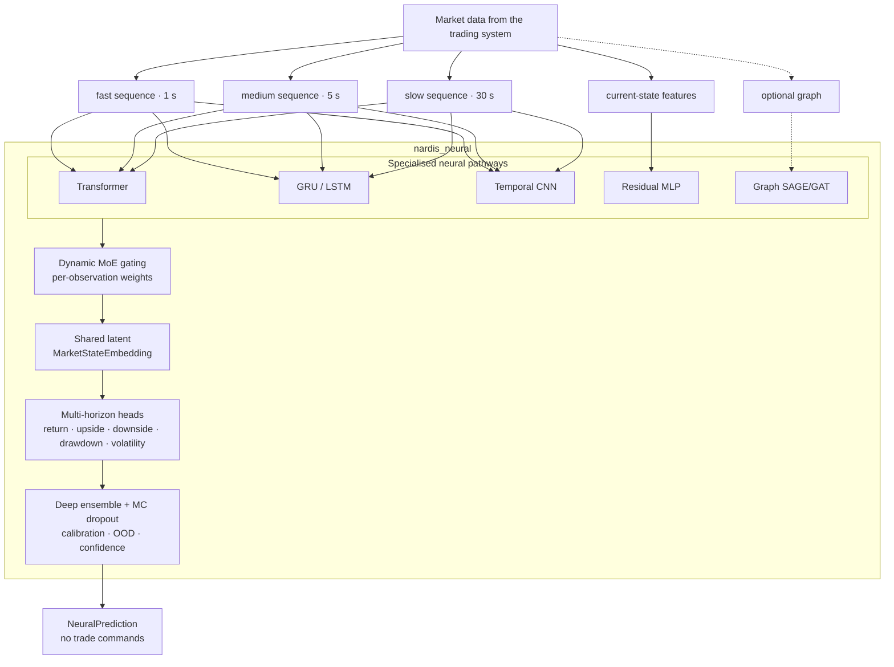

| Capability | Implementation |
|---|---|
| Temporal pathways | causal pre-LN Transformer, packed GRU/LSTM, dilated causal TCN, selective state-space (Mamba-style) SSM, residual MLP, optional relational GraphSAGE/GAT (pure PyTorch) |
| Hardware | one code path from a laptop CPU to a large GPU: `cpu-lite` / `cpu` / `gpu` / `gpu-frontier` profiles (≈0.17 M → 16.6 M parameters per member), auto-detected |
| Fusion | learned, per-observation softmax gate with load-balance, entropy and z-loss regularisers; expert dropout and noisy gating |
| Outputs | per horizon: return mean + variance + quantiles, max upside, max drawdown, volatility (heteroscedastic), upside/downside event probabilities |
| Uncertainty | deep ensemble (independent members), seeded MC dropout, epistemic / aleatoric / total decomposition, member disagreement |
| Calibration | temperature, Platt or isotonic, fitted on validation data only; Brier score, ECE, reliability bins |
| OOD & drift | Mahalanobis embedding distance, input z-score and disagreement OOD score; PSI / KS / Wasserstein / moment input drift, embedding, prediction and error drift |
| Continual learning | 3-pool replay (recent FIFO, historical reservoir, protected rare events), 5 sampling strategies, candidate cloning, distillation, EWC, full retraining with configurable weights |
| Lifecycle | immutable checkpoints, champion/candidate/challenger/retired/failed registry with audit log, shadow mode, 10-gate promotion, manual and optional automatic rollback |
| Representation | self-supervised pretraining (masked timestep, masked feature, contrastive), embedding export to Parquet/NumPy, KMeans / GMM / HDBSCAN regime discovery |
| Engineering | Pydantic v2 + YAML config, Typer CLI, CPU/CUDA/MPS, safe mixed precision, `mypy --strict`, `ruff`, 205 test functions |

## Quick start

```bash
# Python ≥ 3.12
python -m venv .venv && source .venv/bin/activate
pip install -e ".[dev]"

# synthetic demo data (testing only — not a market simulator)
nardis-neural generate-synthetic --out data/history --n 4000 --config configs/small.yaml
nardis-neural generate-synthetic --out data/live    --n 1500 --seed 1 --start-time 1700100000 --config configs/small.yaml

# train a calibrated deep ensemble and register it as champion of a workspace
nardis-neural train --data data/history --config configs/small.yaml --workspace workspaces/demo

# predict
nardis-neural predict --model workspaces/demo --data data/live --limit 5
```

In Python:

```python
from nardis_neural import NeuralEngine

engine = NeuralEngine.load("workspaces/demo")
prediction = engine.predict(observation)  # observation: NeuralObservation
```

## Architecture

The full design rationale is in [docs/ARCHITECTURE.md](docs/ARCHITECTURE.md).

### Neural pathways

| Expert | Highlights |
|---|---|
| **Transformer** (`models/transformer.py`) | pre-LayerNorm blocks, causal + key-padding attention mask via `scaled_dot_product_attention`, recency positional embedding + continuous time encoding, residuals, dropout, configurable depth/heads/width. Tests cover causality and padding invariance. |
| **Recurrent** (`models/recurrent.py`) | GRU by default (LSTM configurable). Observed steps are compacted and run as a packed sequence, so padding and interior gaps never enter the state. |
| **TCN** (`models/tcn.py`) | dilated causal convolutions, residual blocks, per-timestep LayerNorm (no future-leaking norms), unobserved steps held at zero, learned mixture over receptive-field scales. Tests cover causality and receptive field. |
| **SSM** (`models/ssm.py`) | selective state-space layers (Mamba-style): causal depthwise conv, input-dependent step size Δ and B/C matrices, diagonal stable A, gated output. Unobserved steps get Δ = 0 so the state passes through unchanged. Linear in sequence length, pure PyTorch (CPU / CUDA / MPS). Tests cover causality, gaps and padding invariance. |
| **Tabular** (`models/tabular.py`) | residual MLP with LayerNorm, GELU/SiLU and dropout for the immediate state vector. |
| **Graph** (`models/graph.py`, optional) | relational GraphSAGE or GAT over wallet→token / wallet→wallet / token→token edges, in pure PyTorch (no PyG dependency). Disabled by default; everything works without it. |

### Multi-timescale processing

Each sequence expert projects every timescale (feature dims may differ) together with
`log1p(age)` and the mask, adds a continuous time encoding and a **learned timescale
embedding**, and runs a **temporal core shared across timescales** (independent cores are
one config flag away). Masked last-step + mean pooling summarise each resolution, and an
attention-based **TimescaleFusion** combines them while masking missing timescales. At
inference all timescales are encoded in one stacked call. This is exact, because every
core is invariant to extra left padding.

### Mixture of experts

The gating network sees every expert's latent plus availability flags and outputs a
softmax over experts **for each observation**. Weights sum to 1, are returned with each
prediction, are exactly 0 for unavailable or runtime-disabled experts, start uniform
(zero-initialised gate) and are regularised against collapse by load-balance, entropy and
z-loss terms plus noisy gating and expert dropout. Experts are fused as `Σ w_e · A_e(h_e)`,
not by concatenation.

### Latent embedding & outputs

The mixture feeds a residual latent encoder that produces the **MarketStateEmbedding**,
used for regimes, nearest-neighbour search, OOD detection, drift monitoring and downstream
models. Separate per-horizon heads (default 30 s / 2 min / 5 min) predict:

- return: mean, heteroscedastic variance and non-crossing quantiles;
- max upside, max drawdown, volatility: softplus means with variances;
- `P(return > threshold)` and `P(drawdown > threshold)`: calibrated at inference.

## Uncertainty, calibration, OOD

- **Deep ensemble**: `ensemble.size` (default 3) independently initialised networks, each
  trained with its own optimiser, seed and data order (bootstrap optional).
- **MC dropout**: seeded extra passes through the decode stack, so inference is
  deterministic and cheap.
- **Decomposition**: aleatoric `E[σ²]`, epistemic `Var[μ]`, total; for events, expected
  entropy vs mutual information (BALD); plus member disagreement.
- **Calibration**: temperature, Platt or isotonic per (event, horizon), fitted on
  validation data only, with Brier / ECE / reliability reports.
- **OOD**: `ood_score` combines embedding Mahalanobis distance, input z-scores and
  disagreement, each normalised by its training 99th percentile.
- **Confidence** falls with epistemic uncertainty and with OOD.

## Training

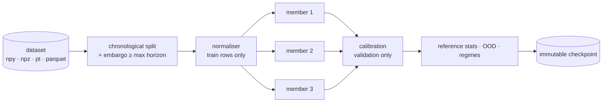

`Trainer` supports CPU/CUDA/MPS, mixed precision (CUDA bf16/fp16, MPS opt-in), gradient
clipping and accumulation, cosine / one-cycle / plateau schedules, early stopping,
per-epoch checkpoints with exact resume, deterministic seeds, NaN/Inf detection, JSONL
metrics, configurable batch size and workers, class weighting, focal loss, balanced
sampling and rare-event oversampling. Multi-task losses (Gaussian NLL / Huber / MSE,
pinball, BCE / weighted BCE / focal, static or learned uncertainty task weights) are
logged per component. Datasets are memory-mapped, so they never have to fit in RAM.

**Self-supervised pretraining** (`nardis-neural pretrain`) trains the temporal encoders on
unlabelled sequences with masked-timestep reconstruction, masked-feature reconstruction and
NT-Xent contrastive learning. Load the result with `train --pretrained`.

## Continual learning

Details are in [docs/CONTINUAL_LEARNING.md](docs/CONTINUAL_LEARNING.md).

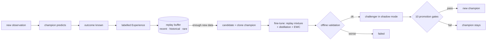

- **Replay**: a recent FIFO, a historical reservoir (old data is never simply dropped) and
  a protected rare-event store. Sampling can be uniform, recency-weighted, prioritized
  (with importance weights), rare-event or regime-balanced, and pools can be mixed.
- **Frequent adaptation**: clone the champion, fine-tune conservatively (low LR, few
  epochs, clipping) on a configurable mixture of recent, historical, rare and difficult
  samples, validate on the newest window with an embargo, and keep the input normaliser.
- **Anti-forgetting**: experience replay, **teacher/student distillation** from a frozen
  champion copy (tempered binary KL, regression and embedding terms, detached teacher) and
  optional **EWC** with a normalised diagonal Fisher.
- **Full retraining**: a fresh ensemble and normaliser trained on replay (plus optional
  external data), with configurable recent / historical / rare / difficult weights.
  Triggered by volume or input drift.

## Champion / challenger lifecycle

- **Registry** (`lifecycle/champion.py`): states `champion`, `candidate`, `challenger`,
  `retired`, `failed`. Model directories are immutable, `registry.json` is written
  atomically, and every transition goes to an audit log.
- **Shadow mode** (`lifecycle/shadow.py`): the challenger gets identical observations and
  its predictions are recorded but never returned. It is compared on regression, log loss,
  Brier, calibration, ranking, uncertainty quality and tails, per horizon, regime and time
  window.
- **Promotion** (`lifecycle/promotion.py`): minimum observations, return RMSE, log loss,
  tail MAE (required), plus Brier, ECE, rank correlation, NLL, time consistency and regime
  consistency. It produces JSON and Markdown reports.
- **Rollback** (`lifecycle/rollback.py`): manual, or automatic when live error degrades
  (**off by default**). It restores weights, normaliser, calibration, config and ensemble
  together.

## Regimes & drift

- `extract-embeddings` exports embeddings, gate weights, predictions and targets to
  Parquet or NPZ.
- `cluster-regimes` runs KMeans, GMM or HDBSCAN (optional automatic *k* via silhouette or
  BIC) and reports, per cluster: size, expert-weight profile, predicted and realised
  returns, errors, time span. Regimes are **discovered, never hand-defined**. Each engine
  also carries a fitted clusterer, so every prediction includes `regime_cluster`.
- `drift-report` covers four levels: raw input (PSI, KS, Wasserstein, moments), latent
  embedding (Mahalanobis distance ratio, KS, whitened mean shift), predictions, and model
  error.

## Inference API

```python
from nardis_neural import NeuralEngine, NeuralObservation, SequenceInput

engine = NeuralEngine.load("workspaces/prod")  # workspace → current champion
p = engine.predict(
    NeuralObservation(
        observation_id="tok:1718000000",
        timestamp=1718000000.0,
        current_features=current_vec,
        sequences={"fast": SequenceInput(values=bars_1s), "medium": SequenceInput(values=bars_5s)},
    )
)
p.expected_returns  # {"30s": …, "2m": …, "5m": …}
p.upside_probabilities, p.downside_probabilities, p.maximum_upside, p.maximum_drawdown
p.predicted_volatility, p.epistemic_uncertainty, p.aleatoric_uncertainty, p.total_uncertainty
p.confidence, p.ood_score, p.market_embedding, p.expert_weights, p.regime_cluster
```

The continual-learning API:

```python
from nardis_neural import ContinualLearner

trainer = ContinualLearner("workspaces/prod")
trainer.predict(observation)  # champion; challenger shadows
trainer.add_experience(observation, outcome)
trainer.adapt_if_needed()
trainer.full_retrain_if_needed()
trainer.promote_if_ready()
```

## CLI

| Command | Purpose |
|---|---|
| `init-config` | write the default YAML config |
| `generate-synthetic` | synthetic multi-regime dataset (npy / npz / pt / parquet, optional graphs, optional distribution shift) |
| `train` | train + calibrate an ensemble; `--workspace` registers it as champion (or as a challenger if a champion exists); `--pretrained`, `--resume` |
| `pretrain` | self-supervised encoder pretraining |
| `evaluate` | full metric report on a labelled dataset |
| `predict` | predictions from JSON observations or a dataset (JSONL out) |
| `extract-embeddings` | embeddings + gates + predictions → Parquet / NPZ |
| `cluster-regimes` | unsupervised regime discovery + per-cluster statistics |
| `ingest` | add labelled outcomes to the replay buffer (and to the shadow comparison) |
| `adapt` | continual adaptation (`--force` ignores the threshold) |
| `full-retrain` | weighted full retraining (`--data` for external data) |
| `shadow-evaluate` | challenger vs champion report (`--data` replays a dataset) |
| `promote` | evaluate promotion gates; `--version` forces a promotion |
| `rollback` | restore the previous (or `--to`) champion |
| `drift-report` | input / embedding / prediction / error drift |
| `inspect-model` | metadata, architecture and reference statistics |
| `status` | workspace lifecycle state |
| `benchmark` | latency, throughput and memory |
| `hardware` | detected device and recommended compute profile (`train --profile auto` applies it) |

## Configuration

Everything important is in YAML and validated by Pydantic (`src/nardis_neural/config.py`):
dimensions, timescales and sequence lengths, horizons and event thresholds, transformer
layers and heads, hidden sizes, TCN channels, recurrent depth and cell, dropout, experts
enabled, gating regularisers, ensemble size and MC samples, losses and task weights,
optimiser and LR, replay capacities and strategies, retraining thresholds and weights,
distillation and EWC weights, drift thresholds, promotion gates and rollback. Presets:

- `configs/default.yaml`: production-sized defaults (GPU or strong CPU);
- `configs/small.yaml`: compact model for CPU experiments.

## Repository layout

```
├── configs/                 default.yaml · small.yaml
├── README.md                generated: python -m nardis_neural.docgen (a test keeps it in sync)
├── docs/                    OVERVIEW.md · ARCHITECTURE.md · CONTINUAL_LEARNING.md · INTEGRATION.md ·
│                            SOLANA.md · EDGE.md · MOONSHOT.md · TAPE.md · CRITICALITY.md · CAPITAL.md (README sources)
├── examples/                nardis_integration.py (runnable, tested)
├── src/nardis_neural/
│   ├── config.py            Pydantic config tree
│   ├── schemas.py           NeuralObservation / NeuralOutcome / NeuralPrediction
│   ├── synthetic.py         multi-regime synthetic market generator (tests/demos)
│   ├── benchmark.py         latency / throughput / memory
│   ├── hardware.py          device detection + cpu-lite / cpu / gpu / gpu-frontier profiles
│   ├── docgen.py            builds README.md from docs/ + the code (CLI, config, features, API)
│   ├── cli.py               Typer CLI
│   ├── data/                loaders · datasets · sequences · splits · normalization · replay
│   ├── models/              transformer · recurrent · tcn · ssm · tabular · graph · experts ·
│   │                        gating · fusion · heads · ensemble · main · common
│   ├── training/            trainer · losses · metrics · scheduling · pipeline ·
│   │                        continual · distillation · ewc · pretraining
│   ├── inference/           engine · uncertainty · calibration · ood
│   ├── regimes/             embeddings · clustering
│   ├── lifecycle/           checkpoints · champion · candidate · shadow · promotion · rollback
│   ├── monitoring/          drift
│   └── solana/              amm · events · market · wallets · features · labels · dataset ·
│                            risk · simulator · brain · config · cli · streaming · hawkes ·
│                            forward · suite
│                            capital/ (allocator · bankroll · overfit · research)
│                            ingest/ (decoder · rpc · stream · history · encode · pumpfun · base58)
│                            edge/ (barriers · model · trees · backtest · research)
│                            moonshot/ (labels · tail · guard · online · research)
│                            tape/ (features · dataset · model · research · policy)
└── tests/                   205 test functions incl. synthetic end-to-end pipeline
```

## Testing & quality gates

```bash
ruff check .        # lint
ruff format --check .
mypy                # strict mode: src, tests and examples
pytest              # CUDA / MPS tests auto-skip when unavailable
```

The suite covers:

- Transformer shapes, causality and masking; recurrent and TCN causality; padding and gap
  invariance;
- gating sums, disabled experts and dynamic routing; gradients reaching every expert;
- probabilistic and multi-task losses; trainer resume and determinism;
- ensemble disagreement, calibration and OOD;
- checkpoint and normaliser persistence; replay strategies and persistence;
- candidate/champion isolation, adaptation, distillation, EWC and pretraining;
- regimes and drift; shadow mode, promotion gates and rollback;
- leakage-free chronological and walk-forward splits (property-based), deterministic
  inference, devices, every CLI command, the integration example;
- a **synthetic end-to-end test**: data → train ensemble → predict → uncertainty →
  experiences → replay → adaptation → shadow → promotion → checkpoint → reload → identical
  inference → rollback.

## Performance

Default configuration (3 members × 729 k parameters, 5 experts incl. SSM, 2 MC samples),
CPU only, 4-core Xeon @ 2.1 GHz:

| | p50 latency | throughput |
|---|---|---|
| single observation (full API) | ~49 ms | – |
| batch 32 | ~190 ms | ~170 obs/s |
| batch 256 | ~1.2 s | ~215 obs/s |
| single observation, `mc_dropout_samples: 0` | ~39 ms | – |
| single observation, `--profile cpu-lite` (2 × 168 k) | ~21 ms | ~640 obs/s at batch 256 |

Peak RSS is about 1 GB (0.8 GB for `cpu-lite`). GPUs are much faster. Run `nardis-neural benchmark` on your
hardware.

## Future Nardis integration

See [docs/INTEGRATION.md](docs/INTEGRATION.md) and the runnable
[`examples/nardis_integration.py`](examples/nardis_integration.py). In short: build a
`NeuralObservation` from generic tensors (`build_bars` turns raw event streams into
leakage-free bars), call `predict`, report `NeuralOutcome`s as horizons elapse, and run
`adapt_if_needed` / `full_retrain_if_needed` / `promote_if_ready` on a background timer.
The trading system never touches model internals.

## Solana intelligence layer

`nardis_neural.solana` specialises the brain for Solana memecoin markets. See
[docs/SOLANA.md](docs/SOLANA.md).

- exact **pump.fun bonding-curve and AMM maths**: bonding progress, graduation,
  round-trip cost (fees + two-way impact) for a reference size;
- a **causal market state** fed by decoded events (launches, swaps, migrations, LP changes,
  SOL transfers) that rejects time travel;
- **wallet intelligence**: union-find funding clusters with exchange-hub detection
  (sybil / bundle discovery) and Beta-posterior reputations learned online *only* from
  outcomes that have already resolved, plus rug attribution to creator clusters. A second,
  **runner-specific skill** credits wallets that buy early into tokens that later run 10x;
- **73 named on-chain features**: holder concentration, dev / sniper / bundle /
  creator-cluster exposure, fresh wallets, smart-money flow, runner-skilled buyers,
  sybil-resistant counts per funding cluster, the supply held by a hidden multi-wallet cluster, the **creator family's track record** (prior
  launches, best peak, rug and graduation rates), market-wide heat, bots, priority fees and
  Jito tips, authorities, liquidity. Also 1 s / 5 s / 30 s trade bars with forward-filled
  prices, and a live wallet→token / funding / cluster **graph** for the graph expert;
- **hindsight labels** (returns, cost-aware net returns, rug / graduation / dev-dump events)
  joined with **causally replayed features**; a test proves snapshots equal what a
  past-only market would compute;
- a **launch-risk ensemble** (P rug, P graduation, P dev dump) on
  `[embedding ‖ on-chain features]`, with token-disjoint validation and calibration;
- **`SolanaBrain`**: `ingest → assess_many → resolve → maintenance`, returning forecasts,
  risk, expected net return after costs, P(beat costs) and human-readable red flags. It
  plugs into the continual-learning, shadow, promotion and rollback machinery;
- **real-chain ingestion**: a decoder for `getTransaction` JSON (pump.fun Anchor events,
  venue-agnostic AMM vault-delta swaps and LP changes, SOL funding transfers, Jito tips,
  priority fees), a **read-only** RPC client, and a cursor-based live streamer
  (`solana backfill`, `solana stream`, `solana decode`);
- an **agent-based launch simulator** (retail, smart money, snipers, bots, loud and stealth
  rug crews, decoys, graduations, LP pulls) and the `nardis-neural solana …` CLI
  (`simulate`, `build-dataset`, `bootstrap`, `replay`, `assess`, `decode`, `backfill`, `stream`,
  `stream-train`, `init-config`);
- **training by streaming history** (`solana stream-train`): walks an archival RPC such as
  Old Faithful oldest → newest, fetching only pump.fun / PumpSwap transactions, and learns
  online with bounded memory (token eviction, compact wallet state, rolling buffers),
  gated online refits of the tail model and resumable checkpoints. Nothing is stored.

```python
from nardis_neural.solana import SolanaBrain, EventStore

brain = SolanaBrain.bootstrap("workspaces/sol", EventStore.load("history/"))
brain.ingest(event)  # decoded on-chain events, in time order
for report in brain.assess_active():  # one batched forward pass per round
    report.risk["rug"], report.expected_net_return["60s"], report.flags
brain.resolve()
brain.maintenance()
```

## Edge engine

`nardis_neural.solana.edge` hunts for **edge after costs** and checks whether it is real.
See [docs/EDGE.md](docs/EDGE.md).

- **executable triple-barrier labels**: latency-delayed entry and exit, exact bonding-curve
  and AMM impact plus fees on both legs, take-profit / stop-loss / time exits;
- **walk-forward out-of-fold** retraining of the neural ensemble and risk model, so the
  second stage only ever learns from forecasts a live system would have seen;
- a **meta-labeling edge model**: a bootstrap ensemble predicting calibrated P(win) and
  expected net return; a lower-confidence-bound edge score; a capped fractional-Kelly hint;
- an **honest backtest**: fit / tune / test in time order, threshold chosen on tune, one
  shot on test, position constraints, bootstrap confidence intervals, compared with random,
  momentum and take-everything baselines at the same trade budget;
- `nardis-neural solana edge-research` installs the model; every `SolanaAssessment` then
  carries `edge` (p_win, expected_net, edge_score, kelly_fraction, above_threshold).

## Moonshot engine

`nardis_neural.solana.moonshot` is for the other end of the distribution: the rare launch
that runs 100x to 1000x. See [docs/MOONSHOT.md](docs/MOONSHOT.md).

- **executable peak-multiple labels**: the best liquidation multiple a ticket bought now
  could have realised (latency on both legs, own impact, fees). Labels are
  **right-censored** while a token is still running, and dead tokens resolve causally;
- a **censored power-law tail model**: a deep ensemble of mixture-of-log-logistic
  networks gives calibrated P(peak ≥ 2x, 5x, 10x, 100x, 1000x) per token, with a learned
  tail index and epistemic spread;
- **decision helpers**: expected payoff of a take-profit ladder with a trailing moon bag,
  and a **lottery-Kelly** fraction that maximises expected log-wealth;
- **hard to fool**: per-level tail calibration on held-out tokens, inputs clamped to the
  training range, and a manipulation guard (rug risk, authorities, wash trading, bundles,
  creator clusters, OOD, ensemble disagreement) whose `trust` score and hard vetoes only
  ever lower the output. `SolanaBrain.moonshot_ranking()` returns active tokens by
  `chase_score`, best first;
- **honest research**: train on earlier tokens with labels truncated at the cutoff, score
  once on later tokens against every-launch, random and momentum tickets;
- `runner` launches in the simulator (`solana simulate --market degen`) so there are real
  100–1000x+ tails to find; `nardis-neural solana moonshot-research` installs the model and
  every `SolanaAssessment` then carries `moonshot` (`p_ge_10x`, `p_ge_1000x`,
  `expected_multiple`, `lottery_kelly`, `tail_index`, `in_entry_window`, …).

## Tape Transformer

`nardis_neural.solana.tape` reads the **raw trade tape** instead of aggregates. See
[docs/TAPE.md](docs/TAPE.md).

- the last 96 trades, each with 18 features (side, size, timing, price move, fees, and the
  trader's skill, runner skill, cluster, creator link and freshness as known now), plus a
  **learned wallet embedding** keyed by a stable hash of the address;
- a small pre-LayerNorm **Transformer** with a summary token, fused with the 73 current
  features. Frequency gating and wallet dropout stop the wallet table from memorising noise;
- two heads: the censored power-law **tail** (P ≥ 2x … 1000x) and a discrete-time **collapse
  hazard** (P value halves within 1 min / 5 min / 15 min / 1 h), which is the exit signal;
- causal tape replay, research scored head-to-head against the tail model on identical rows,
  `nardis-neural solana tape-research`, and `SolanaAssessment.tape` on every assessment.
  Across two simulated markets the collapse head reaches AUC 0.90–0.97. Neither entry
  model ranked the tail best every time, so `chase_score` uses their blend. A learned exit
  alarm is evaluated too; it is not yet a reliable edge (+3 % and −12 % test PnL).
- a **forward-test ledger** in `SolanaBrain` settles every paper ticket the signals would
  have taken, with and without the exit alarm (`solana forward-report`). It is a
  walk-forward backtest during `stream-train` and a paper scorecard live;
- `solana research-suite` repeats the research on several independent markets and
  reports mean ± sd; the `adversarial` market adds staged "trap" launches.

## Criticality engine

`nardis_neural.solana.hawkes` measures how close each token's buying is to a **phase
transition**: its viral R₀. See [docs/CRITICALITY.md](docs/CRITICALITY.md).

- an online **self-exciting (Hawkes) process** fit: exact maximum likelihood by vectorised
  EM, with exact O(N) kernel sums, history conditioning and a **detrended background**, so
  a fading launch rush is not mistaken for a cascade. An optional second, fast kernel
  separates same-slot reflexes from human herding;
- five features: buy and sell **branching ratios** (follow-on buys each buy triggers),
  their trend (is the token *approaching* criticality?), the herding timescale and the
  **endogenous share** (herding vs scripted flow);
- self-exciting **herding** in the simulator (`--herding`), and an ablation measured with
  and without the features on identical splits.

## Capital engine

`nardis_neural.solana.capital` turns signals into a sized book and checks whether the edge
is real. See [docs/CAPITAL.md](docs/CAPITAL.md).

- a **capital allocator**. The stake is the lottery-Kelly fraction, scaled by trust,
  uncertainty and the forward ledger's live **track record**, then capped per position,
  per **pool liquidity**, per **creator family**, by total exposure and by position count.
  A **drawdown governor** and a **daily loss stop** sit on top (`brain.allocate`,
  `solana allocate`); it gives advice and never places orders;
- an event-driven **bankroll simulator** (capital locked while open) with a bootstrap risk
  profile (P(loss), P(−50 %), drawdown quantiles) and **stress tests** that scale every
  payoff down;
- **Deflated Sharpe Ratio** and **Probability of Backtest Overfitting** (combinatorially
  symmetric cross-validation) in every moonshot research report.

## Optional / not included

- **Graph pathway**: implemented and tested, but disabled by default. It needs graph
  inputs from the trading system and no extra dependency.
- **Parquet datasets** carry features and targets but not graphs; use `.npy` directories,
  `.npz` or `.pt` for graph data.
- **Regime cluster ids are per model version**: each adaptation refits clusters on its own
  embedding space.
- **Offline candidate validation** uses a held-out half of the newest window, which is
  small by design. Shadow mode on genuinely new data is the decisive test.
- **Distributed or multi-node training** is intentionally out of scope (no Ray, Spark,
  Kafka and so on). Single-GPU or CPU training is supported.
- **Real-market data ingestion** is out of scope: the trading system produces the datasets.
  The synthetic generator exists to test the ML system, not to model profitability.

# Part II — In depth

The complete contents of every document in `docs/`.

## Architecture

This document describes the neural architecture of `nardis_neural` and the reasoning
behind each design decision. For the learning lifecycle see
[CONTINUAL_LEARNING.md](docs/CONTINUAL_LEARNING.md); for wiring it into a trading system see
[INTEGRATION.md](docs/INTEGRATION.md).

### 1. Scope

The repository is the ML *brain* only. It receives generic tensors and returns
probabilistic forecasts. There is **no** RPC, wallet, transaction, order-routing or
strategy code, and no output is ever a BUY/SELL instruction.

### 2. Data contract

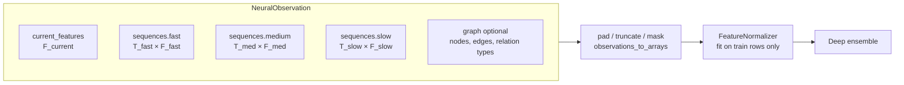

* Every sequence is ordered oldest → newest; `time_deltas[i]` is the age of step `i` in
  seconds relative to the observation time. Sequences are **left-padded** to `max_len`
  (the most recent step is always the last index) and carry a boolean mask. Rows that are
  all-NaN are treated as missing, so interior gaps are supported.
* Timescales, feature dimensions, horizons and thresholds all come from YAML — no
  Solana-specific names exist anywhere in the neural core.
* On disk, datasets use a flat `key → ndarray` layout: a directory of `.npy` files opened
  with `mmap_mode="r"` (never fully loaded), or `.npz`, `.pt`, or `.parquet` (streamed by
  row batch into memmaps). Optional graphs are stored as ragged arrays with offsets.
* `build_bars` turns a raw irregular event stream into fixed-resolution bars using only
  events at or before the observation time, which makes look-ahead impossible.

### 3. Network

```mermaid
flowchart TB
    subgraph Inputs
        cur[current features]
        fast[fast seq]
        med[medium seq]
        slow[slow seq]
        graph[graph - optional]
    end

    subgraph Experts[Specialised pathways]
        direction LR
        TR[Transformer expert<br/>pre-LN, causal, masked,<br/>time + recency encoding]
        RN[Recurrent expert<br/>GRU / LSTM, packed,<br/>gap-aware]
        TC[TCN expert<br/>dilated causal conv,<br/>multi-scale skips]
        SM[SSM expert<br/>selective state space,<br/>input-dependent Δ]
        TB[Tabular expert<br/>residual MLP]
        GR[Graph expert<br/>relational SAGE / GAT]
    end

    fast & med & slow --> TR & RN & TC & SM
    cur --> TB
    graph --> GR

    TR & RN & TC & SM & TB & GR --> Gate[Dynamic gating network<br/>softmax over available experts<br/>load-balance + entropy + z-loss]
    TR & RN & TC & SM & TB & GR --> Mix[Expert adapters<br/>Σ w_e · A_e h_e]
    Gate -- per-observation weights --> Mix
    Mix --> Lat[Latent encoder<br/>MarketStateEmbedding]
    Lat --> H1[return heads<br/>μ, log σ², quantiles]
    Lat --> H2[max-upside heads]
    Lat --> H3[max-drawdown heads]
    Lat --> H4[volatility heads]
    Lat --> H5[upside event heads]
    Lat --> H6[downside event heads]
```

#### 3.1 Multi-timescale processing (design choice)

Each sequence expert contains:

1. a **per-timescale input projection** of `[values·mask, log1p(age)·mask, mask]`
   (timescales may have different feature dimensions),
2. a **continuous time encoding** (learnable Fourier features of `log1p(age)`) plus a
   **learned timescale embedding**,
3. **one temporal core shared across timescales** (default) or one core per timescale,
4. masked pooling (last observed step + masked mean),
5. a **TimescaleFusion** module: attention pooling over the timescale summaries with
   missing timescales masked. Its weights are exposed for inspection.

**Why share the core?** The fast, medium and slow streams show the same kinds of
dynamics (momentum, bursts, reversals) at different speeds. A shared core sees roughly
three times more sequences per parameter, which regularises it strongly, and the
timescale embedding plus continuous age encoding still let it condition on resolution.
Independent cores stay available (`share_encoder_across_timescales: false`) for streams
that behave very differently.

At inference, a shared core encodes **all timescales in one call**: projected sequences
are left-padded to a common length and stacked on the batch axis. This is exact, not an
approximation: every core is invariant to extra left padding (key masking in the
Transformer, packed sequences in the RNN, zero-held unobserved steps in the TCN, Δ = 0
on unobserved steps in the SSM), and a
test asserts equality with per-timescale encoding. Training keeps per-timescale calls
so it doesn't pay for padding compute.

#### 3.2 Pathways

| Expert | Mechanism | What it specialises in |
|---|---|---|
| Transformer | pre-LayerNorm blocks, `scaled_dot_product_attention` with combined causal + key-padding mask, recency positional embedding + continuous time encoding, GELU feed-forward, residuals, dropout | long-range, content-addressed dependencies |
| Recurrent | GRU (default) or LSTM; observed steps are compacted chronologically and run as a *packed* sequence, so padding and interior gaps never touch the recurrent state | smooth sequential state accumulation |
| TCN | dilated causal convolutions (left padding only) in residual blocks; per-timestep LayerNorm (batch/group norm over time would leak the future); a learned softmax mixture of every block's output (multi-receptive-field skips) | local patterns, bursts, short shocks |
| SSM | selective state-space layers (Mamba-style): pre-LN, input projection into signal and gate, causal depthwise conv, input-dependent step Δ and B / C, diagonal scan `s_t = exp(Δ_t A) s_{t−1} + Δ_t B_t x_t`, `y_t = C_t s_t + D x_t`, SiLU gate, residual. Unobserved steps get Δ = 0 and zero input, so the state passes through gaps and padding unchanged. The scan is sequential in pure PyTorch: linear in length, no custom kernels | per-step choice of what to remember: bursts reset state, quiet periods keep it |
| Tabular | residual MLP (pre-LN residual blocks, GELU/SiLU, dropout) | immediate state without history |
| Graph (optional) | pure-PyTorch relational GraphSAGE or GAT (per-relation weights / attention bias), readout = target node ‖ mean pool | wallet→token, wallet→wallet, token→token structure |

**Why no PyTorch Geometric?** The graphs are small per-observation ego-graphs.
`index_add_`/`scatter_reduce` message passing is short, fast and dependency-free, so graph
support never breaks installation. Graphs are disabled by default and the repository works
without them.

#### 3.3 Mixture of experts

The gate receives every expert's layer-normalised latent plus availability flags and
outputs a per-observation softmax over experts:

* **Unavailable experts are masked**: a sequence expert whose timescales are all missing,
  the graph expert when a sample has no graph, and experts disabled at runtime
  (`set_disabled_experts`) all get weight exactly 0. If nothing is available the gate
  falls back to uniform weights instead of producing NaN.
* **Anti-collapse regularisation**:
  * *load balance* `E·Σ_e importance_e² − 1`, which is zero when batch-average usage is
    uniform but still allows sharp routing for individual samples;
  * a small *entropy bonus* on per-sample weights, so the gate doesn't saturate before
    evidence accumulates;
  * *z-loss* on gate logits, for stability;
  * *noisy gating* and *expert dropout* during training, so every expert keeps receiving
    gradient.
* The final gate layer is zero-initialised, so routing **starts uniform and is learned**.
  Nothing is hand-assigned.
* Fusion is `Σ_e w_e · A_e(h_e)` with an expert-specific adapter `A_e`, not a plain
  concatenation.

#### 3.4 MarketStateEmbedding

The mixture passes through a residual latent encoder with a final LayerNorm to give the
`latent_dim`-dimensional **MarketStateEmbedding**. It is returned with every prediction
and used for OOD scoring, drift detection, regime discovery, nearest-neighbour search and
downstream models. Deep-ensemble members learn different latent coordinate systems, so the
published embedding comes from one fixed member (`ensemble.embedding_member`) to keep its
geometry stable.

#### 3.5 Multi-task, multi-horizon heads

Each (task, horizon) pair has its own two-layer MLP. Per-horizon weights live in batched
tensors and are evaluated with one `einsum`.

| Task | Output | Activation |
|---|---|---|
| `return` | mean, log-variance, quantiles (default 10/50/90 %) | identity; quantiles are a base plus cumulative softplus increments, so they never cross |
| `max_upside` | mean, log-variance | softplus (non-negative) |
| `max_drawdown` | mean, log-variance | softplus (positive magnitude) |
| `volatility` | mean, log-variance | softplus |
| `upside` | logit of P(return > threshold_h) | sigmoid + calibration at inference |
| `downside` | logit of P(drawdown > threshold_h) | sigmoid + calibration at inference |

Log-variances are soft-bounded to `[-9, 5]` with `tanh`. The model works in *normalised
target space*: regression targets are scaled (not centred, so magnitudes stay
non-negative) by training-set RMS, and the engine maps outputs back to real units.

### 4. Losses

`MultiTaskLoss` combines the following (every component is logged separately):

* regression: heteroscedastic Gaussian NLL (default), Huber or MSE. With Huber or MSE, a
  detached-mean Gaussian NLL still trains the variance heads, so aleatoric uncertainty is
  always available;
* pinball loss on the return quantiles;
* classification: BCE, weighted BCE (`pos_weight` either automatic neg/pos or fixed) or
  focal loss;
* static task weights or learned homoscedastic uncertainty weighting (Kendall et al.);
* gate regularisers;
* target masks (unknown horizons) and per-sample weights (replay, retraining weights).

Class imbalance is handled with class weighting, focal loss, class-balanced sampling and
rare-event oversampling, each configurable independently.

### 5. Training engine

`Trainer.fit` trains a single network and is deliberately transparent. It supports:

* CPU, CUDA and MPS devices;
* mixed precision where safe (CUDA bf16, or fp16 with `GradScaler`; MPS only on explicit
  request);
* gradient accumulation and clipping;
* cosine-with-warmup, one-cycle, plateau or constant LR schedules;
* early stopping on validation loss, restoring the best weights;
* per-epoch checkpoints with exact resume (optimizer, scheduler, scaler and RNG states);
* deterministic seeding;
* NaN/Inf detection that skips bad steps and aborts after N consecutive ones;
* JSONL metrics.

`train_engine` (in `training/pipeline.py`) runs the complete recipe:

1. Chronological split with an **embargo** equal to the longest horizon, because a label at
   time *t* looks up to *t + horizon* into the future.
2. Fit the normaliser on **training rows only**.
3. Train each ensemble member independently (own seed, data order and optional bootstrap).
4. Fit probability calibration on the **validation** split.
5. Record reference uncertainty statistics.
6. Fit the OOD detector and regime clusters on training embeddings.
7. Compute validation metrics and write the checkpoint metadata.

### 6. Uncertainty

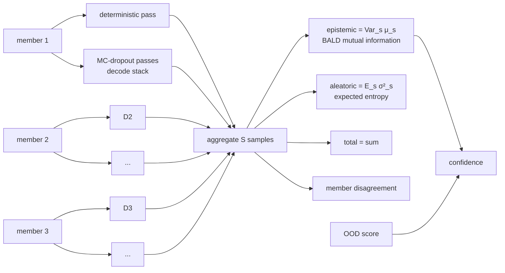

* **Deep ensemble**: `ensemble.size` independently initialised and independently trained
  full networks (default 3).
* **MC dropout**: `mc_dropout_samples` extra stochastic passes per member, seeded so
  inference stays deterministic. The expensive expert encoders run once per member; dropout
  is resampled only in the gate → mixture → latent → heads stack. This cut
  single-observation latency by about 3× and still gives within-member stochasticity, while
  encoder-level diversity comes from the ensemble.
* Regression uncertainty follows the law of total variance; classification uses the
  information-theoretic split (total entropy = expected entropy + mutual information).
* **Confidence** = `1/(1 + epistemic/median_val_epistemic) · exp(−penalty·max(0, ood−1))`.
  It is 0.5 at typical validation uncertainty, approaches 1 when members agree, and decays
  outside the training distribution.

### 7. Calibration and OOD

* `CalibrationSet` holds one calibrator per (event task, horizon): temperature scaling,
  Platt scaling or isotonic regression. Calibrators are fitted on validation data only and
  stored as plain JSON. Brier score, ECE, log loss and reliability bins are recorded
  before and after calibration.
* `OODDetector` combines three signals, each normalised by its 99th percentile on training
  data:
  1. Mahalanobis distance of the embedding (shrinkage covariance);
  2. RMS z-score of raw inputs;
  3. ensemble epistemic uncertainty.

  An `ood_score` above 1 means "outside familiar territory" and lowers confidence.

### 8. Checkpoints

Each model version is an immutable directory written atomically:

```
<version>/
  manifest.json      version, parent, created_at, git commit, data fingerprint,
                     ensemble metadata (size, seeds, embedding member, MC samples),
                     training statistics, reference statistics, target definitions,
                     horizons, expert names, format/torch/package versions
  config.yaml        full configuration (architecture, horizons, everything)
  members/member_i.pt   weights (loaded with torch.load(weights_only=True))
  normalizer.json    normalisation state
  calibration.json   calibrators + calibration report
  ood.json           OOD detector
  regimes.json       regime clusterer
```

Everything needed to reproduce inference exactly is in the directory. Tests check that a
reload gives bit-identical outputs.

### 9. Performance

Measured on a 4-core Intel Xeon @ 2.1 GHz (CPU only) with the **default** configuration
(3 members × ~729 k parameters, five experts including the SSM, sequence lengths 64/48/32):

| MC samples | single obs p50 | batch 32 | batch 256 |
|---|---|---|---|
| 2 (default) | ~49 ms | ~190 ms (≈170 obs/s) | ~1.2 s (≈215 obs/s) |
| 0 | ~39 ms | ~150 ms (≈210 obs/s) | ~1.1 s (≈235 obs/s) |
| `cpu-lite` profile (2 × 168 k, MC 0) | ~21 ms | ~88 ms (≈365 obs/s) | ~0.4 s (≈640 obs/s) |

The SSM scan is a plain loop over time. On CPUs it measured faster than a parallel prefix
scan, which is memory-bound at these batch sizes.
Peak RSS was about 1 GB (0.8 GB for `cpu-lite`), including PyTorch itself. A GPU is much faster; widths, depths
and sequence lengths can be scaled up or down in YAML. Measure your own hardware with
`nardis-neural benchmark`.

#### 9.1 Hardware profiles

`nardis_neural.hardware` scales one architecture to the machine. `nardis-neural hardware`
prints what was detected, and `train --profile auto` (or `solana bootstrap --profile …`)
applies it:

| profile | model per member | ensemble / MC passes | parameters per member | picked when |
|---|---|---|---|---|
| `cpu-lite` | d = 32, 1-layer experts, SSM state 8 | 2 / 0 | ≈ 0.17 M | CPU with < 8 cores |
| `cpu` | d = 48, 2-layer experts, SSM state 16 | 3 / 1 | ≈ 0.39 M | CPU with ≥ 8 cores |
| `gpu` | d = 128, 3-layer experts, 2 SSM layers | 5 / 2 | ≈ 3.2 M | CUDA or Apple MPS |
| `gpu-frontier` | d = 256, 6-layer Transformer, 4 SSM layers with state 32 | 5 / 4 | ≈ 16.6 M | CUDA with ≥ 16 GB |

Every profile produces the same inputs and outputs, so checkpoints, the lifecycle and the
Solana modules work unchanged. GPU profiles use mixed precision where it is safe.

## Continual learning

The model keeps learning from newly labelled market observations. The production champion
is never trained, mutated or overwritten in place.

### 1. The loop

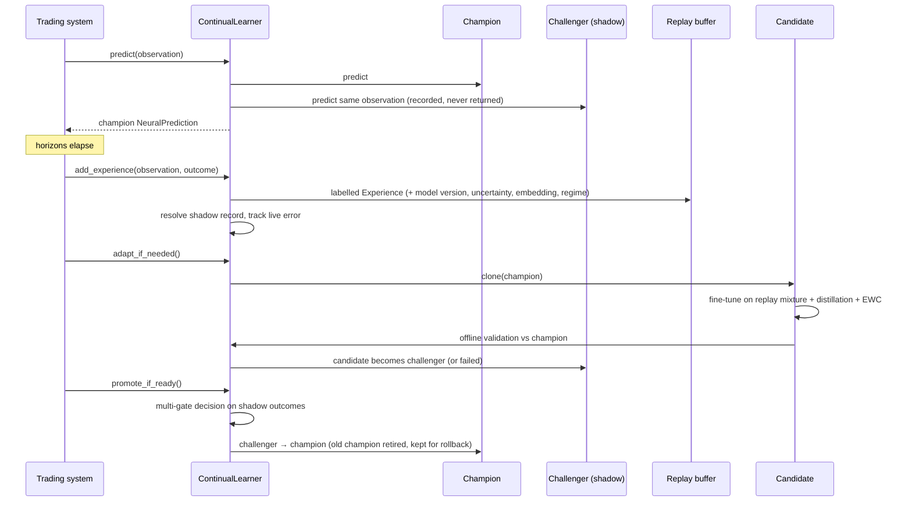

### 2. Experiences and replay

`Experience` holds the observation arrays, timestamp, targets and target mask, the version
of the model that made the original prediction, its prediction summary, its uncertainty,
the latent embedding and regime cluster at prediction time, a priority (the standardised
error of the original prediction) and a rare-event flag.

`ExperienceReplayBuffer` keeps three pools. None of them simply drops old data when full.

| Pool | Policy |
|---|---|
| recent | FIFO of the newest experiences |
| historical | reservoir sample (algorithm R) of everything that ever left the recent pool, i.e. unbiased long-term memory |
| rare | protected store of extreme outcomes; when full, the lowest-priority/oldest item is evicted |

Sampling strategies: `uniform`, `recency` (exponential half-life), `prioritized` (PER with
importance weights `(N·P)^-β`), `rare`, `regime_balanced`. `sample_mixture` combines pools
with configurable fractions. The buffer is persisted as memory-mappable arrays plus JSON
metadata and an embeddings matrix.

### 3. Frequent adaptation (`adapt`)

Triggered when `continual.min_new_samples` new experiences have arrived.

1. **Validation window**: the most recent `adapt_validation_fraction` of the *new*
   experiences. They are never used for training.
2. **Eligible training data**: experiences with timestamp ≤ `validation start − embargo`,
   so no label window overlaps validation.
3. **Replay mixture** (`adapt_samples` rows): recency-weighted recent
   (`recent_fraction`), uniform historical (`historical_fraction`), rare events
   (`rare_fraction`) and high-error "difficult" samples (`difficult_fraction`).
4. **Candidate = deep clone of the champion.** It shares no tensors, normaliser or
   calibrator objects, and a test asserts this.
5. **Conservative fine-tuning**: `adapt_learning_rate`, `adapt_epochs`, gradient clipping,
   early stopping on the validation window. The champion's normaliser is kept, so the input
   space doesn't move.
6. **Objective** = supervised multi-task loss
   + **distillation** from a frozen copy of the champion (teacher outputs computed under
   `no_grad`, i.e. detached): binary KL on tempered event probabilities (× T²), MSE on
   regression means and log-variances, and a cosine term on embeddings
   + **EWC** penalty `λ/2 Σ F_i(θ_i − θ*_i)²`, with the diagonal Fisher estimated on
   historical replay at the champion's parameters and normalised to mean 1.
7. Refit calibration, OOD and regimes for the candidate.
8. **Offline gate on a true holdout**: the validation window is split chronologically.
   The earlier half drives early stopping and calibration; the later half is never seen
   by the candidate. On that holdout, compare the mean relative change in return RMSE and
   event log losses against the champion. Above `offline_max_degradation` → status
   `failed`; otherwise → `challenger` (shadow mode). Windows under 20 samples are not
   split.

### 4. Periodic full retraining (`full_retrain`)

Triggered by `full_retrain_min_new_samples`, or by input drift between the historical and
recent replay pools (`full_retrain_on_drift`).

* A **fresh** ensemble is trained from scratch, with a new normaliser fitted on the new
  training split.
* Data: every replay experience plus an optional external dataset (e.g. a fresh export
  from the trading system).
* Per-sample loss weights, all configurable and none hard-coded:
  `recent_weight` (last `full_retrain_recent_window` experiences) versus
  `historical_weight`, multiplied by `rare_weight` for rare events and by
  `difficult_weight` for the top-20 % priority samples. Weights are normalised to mean 1.
* Chronological split with embargo; the same held-out offline gate; enters shadow mode as a
  challenger.

### 5. Self-supervised pretraining

`pretrain_encoders` trains the sequence experts on **unlabelled** data before supervised
training:

* **masked timestep reconstruction**: whole observed steps are blanked and reconstructed.
  With causal encoders this becomes a forecasting-style objective;
* **masked feature reconstruction**: individual (step, feature) entries are blanked and
  reconstructed;
* **contrastive**: NT-Xent between two augmentations (jitter, scaling, step dropout) of
  each sample's fused multi-timescale representation.

Encoder weights (`experts.*`) are then loaded into every ensemble member
(`train --pretrained`). Pretraining is optional; supervised training works without it.

### 6. Shadow mode

When a challenger exists, `ContinualLearner.predict` runs it on the **identical**
observation arrays, stores both predictions in `shadow/records.jsonl`, and returns only
the champion's `NeuralPrediction`. When outcomes arrive the records are resolved. The
`ShadowReport` then compares the two models:

* overall and per-horizon regression error, log loss, Brier score, ECE, AUC, ranking
  quality (Spearman), uncertainty quality (Gaussian NLL, 90 % coverage, uncertainty–error
  rank correlation), tail-event MAE for returns and drawdowns, downside tail recall;
* the same metrics per regime cluster;
* the same metrics per consecutive time window.

`shadow-evaluate --data` replays a labelled dataset through both models offline.

### 7. Promotion

`evaluate_promotion` produces an auditable `PromotionDecision`. It is saved as JSON and
Markdown in `reports/`.

| Gate | Default rule |
|---|---|
| `min_observations` (required) | ≥ `min_observations` resolved shadow samples |
| `return_rmse` (required) | challenger ≤ champion × `max_rmse_ratio` |
| `log_loss` (required) | mean event log loss ≤ champion × `max_log_loss_ratio` |
| `tail_mae` (required) | tail return/drawdown MAE ≤ champion × `max_tail_mae_ratio` |
| `brier` | ≤ champion × `max_brier_ratio` |
| `calibration_ece` | ≤ champion + `max_ece_increase` |
| `rank_corr` | ≥ champion + `min_rank_corr_delta` |
| `uncertainty_nll` | ≤ champion + `max_nll_increase` |
| `time_consistency` | challenger wins ≥ `min_window_win_fraction` of time windows |
| `regime_consistency` | no regime degrades by more than `max_regime_degradation` |

A challenger is promoted only if every required gate passes **and** at least
`min_passed_fraction` of all gates pass. It is never reduced to a single metric.

### 8. Rollback

Each model directory is complete and immutable, so a rollback only moves the registry's
champion pointer. That restores weights, normaliser, calibration state, configuration and
ensemble membership together.

* Manual: `nardis-neural rollback --workspace W [--to VERSION]`, or
  `learner.rollback()`.
* Automatic (**off by default**, `lifecycle.auto_rollback: true` to enable): after a
  promotion, the live mean absolute return error of the champion's resolved predictions is
  compared with the challenger's shadow MAE at promotion time. If it exceeds
  `baseline × (1 + auto_rollback_degradation)` over `auto_rollback_min_observations`
  samples, the previous champion is restored.
* After every promotion, `ModelRegistry.prune(lifecycle.keep_champions)` deletes the
  weights of failed models and of retired models beyond the newest `keep_champions` (5)
  former champions, which stay available as rollback targets. Registry entries and the
  audit log are kept. This keeps disk use bounded when the learner runs for months.

### 9. Lifecycle states

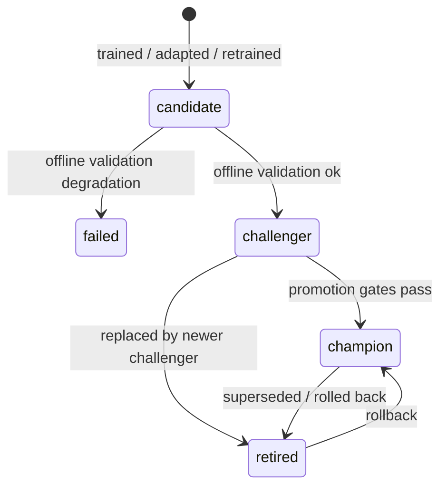

### 10. Time-series safety

* `chronological_split`, `walk_forward_splits` (expanding or rolling) and
  `rolling_window_splits` never shuffle across time and apply an embargo ≥ the longest
  label horizon.
* Normalisation, calibration, OOD references and regime clusters are fitted only on data
  that precedes the corresponding validation period.
* Hypothesis property tests assert `max(train time) ≤ min(validation time) − embargo` for
  arbitrary timestamp sets.

## Integrating with the trading system (Nardis)

The trading system only needs four calls and three schemas. It never needs to know about
experts, ensembles, normalisation or checkpoints.

### 1. Install

```bash
pip install -e /path/to/this/repo      # Python ≥ 3.12, PyTorch ≥ 2.2
```

### 2. Build observations

Map your market state onto generic tensors. Feature *meaning* is up to you, but it must
be consistent between training data and live observations, and the dimensions must match
`features` in the config.

```python
import numpy as np
from nardis_neural import NeuralObservation, SequenceInput

obs = NeuralObservation(
    observation_id="SoLToken123:1718000000.25",  # any unique string
    timestamp=1718000000.25,  # prediction time, unix seconds
    current_features=np.asarray(current_vec, np.float32),  # (current_dim,)
    sequences={
        "fast": SequenceInput(values=bars_1s),  # (T, 6) oldest → newest
        "medium": SequenceInput(values=bars_5s),  # (T, 6)
        "slow": SequenceInput(
            values=bars_30s,  # (T, 7), optional
            time_deltas=ages_30s,
            mask=observed_30s,
        ),
    },
)
```

* Missing timescales can simply be omitted. Missing values may be NaN; all-NaN rows count
  as missing steps.
* Longer histories are truncated to the most recent `max_len` steps; shorter ones are
  padded internally.
* If you have a raw event stream instead of bars, use
  `nardis_neural.data.sequences.build_bars(event_times, event_values, now, timescale)`.
  It only uses events at or before `now`.
* An optional `GraphInput` (node features, `edge_index`, `edge_type`, `target_node`)
  carries wallet/token relations when `model.graph.enabled` is true.

### 3. Predict

```python
from nardis_neural import NeuralEngine

engine = NeuralEngine.load("workspaces/prod")  # registry root → loads current champion
pred = engine.predict(obs)  # or engine.predict_batch([...])

pred.expected_returns["2m"], pred.return_std["2m"]
pred.upside_probabilities["30s"], pred.downside_probabilities["5m"]  # calibrated
pred.maximum_upside, pred.maximum_drawdown, pred.predicted_volatility
pred.epistemic_uncertainty, pred.aleatoric_uncertainty, pred.total_uncertainty
pred.confidence, pred.ood_score, pred.member_disagreement
pred.market_embedding, pred.expert_weights, pred.regime_cluster
```

`NeuralPrediction` is a Pydantic model (`model_dump()` / `model_dump_json()`). It contains
**no trade decision**. How to act on probabilities, uncertainty and OOD scores is the
trading system's own responsibility.

### 4. Learn continuously

Use `ContinualLearner` instead of a bare engine when you want the loop that serves, shadows
and learns:

```python
from nardis_neural import ContinualLearner, NeuralOutcome

trainer = ContinualLearner("workspaces/prod")

pred = trainer.predict(obs)  # champion output; challenger shadows silently

# ... once the longest horizon has elapsed (partial horizons are fine):
trainer.add_experience(
    obs,
    NeuralOutcome(
        observation_id=obs.observation_id,
        returns={"30s": 0.012, "2m": -0.004, "5m": 0.031},  # log returns
        max_upside={"30s": 0.02, "2m": 0.02, "5m": 0.05},
        max_drawdown={"30s": 0.004, "2m": 0.015, "5m": 0.015},  # positive magnitudes
        volatility={"30s": 0.006, "2m": 0.011, "5m": 0.019},
    ),
)

# maintenance — on a timer or background worker, never on the hot path:
trainer.adapt_if_needed()  # clone champion → fine-tune → challenger
trainer.full_retrain_if_needed()  # fresh ensemble on weighted replay (+ drift trigger)
trainer.promote_if_ready()  # multi-gate decision on shadow outcomes
trainer.save()  # persist replay buffer, shadow records, counters
```

`examples/nardis_integration.py` is a complete runnable version of this, including a
`NeuralBrain` adapter class and bar construction from raw events. It is exercised by the
test suite.

### 5. Bootstrapping from historical data

Export historical observations with realised outcomes into any supported format (a
directory of `.npy`, `.npz`, `.pt` or `.parquet`; see `data/loaders.py` for keys and
columns), then:

```bash
nardis-neural init-config --out configs/nardis.yaml        # edit dims / horizons / thresholds
nardis-neural pretrain --data exports/unlabelled --config configs/nardis.yaml --out models/pre.pt   # optional
nardis-neural train --data exports/history.parquet --config configs/nardis.yaml \
    --workspace workspaces/prod --pretrained models/pre.pt
```

Parquet layout: `observation_id` (string), `timestamp` (float), `current` (list<float>),
`seq_<name>_values` (list<list<float>>, any length), optional `seq_<name>_time_deltas`,
`target_<task>_<horizon>` (float, null = unknown) for tasks `return`, `max_upside`,
`max_drawdown`, `volatility`.

### 6. Operational notes

* **Threading**: engines are read-only at inference. Maintenance (adapt, retrain) is CPU-
  or GPU-heavy, so run it in a separate process or worker that shares the workspace, and
  reload the champion (`NeuralEngine.load`) after a promotion.
* **Latency**: see `docs/ARCHITECTURE.md` §9 and `nardis-neural benchmark`.
  `ensemble.mc_dropout_samples: 0` and smaller sequence lengths reduce latency.
* **Monitoring**: `nardis-neural drift-report --reference … --current …` reports input,
  embedding, prediction and error drift. `nardis-neural status --workspace …` shows
  lifecycle state.
* **Safety**: the champion directory is immutable. Promotions and rollbacks only move a
  pointer in `registry.json`, and every transition is appended to its audit log.

### Forward test: score the ML signals before trusting them

`SolanaBrain` keeps a **forward-test ledger** (`nardis_neural.solana.forward`) that records
what the signals would have done, as they fire, with nothing chosen in hindsight:

* a paper ticket opens the first time a token is inside the moonshot entry window, is not
  vetoed by the manipulation guard, and its expected ladder payoff is at least the ticket;
* the Tape Transformer's collapse alarm (window and threshold chosen by `tape-research` on
  its tune period) arms an early exit;
* the ticket settles once its run is over, by simulating the ladder plus the alarm on the
  real pool path (latency, impact and fees included).

It runs inside every assessment round, so:

* during `solana stream` it is the **paper-trading scorecard** of the ML layer;
* during `solana stream-train` over weeks of history it is a **walk-forward backtest of the
  live system** at scale: every model refit, promotion and eviction happens exactly as it
  would live.

```bash
nardis-neural solana forward-report --workspace workspaces/sol
```

The report gives tickets, total paper PnL, mean and median multiple with a bootstrap CI,
hit rates, the number of alarm exits, predicted versus observed P(≥10x), and how the top
quintile by `chase_score` did compared with the rest. Compare it with your own algorithm's
paper results on the same days before letting the signals size real positions.

## Solana intelligence layer (`nardis_neural.solana`)

The generic neural brain forecasts from abstract tensors. This package teaches it
Solana. It turns raw on-chain activity (pump.fun launches, swaps, AMM migrations, LP
changes, SOL transfers) into causal, market-microstructure-aware observations, learns
which wallets matter, estimates launch risk, and produces cost-aware assessments.

It is still an ML module: **no private keys, no RPC writes, no transaction submission,
no BUY/SELL instructions.** Your trading system decides what to do with the numbers.

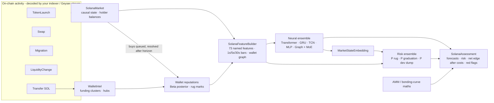

### 1. Protocol maths (`amm.py`)

* **pump.fun bonding curve**: virtual reserves 30 SOL / 1.073 B tokens, a 1 % fee,
  graduation after about 85 real SOL (≈ 793 M tokens sold), with bonding progress.
* **Constant-product AMM pools**: 0.25 % fee, exact buy and sell output.
* **`round_trip_cost(pool, size)`**: the fraction lost by buying `size` SOL and
  immediately selling everything back (two fees plus two-way price impact). This is the
  hurdle every forecast has to clear, and it feeds both the features and the labels.

### 2. Causal market state (`events.py`, `market.py`, `wallets.py`)

`SolanaMarket.ingest(event)` must be called in time order; it rejects events that go back
in time. For each token it keeps columnar NumPy logs of swaps, reserves and liquidity,
plus incremental holder balances, first-buy slots and creator bookkeeping.

**Wallet intelligence**
* *Funding clusters*: SOL transfers link funder and funded wallet in a union-find
  structure. **Hub detection** stops exchange hot wallets from gluing the whole market
  into one cluster (a source that funded more than `hub_threshold` wallets stops merging).
* *Reputation*: every buy is queued. Once `reputation_horizon` seconds of **market time**
  have passed, the realised move (read from state that now exists) updates a
  Beta-Bernoulli posterior for the buyer. Reputations are therefore learned online and are
  never informed by the future.
* *Rug attribution*: a creator dumping at least `dev_dump_fraction` of its bag marks the
  creator's whole funding cluster; an LP pull marks the wallet that pulled it.

`EventStore` persists history as one Parquet table per event type and replays it in
canonical order (launch → transfer → migration → LP → swap at equal timestamps).

### 3. Features (`features.py`)

73 named current-state features (`CURRENT_FEATURES`):

| Group | Features |
|---|---|
| Lifecycle / pool | age, #swaps, time since last trade, bonding progress, migrated, real liquidity and its 5-minute change, market cap, round-trip cost, drawdown from ATH, run-up from low |
| Price action | 5s / 30s / 60s / 300s log returns, 30s / 300s realised volatility |
| Order flow | buys and sells per minute, buy ratio, buy-SOL share, 60s and 300s net SOL flow, volume, unique buyers and sellers, new-trader share, average buy size |
| Holders & insiders | #holders, top-10 share, HHI, Gini, dev share, dev sold fraction, **sniper share** (first N slots), **bundle share** (co-funded early buyers), **fresh-wallet share**, **creator-cluster share** |
| Smart money & bots | reputation-weighted **smart flow**, #smart buyers, **bot share**, **rug-associated share** |
| Execution competition | priority fees, **Jito tip share**, slot density |
| Token safety | mint and freeze authority revoked, LP burned fraction |
| Edge dynamics | bonding-curve velocity, holder growth, smart-buyer share, top-holder sell share, buy acceleration |
| Runner skill | share of the last minute's buy SOL from wallets with proven **runner skill**, #runner-skilled buyers in 5 min, mean runner skill of the first 20 buyers |
| Sybil-resistant counts | #holder funding clusters, clusters ÷ holders, #buyer clusters per minute, **supply held by the largest hidden multi-wallet cluster** (not the creator's; relay hops included) |
| Creator family | prior launches, best prior peak multiple, prior rug rate, prior graduation rate, time since the family's last launch |
| Criticality | Hawkes branching ratio of buys and of sells, its two-minute trend, herding timescale, endogenous share of buys ([CRITICALITY.md](docs/CRITICALITY.md)) |
| Market heat | launches in 10 min, graduations in 1 h, total swap volume in 5 min (all tokens) |

**Runner skill** is a second, separate wallet reputation. A buy in a token's first
`tail_entry_window` seconds (300) counts as a success if the price later reaches
`tail_multiple` × the entry price (10x) within `tail_horizon_seconds` (1.5 h). The skill
is an evidence-shrunk log-lift of the wallet's hit rate over a Beta(0.1, 1.9) prior (base
rate 5 %). Being good at 60-second scalps and being early to runners are different skills.

A **creator family** is the creator's funder, or the creator itself when the funder is an
exchange-like hub (more than `hub_threshold` funded wallets). Serial deployers who spin up
a fresh wallet for every launch from the same source are therefore tracked together. Its
record covers the family's earlier launches still in memory plus every finished one, with
peaks measured only up to the snapshot time.

**Trade bars** (fast 1 s × 60, medium 5 s × 48, slow 30 s × 40) carry 10 features each:
return, realised vol, volume, buy share, #trades, #unique wallets, net flow, liquidity,
priority fee, high-low range. Prices are **forward-filled through quiet bars**, so "nobody
traded" is information rather than missing data. Bars before launch are masked.

**Wallet graph**: the token plus its `graph_top_k` most active wallets (node features:
volume, position, reputation, evidence, is-creator, is-sniper, cluster size) with
three edge types: `wallet_trades_token`, `wallet_funded_wallet` and
`wallet_same_cluster`. This feeds the neural graph expert (GraphSAGE/GAT) directly.

### 4. Labels (`labels.py`)

Labels come from the **complete** history; features come from a causal replay. The two
never mix.

* Per horizon (default 15 s / 60 s / 5 m): log return, max upside, max drawdown, realised
  volatility. Horizons that aren't complete yet are omitted, and masked in training.
* **Cost-aware returns**: `expm1(return) − round_trip_cost(trade_size_sol)`.
* **Risk events** within `risk_horizon_seconds`:
  * `rug`: price crash ≥ `rug_price_drop`, or an LP pull ≥ `rug_liquidity_drop`, without
    graduating;
  * `graduation`: the bonding curve completes and migrates;
  * `dev_dump`: the creator sells ≥ `dev_dump_fraction` of what it held.

### 5. Datasets without leakage (`dataset.py`)

`build_solana_dataset(history, cfg)` replays history into a fresh market and takes
snapshots every `sample_interval_seconds` while a token is still trading. The sampling
schedule is itself causal, and each snapshot is labelled from the hindsight market. A test
rebuilds a random snapshot from a market that only ever saw the past and checks that the
features are identical.

### 6. Risk model (`risk.py`)

A three-member MLP ensemble on `[MarketStateEmbedding ‖ named Solana features]` predicts
P(rug), P(graduation) and P(dev dump). It uses class-balanced BCE, a chronological split
with early stopping, and per-label temperature calibration fitted on validation data. It
reports member disagreement as uncertainty and is refitted during `maintenance()` once
enough resolved live samples have accumulated.

### 7. `SolanaBrain` (`brain.py`)

```python
from nardis_neural.solana import SolanaBrain, EventStore

brain = SolanaBrain.bootstrap("workspaces/sol", EventStore.load("history/"))  # trains everything
# live loop (events decoded by your indexer):
brain.ingest(swap_or_launch_or_transfer)
report = brain.assess("MintAddress…")
report.prediction.expected_returns  # neural forecasts per horizon (+ uncertainty, OOD, experts)
report.risk  # {"rug": …, "graduation": …, "dev_dump": …}
report.round_trip_cost  # for SolanaConfig.trade_size_sol at current reserves
report.expected_net_return  # E[return] − cost, per horizon
report.prob_net_positive  # P(return beats the round-trip cost)
report.flags  # e.g. "bundled launch: 23.1% held by co-funded early wallets"
brain.resolve()  # label matured assessments → replay buffer + risk samples
brain.maintenance()  # adapt / full retrain / promote (shadow-gated) / refit risk
```

The brain keeps the whole event history in the workspace and rebuilds the market by
replaying it on restart. Continual learning, shadow mode, promotion gates and rollback all
come from the core engine (see [CONTINUAL_LEARNING.md](docs/CONTINUAL_LEARNING.md)).

### 8. Launch simulator (`simulator.py`)

An agent-based simulator used for tests and demos. It is not a market model.

* **Wallets**: retail (CEX-funded long ago), smart money (joins healthy launches early,
  takes profit), snipers (first slots, high priority fees and Jito tips, quick flips), wash
  bots, honest devs, and rug crews (dev plus 4–8 bundle wallets funded minutes before
  launch from shared funders).
* **Archetypes**: `organic`, `graduate` (completes the curve and migrates), `rug` (bundled
  hype then a dump, or an LP pull on AMM launches, often with live mint authority), `dud`,
  `wash`, and `runner`: a rare viral launch whose demand and ticket sizes keep compounding
  for hours after graduation, with heavy-tailed virality (roughly 100x to 3,000x from the
  launch price). Runners are off in the `default` mix; the `degen` preset
  (`solana simulate --market degen`, or `--runners 0.1`) is mostly duds and rugs with a few
  percent runners, for the [moonshot engine](docs/MOONSHOT.md).
  The `adversarial` preset adds **traps**: launches staged to look like early runners. A
  clean, aged creator; insiders funded through a relay wallet (two hops from the funder,
  hours before launch) who trickle in over the first minute; bot wash volume; runner-like
  demand; then an insider dump 5 to 30 minutes in. At three minutes, traps look like
  runners on every aggregate feature, including clusters ÷ holders (0.93 vs 0.94). What
  gives them away is `top_cluster_share`: 10 % of supply in one hidden cluster, against
  0.4 to 2.7 % for every other kind of launch (70-launch sample, seed 5).
* **Ambiguity on purpose**: 40 % of rugs are *stealth* (aged exchange-funded wallets,
  small crews trickling in over the first minute, authorities revoked); 25 % of honest
  launches are *decoys* (the dev's co-funded friends buy in the launch slots); honest
  launches also attract early whales.
* Pricing uses the exact curve and AMM maths above, and events are strictly time-ordered
  per token.

### 8b. Measured behaviour (synthetic data, 4-core CPU)

| | |
|---|---|
| simulate 40 launches (~50 k events) | ~4 s |
| replay 52 k events into a market | ~0.8 s |
| build one observation (73 features + 3 bar streams + graph) | ~2.9 ms |
| extract one 96-trade tape | ~0.9 ms |
| dataset from 40 launches (~7.8 k leakage-free snapshots) | ~25 s |
| `assess_many` 1 / 8 / 32 tokens (tiny 2-member test model) | ~23 / 38 / 74 ms |
| full assessment with every model installed (`cpu-lite` neural ensemble, risk, moonshot + guard, 3-member Tape Transformer): 1 / 8 / 32 / 128 tokens | ~54 / 156 / 345 / 973 ms (7.6 ms per token at 128) |
| neural ensemble on held-out snapshots (tiny model) | downside AUC 0.84, return rank-corr 0.13 |
| risk model, **token-disjoint** validation | AUC ≈ 0.99 (rug, dev dump), ≈ 1.0 (graduation) |

For a single token, the neural ensemble takes about two-thirds of the time (its
sequence experts), feature building about a fifth and the Tape Transformer the rest.
Batching amortises most of it. Tighter budgets can use a smaller profile, a single
ensemble member, or `set_disabled_experts` at runtime.

**Read the risk numbers with care.** Validation holds out entire later-launched tokens,
and training only uses rows observed before the validation period, so the high AUC is
not leakage. The simulated world is simply easy: a ≥ 60 % crash requires a large insider
position, so holder concentration and early flow reveal rugs almost perfectly, and
graduation is predictable from buying momentum near the end of the curve. Real-world risk
accuracy will be lower, and you only find out by bootstrapping on real on-chain history.

### 9. CLI

```bash
nardis-neural solana simulate --out sim/history --tokens 40 --seed 1 --prefix A
nardis-neural solana simulate --out sim/live --tokens 10 --seed 2 --prefix B --start-time 1750014400
nardis-neural solana build-dataset --events sim/history --out sim/dataset      # optional inspection
nardis-neural solana bootstrap --events sim/history --workspace workspaces/sol --config configs/small.yaml
nardis-neural solana replay --workspace workspaces/sol --events sim/live --out sim/assessments.jsonl
nardis-neural solana assess --workspace workspaces/sol
```

### 10. Connecting real chain data (`solana/ingest/`)

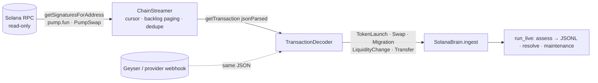

**Decoding (`decoder.py`)**
* **pump.fun**: Anchor events are read from `Program data:` logs.
  `CreateEvent` → launch, `TradeEvent` → swap (with the virtual reserves after the
  trade), `CompleteEvent` → migration. Discriminators are `sha256("event:<Name>")[:8]`.
  Only the stable leading fields are read, so program upgrades that append fields keep
  working.
* **AMMs** (PumpSwap, Raydium AMM v4 / CPMM, Meteora, Orca) are handled without
  per-venue layouts. A pool is a WSOL vault plus a token vault owned by the same non-signer
  authority in a transaction that invokes a known AMM program. Vault balance deltas give
  the event: SOL in + tokens out is a buy, the reverse a sell, both in a liquidity add,
  both out a removal. Post-transaction vault balances are the reserves. For
  concentrated-liquidity venues the reserves are re-expressed so that price equals the
  execution price. Tokens first seen on an AMM get an implicit launch, with mint and
  freeze authority looked up via `getAccountInfo`.
* **SOL transfers** of at least `min_transfer_sol` become funding edges.
  **Jito tips** (transfers to the eight tip accounts) and **priority fees**
  (`fee − 5000 × signatures`) are attached to the transaction's first swap.
* Failed transactions are skipped. Timestamps are `blockTime` plus a microsecond sequence,
  so events stay strictly ordered.

**Streaming (`stream.py`, `rpc.py`)**
* `SolanaRpc` is a standard-library JSON-RPC client that only allows query methods
  (`sendTransaction`, airdrops and so on raise `PermissionError`). It retries 429 and
  5xx responses with exponential backoff.
* `ChainStreamer` keeps a persisted per-program cursor and pages back to it on every
  poll, so bursts are never dropped. A backlog above `max_backlog` is counted in `gaps`.
  It de-duplicates signatures seen by several programs and decodes in slot order.
* `run_live` ingests, assesses every `assess_every` seconds (writing JSONL), resolves
  matured outcomes and runs maintenance periodically. Malformed or out-of-order events are
  counted and skipped, never crashing the loop.

**Verification.** `encode.py` renders market events back into realistic transaction JSON.
The test suite round-trips a whole simulated market through transactions and gets
identical swaps, reserves, tips, fees, holder statistics and insider features. It also
checks the streamer against a fake chain (bursts larger than a page, restarts, duplicate
programs) and runs chain → decoder → brain → assessments end to end. The event layouts
and program IDs follow the public pump.fun IDL and have not been re-checked here against
live mainnet transactions. Run `solana backfill --raw` on a real endpoint once to confirm.

```bash
export SOLANA_RPC_URL=https://your-provider.example/?api-key=…   # any standard Solana RPC
nardis-neural solana backfill --out history/ --limit 5000 --raw history/raw.jsonl
nardis-neural solana bootstrap --events history/ --workspace workspaces/sol
nardis-neural solana stream --workspace workspaces/sol --out assessments.jsonl
nardis-neural solana decode --input dump.jsonl --out events/   # offline: provider exports / archives
```

### 11. Training by streaming history (`ingest/history.py`, `streaming.py`)

The model can learn from weeks or months of chain history **without storing it**. Events
are streamed, decoded, fed through the brain and thrown away:

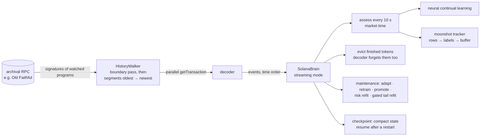

* **Only the watched programs are fetched** (pump.fun and PumpSwap by default), never whole
  blocks. The walker first pages each program's signature listing backwards once, keeping
  only the cursors at every segment edge (one hour by default). It then replays the
  segments oldest first. Only one segment's signatures are ever held in memory.
* **No look-ahead from today's chain state**: historical replays do not look up mint
  accounts, since their current authorities would leak the future.
* **Bounded memory**: tokens quiet for `--evict-idle-hours` (2 h by default) are
  forgotten after their moonshot rows are labelled, and the decoder drops their state too.
  What was learned stays in the wallet intelligence: reputations, rug marks and funding
  clusters. A later relaunch of an evicted mint is rejected rather than treated as a new
  token. Per-wallet state is stored in compact typed arrays. Risk samples and moonshot rows
  are rolling windows (50 k and 200 k rows).
* **Learning while streaming**:
  * the neural ensemble keeps using its continual-learning loop (replay, adaptation, full
    retraining, shadow and promotion gates);
  * the risk model refits on newly resolved samples;
  * the moonshot tail model is retrained from the tracker's buffer every 6 h of market
    time. Still-running tokens enter as right-censored rows. A candidate replaces the
    installed model only if it matches it on the most recent 20 % of tokens.
* **Resumable**: `stream/market.pkl` (written atomically) and `moonshot/online.npz`
  checkpoint the state. A restarted run skips everything up to the checkpointed market
  time.
* **A fresh workspace bootstraps itself** from the first `--warmup-hours` after the first
  launch.

```bash
export SOLANA_RPC_URL=https://…   # an endpoint that serves old slots (Old Faithful / archival)
nardis-neural solana stream-train --workspace workspaces/sol \
    --start 2025-09-01 --end 2025-09-22 --workers 16 --profile auto
# or replay a saved event directory through the same loop
nardis-neural solana stream-train --workspace workspaces/sol --events history/
```

Throughput is set by the RPC endpoint. There is one `getTransaction` per watched
transaction, run in parallel across `--workers`, so busy weeks of pump.fun take hours of
streaming per day of history. Model work is small by comparison with the `cpu-lite`
profile.

Every threshold, horizon, bar spec and window lives in `SolanaConfig`
(`nardis-neural solana init-config`).

## Edge engine (`nardis_neural.solana.edge`)

Forecasting prices is not the goal. The goal is **setups that make money after latency,
price impact and fees**, found and validated so that the result can be trusted. This
module turns the neural brain into an edge-seeking system and measures whether the edge
is real.

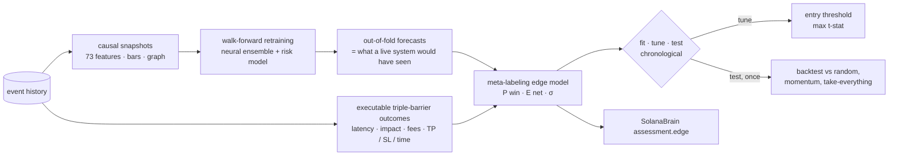

### 1. Executable labels (`barriers.py`)

For a signal at `t`, `triple_barrier` simulates what a position of `size_sol` would really
have done on the actual pool path:

* **entry** at `t + latency` against the pool at that instant, through exact bonding-curve
  or AMM maths, so fees and price impact are included;
* the position is **marked to liquidation value** (selling the whole bag back, fees and
  impact included) at every later pool state. Our own entry's reserve shift is carried
  forward;
* **exit** at the first take-profit, stop-loss or time barrier. The exit order also waits
  `latency` seconds, so in a crash it fills lower, which is exactly where paper edge
  usually dies;
* barriers can be fixed or scaled by recent realised volatility.

Labels include a migration if the token graduates while the position is open.

### 2. Out-of-fold forecasts (`research.walk_forward_oof`)

The neural ensemble and the launch-risk model are retrained **walk-forward**. Each fold
trains only on data that ended before the fold starts, minus an embargo covering both the
label horizons and the maximum holding period plus latency, then predicts that fold. The
edge model never sees an in-sample forecast.

### 3. Meta-labeling edge model (`model.py`)

The inputs are:
* the neural forecasts per horizon: mean, standard deviation, z-score, event
  probabilities, max upside and drawdown, volatility;
* uncertainty: epistemic, aleatoric, OOD, disagreement;
* expert gate weights, P(rug / graduation / dev dump), and all raw on-chain features (53 when the results below were measured, 73 now).

It is a bootstrap ensemble of MLPs with two heads:

* **P(win)**: the executable outcome beats zero. It is isotonic-calibrated on a later
  window;
* **E[net]**: Huber regression on the clipped executable net return.

`edge_score = E[net] − λ·σ_epistemic` is a lower confidence bound, which prefers setups
the model is sure about. `kelly_fraction` is a capped fractional Kelly derived from
P(win) and the empirical win/loss ratio. It is a research sizing hint only.

### 4. Honest evaluation (`research.run_edge_research`, `backtest.py`)

* OOF rows are split chronologically into **fit (50 %) / tune (25 %) / test (25 %)**, with
  gaps of one holding period between them.
* The edge model is fitted on *fit*. The entry threshold that maximises the per-trade
  t-statistic (at least `min_trades` trades) is chosen on *tune*. **Test is scored once.**
* The backtester enforces one open position per token and a maximum number of concurrent
  positions; a position occupies its slot until its barrier exit.
* Statistics: hit rate, mean and median net return, per-trade Sharpe, t-stat, **bootstrap
  95 % CI**, profit factor, cumulative PnL and max drawdown in SOL.
* **Baselines** run under the same constraints and trade budget: random picks
  (mean and 95th percentile over draws), momentum (`ret_60s`), and taking every
  candidate. The verdict asks three questions: is the CI above zero, does it beat the
  random p95, and does it beat momentum?

### 5. Results on the simulator

Two independent 60-launch, 6-hour synthetic markets (seeds 11 and 23), 4 walk-forward
folds, a tiny test-sized network, 1 s latency, TP 25 % / SL 15 % / 180 s holds, 1 SOL per
trade and at most 5 concurrent positions. Numbers are per trade, **net of latency, impact
and fees**, on the untouched test period:

| market | policy | trades | hit rate | mean net | 95 % CI | t-stat | max DD (SOL) |
|---|---|---|---|---|---|---|---|
| A | **edge model** | 20 | 90 % | **+25.8 %** | [+19.2 %, +31.0 %] | **8.26** | 0.18 |
| A | momentum (same budget) | 20 | 80 % | +52.5 % | [+13.8 %, +105.0 %] | 2.17 | 0.37 |
| A | take every candidate | 122 | 48 % | +11.8 % | [+3.7 %, +21.2 %] | 2.54 | 1.11 |
| A | random (same budget) | | | +0.3 % (p95 +6.6 %) | | | |
| B | **edge model** | 25 | 76 % | **+20.1 %** | [+7.1 %, +35.0 %] | 2.84 | 0.74 |
| B | momentum (same budget) | 25 | 72 % | +16.2 % | [+4.9 %, +26.0 %] | 2.86 | 0.68 |
| B | take every candidate | 111 | 48 % | +3.5 % | [−0.9 %, +7.8 %] | 1.50 | 1.68 |
| B | random (same budget) | | | +4.9 % (p95 +9.2 %) | | | |

How to read this:
* The edge is significantly positive after costs and beats random selection in both
  markets. In market A, momentum has a higher mean but a far noisier one (its CI is five
  times wider); the edge model has the best risk-adjusted result. In market B the edge
  model has the higher mean and momentum is roughly equal on t-stat.
* The test periods are short (20–25 trades), so the confidence intervals are wide.
* Model selection was done honestly. Five meta-learners (MLP, ridge, gradient-boosted
  trees, rank blend, stacked LCB) were compared on identical fit/tune/test splits in
  *both* markets before choosing the stacked lower-confidence-bound model. Trees and ridge
  carry most of the ranking power (validation rank-IC ≈ 0.31–0.35 in market A).
* An earlier result (+19 % vs −20 % for take-everything) came from a labelling bug that
  ignored the position's own entry impact. The test suite now pins the exact round-trip
  cost.

Reproduce:

```bash
nardis-neural solana simulate --out sim/hist --tokens 60 --seed 11 --hours 6
nardis-neural solana bootstrap --events sim/hist --workspace ws --config configs/small.yaml
nardis-neural solana edge-research --workspace ws --folds 4
cat ws/edge/REPORT.md
```

**This is a synthetic market.** Its structure (momentum regimes, smart money, rug hype
before dumps) is learnable, so these results show that the machinery finds edge without
leakage. They say nothing about live profitability. Run the same research on real chain
history (`solana backfill` → `bootstrap` → `edge-research`), trust only the test-period
verdict, expect much smaller edges, and re-validate regularly as markets adapt.

### 6. Using it live

```python
brain = SolanaBrain("workspaces/sol")  # edge model is loaded if edge-research was run
for a in brain.assess_active():
    a.edge["edge_score"], a.edge["p_win"], a.edge["expected_net"], a.edge["kelly_fraction"]
    a.edge["above_threshold"]  # 1.0 when the score clears the research threshold
```

The module never places orders. Your trading system decides whether and how to act.

## Moonshot engine (`nardis_neural.solana.moonshot`)

The [edge engine](docs/EDGE.md) looks for many small, repeatable wins. This module is for the
other end of the distribution: the rare launch that goes 100x or 1000x. That problem is
different in kind. The typical ticket loses, the result is decided by a handful of tokens,
and the useful question is not "what is the expected return?" but "**how heavy is this
token's right tail?**"

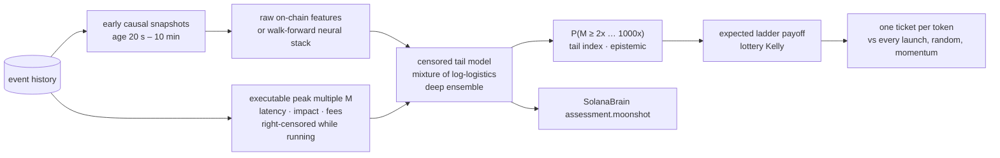

### 1. Labels (`labels.py`)

For a signal at `t`, a ticket of `size_sol` is bought at `t + latency` through the exact
curve or AMM maths. From then on the position is marked at its **liquidation multiple**:
the SOL you would get for selling the whole bag, with fees and impact, divided by the SOL
paid. The reserve shift from our own entry is carried forward and scaled through
liquidity adds and pulls. Every exit decided at `s` fills against the pool at
`s + latency`.

* **Peak multiple `M`**: the best such multiple within `horizon_seconds` (6 h by default).
  If the horizon runs past the end of the data while the token is still trading, the label
  is **right-censored**: we only know `M ≥ observed`. A token with no activity for
  `resolve_idle_seconds` before the end of the data is treated as finished, which is
  known causally.
* **Ladder multiple**: what a concrete exit plan actually returned. It sells 35 % of the
  original bag at 2x, 15 % at 10x, 15 % at 100x and 15 % at 1000x. After 2x, the
  remaining "moon bag" is sold when the mark falls 60 % from its running peak. Before 2x,
  everything is sold at a 50 % stop. Each tranche is priced exactly for its own size and
  moves the pool for the next one.

Censoring is what makes causal training possible. A model deployed at time `T` is trained
with every label **truncated at `T`**. A runner that was still climbing at `T` enters the
likelihood as "at least this much", which is exactly what a live system would have known.

### 2. Tail model (`tail.py`)

The model works on `y = log M` with a **mixture of logistic distributions**:

```
P(M ≥ k | x) = Σ_j π_j(x) · σ((μ_j(x) − log k) / s_j(x))
```

Each component is a log-logistic in `M`, whose survival decays as a power law
`k^(−1/s_j)`. The network therefore learns, per token, both where the bulk of outcomes
sits and how fat the tail is. Components for duds, normal pumps and runners emerge
without supervision.

* **Censored likelihood**: a density for resolved rows, `log P(M ≥ observed)` for censored
  rows.
* **Token weighting**: the snapshots of one token are strongly correlated, so each token
  carries the same total weight and bootstrap resampling is done by token.
* **Deep ensemble**: members are fitted on token-bootstrap resamples, with early stopping
  on the most recently launched tokens. The predictive survival is the members' average,
  and their spread is the epistemic uncertainty.
* **Inputs**: `raw` uses the 73 on-chain features and is fast on any CPU. `neural` adds
  the walk-forward out-of-fold neural forecasts, uncertainty, expert gates and risk
  probabilities, the same stack the edge model uses.

Outputs per token: `P(M ≥ k)` for 2/5/10/100/1000x, the median multiple, the **expected
ladder payoff** (quadrature over the predicted distribution with the ladder's payoff
function), the **tail index** of the heaviest active component, the ensemble spread, and a
**lottery-Kelly** fraction. That fraction is the bet size that maximises expected
log-wealth under the predicted payoff distribution, scaled by ¼ and capped at 5 %. For a
bet whose typical outcome is a loss, this is the sizing rule that avoids ruin. A mean-based
rule would size up exactly where the distribution is most dangerous.

### 3. Research protocol (`research.py`)

1. Early snapshots (20 s to 10 min after launch) are the ticket candidates.
2. Tokens are split by launch time. The model trains on the earlier 65 % of tokens with
   labels censored at the cutoff (the first test entry).
3. On the later 35 % of tokens it is scored **once**:
   * tail calibration and ranking AUC of `P(M ≥ k)` for every level, using resolved rows;
   * NLL against a feature-free tail model fitted on the same rows;
   * a portfolio with **one ticket per token**, bought at the first snapshot where the
     expected ladder payoff is at least the ticket (`--min-ev`, default 1.0) and
     lottery-Kelly > 0. It is compared with buying every launch, random tickets and
     momentum (highest 60 s return) at the same budget.
4. A threshold-sensitivity table is printed for transparency. It is never used to choose
   the threshold.
5. The production model is refitted on all tokens with labels up to the end of the data.

### 4. Results on the simulator

Two independent `degen` markets: 150 launches over 8 hours each (about 6 % runners, 42 %
duds, 30 % rugs), seeds 7 and 19. The settings were raw inputs, 0.5 SOL tickets, 1 s
latency, a 6 h horizon and a 5-member ensemble. The test period covers the 52 most recent
tokens of each market. Multiples are **net of latency, impact and fees** under the ladder
exit plan.

| market | policy | tickets | total PnL (SOL) | mean multiple | 95 % CI | median | best |
|---|---|---|---|---|---|---|---|
| A | **tail model** | 46 | **+172.0** | **8.48x** | [3.56, 14.39] | 1.64x | 95.6x |
| A | momentum (same budget) | 46 | +108.5 | 5.72x | [2.50, 10.12] | 1.37x | 66.7x |
| A | every launch | 52 | +172.1 | 7.62x | [3.27, 13.09] | 1.61x | 95.6x |
| A | random (same budget) | | +45.8 (p95 +72.3) | | | | |
| B | **tail model** | 37 | **+179.8** | **10.72x** | [3.77, 19.76] | 1.82x | 120.5x |
| B | momentum (same budget) | 37 | +108.7 | 6.88x | [2.32, 12.67] | 1.22x | 72.7x |
| B | every launch | 52 | +179.7 | 7.91x | [2.65, 14.26] | 1.09x | 120.5x |
| B | random (same budget) | | +40.8 (p95 +74.4) | | | | |

Tail quality on the test tokens:

| market | test NLL (feature-free) | AUC ≥2x | AUC ≥10x | AUC ≥100x | runners in test / ticketed |
|---|---|---|---|---|---|
| A | 0.10 (1.11) | 0.95 | 1.00 | 0.97 | 6 / 6 |
| B | 0.00 (1.44) | 0.95 | 0.97 | 0.96 | 5 / 5 |

How to read this:

* The model ranks the tail very well. It ticketed every runner in both test periods and
  skipped 6 of 52 launches (A) and 15 of 52 (B). It **matches the PnL of buying every
  launch with fewer tickets**, so more SOL per ticket, and beats momentum and random picks
  by a wide margin. In market B, a stricter threshold (E[payoff] ≥ 10x) kept 18 tickets
  and still made +172 SOL (20x per ticket). That figure comes from the test period, so it
  is not a result to rely on.
* **Calibration is imperfect where it matters most.** The 1000x probabilities are too
  high: about 0.01 to 0.02 predicted against about 0.001 observed. In market B, 5x and 10x
  were under-predicted. Power-law tails are fitted from a handful of runners. Treat the
  far-tail numbers as rankings, not as odds.
* Realised ladder multiples on runners were 26x to 120x, while their launch-to-peak runs
  were 100x to 3,000x. That gap is the honest cost of arriving 20 s or more after launch,
  paying latency on the way out, and banking tranches on the way up.
* **The simulator is generous.** Buying every launch is profitable in these markets, and
  rugs pump before they dump, so they often pay the 2x tranche. Real launch markets are far
  harsher. The results show that the machinery finds fat tails without look-ahead. They say
  nothing about live profitability.

Reproduce:

```bash
nardis-neural solana simulate --out sim/degen --market degen --tokens 150 --hours 8 --seed 7
nardis-neural solana bootstrap --events sim/degen --workspace ws --profile auto
nardis-neural solana moonshot-research --workspace ws --archetypes sim/degen/archetypes.json
cat ws/moonshot/REPORT.md
```

### 5. Hardening: calibration, input clamping, manipulation guard

A tail model is exactly what manipulators aim at. Fake volume, bundled supply and staged
"smart money" all look like the early footprint of a runner. Three layers keep the model
from being walked into a trap, and each of them can only **lower** its optimism:

1. **Tail calibration** (`TailModel.calibration`). After training, the predicted hit
   counts for each level (2x … 1000x) are compared with what actually happened on the
   held-out, most recent tokens. Each level gets a ratio, observed ÷ predicted, shrunk
   towards 1 by one pseudo-token and clipped to [0.05, 2]. Probabilities are then
   rescaled and kept non-increasing in `k`. This targets the far-tail overestimate
   measured in section 4. The results table there was produced before this step.
2. **Input clamping**. Each input is clamped to its training range (0.1 to 99.9 %
   quantiles) before the network, so a crafted extreme feature cannot push the
   prediction off a cliff. `out_of_range_share` reports how many inputs were clamped.
3. **Manipulation guard** (`moonshot/guard.py`). A `trust` score in [0, 1] multiplies the
   chase score and the Kelly hint. It combines:
   * P(rug) from the risk model;
   * live mint or freeze authority, and unburned LP;
   * wash trading, bundled supply, creator-cluster supply and rug-linked wallets;
   * holder concentration and dev selling;
   * supply held by a hidden multi-wallet funding cluster that is not the creator's, which
     catches staged insiders funded through relay wallets;
   * the neural OOD score, clamped inputs and ensemble disagreement.

   **Hard vetoes** zero the chase score. They fire on P(rug) ≥ 60 %, a live mint or freeze
   authority, one hidden wallet cluster holding ≥ 25 % of supply, bundled supply ≥ 20 %, a
   creator cluster holding ≥ 30 %, bots making up ≥ 80 % of volume, OOD ≥ 4, or ≥ 25 % of
   inputs outside the training range. Each veto
   appears in `flags` as a readable reason. The factors are hand-set and monotone: more red
   flags never raise trust. Thresholds are in `GuardConfig` (`brain.guard`).

### 6. Using it from the trading algorithm

```python
brain = SolanaBrain("workspaces/sol")  # the tail model loads if moonshot-research was run
for a in brain.moonshot_ranking():  # active tokens in the entry window, best first, vetoes removed
    m = a.moonshot
    m["chase_score"], m["chase_rank"]  # trust × expected ladder multiple; 1 = best
    m["p_ge_10x"], m["p_ge_100x"], m["p_ge_1000x"]  # calibrated survival probabilities
    m["expected_multiple"], m["lottery_kelly"]  # payoff expectation; sizing hint (× trust)
    m["trust"], m["vetoed"], m["tail_index"], m["epistemic"], m["out_of_range_share"]
    a.flags  # human-readable red flags, including "moonshot veto: …"
```

Every assessment from `assess` / `assess_many` / `assess_active` carries the same
`moonshot` block, with `chase_rank` computed within the batch. The trading system decides
what to do with it. This module never places orders.

Nothing here guarantees 1000x, and no model can promise it. What it gives you is a ranked,
manipulation-aware estimate of *how likely* a large run is, how uncertain that estimate is,
and how much of a bankroll such a lottery ticket can justify.

## Tape Transformer (`nardis_neural.solana.tape`)

Every other model in this repository sees a token through aggregates: per-minute bars and
73 summary features. That throws away the two things that decide a memecoin launch: **who**
is trading, and **in what order**. The Tape Transformer reads the raw trade tape directly.

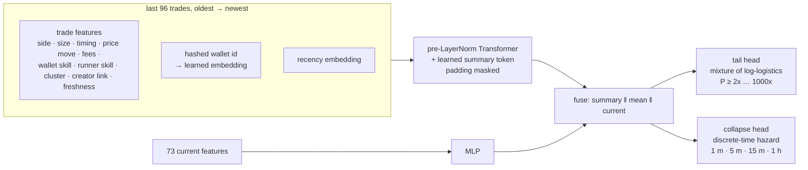

### 1. The tape (`features.py`)

For a snapshot at `now`, the last `max_trades` (96) trades at or before `now` are kept,
left-padded, with the most recent last. Each trade is a vector of 18 features; the full
list is in the generated reference, *Trade tape*. They cover the trade itself (side, SOL,
signed flow, time since the previous trade, age, time until now, price relative to now,
priority fee, Jito tip) and the trader as the market knows them at `now` (60-s skill,
runner skill, creator, creator's cluster, fresh funding, cluster size, lifetime trades,
first trade in this token, bought within the launch slots).

Each trade also carries a **wallet hash bucket**: a blake2b hash of the wallet address. It
is stable, so the learned embedding means the same wallet in every workspace, replay and
live session. Training tapes are cut by a causal replay (`dataset.py`) under the same rule
as every other snapshot. A test checks that a replayed tape equals the tape from a market
that has only seen the past.

### 2. The network (`model.py`)

* **Trade embedding** is `Linear(trade features) + Linear(wallet embedding)`, plus a learned
  recency embedding counted from the most recent trade, so left padding changes nothing.
* **Wallet embeddings** start at unit scale; a small initialisation left wallet identity
  drowned out by the trade features. Two defences stop the table from memorising noise:
  * **frequency gating**: only wallets seen in at least `min_wallet_tokens` (3) distinct
    training tokens get their own embedding. Everyone else shares an "unknown wallet" slot,
    and their trades still count through their features;
  * **wallet dropout**: 20 % of identities are hidden during training, so no single wallet
    becomes a crutch.
* A learned **summary token** is appended, and a 2-layer pre-LayerNorm Transformer (d = 64,
  4 heads) attends over the tape with padding masked. The summary token keeps an empty
  tape well defined.
* The summary token, the masked mean of the trades and an MLP of the current features
  are fused into one vector.
* **Tail head**: a mixture of logistics on `log` peak multiple. It uses the same censored
  likelihood, per-level calibration, expected ladder payoff and lottery Kelly as the
  [moonshot tail model](docs/MOONSHOT.md), sharing the code.
* **Collapse head**: a discrete-time hazard over 1 min, 5 min, 15 min and 1 h. It gives the
  probability that the ticket's value falls to half of its entry value within each window.
  It is trained with the censored survival likelihood: a row survives every bin it was
  fully observed through, and its event bin if it collapsed. This is the **exit signal**.
* **Ensemble**: 3 members by default, trained on token-bootstrap resamples, with early
  stopping on the most recently launched tokens. Every token carries the same total weight.

About 2.2 M parameters per member, most of them in the wallet table (131 k buckets × 16).
It runs comfortably on a laptop CPU, an M1, or a 4-vCPU cloud VM.

### 3. Research (`research.py`)

The protocol matches the moonshot research: entry-window snapshots, tokens split by launch
time, training labels censored at the cutoff, and one scoring pass on the later tokens. The
raw-feature tail model is trained on the **same** rows and scored on the **same** test rows,
so the comparison is direct:

* tail: NLL, calibration and AUC per level for both models;
* collapse: for each window, predicted vs observed collapse rate, AUC and Brier score on
  rows whose outcome for that window is known;
* one ticket per token for both models, against buying every launch.

```bash
nardis-neural solana tape-research --workspace ws --archetypes sim/degen/archetypes.json
cat ws/tape/REPORT.md
```

### 4. Results on the simulator

One `degen` market: 150 launches over 8 hours (seed 7, the same market as market A in
[MOONSHOT.md](docs/MOONSHOT.md)). There were 98 training tokens and 52 test tokens, with 3
ensemble members of about 2.2 M parameters each; 851 wallets earned their own embedding.
Both models were trained and scored on identical rows. Training and scoring took about
20 minutes on a 4-core CPU, including the production refit.

| | Tape Transformer | raw-feature tail model |
|---|---|---|
| test NLL of log peak multiple | **0.210** | 0.300 |
| AUC P(≥2x) | 0.916 | 0.914 |
| AUC P(≥10x) | 0.958 | **0.982** |
| AUC P(≥100x) | 0.935 | **0.982** |
| AUC P(≥1000x) | 0.809 | **0.980** |

Collapse, the new exit signal (value halves within the window, 3,016 test rows):

| window | predicted | observed | AUC | Brier |
|---|---|---|---|---|
| 1 min | 0.035 | 0.042 | 0.926 | 0.034 |
| 5 min | 0.126 | 0.138 | 0.973 | 0.048 |
| 15 min | 0.148 | 0.157 | 0.970 | 0.050 |
| 1 h | 0.189 | 0.164 | 0.966 | 0.054 |

How to read this:

* **The collapse head is the win.** It separates tokens that are about to break from those
  that are not (AUC 0.93–0.97), and it is well calibrated at every window. No other model
  in the repository produces an exit signal.
* **The whole distribution fits better** (lower NLL), but the tape model **ranks the far
  tail worse** than the aggregate model. Runners are rare, and a tape of the last 96 trades
  sees less of a token's history than the aggregate features. For picking moonshot
  entries, keep using the tail model's `chase_score`; use the tape for exits.
* In this generous simulator every token cleared the "expected payoff ≥ ticket" rule for
  both models, so the one-ticket-per-token comparison could not separate them.
* One market, one seed. This is a synthetic benchmark, not evidence of live performance.

### 5. Entry and exit policies across two markets

`tape-research` also splits tokens three ways by launch time: 76 train, 22 tune and 52
test tokens per market. Entries come from the blend of both models. The exit alarm (window
and threshold) is chosen on the tune tokens, with their outcomes truncated before the test
period, then scored once on test. The runs used seeds 7 and 19 (market A and market B of
[MOONSHOT.md](docs/MOONSHOT.md)). Seed 19 also had the `top_cluster_share` feature, which did not
exist yet when seed 7 ran.

| | seed 7 | seed 19 |
|---|---|---|
| AUC P(≥10x): tape / tail / blend | 0.909 / **0.957** / 0.940 | **0.920** / 0.184 / 0.831 |
| AUC P(≥100x): tape / tail / blend | 0.931 / **0.967** / 0.964 | **0.964** / 0.164 / 0.941 |
| collapse AUC 1 min / 5 min / 15 min / 1 h | 0.92 / 0.97 / 0.96 / 0.95 | 0.90 / 0.97 / 0.97 / 0.97 |
| alarm chosen on tune | P(collapse ≤ 5 min) ≥ 0.7 | P(collapse ≤ 1 min) ≥ 0.3 |
| test PnL, ladder only | +172.1 SOL | +179.7 SOL |
| test PnL, ladder + learned exit | **+177.2 SOL** | +157.5 SOL |
| median ticket, ladder only → with alarm | 1.61x → 1.93x | 1.09x → 1.77x |

What this shows:

* **The collapse head generalises.** AUC is 0.90–0.97 at every window in both markets.
* **Neither entry model always wins.** On seed 7 the aggregate tail model ranked the tail
  best. On seed 19, trained on fewer tokens, its ranking broke (AUC below 0.5, i.e.
  inverted), while the tape stayed above 0.86 at every level. **The blend was never the
  worst**, so when both models are installed `chase_score` ranks by the blend
  (`expected_multiple_blend`).
* **The learned exit is not yet a reliable edge.** It lifted the median ticket in both
  markets, but it also sold some runners early: +3 % total PnL on seed 7, −12 % on
  seed 19. Treat the alarm as an input to your exit logic, not a rule. The forward-test
  ledger settles every paper ticket both with and without the alarm
  (`alarm_minus_ladder_pnl_sol`), so live data decides.
* Two synthetic markets are still a small sample (`research-suite --tape` runs more).

### 6. Using it

```python
brain = SolanaBrain("workspaces/sol")  # the tape model loads if tape-research was run
for a in brain.assess_active():
    a.tape["p_ge_10x"], a.tape["expected_multiple"]  # entry view from the tape
    a.tape["p_collapse_1m"], a.tape["p_collapse_5m"]  # exit view: will the run break soon?
```

The collapse probabilities are meant for positions you already hold. A sharp rise in
`p_collapse_1m` or `p_collapse_5m` is the model's view that the run is about to break. As
everywhere in this module, it is a probability for the trading system to act on, not an
order.

## Criticality engine (`nardis_neural.solana.hawkes`)

A runner is a **chain reaction**: buys trigger more buys, which trigger more buys. An
epidemic grows when each case infects more than one other person (R₀ > 1). A nuclear pile
goes critical when each fission triggers at least one more. Financial order flow shows the
same structure (Filimonov & Sornette measured the "endogeneity" of whole markets this way).

This module measures, for every token and in real time, **how close its buying is to that
phase transition**.

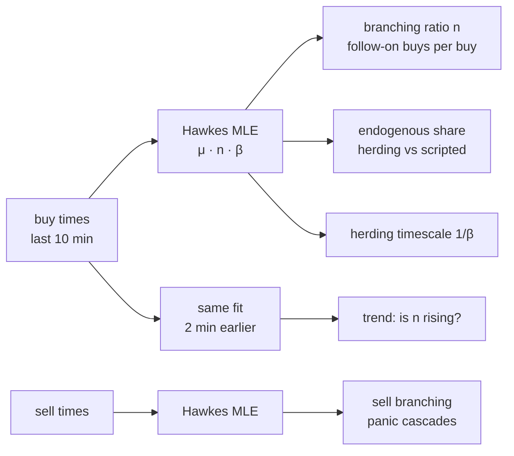

### 1. The model

An exponential Hawkes process has intensity

```
λ(t) = μ + Σ_{t_j < t} n · β · exp(−β (t − t_j))
```

* `μ` is the **exogenous** rate: activity that would happen anyway (insiders on a script,
  bots on a clock, outside news);
* `n` is the **branching ratio**: the expected number of follow-on events each event
  directly triggers;
* `β` is the decay rate of that influence; `1/β` is the herding timescale.

The branching ratio is the dimensionless number that matters:

| n | regime | meaning for a launch |
|---|---|---|
| ≪ 1 | subcritical | activity is driven from outside and stops when the drivers stop |
| → 1 | critical | cascades of any size become possible: the runner regime |
| share of events explained by excitation | endogenous share | organic herding (high) vs scripted flow such as wash bots and staged insiders (low) |

The last row is the manipulation angle. **Scripted flow does not self-excite.** Wash bots
and staged insiders trade on their own schedule rather than in reaction to other buyers,
so a token can look busy while its endogenous share stays low. That is a
signature that aggregate volume and holder counts cannot show.

### 2. The estimator

* **Exact maximum likelihood** by expectation–maximisation. The EM runs for every decay
  rate on a log-spaced grid at once (vectorised), and the best likelihood wins.
* **Exact O(N) kernel sums.** `Σ_{t_j<t_i} exp(−β(t_i − t_j))` is computed from prefix sums
  of `exp(βt)` in overflow-safe blocks with a carried remainder. Tied timestamps do not
  excite each other (whole-second chain timestamps have many ties). A test checks it
  against the O(N²) brute force to 1e-10.
* **History conditioning.** The likelihood covers the most recent events, and the events
  just before the window are kept as history. Otherwise the excitation they cause is
  misread as background, which is a classic edge effect.
* **Detrending.** A constant background rate cannot tell a *fading* launch rush (many
  buys early, fewer later) from a cascade: both look like "events followed by more
  events". The detrended fit lets the background rise or fade exponentially,
  `μ(t) = μ·exp(γ(t − T))`, and searches a grid of trends alongside the decay rates. On
  pure decaying Poisson streams (true n = 0) the plain fit reads 0.28–0.93 and the
  detrended fit 0.10–0.13. On stationary cascades the two agree (0.50 vs 0.52 at
  n = 0.5). The live buy features are detrended.
* **Two timescales (optional).** `fast_beta` adds a fixed sub-second kernel next to the fitted
  one. Order flow has a reflex layer (bots and bundles reacting in the same slot) and a
  slower human herding layer, and one exponential can only describe one of them.
  `HawkesFit.reflex` reports the fast part.
* **Speed.** About 1.5 ms per plain fit on 300 events and about 2.2 ms per detrended fit on
  the live grid (5 decay rates × 5 trends). The three fits behind the five features cost
  about 8 ms per token on the busiest tokens of a herding market.

Measured recovery on exactly simulated Hawkes processes (10 runs each, 600 s windows):

| true n (β = 0.5) | 0.1 | 0.5 | 0.8 |
|---|---|---|---|
| estimated | 0.17 ± 0.14 | 0.49 ± 0.09 | 0.72 ± 0.10 |

Near criticality with slow decay (n = 0.9, β = 0.1) the estimate reads about 0.55. That is
the known downward bias of short-window Hawkes estimation. The ordering of tokens by `n`,
which is what a ranking model uses, is preserved.

### 3. Features

Five features of the current-state vector (full definitions in the generated reference):

* `buy_branching_ratio`: n of the last 10 minutes of buys;
* `sell_branching_ratio`: n of sells, which catches panic cascades;
* `buy_branching_trend_120s`: n now minus n two minutes ago, i.e. *approaching
  criticality*;
* `herding_timescale_log`: `log1p(1/β)`;
* `endogenous_buy_share`: share of recent buys explained by excitation.

### 4. Herding in the simulator

The simulator's buyers used to arrive independently (an inhomogeneous Poisson process),
which has no cascades to find. `LaunchSimSpec(herding=True)` (or `solana simulate
--herding`) makes retail demand self-exciting. The average demand is the same, but it
arrives in cascades, with a branching ratio per launch type:

| runner | graduate | organic | rug | dud | trap | wash |
|---|---|---|---|---|---|---|
| 0.85 | 0.7 | 0.5 | 0.3 | 0.2 | 0.1 | 0.05 |

Herding is off by default, so every earlier simulation reproduces exactly.

### 5. Does it help? (ablation)

One `adversarial` market (150 launches, 8 h, seed 7) was run with herding on, plus a
`degen` market without herding as a control. The same moonshot tail model was trained
with and without the five criticality features, on identical token splits (98 train, 52
test tokens), three training seeds each.

| market | test NLL with / without | AUC P(≥5x) with / without | AUC P(≥10x) | AUC P(≥100x) |
|---|---|---|---|---|
| herding + adversarial | **0.188 / 0.283** (better in all 3 seeds) | **0.924 / 0.914** (all 3) | 0.948 / 0.944 | 0.903 / 0.902 |
| control, no herding | 0.242 / 0.261 (seed ranges overlap) | 0.936 / 0.944 | 0.987 / 0.992 | 0.972 / 0.975 |

What the measurements say:

* **Where cascades exist, criticality is a strong signal.** Test NLL falls by a third in
  every seed, and ≥5x ranking improves in every seed. Where there are no cascades (the
  control), the features add nothing and cost a little ranking noise, which is what a real
  signal (rather than a leak) should do.
* **Scripted flow is exposed.** Wash-trading tokens read a buy branching ratio of about
  **0.004**, against 0.3–0.7 for every other launch type at three minutes. Wash bots trade
  on a clock, not on each other.
* **The branching ratio is not pure herding.** Launches designed with n = 0.85 (runners)
  read only about 0.37 at three minutes, and duds read about 0.6. Two effects blur it. Early
  demand is non-stationary with *steps*, such as graduation to an AMM, which even a
  detrended background cannot absorb. And in the simulator, sub-second clumps of buys mix
  with slower herding. The estimator measures "self-excitation plus regime shifts", and
  the model learns what that is worth. It is not an oracle for R₀.
* The design choices were iterated on these measurements: history conditioning, then
  detrending (a fading rush went from n = 0.93 to about 0.1), then a smaller live grid
  that was re-validated before these numbers were taken.

On real chain data the reflex layer is physical (same-slot bots). Validating these
features on streamed history is the next step.

## Capital engine (`nardis_neural.solana.capital`)

Good probabilities are not a trading system. Capital compounds only if the *size* of each
bet matches its edge and its risk, if correlated bets are not stacked, and if the account
survives the losing streaks that fat-tailed strategies always produce. And none of it
matters if the backtested edge is an artefact of trying many variants. This module
handles all of those questions.

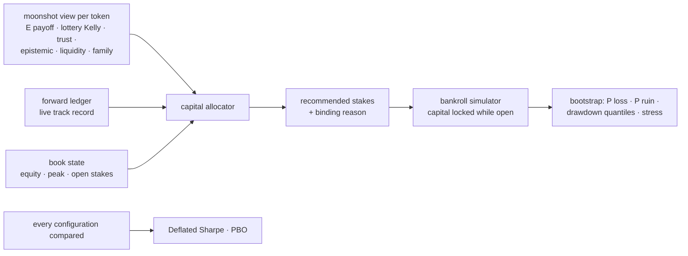

### 1. Allocator (`allocator.py`)

For each candidate, best expected edge first:

```
fraction = lottery Kelly × kelly_scale × trust × exp(−epistemic / uncertainty_scale)
           × track record × drawdown governor
```

* **Lottery Kelly** comes from the tail model and is already fractional and capped: the
  bet size that maximises expected log-wealth under the predicted payoff distribution.
* **Trust** comes from the manipulation guard, and **epistemic** from the ensemble's
  disagreement. The less the model knows, the less it bets.
* **Track record** is realised ÷ predicted payoff of the forward ledger's settled paper
  tickets, clipped to [0.25, 1.25]. When live results fall short of what the model
  promised, every stake shrinks in proportion.
* The **drawdown governor** scales stakes linearly from 1 at the equity peak to 0 at
  `max_drawdown` (35 %). The **daily loss stop** allows no new positions after losing 15 %
  of the day's opening equity.

Then the limits, each reported as the binding `reason`:

* per position: 4 % of equity;
* **liquidity**: 2 % of the pool's real SOL, so our own impact stays small;
* per **creator family**: 8 % of equity, because a serial deployer is one correlated bet;
* total exposure: 30 % of equity; at most 12 concurrent positions; stakes under 0.02 SOL
  are dropped.

```python
for a in brain.allocate(equity_sol=100.0, open_stakes={"Mint…": 1.2}, peak_equity_sol=120.0):
    a.mint, a.stake_sol, a.fraction, a.reason  # advice for the trading system, not an order
```

The command-line equivalent is `nardis-neural solana allocate --workspace ws --equity 100`.

### 2. Bankroll simulator (`bankroll.py`)

Tickets enter in time order. Capital is locked from entry to exit, open positions are
carried at cost (no mark-to-market optimism), and a ticket returns `stake × multiple` when
it closes. The outputs are:

* return, log growth, maximum drawdown and time underwater;
* a **bootstrap risk profile**: outcomes are resampled onto the same schedule of signals,
  giving the median and 5 % quantile of the return, P(loss), P(−50 %) and drawdown
  quantiles;
* **stress tests**: every payoff is scaled down (×0.6, ×0.35), because live edges are
  usually far smaller than backtested ones. Each sizing (flat, aggressive flat,
  allocator) is compared under the same stress.

### 3. Is the edge real? (`overfit.py`)

* **Deflated Sharpe Ratio** (Bailey & López de Prado, 2014). This is the probability that
  the chosen policy's true Sharpe ratio exceeds the Sharpe ratio expected from the *best
  of N* unskilled trials. It accounts for sample length, skew and fat tails.
* **Probability of Backtest Overfitting** (Bailey, Borwein, López de Prado & Zhu). Time is
  cut into 8 blocks. For all 70 ways of choosing 4 of them as in-sample, the in-sample
  winner is ranked out-of-sample. PBO is the share of splits in which it lands below the
  median.

Every moonshot research report now includes both. They are computed across the entry
thresholds compared on the test period, next to the bankroll comparison and the stress
test. Tests check that the luckiest of 50 noise strategies gets a low DSR, that pure noise
gets a high PBO, and that a genuinely better configuration gets a PBO near zero.

### 4. Results on the simulator

Moonshot research on two 150-launch markets (seed 7): `degen` without herding and
`adversarial` with herding. The book starts at 100 SOL and trades the test-period tickets
of the deployed policy. Payoffs were computed for 0.5 SOL tickets. Bootstrap figures come
from 300 resampled histories.

| | degen | adversarial + herding |
|---|---|---|
| per-ticket Sharpe · Deflated Sharpe Ratio (6 thresholds tried) | 0.36 · **1.00** | 0.58 · **1.00** |
| PBO across entry thresholds | 59 % | 86 % |
| flat 0.5 SOL: return / max drawdown | +172 % / 0.4 % | +37 % / 0.3 % |
| allocator: return / max drawdown | +129 % / 0.5 % | +23 % / 0.1 % |

Stress test, adversarial market (bootstrap median return, P(loss), P(−50 %)):

| payoff haircut | mean multiple | flat 0.5 SOL | flat 5 SOL | allocator |
|---|---|---|---|---|
| ×0.6 | 1.60x | +13 %, 0 %, 0 % | **+129 %**, 0 %, 0 % | +6 %, 1 %, 0 % |
| ×0.35 (no edge left) | 0.93x | −2 %, 73 %, 0 % | −17 %, 73 %, **16 %** | −1 %, 67 %, 0 % |

How to read this:

* **The edge is not a multiple-testing artefact.** The deployed policy's Sharpe ratio is far
  above the best-of-trials benchmark in both markets (DSR 1.00).
* **The entry threshold does not matter, so do not tune it.** PBO of 59 % and 86 % says the
  threshold that looks best in-sample is no better than the others out-of-sample. They
  all trade nearly the same tokens.
* **Sizing is a trade-off, and it is now measured.** While the edge holds, bigger stakes
  compound faster. If the live edge turns out much smaller than the backtest (the usual
  case), aggressive flat sizing ruins about one history in six. The conservative
  allocator never did, but it earned less in these generous markets. Its liquidity cap
  (2 % of a young pool's real SOL) is what binds most often.
* **The intended way to scale up** is to start with the defaults and let the forward
  ledger accumulate settled tickets. `track_record` then scales stakes by realised ÷
  predicted payoff, and `kelly_scale` should be raised only after the live record confirms
  the edge. It is the same logic the Deflated Sharpe Ratio applies to backtests: size to
  evidence, not to hope.
* Both markets are simulations. Real launch markets are harsher. The stress rows are the
  more realistic guide to what sizing does.

# Part III — Generated reference

Generated from the code; it cannot drift.

## Command line

Every command of the `nardis-neural` entry point (`--help` on any command prints the same).

### `nardis-neural hardware`

Detect CPU / CUDA / Apple GPU and show the recommended compute profile.

### `nardis-neural init-config`

Write the default configuration to a YAML file.

| option | type | default | description |
|---|---|---|---|
| `--out`, `-o` | path | "configs/default.yaml" | YAML file to write |

### `nardis-neural generate-synthetic`

Generate a synthetic multi-regime dataset (testing only, not a market model).

| option | type | default | description |
|---|---|---|---|
| `--out`, `-o` | path | required | output dataset path (file or directory) |
| `--n` | int | 4000 | number of observations to generate |
| `--seed` | int | 0 | random seed |
| `--format` | str | "npy" | output format: npy \| npz \| pt \| parquet |
| `--graph`, `--no-graph` | flag | false | include token-graph features |
| `--drift-shift` | float | 0.0 | extra drift/volatility in sigmas (simulates distribution shift) |
| `--start-time` | float | 1700000000.0 | first timestamp, unix seconds |
| `--config`, `-c` | path | null | YAML config file |

### `nardis-neural train`

Train a calibrated deep ensemble on a labelled dataset.

| option | type | default | description |
|---|---|---|---|
| `--data`, `-d` | path | required | dataset (.npy dir, .npz, .pt, .parquet) |
| `--config`, `-c` | path | null | YAML config file |
| `--workspace`, `-w` | path | null | register as champion here |
| `--out`, `-o` | path | null | save model directory here |
| `--epochs` | int | null | training epochs (default: from config) |
| `--ensemble-size` | int | null | ensemble members (default: from config) |
| `--pretrained` | path | null | encoder weights from `pretrain` |
| `--run-dir` | path | null | per-epoch checkpoints / metrics |
| `--resume` | flag | false | resume from checkpoints in --run-dir |
| `--profile` | str | null | auto \| cpu-lite \| cpu \| gpu \| gpu-frontier (scales the model) |
| `--device` | str | null | cpu \| cuda \| cuda:0 \| mps (default: auto) |

### `nardis-neural pretrain`

Self-supervised pretraining of the temporal encoders on (unlabelled) sequences.

| option | type | default | description |
|---|---|---|---|
| `--data`, `-d` | path | required | dataset (.npy dir, .npz, .pt, .parquet) |
| `--out`, `-o` | path | required | file to save the pretrained encoder weights to |
| `--config`, `-c` | path | null | YAML config file |
| `--epochs` | int | null | pretraining epochs (default: from config) |
| `--device` | str | null | cpu \| cuda \| cuda:0 \| mps (default: auto) |

### `nardis-neural evaluate`

Evaluate a model on a labelled dataset (regression, calibration, ranking, tails).

| option | type | default | description |
|---|---|---|---|
| `--model`, `-m` | path | required | workspace or model directory |
| `--data`, `-d` | path | required | dataset (.npy dir, .npz, .pt, .parquet) |
| `--out`, `-o` | path | null | also write all metrics as JSON here |
| `--device` | str | null | cpu \| cuda \| cuda:0 \| mps (default: auto) |

### `nardis-neural predict`

Predict from JSON observations or a dataset; prints / writes NeuralPrediction JSON.

| option | type | default | description |
|---|---|---|---|
| `--model`, `-m` | path | required | workspace or model directory |
| `--input`, `-i` | path | null | JSON observation(s) |
| `--data`, `-d` | path | null | dataset to predict |
| `--out`, `-o` | path | null | JSONL output |
| `--limit` | int | 10000 | max dataset rows to predict (--data only) |
| `--device` | str | null | cpu \| cuda \| cuda:0 \| mps (default: auto) |

### `nardis-neural extract-embeddings`

Save MarketStateEmbeddings + expert weights + predictions for a dataset.

| option | type | default | description |
|---|---|---|---|
| `--model`, `-m` | path | required | workspace or model directory |
| `--data`, `-d` | path | required | dataset (.npy dir, .npz, .pt, .parquet) |
| `--out`, `-o` | path | required | .parquet or .npz |
| `--device` | str | null | cpu \| cuda \| cuda:0 \| mps (default: auto) |

### `nardis-neural cluster-regimes`

Discover latent regimes from embeddings and report per-cluster statistics.

| option | type | default | description |
|---|---|---|---|
| `--model`, `-m` | path | required | workspace or model directory |
| `--data`, `-d` | path | required | dataset (.npy dir, .npz, .pt, .parquet) |
| `--method` | str | "kmeans" | kmeans \| gmm \| hdbscan |
| `--k` | int | null | number of clusters (default: from config) |
| `--auto-k` | flag | false | select the number of clusters automatically |
| `--out`, `-o` | path | null | also write the result as JSON here |
| `--device` | str | null | cpu \| cuda \| cuda:0 \| mps (default: auto) |

### `nardis-neural ingest`

Add labelled outcomes to the replay buffer (and shadow-compare if a challenger exists).

| option | type | default | description |
|---|---|---|---|
| `--workspace`, `-w` | path | required | registry workspace directory |
| `--data`, `-d` | path | required | dataset (.npy dir, .npz, .pt, .parquet) |
| `--device` | str | null | cpu \| cuda \| cuda:0 \| mps (default: auto) |

### `nardis-neural adapt`

Continual adaptation: fine-tune a champion clone on the replay mixture.

| option | type | default | description |
|---|---|---|---|
| `--workspace`, `-w` | path | required | registry workspace directory |
| `--force` | flag | false | adapt even below the sample threshold |
| `--device` | str | null | cpu \| cuda \| cuda:0 \| mps (default: auto) |

### `nardis-neural full-retrain`

Train a fresh ensemble on weighted recent/historical/rare/difficult data.

| option | type | default | description |
|---|---|---|---|
| `--workspace`, `-w` | path | required | registry workspace directory |
| `--data`, `-d` | path | null | extra external dataset |
| `--force` | flag | false | retrain even if not due |
| `--device` | str | null | cpu \| cuda \| cuda:0 \| mps (default: auto) |

### `nardis-neural shadow-evaluate`

Compare challenger vs champion on shadow predictions (optionally replaying a dataset).

| option | type | default | description |
|---|---|---|---|
| `--workspace`, `-w` | path | required | registry workspace directory |
| `--data`, `-d` | path | null | labelled data to replay in shadow |
| `--out`, `-o` | path | null | also write the full report as JSON here |
| `--device` | str | null | cpu \| cuda \| cuda:0 \| mps (default: auto) |

### `nardis-neural promote`

Evaluate promotion gates for the challenger and promote if they pass.

| option | type | default | description |
|---|---|---|---|
| `--workspace`, `-w` | path | required | registry workspace directory |
| `--version` | str | null | force-promote this version |
| `--device` | str | null | cpu \| cuda \| cuda:0 \| mps (default: auto) |

### `nardis-neural rollback`

Restore a previous champion (weights, normaliser, calibration, config, ensemble).

| option | type | default | description |
|---|---|---|---|
| `--workspace`, `-w` | path | required | registry workspace directory |
| `--to` | str | null | version to restore (default: previous champion) |
| `--reason` | str | "manual rollback" | reason recorded in the registry |

### `nardis-neural drift-report`

Input, embedding, prediction and error drift between two datasets.

| option | type | default | description |
|---|---|---|---|
| `--model`, `-m` | path | required | workspace or model directory |
| `--reference`, `-r` | path | required | reference (baseline) dataset |
| `--current`, `-k` | path | required | current dataset to compare |
| `--out`, `-o` | path | null | also write the full report as JSON here |
| `--device` | str | null | cpu \| cuda \| cuda:0 \| mps (default: auto) |

### `nardis-neural inspect-model`

Show model metadata, architecture summary and reference statistics.

| option | type | default | description |
|---|---|---|---|
| `--model`, `-m` | path | required | workspace or model directory |
| `--device` | str | null | cpu \| cuda \| cuda:0 \| mps (default: auto) |

### `nardis-neural status`

Show workspace lifecycle status (champion, challenger, replay, counters).

| option | type | default | description |
|---|---|---|---|
| `--workspace`, `-w` | path | required | registry workspace directory |

### `nardis-neural benchmark`

Measure inference latency, throughput and memory.

| option | type | default | description |
|---|---|---|---|
| `--model`, `-m` | path | required | workspace or model directory |
| `--data`, `-d` | path | required | dataset (.npy dir, .npz, .pt, .parquet) |
| `--batch-sizes` | str | "1,32,256" | comma-separated batch sizes |
| `--mc-samples` | int | null | override MC-dropout passes |
| `--out`, `-o` | path | null | also write the results as JSON here |
| `--device` | str | null | cpu \| cuda \| cuda:0 \| mps (default: auto) |

### `nardis-neural solana init-config`

Write the default Solana configuration.

| option | type | default | description |
|---|---|---|---|
| `--out`, `-o` | path | "configs/solana.yaml" | YAML file to write |

### `nardis-neural solana simulate`

Simulate memecoin launches (snipers, bundles, rugs, graduations, runners, smart money, bots).

| option | type | default | description |
|---|---|---|---|
| `--out`, `-o` | path | required | event directory (Parquet tables) |
| `--tokens` | int | 40 | number of token launches to simulate |
| `--seed` | int | 0 | random seed |
| `--prefix` | str | "Mint" | mint/wallet name prefix (distinguishes eras) |
| `--start-time` | float | 1750000000.0 | simulation start, unix seconds |
| `--hours` | float | 3.0 | simulated duration, hours |
| `--market` | str | "default" | archetype mix: default, or degen (mostly duds + runners) |
| `--runners` | float | null | override the share of 100–1000x runner launches |
| `--herding`, `--no-herding` | flag | false | self-exciting (Hawkes) retail demand |

### `nardis-neural solana build-dataset`

Causal replay + hindsight labelling → canonical neural dataset (+ risk labels).

| option | type | default | description |
|---|---|---|---|
| `--events`, `-e` | path | required | event directory (Parquet tables) |
| `--out`, `-o` | path | required | output .npy dataset directory |
| `--solana-config` | path | null | Solana YAML config |
| `--config`, `-c` | path | null | base neural YAML config |

### `nardis-neural solana bootstrap`

Train the neural ensemble + risk model from history and create a Solana workspace.

| option | type | default | description |
|---|---|---|---|
| `--events`, `-e` | path | required | historical event directory (Parquet tables) |
| `--workspace`, `-w` | path | required | Solana workspace directory to create |
| `--solana-config` | path | null | Solana YAML config |
| `--config`, `-c` | path | null | base neural YAML config |
| `--epochs` | int | null | training epochs (default: from config) |
| `--profile` | str | null | auto \| cpu-lite \| cpu \| gpu \| gpu-frontier |
| `--device` | str | null | cpu \| cuda \| cuda:0 \| mps (default: auto) |

### `nardis-neural solana replay`

Stream events through the brain as if live: assess, resolve outcomes, then maintain.

| option | type | default | description |
|---|---|---|---|
| `--workspace`, `-w` | path | required | Solana workspace directory |
| `--events`, `-e` | path | required | new events to stream in |
| `--assess-every` | float | 10.0 | seconds between assessment rounds |
| `--out`, `-o` | path | null | JSONL of assessments |
| `--device` | str | null | cpu \| cuda \| cuda:0 \| mps (default: auto) |

### `nardis-neural solana assess`

Assess token(s) at the workspace's current market time.

| option | type | default | description |
|---|---|---|---|
| `--workspace`, `-w` | path | required | Solana workspace directory |
| `--mint` | str | null | token mint to assess (default: all recently active tokens) |
| `--device` | str | null | cpu \| cuda \| cuda:0 \| mps (default: auto) |

### `nardis-neural solana decode`

Decode raw Solana transactions (pump.fun, AMMs, SOL transfers) into market events.

| option | type | default | description |
|---|---|---|---|
| `--input`, `-i` | path | required | JSONL of getTransaction results |
| `--out`, `-o` | path | required | event directory (Parquet tables) |
| `--min-transfer-sol` | float | 0.05 | ignore SOL transfers below this amount, SOL |

### `nardis-neural solana backfill`

Fetch recent pump.fun / PumpSwap history over RPC (read-only) and decode it.

| option | type | default | description |
|---|---|---|---|
| `--out`, `-o` | path | required | event directory (Parquet tables) |
| `--rpc` | str | null | read-only RPC endpoint URL (env `SOLANA_RPC_URL`) |
| `--limit` | int | 1000 | max signatures per program |
| `--raw` | path | null | also save raw transactions as JSONL |

### `nardis-neural solana stream`

Stream live chain activity into a Solana workspace (read-only) and emit assessments.

| option | type | default | description |
|---|---|---|---|
| `--workspace`, `-w` | path | required | Solana workspace directory |
| `--rpc` | str | null | read-only RPC endpoint URL (env `SOLANA_RPC_URL`) |
| `--out`, `-o` | path | null | append assessments as JSONL |
| `--polls` | int | null | stop after N polls (default: run forever) |
| `--poll-interval` | float | 2.0 | seconds between RPC polls |
| `--assess-every` | float | 10.0 | seconds between assessment rounds |
| `--maintenance-every` | float | 600.0 | seconds between maintenance runs |
| `--device` | str | null | cpu \| cuda \| cuda:0 \| mps (default: auto) |

### `nardis-neural solana edge-research`

Walk-forward edge research on the workspace history; installs the edge model.

Paper research: executable triple-barrier outcomes, out-of-fold meta-labeling, threshold
chosen on a tune period, one report on an untouched test period vs baselines.

| option | type | default | description |
|---|---|---|---|
| `--workspace`, `-w` | path | required | Solana workspace (history + champion) |
| `--folds` | int | 4 | walk-forward folds |
| `--take-profit` | float | 0.25 | take-profit barrier, fractional return (0.25 = +25%) |
| `--stop-loss` | float | 0.15 | stop-loss barrier, fractional loss (0.15 = -15%) |
| `--max-hold` | float | 180.0 | max holding time (time barrier), seconds |
| `--latency` | float | 1.0 | entry/exit latency, seconds |
| `--max-positions` | int | 5 | max concurrent open positions in the backtest |
| `--device` | str | null | cpu \| cuda \| cuda:0 \| mps (default: auto) |

### `nardis-neural solana moonshot-research`

Fat-tail research: P(≥2x … ≥1000x) per token, ladder payoff, lottery-Kelly sizing hints.

Train on earlier tokens with labels censored at the cutoff, score once on later tokens
against every-launch, random and momentum tickets; installs the tail model.

| option | type | default | description |
|---|---|---|---|
| `--workspace`, `-w` | path | required | Solana workspace (history + champion) |
| `--inputs` | str | "raw" | raw (on-chain features) or neural (walk-forward OOF stack) |
| `--size` | float | 0.5 | ticket size, SOL |
| `--latency` | float | 1.0 | entry/exit latency, seconds |
| `--horizon-hours` | float | 6.0 | outcome horizon after entry, hours |
| `--max-entry-age` | float | 600.0 | latest entry after launch, seconds |
| `--min-ev` | float | 1.0 | ticket when E[ladder payoff] per SOL is at least this |
| `--test-fraction` | float | 0.35 | share of later tokens held out for the test |
| `--folds` | int | 4 | walk-forward folds (neural inputs) |
| `--archetypes` | path | null | simulator archetypes.json for diagnostics |
| `--device` | str | null | cpu \| cuda \| cuda:0 \| mps (default: auto) |

### `nardis-neural solana stream-train`

Learn by streaming history through the brain — nothing is downloaded to disk.

RPC mode walks an archival endpoint (e.g. Old Faithful) from --start to --end, fetching
only pump.fun / PumpSwap transactions. A new workspace bootstraps from the first
--warmup-hours; an existing one resumes after its last checkpoint.

| option | type | default | description |
|---|---|---|---|
| `--workspace`, `-w` | path | required | Solana workspace (created if new, else resumed) |
| `--events`, `-e` | path | null | stream a saved event directory instead of RPC |
| `--rpc` | str | null | read-only RPC endpoint URL (env `SOLANA_RPC_URL`) |
| `--start` | str | null | unix seconds or ISO date (RPC mode) |
| `--end` | str | null | unix seconds or ISO date (RPC mode) |
| `--segment-minutes` | float | 60.0 | history segment length, minutes (RPC mode) |
| `--workers` | int | 8 | parallel getTransaction calls |
| `--warmup-hours` | float | 6.0 | hours of stream used to bootstrap a new workspace |
| `--evict-idle-hours` | float | 2.0 | forget tokens idle this many hours |
| `--solana-config` | path | null | Solana YAML config |
| `--config`, `-c` | path | null | base neural YAML config |
| `--profile` | str | "auto" | auto \| cpu-lite \| cpu \| gpu \| gpu-frontier |
| `--device` | str | null | cpu \| cuda \| cuda:0 \| mps (default: auto) |

### `nardis-neural solana tape-research`

Train the Tape Transformer (trade tape + wallet embeddings → tail and collapse) and
score it against the raw-feature tail model on later tokens; installs the model.

| option | type | default | description |
|---|---|---|---|
| `--workspace`, `-w` | path | required | Solana workspace (history + champion) |
| `--max-trades` | int | 96 | trades per tape (most recent kept) |
| `--members` | int | 3 | ensemble members |
| `--epochs` | int | 40 | maximum training epochs per member |
| `--test-fraction` | float | 0.35 | share of the latest-launched tokens held out for the test |
| `--archetypes` | path | null | simulator archetypes.json for diagnostics |
| `--device` | str | null | cpu \| cuda \| cuda:0 \| mps (default: auto) |

### `nardis-neural solana forward-report`

Paper-ticket scorecard of the ML signals (forward test recorded during stream / stream-train).

| option | type | default | description |
|---|---|---|---|
| `--workspace`, `-w` | path | required | Solana workspace |

### `nardis-neural solana research-suite`

Run the moonshot (and optionally tape) research on several independent simulated markets
and report every metric as mean ± sd across seeds.

| option | type | default | description |
|---|---|---|---|
| `--seeds` | str | "7,19,23" | comma-separated simulator seeds |
| `--market` | str | "degen" | archetype mix: default or degen |
| `--tokens` | int | 150 | launches per simulated market |
| `--hours` | float | 8.0 | simulated hours per market |
| `--tape`, `--no-tape` | flag | false | also run the (slower) tape research |
| `--out`, `-o` | path | null | write the JSON result here |

### `nardis-neural solana allocate`

Recommended stakes for the current moonshot opportunities (advice only, never orders).

| option | type | default | description |
|---|---|---|---|
| `--workspace`, `-w` | path | required | Solana workspace |
| `--equity` | float | required | current bankroll in SOL |
| `--peak` | float | null | peak bankroll in SOL (drawdown governor) |
| `--device` | str | null | cpu \| cuda \| cuda:0 \| mps (default: auto) |


## Configuration

Every field, its type, its default and its description. Nested keys use dots, as in the YAML files (`nardis-neural init-config`, `nardis-neural solana init-config`).

### Neural engine — `NeuralConfig` (YAML root)

| key | type | default | description |
|---|---|---|---|
| `features` | FeatureConfig | (section below) | Input feature shapes. |
| `targets` | TargetConfig | (section below) | Prediction horizons, event thresholds and return quantiles. |
| `model` | ModelConfig | (section below) | Network architecture. |
| `loss` | LossConfig | (section below) | Training objective. |
| `training` | TrainingConfig | (section below) | Supervised training loop. |
| `normalization` | NormalizationConfig | (section below) | Feature normalisation. |
| `ensemble` | EnsembleConfig | (section below) | Deep ensemble and MC dropout. |
| `calibration` | CalibrationConfig | (section below) | Event probability calibration. |
| `ood` | OODConfig | (section below) | Out-of-distribution scoring and confidence. |
| `replay` | ReplayConfig | (section below) | Experience replay buffer. |
| `continual` | ContinualConfig | (section below) | Continual adaptation and full retraining. |
| `pretrain` | PretrainConfig | (section below) | Self-supervised encoder pretraining. |
| `regimes` | RegimeConfig | (section below) | Unsupervised regime discovery on embeddings. |
| `drift` | DriftConfig | (section below) | Drift detection thresholds. |
| `promotion` | PromotionConfig | (section below) | Champion/challenger promotion gates. |
| `lifecycle` | LifecycleConfig | (section below) | Model registry retention and automatic rollback. |
| `features.current_dim` | int | 16 | Width of the current-state feature vector fed to the tabular expert. |
| `features.timescales` | list[config.TimescaleConfig] | [{"name": "fast", "feature_dim": 6, "max_len": 64, "resolution_seconds": 1.0}, {"name": "medium", "feature_dim": 6, "max_len": 48, "resolution_seconds": 5.0}, {"name": "slow", "feature_dim": 7, "max_len": 32, "resolution_seconds": 30.0}] | Temporal input streams; names must be unique. |
| `features.graph` | GraphInputConfig | (section below) | Shape of the optional relational graph input. |
| `features.graph.node_feature_dim` | int | 8 | Number of features per graph node. |
| `features.graph.num_edge_types` | int | 3 | Default relation vocabulary: wallet→token, wallet→wallet, token→token. |
| `targets.horizons` | list[config.HorizonConfig] | [{"name": "30s", "seconds": 30.0, "upside_threshold": 0.01, "downside_threshold": 0.01}, {"name": "2m", "seconds": 120.0, "upside_threshold": 0.02, "downside_threshold": 0.02}, {"name": "5m", "seconds": 300.0, "upside_threshold": 0.03, "downside_threshold": 0.03}] | Prediction horizons; at least one, names must be unique. |
| `targets.quantiles` | list[float] | [0.1, 0.5, 0.9] | Return quantile levels, sorted and inside (0, 1); empty disables the quantile head. |
| `model.d_model` | int | 64 | Width of expert representations; must be divisible by `transformer.heads`. |
| `model.latent_dim` | int | 64 | Size of the MarketStateEmbedding produced before the output heads. |
| `model.head_hidden_dim` | int | 64 | Hidden width of each per-horizon output head MLP. |
| `model.dropout` | float | 0.1 | Dropout rate used throughout the network (also drives MC dropout). |
| `model.experts` | list[str] | ["transformer", "recurrent", "tcn", "ssm", "tabular"] | Enabled expert pathways, any of transformer/recurrent/tcn/ssm/tabular/graph. |
| `model.share_encoder_across_timescales` | bool | true | Use one temporal core for all timescales instead of one each. |
| `model.transformer` | TransformerConfig | (section below) | Transformer expert settings. |
| `model.recurrent` | RecurrentConfig | (section below) | Recurrent (GRU/LSTM) expert settings. |
| `model.tcn` | TCNConfig | (section below) | Temporal convolution expert settings. |
| `model.ssm` | SSMConfig | (section below) | Selective state-space expert settings. |
| `model.tabular` | TabularConfig | (section below) | Residual MLP expert settings for the current-state features. |
| `model.graph` | GraphModelConfig | (section below) | Graph expert settings. |
| `model.gating` | GatingConfig | (section below) | Mixture-of-experts gating network settings. |
| `model.transformer.layers` | int | 2 | Number of pre-LN Transformer blocks. |
| `model.transformer.heads` | int | 4 | Attention heads; `model.d_model` must be divisible by this. |
| `model.transformer.ff_multiplier` | int | 2 | Feed-forward hidden width as a multiple of `d_model`. |
| `model.transformer.causal` | bool | true | If true, each step attends only to itself and earlier steps. |
| `model.transformer.max_positions` | int | 512 | Size of the learned recency embedding; older steps share the last position. |
| `model.recurrent.cell` | Literal['gru', 'lstm'] | "gru" | Recurrent cell type: `gru` or `lstm`. |
| `model.recurrent.hidden_dim` | int | 64 | Hidden state size of the recurrent layers. |
| `model.recurrent.layers` | int | 1 | Number of stacked recurrent layers. |
| `model.tcn.channels` | list[int] | [64, 64, 64] | Output channels of each residual block; block i uses dilation 2**i. |
| `model.tcn.kernel_size` | int | 3 | Kernel size of the dilated causal convolutions. |
| `model.ssm.state_dim` | int | 8 | State size per inner channel of the selective scan. |
| `model.ssm.expand` | int | 2 | Inner width as a multiple of `d_model`. |
| `model.ssm.conv_kernel` | int | 4 | Kernel size of the causal depthwise convolution. |
| `model.ssm.layers` | int | 1 | Number of stacked selective SSM layers. |
| `model.tabular.width` | int | 128 | Hidden width of the residual MLP. |
| `model.tabular.depth` | int | 3 | Number of residual blocks. |
| `model.tabular.activation` | Literal['gelu', 'silu'] | "gelu" | Activation in the residual blocks: `gelu` or `silu`. |
| `model.graph.enabled` | bool | false | Enable the graph expert; also requires `graph` in `model.experts`. |
| `model.graph.kind` | Literal['sage', 'gat'] | "sage" | Layer type: `sage` (relational GraphSAGE) or `gat` (graph attention). |
| `model.graph.hidden_dim` | int | 64 | Hidden width of the graph layers. |
| `model.graph.layers` | int | 2 | Number of message-passing layers. |
| `model.graph.heads` | int | 2 | Attention heads for `gat` (hidden_dim must be divisible); unused by `sage`. |
| `model.gating.hidden_dim` | int | 64 | Hidden width of the gating MLP. |
| `model.gating.temperature` | float | 1.0 | Gate logits are divided by this before the softmax (higher = softer routing). |
| `model.gating.noise_std` | float | 0.1 | Gaussian noise on gate logits during training (noisy gating). |
| `model.gating.expert_dropout` | float | 0.05 | Probability of dropping an expert for a sample during training. |
| `model.gating.load_balance_weight` | float | 0.01 | Weight of the load-balance loss that discourages expert collapse. |
| `model.gating.entropy_weight` | float | 0.001 | Weight of the per-sample gate entropy bonus. |
| `model.gating.z_loss_weight` | float | 0.0001 | Weight of the z-loss penalising large gate logits. |
| `loss.regression_loss` | Literal['gaussian', 'huber', 'mse'] | "gaussian" | Regression loss: `gaussian` NLL, `huber` or `mse`. |
| `loss.huber_delta` | float | 1.0 | Delta of the Huber loss (normalised target units). |
| `loss.variance_loss_weight` | float | 0.5 | When the point loss is huber/mse, weight of a detached-mean Gaussian NLL that still trains the aleatoric log-variance heads. |
| `loss.quantile_loss_weight` | float | 0.25 | Weight of the pinball loss on the return quantile heads (0 = off). |
| `loss.classification_loss` | Literal['bce', 'weighted_bce', 'focal'] | "bce" | Event loss: `bce`, `weighted_bce` (uses `pos_weight`) or `focal`. |
| `loss.focal_gamma` | float | 2.0 | Focusing exponent of the focal loss. |
| `loss.focal_alpha` | float \| None | null | Positive-class weight alpha of the focal loss; None = no alpha weighting. |
| `loss.pos_weight` | Union[float, Literal['auto']] | "auto" | Positive class weight for weighted BCE; "auto" = neg/pos ratio on training labels. |
| `loss.task_weights` | dict[str, float] | {"return": 1.0, "max_upside": 0.5, "max_drawdown": 0.5, "volatility": 0.5, "upside": 1.0, "downside": 1.0} | Static per-task loss weights (missing tasks = 1); unused with learned weighting. |
| `loss.learned_uncertainty_weighting` | bool | false | Learn task weights via homoscedastic uncertainty (Kendall et al.). |
| `training.epochs` | int | 20 | Maximum training epochs per ensemble member. |
| `training.batch_size` | int | 128 | Training batch size. |
| `training.eval_batch_size` | int | 512 | Batch size for validation and inference. |
| `training.optimizer` | Literal['adamw', 'adam', 'sgd'] | "adamw" | Optimizer: `adamw`, `adam` or `sgd` (Nesterov, momentum 0.9). |
| `training.learning_rate` | float | 0.001 | Base (peak) learning rate. |
| `training.weight_decay` | float | 0.0001 | Weight decay passed to the optimizer. |
| `training.scheduler` | Literal['cosine', 'onecycle', 'plateau', 'constant'] | "cosine" | LR schedule: `cosine` (warmup), `onecycle`, `plateau` (halve on stall) or `constant`. |
| `training.warmup_fraction` | float | 0.05 | Fraction of optimizer steps used for warmup (cosine / onecycle). |
| `training.grad_clip_norm` | float \| None | 1.0 | Max global gradient norm; None disables clipping. |
| `training.grad_accumulation_steps` | int | 1 | Batches accumulated per optimizer step. |
| `training.early_stopping_patience` | int | 5 | Epochs without validation improvement before stopping. |
| `training.early_stopping_min_delta` | float | 0.0001 | Minimum validation loss decrease that counts as an improvement. |
| `training.mixed_precision` | Literal['auto', 'off', 'fp16', 'bf16'] | "auto" | AMP mode: `auto` (bf16/fp16 on CUDA only), `off`, `fp16` or `bf16`. |
| `training.device` | str | "auto" | Torch device string; `auto` picks cuda, then mps, then cpu. |
| `training.seed` | int | 7 | Base random seed; ensemble member i uses seed + 1000 * (i + 1). |
| `training.deterministic` | bool | false | Request deterministic torch algorithms (warn-only) for reproducibility. |
| `training.num_workers` | int | 0 | DataLoader worker processes (0 = load in the main process). |
| `training.max_nonfinite_steps` | int | 10 | Abort training after this many consecutive non-finite losses/gradients. |
| `training.balanced_sampling` | bool | false | Oversample so samples with and without any event get equal total weight. |
| `training.rare_event_oversampling` | float | 1.0 | Sampling weight multiplier for rare events (1 = off). |
| `training.rare_event_return_quantile` | float | 0.95 | Quantile of max(\|return\|, drawdown) above which a sample is rare. |
| `training.validation_fraction` | float | 0.2 | Most recent fraction of samples held out for validation (chronological). |
| `training.embargo_seconds` | float \| None | null | Gap between train and validation; defaults to the longest horizon (label overlap). |
| `training.bootstrap_members` | bool | false | Train each ensemble member on a bootstrap resample of the training set. |
| `training.max_train_batches_per_epoch` | int \| None | null | Cap on training batches per epoch; None = full pass. |
| `normalization.method` | Literal['robust', 'standard'] | "robust" | robust = median / IQR scaling; standard = mean / std. |
| `normalization.clip` | float | 8.0 | Normalised values are clipped to [-clip, clip]; NaN becomes 0. |
| `normalization.max_fit_rows` | int | 200000 | Maximum rows (randomly subsampled) used to fit normalisation statistics. |
| `ensemble.size` | int | 3 | Number of independently trained ensemble members. |
| `ensemble.mc_dropout_samples` | int | 2 | Monte-Carlo dropout passes per member at inference (0 = deterministic single pass). |
| `ensemble.mc_seed` | int | 1234 | Base seed for MC dropout sampling, so inference is reproducible. |
| `ensemble.embedding_member` | int | 0 | Index of the member whose embedding is reported and used for OOD/regimes. |
| `calibration.method` | Literal['temperature', 'platt', 'isotonic', 'none'] | "temperature" | Per-task, per-horizon event calibrator fitted on validation: temperature/platt/isotonic/none. |
| `calibration.n_bins` | int | 10 | Bins used for ECE and reliability diagrams. |
| `calibration.min_samples` | int | 50 | Minimum validation samples to fit a calibrator; otherwise identity. |
| `ood.shrinkage` | float | 0.1 | Covariance shrinkage toward a scaled identity for the embedding Mahalanobis distance. |
| `ood.reference_quantile` | float | 0.99 | Training quantile each OOD signal is divided by (score 1 = edge of training). |
| `ood.embedding_weight` | float | 0.5 | Relative weight of the embedding-distance signal in `ood_score`. |
| `ood.input_weight` | float | 0.25 | Relative weight of the input z-score (RMS) signal in `ood_score`. |
| `ood.disagreement_weight` | float | 0.25 | Relative weight of the ensemble-disagreement signal in `ood_score`. |
| `ood.confidence_penalty` | float | 1.0 | How quickly confidence decays once ood_score exceeds 1. |
| `replay.recent_capacity` | int | 5000 | Size of the FIFO pool of the newest experiences. |
| `replay.historical_capacity` | int | 20000 | Size of the reservoir sample of experiences evicted from the recent pool. |
| `replay.rare_capacity` | int | 5000 | Size of the rare-event pool; the lowest-priority entry is evicted when full. |
| `replay.recency_half_life` | float | 3600.0 | Seconds for recency weight to halve. |
| `replay.priority_alpha` | float | 0.6 | Exponent applied to priorities in prioritised sampling (0 = uniform). |
| `replay.priority_beta` | float | 0.4 | Importance-sampling correction exponent for prioritised sampling. |
| `replay.priority_epsilon` | float | 0.001 | Constant added to priorities so none has zero probability. |
| `replay.rare_return_threshold` | float | 0.05 | \|return\| or drawdown above this at any horizon marks an experience as rare. |
| `replay.seed` | int | 11 | Random seed for replay sampling and reservoir replacement. |
| `continual.min_new_samples` | int | 500 | New experiences since the last adaptation needed to trigger one. |
| `continual.adapt_samples` | int | 4000 | Number of replay experiences sampled to fine-tune an adaptation candidate. |
| `continual.adapt_epochs` | int | 3 | Fine-tuning epochs per adaptation. |
| `continual.adapt_learning_rate` | float | 0.0002 | Learning rate for adaptation fine-tuning. |
| `continual.adapt_validation_fraction` | float | 0.2 | Fraction of the newest experiences held out for validation. |
| `continual.recent_fraction` | float | 0.5 | Relative share of the adaptation sample drawn recency-weighted from recent data. |
| `continual.historical_fraction` | float | 0.3 | Relative share drawn uniformly from the historical pool. |
| `continual.rare_fraction` | float | 0.1 | Relative share drawn from the rare-event pool. |
| `continual.difficult_fraction` | float | 0.1 | Relative share drawn by priority (high past error) from all experiences. |
| `continual.distillation_weight` | float | 0.5 | Weight of distillation toward the champion during adaptation (0 = off). |
| `continual.distillation_temperature` | float | 2.0 | Temperature for distilling the champion's event probabilities. |
| `continual.ewc_enabled` | bool | true | Apply Elastic Weight Consolidation during adaptation. |
| `continual.ewc_weight` | float | 10.0 | EWC penalty strength (lambda); the Fisher is normalised to mean 1. |
| `continual.ewc_fisher_batches` | int | 20 | Batches used to estimate the diagonal Fisher information for EWC. |
| `continual.offline_max_degradation` | float | 0.25 | Candidate is rejected before shadow if its validation loss exceeds the champion's by more than this relative margin. |
| `continual.full_retrain_min_new_samples` | int | 5000 | New experiences since the last full retrain needed to trigger one. |
| `continual.full_retrain_recent_weight` | float | 3.0 | Sample weight of recent experiences in a full retrain. |
| `continual.full_retrain_historical_weight` | float | 1.0 | Sample weight of older experiences and external data in a retrain. |
| `continual.full_retrain_rare_weight` | float | 2.0 | Extra sample weight multiplier for rare experiences in a full retrain. |
| `continual.full_retrain_difficult_weight` | float | 1.5 | Extra weight multiplier for the top-20% priority experiences. |
| `continual.full_retrain_recent_window` | int | 5000 | Number of newest experiences treated as recent in a full retrain. |
| `continual.full_retrain_epochs` | int \| None | null | Epochs for a full retrain; None = `training.epochs`. |
| `continual.full_retrain_on_drift` | bool | true | Also trigger a full retrain when input drift is detected in replay data. |
| `pretrain.tasks` | list[Literal['masked_timestep', 'masked_feature', 'contrastive']] | ["masked_timestep", "masked_feature", "contrastive"] | Self-supervised objectives: `masked_timestep`, `masked_feature`, `contrastive`. |
| `pretrain.mask_ratio` | float | 0.25 | Fraction of observed steps (or feature entries) masked for reconstruction. |
| `pretrain.epochs` | int | 5 | Pretraining epochs. |
| `pretrain.batch_size` | int | 128 | Pretraining batch size. |
| `pretrain.learning_rate` | float | 0.001 | AdamW learning rate for pretraining. |
| `pretrain.contrastive_temperature` | float | 0.2 | Temperature of the NT-Xent contrastive loss. |
| `pretrain.augmentation_noise` | float | 0.1 | Std of Gaussian noise added to normalised sequences for contrastive views. |
| `pretrain.contrastive_weight` | float | 0.5 | Weight of the contrastive loss relative to the reconstruction losses. |
| `regimes.method` | Literal['kmeans', 'gmm', 'hdbscan'] | "kmeans" | Clustering algorithm for regimes: `kmeans`, `gmm` or `hdbscan`. |
| `regimes.n_clusters` | int | 6 | Number of regimes for kmeans/gmm when `auto_select` is off. |
| `regimes.auto_select` | bool | false | Choose k by silhouette (kmeans) / BIC (gmm) over ``k_min..k_max``. |
| `regimes.k_min` | int | 2 | Smallest k tried when `auto_select` is on. |
| `regimes.k_max` | int | 10 | Largest k tried when `auto_select` is on. |
| `regimes.hdbscan_min_cluster_size` | int | 25 | Minimum cluster size for HDBSCAN. |
| `regimes.max_fit_samples` | int | 50000 | Maximum embeddings (randomly subsampled) used to fit the clusterer. |
| `regimes.seed` | int | 0 | Random seed for subsampling and clustering. |
| `drift.psi_bins` | int | 10 | Bins for the population stability index. |
| `drift.psi_threshold` | float | 0.2 | A feature drifts when its PSI exceeds this. |
| `drift.ks_pvalue_threshold` | float | 0.01 | A feature also drifts when its KS p-value is below this and Wasserstein exceeds its threshold. |
| `drift.wasserstein_threshold` | float | 0.5 | In reference standard deviations. |
| `drift.embedding_distance_threshold` | float | 1.5 | Current mean Mahalanobis distance / reference mean distance. |
| `drift.error_ratio_threshold` | float | 1.3 | Error drift when current / reference mean absolute return error exceeds this. |
| `drift.feature_fraction_threshold` | float | 0.25 | Fraction of drifting features needed to flag input drift overall. |
| `promotion.min_observations` | int | 200 | Minimum resolved shadow observations before promotion. |
| `promotion.max_rmse_ratio` | float | 1.0 | Challenger return RMSE must be at most this multiple of the champion's. |
| `promotion.max_log_loss_ratio` | float | 1.0 | Challenger mean event log loss must be at most this multiple of the champion's. |
| `promotion.max_brier_ratio` | float | 1.0 | Challenger mean event Brier score must be at most this multiple of the champion's. |
| `promotion.max_ece_increase` | float | 0.02 | Allowed absolute increase of mean event ECE over the champion. |
| `promotion.min_rank_corr_delta` | float | -0.02 | Challenger return rank correlation must be at least champion + this. |
| `promotion.max_tail_mae_ratio` | float | 1.05 | Challenger tail return/drawdown MAE must be at most this multiple. |
| `promotion.max_nll_increase` | float | 0.05 | Allowed increase of the return Gaussian NLL (uncertainty quality). |
| `promotion.min_window_win_fraction` | float | 0.5 | Fraction of time windows the challenger must win or tie. |
| `promotion.time_windows` | int | 4 | Number of consecutive time windows shadow records are split into. |
| `promotion.max_regime_degradation` | float | 0.15 | Maximum relative degradation allowed in any single regime. |
| `promotion.min_regime_observations` | int | 30 | Minimum observations for a regime to be included in the regime gate. |
| `promotion.required_gates` | list[str] | ["min_observations", "return_rmse", "log_loss", "tail_mae"] | Gate names that must all pass; a required gate that was not evaluated counts as failed. |
| `promotion.min_passed_fraction` | float | 0.7 | Fraction of all gates (required ones included) that must pass; required gates must pass too. |
| `lifecycle.keep_champions` | int | 5 | Former champions whose weights are kept (rollback targets); older retired and failed versions have their weights deleted after each promotion (registry entries stay). |
| `lifecycle.auto_rollback` | bool | false | Automatically roll back to the previous champion on live degradation. |
| `lifecycle.auto_rollback_min_observations` | int | 200 | Resolved live predictions averaged for the rollback check. |
| `lifecycle.auto_rollback_degradation` | float | 0.3 | Roll back if live return MAE exceeds the promotion-time baseline by this fraction. |

### Solana layer — `SolanaConfig`

| key | type | default | description |
|---|---|---|---|
| `horizons` | list[config.HorizonConfig] | [{"name": "15s", "seconds": 15.0, "upside_threshold": 0.05, "downside_threshold": 0.05}, {"name": "60s", "seconds": 60.0, "upside_threshold": 0.12, "downside_threshold": 0.1}, {"name": "5m", "seconds": 300.0, "upside_threshold": 0.25, "downside_threshold": 0.2}] | Prediction horizons: name, length in seconds and upside/downside label thresholds. |
| `bars` | list[solana.config.BarSpec] | [{"name": "fast", "resolution_seconds": 1.0, "length": 60}, {"name": "medium", "resolution_seconds": 5.0, "length": 48}, {"name": "slow", "resolution_seconds": 30.0, "length": 40}] | Multi-timescale bar series built for each token (one sequence input per entry). |
| `trade_size_sol` | float | 1.0 | Reference position size for cost-aware labels and net-edge estimates. |
| `graph_enabled` | bool | true | Build the wallet graph input and add the graph expert to the model. |
| `graph_top_k` | int | 16 | Maximum number of wallets (by recent SOL volume) included as graph nodes. |
| `graph_window_seconds` | float | 600.0 | Look-back window in seconds for choosing and weighting graph wallets. |
| `fresh_wallet_seconds` | float | 3600.0 | A wallet first funded less than this many seconds ago counts as fresh. |
| `sniper_slots` | int | 2 | Wallets whose first buy lands within this many slots of launch count as snipers. |
| `bundle_slots` | int | 5 | Early buys within this many slots of launch are checked for bundling (shared cluster). |
| `bot_trade_threshold` | int | 40 | Wallets with at least this many recorded trades are treated as bots. |
| `funding_min_sol` | float | 0.05 | SOL transfers below this size are ignored when linking funder and funded wallets. |
| `hub_threshold` | int | 50 | A funder of more than this many wallets is a hub (exchange-like) and does not cluster them. |
| `reputation_prior` | tuple[float, float] | [1.0, 1.0] | Beta prior (alpha, beta) of each wallet's buy success rate. |
| `reputation_horizon` | str | "60s" | Name of the horizon after which a wallet's buy is scored for reputation. |
| `reputation_success_return` | float | 0.1 | Log-price return over the reputation horizon above which a buy counts as a success. |
| `reputation_entry_window` | float | 60.0 | Reserved: not currently read by the Solana pipeline. |
| `tail_entry_window` | float | 300.0 | Buys in a token's first seconds that count towards runner-specific (tail) skill. |
| `tail_horizon_seconds` | float | 5400.0 | Seconds an early buy has to reach ``tail_multiple`` to count as a tail success. |
| `tail_multiple` | float | 10.0 | An early buy is a tail success if price reaches this multiple of its entry in time. |
| `tail_prior` | tuple[float, float] | [0.1, 1.9] | Beta prior of the tail hit rate (mean 5 %: runners are rare). |
| `risk_horizon_seconds` | float | 300.0 | Window in seconds after a snapshot over which rug, graduation and dev-dump labels are set. |
| `rug_price_drop` | float | 0.6 | Fractional price fall within the risk horizon that labels a rug (unless the token graduated). |
| `rug_liquidity_drop` | float | 0.8 | Fraction of pool SOL removed in a liquidity pull that labels a rug. |
| `dev_dump_fraction` | float | 0.5 | Share of the creator's holdings sold that counts as a dev dump. |
| `sample_interval_seconds` | float | 10.0 | Spacing of training snapshots per token when building datasets from event logs. |
| `min_token_age_seconds` | float | 3.0 | Minimum token age in seconds before it is first sampled or assessed. |

### Forecast horizon entries — `HorizonConfig`

| key | type | default | description |
|---|---|---|---|
| `name` | str | "PydanticUndefined" | Horizon label used in output keys and reports (e.g. `2m`). |
| `seconds` | float | "PydanticUndefined" | Prediction horizon length in seconds. |
| `upside_threshold` | float | 0.02 | Label `upside` = realised log-return > upside_threshold. |
| `downside_threshold` | float | 0.02 | Label `downside` = realised max drawdown (positive magnitude) > downside_threshold. |

### Solana bar streams — `BarSpec`

| key | type | default | description |
|---|---|---|---|
| `name` | str | "PydanticUndefined" | Timescale name for this bar series (e.g. fast, medium, slow). |
| `resolution_seconds` | float | "PydanticUndefined" | Width of each OHLCV bar in seconds. |
| `length` | int | "PydanticUndefined" | Number of most recent bars fed to the model for this timescale. |

### Edge labels — `BarrierSpec`

| key | type | default | description |
|---|---|---|---|
| `take_profit` | float | 0.25 | Net return (fraction of stake) at which the position is closed for a profit. |
| `stop_loss` | float | 0.15 | Net loss (fraction of stake) at which the position is closed. |
| `max_hold_seconds` | float | 180.0 | Maximum holding time in seconds before the position is closed on time. |
| `latency_seconds` | float | 1.0 | Delay in seconds between a signal or exit decision and its fill. |
| `size_sol` | float | 1.0 | Position size in SOL, used for fees and price impact on entry and exit. |
| `vol_scaled` | bool | false | Scale barriers by realised volatility over ``vol_lookback_seconds`` (clipped). |
| `vol_lookback_seconds` | float | 120.0 | Look-back in seconds for the realised volatility used by ``vol_scaled``. |
| `vol_multiple` | float | 3.0 | Barrier scale is this multiple of realised volatility, clipped to [0.5, 2]. |

### Moonshot labels and ladder — `MoonshotSpec`

| key | type | default | description |
|---|---|---|---|
| `size_sol` | float | 0.5 | Ticket size in SOL, used for fees and price impact on entry and exits. |
| `latency_seconds` | float | 1.0 | Delay in seconds between a signal or exit decision and its fill. |
| `horizon_seconds` | float | 21600.0 | Seconds after entry over which the peak multiple and ladder exits are measured. |
| `resolve_idle_seconds` | float | 1800.0 | A token with no activity for this long before the end of the data is treated as finished: its peak so far is final even if the horizon is incomplete (known causally). |
| `max_entry_age_seconds` | float | 600.0 | Moonshot tickets are only considered this early in a token's life. |
| `min_entry_age_seconds` | float | 20.0 | Moonshot tickets are only considered once a token is at least this old (seconds). |
| `ladder` | list[float] | [2.0, 10.0, 100.0, 1000.0] | Multiples of the stake at which ladder tranches are sold (strictly increasing). |
| `ladder_fractions` | list[float] | [0.35, 0.15, 0.15, 0.15] | Fraction of the position sold at each ladder level (sum at most 1). |
| `trail_activation` | float | 2.0 | Multiple the ticket must reach before the trailing stop on the remainder activates. |
| `trail_drop` | float | 0.6 | Once active, the remainder exits when value falls this fraction below its running peak. |
| `stop_loss` | float | 0.5 | Before trail activation, the remainder exits when value falls by this fraction of stake. |
| `levels` | list[float] | [2.0, 5.0, 10.0, 100.0, 1000.0] | Multiples reported as P(M ≥ k). |
| `collapse_drop` | float | 0.5 | A collapse is the ticket's value falling this fraction below its value at entry. |

### Manipulation guard — `GuardConfig`

| key | type | default | description |
|---|---|---|---|
| `veto_rug_probability` | float | 0.6 | Veto when the predicted rug probability is at least this. |
| `veto_bundle_share` | float | 0.2 | Veto when bundled early wallets hold at least this share of supply. |
| `veto_creator_cluster_share` | float | 0.3 | Veto when the creator's wallet cluster holds at least this share of supply. |
| `veto_bot_share` | float | 0.8 | Veto when at least this share of the last 60 s's traders are bots (wash trading). |
| `veto_ood_score` | float | 4.0 | Veto when the out-of-distribution score of the market state is at least this. |
| `veto_out_of_range_share` | float | 0.25 | Veto when this share of the inputs lies outside anything seen in training. |
| `veto_top_cluster_share` | float | 0.25 | Veto when one hidden multi-wallet funding cluster (not the creator's) holds this much supply. |

### Trade tape — `TapeSpec`

| key | type | default | description |
|---|---|---|---|
| `max_trades` | int | 96 | Most recent trades kept per snapshot (left-padded when fewer). |
| `wallet_buckets` | int | 131072 | Hash buckets of the wallet embedding (bucket 0 is padding). |

### Capital allocator — `AllocatorConfig`

| key | type | default | description |
|---|---|---|---|
| `kelly_scale` | float | 1.0 | Multiplier on the signal's (already fractional, capped) lottery-Kelly fraction. |
| `max_position_fraction` | float | 0.04 | Largest stake in one token as a share of equity. |
| `liquidity_fraction` | float | 0.02 | Largest stake as a share of the pool's real SOL liquidity (bounds our own impact). |
| `max_family_fraction` | float | 0.08 | Largest combined stake in one creator family as a share of equity. |
| `max_total_exposure` | float | 0.3 | Largest share of equity in open positions at once. |
| `max_positions` | int | 12 | Largest number of concurrent positions. |
| `min_stake_sol` | float | 0.02 | Stakes below this are dropped (fees and rent dominate). |
| `uncertainty_scale` | float | 0.15 | Epistemic spread at which the stake is discounted by a factor e. |
| `max_drawdown` | float | 0.35 | Drawdown from peak equity at which new stakes reach zero (linear governor). |
| `daily_loss_stop` | float | 0.15 | No new positions for the rest of the day after losing this share of the day's opening equity. |

## Solana features

### Current-state vector (73 features, in model input order)

| # | feature | meaning |
|---|---|---|
| 0 | `age_log` | log1p of seconds since launch |
| 1 | `n_swaps_log` | log1p of swaps so far |
| 2 | `since_last_trade_log` | log1p of seconds since the last trade |
| 3 | `bonding_progress` | share of the pump.fun bonding curve completed (1 on an AMM) |
| 4 | `migrated` | 1 once the token has graduated to an AMM pool |
| 5 | `liquidity_sol_log` | log1p of real SOL in the pool (virtual reserves excluded) |
| 6 | `liquidity_change_300s` | relative change of real liquidity over 5 min, clipped to [-1, 5] |
| 7 | `market_cap_sol_log` | log1p of market cap in SOL (spot price x supply) |
| 8 | `round_trip_cost` | fractional cost of buying and selling trade_size_sol now (fees + two-way impact) |
| 9 | `drawdown_from_ath` | log price now minus log of the highest traded price (<= 0) |
| 10 | `runup_from_low` | log price now minus log of the lowest traded price (>= 0) |
| 11 | `ret_5s` | log return over the last 5 s (forward-filled price) |
| 12 | `ret_30s` | log return over the last 30 s |
| 13 | `ret_60s` | log return over the last 60 s |
| 14 | `ret_300s` | log return over the last 5 min |
| 15 | `rv_30s` | realised volatility: root of summed squared per-trade log-price changes, 30 s |
| 16 | `rv_300s` | realised volatility over 5 min |
| 17 | `buys_60s_log` | log1p of buys in the last minute |
| 18 | `sells_60s_log` | log1p of sells in the last minute |
| 19 | `buy_ratio_60s` | buys / (buys + sells) in the last minute (0.5 when quiet) |
| 20 | `buy_sol_share_60s` | buy SOL / total SOL traded in the last minute (0.5 when quiet) |
| 21 | `net_flow_60s` | signed log1p of buy SOL minus sell SOL, last minute |
| 22 | `net_flow_300s` | signed log1p of buy SOL minus sell SOL, last 5 min |
| 23 | `volume_60s_log` | log1p of SOL volume in the last minute |
| 24 | `unique_buyers_60s_log` | log1p of distinct buying wallets in the last minute |
| 25 | `unique_sellers_60s_log` | log1p of distinct selling wallets in the last minute |
| 26 | `new_trader_share_60s` | share of last-minute trades by wallets new to this token in that minute |
| 27 | `avg_buy_size_60s_log` | log1p of the mean buy size (SOL) in the last minute |
| 28 | `holders_log` | log1p of wallets holding more than one token |
| 29 | `top10_share` | supply share of the 10 largest holders |
| 30 | `holder_hhi` | Herfindahl index of holder balances |
| 31 | `holder_gini` | Gini coefficient of holder balances |
| 32 | `dev_share` | creator's share of supply |
| 33 | `dev_sold_fraction` | creator's tokens sold / bought (capped at 1) |
| 34 | `sniper_share` | supply held by wallets whose first buy landed within sniper_slots of the launch |
| 35 | `bundle_share` | supply held by launch-window buyers co-funded with the creator or with each other |
| 36 | `fresh_wallet_share_60s` | share of last-minute buyers funded within fresh_wallet_seconds |
| 37 | `creator_cluster_share` | supply held by the creator's funding cluster |
| 38 | `smart_flow_300s` | signed log1p of 5-min flow weighted by each wallet's 60-s reputation skill |
| 39 | `smart_buyers_300s_log` | log1p of distinct 5-min buyers with reputation skill > 0.2 |
| 40 | `bot_share_60s` | share of last-minute trades from wallets with >= bot_trade_threshold lifetime trades |
| 41 | `rug_associated_share` | share of 5-min volume from wallets linked to earlier rugs |
| 42 | `priority_fee_60s_log` | log1p of the mean priority fee in the last minute (micro-SOL) |
| 43 | `jito_share_60s` | share of last-minute trades that paid a Jito tip |
| 44 | `slot_density_60s` | trades in the last minute / 150 (about one per slot) |
| 45 | `bonding_velocity_60s` | real curve SOL added in the last minute / 85 (0 once off the curve) |
| 46 | `holders_growth_60s` | log1p holders now minus log1p holders a minute ago |
| 47 | `smart_buyer_share_60s` | share of last-minute distinct buyers with reputation skill > 0.2 |
| 48 | `top_holder_sell_share_60s` | share of last-minute sell SOL coming from the current top-10 holders |
| 49 | `buy_acceleration_30s` | log1p buys in the last 30 s minus log1p buys in the 30 s before |
| 50 | `mint_authority_revoked` | 1 if the mint authority is revoked (supply cannot be inflated) |
| 51 | `freeze_authority_revoked` | 1 if the freeze authority is revoked (holders cannot be frozen) |
| 52 | `lp_burned_fraction` | share of LP tokens burned at launch (1 for bonding-curve launches) |
| 53 | `tail_smart_buy_share_60s` | share of last-minute buy SOL from wallets with runner skill > 0.5 |
| 54 | `tail_smart_buyers_300s_log` | log1p of distinct 5-min buyers with runner skill > 0.5 |
| 55 | `early_buyer_tail_skill` | mean runner skill of the token's first 20 buyers |
| 56 | `holder_clusters_log` | log1p of distinct funding clusters among holders |
| 57 | `holder_cluster_ratio` | holder clusters / holders (1 = independent wallets, low = sybil crowd) |
| 58 | `buyer_clusters_60s_log` | log1p of distinct funding clusters among last-minute buyers |
| 59 | `top_cluster_share` | supply held by the largest multi-wallet funding cluster other than the creator's |
| 60 | `creator_prior_launches_log` | log1p of the creator family's other launches |
| 61 | `creator_prior_best_peak_log` | log of the best peak multiple among the family's other launches |
| 62 | `creator_prior_rug_rate` | share of the family's other launches that rugged |
| 63 | `creator_prior_graduation_rate` | share of the family's other launches that graduated |
| 64 | `since_creator_last_launch_log` | log1p of seconds since the family's previous launch (1e7 if none) |
| 65 | `buy_branching_ratio` | Hawkes branching ratio of buys: follow-on buys each buy triggers (→1 = critical) |
| 66 | `sell_branching_ratio` | Hawkes branching ratio of sells (panic cascades) |
| 67 | `buy_branching_trend_120s` | buy branching ratio now minus two minutes ago (approaching criticality) |
| 68 | `herding_timescale_log` | log1p of the fitted excitation timescale 1/β of buys (seconds) |
| 69 | `endogenous_buy_share` | share of recent buys attributed to excitation by other buys (herding) |
| 70 | `market_launches_600s_log` | log1p of launches across the market in the last 10 min |
| 71 | `market_graduations_3600s_log` | log1p of graduations across the market in the last hour |
| 72 | `market_volume_300s_log` | log1p of SOL swapped across all tokens in the last 5 min |

### Trade bars (`fast` 1 s × 60, `medium` 5 s × 48, `slow` 30 s × 40)

| # | bar feature | meaning |
|---|---|---|
| 0 | `log_return` | log return of the bar (forward-filled close) |
| 1 | `realized_vol` | realised volatility of per-trade log-price changes in the bar |
| 2 | `volume_log` | log1p of SOL volume |
| 3 | `buy_volume_share` | buy SOL / total SOL (0.5 when empty) |
| 4 | `trades_log` | log1p of trades |
| 5 | `unique_wallets_log` | log1p of distinct wallets |
| 6 | `net_flow` | signed log1p of buy SOL minus sell SOL |
| 7 | `liquidity_log` | log1p of real SOL liquidity at the bar's end |
| 8 | `priority_fee_log` | log1p of the mean priority fee (micro-SOL) |
| 9 | `range` | high minus low log price within the bar |

### Wallet graph

| # | node feature | meaning |
|---|---|---|
| 0 | `is_token` | 1 for the token node, 0 for wallets |
| 1 | `volume_log` | log1p of the wallet's SOL volume in this token within graph_window_seconds |
| 2 | `position_share` | wallet's balance / supply |
| 3 | `reputation` | wallet's 60-s reputation score (posterior mean) |
| 4 | `evidence_log` | log1p of the reputation evidence (resolved trades) |
| 5 | `is_creator` | 1 for the token's creator |
| 6 | `is_sniper` | 1 if the wallet bought within sniper_slots of launch |
| 7 | `cluster_size_log` | log1p of the wallet's funding-cluster size |

Edge types: `wallet_trades_token`, `wallet_funded_wallet`, `wallet_same_cluster`.

### Trade tape (last 96 trades, one vector per trade + a hashed wallet id)

| # | trade feature | meaning |
|---|---|---|
| 0 | `is_buy` | 1 for a buy, 0 for a sell |
| 1 | `sol_log` | log1p of the trade's SOL amount |
| 2 | `signed_flow` | log1p of SOL, positive for buys and negative for sells |
| 3 | `dt_prev_log` | log1p of seconds since the previous trade (since launch for the first) |
| 4 | `age_log` | log1p of the token's age at the trade |
| 5 | `since_now_log` | log1p of seconds between the trade and now |
| 6 | `price_vs_now` | log price after the trade minus log price now |
| 7 | `priority_fee_log` | log1p of the priority fee (micro-SOL) |
| 8 | `jito` | 1 if the trade paid a Jito tip |
| 9 | `wallet_skill` | wallet's 60-s reputation skill as known now |
| 10 | `wallet_tail_skill` | wallet's runner skill as known now |
| 11 | `is_creator` | 1 if the trader is the token's creator |
| 12 | `creator_cluster` | 1 if the trader shares the creator's funding cluster |
| 13 | `fresh_wallet` | 1 if the trader was funded within fresh_wallet_seconds before the trade |
| 14 | `cluster_size_log` | log1p of the trader's funding-cluster size |
| 15 | `wallet_trades_log` | log1p of the trader's lifetime trades (bot signal) |
| 16 | `first_trade_in_token` | 1 on the trader's first trade in this token |
| 17 | `launch_slots` | 1 if the trade landed within sniper_slots of the launch slot |

Launch-risk labels: `rug`, `graduation`, `dev_dump`.

Forecast horizons: `15s` (15 s, up ≥ 0.05, down ≥ 0.05), `60s` (60 s, up ≥ 0.12, down ≥ 0.1), `5m` (300 s, up ≥ 0.25, down ≥ 0.2).

## Inputs and outputs

### `NeuralObservation` (input)

| field | type | description |
|---|---|---|
| `observation_id` | str |   |
| `timestamp` | float | Unix seconds of the observation (prediction time). |
| `current_features` | NDArray[numpy.float32] | (F_current,) immediate state vector. NaN marks missing values. |
| `sequences` | dict[str, schemas.SequenceInput] | Timescale name → stream. Missing timescales are allowed. |
| `graph` | schemas.GraphInput \| None |   |
| `metadata` | dict[str, Any] |   |

### `NeuralOutcome` (label reported later)

| field | type | description |
|---|---|---|
| `observation_id` | str |   |
| `returns` | dict[str, float] |   |
| `max_upside` | dict[str, float] |   |
| `max_drawdown` | dict[str, float] |   |
| `volatility` | dict[str, float] |   |
| `resolved_at` | float |   |

### `NeuralPrediction` (output)

| field | type | description |
|---|---|---|
| `observation_id` | str |   |
| `model_version` | str |   |
| `timestamp` | float |   |
| `horizons` | list[str] |   |
| `expected_returns` | dict[str, float] |   |
| `return_std` | dict[str, float] |   |
| `return_quantiles` | dict[str, dict[str, float]] |   |
| `upside_probabilities` | dict[str, float] |   |
| `downside_probabilities` | dict[str, float] |   |
| `maximum_upside` | dict[str, float] |   |
| `maximum_drawdown` | dict[str, float] |   |
| `predicted_volatility` | dict[str, float] |   |
| `epistemic_uncertainty` | float |   |
| `aleatoric_uncertainty` | float |   |
| `total_uncertainty` | float |   |
| `confidence` | float |   |
| `confidence_components` | dict[str, float] |   |
| `ood_score` | float |   |
| `member_disagreement` | float |   |
| `market_embedding` | list[float] |   |
| `expert_weights` | dict[str, float] |   |
| `regime_cluster` | int \| None |   |

### `SolanaAssessment` (Solana output)

| field | type | description |
|---|---|---|
| `mint` | str |   |
| `timestamp` | float |   |
| `venue` | str |   |
| `model_version` | str |   |
| `prediction` | NeuralPrediction |   |
| `risk` | dict[str, float] | Calibrated P(rug), P(graduation), P(dev_dump) within the risk horizon. |
| `risk_uncertainty` | dict[str, float] |   |
| `round_trip_cost` | float | Fractional cost of entering and exiting ``trade_size_sol`` right now. |
| `expected_net_return` | dict[str, float] | E[simple return] − round-trip cost, per horizon. |
| `prob_net_positive` | dict[str, float] | P(return beats the round-trip cost) under the predictive distribution. |
| `flags` | list[str] |   |
| `features` | dict[str, float] |   |
| `edge` | dict[str, float] | Meta-labeling edge estimate for an executable round trip (latency, impact, fees): p_win, expected_net, uncertainty, edge_score (lower confidence bound), kelly_fraction, threshold and above_threshold (1.0 / 0.0). Empty until ``fit_edge`` has been run. |
| `moonshot` | dict[str, float] | Fat-tail view of a ticket bought now: calibrated P(peak ≥ k) for every level (``p_ge_10x`` …), median and expected ladder multiple, lottery-Kelly fraction, tail index, epistemic spread, ``in_entry_window``, and the manipulation guard's ``trust``, ``vetoed`` (1.0 / 0.0), ``chase_score`` (trust × expected multiple — the blend of the tail and tape models when both are installed, see ``expected_multiple_blend`` — 0 when vetoed) and ``chase_rank`` within the assessed batch (1 = best). Empty until ``fit_moonshot``. |
| `tape` | dict[str, float] | Tape Transformer view (reads the raw trade tape with learned wallet embeddings): calibrated ``p_ge_*x``, ``expected_multiple``, ``median_multiple``, ``lottery_kelly``, ``tail_index``, ``epistemic``, and the exit signal ``p_collapse_1m`` / ``_5m`` / ``_15m`` / ``_1h`` (probability the value halves within that window). Empty until ``fit_tape``. |

### `SolanaAssessment.edge` keys

| key | meaning |
|---|---|
| `p_win` | calibrated P(the executable round trip beats zero) |
| `expected_net` | expected net return of the round trip (stacked learners) |
| `uncertainty` | disagreement between the stacked learners |
| `edge_score` | expected_net − λ · uncertainty (lower confidence bound) |
| `kelly_fraction` | capped fractional-Kelly sizing hint |
| `threshold` | entry threshold chosen on the research tune period |
| `above_threshold` | 1.0 when edge_score ≥ threshold |

### `SolanaAssessment.moonshot` keys

| key | meaning |
|---|---|
| `p_ge_2x` | calibrated P(peak multiple ≥ 2x) |
| `p_ge_5x` | calibrated P(peak multiple ≥ 5x) |
| `p_ge_10x` | calibrated P(peak multiple ≥ 10x) |
| `p_ge_100x` | calibrated P(peak multiple ≥ 100x) |
| `p_ge_1000x` | calibrated P(peak multiple ≥ 1000x) |
| `median_multiple` | median of the predicted peak multiple |
| `expected_multiple` | expected ladder payoff per SOL under the predicted distribution |
| `lottery_kelly` | lottery-Kelly bankroll fraction × trust (0 when vetoed) |
| `tail_index` | power-law exponent of the predicted far tail (smaller = heavier) |
| `epistemic` | largest ensemble spread of P(peak ≥ k) |
| `out_of_range_share` | share of inputs outside the training range (clamped) |
| `in_entry_window` | 1.0 inside the moonshot entry window |
| `trust` | manipulation-guard trust in [0, 1] |
| `vetoed` | 1.0 when a hard veto fired |
| `expected_multiple_blend` | mean of the tail and tape models' expected payoffs (tape installed only) |
| `chase_score` | trust × expected payoff: the blend when the tape model is installed (0 when vetoed) |
| `chase_rank` | rank of chase_score within the assessed batch (1 = best) |
| `guard.rug` | guard factor `rug` (1 = no concern; the product is trust) |
| `guard.mint_authority` | guard factor `mint_authority` (1 = no concern; the product is trust) |
| `guard.freeze_authority` | guard factor `freeze_authority` (1 = no concern; the product is trust) |
| `guard.lp` | guard factor `lp` (1 = no concern; the product is trust) |
| `guard.wash` | guard factor `wash` (1 = no concern; the product is trust) |
| `guard.bundle` | guard factor `bundle` (1 = no concern; the product is trust) |
| `guard.creator_cluster` | guard factor `creator_cluster` (1 = no concern; the product is trust) |
| `guard.rug_wallets` | guard factor `rug_wallets` (1 = no concern; the product is trust) |
| `guard.hidden_cluster` | guard factor `hidden_cluster` (1 = no concern; the product is trust) |
| `guard.concentration` | guard factor `concentration` (1 = no concern; the product is trust) |
| `guard.dev_selling` | guard factor `dev_selling` (1 = no concern; the product is trust) |
| `guard.ood` | guard factor `ood` (1 = no concern; the product is trust) |
| `guard.out_of_range` | guard factor `out_of_range` (1 = no concern; the product is trust) |
| `guard.epistemic` | guard factor `epistemic` (1 = no concern; the product is trust) |

### `SolanaAssessment.tape` keys

| key | meaning |
|---|---|
| `p_ge_2x` | calibrated P(peak multiple ≥ 2x) from the tape |
| `p_ge_5x` | calibrated P(peak multiple ≥ 5x) from the tape |
| `p_ge_10x` | calibrated P(peak multiple ≥ 10x) from the tape |
| `p_ge_100x` | calibrated P(peak multiple ≥ 100x) from the tape |
| `p_ge_1000x` | calibrated P(peak multiple ≥ 1000x) from the tape |
| `expected_multiple` | expected ladder payoff per SOL |
| `median_multiple` | median predicted peak multiple |
| `lottery_kelly` | lottery-Kelly bankroll fraction (not trust-adjusted) |
| `tail_index` | power-law exponent of the predicted far tail |
| `epistemic` | largest ensemble spread of P(peak ≥ k) |
| `p_collapse_1m` | P(the ticket's value halves within 1m) |
| `p_collapse_5m` | P(the ticket's value halves within 5m) |
| `p_collapse_15m` | P(the ticket's value halves within 15m) |
| `p_collapse_1h` | P(the ticket's value halves within 1h) |

## Python API

Every public module, class, method and function, with its signature and summary.

### `nardis_neural`

nardis_neural — the continually-learning neural market-state brain.


### `nardis_neural.benchmark`

Inference latency / throughput / memory measurement.

- `benchmark_engine(engine: 'NeuralEngine', observations: 'list[NeuralObservation]', batch_sizes: 'tuple[int, ...]' = (1, 32, 256), repeats: 'int' = 5, mc_samples: 'int | None' = None) -> 'dict[str, Any]'` — Measure end-to-end latency for single observations and throughput for batches.

### `nardis_neural.cli`

``nardis-neural`` command-line interface.

- `adapt(workspace: 'WorkspaceOpt', force: "Annotated[bool, typer.Option('--force', help='adapt even below the sample threshold')]" = False, device: 'DeviceOpt' = None) -> 'None'` — Continual adaptation: fine-tune a champion clone on the replay mixture.
- `benchmark(model: 'ModelOpt', data: 'DataOpt', batch_sizes: "Annotated[str, typer.Option('--batch-sizes', help='comma-separated batch sizes')]" = '1,32,256', mc_samples: "Annotated[int | None, typer.Option('--mc-samples', help='override MC-dropout passes')]" = None, out: "Annotated[Path | None, typer.Option('--out', '-o', help='also write the results as JSON here')]" = None, device: 'DeviceOpt' = None) -> 'None'` — Measure inference latency, throughput and memory.
- `cluster_regimes(model: 'ModelOpt', data: 'DataOpt', method: "Annotated[str, typer.Option('--method', help='kmeans | gmm | hdbscan')]" = 'kmeans', k: "Annotated[int | None, typer.Option('--k', help='number of clusters (default: from config)')]" = None, auto_k: "Annotated[bool, typer.Option('--auto-k', help='select the number of clusters automatically')]" = False, out: "Annotated[Path | None, typer.Option('--out', '-o', help='also write the result as JSON here')]" = None, device: 'DeviceOpt' = None) -> 'None'` — Discover latent regimes from embeddings and report per-cluster statistics.
- `drift_report_cmd(model: 'ModelOpt', reference: "Annotated[Path, typer.Option('--reference', '-r', help='reference (baseline) dataset')]", current: "Annotated[Path, typer.Option('--current', '-k', help='current dataset to compare')]", out: "Annotated[Path | None, typer.Option('--out', '-o', help='also write the full report as JSON here')]" = None, device: 'DeviceOpt' = None) -> 'None'` — Input, embedding, prediction and error drift between two datasets.
- `evaluate(model: 'ModelOpt', data: 'DataOpt', out: "Annotated[Path | None, typer.Option('--out', '-o', help='also write all metrics as JSON here')]" = None, device: 'DeviceOpt' = None) -> 'None'` — Evaluate a model on a labelled dataset (regression, calibration, ranking, tails).
- `extract_embeddings_cmd(model: 'ModelOpt', data: 'DataOpt', out: "Annotated[Path, typer.Option('--out', '-o', help='.parquet or .npz')]", device: 'DeviceOpt' = None) -> 'None'` — Save MarketStateEmbeddings + expert weights + predictions for a dataset.
- `full_retrain(workspace: 'WorkspaceOpt', data: "Annotated[Path | None, typer.Option('--data', '-d', help='extra external dataset')]" = None, force: "Annotated[bool, typer.Option('--force', help='retrain even if not due')]" = False, device: 'DeviceOpt' = None) -> 'None'` — Train a fresh ensemble on weighted recent/historical/rare/difficult data.
- `generate_synthetic_cmd(out: "Annotated[Path, typer.Option('--out', '-o', help='output dataset path (file or directory)')]", n: "Annotated[int, typer.Option('--n', help='number of observations to generate')]" = 4000, seed: "Annotated[int, typer.Option('--seed', help='random seed')]" = 0, fmt: "Annotated[str, typer.Option('--format', help='output format: npy | npz | pt | parquet')]" = 'npy', graph: "Annotated[bool, typer.Option('--graph/--no-graph', help='include token-graph features')]" = False, drift_shift: "Annotated[float, typer.Option('--drift-shift', help='extra drift/volatility in sigmas (simulates distribution shift)')]" = 0.0, start_time: "Annotated[float, typer.Option('--start-time', help='first timestamp, unix seconds')]" = 1700000000.0, config: 'ConfigOpt' = None) -> 'None'` — Generate a synthetic multi-regime dataset (testing only, not a market model).
- `hardware() -> 'None'` — Detect CPU / CUDA / Apple GPU and show the recommended compute profile.
- `ingest(workspace: 'WorkspaceOpt', data: 'DataOpt', device: 'DeviceOpt' = None) -> 'None'` — Add labelled outcomes to the replay buffer (and shadow-compare if a challenger exists).
- `init_config(out: "Annotated[Path, typer.Option('--out', '-o', help='YAML file to write')]" = PosixPath('configs/default.yaml')) -> 'None'` — Write the default configuration to a YAML file.
- `inspect_model(model: 'ModelOpt', device: 'DeviceOpt' = None) -> 'None'` — Show model metadata, architecture summary and reference statistics.
- `predict(model: 'ModelOpt', input_file: "Annotated[Path | None, typer.Option('--input', '-i', help='JSON observation(s)')]" = None, data: "Annotated[Path | None, typer.Option('--data', '-d', help='dataset to predict')]" = None, out: "Annotated[Path | None, typer.Option('--out', '-o', help='JSONL output')]" = None, limit: "Annotated[int, typer.Option('--limit', help='max dataset rows to predict (--data only)')]" = 10000, device: 'DeviceOpt' = None) -> 'None'` — Predict from JSON observations or a dataset; prints / writes NeuralPrediction JSON.
- `pretrain(data: 'DataOpt', out: "Annotated[Path, typer.Option('--out', '-o', help='file to save the pretrained encoder weights to')]", config: 'ConfigOpt' = None, epochs: "Annotated[int | None, typer.Option('--epochs', help='pretraining epochs (default: from config)')]" = None, device: 'DeviceOpt' = None) -> 'None'` — Self-supervised pretraining of the temporal encoders on (unlabelled) sequences.
- `promote(workspace: 'WorkspaceOpt', version: "Annotated[str | None, typer.Option('--version', help='force-promote this version')]" = None, device: 'DeviceOpt' = None) -> 'None'` — Evaluate promotion gates for the challenger and promote if they pass.
- `rollback_cmd(workspace: 'WorkspaceOpt', to: "Annotated[str | None, typer.Option('--to', help='version to restore (default: previous champion)')]" = None, reason: "Annotated[str, typer.Option('--reason', help='reason recorded in the registry')]" = 'manual rollback') -> 'None'` — Restore a previous champion (weights, normaliser, calibration, config, ensemble).
- `shadow_evaluate(workspace: 'WorkspaceOpt', data: "Annotated[Path | None, typer.Option('--data', '-d', help='labelled data to replay in shadow')]" = None, out: "Annotated[Path | None, typer.Option('--out', '-o', help='also write the full report as JSON here')]" = None, device: 'DeviceOpt' = None) -> 'None'` — Compare challenger vs champion on shadow predictions (optionally replaying a dataset).
- `status(workspace: 'WorkspaceOpt') -> 'None'` — Show workspace lifecycle status (champion, challenger, replay, counters).
- `train(data: 'DataOpt', config: 'ConfigOpt' = None, workspace: "Annotated[Path | None, typer.Option('--workspace', '-w', help='register as champion here')]" = None, out: "Annotated[Path | None, typer.Option('--out', '-o', help='save model directory here')]" = None, epochs: "Annotated[int | None, typer.Option('--epochs', help='training epochs (default: from config)')]" = None, ensemble_size: "Annotated[int | None, typer.Option('--ensemble-size', help='ensemble members (default: from config)')]" = None, pretrained: "Annotated[Path | None, typer.Option('--pretrained', help='encoder weights from `pretrain`')]" = None, run_dir: "Annotated[Path | None, typer.Option('--run-dir', help='per-epoch checkpoints / metrics')]" = None, resume: "Annotated[bool, typer.Option('--resume', help='resume from checkpoints in --run-dir')]" = False, profile: 'ProfileOpt' = None, device: 'DeviceOpt' = None) -> 'None'` — Train a calibrated deep ensemble on a labelled dataset.

### `nardis_neural.config`

Typed, validated configuration for every subsystem.

- **class `CalibrationConfig`** — Post-hoc probability calibration of the event heads.
- **class `ContinualConfig`** — Continual adaptation, distillation, EWC and full-retraining triggers.
- **class `DriftConfig`** — Input, embedding, prediction and error drift thresholds.
- **class `EnsembleConfig`** — Deep-ensemble size and MC-dropout inference.
- **class `FeatureConfig`** — Input contract: current-state vector size, timescale sequences and optional graph.
  - `timescale(self, name: 'str') -> 'TimescaleConfig'` — Return the timescale config called ``name`` (``KeyError`` if absent).
- **class `GatingConfig`** — Mixture-of-experts gate and its anti-collapse regularisers.
- **class `GraphInputConfig`** — Shape of the optional per-observation wallet/token graph input.
- **class `GraphModelConfig`** — Optional relational graph expert (GraphSAGE or GAT).
- **class `HorizonConfig`** — One forecast horizon and the return thresholds that define its upside and downside events.
- **class `LifecycleConfig`** — Model registry retention and automatic rollback.
- `load_config(path: 'str | Path | None' = None) -> 'NeuralConfig'` — Load a YAML config, or return defaults when ``path`` is None.
- **class `LossConfig`** — Multi-task loss: regression, quantile and event-classification terms and their weights.
- **class `ModelConfig`** — Network architecture: widths, enabled experts and their settings.
- **class `NeuralConfig`** — Root configuration object.
  - `from_dict(cls, data: 'dict[str, Any]') -> 'NeuralConfig'` — Validate a plain dict into a config (unknown keys are rejected).
  - `load(cls, path: 'str | Path') -> 'NeuralConfig'` — Load and validate a YAML config file (an empty file yields the defaults).
  - `save(self, path: 'str | Path') -> 'None'` — Write the configuration as YAML to ``path``.
  - `to_dict(self) -> 'dict[str, Any]'` — JSON-compatible dict of the full configuration.
  - `to_yaml(self) -> 'str'` — Serialise the configuration to a YAML string (field order preserved).
- **class `NormalizationConfig`** — Feature normalisation fitted on training data only.
- **class `OODConfig`** — Out-of-distribution score: embedding distance, input z-scores and disagreement.
- **class `PretrainConfig`** — Self-supervised encoder pretraining.
- **class `PromotionConfig`** — Gates a challenger must pass before it replaces the champion.
- **class `RecurrentConfig`** — GRU / LSTM expert run on packed sequences.
- **class `RegimeConfig`** — Unsupervised regime discovery on the latent embedding.
- **class `ReplayConfig`** — Experience replay buffer: recent, historical and rare pools.
- **class `SSMConfig`** — Selective state-space (Mamba-style) expert.
- **class `TabularConfig`** — Residual MLP expert for the current-state vector.
- **class `TargetConfig`** — Forecast targets: horizons and predictive quantiles.
- **class `TCNConfig`** — Dilated causal temporal-convolution expert.
- **class `TimescaleConfig`** — One temporal stream (e.g. 1-second fast bars).
- **class `TrainingConfig`** — Optimisation, early stopping, device, precision and sampling.
- **class `TransformerConfig`** — Causal pre-LayerNorm Transformer expert.

### `nardis_neural.data`


### `nardis_neural.data.datasets`

Tensor batches, collation and the map-style dataset used for training/inference.

- `arrays_to_batch(arrays: 'Mapping[str, Array]', config: 'NeuralConfig') -> 'Batch'` — Collate a dict of row arrays (see :mod:`nardis_neural.data.loaders`) into a Batch.
- **class `Batch`** — A collated batch: current features, per-timescale sequences and optional graph/targets.
  - `to(self, device: 'torch.device') -> 'Batch'` — Copy with every tensor moved to ``device``; NumPy fields are shared.
- **class `BatchIndexSampler`** — Yields arrays of dataset positions. Optional weighted sampling with replacement.
- `compute_sampling_weights(dataset: 'MarketDataset', config: 'NeuralConfig') -> 'npt.NDArray[np.float64] | None'` — Class-balanced and/or rare-event oversampling weights (None when disabled).
- `derive_labels(regression: 'Mapping[str, Tensor]', config: 'NeuralConfig') -> 'dict[str, Tensor]'` — Binary event labels from raw (un-normalised) regression targets.
- **class `GraphBatch`** — A batch's ego-graphs merged into one disjoint graph with global node indices.
  - `to(self, device: 'torch.device') -> 'GraphBatch'` — Copy all tensors to ``device``.
- `make_loader(dataset: 'MarketDataset', batch_size: 'int', shuffle: 'bool', num_workers: 'int' = 0, seed: 'int' = 0, weights: 'npt.NDArray[np.float64] | None' = None, max_batches: 'int | None' = None) -> 'DataLoader[Batch]'` — ``DataLoader`` yielding whole :class:`Batch` objects drawn by a :class:`BatchIndexSampler`.
- **class `MarketDataset`** — Map-style dataset whose ``__getitem__`` takes an *array of indices* and returns a Batch.
  - `subset(self, positions: 'npt.NDArray[np.int64]') -> 'MarketDataset'` — Dataset over ``positions`` of this one (same store; sample weights carried over).
  - `target_array(self, task: 'str') -> 'npt.NDArray[np.float32]'` — Raw ``target.<task>`` values of the dataset's rows, shape (N, H).
- **class `SequenceBatch`** — One timescale's padded steps: values (B, T, F), observed mask (B, T), ages in seconds (B, T).
  - `to(self, device: 'torch.device') -> 'SequenceBatch'` — Copy to ``device`` (non-blocking).
- **class `TargetBatch`** — Regression targets and derived event labels, each (B, H), plus a (B, H) validity mask.
  - `to(self, device: 'torch.device') -> 'TargetBatch'` — Copy all tensors to ``device``.

### `nardis_neural.data.loaders`

Columnar storage of observations and loaders for Parquet / NumPy / PyTorch files.

- **class `ArrayStore`** — A (possibly memory-mapped) columnar collection of observations.
  - `from_npz(cls, file: 'str | Path') -> 'ArrayStore'` — Load every array of an ``.npz`` file into memory.
  - `from_parquet(cls, file: 'str | Path', config: 'NeuralConfig', cache_dir: 'str | Path | None' = None, batch_rows: 'int' = 4096) -> 'ArrayStore'` — Stream a Parquet file into (memory-mapped) arrays.
  - `from_torch(cls, file: 'str | Path') -> 'ArrayStore'` — Load a ``.pt`` dict of tensors/arrays (observation ids coerced to unicode).
  - `load(cls, directory: 'str | Path', mmap: 'bool' = True) -> 'ArrayStore'` — Open a directory written by :meth:`save`, memory-mapped read-only unless ``mmap=False``.
  - `save(self, directory: 'str | Path') -> 'Path'` — Write one ``.npy`` per key plus ``manifest.json`` into ``directory``; return its path.
  - `save_npz(self, file: 'str | Path') -> 'None'` — Write every array to an uncompressed ``.npz`` file.
  - `save_torch(self, file: 'str | Path') -> 'None'` — Save as a ``.pt`` dict of tensors (string arrays stored as lists).
  - `select(self, indices: 'Array') -> 'dict[str, Array]'` — Materialise rows ``indices`` as an in-memory array dict (see :func:`select_rows`).
  - `subset(self, indices: 'Array') -> 'ArrayStore'` — New in-memory store holding rows ``indices``.
  - `to_parquet(self, file: 'str | Path', config: 'NeuralConfig', row_group_size: 'int' = 4096) -> 'None'` — Write the canonical Parquet layout (graph data is not stored in Parquet).
  - `validate(self, config: 'NeuralConfig') -> 'None'` — Check array shapes against ``config``; raises ``ValueError`` on a mismatch.
- `concat_arrays(parts: 'Sequence[Mapping[str, Array]]') -> 'dict[str, Array]'` — Concatenate several array dicts that share the same keys.
- `fingerprint_arrays(arrays: 'Mapping[str, Array]', max_rows: 'int' = 4096) -> 'str'` — Stable content hash of a dataset (ids, timestamps and a sample of features).
- `has_graph(arrays: 'Mapping[str, Array]') -> 'bool'` — True when ``arrays`` carry the ragged graph arrays.
- `load_store(path: 'str | Path', config: 'NeuralConfig', cache_dir: 'str | Path | None' = None) -> 'ArrayStore'` — Load a dataset from a directory of ``.npy`` files, ``.npz``, ``.pt`` or ``.parquet``.
- `select_rows(arrays: 'Mapping[str, Array]', indices: 'Array') -> 'dict[str, Array]'` — Materialise rows ``indices`` (any order) including ragged graph arrays.
- `seq_key(name: 'str', part: 'str') -> 'str'` — Store key of a sequence array: ``seq.<name>.<part>`` (values, mask or time_deltas).
- `target_key(task: 'str') -> 'str'` — Store key of a regression target: ``target.<task>``.

### `nardis_neural.data.normalization`

Feature and target normalisation fitted strictly on training rows.

- **class `FeatureNormalizer`** — Centre/scale statistics for current features and sequences, and target scales.
  - `current_zscore(self, current: 'torch.Tensor') -> 'torch.Tensor'` — Unclipped z-scores of current features (for input-space OOD).
  - `denormalize(self, task: 'str', mean: 'torch.Tensor', var: 'torch.Tensor | None' = None) -> 'tuple[torch.Tensor, torch.Tensor | None]'` — Map normalised mean (…, H) and variance back to real units.
  - `fit(cls, store: 'ArrayStore', train_indices: 'npt.NDArray[np.int64]', config: 'NeuralConfig', seed: 'int' = 0) -> 'FeatureNormalizer'` — Fit on ``train_indices`` only (subsampled to ``max_fit_rows``).
  - `from_dict(cls, d: 'dict[str, Any]') -> 'FeatureNormalizer'` — Rebuild a normaliser from :meth:`to_dict` output.
  - `target_scale_tensor(self, task: 'str', like: 'torch.Tensor') -> 'torch.Tensor'` — Per-horizon scale of ``task`` as float32 on ``like``'s device.
  - `to_dict(self) -> 'dict[str, Any]'` — JSON-serialisable state, stored in checkpoints.
  - `transform_batch(self, batch: 'Batch') -> 'Batch'` — Return a normalised copy of ``batch`` (unchanged if it is already normalised).

### `nardis_neural.data.replay`

Experience replay for continual learning.

- `canonical_row(row: 'dict[str, Array]', config: 'NeuralConfig') -> 'dict[str, Array]'` — Keep only the keys an experience row may carry (drops diagnostics like ``regime``).
- **class `Experience`** — A resolved observation (features + realised targets) with its prediction metadata.
  - `create(cls, observation: 'NeuralObservation', outcome: 'NeuralOutcome', config: 'NeuralConfig', model_version: 'str | None' = None, prediction: 'dict[str, Any] | None' = None, uncertainty: 'float | None' = None, embedding: 'Sequence[float] | None' = None, regime: 'int | None' = None) -> 'Experience'` — Build an experience from an observation and its outcome (``ValueError`` if ids differ).
  - `target(self, task: 'str') -> 'npt.NDArray[np.float32]'` — Realised ``task`` values of this row, shape (H,).
- **class `ExperienceReplayBuffer`** — Replay memory with recent, historical (reservoir) and rare pools.
  - `add(self, exp: 'Experience') -> 'Experience'` — Insert ``exp`` and return it; assigns its ``seq`` and, if unset, the max priority.
  - `all(self) -> 'list[Experience]'` — Unique experiences across all pools, sorted by (timestamp, seq).
  - `extend(self, experiences: 'Iterable[Experience]') -> 'None'` — Add each experience in order.
  - `load(cls, directory: 'str | Path', cfg: 'ReplayConfig') -> 'ExperienceReplayBuffer'` — Restore a buffer written by :meth:`save` (empty if nothing was saved).
  - `pool(self, name: 'Pool') -> 'list[Experience]'` — Copy of one pool's items (``all`` → :meth:`all`).
  - `probabilities(self, items: 'Sequence[Experience]', strategy: 'Strategy', now: 'float | None' = None) -> 'npt.NDArray[np.float64]'` — Sampling probabilities of ``items`` under ``strategy`` (uniform if all weights are 0).
  - `sample(self, n: 'int', strategy: 'Strategy' = 'uniform', pool: 'Pool' = 'all', now: 'float | None' = None, items: 'Sequence[Experience] | None' = None, replace: 'bool' = True) -> 'tuple[list[Experience], npt.NDArray[np.float64]]'` — Returns (experiences, importance_weights). Importance weights are 1 except for ``prioritized`` sampling, where they correct the sampling bias (PER, ``beta``).
  - `sample_mixture(self, n: 'int', fractions: 'dict[str, float]', eligible: 'set[int] | None' = None, now: 'float | None' = None) -> 'list[Experience]'` — Mix of pools: keys ``recent`` (recency-weighted), ``historical`` (uniform), ``rare`` (rare-weighted), ``difficult`` (prioritised), ``regime`` (balanced).
  - `save(self, directory: 'str | Path') -> 'Path'` — Persist rows, metadata, embeddings and pool state to ``directory``.
  - `to_arrays(experiences: 'Sequence[Experience]') -> 'dict[str, Array]'` — Concatenate the experiences' rows into one canonical array dict.
  - `to_store(self, experiences: 'Sequence[Experience] | None' = None) -> 'ArrayStore'` — In-memory :class:`ArrayStore` of ``experiences`` (default: every buffered experience).
  - `update_priorities(self, seqs: 'Sequence[int]', priorities: 'Sequence[float]') -> 'None'` — Set priorities by ``seq`` and update the running max priority.
- `experiences_from_arrays(arrays: 'dict[str, Array]', config: 'NeuralConfig', model_version: 'str | None' = None) -> 'list[Experience]'` — Split a labelled array dataset into per-row experiences (e.g. bulk ingestion).
- `prediction_error_priority(exp: 'Experience', prediction: 'dict[str, Any]', config: 'NeuralConfig') -> 'float | None'` — Standardised absolute return error of the original prediction (None if unknown).

### `nardis_neural.data.sequences`

Sequence padding, observation → array conversion and causal bar construction.

- `arrays_to_observations(arrays: 'dict[str, Array]', config: 'NeuralConfig') -> 'list[NeuralObservation]'` — Inverse of :func:`observations_to_arrays` (only observed steps are kept).
- `arrays_to_outcomes(arrays: 'dict[str, Array]', config: 'NeuralConfig') -> 'list[NeuralOutcome]'` — Convert labelled rows to :class:`NeuralOutcome` objects (masked horizons omitted).
- `build_bars(event_times: 'npt.NDArray[np.float64]', event_values: 'F32', observation_time: 'float', ts: 'TimescaleConfig', aggregation: "Literal['mean', 'last', 'sum']" = 'mean') -> 'SequenceInput'` — Causally aggregate irregular events into fixed-resolution bars ending at ``observation_time``.
- `observations_to_arrays(observations: 'Sequence[NeuralObservation]', config: 'NeuralConfig') -> 'dict[str, Array]'` — Convert typed observations into the canonical padded array layout.
- `outcomes_to_arrays(outcomes: 'Sequence[NeuralOutcome]', config: 'NeuralConfig') -> 'dict[str, Array]'` — Targets + mask for a list of outcomes (missing horizons are masked out).
- `pad_sequence(values: 'F32', ts: 'TimescaleConfig', time_deltas: 'F32 | None' = None, mask: 'npt.NDArray[np.bool_] | None' = None) -> 'tuple[F32, npt.NDArray[np.bool_], F32]'` — Left-pad (or truncate to the most recent rows) a ``(T, F)`` sequence to ``max_len``.

### `nardis_neural.data.splits`

Leakage-free chronological splitting.

- `chronological_split(timestamps: 'npt.NDArray[np.float64]', validation_fraction: 'float' = 0.2, test_fraction: 'float' = 0.0, embargo_seconds: 'float' = 0.0) -> 'Split'` — Oldest data → train, then validation, then (optional) test.
- `rolling_window_splits(timestamps: 'npt.NDArray[np.float64]', train_seconds: 'float', validation_seconds: 'float', step_seconds: 'float | None' = None, embargo_seconds: 'float' = 0.0) -> 'list[Split]'` — Fixed-duration rolling windows in wall-clock time.
- **class `Split`** — Row indices of a chronological train / validation / optional test split.
  - `check_no_leakage(self, timestamps: 'npt.NDArray[np.float64]', embargo: 'float' = 0.0) -> 'None'` — Assert each split ends at least ``embargo`` seconds before the next one starts.
- `walk_forward_splits(timestamps: 'npt.NDArray[np.float64]', n_folds: 'int' = 4, min_train_fraction: 'float' = 0.4, embargo_seconds: 'float' = 0.0, expanding: 'bool' = True, window_fraction: 'float | None' = None) -> 'list[Split]'` — Walk-forward validation.

### `nardis_neural.docgen`

Build README.md: the hand-written docs plus a reference generated from the code.

- `build() -> 'str'` — Assemble the full README text: overview, every ``docs/`` part and the generated reference.
- `main(argv: 'list[str] | None' = None) -> 'int'` — Rewrite README.md, or with ``--check`` only compare it; returns the exit code (1 when stale).

### `nardis_neural.hardware`

Hardware detection and compute profiles.

- `apply_profile(cfg: 'NeuralConfig', profile: 'str' = 'auto', hw: 'HardwareInfo | None' = None) -> 'NeuralConfig'` — Return a copy of ``cfg`` scaled to ``profile`` (``auto`` = detected hardware).
- `detect() -> 'HardwareInfo'` — Detect CUDA, then Apple MPS, then CPU, and recommend a compute profile.
- **class `HardwareInfo`** — Detected compute device and resources, plus the profile recommended for them.
  - `to_dict(self) -> 'dict[str, Any]'` — Plain dict of the fields.

### `nardis_neural.inference`


### `nardis_neural.inference.calibration`

Post-hoc probability calibration fitted on *validation* data only.

- **class `BinaryCalibrator`** — Maps raw probabilities of one binary event at one horizon to calibrated ones.
  - `fit(self, prob: 'F64', labels: 'F64', method: 'str', min_samples: 'int' = 50) -> 'BinaryCalibrator'` — Fit ``method`` (``temperature``, ``platt``, ``isotonic`` or ``none``) in place; return self.
  - `from_dict(cls, d: 'dict[str, Any]') -> 'BinaryCalibrator'` — Rebuild a calibrator from :meth:`to_dict` output.
  - `to_dict(self) -> 'dict[str, Any]'` — JSON-serialisable state.
  - `transform(self, prob: 'F64') -> 'F64'` — Apply the fitted calibration to probabilities (identity for ``none``).
- **class `CalibrationSet`** — One calibrator per (event task, horizon) plus a before/after quality report.
  - `apply(self, task: 'str', prob: 'F64') -> 'F64'` — prob: (N, H) → calibrated (N, H).
  - `fit(self, probs: 'dict[str, F64]', labels: 'dict[str, F64]', mask: 'npt.NDArray[np.bool_]', cfg: 'CalibrationConfig') -> 'CalibrationSet'` — probs/labels: task → (N, H) arrays from the validation split.
  - `from_dict(cls, d: 'dict[str, Any]') -> 'CalibrationSet'` — Rebuild a calibration set from :meth:`to_dict` output.
  - `identity(cls, horizons: 'list[str]') -> 'CalibrationSet'` — Identity (uncalibrated) calibrators for every event task and horizon.
  - `to_dict(self) -> 'dict[str, Any]'` — JSON-serialisable state, including the fit report.

### `nardis_neural.inference.engine`

NeuralEngine — the tiny public inference API.

- **class `NeuralEngine`** — One immutable model version: ensemble, normaliser, calibration, OOD detector and regimes.
  - `clone(self, version: 'str', origin: 'str' = 'adapt') -> 'NeuralEngine'` — Deep, fully isolated copy (weights, normaliser, calibration, metadata).
  - `contents(self) -> 'CheckpointContents'` — The engine's components as :class:`CheckpointContents`.
  - `describe(self) -> 'dict[str, Any]'` — Summary of version lineage, architecture, calibration and reference statistics.
  - `forward_arrays(self, batch: 'Batch', mc_samples: 'int | None' = None) -> 'dict[str, Array]'` — Full probabilistic forward pass on a raw (un-normalised) batch → NumPy arrays.
  - `load(cls, path: 'str | Path', device: 'torch.device | str | None' = None) -> 'NeuralEngine'` — Load a model directory, or a model registry root (loads its champion).
  - `predict(self, observation: 'NeuralObservation') -> 'NeuralPrediction'` — Predict a single observation.
  - `predict_arrays(self, arrays: 'dict[str, Array]', mc_samples: 'int | None' = None) -> 'dict[str, Array]'` — Predict canonical row arrays; returns the :meth:`forward_arrays` dict.
  - `predict_batch(self, observations: 'Sequence[NeuralObservation]') -> 'list[NeuralPrediction]'` — Predict several observations in one pass (empty input → empty list).
  - `predict_dataset(self, dataset: 'MarketDataset', batch_size: 'int | None' = None, mc_samples: 'int | None' = None) -> 'dict[str, Array]'` — Predict every row of a dataset in its stored order.
  - `save(self, path: 'str | Path', overwrite: 'bool' = False) -> 'Path'` — Write a checkpoint directory to ``path`` and return it.
  - `to_predictions(self, out: 'dict[str, Array]') -> 'list[NeuralPrediction]'` — Convert a :meth:`forward_arrays` result to one :class:`NeuralPrediction` per row.

### `nardis_neural.inference.ood`

Out-of-distribution scoring.

- `mahalanobis(x: 'F64', mean: 'F64', precision: 'F64') -> 'F64'` — Row-wise Mahalanobis distance of ``x`` (N, D) given ``mean`` and ``precision``; (N,).
- **class `OODDetector`** — Training-distribution references that turn three signals into an OOD score.
  - `embedding_distance(self, embeddings: 'F64') -> 'F64'` — Mahalanobis distance of ``embeddings`` (N, D) to the training fit; (N,).
  - `fit(cls, embeddings: 'F64', input_rms: 'F64', epistemic: 'F64', cfg: 'OODConfig') -> 'OODDetector'` — Fit on training embeddings, input RMS z-scores and epistemic uncertainties.
  - `from_dict(cls, d: 'dict[str, Any]') -> 'OODDetector'` — Rebuild a detector from :meth:`to_dict` output.
  - `score(self, embeddings: 'F64', input_rms: 'F64', epistemic: 'F64') -> 'dict[str, F64]'` — Normalised ``embedding``, ``input``, ``disagreement`` signals and their weighted ``score``.
  - `to_dict(self) -> 'dict[str, Any]'` — JSON-serialisable state.
- `shrunk_precision(x: 'F64', shrinkage: 'float') -> 'tuple[F64, F64]'` — Mean and precision of ``x`` (N, D), the covariance shrunk towards a scaled identity.

### `nardis_neural.inference.uncertainty`

Uncertainty decomposition over ensemble members × MC-dropout samples.

- `aggregate_classification(logits: 'Tensor') -> 'ClassificationUncertainty'` — logits: (S, B, H).
- `aggregate_regression(means: 'Tensor', logvars: 'Tensor') -> 'RegressionUncertainty'` — means/logvars: (S, B, H).
- `binary_entropy(p: 'Tensor') -> 'Tensor'` — Elementwise Bernoulli entropy in nats (``p`` clamped away from 0 and 1).
- **class `ClassificationUncertainty`** — Mean event probability and its entropy decomposition, each (B, H).
- `confidence_score(epistemic: 'Tensor', epistemic_reference: 'float', ood_score: 'Tensor', ood_penalty: 'float') -> 'tuple[Tensor, Tensor, Tensor]'` — Confidence in [0, 1] = c_epistemic · c_ood.
- `member_disagreement(means: 'Tensor', member_index: 'Tensor') -> 'Tensor'` — Std across members' deterministic predictions, averaged over horizons → (B,).
- **class `RegressionUncertainty`** — Mean with aleatoric and epistemic variance, each (B, H).

### `nardis_neural.lifecycle`


### `nardis_neural.lifecycle.candidate`

Candidate creation with strict isolation from the champion.

- `assert_isolated(champion: 'NeuralEngine', candidate: 'NeuralEngine') -> 'None'` — Raise AssertionError if the candidate shares parameter storage, normaliser/calibration objects or its version id with the champion.
- `create_candidate(champion: 'NeuralEngine', origin: 'str' = 'adapt') -> 'NeuralEngine'` — Deep-copy the champion into a new, independently trainable candidate.

### `nardis_neural.lifecycle.champion`

Model registry: champion / candidate / challenger / retired / failed lifecycle.

- **class `ModelRegistry`** — Status pointers over immutable model directories, persisted in ``<root>/registry.json``.
  - `champion_path(self) -> 'Path'` — Checkpoint directory of the current champion; raises RuntimeError if there is none.
  - `entry(self, version: 'str') -> 'RegistryEntry'` — Registry entry of ``version``; raises KeyError if it is unknown.
  - `load_engine(self, version: 'str', device: 'torch.device | str | None' = None) -> 'NeuralEngine'` — Load ``version`` as a NeuralEngine; raises FileNotFoundError if its weights were pruned.
  - `path(self, version: 'str') -> 'Path'` — Checkpoint directory of ``version``.
  - `previous_champion(self) -> 'str | None'` — Most recent former champion that still has weights on disk.
  - `promote(self, version: 'str', reason: 'str' = '', report: 'dict[str, Any] | None' = None) -> 'None'` — Make a candidate, challenger or retired version champion and persist the registry.
  - `prune(self, keep_champions: 'int') -> 'list[str]'` — Delete weights of failed models and of retired models beyond the newest ``keep_champions`` former champions. Registry entries stay for auditability.
  - `register(self, engine: 'NeuralEngine', status: 'Status' = 'candidate', reason: 'str' = '') -> 'RegistryEntry'` — Save ``engine`` to ``models/<version>`` and record it with ``status``; returns the entry.
  - `restore(self, version: 'str', reason: 'str', demote_current_to: 'Status' = 'retired') -> 'str | None'` — Make an earlier model champion again (rollback). Returns the demoted version.
  - `save(self) -> 'None'` — Atomically write the registry state to ``registry.json``.
  - `set_status(self, version: 'str', status: 'Status', reason: 'str' = '') -> 'None'` — Move a non-champion version to ``status`` and persist the registry.
  - `versions(self, status: 'Status | None' = None) -> 'list[str]'` — Registered versions ordered by creation time, optionally only those with ``status``.
- **class `RegistryEntry`** — Registry record of one model version: status, checkpoint path (relative to the root), lineage, status history and validation metrics.
- **class `RegistryState`** — Persisted registry contents: entries, champion pointer, champion history and audit events.
- **class `StatusChange`** — One status transition of a model version, with timestamp and reason.

### `nardis_neural.lifecycle.checkpoints`

Self-contained, reproducible model checkpoints.

- **class `CheckpointContents`** — Everything a checkpoint directory holds, as loaded objects.
- `git_commit() -> 'str | None'` — HEAD commit of the source checkout, or None when git or the repository is unavailable.
- `load_checkpoint(path: 'str | Path', device: 'torch.device | str' = 'cpu') -> 'CheckpointContents'` — Load a checkpoint directory; ensemble members are put in eval mode on ``device``.
- **class `ModelMetadata`** — Checkpoint manifest (``manifest.json``): lineage, provenance, statistics and versions.
- `new_version_id(prefix: 'str' = 'm') -> 'str'` — New unique version id ``<prefix>-<UTC %Y%m%dT%H%M%S>-<6 hex chars>``.
- `save_checkpoint(path: 'str | Path', contents: 'CheckpointContents', overwrite: 'bool' = False) -> 'Path'` — Write ``contents`` atomically to ``path`` via a temporary sibling directory; returns ``path``.
- `target_definitions(config: 'NeuralConfig') -> 'dict[str, Any]'` — Human-readable definitions of every target, event label and horizon (in seconds).

### `nardis_neural.lifecycle.promotion`

Multi-criteria, auditable promotion decisions.

- `evaluate_promotion(report: 'ShadowReport', cfg: 'PromotionConfig') -> 'PromotionDecision'` — Apply the promotion gates of ``cfg`` to a shadow report and decide; nothing is saved.
- **class `GateResult`** — Outcome of one promotion gate, with the compared champion and challenger values.
- **class `PromotionDecision`** — Promote/reject verdict with every gate result and the underlying shadow report.
  - `to_markdown(self) -> 'str'` — Render the decision and its gate table as Markdown.

### `nardis_neural.lifecycle.rollback`

Manual and (opt-in) automatic rollback to a previous champion.

- **class `AutoRollbackMonitor`** — Watches live champion error against its promotion-time baseline.
  - `reset(self, baseline_mae: 'float | None') -> 'None'` — Set a new baseline MAE and discard the collected live errors.
  - `should_rollback(self) -> 'bool'` — True when enabled, the error window is full and live MAE exceeds the degraded baseline.
  - `update(self, abs_error: 'float') -> 'None'` — Record one live absolute return error (non-finite values are ignored).
- `rollback(registry: 'ModelRegistry', to_version: 'str | None' = None, reason: 'str' = 'manual rollback') -> 'str'` — Restore ``to_version`` (default: the previous champion). Returns the new champion.

### `nardis_neural.lifecycle.shadow`

Shadow mode: the challenger sees exactly the champion's observations, its predictions are recorded, and it *never* influences what is returned to the caller.

- **class `ShadowEvaluator`** — Shadow record store, optionally persisted to ``<directory>/records.jsonl``.
  - `clear(self, challenger_version: 'str | None' = None) -> 'None'` — Drop all records, or only those of ``challenger_version``, and persist.
  - `evaluate_dataset(self, champion: 'NeuralEngine', challenger: 'NeuralEngine', dataset: 'MarketDataset', batch_size: 'int' = 512) -> 'ShadowReport'` — Offline shadow run: feed identical labelled batches to both, record and resolve.
  - `load(self) -> 'None'` — Replace the in-memory records with those in ``records.jsonl``.
  - `record(self, champion_out: 'dict[str, Array]', challenger_out: 'dict[str, Array]', champion_version: 'str', challenger_version: 'str') -> 'None'` — Store one record per observation from both models' output arrays (in memory only).
  - `report(self, config: 'NeuralConfig', champion_version: 'str', challenger_version: 'str') -> 'ShadowReport'` — Compare the pair on its resolved records overall, per regime and per time window.
  - `resolve(self, observation_id: 'str', targets: 'dict[str, Array]', mask: 'Array') -> 'bool'` — Attach outcome targets and mask to a recorded observation; False if it is unknown.
  - `resolved_records(self, champion_version: 'str', challenger_version: 'str') -> 'list[ShadowRecord]'` — Resolved records of this champion/challenger pair, sorted by timestamp.
  - `save(self) -> 'None'` — Atomically write all records to ``records.jsonl`` (no-op without a directory).
- **class `ShadowRecord`** — Champion and challenger outputs for one observation, plus its targets once resolved.
- **class `ShadowReport`** — Champion vs challenger metrics on resolved records: overall, per regime, per time window.
  - `to_dict(self) -> 'dict[str, Any]'` — Plain-dict form of the report.

### `nardis_neural.models`


### `nardis_neural.models.common`

Small building blocks shared by several pathways.

- `last_valid(h: 'Tensor', mask: 'Tensor') -> 'Tensor'` — Hidden state at the most recent observed step (index 0 when none observed).
- `make_activation(name: 'str') -> 'nn.Module'` — Return the activation module for ``name`` (``gelu`` or ``silu``).
- `masked_mean(h: 'Tensor', mask: 'Tensor') -> 'Tensor'` — Mean over time of (B, T, D) with a (B, T) bool mask; zeros for empty rows.
- **class `ResidualBlock`** — Pre-norm residual MLP block: x + Drop(W2 act(W1 LN(x))).
  - `forward(self, x: 'Tensor') -> 'Tensor'` — Apply the block to (…, dim); the shape is unchanged.
- **class `TimeEncoding`** — Continuous encoding of irregular time offsets.
  - `forward(self, seconds: 'Tensor') -> 'Tensor'` — Encode offsets in seconds (…) as (…, d_model); negative offsets count as 0.

### `nardis_neural.models.ensemble`

Deep ensemble of independently initialised full networks + MC-dropout sampling.

- **class `DeepEnsemble`** — ``size`` independently initialised :class:`NardisNeuralNetwork` members.
  - `clone(self) -> 'DeepEnsemble'` — Deep copy with independent weights.
  - `create(cls, config: 'NeuralConfig', seed: 'int | None' = None) -> 'DeepEnsemble'` — Build ``config.ensemble.size`` members, member ``i`` seeded with ``seed + 1000 (i + 1)``.
  - `forward_samples(self, batch: 'Batch', mc_samples: 'int' = 0, mc_seed: 'int' = 0) -> 'StackedOutputs'` — Deterministic pass per member plus ``mc_samples`` MC-dropout passes per member.
  - `member(self, i: 'int') -> 'NardisNeuralNetwork'` — Member ``i`` as a :class:`NardisNeuralNetwork`.
- `seeded(seed: 'int', device: 'torch.device') -> 'Iterator[None]'` — Fork the RNG so MC-dropout masks are reproducible without touching global state.
- `set_mc_dropout(module: 'nn.Module', enabled: 'bool', scope: 'list[nn.Module] | None' = None) -> 'None'` — Put ``nn.Dropout`` layers (within ``scope``, default everywhere) in train mode, all else eval.
- **class `StackedOutputs`** — Outputs of S stochastic forward passes, stacked on dim 0.

### `nardis_neural.models.experts`

Expert pathways with a common interface: ``forward(batch) -> ExpertOutput``.

- `build_expert(name: 'str', config: 'NeuralConfig') -> 'Expert'` — Create the expert ``name``: ``tabular``, ``graph`` or a sequence core kind.
- **class `Expert`** — Base class of the expert pathways: ``forward(batch) -> ExpertOutput``.
  - `forward(self, batch: 'Batch') -> 'ExpertOutput'` — Encode ``batch``; implemented by subclasses.
- **class `ExpertOutput`** — An expert's latent (B, D), availability (B,) and optional diagnostic tensors.
- **class `GraphExpert`** — Expert over per-observation relational ego-graphs.
  - `forward(self, batch: 'Batch') -> 'ExpertOutput'` — Latent (B, D) per sample graph; samples without one get the learned missing vector.
- **class `SequenceExpert`** — Multi-timescale temporal expert built around one core type.
  - `core_for(self, timescale: 'str') -> 'nn.Module'` — Temporal core used for ``timescale`` (the shared core unless per-timescale).
  - `embed_inputs(self, timescale: 'str', seq: 'SequenceBatch') -> 'Tensor'` — Project raw (normalised) steps to (B, T, D) including time + timescale info.
  - `encode_timescales(self, batch: 'Batch') -> 'tuple[Tensor, Tensor]'` — (B, S, D) per-timescale summaries and (B, S) availability.
  - `encode_timesteps(self, timescale: 'str', seq: 'SequenceBatch') -> 'Tensor'` — Per-step representations (B, T, D) — used for self-supervised pretraining.
  - `forward(self, batch: 'Batch') -> 'ExpertOutput'` — Fuse per-timescale summaries into a latent (B, D).
  - `summarize(self, h: 'Tensor', mask: 'Tensor') -> 'Tensor'` — Pool steps (B, T, D) to (B, D) from the last observed step and the masked mean.
- **class `TabularExpert`** — Expert over the current-state feature vector (always available).
  - `forward(self, batch: 'Batch') -> 'ExpertOutput'` — Latent (B, D) from ``batch.current``; every sample is available.

### `nardis_neural.models.fusion`

Fusion modules: timescale fusion, expert mixture and the shared latent encoder.

- **class `ExpertMixture`** — Gate-weighted mixture of expert-specific adapters: Σ_e w_e · A_e(h_e).
  - `forward(self, latents: 'Tensor', weights: 'Tensor') -> 'Tensor'` — latents (B, E, D), weights (B, E) → (B, d_out).
- **class `LatentEncoder`** — Maps the fused representation to the reusable MarketStateEmbedding.
  - `forward(self, x: 'Tensor') -> 'Tensor'` — Map (B, d_in) to the (B, latent_dim) MarketStateEmbedding.
- **class `TimescaleFusion`** — Masked attention pooling across timescale representations.
  - `forward(self, tokens: 'Tensor', available: 'Tensor') -> 'tuple[Tensor, Tensor]'` — Fuse tokens (B, S, D) with availability (B, S) into (B, D); also return weights (B, S).

### `nardis_neural.models.gating`

Dynamic mixture-of-experts gating network.

- **class `GateOutput`** — Gate weights (B, E), raw logits (B, E) and the weighted auxiliary losses.
- **class `GatingNetwork`** — Per-observation softmax gate over experts with anti-collapse regularisers.
  - `forward(self, latents: 'Tensor', available: 'Tensor') -> 'GateOutput'` — Route expert latents (B, E, D) with availability (B, E).

### `nardis_neural.models.graph`

Pathway 5 (optional) — relational graph encoder in pure PyTorch.

- **class `GraphEncoder`** — Encodes a batch of ego-graphs; returns one vector per sample.
  - `forward(self, node_features: 'Tensor', edge_index: 'Tensor', edge_type: 'Tensor', node_batch: 'Tensor', target_node: 'Tensor', batch_size: 'int') -> 'Tensor'` — Encode the merged graph to (batch_size, out_dim) from target-node and mean-node states.
- **class `RelationalGATLayer`** — Multi-head graph attention with self loops and a learned per-relation bias.
  - `forward(self, h: 'Tensor', edge_index: 'Tensor', edge_type: 'Tensor') -> 'Tensor'` — Update node states (N, D) by attention over incoming edges and a self loop.
- **class `RelationalSAGELayer`** — Relational GraphSAGE layer with residual connection and LayerNorm.
  - `forward(self, h: 'Tensor', edge_index: 'Tensor', edge_type: 'Tensor') -> 'Tensor'` — Update node states (N, D) from mean neighbour messages per edge type.
- `scatter_mean(src: 'Tensor', index: 'Tensor', n: 'int') -> 'Tensor'` — Mean of rows ``src`` (E, D) grouped by ``index`` into ``n`` rows; empty groups are 0.
- `scatter_softmax(scores: 'Tensor', index: 'Tensor', n: 'int') -> 'Tensor'` — Softmax of (E, H) scores grouped by destination node ``index``.

### `nardis_neural.models.heads`

Multi-horizon, multi-task output heads.

- **class `HorizonHeads`** — H independent MLPs ``in_dim → hidden → out_dim`` evaluated in parallel.
  - `forward(self, z: 'Tensor') -> 'Tensor'` — z (B, in_dim) → (B, H, out_dim).
- **class `MultiTaskHeads`** — Per-(task, horizon) heads: regression mean/log-variance, event logits, quantiles.
  - `forward(self, z: 'Tensor') -> 'tuple[dict[str, Tensor], dict[str, Tensor], dict[str, Tensor], Tensor | None]'` — Map embeddings (B, latent_dim) to ``(means, logvars, logits, quantiles)``.

### `nardis_neural.models.main`

The complete network: experts → dynamic gate → mixture → latent → multi-task heads.

- **class `ModelOutput`** — All outputs live in *normalised target space* (see FeatureNormalizer).
- **class `NardisNeuralNetwork`** — Experts → dynamic gate → expert mixture → MarketStateEmbedding → task heads.
  - `decode(self, latents: 'Tensor', available: 'Tensor', ts_weights: 'dict[str, Tensor]') -> 'ModelOutput'` — Gate → mixture → MarketStateEmbedding → heads, from pre-computed expert latents.
  - `decode_modules(self) -> 'list[nn.Module]'` — Modules after the experts (gate, mixture, latent, heads) — the MC-dropout stack.
  - `forward(self, batch: 'Batch') -> 'ModelOutput'` — Full forward pass; ``ValueError`` unless ``batch`` is normalised.
  - `parameter_count(self) -> 'int'` — Total number of parameters.
  - `run_experts(self, batch: 'Batch') -> 'tuple[Tensor, Tensor, dict[str, Tensor]]'` — Run every expert: latents (B, E, D), availability (B, E), timescale weights per expert.
  - `sequence_experts(self) -> 'dict[str, SequenceExpert]'` — The enabled sequence (temporal) experts by name.
  - `set_disabled_experts(self, names: 'set[str] | None') -> 'None'` — Disable experts at runtime (their gate weight is forced to zero).

### `nardis_neural.models.recurrent`

Pathway 2 — recurrent (GRU default / LSTM) sequence encoder.

- **class `RecurrentCore`** — GRU/LSTM temporal core that runs only over observed steps.
  - `forward(self, x: 'Tensor', mask: 'Tensor') -> 'Tensor'` — Encode (B, T, D) with a (B, T) mask; unobserved steps output zero.

### `nardis_neural.models.ssm`

Selective state-space expert (Mamba-style), pure PyTorch.

- **class `SelectiveSSMLayer`** — One Mamba-style selective state-space layer with a residual connection.
  - `forward(self, x: 'Tensor', mask: 'Tensor') -> 'Tensor'` — Apply causally to (B, T, D); unobserved steps leave the state unchanged.
- **class `SSMCore`** — Stack of selective SSM layers followed by LayerNorm.
  - `forward(self, x: 'Tensor', mask: 'Tensor') -> 'Tensor'` — Encode (B, T, D) with a (B, T) mask; unobserved steps output zero.

### `nardis_neural.models.tabular`

Pathway 4 — deep residual MLP for the immediate (current-state) feature vector.

- **class `ResidualMLP`** — Input projection → pre-norm residual blocks → LayerNorm → output projection.
  - `forward(self, x: 'Tensor') -> 'Tensor'` — Map (B, in_dim) to (B, out_dim).

### `nardis_neural.models.tcn`

Pathway 3 — causal temporal convolution network.

- **class `CausalConv1d`** — Dilated 1-D convolution padded on the left only, so output ``t`` sees inputs ≤ ``t``.
  - `forward(self, x: 'Tensor') -> 'Tensor'` — Convolve (B, C_in, T) to (B, C_out, T) causally.
- **class `ChannelLayerNorm`** — LayerNorm over the channel axis of a (B, C, T) tensor — strictly per timestep.
  - `forward(self, x: 'Tensor') -> 'Tensor'` — Normalise (B, C, T) over C independently at every timestep.
- **class `TCNCore`** — Dilated causal TCN with a learned softmax mixture over its blocks' scales.
  - `forward(self, x: 'Tensor', mask: 'Tensor') -> 'Tensor'` — Encode (B, T, D) with a (B, T) mask; unobserved steps output zero.
- **class `TemporalBlock`** — Residual block of two causal convolutions with per-timestep LayerNorm and GELU.
  - `forward(self, x: 'Tensor', m: 'Tensor') -> 'Tensor'` — x (B, C, T); m (B, 1, T) float mask — unobserved steps are held at exactly zero.

### `nardis_neural.models.transformer`

Pathway 1 — temporal Transformer encoder (pre-LN, causal, masked, time-aware).

- `build_attention_mask(mask: 'Tensor', causal: 'bool') -> 'Tensor'` — (B, T) key-validity mask → (B, 1, T, T) boolean "may attend" mask.
- **class `MultiHeadSelfAttention`** — Multi-head self-attention via ``scaled_dot_product_attention``.
  - `forward(self, x: 'Tensor', attn_mask: 'Tensor') -> 'Tensor'` — Attend over (B, T, D) with a boolean (B, 1, T, T) mask; returns (B, T, D).
- **class `TemporalTransformerCore`** — Stack of pre-LN Transformer blocks over already-projected inputs (B, T, D).
  - `forward(self, x: 'Tensor', mask: 'Tensor') -> 'Tensor'` — Encode (B, T, D) with a (B, T) mask (causally if configured); unobserved steps output zero.
- **class `TransformerBlock`** — Pre-LN block: masked self-attention and a GELU feed-forward, both residual.
  - `forward(self, x: 'Tensor', attn_mask: 'Tensor') -> 'Tensor'` — Apply the block to (B, T, D) with a boolean (B, 1, T, T) attention mask.

### `nardis_neural.monitoring`


### `nardis_neural.monitoring.drift`

Drift detection on four levels, each with statistics suited to it.

- `drift_report(engine: 'NeuralEngine', reference: 'MarketDataset', current: 'MarketDataset') -> 'DriftReport'` — Full four-level drift report of ``current`` against ``reference`` data.
- **class `DriftReport`** — Four-level drift report (input, embedding, prediction, error) with sample sizes.
  - `summary(self) -> 'dict[str, Any]'` — Drifted flag per level (None where not computed) plus ``any_drift``.
- **class `DriftSection`** — Drift verdict for one level, with per-feature results and/or summary statistics.
- `embedding_drift(ref_distances: 'F64', cur_distances: 'F64', ref_emb: 'F64', cur_emb: 'F64', precision: 'F64', cfg: 'DriftConfig') -> 'DriftSection'` — Latent drift from Mahalanobis distances: mean-distance ratio (decides drift), KS test and whitened mean shift.
- `error_drift(ref_err: 'F64', cur_err: 'F64', cfg: 'DriftConfig') -> 'DriftSection'` — Model-error drift: current / reference mean absolute error (decides drift) plus KS test.
- **class `FeatureDrift`** — Drift statistics of one feature; Wasserstein and mean shift are in reference std units.
- `input_drift(ref: 'dict[str, Array]', cur: 'dict[str, Array]', config: 'NeuralConfig') -> 'DriftSection'` — Raw input drift between two array dicts (current features and sequence means).
- `input_features(arrays: 'dict[str, Array]', config: 'NeuralConfig') -> 'tuple[F64, list[str]]'` — Current features + masked means of each sequence's features.
- `multivariate_section(ref: 'F64', cur: 'F64', names: 'Sequence[str]', cfg: 'DriftConfig') -> 'DriftSection'` — Univariate drift per column; the section drifts when the drifted fraction reaches ``feature_fraction_threshold``.
- `population_stability_index(ref: 'F64', cur: 'F64', bins: 'int' = 10) -> 'float'` — PSI of ``cur`` against quantile bins of ``ref``; non-finite values are dropped.
- `prediction_matrix(preds: 'dict[str, Array]', horizons: 'Sequence[str]') -> 'tuple[F64, list[str]]'` — Stack the available prediction columns into an (N, C) matrix with per-horizon names.
- `univariate_drift(ref: 'F64', cur: 'F64', name: 'str', cfg: 'DriftConfig') -> 'FeatureDrift'` — PSI, KS, Wasserstein and moment shifts of one feature and whether it drifted.

### `nardis_neural.regimes`


### `nardis_neural.regimes.clustering`

Unsupervised regime discovery on MarketStateEmbeddings.

- `cluster_statistics(labels: 'I64', expert_weights: 'F64', expert_names: 'list[str]', horizons: 'list[str]', predicted_return: 'F64 | None' = None, realized_return: 'F64 | None' = None, timestamps: 'F64 | None' = None, extra: 'dict[str, F64] | None' = None) -> 'dict[str, dict[str, Any]]'` — Per-cluster summary: size, expert usage, prediction and error statistics.
- **class `RegimeClusterer`** — Fitted regime model (KMeans, Gaussian mixture or HDBSCAN) stored as plain arrays.
  - `fit(cls, embeddings: 'F64', cfg: 'RegimeConfig') -> 'tuple[RegimeClusterer, I64]'` — Fit ``cfg.method`` and return the model with labels for every embedding.
  - `from_dict(cls, d: 'dict[str, Any]') -> 'RegimeClusterer'` — Rebuild a clusterer from to_dict() output.
  - `predict(self, embeddings: 'F64') -> 'I64'` — Regime label per embedding: nearest centre, or most likely component for GMM.
  - `to_dict(self) -> 'dict[str, Any]'` — JSON-serialisable form, the inverse of from_dict().

### `nardis_neural.regimes.embeddings`

Extract MarketStateEmbeddings (plus expert weights, predictions, targets) from datasets and persist them to Parquet or NumPy for exploratory analysis / downstream models.

- **class `EmbeddingTable`** — Per-observation embeddings, expert gate weights, predictions, targets and extras.
  - `load_npz(cls, path: 'str | Path') -> 'EmbeddingTable'` — Load a table written by save() to an ``.npz`` file.
  - `save(self, path: 'str | Path') -> 'Path'` — Write to ``.parquet`` (flat table) or ``.npz`` (all arrays) by suffix; returns the path.
  - `to_polars(self) -> 'pl.DataFrame'` — Flat DataFrame with ``emb_<j>``, ``gate_<expert>`` and ``<key>.<horizon>`` columns.
- `extract_embeddings(engine: 'NeuralEngine', dataset: 'MarketDataset', batch_size: 'int | None' = None) -> 'EmbeddingTable'` — Run ``engine`` over ``dataset`` and collect embeddings, gate weights and key predictions, plus targets and true regimes when the dataset has them.

### `nardis_neural.schemas`

Public input/output contract.

- **class `GraphInput`** — Optional relational context (e.g. wallet→token, wallet→wallet, token→token).
- **class `NeuralObservation`** — Market state at one instant, expressed as generic tensors.
  - `from_dict(cls, data: 'dict[str, Any]') -> 'NeuralObservation'` — Validate a plain dict (e.g. parsed JSON) into an observation.
  - `to_dict(self) -> 'dict[str, Any]'` — JSON-serialisable dict of the observation (arrays become nested lists).
- **class `NeuralOutcome`** — Realised future of an observation, keyed by horizon name.
  - `task_values(self, task: 'str') -> 'dict[str, float]'` — Horizon name → realised value for regression ``task`` (``KeyError`` for unknown tasks).
- **class `NeuralPrediction`** — Probabilistic forecast. Contains no trading decision of any kind.
- **class `SequenceInput`** — One temporal stream for one observation.

### `nardis_neural.solana`

Solana intelligence layer: causal on-chain features, wallet intelligence, launch-risk models and cost-aware assessments on top of the neural core. See ``docs/SOLANA.md``.


### `nardis_neural.solana.amm`

Solana DEX pricing maths: pump.fun bonding curve and constant-product AMM pools.

- `bonding_progress(pool: 'Pool') -> 'float'` — Fraction of the curve completed (1.0 = graduation).
- `market_cap_sol(pool: 'Pool', supply: 'float' = 1000000000.0) -> 'float'` — Market cap in SOL: spot price times ``supply`` (default: the full token supply).
- **class `Pool`** — Constant-product pricing reserves (virtual reserves for a bonding curve).
  - `buy(self, sol_in: 'float') -> 'tuple[float, Pool]'` — Tokens received for ``sol_in`` SOL and the pool afterwards (fee taken on input).
  - `sell(self, tokens_in: 'float') -> 'tuple[float, Pool]'` — SOL received for ``tokens_in`` tokens (fee taken on output).
- `price_impact(pool: 'Pool', size_sol: 'float') -> 'float'` — Relative spot-price move caused by a buy of ``size_sol``.
- `pump_curve(real_sol: 'float' = 0.0) -> 'Pool'` — A pump.fun curve after ``real_sol`` SOL of net buying.
- `round_trip_cost(pool: 'Pool', size_sol: 'float') -> 'float'` — Fractional loss of buying ``size_sol`` and immediately selling everything back.

### `nardis_neural.solana.brain`

SolanaBrain — the complete Solana ML module behind one small API.

- `fit_risk_model(embeddings: 'npt.NDArray[Any]', ds: 'SolanaDataset', members: 'int' = 3) -> 'SolanaRiskModel'` — Fit a :class:`SolanaRiskModel` on embeddings plus current features of ``ds``, validated on held-out later-launched tokens (token-disjoint).
- `red_flags(f: 'dict[str, float]', pred: 'NeuralPrediction', risk: 'dict[str, float]') -> 'list[str]'` — Human-readable explanations of on-chain red flags present in the features.
- **class `SolanaAssessment`** — Everything the ML module knows about one token right now (no trade decision).
- **class `SolanaBrain`** — Live Solana intelligence over one workspace: causal market, neural ensemble, risk, edge and moonshot models.
  - `allocate(self, equity_sol: 'float', open_stakes: 'dict[str, float] | None' = None, peak_equity_sol: 'float | None' = None, cfg: 'AllocatorConfig | None' = None, max_idle_seconds: 'float' = 120.0) -> 'list[Allocation]'` — Recommended stakes for the current moonshot opportunities (advice, never orders).
  - `assess(self, mint: 'str') -> 'SolanaAssessment'` — Assess one token at the current market time (see :meth:`assess_many`).
  - `assess_active(self, max_idle_seconds: 'float' = 120.0, min_age_seconds: 'float | None' = None) -> 'list[SolanaAssessment]'` — Assess every token that traded within ``max_idle_seconds`` and is at least ``min_age_seconds`` old (default ``cfg.min_token_age_seconds``).
  - `assess_many(self, mints: 'list[str]') -> 'list[SolanaAssessment]'` — Assess several tokens at the current market time with one batched forward pass.
  - `bootstrap(cls, workspace: 'str | Path', history: 'EventStore', cfg: 'SolanaConfig | None' = None, neural_cfg: 'NeuralConfig | None' = None, device: 'torch.device | str | None' = None, log: 'Callable[[str], None] | None' = None) -> 'SolanaBrain'` — Train the neural ensemble and the risk model from historical events.
  - `enable_streaming(self, evict_idle_seconds: 'float' = 7200.0) -> 'None'` — Bounded-memory mode for long streams (months of history or live).
  - `evict(self) -> 'list[str]'` — Label finished moonshot rows, then drop tokens idle for ``evict_idle_seconds``.
  - `fit_edge(self, spec: 'BarrierSpec | None' = None, n_folds: 'int' = 4, max_positions: 'int' = 5, history: 'EventStore | None' = None, log: 'Callable[[str], None] | None' = None) -> 'dict[str, Any]'` — Walk-forward edge research on the workspace history; installs the edge model.
  - `fit_moonshot(self, spec: 'MoonshotSpec | None' = None, inputs: 'str' = 'raw', n_folds: 'int' = 4, test_fraction: 'float' = 0.35, min_expected_multiple: 'float' = 1.0, history: 'EventStore | None' = None, archetypes: 'dict[str, str] | None' = None, log: 'Callable[[str], None] | None' = None) -> 'dict[str, Any]'` — Fat-tail research on the workspace history; installs the tail model.
  - `fit_tape(self, spec: 'MoonshotSpec | None' = None, tape: 'TapeSpec | None' = None, test_fraction: 'float' = 0.35, members: 'int' = 3, epochs: 'int' = 40, history: 'EventStore | None' = None, archetypes: 'dict[str, str] | None' = None, log: 'Callable[[str], None] | None' = None) -> 'dict[str, Any]'` — Tape Transformer research on the workspace history; installs the refitted model.
  - `ingest(self, event: 'Event') -> 'None'` — Feed one event, in time order, into the market (and the event history unless streaming).
  - `ingest_many(self, events: 'Iterable[Event]') -> 'None'` — Ingest events in order (see :meth:`ingest`).
  - `maintenance(self, risk_refit_min_new: 'int' = 200) -> 'dict[str, Any]'` — Periodic upkeep: neural adaptation / retraining / promotion, risk refit, online tail refit, then :meth:`save`; returns a status summary.
  - `moonshot_ranking(self, max_idle_seconds: 'float' = 120.0, include_vetoed: 'bool' = False) -> 'list[SolanaAssessment]'` — Active tokens inside the moonshot entry window, best ``chase_score`` first.
  - `refit_moonshot_online(self, every_seconds: 'float' = 21600.0, min_tokens: 'int' = 40, members: 'int' = 3, epochs: 'int' = 60, tolerance: 'float' = 0.02) -> 'dict[str, Any] | None'` — Retrain the raw-input tail model from the streamed buffer, behind a hold-out gate.
  - `resolve(self) -> 'int'` — Label every assessment whose longest horizon has elapsed and learn from it.
  - `save(self) -> 'None'` — Checkpoint the workspace: learner, event history (or the pickled market when streaming), moonshot buffer, risk samples and ``solana_state.json``.

### `nardis_neural.solana.capital`

Capital engine: sizing under Kelly, uncertainty, liquidity, correlation and drawdown limits, event-driven bankroll simulation with a bootstrap risk profile, and multiple-testing-aware edge statistics (Deflated Sharpe Ratio, Probability of Backtest Overfitting). Advice only.


### `nardis_neural.solana.capital.allocator`

Capital allocator: from per-token signals to a sized, constrained book (advice only).

- **class `Allocation`** — Recommended stake for one signal and the binding reason when it was cut.
- **class `AllocatorConfig`** — Sizing and risk limits of the capital allocator.
- **class `BookState`** — Equity, open stakes and the governors' reference points.
- **class `CapitalAllocator`** — Sizes candidate tickets under Kelly, uncertainty, liquidity, correlation and drawdown limits.
  - `allocate(self, signals: 'list[Signal]', state: 'BookState') -> 'list[Allocation]'` — Stakes for ``signals`` (best expected edge first) given the current book.
  - `base_fraction(self, s: 'Signal') -> 'float'` — Uncapped fraction of equity for one signal before portfolio limits.
  - `governor(self, state: 'BookState') -> 'float'` — Stake multiplier from the drawdown governor (1 at the peak, 0 at ``max_drawdown``).
- **class `Signal`** — What the allocator needs to know about one candidate ticket.

### `nardis_neural.solana.capital.bankroll`

Event-driven bankroll simulation of a stream of tickets, and its bootstrap risk profile.

- `bootstrap_book(tickets: 'list[TicketRecord]', make_allocator: 'Any', initial_equity: 'float' = 100.0, flat_stake: 'float | None' = None, draws: 'int' = 300, ruin_level: 'float' = 0.5, seed: 'int' = 0) -> 'dict[str, float]'` — Risk profile over alternative histories: outcomes are resampled (with replacement) onto the same schedule of signals, so luck in the ordering and in which tickets hit is randomised while the signal flow stays realistic.
- `simulate_book(tickets: 'list[TicketRecord]', allocator: 'CapitalAllocator | None', initial_equity: 'float' = 100.0, flat_stake: 'float | None' = None) -> 'dict[str, Any]'` — Run the book through time. ``allocator=None`` with ``flat_stake`` stakes a fixed amount.
- **class `TicketRecord`** — One historical ticket: the signal at entry and the executable result.

### `nardis_neural.solana.capital.overfit`

Is the backtest edge real? Multiple-testing-aware statistics.

- `deflated_sharpe(returns: 'F64', n_trials: 'int', trial_sharpes: 'F64 | None' = None) -> 'dict[str, float]'` — Deflated Sharpe Ratio of ``returns`` after ``n_trials`` strategies were tried.
- `expected_max_sharpe(n_trials: 'int', sharpe_variance: 'float') -> 'float'` — Expected maximum Sharpe ratio of ``n_trials`` independent unskilled strategies.
- `probability_of_backtest_overfitting(performance: 'F64', blocks: 'int' = 8) -> 'dict[str, Any]'` — PBO by combinatorially symmetric cross-validation.
- `sharpe(returns: 'F64') -> 'float'` — Per-observation Sharpe ratio (mean / sample standard deviation); 0 when undefined.

### `nardis_neural.solana.capital.research`

Capital research: turn a research test period into bankroll and overfitting evidence.

- `capital_report(tickets: 'list[TicketRecord]', config_returns: 'dict[str, F64]', chosen: 'str', flat_stake: 'float', initial_equity: 'float' = 100.0, allocator: 'AllocatorConfig | None' = None, draws: 'int' = 300, pbo_blocks: 'int' = 8, haircuts: 'tuple[float, ...]' = (0.6, 0.35), aggressive_fraction: 'float' = 0.05) -> 'dict[str, Any]'` — Flat vs allocator bankroll, bootstrap risk, DSR of ``chosen`` and PBO across configs.
- `ticket_records(t_entry: 'F64', mints: 'npt.NDArray[np.str_]', t_exit: 'F64', multiple: 'F64', expected: 'F64', kelly: 'F64', epistemic: 'F64', liquidity: 'F64', family: 'list[str]', trust: 'F64 | None' = None) -> 'list[TicketRecord]'` — Pack per-ticket arrays into :class:`TicketRecord` objects.

### `nardis_neural.solana.cli`

``nardis-neural solana …`` commands.

- `allocate(workspace: "Annotated[Path, typer.Option('--workspace', '-w', help='Solana workspace')]", equity: "Annotated[float, typer.Option('--equity', help='current bankroll in SOL')]", peak: "Annotated[float | None, typer.Option('--peak', help='peak bankroll in SOL (drawdown governor)')]" = None, device: 'DeviceOpt' = None) -> 'None'` — Recommended stakes for the current moonshot opportunities (advice only, never orders).
- `assess(workspace: "Annotated[Path, typer.Option('--workspace', '-w', help='Solana workspace directory')]", mint: "Annotated[str | None, typer.Option('--mint', help='token mint to assess (default: all recently active tokens)')]" = None, device: 'DeviceOpt' = None) -> 'None'` — Assess token(s) at the workspace's current market time.
- `backfill(out: "Annotated[Path, typer.Option('--out', '-o', help='event directory (Parquet tables)')]", rpc: 'RpcOpt' = None, limit: "Annotated[int, typer.Option('--limit', help='max signatures per program')]" = 1000, raw: "Annotated[Path | None, typer.Option('--raw', help='also save raw transactions as JSONL')]" = None) -> 'None'` — Fetch recent pump.fun / PumpSwap history over RPC (read-only) and decode it.
- `bootstrap(events: "Annotated[Path, typer.Option('--events', '-e', help='historical event directory (Parquet tables)')]", workspace: "Annotated[Path, typer.Option('--workspace', '-w', help='Solana workspace directory to create')]", solana_config: 'SolCfg' = None, config: 'BaseCfg' = None, epochs: "Annotated[int | None, typer.Option('--epochs', help='training epochs (default: from config)')]" = None, profile: "Annotated[str | None, typer.Option('--profile', help='auto | cpu-lite | cpu | gpu | gpu-frontier')]" = None, device: 'DeviceOpt' = None) -> 'None'` — Train the neural ensemble + risk model from history and create a Solana workspace.
- `build_dataset(events: "Annotated[Path, typer.Option('--events', '-e', help='event directory (Parquet tables)')]", out: "Annotated[Path, typer.Option('--out', '-o', help='output .npy dataset directory')]", solana_config: 'SolCfg' = None, config: 'BaseCfg' = None) -> 'None'` — Causal replay + hindsight labelling → canonical neural dataset (+ risk labels).
- `decode(input_file: "Annotated[Path, typer.Option('--input', '-i', help='JSONL of getTransaction results')]", out: "Annotated[Path, typer.Option('--out', '-o', help='event directory (Parquet tables)')]", min_transfer_sol: "Annotated[float, typer.Option('--min-transfer-sol', help='ignore SOL transfers below this amount, SOL')]" = 0.05) -> 'None'` — Decode raw Solana transactions (pump.fun, AMMs, SOL transfers) into market events.
- `edge_research(workspace: "Annotated[Path, typer.Option('--workspace', '-w', help='Solana workspace (history + champion)')]", folds: "Annotated[int, typer.Option('--folds', help='walk-forward folds')]" = 4, take_profit: "Annotated[float, typer.Option('--take-profit', help='take-profit barrier, fractional return (0.25 = +25%)')]" = 0.25, stop_loss: "Annotated[float, typer.Option('--stop-loss', help='stop-loss barrier, fractional loss (0.15 = -15%)')]" = 0.15, max_hold: "Annotated[float, typer.Option('--max-hold', help='max holding time (time barrier), seconds')]" = 180.0, latency: "Annotated[float, typer.Option('--latency', help='entry/exit latency, seconds')]" = 1.0, max_positions: "Annotated[int, typer.Option('--max-positions', help='max concurrent open positions in the backtest')]" = 5, device: 'DeviceOpt' = None) -> 'None'` — Walk-forward edge research on the workspace history; installs the edge model.
- `forward_report(workspace: "Annotated[Path, typer.Option('--workspace', '-w', help='Solana workspace')]") -> 'None'` — Paper-ticket scorecard of the ML signals (forward test recorded during stream / stream-train).
- `init_config(out: "Annotated[Path, typer.Option('--out', '-o', help='YAML file to write')]" = PosixPath('configs/solana.yaml')) -> 'None'` — Write the default Solana configuration.
- `moonshot_research(workspace: "Annotated[Path, typer.Option('--workspace', '-w', help='Solana workspace (history + champion)')]", inputs: "Annotated[str, typer.Option('--inputs', help='raw (on-chain features) or neural (walk-forward OOF stack)')]" = 'raw', size: "Annotated[float, typer.Option('--size', help='ticket size, SOL')]" = 0.5, latency: "Annotated[float, typer.Option('--latency', help='entry/exit latency, seconds')]" = 1.0, horizon_hours: "Annotated[float, typer.Option('--horizon-hours', help='outcome horizon after entry, hours')]" = 6.0, max_entry_age: "Annotated[float, typer.Option('--max-entry-age', help='latest entry after launch, seconds')]" = 600.0, min_ev: "Annotated[float, typer.Option('--min-ev', help='ticket when E[ladder payoff] per SOL is at least this')]" = 1.0, test_fraction: "Annotated[float, typer.Option('--test-fraction', help='share of later tokens held out for the test')]" = 0.35, folds: "Annotated[int, typer.Option('--folds', help='walk-forward folds (neural inputs)')]" = 4, archetypes: "Annotated[Path | None, typer.Option('--archetypes', help='simulator archetypes.json for diagnostics')]" = None, device: 'DeviceOpt' = None) -> 'None'` — Fat-tail research: P(≥2x … ≥1000x) per token, ladder payoff, lottery-Kelly sizing hints.
- `replay(workspace: "Annotated[Path, typer.Option('--workspace', '-w', help='Solana workspace directory')]", events: "Annotated[Path, typer.Option('--events', '-e', help='new events to stream in')]", every: "Annotated[float, typer.Option('--assess-every', help='seconds between assessment rounds')]" = 10.0, out: "Annotated[Path | None, typer.Option('--out', '-o', help='JSONL of assessments')]" = None, device: 'DeviceOpt' = None) -> 'None'` — Stream events through the brain as if live: assess, resolve outcomes, then maintain.
- `research_suite(seeds: "Annotated[str, typer.Option('--seeds', help='comma-separated simulator seeds')]" = '7,19,23', market: "Annotated[str, typer.Option('--market', help='archetype mix: default or degen')]" = 'degen', tokens: "Annotated[int, typer.Option('--tokens', help='launches per simulated market')]" = 150, hours: "Annotated[float, typer.Option('--hours', help='simulated hours per market')]" = 8.0, tape: "Annotated[bool, typer.Option('--tape/--no-tape', help='also run the (slower) tape research')]" = False, out: "Annotated[Path | None, typer.Option('--out', '-o', help='write the JSON result here')]" = None) -> 'None'` — Run the moonshot (and optionally tape) research on several independent simulated markets and report every metric as mean ± sd across seeds.
- `simulate(out: "Annotated[Path, typer.Option('--out', '-o', help='event directory (Parquet tables)')]", tokens: "Annotated[int, typer.Option('--tokens', help='number of token launches to simulate')]" = 40, seed: "Annotated[int, typer.Option('--seed', help='random seed')]" = 0, prefix: "Annotated[str, typer.Option('--prefix', help='mint/wallet name prefix (distinguishes eras)')]" = 'Mint', start_time: "Annotated[float, typer.Option('--start-time', help='simulation start, unix seconds')]" = 1750000000.0, hours: "Annotated[float, typer.Option('--hours', help='simulated duration, hours')]" = 3.0, market: "Annotated[str, typer.Option('--market', help='archetype mix: default, or degen (mostly duds + runners)')]" = 'default', runners: "Annotated[float | None, typer.Option('--runners', help='override the share of 100–1000x runner launches')]" = None, herding: "Annotated[bool, typer.Option('--herding/--no-herding', help='self-exciting (Hawkes) retail demand')]" = False) -> 'None'` — Simulate memecoin launches (snipers, bundles, rugs, graduations, runners, smart money, bots).
- `stream(workspace: "Annotated[Path, typer.Option('--workspace', '-w', help='Solana workspace directory')]", rpc: 'RpcOpt' = None, out: "Annotated[Path | None, typer.Option('--out', '-o', help='append assessments as JSONL')]" = None, polls: "Annotated[int | None, typer.Option('--polls', help='stop after N polls (default: run forever)')]" = None, poll_interval: "Annotated[float, typer.Option('--poll-interval', help='seconds between RPC polls')]" = 2.0, assess_every: "Annotated[float, typer.Option('--assess-every', help='seconds between assessment rounds')]" = 10.0, maintenance_every: "Annotated[float, typer.Option('--maintenance-every', help='seconds between maintenance runs')]" = 600.0, device: 'DeviceOpt' = None) -> 'None'` — Stream live chain activity into a Solana workspace (read-only) and emit assessments.
- `stream_train_cmd(workspace: "Annotated[Path, typer.Option('--workspace', '-w', help='Solana workspace (created if new, else resumed)')]", events: "Annotated[Path | None, typer.Option('--events', '-e', help='stream a saved event directory instead of RPC')]" = None, rpc: 'RpcOpt' = None, start: "Annotated[str | None, typer.Option('--start', help='unix seconds or ISO date (RPC mode)')]" = None, end: "Annotated[str | None, typer.Option('--end', help='unix seconds or ISO date (RPC mode)')]" = None, segment_minutes: "Annotated[float, typer.Option('--segment-minutes', help='history segment length, minutes (RPC mode)')]" = 60.0, workers: "Annotated[int, typer.Option('--workers', help='parallel getTransaction calls')]" = 8, warmup_hours: "Annotated[float, typer.Option('--warmup-hours', help='hours of stream used to bootstrap a new workspace')]" = 6.0, evict_idle_hours: "Annotated[float, typer.Option('--evict-idle-hours', help='forget tokens idle this many hours')]" = 2.0, solana_config: 'SolCfg' = None, config: 'BaseCfg' = None, profile: "Annotated[str | None, typer.Option('--profile', help='auto | cpu-lite | cpu | gpu | gpu-frontier')]" = 'auto', device: 'DeviceOpt' = None) -> 'None'` — Learn by streaming history through the brain — nothing is downloaded to disk.
- `tape_research(workspace: "Annotated[Path, typer.Option('--workspace', '-w', help='Solana workspace (history + champion)')]", max_trades: "Annotated[int, typer.Option('--max-trades', help='trades per tape (most recent kept)')]" = 96, members: "Annotated[int, typer.Option('--members', help='ensemble members')]" = 3, epochs: "Annotated[int, typer.Option('--epochs', help='maximum training epochs per member')]" = 40, test_fraction: "Annotated[float, typer.Option('--test-fraction', help='share of the latest-launched tokens held out for the test')]" = 0.35, archetypes: "Annotated[Path | None, typer.Option('--archetypes', help='simulator archetypes.json for diagnostics')]" = None, device: 'DeviceOpt' = None) -> 'None'` — Train the Tape Transformer (trade tape + wallet embeddings → tail and collapse) and score it against the raw-feature tail model on later tokens; installs the model.

### `nardis_neural.solana.config`

Solana-specific configuration and its mapping onto the generic neural configuration.

- **class `BarSpec`** — One trade-bar stream: its name, bar width in seconds and number of bars.
- **class `SolanaConfig`** — Configuration of the Solana layer (``solana.yaml``): horizons, bars, graph, costs, labels and wallet intelligence.
  - `load(cls, path: 'str | Path') -> 'SolanaConfig'` — Read a configuration from a YAML file (an empty file gives the defaults).
  - `neural_config(self, base: 'NeuralConfig | None' = None) -> 'NeuralConfig'` — A neural configuration whose input contract matches the Solana feature builder.
  - `save(self, path: 'str | Path') -> 'None'` — Write the configuration to ``path`` as YAML.

### `nardis_neural.solana.dataset`

Leakage-free dataset construction from raw Solana event history.

- `build_solana_dataset(store: 'EventStore', cfg: 'SolanaConfig', neural_cfg: 'NeuralConfig | None' = None, archetypes: 'dict[str, str] | None' = None, max_age_seconds: 'float' = 7200.0, idle_stop_seconds: 'float' = 300.0) -> 'SolanaDataset'` — Build leakage-free snapshots: features from a causal replay, labels from hindsight.
- `hindsight_market(store: 'EventStore', cfg: 'SolanaConfig') -> 'SolanaMarket'` — A market that has ingested the whole history — used for labelling only, never for features.
- **class `SolanaDataset`** — Leakage-free snapshots: neural arrays, observations and outcomes plus per-row Solana labels.
  - `store(self) -> 'ArrayStore'` — The canonical arrays as an :class:`ArrayStore` (training input).

### `nardis_neural.solana.edge`

Edge engine: executable triple-barrier labels, meta-labeling edge model, walk-forward research and cost-aware backtesting (paper research only — no execution).


### `nardis_neural.solana.edge.backtest`

Research backtester for executable, cost-aware signals (paper only — no execution).

- `baselines(c: 'Candidates', n_trades: 'int', momentum: 'F64 | None' = None, max_positions: 'int' = 5, draws: 'int' = 30, seed: 'int' = 0) -> 'dict[str, dict[str, Any]]'` — Same constraints, same trade budget: random picks, momentum picks, and take-everything.
- **class `Candidates`** — Candidate trades: signal time, mint, executable net return, exit time and ticket size in SOL.
- `select_threshold(c: 'Candidates', scores: 'F64', max_positions: 'int' = 5, min_trades: 'int' = 20, quantiles: 'int' = 40) -> 'tuple[float, list[dict[str, float]]]'` — Pick the score threshold maximising the per-trade t-statistic (≥ ``min_trades``).
- `simulate(c: 'Candidates', selected: 'npt.NDArray[np.bool_]', max_positions: 'int' = 5) -> 'I64'` — Indices of rows that become trades, in time order, under position constraints.
- `trade_stats(c: 'Candidates', trades: 'I64', n_boot: 'int' = 2000, seed: 'int' = 0) -> 'dict[str, float]'` — Per-trade statistics of ``trades``: hit rate, net-return mean / median / t-stat, bootstrap 95 % CI of the mean, profit factor, and total PnL / max drawdown in SOL (by exit time).

### `nardis_neural.solana.edge.barriers`

Executable triple-barrier outcomes.

- **class `BarrierOutcome`** — Executable outcome of one signal under a :class:`BarrierSpec`.
- **class `BarrierSpec`** — Executable triple-barrier parameters: take-profit, stop-loss, time barrier, latency and size.
- `liquidation_values(tokens: 'float', sol: 'F64', tok: 'F64', virt: 'F64') -> 'F64'` — SOL received for selling ``tokens`` into each pool state (vectorised Pool.sell).
- `triple_barrier(log: 'TokenEventLog', t: 'float', spec: 'BarrierSpec', data_end: 'float') -> 'BarrierOutcome | None'` — Outcome of a position opened for a signal at ``t``; None if the history is too short.

### `nardis_neural.solana.edge.model`

Meta-labeling edge model.

- **class `EdgeModel`** — Meta-labeling edge model: bootstrap MLP ensemble, ridge and boosted trees on out-of-fold meta-features.
  - `fit(self, x: 'F32', net: 'F64', timestamps: 'F64', validation_fraction: 'float' = 0.25, epochs: 'int' = 80, lr: 'float' = 0.001, patience: 'int' = 10, weight_decay: 'float' = 0.001) -> 'dict[str, Any]'` — Fit on meta-features and executable net returns; returns the validation report.
  - `load(cls, directory: 'str | Path') -> 'EdgeModel'` — Load a model written by :meth:`save`.
  - `predict(self, x: 'F32') -> 'EdgePrediction'` — Calibrated P(win), stacked E[net], disagreement σ, ``edge_score = E[net] − λσ``, capped Kelly.
  - `predict_components(self, x: 'F32') -> 'F64'` — (3, N) expected-net predictions of the MLP ensemble, ridge and trees.
  - `save(self, directory: 'str | Path') -> 'None'` — Write members, scaler, trees and ``edge.json`` metadata to ``directory``.
- **class `EdgePrediction`** — Per-row edge outputs: calibrated P(win), stacked E[net], learner disagreement σ, the lower-confidence ``edge_score`` and the capped fractional-Kelly fraction.

### `nardis_neural.solana.edge.research`

Edge research: walk-forward out-of-fold predictions → meta-labeling → honest backtest.

- `build_edge_dataset(store: 'EventStore', cfg: 'SolanaConfig', spec: 'BarrierSpec', neural_cfg: 'NeuralConfig | None' = None, archetypes: 'dict[str, str] | None' = None) -> 'EdgeDataset'` — Leakage-free snapshots labelled with executable triple-barrier outcomes (from the hindsight market); snapshots without a complete outcome are dropped.
- `edge_features(preds: 'dict[str, Array]', risk: 'F64 | None', current: 'npt.NDArray[Any]', horizons: 'list[str]', experts: 'list[str]') -> 'tuple[npt.NDArray[np.float32], list[str]]'` — Meta-features: neural forecasts per horizon, uncertainty, experts, risk, raw features.
- **class `EdgeDataset`** — Snapshots with a complete executable barrier outcome: net return, exit reason, hold and exit time.
- **class `EdgeResearch`** — Result of :func:`run_edge_research`: report, production edge model, dataset and OOF outputs.
- **class `OOFPredictions`** — Walk-forward out-of-fold neural outputs and risk probabilities (0.5 where unavailable), the rows the folds covered and per-fold statistics.
- `research_markdown(report: 'dict[str, Any]') -> 'str'` — Render an edge research report as Markdown: test-period table versus baselines and the verdict.
- `run_edge_research(store: 'EventStore', cfg: 'SolanaConfig', ncfg: 'NeuralConfig', spec: 'BarrierSpec | None' = None, n_folds: 'int' = 4, max_positions: 'int' = 5, min_trades: 'int' = 20, archetypes: 'dict[str, str] | None' = None, device: 'torch.device | None' = None, log: 'Logger' = <function _quiet>) -> 'EdgeResearch'` — Run the causal edge protocol (see the module docstring) on an event history.
- `subset_dataset(ds: 'SolanaDataset', keep: 'npt.NDArray[np.int64]') -> 'SolanaDataset'` — Rows ``keep`` of a :class:`SolanaDataset` (every array, list and extra).
- `walk_forward_oof(ds: 'SolanaDataset', cfg: 'SolanaConfig', ncfg: 'NeuralConfig', hold_seconds: 'float' = 0.0, n_folds: 'int' = 4, min_train_fraction: 'float' = 0.4, device: 'torch.device | None' = None, log: 'Logger' = <function _quiet>) -> 'OOFPredictions'` — Walk-forward neural + risk predictions; ``hold_seconds`` extends the embargo.

### `nardis_neural.solana.edge.trees`

Portable gradient-boosted trees.

- **class `TreeEnsemble`** — Gradient-boosted regression trees as padded NumPy arrays, one ``(trees, nodes)`` array per field.
  - `export(cls, model: 'Any') -> 'TreeEnsemble'` — Convert a fitted ``HistGradientBoostingRegressor`` to arrays (reads its private predictors).
  - `fit(cls, x: 'npt.NDArray[Any]', y: 'F64', seed: 'int' = 0, **params: 'Any') -> 'TreeEnsemble'` — Train a shallow, early-stopped ``HistGradientBoostingRegressor`` (``params`` override the defaults) and export it.
  - `load(cls, file: 'str | Path') -> 'TreeEnsemble'` — Load an ensemble written by :meth:`save` (no pickles).
  - `predict(self, x: 'npt.NDArray[Any]') -> 'F64'` — Baseline plus the leaf values of every tree; NaN inputs follow each split's missing branch.
  - `save(self, file: 'str | Path') -> 'None'` — Write the arrays to an ``.npz`` file.

### `nardis_neural.solana.events`

Solana market events and fast columnar per-token logs.

- **class `Columns`** — Append-only columnar table backed by amortised-growth NumPy arrays.
  - `append(self, **row: 'Any') -> 'None'` — Append one row (omitted columns stay zero), doubling capacity when full.
  - `to_dict(self) -> 'dict[str, npt.NDArray[Any]]'` — Copies of every column, trimmed to the stored rows.
- `event_time(e: 'Event') -> 'float'` — Timestamp of an event in seconds.
- **class `LiquidityChange`** — LP add (positive deltas) or removal (negative deltas).
- **class `Migration`** — Bonding-curve graduation: trading moves to an AMM pool.
- `slot_of(t: 'float', slot: 'int') -> 'int'` — ``slot`` if known (≥ 0), else a slot derived from ``t`` at ``SLOT_SECONDS`` per slot.
- **class `Swap`** — A buy or sell of ``token_amount`` tokens for ``sol_amount`` SOL against a curve or pool.
- **class `TokenEventLog`** — Everything observed so far about one token, plus incremental holder state.
  - `add_liquidity(self, c: 'LiquidityChange', wallet_id: 'int') -> 'None'` — Record an LP add or removal and the resulting reserves (``ValueError`` if out of order).
  - `add_migration(self, m: 'Migration') -> 'None'` — Record graduation: switch venue, set ``migrated_at`` and append the AMM reserves (``ValueError`` if out of order).
  - `add_swap(self, s: 'Swap', wallet_id: 'int') -> 'None'` — Record a swap by ``wallet_id``: trade row, reserves, holder balance, bought / sold totals and first-buy slot. Raises ``ValueError`` if it is older than the last event.
  - `pool(self) -> 'Pool'` — Current pricing pool (latest reserves, else the launch reserves) with the venue's fee.
- **class `TokenLaunch`** — A new SPL token / pool became tradable.
- **class `Transfer`** — Native SOL transfer between wallets (used for funding / sybil analysis).

### `nardis_neural.solana.features`

Solana feature engineering: market state → :class:`NeuralObservation`.

- `gini(values: 'F64') -> 'float'` — Gini coefficient of the positive entries of ``values`` (0 with fewer than two).
- `slog(x: 'F64 | float') -> 'Any'` — Signed log1p — compresses heavy-tailed SOL flows while keeping direction.
- **class `SolanaFeatureBuilder`** — Turns causal market state into model inputs: current features, trade bars and wallet graph.
  - `bars(self, log: 'TokenEventLog', now: 'float', spec: 'BarSpec') -> 'SequenceInput'` — OHLCV-style bars ending at ``now`` from swaps with ``t <= now``.
  - `current_features(self, log: 'TokenEventLog', wallets: 'WalletIntel', now: 'float', market: 'SolanaMarket | None' = None) -> 'F64'` — The named feature vector; ``market`` adds creator-family and market-heat context.
  - `explain(current: 'F64') -> 'dict[str, float]'` — Map a current-feature vector to ``{name: value}`` in :data:`CURRENT_FEATURES` order.
  - `graph(self, log: 'TokenEventLog', wallets: 'WalletIntel', now: 'float') -> 'GraphInput'` — Wallet graph at ``now``: the token node plus its ``graph_top_k`` wallets by SOL volume in the last ``graph_window_seconds``.
  - `observation(self, market: 'SolanaMarket', mint: 'str', now: 'float | None' = None) -> 'NeuralObservation'` — Full model input for ``mint`` at ``now`` (default: market time), from state known at ``now``.

### `nardis_neural.solana.forward`

Forward-test ledger: what the ML signals would have earned, recorded as they fire.

- **class `ForwardLedger`** — Paper tickets opened and settled from live (or replayed) assessments.
  - `load(cls, path: 'str | Path', spec: 'MoonshotSpec', alarm: 'tuple[str, float] | None' = None) -> 'ForwardLedger'` — Restore a saved ledger (or start an empty one); ``alarm`` overrides the saved alarm.
  - `observe(self, reports: 'list[Any]', now: 'float') -> 'int'` — Open tickets and arm exit alarms from a round of ``SolanaAssessment`` objects.
  - `save(self) -> 'None'` — Write the ledger (open and closed tickets) and its summary as JSON.
  - `settle(self, market: 'SolanaMarket', now: 'float', force: 'bool' = False) -> 'int'` — Settle tickets whose run is over (or all of them with ``force``).
  - `summary(self) -> 'dict[str, Any]'` — Realised ticket statistics and how well the entry signals ranked the outcomes.
  - `track_record(self, min_tickets: 'int' = 10) -> 'float'` — Realised / predicted payoff of settled tickets (1.0 until ``min_tickets`` have settled).
- **class `Ticket`** — One paper ticket and the signals it was opened on.

### `nardis_neural.solana.hawkes`

Criticality of trade flow: an online self-exciting (Hawkes) point-process estimator.

- `excitation_sums(times: 'F64', betas: 'F64') -> 'F64'` — ``A[k, i] = Σ_{j: t_j < t_i} exp(−β_k (t_i − t_j))`` for sorted ``times``, exactly, in O(N) per β.
- `fit_hawkes(times: 'F64', t_start: 'float', t_end: 'float', betas: 'F64' = array([0.02      , 0.0440142 , 0.09686251, 0.21316631, 0.46911728,
       1.03239118, 2.27199382, 5.        ]), trends: 'F64 | tuple[float, ...]' = (0.0,), fast_beta: 'float | None' = None, iterations: 'int' = 60, max_events: 'int' = 300, min_events: 'int' = 8, max_branching: 'float' = 1.5) -> 'HawkesFit'` — Fit an exponential Hawkes process to event ``times`` observed on ``[t_start, t_end]``.
- **class `HawkesFit`** — Maximum-likelihood exponential Hawkes parameters for one event stream.
- `simulate_hawkes(mu: 'float', branching: 'float', beta: 'float', horizon: 'float', rng: 'np.random.Generator') -> 'F64'` — Exact simulation of an exponential Hawkes process on ``[0, horizon]`` (Ogata thinning).

### `nardis_neural.solana.ingest`

Real-chain ingestion: decode Solana transactions into market events and stream them into :class:`~nardis_neural.solana.brain.SolanaBrain` through a read-only RPC client.


### `nardis_neural.solana.ingest.base58`

Base58 (Bitcoin alphabet) — the encoding of Solana public keys and signatures.

- `b58decode(text: 'str') -> 'bytes'` — Decode base58 text to bytes; raises ``ValueError`` on an invalid character.
- `b58encode(data: 'bytes') -> 'str'` — Encode bytes as base58; each leading zero byte becomes ``1``.

### `nardis_neural.solana.ingest.decoder`

Decode Solana transactions (``getTransaction`` JSON, ``jsonParsed`` encoding) into the market events consumed by :class:`~nardis_neural.solana.market.SolanaMarket`.

- `decode_transactions(txs: 'Iterable[Mapping[str, Any]]', decoder: 'TransactionDecoder | None' = None) -> 'list[Event]'` — Decode an iterable of transactions (sorted by slot) into a flat event list.
- **class `DecodeStats`** — Counts of decoded transactions, failed ones and emitted events by type.
  - `count(self, e: 'Event') -> 'None'` — Count one emitted event under its type name.
- **class `PoolInfo`** — An AMM pool recognised on chain: mint, authority, token and WSOL vaults, venue.
- **class `TransactionDecoder`** — Stateful decoder of ``getTransaction`` JSON into market events; feed transactions in slot order.
  - `decode(self, tx: 'Mapping[str, Any]') -> 'list[Event]'` — Decode one transaction into events (none if it failed) and update :attr:`stats`.
  - `forget(self, mints: 'Iterable[str]') -> 'None'` — Drop per-token decoding state (bounded memory for long streams).

### `nardis_neural.solana.ingest.encode`

Render market events as ``getTransaction``-style JSON (jsonParsed encoding).

- `as_pubkey(name: 'str') -> 'str'` — Valid 32-byte base58 keys pass through; any other name maps to a stable fake key.
- `events_to_transactions(events: 'Iterable[Event]') -> 'list[dict[str, Any]]'` — Encode events, sorted by :func:`event_sort_key`, skipping those without a transaction of their own.
- **class `TransactionEncoder`** — Renders events as synthetic ``getTransaction`` JSON, tracking venues and AMM vault balances.
  - `encode(self, e: 'Event') -> 'dict[str, Any] | None'` — One transaction for ``e``, or None for an AMM-venue launch (it appears through its first liquidity transaction). Feed events in time order: vault balances carry over between calls.

### `nardis_neural.solana.ingest.history`

Stream historical chain activity forward in time, storing nothing.

- `chain(*sources: 'Iterable[Event]') -> 'Iterator[Event]'` — Concatenate event sources in order (e.g. a history replay followed by the live stream).
- **class `HistoryWalker`** — Replays the watched programs' history from ``start_time`` to ``end_time`` (Unix seconds), oldest first, one ``segment_seconds`` segment at a time.
  - `events(self) -> 'Iterator[Event]'` — Yield decoded events in time order, segment by segment, updating :attr:`stats`.

### `nardis_neural.solana.ingest.pumpfun`

pump.fun program constants and Anchor event (de)serialisation.

- `decode_event(payload: 'bytes') -> 'PumpEvent | None'` — Decode one ``Program data`` payload; None for unrelated events.
- `decode_log_events(logs: 'list[str]') -> 'list[PumpEvent]'` — pump.fun events in a transaction's ``Program data:`` log lines; other or corrupt lines are skipped.
- `discriminator(name: 'str') -> 'bytes'` — Anchor event discriminator: the first 8 bytes of ``sha256("event:<name>")``.
- `encode_event(ev: 'PumpEvent', trailing: 'bytes' = b'') -> 'str'` — Base64 ``Program data`` payload for an event (``trailing`` mimics newer appended fields).
- `pubkey_from_seed(seed: 'str') -> 'str'` — Deterministic fake public key (tests / simulations only).
- **class `PumpComplete`** — pump.fun ``CompleteEvent``: the bonding curve of ``mint`` completed.
- **class `PumpCreate`** — pump.fun ``CreateEvent``: token metadata, mint, bonding curve and creator.
- **class `PumpTrade`** — pump.fun ``TradeEvent``: amounts in lamports / raw token units, virtual reserves after the trade.

### `nardis_neural.solana.ingest.rpc`

Minimal **read-only** Solana JSON-RPC client (standard library only).

- **class `RpcError`** — Error object returned by the JSON-RPC endpoint.
- **class `SolanaRpc`** — Read-only Solana JSON-RPC client over HTTP or an injected ``transport``, with retries.
  - `call(self, method: 'str', params: 'list[Any]') -> 'Any'` — Call a read-only RPC method and return its ``result``.
  - `get_signatures(self, address: 'str', before: 'str | None' = None, until: 'str | None' = None, limit: 'int' = 1000) -> 'list[dict[str, Any]]'` — Up to ``limit`` confirmed signatures of ``address``, newest first.
  - `get_slot(self) -> 'int'` — The current confirmed slot.
  - `get_transaction(self, signature: 'str') -> 'dict[str, Any] | None'` — A confirmed transaction in ``jsonParsed`` encoding (v0 included), or None if unavailable.
  - `mint_authorities(self, mint: 'str') -> 'tuple[bool, bool] | None'` — (mint_authority_revoked, freeze_authority_revoked) from the parsed mint account.

### `nardis_neural.solana.ingest.stream`

Live chain streaming into :class:`SolanaBrain` (read-only).

- **class `ChainStreamer`** — Polls the watched programs for new transactions and decodes them into events.
  - `poll(self) -> 'list[Event]'` — Fetch and decode everything since the last poll; returns events in time order and saves cursors.
- `run_live(brain: 'Any', streamer: 'ChainStreamer', assess_every: 'float' = 10.0, maintenance_every: 'float' = 600.0, poll_interval: 'float' = 2.0, out: 'IO[str] | None' = None, max_polls: 'int | None' = None, sleep: 'Callable[[float], None]' = <built-in function sleep>, clock: 'Callable[[], float]' = <built-in function time>) -> 'dict[str, int]'` — Stream the chain into ``brain`` (a :class:`SolanaBrain`) until ``max_polls``.

### `nardis_neural.solana.labels`

Hindsight labelling of Solana snapshots.

- **class `SnapshotLabels`** — Hindsight labels of one snapshot: outcome, net returns per horizon, risk events (None when the risk horizon is incomplete) and round-trip cost.
- **class `SolanaLabeler`** — Labels snapshots from a token's complete event log (hindsight; never features).
  - `label(self, full: 'TokenEventLog', t: 'float', data_end: 'float') -> 'SnapshotLabels | None'` — Labels for a snapshot of ``full.mint`` at time ``t``; None if no horizon is complete.
  - `risk_labels(self, full: 'TokenEventLog', t: 'float', data_end: 'float') -> 'dict[str, float] | None'` — ``rug`` / ``graduation`` / ``dev_dump`` flags (0 or 1) within ``risk_horizon_seconds`` after ``t``; None if the history ends first. A graduation in the window cancels a rug.

### `nardis_neural.solana.market`

Causal Solana market state and event-history persistence.

- `event_sort_key(e: 'Event') -> 'tuple[float, int]'` — ``(t, rank)``: at equal times launches, then transfers, migrations, liquidity changes, swaps.
- **class `EventStore`** — Time-sortable history of raw events, persisted as one Parquet table per type.
  - `add(self, e: 'Event') -> 'None'` — Append one event (any order; :meth:`sorted` orders them).
  - `extend(self, events: 'Iterable[Event]') -> 'None'` — Append several events.
  - `load(cls, directory: 'str | Path') -> 'EventStore'` — Load a store written by :meth:`save`.
  - `of_type(self, kind: 'type[Any]') -> 'list[Any]'` — Events that are instances of ``kind``, in stored order.
  - `save(self, directory: 'str | Path') -> 'Path'` — Write one Parquet file per event type into ``directory``; returns its path.
  - `sorted(self) -> 'list[Event]'` — Events in time order (ties broken by :func:`event_sort_key`).
- **class `FamilyStats`** — Track record of a creator family (the creator's funder, or the creator itself).
- `merge_streams(*streams: 'Iterable[Event]') -> 'Iterator[Event]'` — Merge already time-sorted streams into one time-sorted stream.
- **class `SolanaMarket`** — Incremental market state built only from events seen so far.
  - `active_tokens(self, now: 'float', max_idle_seconds: 'float' = 600.0) -> 'list[str]'` — Tokens that traded recently — candidates for assessment.
  - `advance(self, now: 'float') -> 'int'` — Resolve every queued entry whose reputation (or tail) horizon has elapsed by ``now``.
  - `creator_record(self, mint: 'str', now: 'float') -> 'dict[str, float]'` — Track record of ``mint``'s creator family as known at ``now``: its earlier launches still in memory plus every finished one (only data up to ``now`` is used).
  - `evict(self, now: 'float', idle_seconds: 'float', keep: 'Callable[[str], bool] | None' = None) -> 'list[str]'` — Forget tokens that have been quiet for ``idle_seconds`` (bounded memory for long streams).
  - `heat_values(self, now: 'float') -> 'dict[str, float]'` — Market heat at ``now``: launches in the last 10 min, graduations in the last hour and SOL volume in the last 5 min.
  - `ingest(self, e: 'Event') -> 'None'` — Apply one event, in time order, to the market state.
  - `ingest_many(self, events: 'Iterable[Event]') -> 'None'` — Ingest events in order (see :meth:`ingest`).
  - `rugged(self, mint: 'str') -> 'bool'` — True once a rug (dev dump or LP pull) has been attributed to ``mint``.
  - `token(self, mint: 'str') -> 'TokenEventLog'` — The event log of ``mint``; ``KeyError`` if unknown or evicted.

### `nardis_neural.solana.moonshot`

Moonshot engine: executable peak-multiple labels, a censored power-law tail model of P(≥2x … ≥1000x), ladder-payoff expectations and lottery-Kelly sizing hints (paper research only — no execution).


### `nardis_neural.solana.moonshot.guard`

Manipulation guard for the moonshot view.

- `assess_manipulation(f: 'dict[str, float]', rug_probability: 'float | None', ood_score: 'float', epistemic: 'float', out_of_range_share: 'float', cfg: 'GuardConfig | None' = None) -> 'GuardVerdict'` — Trust and vetoes for one token from its named features, P(rug), OOD score, ensemble disagreement and out-of-range input share.
- **class `GuardConfig`** — Hard-veto thresholds of the moonshot manipulation guard.
- **class `GuardVerdict`** — Guard result: ``trust`` in [0, 1], human-readable vetoes and every trust factor.

### `nardis_neural.solana.moonshot.labels`

Executable moonshot outcomes: how far could a ticket bought *now* really have run?

- `ladder_payoff(peak: 'F64', spec: 'MoonshotSpec') -> 'F64'` — Model-implied ladder multiple as a function of the peak multiple ``M``.
- `moonshot_outcome(log: 'TokenEventLog', t: 'float', spec: 'MoonshotSpec', data_end: 'float', exit_at: 'float | None' = None) -> 'MoonshotOutcome | None'` — Outcome of a ticket for a signal at ``t`` using only data up to ``data_end``.
- **class `MoonshotOutcome`** — Executable outcome of one ticket: peak, ladder and final multiples of the stake, with timing.
- **class `MoonshotSpec`** — Ticket size, latency, horizon, entry window and ladder-exit policy of moonshot outcomes.

### `nardis_neural.solana.moonshot.online`

Online moonshot learning for long streams.

- **class `MoonshotTracker`** — Samples, labels and buffers moonshot ticket rows as events stream past (bounded memory).
  - `load(cls, path: 'str | Path', spec: 'MoonshotSpec') -> 'MoonshotTracker'` — Load a tracker written by :meth:`save`; ``spec`` comes from the caller.
  - `observe(self, mints: 'list[str]', current: 'F32', ages: 'F64', now: 'float') -> 'int'` — Record a candidate row for every token in the entry window (rate-limited).
  - `resolve(self, market: 'SolanaMarket', now: 'float', force: 'set[str] | None' = None) -> 'int'` — Label and archive the rows of every token whose run is over (or in ``force``).
  - `save(self, path: 'str | Path') -> 'None'` — Write resolved and pending rows plus settings to an ``.npz`` file (the spec is not stored).
  - `training_set(self, market: 'SolanaMarket', now: 'float') -> 'TrainingSet | None'` — Resolved rows plus open rows labelled at ``now`` (censored while still running).
- **class `TrainingSet`** — Tail-model training rows: features, peak multiples, censoring flags, times and mints.

### `nardis_neural.solana.moonshot.research`

Moonshot research: can the tail model find the rare launches that run 100–1000x?

- `build_moonshot_dataset(store: 'EventStore', cfg: 'SolanaConfig', spec: 'MoonshotSpec', neural_cfg: 'NeuralConfig | None' = None, archetypes: 'dict[str, str] | None' = None, base: 'SolanaDataset | None' = None) -> 'MoonshotDataset'` — Pick the entry-window snapshots of ``base`` (built from ``store`` if omitted) as ticket candidates; raises ``ValueError`` if there are none.
- `first_signal(order_t: 'F64', mints: 'npt.NDArray[np.str_]', selected: 'npt.NDArray[np.bool_]') -> 'I64'` — Index of the first selected row of every token (one ticket per token).
- `moonshot_features(mds: 'MoonshotDataset', oof: 'OOFPredictions | None', horizons: 'list[str]') -> 'tuple[npt.NDArray[np.float32], list[str]]'` — Tail-model inputs: raw current features, or the edge meta-feature stack when ``oof`` is given.
- `moonshot_markdown(report: 'dict[str, Any]') -> 'str'` — Render a moonshot research report as Markdown.
- **class `MoonshotDataset`** — Entry-window snapshots (moonshot ticket candidates) with a hindsight market to label them.
  - `labels(self, data_end: 'float | None' = None) -> 'MoonshotLabels'` — Outcomes of every candidate using only data up to ``data_end`` (default: all).
- **class `MoonshotLabels`** — Per-candidate peak, ladder and final multiples; ``valid`` marks rows that have a label.
- **class `MoonshotResearch`** — Result of :func:`run_moonshot_research`: report, production tail model and dataset.
- `run_moonshot_research(store: 'EventStore', cfg: 'SolanaConfig', ncfg: 'NeuralConfig', spec: 'MoonshotSpec | None' = None, inputs: 'str' = 'raw', n_folds: 'int' = 4, test_fraction: 'float' = 0.35, min_expected_multiple: 'float' = 1.0, members: 'int' = 5, archetypes: 'dict[str, str] | None' = None, device: 'torch.device | None' = None, log: 'Logger' = <function _quiet>, seed: 'int' = 0) -> 'MoonshotResearch'` — Run the causal moonshot protocol (see the module docstring) on an event history.
- `ticket_stats(ladder: 'F64', peak: 'F64', size_sol: 'float', n_boot: 'int' = 2000, seed: 'int' = 0) -> 'dict[str, float]'` — Statistics of a set of tickets from their ladder and peak multiples: PnL in SOL, mean / median multiple with a bootstrap 95 % CI of the mean, hit rates and profit concentration.

### `nardis_neural.solana.moonshot.tail`

Conditional power-law tail model of a ticket's peak multiple.

- `apply_calibration(sf: 'F64', k: 'F64', levels: 'list[float]', ratio: 'F64') -> 'F64'` — Rescale survival values at multiples ``k`` (last axis) by the per-level ratios (interpolated in log k, 1 at k ≤ 1) and keep them within [0, 1] and non-increasing in k.
- `censored_nll(log_pi: 'torch.Tensor', mu: 'torch.Tensor', s: 'torch.Tensor', y: 'torch.Tensor', censored: 'torch.Tensor') -> 'torch.Tensor'` — Per-row negative log-likelihood of a logistic mixture on ``y`` with right-censoring.
- `fit_calibration_ratio(p: 'F64', peak: 'F64', censored: 'npt.NDArray[np.bool_]', w: 'npt.NDArray[Any]', levels: 'F64', prior: 'float' = 0.5) -> 'F64'` — Observed / predicted hit count per level on held-out rows (weighted), shrunk towards 1 by ``prior`` pseudo-tokens and clipped to [0.05, 2]; ``p`` is (N, len(levels)).
- `mixture_nll(pi: 'F64', mu: 'F64', s: 'F64', peak: 'F64', censored: 'npt.NDArray[np.bool_]') -> 'F64'` — Per-row NLL of an ensemble of mixtures ``(E, N, K)``, members averaged in probability space.
- `mixture_survival(pi: 'F64', mu: 'F64', s: 'F64', k: 'F64') -> 'F64'` — P(M ≥ k) of logistic mixtures on log M: ``(..., N, K)`` parameters → ``(..., N, len(k))``.
- `summarize_tail(pi: 'F64', mu: 'F64', s: 'F64', spec: 'MoonshotSpec', calibration: 'F64', kelly_multiplier: 'float', max_kelly: 'float') -> 'TailPrediction'` — Decision view of ensemble mixtures ``(E, N, K)``: calibrated survival at ``spec.levels``, median, expected ladder payoff, capped lottery Kelly and far-tail index.
- **class `TailModel`** — Deep ensemble of logistic-mixture networks on the log peak multiple, trained with right-censoring.
  - `fit(self, x: 'npt.NDArray[Any]', peak: 'F64', censored: 'npt.NDArray[np.bool_]', timestamps: 'F64', groups: 'npt.NDArray[Any]', validation_fraction: 'float' = 0.25, epochs: 'int' = 150, lr: 'float' = 0.002, patience: 'int' = 15, weight_decay: 'float' = 0.001) -> 'dict[str, Any]'` — Fit on rows ordered in time; the latest groups (tokens) are held out for early stopping.
  - `load(cls, directory: 'str | Path') -> 'TailModel'` — Load a model written by :meth:`save`.
  - `nll(self, x: 'npt.NDArray[Any]', peak: 'F64', censored: 'npt.NDArray[np.bool_]') -> 'F64'` — Per-row NLL of the ensemble mixture (members averaged in probability space).
  - `out_of_range_share(self, x: 'npt.NDArray[Any]') -> 'F64'` — Share of each row's inputs outside the training range (a crafted-input alarm).
  - `predict(self, x: 'npt.NDArray[Any]') -> 'TailPrediction'` — Calibrated survival at ``spec.levels``, median and expected ladder multiple, capped lottery Kelly and tail index for every row.
  - `save(self, directory: 'str | Path') -> 'None'` — Write members, scaler, training range, calibration and ``tail.json`` to ``directory``.
  - `survival(self, x: 'npt.NDArray[Any]', k: 'list[float] | F64', calibrated: 'bool' = True) -> 'F64'` — Ensemble-mean P(M ≥ k) per row at multiples ``k`` (calibrated unless ``calibrated`` is False).
- **class `TailPrediction`** — Per-row tail outputs: P(M ≥ k), its epistemic spread, median / expected multiple, lottery Kelly fraction and tail index.

### `nardis_neural.solana.risk`

Solana launch-risk model: P(rug), P(graduation), P(dev dump) within the risk horizon.

- **class `RiskFitReport`** — Training / validation row counts and per-label validation metrics.
- **class `SolanaRiskModel`** — Deep ensemble of multi-label MLPs for P(rug), P(graduation) and P(dev dump), calibrated per label.
  - `fit(self, x: 'F32', y: 'F32', timestamps: 'npt.NDArray[np.float64]', epochs: 'int' = 60, lr: 'float' = 0.002, validation_fraction: 'float' = 0.25, patience: 'int' = 8, groups: 'npt.NDArray[Any] | None' = None) -> 'RiskFitReport'` — ``groups`` (e.g. mint per row) makes validation *token-disjoint*: the latest-launched tokens are held out and training uses only earlier-launched tokens' rows observed before the validation period starts — no token contributes to both sides.
  - `inputs(embedding: 'npt.NDArray[Any]', current: 'npt.NDArray[Any]') -> 'F32'` — Model inputs: neural embedding concatenated with the current features, NaN replaced by 0.
  - `load(cls, directory: 'str | Path') -> 'SolanaRiskModel'` — Load a model written by :meth:`save`.
  - `predict(self, x: 'F32') -> 'tuple[npt.NDArray[np.float64], npt.NDArray[np.float64]]'` — Calibrated probabilities (N, L) and member disagreement (std, N, L).
  - `save(self, directory: 'str | Path') -> 'None'` — Write members, scaler and ``risk.json`` (calibrators, report) to ``directory``.

### `nardis_neural.solana.simulator`

Agent-based simulator of Solana memecoin launches — for testing and demos only.

- **class `LaunchSimSpec`** — Simulated market settings: token count, duration, seed, wallet population and archetype mix.
- **class `LaunchSimulator`** — Agent-based generator of launch event streams with ground-truth archetypes (tests and demos only).
  - `run(self) -> 'tuple[EventStore, dict[str, str]]'` — Simulate every launch; returns the event store and each mint's archetype.
- `simulate_launches(spec: 'LaunchSimSpec | None' = None) -> 'tuple[EventStore, dict[str, str]]'` — Returns the event history and the ground-truth archetype of every mint.

### `nardis_neural.solana.streaming`

Train by streaming: feed months of history (or the live chain) through the brain.

- `stream_train(workspace: 'str | Path', events: 'Iterable[Event]', cfg: 'SolanaConfig | None' = None, neural_cfg: 'NeuralConfig | None' = None, *, warmup_seconds: 'float' = 21600.0, assess_every: 'float' = 10.0, evict_every: 'float' = 600.0, maintenance_every: 'float' = 3600.0, checkpoint_every: 'float' = 21600.0, evict_idle_seconds: 'float' = 7200.0, decoder: 'TransactionDecoder | None' = None, max_events: 'int | None' = None, device: 'torch.device | str | None' = None, log: 'Callable[[str], None]' = <function _quiet>) -> 'dict[str, Any]'` — Learn online from a time-ordered event stream into ``workspace``; returns run statistics.

### `nardis_neural.solana.suite`

Robustness suite: the same research on several independent simulated markets.

- `aggregate(rows: 'list[dict[str, float]]') -> 'dict[str, dict[str, float]]'` — Mean, standard deviation, min, max and count of every metric across seeds (NaNs skipped).
- `run_suite(seeds: 'list[int]', market: 'str' = 'degen', n_tokens: 'int' = 150, hours: 'float' = 8.0, tape: 'bool' = False, cfg: 'SolanaConfig | None' = None, log: 'Logger' = <function _quiet>) -> 'dict[str, Any]'` — Simulate one market per seed, run the research on each and aggregate across seeds.
- `suite_markdown(result: 'dict[str, Any]') -> 'str'` — Mean ± sd table of every metric and how often each verdict held.

### `nardis_neural.solana.tape`

Tape Transformer: attention over the raw trade tape with learned wallet embeddings, predicting fat-tailed peak multiples and the collapse hazard (exit signal).


### `nardis_neural.solana.tape.dataset`

Causal tape extraction for training snapshots.

- `replay_tapes(store: 'EventStore', cfg: 'SolanaConfig', spec: 'TapeSpec', requests: 'list[tuple[str, float]]') -> 'tuple[npt.NDArray[np.float32], npt.NDArray[np.int64], npt.NDArray[np.bool_]]'` — Tapes for every ``(mint, t)`` in ``requests`` (in request order), built causally.

### `nardis_neural.solana.tape.features`

The trade tape: the last ``max_trades`` individual trades of a token, as the model sees them.

- `extract_tape(log: 'TokenEventLog', wallets: 'WalletIntel', now: 'float', spec: 'TapeSpec', cfg: 'SolanaConfig | None' = None) -> 'Tape'` — The last ``spec.max_trades`` trades at or before ``now``, left-padded.
- `stack_tapes(tapes: 'list[Tape]') -> 'tuple[F32, I64, npt.NDArray[np.bool_]]'` — Batch tapes into ``(N, T, F)`` features, ``(N, T)`` wallet buckets and ``(N, T)`` masks.
- **class `Tape`** — One snapshot's tape: trade features, wallet buckets and the observed-trade mask.
- **class `TapeSpec`** — Shape of the trade tape and of the wallet-embedding hash space.
- `wallet_bucket(address: 'str', buckets: 'int') -> 'int'` — Stable hash bucket of a wallet address in ``[1, buckets)`` (0 is reserved for padding).

### `nardis_neural.solana.tape.model`

Tape Transformer: reads the raw trade tape and predicts the tail and the collapse.

- `hazard_nll(logits: 'torch.Tensor', event: 'torch.Tensor', survive: 'torch.Tensor') -> 'torch.Tensor'` — Per-row negative log-likelihood of the discrete-time hazard model.
- `hazard_targets(collapse_time: 'F64', observed: 'F64', bins: 'tuple[float, ...]') -> 'tuple[F32, F32]'` — Discrete-time survival targets: (event one-hot, survived-bin mask), each (N, len(bins)).
- **class `TapeModel`** — Deep ensemble of :class:`TapeNet` with input scaling, tail calibration and persistence.
  - `fit(self, tx: 'F32', tw: 'I64', tm: 'B', cur: 'npt.NDArray[Any]', peak: 'F64', censored: 'B', collapse_time: 'F64', observed: 'F64', timestamps: 'F64', groups: 'npt.NDArray[Any]', validation_fraction: 'float' = 0.25, epochs: 'int' = 40, lr: 'float' = 0.001, patience: 'int' = 6, batch_size: 'int' = 256, weight_decay: 'float' = 0.01) -> 'dict[str, Any]'` — Fit every member; the latest ``validation_fraction`` of tokens drive early stopping and the tail calibration.
  - `load(cls, directory: 'str | Path') -> 'TapeModel'` — Rebuild a model saved by :meth:`save`.
  - `nll(self, tx: 'F32', tw: 'I64', tm: 'B', cur: 'npt.NDArray[Any]', peak: 'F64', censored: 'B') -> 'F64'` — Per-row NLL of the log peak multiple under the ensemble (comparable to the tail model).
  - `predict(self, tx: 'F32', tw: 'I64', tm: 'B', cur: 'npt.NDArray[Any]') -> 'TapePrediction'` — Calibrated tail view and collapse curve for a batch of tapes.
  - `save(self, directory: 'str | Path') -> 'None'` — Write members, scalers, calibration and ``tape.json`` to ``directory``.
- **class `TapeNet`** — One ensemble member: trade/wallet embeddings, Transformer over the tape, two heads.
  - `forward(self, x: 'torch.Tensor', wallets: 'torch.Tensor', mask: 'torch.Tensor', current: 'torch.Tensor') -> 'tuple[torch.Tensor, torch.Tensor, torch.Tensor, torch.Tensor]'` — (log π, μ, s) of the tail mixture and the collapse hazard logits for a batch.
- **class `TapePrediction`** — Tail view (same fields as the tail model) plus the collapse curve.
- `window_label(seconds: 'float') -> 'str'` — Compact name of a time window: 60 → ``1m``, 3600 → ``1h``, 45 → ``45s``.

### `nardis_neural.solana.tape.policy`

Entry + exit policies evaluated on executable outcomes.

- `alarm_times(entries: 'dict[str, float]', mon_t: 'F64', mon_mint: 'npt.NDArray[np.str_]', risk: 'F64', theta: 'float') -> 'dict[str, float | None]'` — First monitored time after each entry where ``risk`` ≥ ``theta`` (None: never).
- `monitor_rows(times: 'F64', mints: 'npt.NDArray[np.str_]', tokens: 'set[str]', every_seconds: 'float') -> 'I64'` — Snapshot indices of ``tokens`` thinned to at most one per ``every_seconds`` per token.
- **class `PolicyOutcome`** — Executable results of one entry/exit policy over a set of tokens.
- `run_policy(market: 'SolanaMarket', entries: 'dict[str, float]', spec: 'MoonshotSpec', data_end: 'float', exits: 'dict[str, float | None] | None' = None) -> 'PolicyOutcome'` — Simulate every entry (with optional exit alarms) against the real pool path.
- `tune_exit(market: 'SolanaMarket', entries: 'dict[str, float]', spec: 'MoonshotSpec', data_end: 'float', mon_t: 'F64', mon_mint: 'npt.NDArray[np.str_]', collapse: 'F64', window_names: 'list[str]') -> 'dict[str, Any]'` — Grid-search the alarm window and threshold on the tune period (total PnL); keeps 'no alarm' unless an alarm strictly improves on it.

### `nardis_neural.solana.tape.research`

Tape research: does reading the raw tape beat the aggregate-feature tail model?

- `run_tape_research(store: 'EventStore', cfg: 'SolanaConfig', ncfg: 'NeuralConfig', spec: 'MoonshotSpec | None' = None, tape: 'TapeSpec | None' = None, test_fraction: 'float' = 0.35, members: 'int' = 3, epochs: 'int' = 40, min_expected_multiple: 'float' = 1.0, archetypes: 'dict[str, str] | None' = None, log: 'Logger' = <function _quiet>, seed: 'int' = 0, tune_fraction: 'float' = 0.15, monitor_seconds: 'float' = 30.0) -> 'TapeResearch'` — Build tapes causally, train and score the Tape Transformer against the tail model, then evaluate entry policies (tail / tape / blend) and a learned collapse-exit policy.
- `tape_markdown(report: 'dict[str, Any]') -> 'str'` — Human-readable research report (tail vs tape, collapse windows, tickets).
- **class `TapeResearch`** — Report, production model (refitted on every token) and the candidate dataset.

### `nardis_neural.solana.wallets`

Wallet intelligence: funding clusters (sybil / bundle detection) and reputations.

- **class `WalletIntel`** — Causal wallet intelligence: compact ids, funding clusters, Beta reputations, runner skill and rug counts.
  - `add_transfer(self, tr: 'Transfer') -> 'None'` — Record a transfer of at least ``funding_min_sol`` SOL in the funding graph.
  - `cluster_size(self, wid: 'int') -> 'int'` — Number of wallets in ``wid``'s funding cluster.
  - `evidence(self, wid: 'int') -> 'float'` — Pseudo-counts of resolved outcomes behind ``wid``'s reputation (beyond the prior).
  - `from_dict(cls, d: 'dict[str, Any]') -> 'WalletIntel'` — Rebuild from :meth:`to_dict` output (snapshots without tail fields get the tail prior).
  - `id(self, name: 'str', t: 'float' = 0.0) -> 'int'` — Integer id of wallet ``name``, registering it (first seen at ``t``, prior reputation) if new.
  - `is_fresh(self, wid: 'int', t: 'float', window: 'float') -> 'bool'` — Wallet first funded less than ``window`` seconds before ``t``.
  - `load(cls, path: 'str | Path') -> 'WalletIntel'` — Load a JSON file written by :meth:`save`.
  - `mark_rug(self, wid: 'int') -> 'None'` — Count one rugged launch associated with ``wid``.
  - `record_trade(self, wid: 'int', t: 'float') -> 'None'` — Count one trade by ``wid`` and update its last-seen time.
  - `root(self, wid: 'int') -> 'int'` — Funding-cluster representative of ``wid`` (union-find with path halving).
  - `same_cluster(self, a: 'int', b: 'int') -> 'bool'` — True if both wallets belong to the same funding cluster.
  - `save(self, path: 'str | Path') -> 'None'` — Write the state to ``path`` as JSON.
  - `score(self, wid: 'int') -> 'float'` — Posterior mean success probability.
  - `scores(self, wids: 'np.ndarray[Any, np.dtype[np.int64]]') -> 'np.ndarray[Any, np.dtype[np.float64]]'` — Vectorised :meth:`score`.
  - `skill(self, wid: 'int') -> 'float'` — Evidence-shrunk edge in [-1, 1]: (score − prior mean) scaled by confidence.
  - `skills(self, wids: 'np.ndarray[Any, np.dtype[np.int64]]') -> 'np.ndarray[Any, np.dtype[np.float64]]'` — Vectorised :meth:`skill`.
  - `tail_skills(self, wids: 'np.ndarray[Any, np.dtype[np.int64]]') -> 'np.ndarray[Any, np.dtype[np.float64]]'` — Evidence-shrunk log-lift of the tail hit rate over the prior (0 = no information, +1 ≈ e× the base rate of catching runners), clipped to [-2, 3].
  - `to_dict(self) -> 'dict[str, Any]'` — JSON-serialisable snapshot of all wallet state.
  - `update(self, wid: 'int', success: 'bool', weight: 'float' = 1.0) -> 'None'` — Add one resolved entry outcome (``weight`` pseudo-counts) to ``wid``'s Beta reputation.
  - `update_tail(self, wid: 'int', success: 'bool') -> 'None'` — Add one resolved early-buy outcome (reached ``tail_multiple`` or not) to ``wid``'s runner skill.

### `nardis_neural.synthetic`

Synthetic multi-regime market generator — for *testing the ML system only*.

- `generate_synthetic(config: 'NeuralConfig', spec: 'SyntheticSpec | None' = None) -> 'dict[str, Array]'` — Generate a labelled dataset in the canonical array layout, sorted by timestamp.
- **class `SyntheticSpec`** — Generator parameters: size, timing, missing-data rates, regime switching and drift.

### `nardis_neural.training`


### `nardis_neural.training.continual`

Continual learning orchestration.

- **class `CandidateReport`** — Outcome of an adaptation or full retrain: offline comparison and resulting status.
- **class `ContinualLearner`** — Stateful continual-learning service around a model registry workspace.
  - `adapt(self) -> 'CandidateReport'` — Fine-tune a clone of the champion on a replay mixture (distillation + EWC).
  - `adapt_if_needed(self) -> 'CandidateReport | None'` — Run adapt() once ``min_new_samples`` new experiences have arrived; otherwise None.
  - `add_experience(self, observation: 'NeuralObservation', outcome: 'NeuralOutcome', prediction: 'NeuralPrediction | None' = None) -> 'Experience'` — Add a labelled outcome to replay and resolve its shadow record; returns the experience.
  - `add_labelled_arrays(self, arrays: 'dict[str, Array]', shadow: 'bool' = True) -> 'int'` — Bulk-ingest a labelled dataset (e.g. from Nardis' outcome logs) into replay.
  - `engine(self, version: 'str') -> 'NeuralEngine'` — Engine of ``version``, loaded from the registry once and cached.
  - `evaluate_promotion(self) -> 'PromotionDecision | None'` — Evaluate the promotion gates on the shadow report and write JSON and Markdown reports to ``reports/``; None without a challenger.
  - `full_retrain(self, external: 'ArrayStore | None' = None) -> 'CandidateReport'` — Train a fresh ensemble (new normaliser) on weighted recent + historical + rare + difficult data, optionally together with an external dataset.
  - `full_retrain_if_needed(self, external: 'ArrayStore | None' = None) -> 'CandidateReport | None'` — Run full_retrain() when enough new samples arrived or, if enabled, replay input drift is detected; otherwise None.
  - `initialize(cls, workspace: 'str | Path', champion: 'NeuralEngine', config: 'NeuralConfig | None' = None, device: 'torch.device | str | None' = None) -> 'ContinualLearner'` — Create a workspace with ``champion`` registered as champion (unless one exists), save the config and return a learner on it.
  - `predict(self, observation: 'NeuralObservation') -> 'NeuralPrediction'` — Champion prediction for one observation (see predict_batch()).
  - `predict_batch(self, observations: 'Sequence[NeuralObservation]') -> 'list[NeuralPrediction]'` — Champion predictions. A challenger, if present, runs in shadow on the *same* observations; its outputs are recorded but never returned.
  - `promote(self, version: 'str', decision: 'PromotionDecision | None' = None) -> 'None'` — Make ``version`` champion, prune old weights, reset the rollback baseline and save.
  - `promote_if_ready(self) -> 'PromotionDecision | None'` — Evaluate promotion and promote the challenger if it passes; returns the decision.
  - `record_prediction(self, prediction: 'NeuralPrediction') -> 'None'` — Remember a prediction so the eventual outcome can be linked to it.
  - `replay_input_drift(self, min_samples: 'int' = 200) -> 'bool'` — True if recent replay inputs drifted from the historical pool.
  - `rollback(self, to_version: 'str | None' = None, reason: 'str' = 'manual rollback') -> 'str'` — Restore ``to_version`` (default: previous champion), clear the rollback baseline and save; returns the new champion version.
  - `save(self) -> 'None'` — Persist the replay buffer, shadow records and learner state.
  - `shadow_report(self) -> 'ShadowReport | None'` — Shadow comparison of champion and challenger, or None without a challenger.
  - `status(self) -> 'dict[str, Any]'` — Champion, challenger, replay pool sizes, shadow records, counters and version statuses.
- **class `LearnerState`** — Counters and promotion baseline MAE, persisted in ``state.json``.
- `offline_degradation(champion: 'dict[str, float]', candidate: 'dict[str, float]') -> 'float'` — Mean relative change of key validation losses (positive = candidate worse).
- `split_holdout(indices: 'np.ndarray[Any, np.dtype[np.int64]]', timestamps: 'np.ndarray[Any, np.dtype[np.float64]]') -> 'tuple[np.ndarray[Any, np.dtype[np.int64]], np.ndarray[Any, np.dtype[np.int64]]]'` — Chronological halves of a validation window: (fit, holdout).

### `nardis_neural.training.distillation`

Teacher → student knowledge distillation against catastrophic forgetting.

- `binary_kl(teacher_logits: 'Tensor', student_logits: 'Tensor', temperature: 'float') -> 'Tensor'` — Mean KL(teacher ‖ student) between tempered Bernoulli distributions, scaled by T².
- **class `DistillationLoss`** — Distillation terms towards a frozen teacher (its parameters are frozen in place).
  - `teacher_output(self, batch: 'Batch') -> 'ModelOutput'` — Teacher forward pass in eval mode without gradients.
  - `to(self, device: 'torch.device') -> 'DistillationLoss'` — Move the teacher to ``device``; returns self.

### `nardis_neural.training.ewc`

Elastic Weight Consolidation (Kirkpatrick et al., 2017).

- **class `EWCPenalty`** — EWC penalty ``λ/2 · Σ_i F_i (θ_i − θ*_i)²`` around anchor parameters θ*.
  - `estimate(cls, model: 'nn.Module', batches: 'Iterable[Batch]', loss_fn: 'Callable[[ModelOutput, Batch], Tensor]', weight: 'float', max_batches: 'int' = 20) -> 'EWCPenalty'` — ``batches`` must already be normalised and on the model's device.
  - `state_dict(self) -> 'dict[str, dict[str, Tensor] | float]'` — Anchor parameters, Fisher information and weight.
  - `to(self, device: 'torch.device') -> 'EWCPenalty'` — Move anchor and Fisher tensors to ``device``; returns self.

### `nardis_neural.training.losses`

Configurable multi-task objective.

- `estimate_pos_weight(labels: 'dict[str, Tensor]', mask: 'Tensor', max_weight: 'float' = 20.0) -> 'dict[str, Tensor]'` — neg/pos ratio per (task, horizon) for weighted BCE.
- `focal_loss(logits: 'Tensor', labels: 'Tensor', gamma: 'float', alpha: 'float | None') -> 'Tensor'` — Elementwise binary focal loss on logits, optionally ``alpha``-balanced.
- `gaussian_nll(mean: 'Tensor', logvar: 'Tensor', target: 'Tensor') -> 'Tensor'` — Elementwise Gaussian NLL ``½(log σ² + (y−μ)²/σ²)`` without the constant term.
- `huber(mean: 'Tensor', target: 'Tensor', delta: 'float') -> 'Tensor'` — Elementwise Huber loss with threshold ``delta``.
- `masked_weighted_mean(values: 'Tensor', mask: 'Tensor', sample_weights: 'Tensor | None') -> 'Tensor'` — Mean of (B, H) ``values`` over valid entries with optional (B,) sample weights.
- **class `MultiTaskLoss`** — Multi-task objective; learned task weights, when enabled, are parameters of the module.
  - `classification_term(self, logits: 'Tensor', labels: 'Tensor', task: 'str') -> 'Tensor'` — Elementwise BCE, weighted BCE or focal loss of one event task.
  - `forward(self, out: 'ModelOutput', targets: 'TargetBatch', sample_weights: 'Tensor | None' = None) -> 'tuple[Tensor, dict[str, Tensor]]'` — Masked, sample-weighted total loss and every component (per task, quantile, supervised, auxiliary losses, total).
  - `regression_term(self, out: 'ModelOutput', targets: 'TargetBatch', task: 'str') -> 'Tensor'` — Elementwise loss of one regression task: Gaussian NLL, or a point loss plus the weighted variance NLL on a detached mean.
- `pinball(quantile_preds: 'Tensor', target: 'Tensor', quantiles: 'Tensor') -> 'Tensor'` — quantile_preds (B, H, Q), target (B, H) → (B, H) mean pinball loss over Q.

### `nardis_neural.training.metrics`

Evaluation metrics shared by training, calibration, shadow mode and promotion.

- `brier_score(prob: 'Array', labels: 'Array') -> 'float'` — Mean squared error between probabilities and 0/1 labels (NaN if empty).
- `evaluate_predictions(preds: 'Mapping[str, Array]', targets: 'Mapping[str, Array]', config: 'NeuralConfig', mask: 'Array | None' = None, tail_quantile: 'float' = 0.9, per_horizon: 'bool' = True) -> 'dict[str, float]'` — Flat metric dict. ``targets`` maps regression task → (N, H) real-unit values.
- `expected_calibration_error(prob: 'Array', labels: 'Array', n_bins: 'int' = 10) -> 'float'` — Count-weighted mean \|confidence − frequency\| over reliability bins (NaN if empty).
- `gaussian_nll_np(mean: 'Array', std: 'Array', y: 'Array') -> 'float'` — Mean Gaussian negative log-likelihood of ``y`` under N(mean, std²), including log 2π.
- `labels_from_targets(targets: 'Mapping[str, Array]', config: 'NeuralConfig') -> 'dict[str, Array]'` — Upside/downside event labels (N, H) from real-unit targets and per-horizon thresholds.
- `log_loss(prob: 'Array', labels: 'Array') -> 'float'` — Mean binary cross-entropy with probabilities clipped away from 0 and 1 (NaN if empty).
- `rank_correlation(a: 'Array', b: 'Array') -> 'float'` — Spearman correlation; 0 for fewer than 3 points, constant inputs or undefined results.
- `reliability_bins(prob: 'Array', labels: 'Array', n_bins: 'int' = 10) -> 'list[dict[str, float]]'` — Count, mean confidence and observed frequency per equal-width probability bin.
- `roc_auc(prob: 'Array', labels: 'Array') -> 'float'` — ROC AUC from the rank-sum statistic (NaN unless both classes are present).
- `summarize_groups(preds: 'Mapping[str, Array]', targets: 'Mapping[str, Array]', groups: 'Array', config: 'NeuralConfig', mask: 'Array | None' = None, min_count: 'int' = 10, keys: 'Sequence[str]' = ('return.rmse', 'return.mae', 'upside.log_loss', 'downside.log_loss', 'upside.brier')) -> 'dict[str, dict[str, float]]'` — Aggregate metrics per group label (regime, time window …).

### `nardis_neural.training.pipeline`

High-level training pipeline producing a complete, calibrated :class:`NeuralEngine`.

- `build_objective(config: 'NeuralConfig', train_ds: 'MarketDataset | None' = None, teacher: 'NardisNeuralNetwork | None' = None, distillation_weight: 'float' = 0.0, ewc: 'EWCPenalty | None' = None) -> 'TrainingObjective'` — Training objective: multi-task loss, optional distillation from a copy of ``teacher`` and optional EWC.
- `dataset_targets(dataset: 'MarketDataset') -> 'tuple[dict[str, Array], Array]'` — Real-unit regression targets (N, H) and validity mask; non-finite targets are masked and zeroed.
- `estimate_ewc(model: 'NardisNeuralNetwork', config: 'NeuralConfig', normalizer: 'FeatureNormalizer', dataset: 'MarketDataset', trainer: 'Trainer', weight: 'float') -> 'EWCPenalty'` — EWC penalty anchored at ``model``'s current parameters, Fisher estimated on ``dataset``.
- `evaluate_engine(engine: 'NeuralEngine', dataset: 'MarketDataset', mc_samples: 'int | None' = None) -> 'tuple[dict[str, float], dict[str, Array]]'` — Predict ``dataset`` with ``engine`` and score it; returns (metrics, predictions).
- `finalize_engine(engine: 'NeuralEngine', train_ds: 'MarketDataset', val_ds: 'MarketDataset', fit_regimes: 'bool' = True, max_reference_rows: 'int' = 20000) -> 'dict[str, float]'` — Calibrate on validation, fit reference stats, OOD and regimes; return val metrics.
- `load_pretrained_encoders(member: 'NardisNeuralNetwork', state: 'dict[str, torch.Tensor]') -> 'int'` — Copy self-supervised encoder weights (``experts.*``) into a member; returns #tensors loaded.
- `train_engine(config: 'NeuralConfig', store: 'ArrayStore', train_indices: 'npt.NDArray[np.int64] | None' = None, val_indices: 'npt.NDArray[np.int64] | None' = None, *, version: 'str | None' = None, parent_version: 'str | None' = None, origin: 'str' = 'train', device: 'torch.device | None' = None, init_ensemble: 'DeepEnsemble | None' = None, normalizer: 'FeatureNormalizer | None' = None, epochs: 'int | None' = None, learning_rate: 'float | None' = None, teacher: 'DeepEnsemble | None' = None, distillation_weight: 'float' = 0.0, ewc_dataset: 'MarketDataset | None' = None, ewc_weight: 'float' = 0.0, sample_weights: 'npt.NDArray[np.float32] | None' = None, pretrained_state: 'dict[str, torch.Tensor] | None' = None, run_dir: 'str | Path | None' = None, resume: 'bool' = False, fit_regimes: 'bool' = True, log: 'Logger' = <function _silent>) -> 'tuple[NeuralEngine, TrainingReport]'` — Train, calibrate and assemble a complete NeuralEngine; returns it with its report.
- **class `TrainingReport`** — Summary of one train_engine() run: member results, validation metrics, calibration.
  - `to_dict(self) -> 'dict[str, Any]'` — JSON-friendly summary without the calibration report (stored as training stats).

### `nardis_neural.training.pretraining`

Self-supervised pretraining of the temporal encoders on unlabelled sequences.

- `augment(batch: 'Batch', cfg: 'PretrainConfig', generator: 'torch.Generator | None' = None) -> 'Batch'` — Copy of the batch with sequences jittered, rescaled and ~10% of steps dropped.
- `load_pretrained(path: 'str | Path') -> 'dict[str, Tensor]'` — Load the expert state dict written by save_pretrained().
- `nt_xent(z1: 'Tensor', z2: 'Tensor', temperature: 'float') -> 'Tensor'` — NT-Xent (InfoNCE) loss with ``z1[i]`` and ``z2[i]`` as the positive pair.
- `pretrain_encoders(config: 'NeuralConfig', dataset: 'MarketDataset', normalizer: 'FeatureNormalizer', model: 'NardisNeuralNetwork | None' = None, device: 'torch.device | None' = None, epochs: 'int | None' = None, max_batches_per_epoch: 'int | None' = None, log: 'Callable[[str], None] | None' = None) -> 'tuple[NardisNeuralNetwork, PretrainResult]'` — Pretrain the sequence experts of ``model`` (a new network by default) in place.
- `pretrain_step(model: 'NardisNeuralNetwork', heads: 'PretrainHeads', batch: 'Batch', cfg: 'PretrainConfig') -> 'tuple[Tensor, dict[str, float]]'` — Self-supervised loss of one normalised batch over all experts, timescales and tasks.
- **class `PretrainHeads`** — Reconstruction heads per (sequence expert, timescale) and projection heads per expert.
- **class `PretrainResult`** — Per-epoch pretraining loss history and wall-clock seconds.
- `save_pretrained(path: 'str | Path', model: 'NardisNeuralNetwork', result: 'PretrainResult', config: 'NeuralConfig') -> 'None'` — Save the ``experts.*`` weights, loss history and config to ``path`` with torch.save.

### `nardis_neural.training.scheduling`

Optimiser and learning-rate schedule construction.

- `build_optimizer(params: 'Iterable[torch.nn.Parameter]', cfg: 'TrainingConfig', lr: 'float | None' = None) -> 'Optimizer'` — AdamW, Adam or Nesterov SGD over the trainable ``params``; ``lr`` overrides the config.
- `build_scheduler(optimizer: 'Optimizer', cfg: 'TrainingConfig', total_steps: 'int', lr: 'float | None' = None) -> 'tuple[LRScheduler | ReduceLROnPlateau | None, StepMode]'` — Configured LR scheduler and its step mode (batch, epoch or plateau).
- `warmup_cosine(total_steps: 'int', warmup_fraction: 'float', floor: 'float' = 0.05) -> 'Callable[[int], float]'` — LR multiplier: linear warmup, then cosine decay to ``floor`` at ``total_steps``.

### `nardis_neural.training.trainer`

Transparent PyTorch training engine.

- `amp_settings(device: 'torch.device', mode: 'str') -> 'tuple[bool, torch.dtype, bool]'` — (enabled, dtype, use_grad_scaler). ``auto`` enables AMP only where it is safe.
- `autocast_context(device: 'torch.device', enabled: 'bool', dtype: 'torch.dtype') -> 'AbstractContextManager[Any]'` — ``torch.autocast`` context when enabled, otherwise a no-op context.
- **class `NonFiniteLossError`** — Raised when too many consecutive steps produce NaN/Inf losses or gradients.
- `resolve_device(spec: 'str' = 'auto') -> 'torch.device'` — Device from ``spec``; ``auto`` prefers CUDA, then MPS, then CPU.
- `set_seed(seed: 'int', deterministic: 'bool' = False) -> 'None'` — Seed Python, NumPy and torch (all CUDA devices); optionally force deterministic algorithms.
- **class `Trainer`** — Trains one network with the configured device, precision, schedule and early stopping.
  - `batches(self, dataset: 'MarketDataset', normalizer: 'FeatureNormalizer', batch_size: 'int', shuffle: 'bool', seed: 'int' = 0, weights: 'npt.NDArray[np.float64] | None' = None, max_batches: 'int | None' = None) -> 'Iterator[Batch]'` — Iterate normalised batches of ``dataset`` on the trainer's device.
  - `evaluate_loss(self, model: 'nn.Module', normalizer: 'FeatureNormalizer', dataset: 'MarketDataset', objective: 'TrainingObjective') -> 'dict[str, float]'` — Batch-size-weighted mean of every loss component over ``dataset`` in eval mode.
  - `fit(self, model: 'NardisNeuralNetwork', normalizer: 'FeatureNormalizer', train_ds: 'MarketDataset', val_ds: 'MarketDataset | None', objective: 'TrainingObjective', epochs: 'int | None' = None, learning_rate: 'float | None' = None, seed: 'int | None' = None, run_dir: 'str | Path | None' = None, resume: 'bool' = False, sampling_weights: 'npt.NDArray[np.float64] | None' = None, on_epoch_end: 'Callable[[dict[str, float]], None] | None' = None) -> 'TrainResult'` — Train ``model`` in place, restore its best-validation weights and return the result.
- **class `TrainingObjective`** — supervised multi-task loss (+ distillation) (+ EWC).
  - `compute(self, model: 'nn.Module', batch: 'Batch', out: 'ModelOutput') -> 'tuple[Tensor, dict[str, Tensor]]'` — Total loss and its components for one batch; raises ValueError without targets.
  - `to_device(self, device: 'torch.device') -> 'TrainingObjective'` — Move the loss, distillation teacher and EWC tensors to ``device``; returns self.
- **class `TrainResult`** — History and early-stopping outcome of one Trainer.fit() run.
  - `summary(self) -> 'dict[str, float]'` — Scalar summary: best epoch and loss, epochs run, early stop, non-finite steps, seconds.

## Test inventory

205 test functions (some are parametrised over devices, experts or formats).

### `tests/test_cli.py`

Drives every CLI command through a complete train → adapt → shadow → promote → rollback cycle.

- `test_init_config`
- `test_inspect_evaluate_predict`
- `test_embeddings_regimes_drift_benchmark`
- `test_continual_cycle`
- `test_pretrain_cli`
- `test_cli_errors`
- `test_train_into_existing_workspace_registers_challenger`

### `tests/test_config_schemas.py`

- `test_default_config_is_valid_and_roundtrips`
- `test_repo_default_yaml_matches_code_defaults`
- `test_invalid_configs_rejected`
- `test_observation_validation`
- `test_observation_dict_roundtrip`
- `test_pad_sequence_left_pads_and_truncates`
- `test_pad_sequence_marks_nan_rows_missing`
- `test_build_bars_is_causal`
- `test_observation_array_roundtrip`
- `test_observation_dimension_errors`
- `test_outcomes_partial_horizons_masked`

### `tests/test_continual_lifecycle.py`

- `test_candidate_isolation`
- `test_adaptation_trains_candidate_without_touching_champion`
- `test_full_retrain_builds_fresh_weighted_candidate`
- `test_offline_degradation_metric`
- `test_distillation_teacher_is_frozen_and_detached`
- `test_ewc_penalty`
- `test_shadow_never_replaces_champion_outputs`
- `test_shadow_report_and_promotion_flow`
- `test_promotion_gates`
- `test_manual_rollback_restores_everything`
- `test_rollback_requires_previous`
- `test_auto_rollback_off_by_default_and_triggers_when_enabled`
- `test_auto_rollback_in_learner`
- `test_registry_rules`
- `test_learner_persists_state`
- `test_holdout_split_is_chronological_and_disjoint`

### `tests/test_data.py`

- `test_synthetic_generator_structure`
- `test_synthetic_is_reproducible`
- `test_store_formats_roundtrip`
- `test_parquet_variable_length_sequences`
- `test_graph_ragged_select_and_concat`
- `test_dataset_batches_and_masks`
- `test_sampler_weighted_and_max_batches`
- `test_sampling_weights_balanced_and_rare`
- `test_normalizer_uses_training_rows_only`
- `test_standard_normalization`

### `tests/test_devices.py`

Device coverage: CPU always; CUDA and Apple MPS when present (skipped otherwise).

- `test_forward_backward_train_on_device`
- `test_cuda_mixed_precision_matches_fp32`

### `tests/test_docs.py`

The README is generated from docs/ and the code; these tests keep it complete and in sync.

- `test_every_feature_is_documented`
- `test_readme_is_generated_and_up_to_date`

### `tests/test_end_to_end.py`

Synthetic end-to-end integration test of the whole ML system.

- `test_full_pipeline`

### `tests/test_example.py`

The documented integration example must keep working.

- `test_integration_example_runs`

### `tests/test_hardware.py`

Hardware profiles: one code path from laptop CPU to large GPU.

- `test_profiles_scale_monotonically_and_stay_valid`
- `test_detect_reports_a_known_profile`

### `tests/test_inference.py`

- `test_ensemble_members_are_independent`
- `test_mc_dropout_is_seeded_and_isolated`
- `test_uncertainty_decomposition`
- `test_calibration_methods_fix_overconfidence`
- `test_calibration_set_and_degenerate_cases`
- `test_ood_scores_shifted_embeddings_higher`
- `test_engine_prediction_schema`
- `test_engine_learned_something`
- `test_deterministic_inference`
- `test_ood_lowers_confidence`
- `test_checkpoint_roundtrip_identical`
- `test_predict_dataset_order_and_clone_isolation`
- `test_describe`

### `tests/test_losses_training.py`

- `test_gaussian_nll_is_minimised_at_true_variance`
- `test_pinball_and_focal`
- `test_multitask_loss_variants`
- `test_learned_uncertainty_weighting`
- `test_target_mask_and_sample_weights`
- `test_classification_metrics`
- `test_evaluate_predictions_keys`
- `test_trainer_reduces_loss_and_early_stops`
- `test_trainer_grad_accumulation_and_schedulers`
- `test_optimizers_and_warmup`
- `test_nonfinite_detection`
- `test_checkpoint_resume`
- `test_training_is_deterministic`
- `test_device_and_amp_settings`

### `tests/test_models.py`

- `test_transformer_shapes_and_masking`
- `test_transformer_is_causal`
- `test_transformer_variable_lengths`
- `test_recurrent_ignores_padding_and_gaps`
- `test_tcn_causality_and_receptive_field`
- `test_tcn_masked_input_zeroed`
- `test_residual_mlp`
- `test_graph_encoder`
- `test_gating_weights_sum_to_one_and_respect_availability`
- `test_load_balance_penalises_collapse`
- `test_full_forward_shapes`
- `test_unnormalized_batch_rejected`
- `test_backward_reaches_every_expert`
- `test_disabled_experts_get_zero_weight`
- `test_config_disabled_experts_not_built`
- `test_gating_is_dynamic_per_observation`
- `test_missing_sequences_mark_experts_unavailable`
- `test_multitimescale_independent_encoders`
- `test_graph_pathway_end_to_end`
- `test_model_without_graph_ignores_graph_inputs`
- `test_batched_timescales_match_per_timescale_encoding` — The shared core encodes all timescales in one call; this must equal separate calls.
- `test_ssm_causal_masked_and_padding_invariant`

### `tests/test_pretrain_regimes_drift.py`

- `test_nt_xent_prefers_aligned_views`
- `test_pretraining_runs_on_unlabelled_data_and_transfers`
- `test_pretraining_subset_of_tasks`
- `test_supervised_training_from_pretrained_state`
- `test_embedding_extraction_and_persistence`
- `test_regime_clustering_methods`
- `test_regime_auto_selection_and_stats`
- `test_engine_regimes_align_with_hidden_regimes`
- `test_univariate_drift_statistics`
- `test_input_drift_on_synthetic_shift`
- `test_full_drift_report`

### `tests/test_replay.py`

- `test_capacities_and_historical_retention`
- `test_recency_sampling_prefers_new`
- `test_prioritized_sampling_and_importance_weights`
- `test_regime_balanced_and_rare_sampling`
- `test_sample_mixture_respects_eligibility`
- `test_persistence_roundtrip`
- `test_experience_creation_and_priority`
- `test_graph_experiences_mix_with_graphless_rows`

### `tests/test_solana.py`

Solana module: protocol maths, causal market state, wallet intelligence, features, labels, dataset construction, risk model and simulator behaviour.

- `test_pump_curve_maths`
- `test_round_trip_cost_and_impact`
- `test_columns_grow_and_log_rejects_time_travel`
- `test_funding_clusters_hubs_and_persistence`
- `test_reputation_is_learned_causally`
- `test_rug_attribution_marks_creator_cluster`
- `test_feature_vector_contract`
- `test_features_are_causal` — Observation at T is identical whatever happens after T.
- `test_insider_features_detect_bundles_and_dumps`
- `test_bars_forward_fill_and_mask`
- `test_labeler_on_toy_market`
- `test_labeler_rug_and_graduation_events`
- `test_simulator_archetypes_behave`
- `test_event_store_parquet_roundtrip`
- `test_dataset_is_leakage_free_and_labelled`
- `test_config_maps_onto_neural_contract`
- `test_risk_model_learns_rug_signal`

### `tests/test_solana_brain.py`

End-to-end Solana brain: bootstrap from history → stream live events → assess → resolve → continual learning → restart; plus the ``nardis-neural solana`` CLI.

- `test_bootstrap_creates_complete_workspace`
- `test_live_loop_assess_resolve_learn`
- `test_flags_surface_red_flags`
- `test_solana_cli_cycle`

### `tests/test_solana_capital.py`

Capital engine: overfitting statistics, allocator limits and bankroll arithmetic.

- `test_deflated_sharpe_punishes_the_best_of_many_noise_trials`
- `test_pbo_is_high_for_noise_and_low_for_a_real_edge`
- `test_allocator_enforces_every_limit`
- `test_uncertainty_trust_track_record_and_governors_shrink_stakes`
- `test_bankroll_locks_capital_and_compounds_exactly`

### `tests/test_solana_edge.py`

Edge engine: executable triple-barrier labels, backtester, meta-labeling model, walk-forward research and its integration into SolanaBrain.

- `test_take_profit_is_net_of_costs`
- `test_stop_loss_latency_costs_money`
- `test_time_exit_pays_round_trip_and_short_history`
- `test_simulator_enforces_position_constraints`
- `test_threshold_selection_and_baselines`
- `test_edge_model_learns_and_roundtrips`
- `test_walk_forward_edge_research_and_brain_integration`
- `test_exported_trees_match_sklearn`

### `tests/test_solana_forward.py`

Forward-test ledger: tickets open on live signals, alarms arm, settlement is executable.

- `test_ledger_opens_alarms_settles_and_roundtrips`

### `tests/test_solana_hawkes.py`

Criticality engine: exact kernel sums, Hawkes recovery, features and simulator herding.

- `test_excitation_sums_are_exact_with_ties_and_long_spans`
- `test_hawkes_recovers_branching_and_orders_criticality`
- `test_herding_makes_buy_flow_self_exciting`
- `test_criticality_features_are_finite_and_causal`
- `test_detrending_separates_a_fading_rush_from_a_cascade`
- `test_two_kernel_fit_splits_reflexes_from_herding`

### `tests/test_solana_ingest.py`

Real-chain ingestion: base58, pump.fun event codec, transaction decoding, read-only RPC, polling streamer and the live loop into a SolanaBrain.

- `test_base58_roundtrip_and_known_vectors`
- `test_pump_event_codec_tolerates_appended_fields`
- `test_decoder_pump_lifecycle_fees_and_tips`
- `test_decoder_amm_swaps_liquidity_and_mint_info`
- `test_decoder_clmm_prices_from_execution`
- `test_simulated_market_roundtrips_through_transactions`
- `test_rpc_is_read_only_and_retries`
- `test_streamer_cursor_dedupe_and_order`
- `test_run_live_loop_mechanics`
- `test_chain_to_brain_integration` — History → bootstrap; later chain activity → decoded → streamed live → assessments.
- `test_decode_cli`

### `tests/test_solana_moonshot.py`

Moonshot engine: executable peak-multiple labels with censoring, the censored power-law tail model, runner launches in the simulator and SolanaBrain integration.

- `test_flat_path_peak_is_the_round_trip`
- `test_pump_peak_ladder_and_censoring`
- `test_ladder_payoff_function_and_spec_validation`
- `test_tail_model_learns_heavy_tails_and_roundtrips`
- `test_calibration_shrinks_an_overconfident_tail`
- `test_manipulation_guard_only_lowers_trust`
- `test_censoring_is_not_mistaken_for_the_outcome`
- `test_runners_and_moonshot_brain_integration`

### `tests/test_solana_signals.py`

Runner-specific wallet skill, creator-family track records, sybil-resistant cluster counts and market heat.

- `test_runner_skill_is_learned_from_early_buys_that_ran`
- `test_creator_family_track_record_follows_the_funder`
- `test_cluster_counts_see_through_sybil_wallets`
- `test_market_heat_windows`
- `test_staged_insiders_behind_a_relay_are_seen_and_distrusted`

### `tests/test_solana_streaming.py`

Streaming training: forward history walker over an archival RPC, bounded-memory market, online moonshot learning and the resumable stream_train driver.

- `test_history_walker_replays_a_window_forward`
- `test_market_eviction_keeps_what_was_learned`
- `test_stream_train_bootstraps_bounds_memory_learns_online_and_resumes`
- `test_tracker_labels_censors_and_roundtrips`

### `tests/test_solana_suite.py`

Robustness suite: per-seed research and cross-seed aggregation.

- `test_aggregate_skips_missing_values`
- `test_suite_runs_two_small_markets`

### `tests/test_solana_tape.py`

Tape Transformer: causal tape extraction, discrete-time collapse targets, the network's masking invariances, learning from wallet identity, persistence and brain integration.

- `test_tape_is_causal_left_padded_and_stable`
- `test_replay_matches_a_past_only_market`
- `test_hazard_targets`
- `test_network_ignores_padding_content`
- `test_tape_model_learns_wallets_and_crashes`
- `test_tape_research_and_brain_integration`
- `test_exit_alarm_sells_the_remainder_early`
- `test_monitor_rows_and_alarm_times`

### `tests/test_splits.py`

Time-series safety: no random leakage, embargo respected, walk-forward is causal.

- `test_chronological_split_never_leaks`
- `test_split_with_test_and_shuffled_input`
- `test_leakage_check_detects_overlap`
- `test_walk_forward_expanding_and_rolling`
- `test_rolling_windows_in_time`
- `test_training_pipeline_split_has_no_future_rows`
