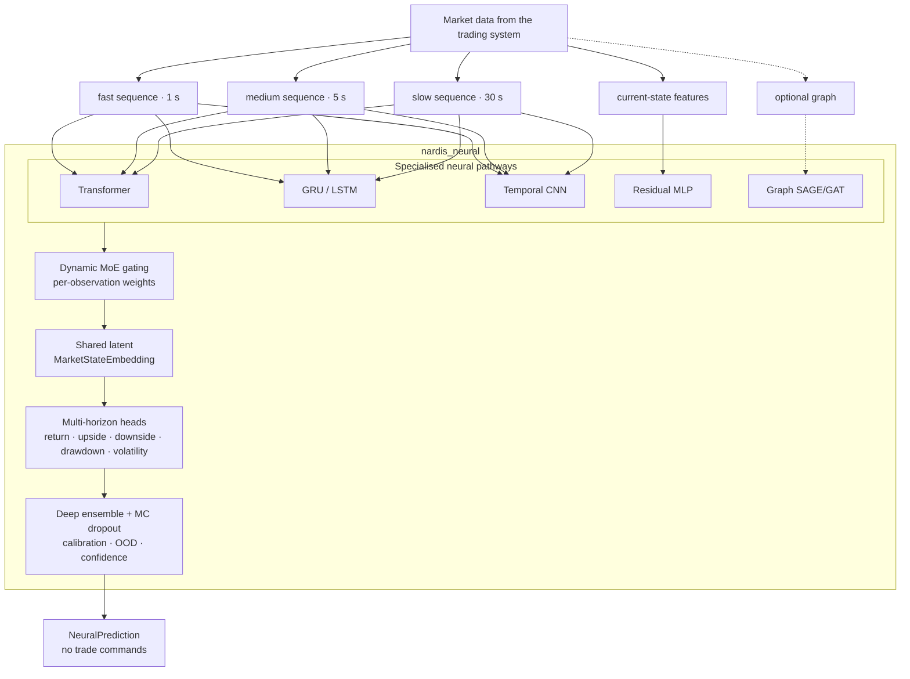
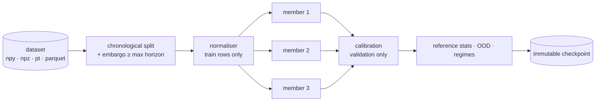
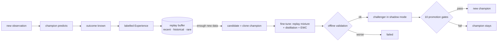

# nardis-neural

**A continually learning, multi-expert neural "market-state brain" for a Solana trading
system.**

It takes structured market state (a current feature vector, multi-resolution temporal
sequences and optional wallet/token graphs) and returns **probabilistic forecasts**:
expected returns, upside and downside event probabilities, expected maximum upside and
maximum drawdown, volatility, calibrated confidence, epistemic and aleatoric
uncertainty, an out-of-distribution score, a latent market-state embedding and per-observation
expert weights. It keeps learning from newly labelled outcomes through a guarded
champion → challenger lifecycle.

> **Scope.** This repository is the ML brain *only*. It contains no Solana RPC, wallets,
> transaction execution, order routing or trading strategy, and it never emits BUY/SELL
> commands. The existing trading system decides what to do with the forecasts.

---

## Contents

- [At a glance](#at-a-glance)
- [Quick start](#quick-start)
- [Architecture](#architecture)
  - [Neural pathways](#neural-pathways)
  - [Multi-timescale processing](#multi-timescale-processing)
  - [Mixture of experts](#mixture-of-experts)
  - [Latent embedding & outputs](#latent-embedding--outputs)
- [Uncertainty, calibration, OOD](#uncertainty-calibration-ood)
- [Training](#training)
- [Continual learning](#continual-learning)
- [Champion / challenger lifecycle](#champion--challenger-lifecycle)
- [Regimes & drift](#regimes--drift)
- [Inference API](#inference-api)
- [CLI](#cli)
- [Configuration](#configuration)
- [Repository layout](#repository-layout)
- [Testing & quality gates](#testing--quality-gates)
- [Performance](#performance)
- [Future Nardis integration](#future-nardis-integration)
- [Optional / not included](#optional--not-included)

## At a glance



| Capability | Implementation |
|---|---|
| Temporal pathways | causal pre-LN Transformer, packed GRU/LSTM, dilated causal TCN, residual MLP, optional relational GraphSAGE/GAT (pure PyTorch) |
| Fusion | learned, per-observation softmax gate with load-balance, entropy and z-loss regularisers; expert dropout and noisy gating |
| Outputs | per horizon: return mean + variance + quantiles, max upside, max drawdown, volatility (heteroscedastic), upside/downside event probabilities |
| Uncertainty | deep ensemble (independent members), seeded MC dropout, epistemic / aleatoric / total decomposition, member disagreement |
| Calibration | temperature, Platt or isotonic, fitted on validation data only; Brier score, ECE, reliability bins |
| OOD & drift | Mahalanobis embedding distance, input z-score and disagreement OOD score; PSI / KS / Wasserstein / moment input drift, embedding, prediction and error drift |
| Continual learning | 3-pool replay (recent FIFO, historical reservoir, protected rare events), 5 sampling strategies, candidate cloning, distillation, EWC, full retraining with configurable weights |
| Lifecycle | immutable checkpoints, champion/candidate/challenger/retired/failed registry with audit log, shadow mode, 10-gate promotion, manual and optional automatic rollback |
| Representation | self-supervised pretraining (masked timestep, masked feature, contrastive), embedding export to Parquet/NumPy, KMeans / GMM / HDBSCAN regime discovery |
| Engineering | Pydantic v2 + YAML config, Typer CLI, CPU/CUDA/MPS, safe mixed precision, `mypy --strict`, `ruff`, 169 tests |

## Quick start

```bash
# Python ≥ 3.12
python -m venv .venv && source .venv/bin/activate
pip install -e ".[dev]"

# synthetic demo data (testing only — not a market simulator)
nardis-neural generate-synthetic --out data/history --n 4000 --config configs/small.yaml
nardis-neural generate-synthetic --out data/live    --n 1500 --seed 1 --start-time 1700100000 --config configs/small.yaml

# train a calibrated deep ensemble and register it as champion of a workspace
nardis-neural train --data data/history --config configs/small.yaml --workspace workspaces/demo

# predict
nardis-neural predict --model workspaces/demo --data data/live --limit 5
```

In Python:

```python
from nardis_neural import NeuralEngine

engine = NeuralEngine.load("workspaces/demo")
prediction = engine.predict(observation)  # observation: NeuralObservation
```

## Architecture

The full design rationale is in [docs/ARCHITECTURE.md](docs/ARCHITECTURE.md).

### Neural pathways

| Expert | Highlights |
|---|---|
| **Transformer** (`models/transformer.py`) | pre-LayerNorm blocks, causal + key-padding attention mask via `scaled_dot_product_attention`, recency positional embedding + continuous time encoding, residuals, dropout, configurable depth/heads/width. Tests cover causality and padding invariance. |
| **Recurrent** (`models/recurrent.py`) | GRU by default (LSTM configurable). Observed steps are compacted and run as a packed sequence, so padding and interior gaps never enter the state. |
| **TCN** (`models/tcn.py`) | dilated causal convolutions, residual blocks, per-timestep LayerNorm (no future-leaking norms), unobserved steps held at zero, learned mixture over receptive-field scales. Tests cover causality and receptive field. |
| **Tabular** (`models/tabular.py`) | residual MLP with LayerNorm, GELU/SiLU and dropout for the immediate state vector. |
| **Graph** (`models/graph.py`, optional) | relational GraphSAGE or GAT over wallet→token / wallet→wallet / token→token edges, in pure PyTorch (no PyG dependency). Disabled by default; everything works without it. |

### Multi-timescale processing

Each sequence expert projects every timescale (feature dims may differ) together with
`log1p(age)` and the mask, adds a continuous time encoding and a **learned timescale
embedding**, and runs a **temporal core shared across timescales** (independent cores are
one config flag away). Masked last-step + mean pooling summarise each resolution, and an
attention-based **TimescaleFusion** combines them while masking missing timescales. At
inference all timescales are encoded in one stacked call. This is exact, because every
core is invariant to extra left padding.

### Mixture of experts

The gating network sees every expert's latent plus availability flags and outputs a
softmax over experts **for each observation**. Weights sum to 1, are returned with each
prediction, are exactly 0 for unavailable or runtime-disabled experts, start uniform
(zero-initialised gate) and are regularised against collapse by load-balance, entropy and
z-loss terms plus noisy gating and expert dropout. Experts are fused as `Σ w_e · A_e(h_e)`,
not by concatenation.

### Latent embedding & outputs

The mixture feeds a residual latent encoder that produces the **MarketStateEmbedding**,
used for regimes, nearest-neighbour search, OOD detection, drift monitoring and downstream
models. Separate per-horizon heads (default 30 s / 2 min / 5 min) predict:

- return: mean, heteroscedastic variance and non-crossing quantiles;
- max upside, max drawdown, volatility: softplus means with variances;
- `P(return > threshold)` and `P(drawdown > threshold)`: calibrated at inference.

## Uncertainty, calibration, OOD

- **Deep ensemble**: `ensemble.size` (default 3) independently initialised networks, each
  trained with its own optimiser, seed and data order (bootstrap optional).
- **MC dropout**: seeded extra passes through the decode stack, so inference is
  deterministic and cheap.
- **Decomposition**: aleatoric `E[σ²]`, epistemic `Var[μ]`, total; for events, expected
  entropy vs mutual information (BALD); plus member disagreement.
- **Calibration**: temperature, Platt or isotonic per (event, horizon), fitted on
  validation data only, with Brier / ECE / reliability reports.
- **OOD**: `ood_score` combines embedding Mahalanobis distance, input z-scores and
  disagreement, each normalised by its training 99th percentile.
- **Confidence** falls with epistemic uncertainty and with OOD.

## Training



`Trainer` supports CPU/CUDA/MPS, mixed precision (CUDA bf16/fp16, MPS opt-in), gradient
clipping and accumulation, cosine / one-cycle / plateau schedules, early stopping,
per-epoch checkpoints with exact resume, deterministic seeds, NaN/Inf detection, JSONL
metrics, configurable batch size and workers, class weighting, focal loss, balanced
sampling and rare-event oversampling. Multi-task losses (Gaussian NLL / Huber / MSE,
pinball, BCE / weighted BCE / focal, static or learned uncertainty task weights) are
logged per component. Datasets are memory-mapped, so they never have to fit in RAM.

**Self-supervised pretraining** (`nardis-neural pretrain`) trains the temporal encoders on
unlabelled sequences with masked-timestep reconstruction, masked-feature reconstruction and
NT-Xent contrastive learning. Load the result with `train --pretrained`.

## Continual learning

Details are in [docs/CONTINUAL_LEARNING.md](docs/CONTINUAL_LEARNING.md).



- **Replay**: a recent FIFO, a historical reservoir (old data is never simply dropped) and
  a protected rare-event store. Sampling can be uniform, recency-weighted, prioritized
  (with importance weights), rare-event or regime-balanced, and pools can be mixed.
- **Frequent adaptation**: clone the champion, fine-tune conservatively (low LR, few
  epochs, clipping) on a configurable mixture of recent, historical, rare and difficult
  samples, validate on the newest window with an embargo, and keep the input normaliser.
- **Anti-forgetting**: experience replay, **teacher/student distillation** from a frozen
  champion copy (tempered binary KL, regression and embedding terms, detached teacher) and
  optional **EWC** with a normalised diagonal Fisher.
- **Full retraining**: a fresh ensemble and normaliser trained on replay (plus optional
  external data), with configurable recent / historical / rare / difficult weights.
  Triggered by volume or input drift.

## Champion / challenger lifecycle

- **Registry** (`lifecycle/champion.py`): states `champion`, `candidate`, `challenger`,
  `retired`, `failed`. Model directories are immutable, `registry.json` is written
  atomically, and every transition goes to an audit log.
- **Shadow mode** (`lifecycle/shadow.py`): the challenger gets identical observations and
  its predictions are recorded but never returned. It is compared on regression, log loss,
  Brier, calibration, ranking, uncertainty quality and tails, per horizon, regime and time
  window.
- **Promotion** (`lifecycle/promotion.py`): minimum observations, return RMSE, log loss,
  tail MAE (required), plus Brier, ECE, rank correlation, NLL, time consistency and regime
  consistency. It produces JSON and Markdown reports.
- **Rollback** (`lifecycle/rollback.py`): manual, or automatic when live error degrades
  (**off by default**). It restores weights, normaliser, calibration, config and ensemble
  together.

## Regimes & drift

- `extract-embeddings` exports embeddings, gate weights, predictions and targets to
  Parquet or NPZ.
- `cluster-regimes` runs KMeans, GMM or HDBSCAN (optional automatic *k* via silhouette or
  BIC) and reports, per cluster: size, expert-weight profile, predicted and realised
  returns, errors, time span. Regimes are **discovered, never hand-defined**. Each engine
  also carries a fitted clusterer, so every prediction includes `regime_cluster`.
- `drift-report` covers four levels: raw input (PSI, KS, Wasserstein, moments), latent
  embedding (Mahalanobis distance ratio, KS, whitened mean shift), predictions, and model
  error.

## Inference API

```python
from nardis_neural import NeuralEngine, NeuralObservation, SequenceInput

engine = NeuralEngine.load("workspaces/prod")  # workspace → current champion
p = engine.predict(
    NeuralObservation(
        observation_id="tok:1718000000",
        timestamp=1718000000.0,
        current_features=current_vec,
        sequences={"fast": SequenceInput(values=bars_1s), "medium": SequenceInput(values=bars_5s)},
    )
)
p.expected_returns  # {"30s": …, "2m": …, "5m": …}
p.upside_probabilities, p.downside_probabilities, p.maximum_upside, p.maximum_drawdown
p.predicted_volatility, p.epistemic_uncertainty, p.aleatoric_uncertainty, p.total_uncertainty
p.confidence, p.ood_score, p.market_embedding, p.expert_weights, p.regime_cluster
```

The continual-learning API:

```python
from nardis_neural import ContinualLearner

trainer = ContinualLearner("workspaces/prod")
trainer.predict(observation)  # champion; challenger shadows
trainer.add_experience(observation, outcome)
trainer.adapt_if_needed()
trainer.full_retrain_if_needed()
trainer.promote_if_ready()
```

## CLI

| Command | Purpose |
|---|---|
| `init-config` | write the default YAML config |
| `generate-synthetic` | synthetic multi-regime dataset (npy / npz / pt / parquet, optional graphs, optional distribution shift) |
| `train` | train + calibrate an ensemble; `--workspace` registers it as champion (or as a challenger if a champion exists); `--pretrained`, `--resume` |
| `pretrain` | self-supervised encoder pretraining |
| `evaluate` | full metric report on a labelled dataset |
| `predict` | predictions from JSON observations or a dataset (JSONL out) |
| `extract-embeddings` | embeddings + gates + predictions → Parquet / NPZ |
| `cluster-regimes` | unsupervised regime discovery + per-cluster statistics |
| `ingest` | add labelled outcomes to the replay buffer (and to the shadow comparison) |
| `adapt` | continual adaptation (`--force` ignores the threshold) |
| `full-retrain` | weighted full retraining (`--data` for external data) |
| `shadow-evaluate` | challenger vs champion report (`--data` replays a dataset) |
| `promote` | evaluate promotion gates; `--version` forces a promotion |
| `rollback` | restore the previous (or `--to`) champion |
| `drift-report` | input / embedding / prediction / error drift |
| `inspect-model` | metadata, architecture and reference statistics |
| `status` | workspace lifecycle state |
| `benchmark` | latency, throughput and memory |

## Configuration

Everything important is in YAML and validated by Pydantic (`src/nardis_neural/config.py`):
dimensions, timescales and sequence lengths, horizons and event thresholds, transformer
layers and heads, hidden sizes, TCN channels, recurrent depth and cell, dropout, experts
enabled, gating regularisers, ensemble size and MC samples, losses and task weights,
optimiser and LR, replay capacities and strategies, retraining thresholds and weights,
distillation and EWC weights, drift thresholds, promotion gates and rollback. Presets:

- `configs/default.yaml`: production-sized defaults (GPU or strong CPU);
- `configs/small.yaml`: compact model for CPU experiments.

## Repository layout

```
├── configs/                 default.yaml · small.yaml
├── docs/                    ARCHITECTURE.md · CONTINUAL_LEARNING.md · INTEGRATION.md · SOLANA.md
├── examples/                nardis_integration.py (runnable, tested)
├── src/nardis_neural/
│   ├── config.py            Pydantic config tree
│   ├── schemas.py           NeuralObservation / NeuralOutcome / NeuralPrediction
│   ├── synthetic.py         multi-regime synthetic market generator (tests/demos)
│   ├── benchmark.py         latency / throughput / memory
│   ├── cli.py               Typer CLI
│   ├── data/                loaders · datasets · sequences · splits · normalization · replay
│   ├── models/              transformer · recurrent · tcn · tabular · graph · experts ·
│   │                        gating · fusion · heads · ensemble · main · common
│   ├── training/            trainer · losses · metrics · scheduling · pipeline ·
│   │                        continual · distillation · ewc · pretraining
│   ├── inference/           engine · uncertainty · calibration · ood
│   ├── regimes/             embeddings · clustering
│   ├── lifecycle/           checkpoints · champion · candidate · shadow · promotion · rollback
│   ├── monitoring/          drift
│   └── solana/              amm · events · market · wallets · features · labels · dataset ·
│                            risk · simulator · brain · config · cli
└── tests/                   169 tests incl. synthetic end-to-end pipeline
```

## Testing & quality gates

```bash
ruff check .        # lint
ruff format --check .
mypy                # strict mode: src, tests and examples
pytest              # 169 tests; CUDA / MPS tests auto-skip when unavailable
```

The suite covers:

- Transformer shapes, causality and masking; recurrent and TCN causality; padding and gap
  invariance;
- gating sums, disabled experts and dynamic routing; gradients reaching every expert;
- probabilistic and multi-task losses; trainer resume and determinism;
- ensemble disagreement, calibration and OOD;
- checkpoint and normaliser persistence; replay strategies and persistence;
- candidate/champion isolation, adaptation, distillation, EWC and pretraining;
- regimes and drift; shadow mode, promotion gates and rollback;
- leakage-free chronological and walk-forward splits (property-based), deterministic
  inference, devices, every CLI command, the integration example;
- a **synthetic end-to-end test**: data → train ensemble → predict → uncertainty →
  experiences → replay → adaptation → shadow → promotion → checkpoint → reload → identical
  inference → rollback.

## Performance

Default configuration (3 members × 664 k parameters, 2 MC samples), CPU only, 4-core Xeon
@ 2.1 GHz:

| | p50 latency | throughput |
|---|---|---|
| single observation (full API) | ~40 ms | – |
| batch 32 | ~130 ms | ~250 obs/s |
| batch 256 | ~650 ms | ~390 obs/s |
| single observation, `mc_dropout_samples: 0` | ~27 ms | – |

Peak RSS is about 0.8 GB. GPUs are much faster. Run `nardis-neural benchmark` on your
hardware.

## Future Nardis integration

See [docs/INTEGRATION.md](docs/INTEGRATION.md) and the runnable
[`examples/nardis_integration.py`](examples/nardis_integration.py). In short: build a
`NeuralObservation` from generic tensors (`build_bars` turns raw event streams into
leakage-free bars), call `predict`, report `NeuralOutcome`s as horizons elapse, and run
`adapt_if_needed` / `full_retrain_if_needed` / `promote_if_ready` on a background timer.
The trading system never touches model internals.

## Solana intelligence layer

`nardis_neural.solana` specialises the brain for Solana memecoin markets. See
[docs/SOLANA.md](docs/SOLANA.md).

- exact **pump.fun bonding-curve and AMM maths**: bonding progress, graduation,
  round-trip cost (fees + two-way impact) for a reference size;
- a **causal market state** fed by decoded events (launches, swaps, migrations, LP changes,
  SOL transfers) that rejects time travel;
- **wallet intelligence**: union-find funding clusters with exchange-hub detection
  (sybil / bundle discovery) and Beta-posterior reputations learned online *only* from
  outcomes that have already resolved, plus rug attribution to creator clusters;
- **48 named on-chain features**: holder concentration, dev / sniper / bundle /
  creator-cluster exposure, fresh wallets, smart-money flow, bots, priority fees and Jito
  tips, authorities, liquidity. Also 1 s / 5 s / 30 s trade bars with forward-filled
  prices, and a live wallet→token / funding / cluster **graph** for the graph expert;
- **hindsight labels** (returns, cost-aware net returns, rug / graduation / dev-dump events)
  joined with **causally replayed features**; a test proves snapshots equal what a
  past-only market would compute;
- a **launch-risk ensemble** (P rug, P graduation, P dev dump) on
  `[embedding ‖ on-chain features]`, with token-disjoint validation and calibration;
- **`SolanaBrain`**: `ingest → assess_many → resolve → maintenance`, returning forecasts,
  risk, expected net return after costs, P(beat costs) and human-readable red flags. It
  plugs into the continual-learning, shadow, promotion and rollback machinery;
- an **agent-based launch simulator** (retail, smart money, snipers, bots, loud and stealth
  rug crews, decoys, graduations, LP pulls) and the `nardis-neural solana …` CLI
  (`simulate`, `build-dataset`, `bootstrap`, `replay`, `assess`, `init-config`).

```python
from nardis_neural.solana import SolanaBrain, EventStore
brain = SolanaBrain.bootstrap("workspaces/sol", EventStore.load("history/"))
brain.ingest(event)                       # decoded on-chain events, in time order
for report in brain.assess_active():      # one batched forward pass per round
    report.risk["rug"], report.expected_net_return["60s"], report.flags
brain.resolve(); brain.maintenance()
```

## Optional / not included

- **Graph pathway**: implemented and tested, but disabled by default. It needs graph
  inputs from the trading system and no extra dependency.
- **Parquet datasets** carry features and targets but not graphs; use `.npy` directories,
  `.npz` or `.pt` for graph data.
- **Regime cluster ids are per model version**: each adaptation refits clusters on its own
  embedding space.
- **Offline candidate validation** uses a held-out half of the newest window, which is
  small by design. Shadow mode on genuinely new data is the decisive test.
- **Distributed or multi-node training** is intentionally out of scope (no Ray, Spark,
  Kafka and so on). Single-GPU or CPU training is supported.
- **Real-market data ingestion** is out of scope: the trading system produces the datasets.
  The synthetic generator exists to test the ML system, not to model profitability.
