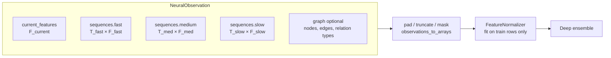
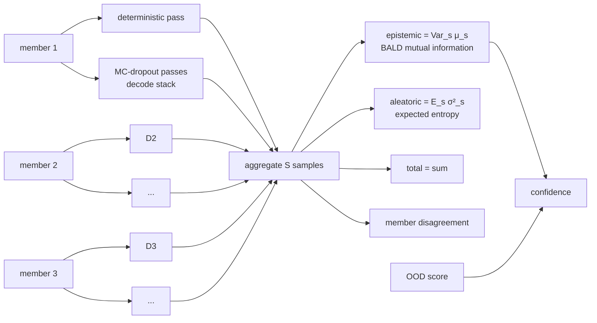

# Architecture

This document describes the neural architecture of `nardis_neural` and the reasoning
behind each design decision. For the learning lifecycle see
[CONTINUAL_LEARNING.md](CONTINUAL_LEARNING.md); for wiring it into a trading system see
[INTEGRATION.md](INTEGRATION.md).

## 1. Scope

The repository is the ML *brain* only. It receives generic tensors and returns
probabilistic forecasts. There is **no** wallet, key, signing, transaction-sending,
order-routing or strategy code, and no output is ever a BUY/SELL instruction. The only chain
access is the Solana layer's read-only RPC client, which fetches public transactions to learn
from (see [SOLANA.md](SOLANA.md)).

## 2. Data contract



* Every sequence is ordered oldest → newest; `time_deltas[i]` is the age of step `i` in
  seconds relative to the observation time. Sequences are **left-padded** to `max_len`
  (the most recent step is always the last index) and carry a boolean mask. Rows that are
  all-NaN are treated as missing, so interior gaps are supported.
* Timescales, feature dimensions, horizons and thresholds all come from YAML — no
  Solana-specific names exist anywhere in the neural core.
* On disk, datasets use a flat `key → ndarray` layout: a directory of `.npy` files opened
  with `mmap_mode="r"` (never fully loaded), or `.npz`, `.pt`, or `.parquet` (streamed by
  row batch into memmaps). Optional graphs are stored as ragged arrays with offsets.
* `build_bars` turns a raw irregular event stream into fixed-resolution bars using only
  events at or before the observation time, which makes look-ahead impossible.

## 3. Network

```mermaid
flowchart TB
    subgraph Inputs
        cur[current features]
        fast[fast seq]
        med[medium seq]
        slow[slow seq]
        graph[graph - optional]
    end

    subgraph Experts[Specialised pathways]
        direction LR
        TR[Transformer expert<br/>pre-LN, causal, masked,<br/>time + recency encoding]
        RN[Recurrent expert<br/>GRU / LSTM, packed,<br/>gap-aware]
        TC[TCN expert<br/>dilated causal conv,<br/>multi-scale skips]
        SM[SSM expert<br/>selective state space,<br/>input-dependent Δ]
        TB[Tabular expert<br/>residual MLP]
        GR[Graph expert<br/>relational SAGE / GAT]
    end

    fast & med & slow --> TR & RN & TC & SM
    cur --> TB
    graph --> GR

    TR & RN & TC & SM & TB & GR --> Gate[Dynamic gating network<br/>softmax over available experts<br/>load-balance + entropy + z-loss]
    TR & RN & TC & SM & TB & GR --> Mix[Expert adapters<br/>Σ w_e · A_e h_e]
    Gate -- per-observation weights --> Mix
    Mix --> Lat[Latent encoder<br/>MarketStateEmbedding]
    Lat --> H1[return heads<br/>μ, log σ², quantiles]
    Lat --> H2[max-upside heads]
    Lat --> H3[max-drawdown heads]
    Lat --> H4[volatility heads]
    Lat --> H5[upside event heads]
    Lat --> H6[downside event heads]
```

### 3.1 Multi-timescale processing (design choice)

Each sequence expert contains:

1. a **per-timescale input projection** of `[values·mask, log1p(age)·mask, mask]`
   (timescales may have different feature dimensions),
2. a **continuous time encoding** (learnable Fourier features of `log1p(age)`) plus a
   **learned timescale embedding**,
3. **one temporal core shared across timescales** (default) or one core per timescale,
4. masked pooling (last observed step + masked mean),
5. a **TimescaleFusion** module: attention pooling over the timescale summaries with
   missing timescales masked. Its weights are exposed for inspection.

**Why share the core?** The fast, medium and slow streams show the same kinds of
dynamics (momentum, bursts, reversals) at different speeds. A shared core sees roughly
three times more sequences per parameter, which regularises it strongly, and the
timescale embedding plus continuous age encoding still let it condition on resolution.
Independent cores stay available (`share_encoder_across_timescales: false`) for streams
that behave very differently.

At inference, a shared core encodes **all timescales in one call**: projected sequences
are left-padded to a common length and stacked on the batch axis. This is exact, not an
approximation: every core is invariant to extra left padding (key masking in the
Transformer, packed sequences in the RNN, zero-held unobserved steps in the TCN, Δ = 0
on unobserved steps in the SSM), and a
test asserts equality with per-timescale encoding. Training keeps per-timescale calls
so it doesn't pay for padding compute.

### 3.2 Pathways

| Expert | Mechanism | What it specialises in |
|---|---|---|
| Transformer | pre-LayerNorm blocks, `scaled_dot_product_attention` with combined causal + key-padding mask, recency positional embedding + continuous time encoding, GELU feed-forward, residuals, dropout | long-range, content-addressed dependencies |
| Recurrent | GRU (default) or LSTM; observed steps are compacted chronologically and run as a *packed* sequence, so padding and interior gaps never touch the recurrent state | smooth sequential state accumulation |
| TCN | dilated causal convolutions (left padding only) in residual blocks; per-timestep LayerNorm (batch/group norm over time would leak the future); a learned softmax mixture of every block's output (multi-receptive-field skips) | local patterns, bursts, short shocks |
| SSM | selective state-space layers (Mamba-style): pre-LN, input projection into signal and gate, causal depthwise conv, input-dependent step Δ and B / C, diagonal scan `s_t = exp(Δ_t A) s_{t−1} + Δ_t B_t x_t`, `y_t = C_t s_t + D x_t`, SiLU gate, residual. Unobserved steps get Δ = 0 and zero input, so the state passes through gaps and padding unchanged. The scan is sequential in pure PyTorch: linear in length, no custom kernels | per-step choice of what to remember: bursts reset state, quiet periods keep it |
| Tabular | residual MLP (pre-LN residual blocks, GELU/SiLU, dropout) | immediate state without history |
| Graph (optional) | pure-PyTorch relational GraphSAGE or GAT (per-relation weights / attention bias), readout = target node ‖ mean pool | wallet→token, wallet→wallet, token→token structure |

**Why no PyTorch Geometric?** The graphs are small per-observation ego-graphs.
`index_add_`/`scatter_reduce` message passing is short, fast and dependency-free, so graph
support never breaks installation. Graphs are disabled by default and the repository works
without them.

### 3.3 Mixture of experts

The gate receives every expert's layer-normalised latent plus availability flags and
outputs a per-observation softmax over experts:

* **Unavailable experts are masked**: a sequence expert whose timescales are all missing,
  the graph expert when a sample has no graph, and experts disabled at runtime
  (`set_disabled_experts`) all get weight exactly 0. If nothing is available the gate
  falls back to uniform weights instead of producing NaN.
* **Anti-collapse regularisation**:
  * *load balance* `E·Σ_e importance_e² − 1`, which is zero when batch-average usage is
    uniform but still allows sharp routing for individual samples;
  * a small *entropy bonus* on per-sample weights, so the gate doesn't saturate before
    evidence accumulates;
  * *z-loss* on gate logits, for stability;
  * *noisy gating* and *expert dropout* during training, so every expert keeps receiving
    gradient.
* The final gate layer is zero-initialised, so routing **starts uniform and is learned**.
  Nothing is hand-assigned.
* Fusion is `Σ_e w_e · A_e(h_e)` with an expert-specific adapter `A_e`, not a plain
  concatenation.

### 3.4 MarketStateEmbedding

The mixture passes through a residual latent encoder with a final LayerNorm to give the
`latent_dim`-dimensional **MarketStateEmbedding**. It is returned with every prediction
and used for OOD scoring, drift detection, regime discovery, nearest-neighbour search and
downstream models. Deep-ensemble members learn different latent coordinate systems, so the
published embedding comes from one fixed member (`ensemble.embedding_member`) to keep its
geometry stable.

### 3.5 Multi-task, multi-horizon heads

Each (task, horizon) pair has its own two-layer MLP. Per-horizon weights live in batched
tensors and are evaluated with one `einsum`.

| Task | Output | Activation |
|---|---|---|
| `return` | mean, log-variance, quantiles (default 10/50/90 %) | identity; quantiles are a base plus cumulative softplus increments, so they never cross |
| `max_upside` | mean, log-variance | softplus (non-negative) |
| `max_drawdown` | mean, log-variance | softplus (positive magnitude) |
| `volatility` | mean, log-variance | softplus |
| `upside` | logit of P(return > threshold_h) | sigmoid + calibration at inference |
| `downside` | logit of P(drawdown > threshold_h) | sigmoid + calibration at inference |

Log-variances are soft-bounded to `[-9, 5]` with `tanh`. The model works in *normalised
target space*: regression targets are scaled (not centred, so magnitudes stay
non-negative) by training-set RMS, and the engine maps outputs back to real units.

## 4. Losses

`MultiTaskLoss` combines the following (every component is logged separately):

* regression: heteroscedastic Gaussian NLL (default), Huber or MSE. With Huber or MSE, a
  detached-mean Gaussian NLL still trains the variance heads, so aleatoric uncertainty is
  always available;
* pinball loss on the return quantiles;
* classification: BCE, weighted BCE (`pos_weight` either automatic neg/pos or fixed) or
  focal loss;
* static task weights or learned homoscedastic uncertainty weighting (Kendall et al.);
* gate regularisers;
* target masks (unknown horizons) and per-sample weights (replay, retraining weights).

Class imbalance is handled with class weighting, focal loss, class-balanced sampling and
rare-event oversampling, each configurable independently.

## 5. Training engine

`Trainer.fit` trains a single network and is deliberately transparent. It supports:

* CPU, CUDA and MPS devices;
* mixed precision where safe (CUDA bf16, or fp16 with `GradScaler`; MPS only on explicit
  request);
* gradient accumulation and clipping;
* cosine-with-warmup, one-cycle, plateau or constant LR schedules;
* early stopping on validation loss, restoring the best weights;
* per-epoch checkpoints with exact resume (optimizer, scheduler, scaler and RNG states);
* deterministic seeding;
* NaN/Inf detection that skips bad steps and aborts after N consecutive ones;
* JSONL metrics.

`train_engine` (in `training/pipeline.py`) runs the complete recipe:

1. Chronological split with an **embargo** equal to the longest horizon, because a label at
   time *t* looks up to *t + horizon* into the future.
2. Fit the normaliser on **training rows only**.
3. Train each ensemble member independently (own seed, data order and optional bootstrap).
4. Fit probability calibration on the **validation** split.
5. Record reference uncertainty statistics.
6. Fit the OOD detector and regime clusters on training embeddings.
7. Compute validation metrics and write the checkpoint metadata.

## 6. Uncertainty



* **Deep ensemble**: `ensemble.size` independently initialised and independently trained
  full networks (default 3).
* **MC dropout**: `mc_dropout_samples` extra stochastic passes per member, seeded so
  inference stays deterministic. The expensive expert encoders run once per member; dropout
  is resampled only in the gate → mixture → latent → heads stack. This cut
  single-observation latency by about 3× and still gives within-member stochasticity, while
  encoder-level diversity comes from the ensemble.
* Regression uncertainty follows the law of total variance; classification uses the
  information-theoretic split (total entropy = expected entropy + mutual information).
* **Confidence** = `1/(1 + epistemic/median_val_epistemic) · exp(−penalty·max(0, ood−1))`.
  It is 0.5 at typical validation uncertainty, approaches 1 when members agree, and decays
  outside the training distribution.

## 7. Calibration and OOD

* `CalibrationSet` holds one calibrator per (event task, horizon): temperature scaling,
  Platt scaling or isotonic regression. Calibrators are fitted on validation data only and
  stored as plain JSON. Brier score, ECE, log loss and reliability bins are recorded
  before and after calibration.
* `OODDetector` combines three signals, each normalised by its 99th percentile on training
  data:
  1. Mahalanobis distance of the embedding (shrinkage covariance);
  2. RMS z-score of raw inputs;
  3. ensemble epistemic uncertainty.

  An `ood_score` above 1 means "outside familiar territory" and lowers confidence.

## 8. Checkpoints

Each model version is an immutable directory written atomically:

```
<version>/
  manifest.json      version, parent, created_at, git commit, data fingerprint,
                     ensemble metadata (size, seeds, embedding member, MC samples),
                     training statistics, reference statistics, target definitions,
                     horizons, expert names, format/torch/package versions
  config.yaml        full configuration (architecture, horizons, everything)
  members/member_i.pt   weights (loaded with torch.load(weights_only=True))
  normalizer.json    normalisation state
  calibration.json   calibrators + calibration report
  ood.json           OOD detector
  regimes.json       regime clusterer
```

Everything needed to reproduce inference exactly is in the directory. Tests check that a
reload gives bit-identical outputs.

## 9. Performance

Measured on a 4-core Intel Xeon @ 2.1 GHz (CPU only) with the **default** configuration
(3 members × ~729 k parameters, five experts including the SSM, sequence lengths 64/48/32):

| MC samples | single obs p50 | batch 32 | batch 256 |
|---|---|---|---|
| 2 (default) | ~49 ms | ~190 ms (≈170 obs/s) | ~1.2 s (≈215 obs/s) |
| 0 | ~39 ms | ~150 ms (≈210 obs/s) | ~1.1 s (≈235 obs/s) |
| `cpu-lite` profile (2 × 168 k, MC 0) | ~21 ms | ~88 ms (≈365 obs/s) | ~0.4 s (≈640 obs/s) |

The SSM scan is a plain loop over time. On CPUs it measured faster than a parallel prefix
scan, which is memory-bound at these batch sizes.
Peak RSS was about 1 GB (0.8 GB for `cpu-lite`), including PyTorch itself. A GPU is much faster; widths, depths
and sequence lengths can be scaled up or down in YAML. Measure your own hardware with
`nardis-neural benchmark`.

### 9.1 Hardware profiles

`nardis_neural.hardware` scales one architecture to the machine. `nardis-neural hardware`
prints what was detected, and `train --profile auto` (or `solana bootstrap --profile …`)
applies it:

| profile | model per member | ensemble / MC passes | parameters per member | picked when |
|---|---|---|---|---|
| `cpu-lite` | d = 32, 1-layer experts, SSM state 8 | 2 / 0 | ≈ 0.17 M | CPU with < 8 cores |
| `cpu` | d = 48, 2-layer experts, SSM state 16 | 3 / 1 | ≈ 0.39 M | CPU with ≥ 8 cores |
| `gpu` | d = 128, 3-layer experts, 2 SSM layers | 5 / 2 | ≈ 3.2 M | CUDA or Apple MPS |
| `gpu-frontier` | d = 256, 6-layer Transformer, 4 SSM layers with state 32 | 5 / 4 | ≈ 16.6 M | CUDA with ≥ 16 GB |

Every profile produces the same inputs and outputs, so checkpoints, the lifecycle and the
Solana modules work unchanged. GPU profiles use mixed precision where it is safe.
