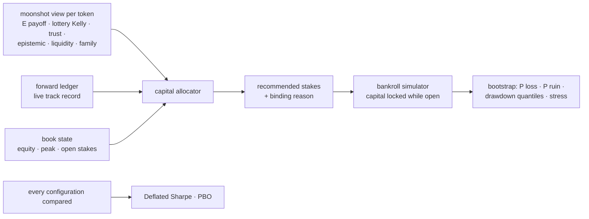

# Capital engine (`nardis_neural.solana.capital`)

Good probabilities are not a trading system. Capital compounds only if the *size* of each
bet matches its edge and its risk, if correlated bets are not stacked, and if the account
survives the losing streaks that fat-tailed strategies always produce. And none of it
matters if the backtested edge is an artefact of trying many variants. This module
handles all of those questions.



## 1. Allocator (`allocator.py`)

For each candidate, best expected edge first:

```
fraction = lottery Kelly × kelly_scale × trust × exp(−epistemic / uncertainty_scale)
           × track record × drawdown governor
```

* **Lottery Kelly** comes from the tail model and is already fractional and capped: the
  bet size that maximises expected log-wealth under the predicted payoff distribution.
* **Trust** comes from the manipulation guard, and **epistemic** from the ensemble's
  disagreement. The less the model knows, the less it bets.
* **Track record** is realised ÷ predicted payoff of the forward ledger's settled paper
  tickets, clipped to [0.25, 1.25]. When live results fall short of what the model
  promised, every stake shrinks in proportion.
* The **drawdown governor** scales stakes linearly from 1 at the equity peak to 0 at
  `max_drawdown` (35 %). The **daily loss stop** allows no new positions after losing 15 %
  of the day's opening equity.

Then the limits, each reported as the binding `reason`:

* per position: 4 % of equity;
* **liquidity**: 2 % of the pool's real SOL, so our own impact stays small;
* per **creator family**: 8 % of equity, because a serial deployer is one correlated bet;
* total exposure: 30 % of equity; at most 12 concurrent positions; stakes under 0.02 SOL
  are dropped.

```python
for a in brain.allocate(equity_sol=100.0, open_stakes={"Mint…": 1.2}, peak_equity_sol=120.0):
    a.mint, a.stake_sol, a.fraction, a.reason  # advice for the trading system, not an order
```

The command-line equivalent is `nardis-neural solana allocate --workspace ws --equity 100`.

## 2. Bankroll simulator (`bankroll.py`)

Tickets enter in time order. Capital is locked from entry to exit, open positions are
carried at cost (no mark-to-market optimism), and a ticket returns `stake × multiple` when
it closes. The outputs are:

* return, log growth, maximum drawdown and time underwater;
* a **bootstrap risk profile**: outcomes are resampled onto the same schedule of signals,
  giving the median and 5 % quantile of the return, P(loss), P(−50 %) and drawdown
  quantiles;
* **stress tests**: every payoff is scaled down (×0.6, ×0.35), because live edges are
  usually far smaller than backtested ones. Each sizing (flat, aggressive flat,
  allocator) is compared under the same stress.

## 3. Is the edge real? (`overfit.py`)

* **Deflated Sharpe Ratio** (Bailey & López de Prado, 2014). This is the probability that
  the chosen policy's true Sharpe ratio exceeds the Sharpe ratio expected from the *best
  of N* unskilled trials. It accounts for sample length, skew and fat tails.
* **Probability of Backtest Overfitting** (Bailey, Borwein, López de Prado & Zhu). Time is
  cut into 8 blocks. For all 70 ways of choosing 4 of them as in-sample, the in-sample
  winner is ranked out-of-sample. PBO is the share of splits in which it lands below the
  median.

Every moonshot research report now includes both. They are computed across the entry
thresholds compared on the test period, next to the bankroll comparison and the stress
test. Tests check that the luckiest of 50 noise strategies gets a low DSR, that pure noise
gets a high PBO, and that a genuinely better configuration gets a PBO near zero.

## 4. Results on the simulator

Moonshot research on two 150-launch markets (seed 7): `degen` without herding and
`adversarial` with herding. The book starts at 100 SOL and trades the test-period tickets
of the deployed policy. Payoffs were computed for 0.5 SOL tickets. Bootstrap figures come
from 300 resampled histories.

| | degen | adversarial + herding |
|---|---|---|
| per-ticket Sharpe · Deflated Sharpe Ratio (6 thresholds tried) | 0.36 · **1.00** | 0.58 · **1.00** |
| PBO across entry thresholds | 59 % | 86 % |
| flat 0.5 SOL: return / max drawdown | +172 % / 0.4 % | +37 % / 0.3 % |
| allocator: return / max drawdown | +129 % / 0.5 % | +23 % / 0.1 % |

Stress test, adversarial market (bootstrap median return, P(loss), P(−50 %)):

| payoff haircut | mean multiple | flat 0.5 SOL | flat 5 SOL | allocator |
|---|---|---|---|---|
| ×0.6 | 1.60x | +13 %, 0 %, 0 % | **+129 %**, 0 %, 0 % | +6 %, 1 %, 0 % |
| ×0.35 (no edge left) | 0.93x | −2 %, 73 %, 0 % | −17 %, 73 %, **16 %** | −1 %, 67 %, 0 % |

How to read this:

* **The edge is not a multiple-testing artefact.** The deployed policy's Sharpe ratio is far
  above the best-of-trials benchmark in both markets (DSR 1.00).
* **The entry threshold does not matter, so do not tune it.** PBO of 59 % and 86 % says the
  threshold that looks best in-sample is no better than the others out-of-sample. They
  all trade nearly the same tokens.
* **Sizing is a trade-off, and it is now measured.** While the edge holds, bigger stakes
  compound faster. If the live edge turns out much smaller than the backtest (the usual
  case), aggressive flat sizing ruins about one history in six. The conservative
  allocator never did, but it earned less in these generous markets. Its liquidity cap
  (2 % of a young pool's real SOL) is what binds most often.
* **The intended way to scale up** is to start with the defaults and let the forward
  ledger accumulate settled tickets. `track_record` then scales stakes by realised ÷
  predicted payoff, and `kelly_scale` should be raised only after the live record confirms
  the edge. It is the same logic the Deflated Sharpe Ratio applies to backtests: size to
  evidence, not to hope.
* Both markets are simulations. Real launch markets are harsher. The stress rows are the
  more realistic guide to what sizing does.
