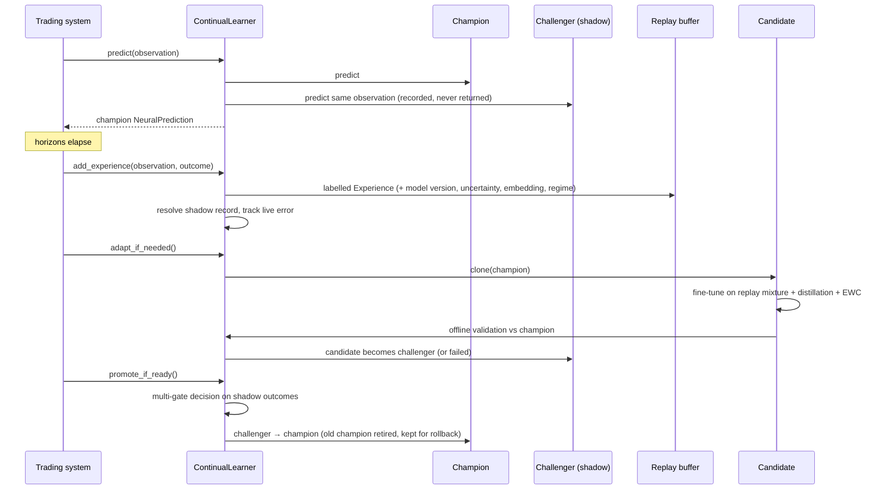
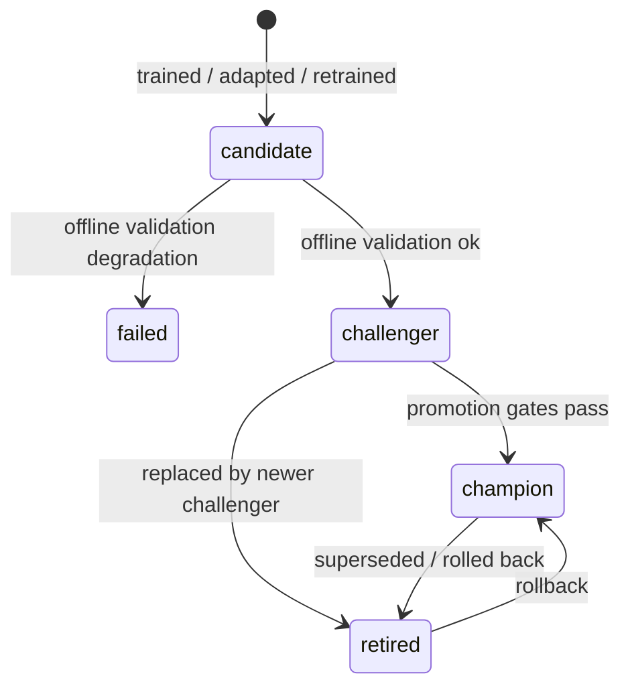

# Continual learning

The model keeps learning from newly labelled market observations. The production champion
is never trained, mutated or overwritten in place.

## 1. The loop

## 2. Experiences and replay

`Experience` holds the observation arrays, timestamp, targets and target mask, the version
of the model that made the original prediction, its prediction summary, its uncertainty,
the latent embedding and regime cluster at prediction time, a priority (the standardised
error of the original prediction) and a rare-event flag.

`ExperienceReplayBuffer` keeps three pools. None of them simply drops old data when full.

| Pool | Policy |
|---|---|
| recent | FIFO of the newest experiences |
| historical | reservoir sample (algorithm R) of everything that ever left the recent pool, i.e. unbiased long-term memory |
| rare | protected store of extreme outcomes; when full, the lowest-priority/oldest item is evicted |

Sampling strategies: `uniform`, `recency` (exponential half-life), `prioritized` (PER with
importance weights `(N·P)^-β`), `rare`, `regime_balanced`. `sample_mixture` combines pools
with configurable fractions. The buffer is persisted as memory-mappable arrays plus JSON
metadata and an embeddings matrix.

## 3. Frequent adaptation (`adapt`)

Triggered when `continual.min_new_samples` new experiences have arrived.

1. **Validation window**: the most recent `adapt_validation_fraction` of the *new*
   experiences. They are never used for training.
2. **Eligible training data**: experiences with timestamp ≤ `validation start − embargo`,
   so no label window overlaps validation.
3. **Replay mixture** (`adapt_samples` rows): recency-weighted recent
   (`recent_fraction`), uniform historical (`historical_fraction`), rare events
   (`rare_fraction`) and high-error "difficult" samples (`difficult_fraction`).
4. **Candidate = deep clone of the champion.** It shares no tensors, normaliser or
   calibrator objects, and a test asserts this.
5. **Conservative fine-tuning**: `adapt_learning_rate`, `adapt_epochs`, gradient clipping,
   early stopping on the validation window. The champion's normaliser is kept, so the input
   space doesn't move.
6. **Objective** = supervised multi-task loss
   + **distillation** from a frozen copy of the champion (teacher outputs computed under
   `no_grad`, i.e. detached): binary KL on tempered event probabilities (× T²), MSE on
   regression means and log-variances, and a cosine term on embeddings
   + **EWC** penalty `λ/2 Σ F_i(θ_i − θ*_i)²`, with the diagonal Fisher estimated on
   historical replay at the champion's parameters and normalised to mean 1.
7. Refit calibration, OOD and regimes for the candidate.
8. **Offline gate on a true holdout**: the validation window is split chronologically.
   The earlier half drives early stopping and calibration; the later half is never seen
   by the candidate. On that holdout, compare the mean relative change in return RMSE and
   event log losses against the champion. Above `offline_max_degradation` → status
   `failed`; otherwise → `challenger` (shadow mode). Windows under 20 samples are not
   split.

## 4. Periodic full retraining (`full_retrain`)

Triggered by `full_retrain_min_new_samples`, or by input drift between the historical and
recent replay pools (`full_retrain_on_drift`).

* A **fresh** ensemble is trained from scratch, with a new normaliser fitted on the new
  training split.
* Data: every replay experience plus an optional external dataset (e.g. a fresh export
  from the trading system).
* Per-sample loss weights, all configurable and none hard-coded:
  `recent_weight` (last `full_retrain_recent_window` experiences) versus
  `historical_weight`, multiplied by `rare_weight` for rare events and by
  `difficult_weight` for the top-20 % priority samples. Weights are normalised to mean 1.
* Chronological split with embargo; the same held-out offline gate; enters shadow mode as a
  challenger.

## 5. Self-supervised pretraining

`pretrain_encoders` trains the sequence experts on **unlabelled** data before supervised
training:

* **masked timestep reconstruction**: whole observed steps are blanked and reconstructed.
  With causal encoders this becomes a forecasting-style objective;
* **masked feature reconstruction**: individual (step, feature) entries are blanked and
  reconstructed;
* **contrastive**: NT-Xent between two augmentations (jitter, scaling, step dropout) of
  each sample's fused multi-timescale representation.

Encoder weights (`experts.*`) are then loaded into every ensemble member
(`train --pretrained`). Pretraining is optional; supervised training works without it.

## 6. Shadow mode

When a challenger exists, `ContinualLearner.predict` runs it on the **identical**
observation arrays, stores both predictions in `shadow/records.jsonl`, and returns only
the champion's `NeuralPrediction`. When outcomes arrive the records are resolved. The
`ShadowReport` then compares the two models:

* overall and per-horizon regression error, log loss, Brier score, ECE, AUC, ranking
  quality (Spearman), uncertainty quality (Gaussian NLL, 90 % coverage, uncertainty–error
  rank correlation), tail-event MAE for returns and drawdowns, downside tail recall;
* the same metrics per regime cluster;
* the same metrics per consecutive time window.

`shadow-evaluate --data` replays a labelled dataset through both models offline.

## 7. Promotion

`evaluate_promotion` produces an auditable `PromotionDecision`. It is saved as JSON and
Markdown in `reports/`.

| Gate | Default rule |
|---|---|
| `min_observations` (required) | ≥ `min_observations` resolved shadow samples |
| `return_rmse` (required) | challenger ≤ champion × `max_rmse_ratio` |
| `log_loss` (required) | mean event log loss ≤ champion × `max_log_loss_ratio` |
| `tail_mae` (required) | tail return/drawdown MAE ≤ champion × `max_tail_mae_ratio` |
| `brier` | ≤ champion × `max_brier_ratio` |
| `calibration_ece` | ≤ champion + `max_ece_increase` |
| `rank_corr` | ≥ champion + `min_rank_corr_delta` |
| `uncertainty_nll` | ≤ champion + `max_nll_increase` |
| `time_consistency` | challenger wins ≥ `min_window_win_fraction` of time windows |
| `regime_consistency` | no regime degrades by more than `max_regime_degradation` |

A challenger is promoted only if every required gate passes **and** at least
`min_passed_fraction` of all gates pass. It is never reduced to a single metric.

## 8. Rollback

Each model directory is complete and immutable, so a rollback only moves the registry's
champion pointer. That restores weights, normaliser, calibration state, configuration and
ensemble membership together.

* Manual: `nardis-neural rollback --workspace W [--to VERSION]`, or
  `learner.rollback()`.
* Automatic (**off by default**, `lifecycle.auto_rollback: true` to enable): after a
  promotion, the live mean absolute return error of the champion's resolved predictions is
  compared with the challenger's shadow MAE at promotion time. If it exceeds
  `baseline × (1 + auto_rollback_degradation)` over `auto_rollback_min_observations`
  samples, the previous champion is restored.
* After every promotion, `ModelRegistry.prune(lifecycle.keep_champions)` deletes the
  weights of failed models and of retired models beyond the newest `keep_champions` (5)
  former champions, which stay available as rollback targets. Registry entries and the
  audit log are kept. This keeps disk use bounded when the learner runs for months.

## 9. Lifecycle states

## 10. Time-series safety

* `chronological_split`, `walk_forward_splits` (expanding or rolling) and
  `rolling_window_splits` never shuffle across time and apply an embargo ≥ the longest
  label horizon.
* Normalisation, calibration, OOD references and regime clusters are fitted only on data
  that precedes the corresponding validation period.
* Hypothesis property tests assert `max(train time) ≤ min(validation time) − embargo` for
  arbitrary timestamp sets.
