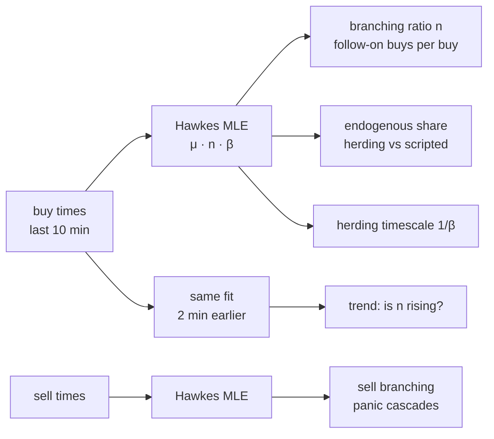

# Criticality engine (`nardis_neural.solana.hawkes`)

A runner is a **chain reaction**: buys trigger more buys, which trigger more buys. An
epidemic grows when each case infects more than one other person (R₀ > 1). A nuclear pile
goes critical when each fission triggers at least one more. Financial order flow shows the
same structure (Filimonov & Sornette measured the "endogeneity" of whole markets this way).

This module measures, for every token and in real time, **how close its buying is to that
phase transition**.



## 1. The model

An exponential Hawkes process has intensity

```
λ(t) = μ + Σ_{t_j < t} n · β · exp(−β (t − t_j))
```

* `μ` is the **exogenous** rate: activity that would happen anyway (insiders on a script,
  bots on a clock, outside news);
* `n` is the **branching ratio**: the expected number of follow-on events each event
  directly triggers;
* `β` is the decay rate of that influence; `1/β` is the herding timescale.

The branching ratio is the dimensionless number that matters:

| n | regime | meaning for a launch |
|---|---|---|
| ≪ 1 | subcritical | activity is driven from outside and stops when the drivers stop |
| → 1 | critical | cascades of any size become possible: the runner regime |
| share of events explained by excitation | endogenous share | organic herding (high) vs scripted flow such as wash bots and staged insiders (low) |

The last row is the manipulation angle. **Scripted flow does not self-excite.** Wash bots
and staged insiders trade on their own schedule rather than in reaction to other buyers,
so a token can look busy while its endogenous share stays low. That is a
signature that aggregate volume and holder counts cannot show.

## 2. The estimator

* **Exact maximum likelihood** by expectation–maximisation. The EM runs for every decay
  rate on a log-spaced grid at once (vectorised), and the best likelihood wins.
* **Exact O(N) kernel sums.** `Σ_{t_j<t_i} exp(−β(t_i − t_j))` is computed from prefix sums
  of `exp(βt)` in overflow-safe blocks with a carried remainder. Tied timestamps do not
  excite each other (whole-second chain timestamps have many ties). A test checks it
  against the O(N²) brute force to 1e-10.
* **History conditioning.** The likelihood covers the most recent events, and the events
  just before the window are kept as history. Otherwise the excitation they cause is
  misread as background, which is a classic edge effect.
* **Detrending.** A constant background rate cannot tell a *fading* launch rush (many
  buys early, fewer later) from a cascade: both look like "events followed by more
  events". The detrended fit lets the background rise or fade exponentially,
  `μ(t) = μ·exp(γ(t − T))`, and searches a grid of trends alongside the decay rates. On
  pure decaying Poisson streams (true n = 0) the plain fit reads 0.28–0.93 and the
  detrended fit 0.10–0.13. On stationary cascades the two agree (0.50 vs 0.52 at
  n = 0.5). The live buy features are detrended.
* **Two timescales (optional).** `fast_beta` adds a fixed sub-second kernel next to the fitted
  one. Order flow has a reflex layer (bots and bundles reacting in the same slot) and a
  slower human herding layer, and one exponential can only describe one of them.
  `HawkesFit.reflex` reports the fast part.
* **Speed.** About 1.5 ms per plain fit on 300 events and about 2.2 ms per detrended fit on
  the live grid (5 decay rates × 5 trends). The three fits behind the five features cost
  about 8 ms per token on the busiest tokens of a herding market.

Measured recovery on exactly simulated Hawkes processes (10 runs each, 600 s windows):

| true n (β = 0.5) | 0.1 | 0.5 | 0.8 |
|---|---|---|---|
| estimated | 0.17 ± 0.14 | 0.49 ± 0.09 | 0.72 ± 0.10 |

Near criticality with slow decay (n = 0.9, β = 0.1) the estimate reads about 0.55. That is
the known downward bias of short-window Hawkes estimation. The ordering of tokens by `n`,
which is what a ranking model uses, is preserved.

## 3. Features

Five features of the current-state vector (full definitions in the generated reference):

* `buy_branching_ratio`: n of the last 10 minutes of buys;
* `sell_branching_ratio`: n of sells, which catches panic cascades;
* `buy_branching_trend_120s`: n now minus n two minutes ago, i.e. *approaching
  criticality*;
* `herding_timescale_log`: `log1p(1/β)`;
* `endogenous_buy_share`: share of recent buys explained by excitation.

## 4. Herding in the simulator

The simulator's buyers used to arrive independently (an inhomogeneous Poisson process),
which has no cascades to find. `LaunchSimSpec(herding=True)` (or `solana simulate
--herding`) makes retail demand self-exciting. The average demand is the same, but it
arrives in cascades, with a branching ratio per launch type:

| runner | graduate | organic | rug | dud | trap | wash |
|---|---|---|---|---|---|---|
| 0.85 | 0.7 | 0.5 | 0.3 | 0.2 | 0.1 | 0.05 |

Herding is off by default, so every earlier simulation reproduces exactly.

## 5. Does it help? (ablation)

One `adversarial` market (150 launches, 8 h, seed 7) was run with herding on, plus a
`degen` market without herding as a control. The same moonshot tail model was trained
with and without the five criticality features, on identical token splits (98 train, 52
test tokens), three training seeds each.

| market | test NLL with / without | AUC P(≥5x) with / without | AUC P(≥10x) | AUC P(≥100x) |
|---|---|---|---|---|
| herding + adversarial | **0.188 / 0.283** (better in all 3 seeds) | **0.924 / 0.914** (all 3) | 0.948 / 0.944 | 0.903 / 0.902 |
| control, no herding | 0.242 / 0.261 (seed ranges overlap) | 0.936 / 0.944 | 0.987 / 0.992 | 0.972 / 0.975 |

What the measurements say:

* **Where cascades exist, criticality is a strong signal.** Test NLL falls by a third in
  every seed, and ≥5x ranking improves in every seed. Where there are no cascades (the
  control), the features add nothing and cost a little ranking noise, which is what a real
  signal (rather than a leak) should do.
* **Scripted flow is exposed.** Wash-trading tokens read a buy branching ratio of about
  **0.004**, against 0.3–0.7 for every other launch type at three minutes. Wash bots trade
  on a clock, not on each other.
* **The branching ratio is not pure herding.** Launches designed with n = 0.85 (runners)
  read only about 0.37 at three minutes, and duds read about 0.6. Two effects blur it. Early
  demand is non-stationary with *steps*, such as graduation to an AMM, which even a
  detrended background cannot absorb. And in the simulator, sub-second clumps of buys mix
  with slower herding. The estimator measures "self-excitation plus regime shifts", and
  the model learns what that is worth. It is not an oracle for R₀.
* The design choices were iterated on these measurements: history conditioning, then
  detrending (a fading rush went from n = 0.93 to about 0.1), then a smaller live grid
  that was re-validated before these numbers were taken.

On real chain data the reflex layer is physical (same-slot bots). Validating these
features on streamed history is the next step.
