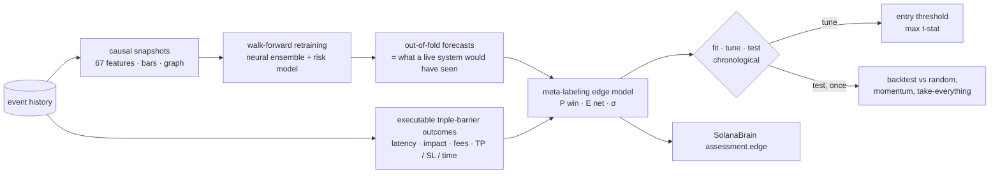

# Edge engine (`nardis_neural.solana.edge`)

Forecasting prices is not the goal. The goal is **setups that make money after latency,
price impact and fees**, found and validated so that the result can be trusted. This
module turns the neural brain into an edge-seeking system and measures whether the edge
is real.



## 1. Executable labels (`barriers.py`)

For a signal at `t`, `triple_barrier` simulates what a position of `size_sol` would really
have done on the actual pool path:

* **entry** at `t + latency` against the pool at that instant, through exact bonding-curve
  or AMM maths, so fees and price impact are included;
* the position is **marked to liquidation value** (selling the whole bag back, fees and
  impact included) at every later pool state. Our own entry's reserve shift is carried
  forward;
* **exit** at the first take-profit, stop-loss or time barrier. The exit order also waits
  `latency` seconds, so in a crash it fills lower, which is exactly where paper edge
  usually dies;
* barriers can be fixed or scaled by recent realised volatility.

Labels include a migration if the token graduates while the position is open.

## 2. Out-of-fold forecasts (`research.walk_forward_oof`)

The neural ensemble and the launch-risk model are retrained **walk-forward**. Each fold
trains only on data that ended before the fold starts, minus an embargo covering both the
label horizons and the maximum holding period plus latency, then predicts that fold. The
edge model never sees an in-sample forecast.

## 3. Meta-labeling edge model (`model.py`)

The inputs are:
* the neural forecasts per horizon: mean, standard deviation, z-score, event
  probabilities, max upside and drawdown, volatility;
* uncertainty: epistemic, aleatoric, OOD, disagreement;
* expert gate weights, P(rug / graduation / dev dump), and all raw on-chain features (53 when the results below were measured, 67 now).

It is a bootstrap ensemble of MLPs with two heads:

* **P(win)**: the executable outcome beats zero. It is isotonic-calibrated on a later
  window;
* **E[net]**: Huber regression on the clipped executable net return.

`edge_score = E[net] − λ·σ_epistemic` is a lower confidence bound, which prefers setups
the model is sure about. `kelly_fraction` is a capped fractional Kelly derived from
P(win) and the empirical win/loss ratio. It is a research sizing hint only.

## 4. Honest evaluation (`research.run_edge_research`, `backtest.py`)

* OOF rows are split chronologically into **fit (50 %) / tune (25 %) / test (25 %)**, with
  gaps of one holding period between them.
* The edge model is fitted on *fit*. The entry threshold that maximises the per-trade
  t-statistic (at least `min_trades` trades) is chosen on *tune*. **Test is scored once.**
* The backtester enforces one open position per token and a maximum number of concurrent
  positions; a position occupies its slot until its barrier exit.
* Statistics: hit rate, mean and median net return, per-trade Sharpe, t-stat, **bootstrap
  95 % CI**, profit factor, cumulative PnL and max drawdown in SOL.
* **Baselines** run under the same constraints and trade budget: random picks
  (mean and 95th percentile over draws), momentum (`ret_60s`), and taking every
  candidate. The verdict asks three questions: is the CI above zero, does it beat the
  random p95, and does it beat momentum?

## 5. Results on the simulator

Two independent 60-launch, 6-hour synthetic markets (seeds 11 and 23), 4 walk-forward
folds, a tiny test-sized network, 1 s latency, TP 25 % / SL 15 % / 180 s holds, 1 SOL per
trade and at most 5 concurrent positions. Numbers are per trade, **net of latency, impact
and fees**, on the untouched test period:

| market | policy | trades | hit rate | mean net | 95 % CI | t-stat | max DD (SOL) |
|---|---|---|---|---|---|---|---|
| A | **edge model** | 20 | 90 % | **+25.8 %** | [+19.2 %, +31.0 %] | **8.26** | 0.18 |
| A | momentum (same budget) | 20 | 80 % | +52.5 % | [+13.8 %, +105.0 %] | 2.17 | 0.37 |
| A | take every candidate | 122 | 48 % | +11.8 % | [+3.7 %, +21.2 %] | 2.54 | 1.11 |
| A | random (same budget) | | | +0.3 % (p95 +6.6 %) | | | |
| B | **edge model** | 25 | 76 % | **+20.1 %** | [+7.1 %, +35.0 %] | 2.84 | 0.74 |
| B | momentum (same budget) | 25 | 72 % | +16.2 % | [+4.9 %, +26.0 %] | 2.86 | 0.68 |
| B | take every candidate | 111 | 48 % | +3.5 % | [−0.9 %, +7.8 %] | 1.50 | 1.68 |
| B | random (same budget) | | | +4.9 % (p95 +9.2 %) | | | |

How to read this:
* The edge is significantly positive after costs and beats random selection in both
  markets. In market A, momentum has a higher mean but a far noisier one (its CI is five
  times wider); the edge model has the best risk-adjusted result. In market B the edge
  model has the higher mean and momentum is roughly equal on t-stat.
* The test periods are short (20–25 trades), so the confidence intervals are wide.
* Model selection was done honestly. Five meta-learners (MLP, ridge, gradient-boosted
  trees, rank blend, stacked LCB) were compared on identical fit/tune/test splits in
  *both* markets before choosing the stacked lower-confidence-bound model. Trees and ridge
  carry most of the ranking power (validation rank-IC ≈ 0.31–0.35 in market A).
* An earlier result (+19 % vs −20 % for take-everything) came from a labelling bug that
  ignored the position's own entry impact. The test suite now pins the exact round-trip
  cost.

Reproduce:

```bash
nardis-neural solana simulate --out sim/hist --tokens 60 --seed 11 --hours 6
nardis-neural solana bootstrap --events sim/hist --workspace ws --config configs/small.yaml
nardis-neural solana edge-research --workspace ws --folds 4
cat ws/edge/REPORT.md
```

**This is a synthetic market.** Its structure (momentum regimes, smart money, rug hype
before dumps) is learnable, so these results show that the machinery finds edge without
leakage. They say nothing about live profitability. Run the same research on real chain
history (`solana backfill` → `bootstrap` → `edge-research`), trust only the test-period
verdict, expect much smaller edges, and re-validate regularly as markets adapt.

## 6. Using it live

```python
brain = SolanaBrain("workspaces/sol")  # edge model is loaded if edge-research was run
for a in brain.assess_active():
    a.edge["edge_score"], a.edge["p_win"], a.edge["expected_net"], a.edge["kelly_fraction"]
    a.edge["above_threshold"]  # 1.0 when the score clears the research threshold
```

The module never places orders. Your trading system decides whether and how to act.
