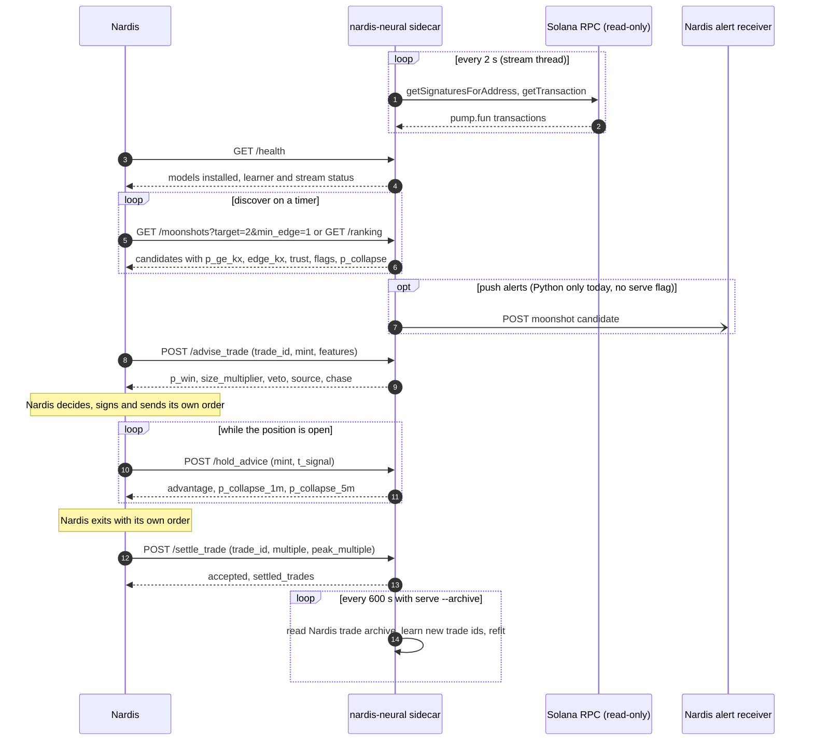

# Merging into Nardis: start here

This is the first document to read when a coding session opens both repositories, this one
(`nardis-neural`) and Nardis, to merge them. It says what this repository is, how it plugs into
Nardis, how to merge and run it, what is proven, what is broken and what is left to do. The
per-endpoint HTTP contract is in [API.md](API.md). Everything else links to the in-depth docs in
this folder.

State as of 29 September 2026, branch `solana-neural-ml-addon`, head `c40edaa`.

## What this repository is, and is not

`nardis-neural` (Python package `nardis_neural`, version 0.1.0) is a machine-learning addon for
Nardis, a Solana memecoin trading bot. It learns from the chain and from Nardis's own trades and
answers questions with numbers:

* how likely a token is to reach 2x, 5x, 10x, 100x or 1000x, and whether chasing each multiple is
  worth it at those odds;
* how likely an open position is to crash (halve) within 1, 5 or 15 minutes, and whether holding
  is worth more than selling now;
* how good one of Nardis's own proposed trades looks, learned from Nardis's settled trades;
* launch risk (rug, graduation, dev dump), manipulation red flags, and recommended stake sizes.

It **never trades**:

* no wallet, key, seed phrase or keypair is read anywhere in the code;
* no signing, no transaction building, no transaction sending, no order routing;
* no output field is a command: tests assert that `NeuralPrediction` and `SolanaAssessment`
  contain none of `action`, `signal`, `buy`, `sell`, `order`, `side`, `size`, `position`;
* its only chain access is read-only JSON-RPC. [rpc.py](../src/nardis_neural/solana/ingest/rpc.py)
  refuses any method outside an allowlist of 11 read methods with a `PermissionError` before
  anything is sent (see [The no-execution guarantee](#the-no-execution-guarantee)).

Nardis keeps every decision and every order. The addon is advice.

The repository has two layers: a generic neural "brain" (`nardis_neural`, no Solana knowledge)
and the Solana layer (`nardis_neural.solana`) built on top of it. Nardis talks to the Solana
layer, normally through its HTTP sidecar.

## The integration in one page

### Recommended shape: a sidecar over HTTP

There are two ways for Nardis to call the addon.

| | HTTP sidecar (`nardis-neural solana serve`) | in-process Python (`SolanaBrain`) |
|---|---|---|
| Nardis language | any | Python 3.12 or newer only |
| per-call cost | JSON over loopback; `advise_trade` 1.3 ms median without the market view, about 20 ms with it (4-core CPU, [INTEGRATION.md](INTEGRATION.md)) | no serialisation; on the tiny test workspace `assess` about 20 ms and `advise_trade(..., with_market=False)` about 0.07 ms |
| dependencies in Nardis's environment | none | PyTorch, NumPy, Polars, scikit-learn, SciPy, Pydantic; `import nardis_neural.solana` took 2.7 s |
| locking | done by `AddonService` (one lock) | Nardis must serialise every call itself |
| upkeep (`resolve`, `maintenance`, `save`, eviction) | done by the stream thread (only with the stream on) | Nardis must schedule it, or reuse `AddonService.stream` |
| crash isolation | separate process | a crash in the addon is a crash in Nardis |

**Recommendation: run the sidecar and call it over HTTP on `127.0.0.1`.** Reasons:

1. It works whatever language Nardis is written in, and needs no change to Nardis's Python
   version.
2. PyTorch (several GB with CUDA) and the addon's pins (`polars>=1.0`, `pydantic>=2.6`,
   `numpy>=1.26`) stay out of Nardis's environment.
3. The lock, the upkeep threads and the archive self-training are already built into
   `AddonService`. In-process, Nardis would have to rebuild them.
4. A crash, a stall or a long retrain in the ML process cannot take Nardis's trading loop down.
   Nardis treats a timeout as "no advice" and keeps trading.
5. The per-call cost (1.3 ms, or about 20 ms with the market view) is small next to chain
   latency.

Use in-process calls only if Nardis is Python 3.12+ and needs the lowest latency. See
[Using it from Python](#using-it-from-python).

### A trade's life



### The five calls Nardis must make

| # | call | when | why |
|---|---|---|---|
| 1 | `GET /health` | at start-up and on a timer | check `ok`, which `models` are installed, stream counters, learner status |
| 2 | `GET /moonshots?target=K&min_edge=E` or `GET /ranking` | on a timer | candidates at entry; polling also feeds continual learning and the forward-test ledger, because `serve` has no assessment timer of its own |
| 3 | `POST /advise_trade` | before **every** trade, with a unique `trade_id` and Nardis's own signals as `features` | scores the proposal and records it as pending; a trade that was never advised cannot be learned |
| 4 | `POST /hold_advice` | while a position is open | sell-now versus hold, and crash odds |
| 5 | `POST /settle_trade` | after **every** close, with `multiple` net of fees and `peak_multiple` when known | this is where learning from Nardis happens |

With `serve --no-stream` (Nardis pushes transactions to `POST /ingest`), add `POST /save` on a
timer and before shutdown. Error handling: 400 is a client bug, 409 is "model not installed", a
closed connection or a timeout is "no advice". Never block trading on the sidecar being up.
Full contract: [API.md](API.md).

## Merging the repositories

The source is branch `solana-neural-ml-addon` of
`https://github.com/paloaltovisitor57-cloud/Machines-learning-at-full-speed` (the `origin`
remote). Its history is 55 commits from a single root commit (`3708a1e`), 167 tracked files, and
`.git` is about 10 MB.

There are three options. They differ in where the code lives and how Nardis calls it, and they
combine: the recommendation uses (a1) for the code and (c) for the runtime.

### (a) One repository, the addon in a subdirectory, history kept

Keep the addon's whole tree together in one subdirectory, for example `nardis-neural/`. Do not
split `src/nardis_neural` away from `docs/`, `tests/`, `examples/`, `configs/`, `pyproject.toml`
and `README.md` (see [Keep the tree together](#keep-the-tree-together)).

**(a1) Move, then merge unrelated histories.** Per-file history survives under the new path
(`git log --follow` works).

```bash
# 1. A throwaway clone of the addon, with everything moved into nardis-neural/
git clone --branch solana-neural-ml-addon \
    https://github.com/paloaltovisitor57-cloud/Machines-learning-at-full-speed nardis-neural-move
cd nardis-neural-move
mkdir nardis-neural
git ls-tree --name-only HEAD | grep -v '^nardis-neural$' | while read -r f; do git mv "$f" nardis-neural/; done
git commit -m "Move nardis-neural into nardis-neural/"

# 2. In the Nardis repository, on a new branch
cd /path/to/nardis
git switch -c merge-nardis-neural
git remote add neural ../nardis-neural-move
git fetch neural
git merge --allow-unrelated-histories neural/solana-neural-ml-addon -m "Merge nardis-neural into nardis-neural/"
git remote remove neural
```

**(a2) `git subtree add`.** One command, but per-file history is hidden under the new path.

```bash
cd /path/to/nardis
git switch -c merge-nardis-neural
git subtree add --prefix=nardis-neural \
    https://github.com/paloaltovisitor57-cloud/Machines-learning-at-full-speed solana-neural-ml-addon
```

Both were tried on a scratch repository. Each brought in all 167 tracked files, including the
14 files of `src/nardis_neural/models` and the 7 of `src/nardis_neural/data`. After (a2),
`git log -- nardis-neural/<file>` shows only the subtree merge commit, because the old commits
use the old paths. After (a1), `git log --follow -- nardis-neural/<file>` shows the original
commits. `git subtree` is a contrib command that some git installs lack. Later updates from the
old repository can be pulled with `git subtree pull --prefix=nardis-neural <url> <branch>` after
(a2) (not tested), or by repeating the move-and-merge after (a1).

### (b) Separate repository, installed as a package

Keep the repositories apart and install the addon into Nardis's Python environment:

```bash
pip install -e /path/to/Machines-learning-at-full-speed          # add ".[dev]" for the test tools
```

Nardis can then `import nardis_neural` and call `SolanaBrain` in-process. The costs:

* Nardis's interpreter must be Python 3.12 or newer (`requires-python = ">=3.12"`).
* Nardis inherits every dependency, including PyTorch, and any version conflict.
* `SolanaBrain` is not thread-safe. Nardis must serialise every call itself, as `AddonService`
  does with a lock.
* Two repositories to keep in step.
* Use an editable install (`-e`). `docgen` finds `docs/` and `README.md` relative to its own file,
  so a regular install into `site-packages` cannot regenerate or check the README.

### (c) Sidecar process only

Install the addon in its own virtual environment and run it as a local HTTP/JSON service. Nardis
calls it over `127.0.0.1` from any language:

```bash
python3.12 -m venv nardis-neural/.venv
nardis-neural/.venv/bin/pip install -e ./nardis-neural
nardis-neural/.venv/bin/nardis-neural solana serve --workspace ws --port 8787 --no-stream
curl -s localhost:8787/health
```

No shared interpreter, no dependency conflicts, and a crash in the ML process cannot take Nardis
down. One more process to supervise. Requests are serialised by one lock, which is fine for one
trading system.

### Trade-offs

| | (a) subdirectory | (b) `pip install -e` | (c) sidecar |
|---|---|---|---|
| one repository, one history | yes | no | independent of layout |
| Nardis must run Python ≥ 3.12 | only with in-process use | yes | no |
| PyTorch and other deps in Nardis's environment | only with in-process use | yes | no |
| Nardis language | any (via the sidecar) | Python | any |
| process isolation | with the sidecar | no | yes |
| per-call overhead | HTTP (sidecar) or none | none | HTTP on loopback |

### Recommendation

Use (a1) for the code and (c) for the runtime:

1. Merge with move-then-merge, so the addon lives in `nardis-neural/` with its full history.
2. Give it its own virtual environment and run `nardis-neural solana serve` next to Nardis.
3. Nardis calls the HTTP API. It never imports `nardis_neural`.

This keeps one repository, keeps `git log --follow` useful, keeps PyTorch and the addon's pins
out of Nardis's environment, and needs no change to Nardis's Python version. If Nardis is Python
3.12+ and in-process calls are needed later, `pip install -e ./nardis-neural` into Nardis's
environment still works from the same subdirectory.

### Merge checklist

1. **Prerequisites.** On the Nardis machine: git, Python 3.12 or newer, and clean working trees in
   both repositories.
2. **Branch.** In Nardis: `git switch -c merge-nardis-neural`.
3. **Merge with history** (option a1): move everything into `nardis-neural/` in a throwaway
   clone, then `git merge --allow-unrelated-histories` into Nardis.
4. **Check the files arrived.** `git ls-files nardis-neural | wc -l` prints 167 plus any files
   added since this document (this document and [API.md](API.md) make 169);
   `git ls-files nardis-neural/src/nardis_neural/models | wc -l` prints 14 and
   `git ls-files nardis-neural/src/nardis_neural/data | wc -l` prints 7.
5. **Check `.gitignore`.** No Nardis rule may hide `nardis-neural/src/nardis_neural/data` or
   `…/models`: `git check-ignore -v nardis-neural/src/nardis_neural/models/new.py` must print
   nothing. An unanchored `models/` in Nardis's root `.gitignore` does hide it (reproduced on a
   scratch merge); files already tracked stay tracked, but new files there would be silently
   ignored.
6. **READMEs.** Leave `nardis-neural/README.md` as generated. Add one line to Nardis's own README
   that links to it.
7. **Environment.** Create the addon's own venv and install it editable with the dev tools:
   ```bash
   python3.12 -m venv nardis-neural/.venv
   nardis-neural/.venv/bin/pip install -e "./nardis-neural[dev]"
   ```
   The addon's own `.gitignore` already ignores `.venv/` inside `nardis-neural/`.
8. **Do not rename** `nardis_neural`, the `nardis-neural` script or the `solana` subcommand. Do not
   move `src/nardis_neural` out of `nardis-neural/`.
9. **Lint and types** (from `nardis-neural/`): `ruff check .`,
   `ruff format --check src tests examples`, `mypy`.
10. **Tests** (from `nardis-neural/`, or `pytest nardis-neural/tests` from the root; never in the
    same run as Nardis's own `tests` package): `pytest -m "not slow"`, then `pytest`.
11. **Docs.** If anything in `docs/` changed, run `python -m nardis_neural.docgen`, commit the
    README, then `python -m nardis_neural.docgen --check` must exit 0. This document and
    [API.md](API.md) are not in the README until they are added to `PARTS` in
    [docgen.py](../src/nardis_neural/docgen.py); adding them is optional and needs a README
    regeneration.
12. **Workspace.** Point the sidecar at an existing workspace, or build one (see the
    [Setup runbook](#setup-runbook)). Keep workspaces out of git (`/workspaces/` is ignored in the
    addon's tree only).
13. **Start the sidecar** bound to loopback:
    ```bash
    nardis-neural/.venv/bin/nardis-neural solana serve --workspace ws --port 8787 --no-stream
    curl -s localhost:8787/health
    ```
    Use `--rpc` or `SOLANA_RPC_URL` and drop `--no-stream` for the live feed. A workspace with no
    research models installed is enough for a smoke test: `/health` then answers `"ok": true`
    with all four `models` flags false (checked on a tiny simulated workspace).
14. **Done when:** tests pass, `docgen --check` passes, and the sidecar's `/health` answers with
    `"ok": true`.

## Install

The package is `nardis-neural` (import name `nardis_neural`, version 0.1.0). It installs one
console script, `nardis-neural`. Every Solana command lives under `nardis-neural solana …`.

| requirement | value | source |
|---|---|---|
| Python | ≥ 3.12 | `requires-python` in [pyproject.toml](../pyproject.toml) |
| runtime dependencies | torch ≥ 2.2, numpy ≥ 1.26, polars ≥ 1.0, pyarrow ≥ 15, scikit-learn ≥ 1.4, scipy ≥ 1.11, pydantic ≥ 2.6, typer ≥ 0.12, pyyaml ≥ 6.0 | [pyproject.toml](../pyproject.toml) |
| `dev` extra | pytest ≥ 8, pytest-timeout ≥ 2.2, hypothesis ≥ 6.100, mypy ≥ 1.10, ruff ≥ 0.5, types-PyYAML | [pyproject.toml](../pyproject.toml) |
| GPU | not needed; CPU, CUDA and Apple MPS all work | [hardware.py](../src/nardis_neural/hardware.py) |

```bash
cd /path/to/nardis-neural
python3.12 -m venv .venv && source .venv/bin/activate
pip install -e ".[dev]"          # runtime + test and lint tools
# pip install -e .               # runtime only, for a production box
```

**CPU-only PyTorch.** `pip` resolves `torch>=2.2` from PyPI. On Linux that is the CUDA build. The
reference venv holds `2.14.0+cu130` and is 5.9 GB, of which `torch` is 1.2 GB and the `nvidia`
CUDA libraries 3.2 GB. The sidecar runs fine on a CPU. A CPU-only machine can install the CPU
wheel from PyTorch's own index first; the exact command is standard PyTorch guidance and was not
tested in this repository.

**Verify the install.**

```bash
nardis-neural --help
nardis-neural hardware                                      # detected device + recommended profile
pytest tests/test_solana_service.py tests/test_docs.py      # sidecar HTTP API, README in sync
pytest -m "not slow"                                        # skips the 4 slow integration tests
pytest                                                      # everything; CUDA / MPS tests skip themselves
ruff check . && ruff format --check src tests examples && mypy
```

* The two test files above pass on a 4-core CPU box (8 tests, about 20 s, of which 13.7 s is the
  service fixture training a tiny workspace).
* `nardis-neural hardware` on a 4-core CPU box prints `"recommended_profile": "cpu-lite"`. Eight
  or more cores give `cpu`; CUDA gives `gpu` (or `gpu-frontier` with ≥ 16 GB VRAM); Apple MPS
  gives `gpu`.
* `ruff format --check .` (without paths) currently fails: it also formats Python blocks inside
  Markdown and reports `README.md`, `docs/INTEGRATION.md` and `docs/STOPPING.md`. Use the paths
  above.

Reference venv versions: Python 3.12.3, torch 2.14.0+cu130, numpy 2.5.3, polars 1.44.2, pyarrow
25.0.1, scikit-learn 1.9.1, scipy 1.18.1, pydantic 2.13.5, typer 0.27.2, pyyaml 6.0.3. The numpy
floor admits 1.x, but only 2.x has been run.

## Setup runbook

The sidecar needs a **workspace**: one directory that holds the neural champion, the market state
and every installed model. This is the order that builds one from real mainnet history and starts
serving it.

| step | command | reads | writes | time | memory |
|---|---|---|---|---|---|
| 0 | `nardis-neural hardware` | the machine | nothing | seconds | – |
| 1 | `export SOLANA_RPC_URL=…` | – | – | – | – |
| 2 | `solana fetch-history` | RPC (read-only) | event directory | 12 h of history ≈ 7–8 h, plus graduate following (unmeasured) | unmeasured |
| 3 | `solana init-config` (optional) | – | a `solana.yaml` | seconds | – |
| 4 | `solana bootstrap` | event directory | new workspace | unmeasured on real data | unmeasured |
| 5 | `solana moonshot-research` | workspace history | `ws/moonshot/` | unmeasured on real data | unmeasured |
| 6 | `solana tape-research` | workspace history | `ws/tape/` | unmeasured | 1.5 h at 10 s snapshots exceeded 15 GB; 60 s fitted |
| 7 | `solana stopping-research` | workspace history | `ws/stopping/` | ≈ 10 min for a 150-token simulated market | unmeasured |
| 8 | `solana runner-research` (optional) | workspace history | `ws/runners/` | unmeasured | unmeasured |
| 9 | `solana meta-train` (optional) | Nardis's trade archive | `ws/meta/` | unmeasured | unmeasured |
| 10 | `solana serve` | workspace, RPC, archive | workspace checkpoints | starts in seconds on a tiny workspace; real-workspace start-up unmeasured | unmeasured |

Measured numbers come from [INTEGRATION.md](INTEGRATION.md) (fetch speed),
[REAL_DATA.md](REAL_DATA.md) §4 (tape memory) and [STOPPING.md](STOPPING.md) §5 (stopping time).

**Run steps 5 to 8 before the first `serve` on a workspace.** When `serve` streams, it switches
the brain to bounded-memory mode and its first autosave writes `ws/stream/market.pkl`. From then
on the workspace loads that compact market state and **no event history**, so every research
command on it fails with `ValueError: no labelled snapshots could be built from this history`
(reproduced). The research commands have no `--events` option. See
[Retraining the research models](#retraining-the-research-models).

### Step 0: check the machine

A CPU is enough. The docs measured inference on a 4-core Xeon at 2.1 GHz: about 49 ms per
observation with the default model and 21 ms with `cpu-lite`, peak RSS about 1 GB (0.8 GB for
`cpu-lite`), including PyTorch ([ARCHITECTURE.md](ARCHITECTURE.md) §9). That is the inference
benchmark, not the whole sidecar. The research steps are the memory peak.

### Step 1: the RPC endpoint

```bash
export SOLANA_RPC_URL=https://your-provider.example/?api-key=…   # read-only; never a wallet key
```

`--rpc` overrides the variable on every command that reads the chain. `fetch-history` needs an
endpoint that serves old slots for the whole window (an archival node or Old Faithful). `serve`
only needs recent data.

### Step 2: fetch history

```bash
nardis-neural solana fetch-history --out data/hist --hours 12
```

| | |
|---|---|
| reads | the RPC endpoint: pump.fun program signatures, then each transaction |
| window | `--hours` (default 12) ending at `--end` (default: 15 minutes ago) |
| writes | `data/hist/window.json` (the fixed window), `data/hist/segments/seg_NNNN/` (one 10-minute segment each, `done` marker when complete), `data/hist/graduates/seg_NNNN/` (1-hour segments following graduated tokens through PumpSwap), and the merged, cleaned history as one Parquet file per event type in `data/hist/` (`launches`, `swaps`, `liquidity`, `migrations`, `transfers`) |
| keeps | only tokens created inside the window on pump.fun with a known creator, SOL-priced ([history.py](../src/nardis_neural/solana/ingest/history.py) `clean_history`) |
| graduates | followed through PumpSwap for `--follow-graduates-hours` (default 6, `0` = off) past the window, capped at 10 minutes before now |
| time | 0.63x real time with 6 workers on a hosted node, so 12 hours of history takes about 7 to 8 hours ([INTEGRATION.md](INTEGRATION.md)); graduate following adds unmeasured time |
| memory | unmeasured; transactions are fetched in batches of 2 000 per segment, and the final merge loads every segment at once |

**Resuming.** Rerun the identical command. Finished segments are skipped. The window is pinned by
`window.json`, so `--hours` and `--end` are ignored on a rerun; use a new `--out` directory for a
new window. Each segment is retried 5 times, 30 seconds apart, over an RPC client that itself
retries 8 times; after that the command exits and a rerun continues. The top-level tables are
written only after every segment and the graduate follow-up are complete.
`EventStore.load(data/hist)`, `bootstrap --events data/hist` and `stream-train --events data/hist`
read only the top-level tables.

### Step 3 (optional): Solana configuration

```bash
nardis-neural solana init-config --out configs/solana.yaml
```

This writes the defaults of `SolanaConfig`. Every threshold, horizon and window lives there. The
setting operators change is `sample_interval_seconds` (default `10.0`). For long windows on a
16 GB machine, set it to `60` before `tape-research`. `bootstrap` copies the config into
`ws/solana.yaml`, and every later command reads that copy, so the value can also be edited there.

### Step 4: bootstrap the workspace

```bash
nardis-neural solana bootstrap --events data/hist --workspace ws --profile auto
```

* Builds leakage-free snapshots from the history, trains the neural ensemble, registers it as
  champion, copies the history to `ws/events/`, fits the risk model into `ws/risk/`, and writes
  `ws/solana.yaml` and the continual-learning files (`registry.json`, `models/`, replay and shadow
  state).
* `--profile` has **no default** on `bootstrap`. Without it the default model is trained.
  `--profile auto` picks `cpu-lite` on fewer than 8 cores and `cpu` on 8 or more. `--epochs` and
  `--device` override the config.
* Bootstrap into an empty directory. Re-running it on an existing workspace keeps the old
  champion but replaces `events/`, `solana.yaml`, `config.yaml` and the risk model (reproduced).

### Steps 5 to 8: install the research models

```bash
nardis-neural solana moonshot-research --workspace ws    # entry (tail) model  → ws/moonshot/
nardis-neural solana tape-research --workspace ws        # crash / collapse    → ws/tape/
nardis-neural solana stopping-research --workspace ws    # exit model          → ws/stopping/
nardis-neural solana runner-research --workspace ws      # optional detector   → ws/runners/
```

Each command trains on the earlier tokens of the workspace history, scores once on the later
tokens (`--test-fraction`, default 0.35), prints a markdown report and installs the model.

| command | key defaults | notes |
|---|---|---|
| `moonshot-research` | `--inputs raw`, `--horizon-hours 6`, `--max-entry-age 600`, `--size 0.5`, `--min-ev 1.0` | The real-data runs in [REAL_DATA.md](REAL_DATA.md) §8–§10 used a 30-minute horizon, because longer horizons leave test labels censored on short windows (§2). Picking the horizon is an operator decision. |
| `tape-research` | `--members 3`, `--epochs 40`, `--d 64`, `--layers 2`, `--max-trades 96` | Memory is the constraint (step 3). |
| `stopping-research` | `--utility log`, `--spacing 30` | `--utility power --gamma 0.5` installs runner mode ([STOPPING.md](STOPPING.md)). |
| `runner-research` | `--horizon-minutes 30` | Optional. The detector feeds a chase target only where it matched or beat the tail model out of sample ([REAL_DATA.md](REAL_DATA.md) §9). |
| `edge-research` | `--folds 4`, `--take-profit 0.25`, `--stop-loss 0.15`, `--max-hold 180` | Optional. Not evaluated on real data. |

### Step 9 (optional): train on Nardis's past trades

```bash
nardis-neural solana meta-train --workspace ws --archive /data/nardis/parquet
nardis-neural solana meta-train --workspace ws --archive /data/nardis/buffer.db --table trades
```

* Reads a Parquet file, a Parquet directory (recursively, so date partitions work) or an SQLite
  `.db` / `.sqlite` / `.sqlite3` opened **read-only** (`mode=ro`).
* Adds only trades whose id it has not seen, then refits once. Rerunning it is safe.
* Writes `ws/meta/`. Skip it if `serve --archive` will be used: the service's first archive scan
  does the same thing. Do not run it while `serve` runs on the same workspace (the service's
  next save overwrites `meta/`).
* The archive loader turns every numeric column into a feature unless `--features` is given, so
  keep exit-time columns out of the feature set. Column names, `--map field=column`, `--features`
  and `--return-percent` are described in [INTEGRATION.md](INTEGRATION.md).

### Step 10: start the sidecar

```bash
nardis-neural solana serve --workspace ws --port 8787 --archive /data/nardis/parquet
curl -s --noproxy '*' http://127.0.0.1:8787/health
```

The service prints `addon listening on http://127.0.0.1:8787 (stream on)`. The HTTP API is
specified in [API.md](API.md).

**Moonshot push alerts are not available from the command line.** The `--alert-url` /
`--alert-target` / `--alert-min-edge` / `--alert-every` flags shown in
[INTEGRATION.md](INTEGRATION.md) are not defined on `serve`; the command exits with
`No such option: --alert-url`. The code exists (`AddonService.alerts`) and is tested, but only
from Python. Until the flags are wired, Nardis polls `GET /moonshots?target=10&min_edge=2`.

## Command map

"Nardis needs it" means: **setup** (once, to build the workspace), **daily** (while running),
**research** (to re-measure or reinstall models), **optional** (convenience or alternatives),
**dev** (testing on the simulator).

| command | purpose | RPC | writes to the workspace | Nardis needs it |
|---|---|---|---|---|
| `init-config` | write the default `SolanaConfig` YAML (default `configs/solana.yaml`) | no | no | optional |
| `simulate` | simulate memecoin launches into an event directory (+ `archetypes.json`) | no | no | dev |
| `build-dataset` | causal replay + hindsight labels → canonical neural dataset (inspection) | no | no | optional |
| `bootstrap` | train the neural ensemble + risk model from history; create the workspace | no | creates it | setup |
| `replay` | stream a saved event directory through a workspace as if live | no | yes (maintenance saves) | dev |
| `assess` | print assessments at the workspace's market time | no | no | optional |
| `decode` | decode a JSONL of `getTransaction` results into events, offline | no | no | optional |
| `backfill` | fetch the latest pump.fun / PumpSwap transactions (`--limit` per program) | yes | no | optional |
| `stream` | live stream into a workspace, assessments to JSONL, no HTTP API | yes | yes | optional (`serve` covers it) |
| `edge-research` | walk-forward triple-barrier edge research; installs `ws/edge/` | no | yes | research |
| `moonshot-research` | P(≥2x … ≥1000x) tail model research; installs `ws/moonshot/` | no | yes | setup, research |
| `stream-train` | learn by streaming history (RPC `--start/--end`, or `--events`) without storing it | yes (RPC mode) | creates or resumes | research |
| `tape-research` | Tape Transformer (tail + collapse); installs `ws/tape/` | no | yes | setup, research |
| `stopping-research` | optimal-stopping exit model; installs `ws/stopping/` | no | yes | setup, research |
| `fetch-history` | resumable fetch of a pump.fun window into an event directory | yes | no | setup |
| `meta-train` | train the trade meta-learner on Nardis's archive | no | `ws/meta/` | setup (or use `serve --archive`) |
| `serve` | the HTTP/JSON sidecar | yes (unless `--no-stream`) | yes (autosave with the stream on) | daily |
| `runner-research` | runner detector P(reach 2x … 1000x); installs `ws/runners/` | no | yes | research |
| `forward-report` | paper-ticket scorecard from `ws/forward/` | no | no | daily (monitoring) |
| `research-suite` | moonshot (and `--tape`) research over several simulated markets | no | no (JSON only with `--out`) | dev |
| `allocate` | recommended stakes for current opportunities (`--equity`, `--peak`) | no | no | optional (same as `POST /allocate`) |

All of these are `nardis-neural solana <command>`. Top-level commands an operator may use on a
Solana workspace (it is also a continual-learning registry root):

| command | purpose |
|---|---|
| `nardis-neural hardware` | detected device and recommended profile |
| `nardis-neural status --workspace ws` | champion, challenger, replay sizes, adaptation / retrain / promotion counters |
| `nardis-neural rollback --workspace ws [--to VERSION]` | restore the previous (or a named) neural champion |
| `nardis-neural benchmark --model ws --data …` | inference latency, throughput and memory on this machine |

The top-level `nardis-neural init-config` (not `solana init-config`) defaults to
`configs/default.yaml`. Run from the addon directory, it overwrites the tracked file that a test
compares with the code defaults.

## Environment and network

### Environment variables

These are all the variables the code reads (a search for `os.environ`, `getenv` and Typer
`envvar` across `src/`).

| variable | read by | effect |
|---|---|---|
| `SOLANA_RPC_URL` | `--rpc` of `backfill`, `stream`, `stream-train`, `fetch-history`, `serve` | default RPC endpoint; `--rpc` wins; `serve --no-stream` does not need it |
| `SSL_CERT_FILE` | [rpc.py](../src/nardis_neural/solana/ingest/rpc.py) | CA bundle for TLS to the RPC endpoint, used only if the file exists; otherwise the system CAs |
| `HTTPS_PROXY` / `https_proxy` | rpc.py, for `https://` endpoints | TLS through the proxy's `CONNECT` tunnel; the certificate is still verified end to end |
| `HTTP_PROXY` / `http_proxy` | rpc.py, for `http://` endpoints | the connection is tunnelled through the proxy |
| `NO_PROXY` / `no_proxy` | rpc.py | comma-separated host names that bypass the proxy; exact match only, no wildcards, suffixes or ports |

Credentials in a proxy URL (`user:pass@`) are not sent, so a proxy that needs authentication
refuses the tunnel.

### Outbound: read-only JSON-RPC only

`SolanaRpc` is the only chain client. It refuses any method outside `READ_ONLY_METHODS` with a
`PermissionError` before anything is sent. The allowlist: `getSignaturesForAddress`,
`getTransaction`, `getSlot`, `getBlockTime`, `getBlock`, `getAccountInfo`, `getMultipleAccounts`,
`getTokenLargestAccounts`, `getTokenSupply`, `getHealth`, `getVersion`.

| method | parameters | used by |
|---|---|---|
| `getSignaturesForAddress` | program (or graduated mint) address, `limit` ≤ 1000, `before` / `until`, `commitment: confirmed` | `fetch-history`, `stream-train`, `serve`, `stream`, `backfill` |
| `getTransaction` | `encoding: jsonParsed`, `maxSupportedTransactionVersion: 1`, `commitment: confirmed` | all of the above |
| `getSlot`, `getBlockTime`, `getBlock` (`transactionDetails: signatures`) | slot search to start listing at the window's end | `fetch-history`, `stream-train` (RPC mode) |
| `getAccountInfo` (`jsonParsed`) | a new mint's mint / freeze authority, once per launch | live decoding: `serve`, `stream`, `backfill`; never in history replays, where today's authorities would leak the future |

The other five allowed methods are not called by the current code.

**Connections and retries.** Each worker thread keeps one HTTP connection alive. A fresh TLS
connection per request capped a hosted node at about 12 requests/s; kept-alive connections
reached about 58/s ([REAL_DATA.md](REAL_DATA.md) §1). HTTP 429, JSON-RPC `-32005`, 5xx and
network errors are retried with exponential backoff (`backoff × 2^(attempt−1)`); other 4xx errors
fail at once.

| caller | retries | first backoff | timeout |
|---|---|---|---|
| `fetch-history` | 8 | 1.0 s | 30 s |
| `serve` | 6 | 1.0 s | 20 s |
| everything else | 4 | 0.5 s | 20 s |

**Throughput.** A hosted node fetched about 58 transactions/s, below pump.fun's peak of about 80
successful transactions/s. On a busy day the live feed lags; when a poll's backlog exceeds 50 000
signatures, the oldest part is skipped ([INTEGRATION.md](INTEGRATION.md)). `--pumpswap` adds
PumpSwap, which the help text calls heavy. If Nardis already receives the chain (for example over
Yellowstone gRPC), it can push transactions to `POST /ingest` instead; read the `--no-stream`
caveats first. Whether such a feed converts losslessly to `getTransaction` `jsonParsed` JSON has
not been checked.

### Inbound: the sidecar port

* `serve` binds `127.0.0.1:8787` by default (`--host`, `--port`). The API has no authentication
  and no TLS. Keep it on loopback, or firewall it.
* If the machine sets `HTTP_PROXY` / `HTTPS_PROXY`, make sure Nardis's HTTP client does not send
  `127.0.0.1` through the proxy (`NO_PROXY=127.0.0.1,localhost`, or `curl --noproxy '*'`).
* The sidecar makes no other outbound calls. The push-alert loop would POST to a URL Nardis
  chooses, but it is not wired to the command line.

### Secrets

The only secret is the RPC URL, which often carries an API key. Keep it out of the repository and
logs. The code never reads a keypair, a seed phrase or a wallet file, and it cannot sign.

## Running it every day

### Start

```bash
nardis-neural solana serve --workspace ws --port 8787 \
    --archive /data/nardis/parquet            # or: --archive /data/nardis/buffer.db --table trades
```

| flag | default | recommendation |
|---|---|---|
| `--host` | `127.0.0.1` | keep it |
| `--port` | `8787` | any free port |
| `--stream / --no-stream` | stream | stream, unless Nardis pushes a full feed to `POST /ingest` (read the `--no-stream` caveats first) |
| `--poll-interval` | `2.0` s | keep |
| `--workers` | `6` | 6 was measured; raise only if the node allows more requests/s |
| `--pumpswap` | off | off (suggestion): on the measured window every peak came at or before graduation ([REAL_DATA.md](REAL_DATA.md) §7) |
| `--archive`, `--table` | none | point at Nardis's trade archive so the trade learner keeps training |
| `--archive-every` | `600` s | keep |
| `--map`, `--features`, `--return-percent` | – | only if the archive's columns need mapping ([INTEGRATION.md](INTEGRATION.md)) |
| `--device` | auto (CUDA, then MPS, then CPU) | leave it, or `cpu` to keep a GPU free |

### What runs inside `serve`

Three loops share one lock, so API calls wait while any of them holds it. The thread table is in
[API.md](API.md#operations).

| loop | cadence | work |
|---|---|---|
| HTTP requests | on demand | each call takes the lock |
| stream thread | every `--poll-interval` | poll the chain, ingest events in chunks of 50 (the lock is released between chunks); every 10 s resolve matured outcomes; every 600 s run maintenance and evict tokens idle for 2 hours; every 300 s save the workspace |
| archive thread | every `--archive-every` | re-read the whole archive, learn trades not yet seen, save `ws/meta/` when something was added |

Maintenance runs neural adaptation, full retraining and promotion when due, the risk-model refit
and the gated tail-model refit, all under the lock. How long a maintenance run or an archive scan
blocks requests on a real workspace has not been measured.

**`--no-stream` caveats.** The stream thread is the only place that resolves outcomes, runs
maintenance, evicts idle tokens, autosaves and switches the brain to bounded-memory mode. With
`--no-stream` none of that happens: pushed transactions are kept in the in-memory event history
without limit, idle tokens are never evicted, outcomes never resolve (so the neural, risk and tail
models and the paper ledger do not learn), and nothing is saved until `POST /save` or Ctrl-C. The
trade meta-learner and the archive thread still work. Until this is fixed (open work item 2),
`--no-stream` suits short sessions, not a feed that runs for weeks.

### How it keeps learning

| model | learns while serving? | trigger |
|---|---|---|
| trade meta-learner (`/advise_trade`) | yes | every `POST /settle_trade` and every archive scan; base rates until 50 trades have settled, then a refit every 25, deployed only if it beats the base rate on the newest 20 % |
| neural ensemble | yes, with the stream on | continual-learning loop at maintenance (adapt, retrain, shadow, promote) |
| risk model | yes, with the stream on | at maintenance, once 200 new labelled samples exist and every risk label has at least 3 positives |
| moonshot tail model | yes, with the stream on, only if installed with `--inputs raw` (the default) | every 6 hours of market time, with at least 40 tokens, trained on the older 80 % and kept only if it matches the installed model's NLL (within 0.02) on the newest 20 % |
| tape, stopping, runner, edge models | **no** | only by re-running their research command |

The neural, risk and tail-model learning is fed by **assessments**. `serve` does not assess on a
timer: it assesses when Nardis calls `/ranking`, `/moonshots`, `/assess`, `/allocate`,
`/advise_trade` (with the market view) or `/hold_advice`. The paper-ticket ledger behind
`forward-report` is fed the same way. If Nardis rarely calls those endpoints, these models rarely
learn.

**Archive self-training.** Each scan reads the full archive, skips trade ids already known,
replays the new settled trades in exit-time order and refits once at the end. Open trades (no
result yet) are skipped until they close. A half-written file makes the scan fail; the error is
counted and the next scan retries. A file that stays corrupt blocks every scan until it is
removed (reproduced with `meta-train`), so watch `archive.errors` and `archive.last_error`.

**Cold start.** With no settled trades, `advise_trade` answers `"source": "prior"`,
`"evidence": 0` and 0.5 for every probability, which makes `edge_100x` and `edge_1000x` very
large (about 1665 at 1000x). `chase_target` stays 0 until real hits exist. Ignore the edges while
`source` is `"prior"`.

### Monitoring

`GET /health` ([API.md](API.md#get-health)):

| field | watch for |
|---|---|
| `ok` | no answer at all |
| `market_time` | wall clock minus `market_time` growing: the feed is lagging or stalled |
| `tokens` | steady growth over days (expected with `--no-stream`) |
| `models.moonshot / tape / stopping / edge` | `false` for a model Nardis relies on (`/ranking` and `/moonshots` answer 409 without the tail model) |
| `learner.pending_trades` | proposals that never settle (they never expire) |
| `stream.polls`, `stream.errors` | `polls` not increasing; `errors` rising |
| `archive.errors`, `archive.last_error` | rising errors |
| `alerts` | empty until alerts are wired |

Not exposed: the runner detector under `models`, and the count of polls whose backlog was skipped
(`ChainStreamer.gaps`).

Also useful, read-only, while the service runs (they read the last saved state):

```bash
nardis-neural solana forward-report --workspace ws   # paper tickets, PnL, hit rates, P(≥10x) predicted vs observed
nardis-neural status --workspace ws                  # neural champion / challenger, counters
```

### Saving and stopping

* With the stream on, the service saves every 5 minutes. With `--no-stream` it **never saves on a
  timer**; call `POST /save`.
* Ctrl-C (SIGINT) stops the threads and saves (reproduced). **SIGTERM does not save**: the process
  exits at once and everything since the last save is lost (reproduced). `docker stop` and
  `systemctl stop` send SIGTERM by default. Send SIGINT, or call `POST /save` first.
* The market checkpoint `ws/stream/market.pkl` is written atomically (temp file, then rename). The
  other files (`meta/`, `forward/`, `moonshot/online.npz`, `solana_state.json`,
  `risk_samples.npz`, `registry.json`, `events/`) are plain writes.
* The chain cursor (`stream_cursor.json`) is saved at every poll, independently of the brain
  checkpoint. After a crash or SIGTERM, activity between the last save and the stop is not
  fetched again.

Example systemd unit (not tested):

```ini
[Unit]
Description=nardis-neural sidecar (advice only)
After=network-online.target

[Service]
WorkingDirectory=/opt/nardis-neural
EnvironmentFile=/etc/nardis-neural.env        # SOLANA_RPC_URL=…
ExecStart=/opt/nardis-neural/.venv/bin/nardis-neural solana serve --workspace /var/lib/nardis-neural/ws --archive /data/nardis/parquet
KillSignal=SIGINT                              # SIGINT triggers the final save
TimeoutStopSec=60
Restart=on-failure
RestartSec=10

[Install]
WantedBy=multi-user.target
```

With Docker, the equivalent is `--stop-signal SIGINT` (Compose: `stop_signal: SIGINT`) and a
`stop_grace_period` long enough for the save. Also not tested.

### Backups

Suggested practice, not tested: back up the whole workspace directory once a day and before every
research re-run or upgrade. The pieces that cannot be rebuilt from chain history are `ws/meta/`
(what was learned from Nardis's trades, unless the archive is kept) and `ws/forward/` (the
paper-ticket record). Take the copy after `POST /save`, or with the service stopped.

```bash
curl -s --noproxy '*' -X POST http://127.0.0.1:8787/save
tar -czf ws-$(date +%F).tgz ws
```

### Do not share a workspace between processes

`serve` loads every model once, at start-up, and overwrites `meta/`, `forward/` and the market
checkpoint on every save. While `serve` runs on `ws`, a research command on `ws` installs a model
that the running service will not use (and with streaming on, it has no history to train on), and
`meta-train` on `ws` is overwritten by the service's next save. Restart `serve` after installing
any model. Never open one workspace from two processes.

### Retraining the research models

The tape, stopping, runner and edge models never refit while serving, and a streamed workspace has
no event history. A way to refresh them (suggested, not tested end to end):

1. Fetch a new window into a new directory: `solana fetch-history --out data/hist-2 --hours 12`.
2. Build a new workspace: `solana bootstrap --events data/hist-2 --workspace ws-2 --profile auto`.
3. Run the research commands on `ws-2` and compare their reports with the previous ones.
4. Stop `serve` with SIGINT and start it on `ws-2` with the same `--archive`. The first archive
   scan relearns every trade in the archive. Trades only ever sent through `/settle_trade` and not
   in the archive are lost unless `ws/meta/` is copied over.
5. Keep `ws` as the rollback.

In Python, the research methods take `history=EventStore.load(...)`, which also works on a
streamed workspace. How often to retrain is not established. The docs call for windows of at
least 8 to 12 hours before entry labels resolve, and for days of history before a 10x edge can be
judged ([REAL_DATA.md](REAL_DATA.md) §2, §8). `stream-train` is the alternative for long
histories ([SOLANA.md](SOLANA.md) §11); its result is also a streaming workspace.

### Upgrades

The install is editable, so `git pull` changes the running code on the next start. Suggested
order, not tested: back up the workspace, pull, run `pip install -e ".[dev]"` and
`pytest tests/test_solana_service.py`, then restart `serve`. `ws/stream/market.pkl` is a pickle of
the market object, so a change to that class can stop an old checkpoint from loading (see
[Persisted formats](#persisted-formats-and-backward-compatibility)). Feature lists change between
versions (73 → 76 features in [REAL_DATA.md](REAL_DATA.md) §10); models trained on old features
then need their research re-run on a new workspace.

### Failure recovery

| failure | what happens | what to do |
|---|---|---|
| `fetch-history` interrupted or out of retries | finished segments stay (`done` markers) | rerun the identical command |
| RPC down or rate-limiting while serving | requests retried (6 times, backoff from 1 s); a failed poll counts in `stream.errors` and the loop continues | check `stream.errors` and `market_time` lag |
| a poll fails after its retries | that poll's transactions are skipped: the in-memory cursor had already moved past them | nothing; it shows as one more `stream.errors` |
| service killed (crash, SIGKILL, SIGTERM) | on restart the market loads from the last `market.pkl` (at most 5 minutes old with the stream on); activity between that checkpoint and the kill is not replayed | restart; stop with SIGINT to avoid the gap |
| restart after a long outage | the streamer pages back to its cursor, up to 50 000 signatures; beyond that the oldest backlog is skipped | nothing |
| half-written archive file | scan fails, counted, retried next scan | nothing |
| permanently corrupt archive file | every scan fails | remove or fix the file; check `archive.last_error` |
| a research run installs a worse model | the new model replaces the old one in the workspace | restore that model's directory from the backup, restart |
| the neural champion regresses | – | `nardis-neural rollback --workspace ws` (optionally `--to VERSION`), then restart |
| `market.pkl` cannot be loaded (for example after an upgrade) | `serve` fails at start | restore the backup, or build a new workspace |
| `maintenance()` raises `ValueError: no experiences old enough …` | the serve stream loop counts it and skips the rest of that maintenance, including its save; `solana stream` and `stream-train` crash | the next periodic save still runs under `serve`; see known defects |

## Using it from Python

If Nardis is Python 3.12+, it can import the addon and drive one `SolanaBrain` directly. The HTTP
sidecar wraps the same object, so every number also comes back over HTTP. This path is not the
recommendation (see [The integration in one page](#the-integration-in-one-page)).

### A minimal loop

Run as written against a tiny synthetic workspace (8 simulated launches, one-member tiny model,
one epoch) and a directory of later simulated events.

```python
import threading

from nardis_neural.solana import EventStore, SolanaBrain
from nardis_neural.solana.metalabel import TradeOutcome, TradeProposal

brain = SolanaBrain("ws", device="cpu")  # an existing workspace
lock = threading.Lock()  # the brain is not thread-safe: every call goes through one lock

# Live loop. Events must arrive in time order; here they come from a saved event directory.
next_round = brain.market.now + 10.0
for event in EventStore.load("events").sorted():
    with lock:
        try:
            brain.ingest(event)
        except (KeyError, ValueError):  # unknown token, repeated launch, out-of-order event
            continue
        if brain.market.now >= next_round:  # every 10 s of market time
            next_round = brain.market.now + 10.0
            reports = brain.assess_active()  # batched assessment of every active token
            brain.resolve()  # label matured assessments, feed continual learning

with lock:
    mint = next(iter(brain.market.tokens))
    a = brain.assess(mint)
    print(a.risk, a.round_trip_cost, a.prob_net_positive, a.flags)

    # Around one of the trading system's own trades
    advice = brain.advise_trade(TradeProposal("t-1", mint, brain.market.now, {"nardis_score": 0.82}))
    print(advice.p_win, advice.size_multiplier, advice.veto, advice.source, advice.evidence)
    brain.settle_trade(TradeOutcome("t-1", brain.market.now + 60.0, multiple=1.8, peak_multiple=3.1))

    print(brain.hold_advice(mint, brain.market.now - 60.0))  # {} until an exit model is installed

    # Upkeep, off the hot path (seconds to minutes); it ends with save()
    try:
        print(brain.maintenance())
    except ValueError as exc:  # see the caveats below
        print("maintenance skipped:", exc)
        brain.save()
```

On the tiny workspace this printed a risk dict, a round-trip cost of 0.0199, per-horizon
`prob_net_positive`, one red flag, then `0.5 1.0 False prior 0` for the advice, `{}` for
`hold_advice`, and a maintenance summary with `'adapted': 'failed'` (the fine-tuned candidate
failed its offline validation gate, the expected outcome on a toy model). The numbers show call
shapes, not quality.

Clock rule: `brain.market.now` is the time of the latest ingested event (Unix seconds), not the
wall clock.

### Constructor and bootstrap

| call | returns | notes |
|---|---|---|
| `SolanaBrain(workspace, device=None)` | `SolanaBrain` | Loads `solana.yaml`, the neural champion, the market state (from `stream/market.pkl` if present, else by replaying `events/`), and every installed model. Raises if `solana.yaml`, `config.yaml`, `registry.json` or the champion's model directory is missing. `device` accepts `"cpu"`, `"cuda"` or a `torch.device`; every saved model is loaded with `map_location="cpu"` first. |
| `SolanaBrain.bootstrap(workspace, history, cfg=None, neural_cfg=None, device=None, log=None)` | `SolanaBrain` | Trains the neural ensemble and the risk model from an `EventStore` and writes a new workspace. `cfg` is a `SolanaConfig`; `neural_cfg` is the base `NeuralConfig`, whose input dimensions are overwritten to match the Solana features. Bootstrap into an empty directory. |

### Methods Nardis uses

| method | returns | what it does |
|---|---|---|
| `ingest(event)` / `ingest_many(events)` | `None` | Feeds events into the market (and the event history unless streaming). Raises `ValueError` for a repeated or evicted launch or an event older than the token's last event, `KeyError` for an event of an unknown token. |
| `assess(mint)` | `SolanaAssessment` | One token at the current market time. `KeyError` if the mint is unknown or evicted. |
| `assess_many(mints)` | `list[SolanaAssessment]` | One batched forward pass for several tokens. |
| `assess_active(max_idle_seconds=120.0, min_age_seconds=None)` | `list[SolanaAssessment]` | Every token that traded within `max_idle_seconds` and is at least `min_age_seconds` old (default `cfg.min_token_age_seconds`, 3 s). |
| `moonshot_ranking(max_idle_seconds=120.0, include_vetoed=False)` | `list[SolanaAssessment]` | Active tokens inside the entry window (20 s to 600 s by default), best `chase_score` first. `RuntimeError` without a tail model. |
| `allocate(equity_sol, open_stakes=None, peak_equity_sol=None, cfg=None, max_idle_seconds=120.0)` | `list[Allocation]` | Recommended stakes (`mint`, `stake_sol`, `fraction`, `reason`). Needs a tail model. See [CAPITAL.md](CAPITAL.md). |
| `hold_advice(mint, t_signal)` | `dict[str, float]` | `liquidation_multiple`, `sell_now_utility`, `continuation_utility`, `advantage`. `{}` without a fitted exit model. See [STOPPING.md](STOPPING.md). |
| `trade_context(mint)` | `dict[str, float]` | The addon's view of a token, flattened to `moonshot_*`, `tape_*`, `edge_*`, `risk_*` and four `feature_*` keys. `{}` for an unknown mint. |
| `advise_trade(proposal, with_market=True)` | `TradeAdvice` | Advice on a Nardis trade; with `with_market`, the `trade_context` values are joined as `addon_*` features (a full `assess` of the mint, about 20 ms on the tiny workspace). |
| `settle_trade(outcome)` | `bool` | Reports a closed trade. `False` if the `trade_id` was never proposed or was already settled. Refits when due. |
| `resolve()` | `int` | Labels every assessment whose longest horizon (and risk horizon) has elapsed, adds it to the replay buffer and risk samples, settles forward-ledger tickets. Returns the count labelled. |
| `maintenance(risk_refit_min_new=200)` | `dict` | Neural adapt, full retrain and promotion (all gated), risk refit, online tail refit, then `save()`. Keys: `moonshot_online`, `adapted`, `full_retrain`, `promoted`, `risk_refit`, `champion`, `pending`, `forward`. Seconds to minutes. |
| `enable_streaming(evict_idle_seconds=7200.0)` | `None` | Bounded-memory mode: no event history is kept, `save()` writes `stream/market.pkl` instead of `events/`. |
| `evict()` | `list[str]` | In streaming mode: labels finished moonshot rows, then forgets tokens idle for `evict_idle_seconds`. |
| `refit_moonshot_online(every_seconds=21600.0, min_tokens=40, members=3, epochs=60, tolerance=0.02)` | `dict` or `None` | Retrains a raw-input tail model from the online buffer behind a hold-out gate. Called by `maintenance`. |
| `save()` | `None` | Checkpoints the workspace. |

Research methods train on `history` (default `brain.history`), write a model directory, install
the model in memory and return the research report as a dict. They are what the CLI research
commands run. They never call `save()`; the rest of the brain state is written at the next
`save()` or `maintenance()`.

| method | writes | CLI equivalent |
|---|---|---|
| `fit_moonshot(spec=None, inputs="raw", n_folds=4, test_fraction=0.35, min_expected_multiple=1.0, history=None, archetypes=None, log=None)` | `moonshot/` | `moonshot-research` |
| `fit_tape(spec=None, tape=None, test_fraction=0.35, members=3, epochs=40, history=None, archetypes=None, log=None, d=64, layers=2)` | `tape/` | `tape-research` |
| `fit_stopping(spec=None, test_fraction=0.35, spacing=30.0, history=None, archetypes=None, log=None, utility="log", gamma=0.5)` | `stopping/` | `stopping-research` |
| `fit_runners(spec=None, test_fraction=0.35, history=None, log=None)` | `runners/` | `runner-research` |
| `fit_edge(spec=None, n_folds=4, max_positions=5, history=None, log=None)` | `edge/` | `edge-research` |

`spec` defaults to the installed tail model's `MoonshotSpec`, else `MoonshotSpec()` (6-hour
horizon). `runner-research` on the CLI passes a 30-minute horizon, so `fit_runners()` with no
arguments differs from the CLI default. On the 8-token tiny workspace, `fit_moonshot`,
`fit_stopping`, `fit_tape` (1 member, 2 epochs) and `fit_edge` (2 folds) each ran in 7 to 13 s;
`fit_runners` raised `ValueError: not enough tokens for a train / test split` (its test uses 40
tokens).

### Types

`SolanaAssessment` is a Pydantic model (`model_dump()`, `model_dump_json()`) with the fields of
[/assess](API.md#get-assess) plus `features` (the named current-state features,
[SOLANA.md](SOLANA.md) §3). From `nardis_neural.solana.metalabel`:

| type | fields |
|---|---|
| `TradeProposal` | `trade_id: str`, `mint: str`, `t: float`, `features: dict[str, float]` (any names; keep them stable) |
| `TradeOutcome` | `trade_id: str`, `t_exit: float`, `multiple: float` (SOL back per SOL staked, fees included), `peak_multiple: float \| None` |
| `TradeAdvice` | `trade_id`, `p_win`, `p_10x`, `p_100x`, `expected_multiple`, `size_multiplier`, `veto`, `reason`, `evidence`, `source`, `chase` (see [API.md](API.md#post-advise_trade)) |

`nardis_neural.solana.archive.train_from_archive(brain.meta, path, mapping, table)` replays
Nardis's trade archive into the same learner as `meta-train`.

### Thread safety

`SolanaBrain` is not thread-safe. `ingest` mutates the market; `assess*` appends to the pending
list, the moonshot tracker, the forward ledger and the learner's shadow records; `resolve`,
`maintenance` and `save` rewrite the same state. Put every call behind one lock. `maintenance()`
holds that lock for as long as adaptation or retraining takes (the tiny config's adaptation
report recorded 9.8 s). Do not open the same workspace from two processes.

### Reusing `AddonService` in-process

`nardis_neural.solana.service.AddonService` wraps a brain with the lock, the JSON contract and the
background threads. It works without HTTP:

```python
from nardis_neural.solana import SolanaBrain
from nardis_neural.solana.service import AddonService

service = AddonService(SolanaBrain("ws", device="cpu"))
status, body = service.handle("GET", f"/assess?mint={mint}", {})   # (200, {...})
status, body = service.handle("POST", "/advise_trade", {"trade_id": "x1", "mint": mint, "features": {"s": 1.0}})
service.stream(my_feed)            # my_feed.poll() -> list of events, in time order
service.alerts("in-process", target=10.0, min_edge=2.0, post=lambda url, body: queue.put(body))
service.stop()                     # stops the threads and saves
```

* `handle(method, path, payload)` returns `(http_status, body)` with the same routes and errors
  as the HTTP server.
* `stream(streamer, poll_interval=2.0, resolve_every=10.0, maintenance_every=600.0,
  save_every=300.0, chunk=50, bounded_memory=True)` accepts any object with a `poll()` method that
  returns events. It is the easiest way for a Python Nardis with its own decoded feed to get the
  full upkeep schedule, all on the wall clock. Exceptions inside the loop are counted in
  `service.stream_stats["errors"]` and never stop it.
* `alerts(...)` with `post` set to a callable sends candidates to that callable (verified: 10
  scans, 0 errors).
* `train_on_archive(path, mapping=None, table=None, every=600.0)` keeps the meta-learner training
  on Nardis's trade archive.

The generic neural API (`NeuralEngine`, `ContinualLearner`, `NeuralObservation`,
`NeuralOutcome`; [INTEGRATION.md](INTEGRATION.md) sections 1 to 6 and
[nardis_integration.py](../examples/nardis_integration.py)) is for feeding the neural core with
features Nardis computes itself. `SolanaBrain` builds its own observations, so Nardis does not
need it.

### Caveats

* **`maintenance()` can raise `ValueError`.** When adaptation is due but every buffered
  experience is within the embargo (the longest horizon, 300 s by default) of the newest 20 %,
  `ContinualLearner.adapt` raises "no experiences old enough to train on without overlapping
  validation". Reproduced with the adapt threshold lowered to 30 samples; with the default of 500
  it needs a busy start. Catch it and call `save()`, because the `save()` at the end of
  `maintenance()` is skipped.
* **Pending assessments are not saved**, only their count. Assessments not yet resolved at
  shutdown are never labelled.
* **Streamed workspaces have no event history.** Pass `history=EventStore.load(...)` to the
  research methods explicitly.
* **Non-streaming mode grows without bound.** Use `enable_streaming()` for anything that runs for
  more than a few hours.

## The workspace on disk

A workspace is one directory that holds everything the addon knows. `SolanaBrain(ws)`, every
`--workspace` command and the sidecar read and write the same layout.

```text
ws/
  solana.yaml                     Solana configuration
  config.yaml                     neural learner configuration
  registry.json                   model lifecycle state and audit log (relative model paths)
  models/m-<timestamp>-<id>/      the champion checkpoint (immutable)
    manifest.json  config.yaml  normalizer.json  calibration.json  ood.json  regimes.json
    members/member_0.pt
  models/cand-*/ models/full-*/   candidates from adaptation and full retraining
  replay/                         experience replay buffer
  shadow/records.jsonl            challenger shadow predictions
  state.json                      learner counters
  reports/                        adapt-*.json, full_retrain-*.json, promotion-*.json/.md
  events/                         event history: launches / swaps / ... .parquet (non-streaming)
  stream/market.pkl               market checkpoint, only in streaming mode (replaces events/ as the source)
  stream_cursor.json              RPC cursor, only when serve / stream polled the chain
  solana_state.json               market clock and counters
  risk/                           risk model: members.pt  scaler.npz  risk.json
  risk_samples.npz                resolved risk training rows
  moonshot/                       tail.json tail.pt tail_scaler.npz research.json REPORT.md online.npz
  tape/                           tape.json tape.pt tape_scaler.npz research.json REPORT.md
  stopping/                       stopping.json continuation.npz REPORT.md
  edge/                           edge.json members.pt scaler.npz trees.npz research.json REPORT.md
  runners/                        runners.json runner_<k>x.npz REPORT.md
  forward/                        ledger.json summary.json
  meta/                           meta.json level_<k>.npz value.npz
```

`runner_<k>x.npz` and `level_<k>.npz` exist only for the targets or levels that were trained and
deployed. `value.npz` exists only when the meta-learner's value model beat its base rate.

"If missing" was tested by deleting each entry from a complete tiny workspace, then loading,
assessing, calling `hold_advice` and saving. Sizes are from the tiny synthetic workspace (8
launches, one-member tiny model); production sizes will be larger.

| path | written by | if missing | tiny size | notes |
|---|---|---|---|---|
| `solana.yaml` | `bootstrap` | load fails (`FileNotFoundError`) | 1 KB | edit before research to change e.g. `sample_interval_seconds` |
| `config.yaml` | `bootstrap` | load fails (`FileNotFoundError`) | 5 KB | neural learner, replay and promotion settings |
| `registry.json` | learner | load fails (`RuntimeError: workspace has no champion`) | 9 KB, 28 KB after two candidates | |
| `models/<version>/` | learner | champion dir missing: load fails | 0.36 MB per one-member tiny model | failed candidates stay until the next promotion prunes them; up to 5 former champions are kept |
| `replay/` | learner `save()` | empty buffer | 3.8 MB for 359 experiences | pools capped at 5 000 recent, 20 000 historical, 5 000 rare |
| `shadow/records.jsonl` | learner `save()` | graceful | 0 bytes without a challenger | |
| `state.json` | learner `save()` | counters reset | 0.2 KB | |
| `reports/` | learner | graceful | under 1 KB per report | never pruned |
| `events/` | `bootstrap`; `save()` when not streaming | empty market (0 tokens, clock 0) | 0.97 MB for 22 267 events | rewritten in full at every non-streaming `save()` |
| `stream/market.pkl` | `save()` in streaming mode (atomic rename) | falls back to `events/` and non-streaming mode | 383 KB with 4 tokens and 168 wallets | a Python pickle: load only your own, same package version |
| `solana_state.json` | `save()` | defaults | 0.2 KB | contains `-Infinity` before the first online tail refit |
| `risk/` | `bootstrap`, maintenance refit | `risk` empty, no rug flag, guard runs without P(rug) | 0.13 MB | |
| `risk_samples.npz` | `save()` | refit starts from zero | 149 KB | rolling window of 50 000 rows |
| `moonshot/` model files | `fit_moonshot`, `refit_moonshot_online` | `moonshot` empty, ranking and allocate raise, no forward tickets | 0.22 MB | `research.json` and `REPORT.md` are not read by the brain |
| `moonshot/online.npz` | `save()` | empty online buffer | 27 KB | rolling window of 200 000 rows |
| `tape/` | `fit_tape` | `tape` empty; without `research.json` no exit alarm | 0.32 MB (d = 16); an untrained default model saves a 26.4 MB `tape.pt` | wallet embeddings keyed by a stable hash of the address |
| `stopping/` | `fit_stopping` | `hold_advice` returns `{}` | 0.17 MB | |
| `edge/` | `fit_edge` | `edge` empty | 0.29 MB | if `edge.json` exists, `research.json` is required, else the load fails |
| `runners/` | `fit_runners` | no `runner_p_*` keys | not measured | |
| `forward/` | `save()` | empty ledger | under 1 KB with no tickets | tickets open only with a tail model; closed tickets are never pruned |
| `meta/` | `save()`, `meta-train`, archive thread | fresh meta-learner (cold start) | 0.8 KB after one trade | holds every settled trade's features and all pending proposals |
| `stream_cursor.json` | `ChainStreamer` at every poll | next poll starts from the latest 1 000 signatures per program | tiny | not used by the brain |

**Copying a workspace.** Stop the process first (only `market.pkl` is written atomically). The
directory is relocatable: model paths in `registry.json` are relative and no absolute path was
found in any tested file. Weights load with `map_location="cpu"`, so a GPU-trained workspace
should load on a CPU (not tested). Install the same package version on both machines. Never load
a workspace from an untrusted source: `stream/market.pkl` is unpickled, and unpickling runs code.

**Event directories.** One Parquet table per event type, written by `EventStore.save` only when
it has rows. Columns are the dataclass fields in [events.py](../src/nardis_neural/solana/events.py).
Times are Unix seconds (float), SOL amounts in SOL, token amounts in whole tokens; `slot` is -1
when unknown.

| file | class | columns |
|---|---|---|
| `launches.parquet` | `TokenLaunch` | `mint`, `t`, `creator`, `venue` (`"pump_fun"`), `supply` (1 000 000 000), `sol_reserve` (30.0), `token_reserve` (1 073 000 000), `mint_authority_revoked` (true), `freeze_authority_revoked` (true), `lp_burned_fraction` (0.0), `slot` (-1), `name`, `symbol` |
| `swaps.parquet` | `Swap` | `mint`, `t`, `wallet`, `is_buy`, `sol_amount`, `token_amount`, `sol_reserve`, `token_reserve` (pricing reserves after the swap), `priority_fee`, `jito_tip`, `slot` |
| `liquidity.parquet` | `LiquidityChange` | `mint`, `t`, `wallet`, `sol_delta`, `token_delta`, `sol_reserve`, `token_reserve`, `slot` |
| `migrations.parquet` | `Migration` | `mint`, `t`, `venue`, `sol_reserve`, `token_reserve`, `slot` |
| `transfers.parquet` | `Transfer` | `t`, `source`, `dest`, `sol_amount`, `slot` |

`venue` is one of `pump_fun`, `pumpswap`, `raydium`, `orca`, `meteora`. `EventStore.sorted()`
orders by time; at equal times launches come first, then transfers, migrations, liquidity changes
and swaps. A token's launch must be ingested before its other events. To build events from
Nardis's own feed in Python, construct these frozen dataclasses (exported from
`nardis_neural.solana`) and call `brain.ingest`, or decode raw `getTransaction` JSON with
`nardis_neural.solana.ingest.decoder.TransactionDecoder`.

## Models and signals

The addon runs several models side by side. Each answers a different question. None of them
trades. A model that has not been trained leaves its block empty (`{}`) and the rest keep
working. "Real" means measured on mainnet pump.fun history ([REAL_DATA.md](REAL_DATA.md));
"simulator" means measured only on the synthetic launch simulator, which is known to be generous.
Numbers are in [Evidence](#evidence).

| model | what it predicts | output fields | trained by | evidence |
|---|---|---|---|---|
| Tail model ([tail.py](../src/nardis_neural/solana/moonshot/tail.py)) | P(peak multiple ≥ 2x … 1000x) of a 0.5 SOL ticket bought now, after latency, impact and fees | `moonshot.p_ge_{k}x`, `median_multiple`, `expected_multiple`, `lottery_kelly`, `tail_index`, `epistemic`, … | `moonshot-research`; online refit | real, ranking only |
| Manipulation guard ([guard.py](../src/nardis_neural/solana/moonshot/guard.py)) | how far to trust the tail model, and hard vetoes | `moonshot.trust`, `vetoed`, `guard.*`, `moonshot veto: …` flags | nothing: hand-set monotone rules (`GuardConfig`) | not measured; can only lower optimism |
| Chase profile ([chase.py](../src/nardis_neural/solana/chase.py)) | whether chasing each fixed multiple is +EV | `edge_{k}x`, `chase_target`, `chase_edge`, `tail_ev`, `crazy_shot`; `/advise_trade` `chase` | nothing: arithmetic | as good as its inputs |
| Runner detector ([runners.py](../src/nardis_neural/solana/runners.py)) | P(reach k), one boosted classifier per target | `moonshot.runner_p_{k}x`; averaged into `edge_{k}x` only for its `blend_targets` | `runner-research` | real; below the tail model at 2x and 10x |
| Tape Transformer, tail head ([tape/model.py](../src/nardis_neural/solana/tape/model.py)) | P(peak ≥ k) from the last 96 trades and wallet identities | `tape.p_ge_{k}x`, `expected_multiple`, … | `tape-research` | simulator only; averaged into `chase_score` when installed |
| Tape Transformer, collapse head | P(value halves) within 1 min, 5 min, 15 min, 1 h | `tape.p_collapse_*`, candidate and `/hold_advice` `p_collapse_*` | `tape-research` | **real, strong** |
| Learned exit alarm | a (window, threshold) on the collapse probability | not in the API; `ws/tape/research.json` (`exit_policy.tune.chosen`), used by the forward ledger | `tape-research` | not a reliable edge |
| Optimal-stopping exit ([stopping.py](../src/nardis_neural/solana/stopping.py)) | continuation value of holding versus selling now | `/hold_advice` utilities | `stopping-research` | **real** (log utility); runner mode simulator only |
| Launch-risk model ([risk.py](../src/nardis_neural/solana/risk.py)) | P(rug), P(graduation), P(dev dump) within 300 s | `risk.*`, `risk_uncertainty.*` | `bootstrap`; maintenance refit | simulator only; feeds the guard |
| Neural ensemble | per-horizon return forecasts, event probabilities, uncertainty, OOD | `prediction.*`, `expected_net_return`, `prob_net_positive` | `bootstrap`; continual learning | simulator only |
| Edge engine ([edge/model.py](../src/nardis_neural/solana/edge/model.py)) | executable round-trip win probability and net return (TP / SL / time barriers) | `edge.*` | `edge-research` | simulator only |
| Meta-learner ([metalabel.py](../src/nardis_neural/solana/metalabel.py)) | how good Nardis's own proposal is, from Nardis's settled trades | `/advise_trade` | `/settle_trade`, `meta-train`, `serve --archive` | no Nardis trades yet |
| Capital allocator ([allocator.py](../src/nardis_neural/solana/capital/allocator.py)) | recommended stake per candidate | `/allocate` | nothing: formula + limits, scaled by the forward ledger's track record | real, one bankroll test |
| Criticality features ([hawkes.py](../src/nardis_neural/solana/hawkes.py)) | Hawkes branching ratio of buys and sells (herding) | inputs only (`buy_branching_ratio`, `endogenous_buy_share`, …) | computed live | simulator ablation; real importance only |
| Narratives ([narrative.py](../src/nardis_neural/solana/narrative.py)) | theme heat of a token's name words, copycats | inputs only (`narrative_heat_log`, `name_copycats_3600s_log`, `copies_recent_runner`) | computed live, causally | **real, significant** at 5x and 10x |
| Wallet intelligence ([wallets.py](../src/nardis_neural/solana/wallets.py)) | funding clusters, reputations, runner skill | inputs only | computed live | clustering bug fixed in `c40edaa`; not re-measured |

`GET /health` reports which of `moonshot`, `tape`, `stopping` and `edge` are installed. It does
not list the runner detector or the risk model.

## The chase, hard-coded

`CHASE_TARGETS = (2.0, 5.0, 10.0, 100.0, 1000.0)` in [chase.py](../src/nardis_neural/solana/chase.py)
is a `Final` constant, not a setting. `MoonshotSpec` adds back any target missing from its
`levels`. Every assessment, candidate and trade advice is scored against all five. More in
[CHASE.md](CHASE.md).

**Loss multiple.** A chase that misses its target is assumed to end at `L`.
`DEFAULT_LOSS_MULTIPLE = 0.7` (cut losers averaged about 0.7x on real data). The moonshot view
always uses 0.7. Trade advice uses the mean multiple of Nardis's losing trades (multiple ≤ 1),
clipped to [0, 0.99], once it has 20 of them.

**Break-even.** Chasing `k` is +EV when

```
p · k + (1 − p) · L > 1   ⇔   p > p* = (1 − L) / (k − L)
```

| target | 2x | 5x | 10x | 100x | 1000x |
|---|---|---|---|---|---|
| break-even P(reach), L = 0.7 | 23.1 % | 6.98 % | 3.23 % | 0.302 % | 0.0300 % |

**Edge ratio.** `edge_{k}x = p / p*`. Above 1 the chase pays on average; 2 means twice the odds
needed. Probabilities are first made non-increasing in k.

**Chase target.** The highest k with edge > 1 that is also proven, or 0. `chase_edge` is its
edge.

**Proven-hits rule.** In trade advice, target k is proven only when at least 3 of Nardis's
settled trades reached k (peak or realised). The moonshot view (`/ranking`, `/moonshots`,
`/assess`, alerts) passes no hit counts, so every target counts as proven there, and a
market-side `chase_target` can be 100 or 1000 on model probabilities alone. Only a guard veto
forces `chase_target` and `chase_edge` to 0; trust does not lower them.

**Size tilt.** In trade advice, a learned proposal with a proven `chase_target` has its
`size_multiplier` multiplied by `min(1 + 0.25 · log2(chase_edge), 1.5)`, inside the overall cap of
2. The tilt reaches its 1.5 limit at an edge of 4.

**Tail value.** `tail_ev = (1 − p_2x) · L + Σ (p_k − p_next) · k`: a position that exits at the
highest rung it reaches. `crazy_shot = max(edge_100x, edge_1000x)`.

## Response fields

Every response field, with units, meaning and the model that produces it, is in
[API.md](API.md): candidate rows under [GET /ranking](API.md#get-ranking), the full assessment
under [GET /assess](API.md#get-assess), trade advice and the `chase` object under
[POST /advise_trade](API.md#post-advise_trade), exit fields under
[POST /hold_advice](API.md#post-hold_advice), stakes under [POST /allocate](API.md#post-allocate).
The fields that drive decisions:

| field | where | read it as |
|---|---|---|
| `p_ge_{k}x`, `edge_{k}x` | candidates, `/assess` `moonshot` | ranking of which tokens run; odds only up to 10x |
| `chase_score` | candidates | trust × expected multiple; the ranking key |
| `trust`, `flags`, `vetoed` | candidates, `/assess` | manipulation guard; check `trust` yourself, it does not lower `p_ge_*` |
| `p_collapse_1m`, `p_collapse_5m` | candidates, `/hold_advice`, `/assess` `tape` | crash risk; the strongest real signal |
| `advantage` | `/hold_advice` | > 0 favours holding, < 0 favours selling now |
| `veto`, `size_multiplier`, `source`, `evidence` | `/advise_trade` | learned advice on Nardis's own proposal; inert while `source` is `prior` |
| `chase.chase_target`, `chase.proven_{k}x` | `/advise_trade` | hit-gated target; safe to use under `prior` |
| `stake_sol`, `reason` | `/allocate` | upper bound for a stake |

## Using the signals in Nardis

Everything here is advice. Nardis decides.

### What is proven and what is not

| signal | status |
|---|---|
| Crash risk `p_collapse_1m` / `_5m` / `_15m` | Proven on real data (AUC ≥ 0.96, well calibrated). The strongest signal the addon has. |
| Log-utility stopping (`/hold_advice`) | Proven on real data: lost 39 % less than the ladder and 76 % less than holding, out of sample. Still a loss in absolute terms on that window. |
| Ranking by P(≥2x) / chase score | Real ranking skill (AUC about 0.84 to 0.90). One small sample (18 tokens in the top 5 %) put the 2x hit rate above break-even. |
| 5x and 10x ranking | Real AUC 0.78 to 0.92 across windows, but too few hits to prove a 10x hit rate above its 3.2 % break-even. |
| 100x and 1000x | Never observed in real data. Probabilities are rankings, not odds. |
| Entry P&L | Not demonstrated. Buying every launch lost about 3 % per ticket on real data. |
| Learned exit alarm | Not a reliable edge. |
| Allocator | Real: the only sizing that did not lose on the one real bankroll test. |
| Edge engine, risk model, neural forecasts | Simulator only. |
| Meta-learner | Not measured yet; only as good as Nardis's settled history. |

### At entry: filtering and ranking

1. Pull candidates from `GET /moonshots?target=2&min_edge=1` or `GET /ranking`. Vetoed tokens are
   already removed.
2. Drop or down-rank tokens whose `flags` Nardis does not accept, and tokens with low `trust`.
3. Rank by `chase_score` or by `edge_2x`. Do not read a market-side `chase_target` of 100 or 1000
   as a real opportunity: that view has no proven-hits gate and the far tail is unmeasured (on
   the simulator the 1000x probabilities were too high, about 0.01 to 0.02 predicted against about
   0.001 observed).
4. Before every trade call `POST /advise_trade` with Nardis's own signals as `features`. Honour
   `veto`. Read `p_*`, `edge_*`, `tail_ev` and `crazy_shot` in `chase` only when `source` is
   `learned`. `chase_target` there is gated by real hits, so it is safe to use.
5. After every trade call `POST /settle_trade`, with `peak_multiple` when Nardis tracks it.
   Without settlements the learner never leaves `prior`.

### Sizing

* Start from Nardis's own stake and multiply by `size_multiplier` (1.0 until a model is deployed,
  at most 2).
* Use `POST /allocate` as an upper bound and keep its defaults. On the real bankroll test it broke
  even with a 1.6 % drawdown while flat staking lost 7.8 %.
* Pass `open_stakes` and `peak_equity_sol` on every call. Enforce Nardis's own daily loss stop:
  the endpoint cannot.
* Raise `kelly_scale` (Python only) only after the forward ledger's track record confirms the
  edge.

These sizing rules are recommendations derived from the code, not a measured policy.

### Holding and exit

* While a position is open, poll `POST /hold_advice` with the signal time. A rising
  `p_collapse_1m` or `p_collapse_5m` is the model's view that the run is about to break.
* `advantage < 0` means the stopping model prefers selling now. On real launches its median hold
  was 10 seconds: most tokens decay from the first minute.
* The advice is computed for a 0.5 SOL ticket bought at `t_signal` + 1 s. Nardis's own fill, size
  and slippage are not used.
* Treat graduation as a decision point, not a reason to hold. On the real window every peak came
  within 17 minutes of launch, at or before graduation, and 16 of 21 graduates ended under 0.1x.
* Runner mode (`--utility power`) holds longer for the tail. It has only been measured on the
  simulator.
* The learned exit alarm is an input to Nardis's exit logic, not a rule.

## Invariants and hazards

### Keep the tree together

Several files find each other by relative path. Keep these siblings in one directory:
`pyproject.toml`, `README.md`, `docs/`, `src/`, `tests/`, `examples/`, `configs/`.

| file | assumption |
|---|---|
| [docgen.py](../src/nardis_neural/docgen.py) line 30 | `ROOT = Path(__file__).resolve().parents[2]`: reads `ROOT/docs/*.md`, `ROOT/tests/test_*.py`, writes `ROOT/README.md` |
| [test_docs.py](../tests/test_docs.py) | README is `parents[1] / "README.md"` |
| [test_example.py](../tests/test_example.py) | example is `parents[1] / "examples" / "nardis_integration.py"` |
| [test_config_schemas.py](../tests/test_config_schemas.py) | `parents[1] / "configs" / "default.yaml"` must equal `NeuralConfig()` |

If `src/nardis_neural` were moved into Nardis's own `src/`, `ROOT` would become Nardis's root, and
`python -m nardis_neural.docgen` would read Nardis's `docs/` and overwrite Nardis's `README.md`.

### Names and entry point

| item | value | why it must stay |
|---|---|---|
| distribution | `nardis-neural` 0.1.0 | pip metadata |
| import package | `nardis_neural` | `stream/market.pkl` stores classes by module path (`nardis_neural.solana.market.SolanaMarket`, …); renaming or re-nesting the package breaks every streamed workspace. Tests, docgen and the example import it by name. |
| console script | `nardis-neural = "nardis_neural.cli:app"` | the docs, the README CLI reference and the ops commands use it |
| Solana commands | `nardis-neural solana …` (`app.add_typer(solana_app, name="solana")`) | same |

### Dependencies

`requires-python = ">=3.12"`; ruff targets `py312` and mypy checks as `3.12`. Possible conflicts
with Nardis's environment (only relevant for in-process use): a pin to polars 0.x, pydantic 1.x
or numpy < 1.26. The chain client uses the standard library only; there is no Solana SDK, signing
or wallet dependency.

### Lint, types and tests

* **ruff**: line length 110, `target-version = "py312"`, `src = ["src", "tests"]`, rules
  `E F W I B UP N SIM RUF PTH NPY PL C4` with a documented ignore list and `per-file-ignores` for
  `tests/*`. ruff uses the closest `pyproject.toml`, so these settings keep applying inside
  `nardis-neural/`.
* **mypy**: `strict = true`, `mypy_path = "src"`, `files = ["src/nardis_neural", "tests",
  "examples"]`, `plugins = ["pydantic.mypy"]`. The paths are relative, so run mypy from the addon
  directory.
* Current state (ruff 0.16.9, mypy 2.3.1): `mypy` reports no issues in 148 source files (45 s),
  `ruff check .` passes, `ruff format --check src tests examples` passes. Do not run
  `ruff format .` over the docs without regenerating the README afterwards.
* **Tests**: 34 test modules, 249 test functions, 276 collected items, 4 marked `slow`. pytest
  settings: `-q`, `timeout = 900` per test, markers `slow`, `cuda`, `mps`.
  `pytest -m "not slow"` passed in about 20 minutes wall time (46 minutes of CPU time) on a shared
  4-core machine, with 3 device tests skipped. The slowest items were
  `test_walk_forward_edge_research_and_brain_integration` (297 s),
  `test_runner_research_and_brain_integration` (152 s) and
  `test_stream_train_bootstraps_bounds_memory_learns_online_and_resumes` (120 s). The 4 slow items
  were not timed.
* `tests/` is a Python package, and 18 test modules import `tests.conftest`. If Nardis also has a
  top-level `tests` package, one pytest run over both trees fails at collection (reproduced).
  Run them separately. `pytest nardis-neural/tests` from Nardis's root works: pytest picks
  `nardis-neural/pyproject.toml` as its config and `nardis-neural/` as rootdir.

### The generated README

* `python -m nardis_neural.docgen` rewrites the addon's `README.md`; `--check` exits 1 when it is
  stale. `tests/test_docs.py::test_readme_is_generated_and_up_to_date` compares them byte for
  byte.
* The README includes the CLI reference, every config field, the public API with docstrings, and
  the test inventory. Regenerate after any change to `docs/*.md` listed in `PARTS`, CLI options or
  help text, config fields or descriptions, public docstrings, or tests.
* A new document in `docs/` is **not** included until it is added to `PARTS` in
  [docgen.py](../src/nardis_neural/docgen.py). Links are rewritten only for upper-case names
  matching `[A-Z_]+\.md`. `docs/OVERVIEW.md` holds a `{{TESTS}}` placeholder filled with the
  test-function count.
* After the merge, keep this README at `nardis-neural/README.md`. `pyproject.toml` points at
  `readme = "README.md"`, relative to itself.

### Causality and no-leakage invariants

The tests lock these. A merge must not weaken them, and Nardis features fed to the addon must
respect them too.

| invariant | tests |
|---|---|
| chronological splits never put a later row in training; walk-forward is expanding or rolling | `test_splits.py`: `test_chronological_split_never_leaks` (property-based), `test_leakage_check_detects_overlap`, `test_walk_forward_expanding_and_rolling`, `test_training_pipeline_split_has_no_future_rows` |
| bars use only events at or before `now` | `test_config_schemas.py::test_build_bars_is_causal` |
| temporal experts are causal and padding-invariant | `test_models.py`: `test_transformer_is_causal`, `test_tcn_causality_and_receptive_field`, `test_ssm_causal_masked_and_padding_invariant` |
| Solana features, reputations and criticality are causal | `test_solana.py::test_features_are_causal`, `test_reputation_is_learned_causally`, `test_solana_hawkes.py::test_criticality_features_are_finite_and_causal` |
| datasets are leakage-free | `test_solana.py::test_dataset_is_leakage_free_and_labelled` |
| the tape sees only the past | `test_solana_tape.py::test_tape_is_causal_left_padded_and_stable`, `test_replay_matches_a_past_only_market` |
| narrative heat never credits the token itself | `test_solana_narrative.py::test_heat_credits_the_theme_but_never_the_token_itself` |
| holdout is chronological and disjoint; candidates are isolated; shadow never replaces the champion's output | `test_continual_lifecycle.py`: `test_holdout_split_is_chronological_and_disjoint`, `test_candidate_isolation`, `test_shadow_never_replaces_champion_outputs` |
| the meta-learner only deploys models that beat the base rate on the newest trades | `test_solana_metalabel.py::test_noise_features_do_not_get_deployed` |

Normalisation is fitted on training rows only
([normalization.py](../src/nardis_neural/data/normalization.py)) and calibration on validation
rows only ([calibration.py](../src/nardis_neural/inference/calibration.py)). History replays never
look up today's mint authorities (live decoding does). Keep exit-time columns out of the archive's
feature set.

### Fixed constants

* **Chase targets.** `CHASE_TARGETS = (2, 5, 10, 100, 1000)` is a constant (see
  [The chase, hard-coded](#the-chase-hard-coded)).
* **Stable wallet hash.** `wallet_bucket` in
  [tape/features.py](../src/nardis_neural/solana/tape/features.py) is
  `1 + blake2b(address, digest_size=8)` as a little-endian int `% (buckets - 1)`, with 0 reserved
  for padding; `wallet_buckets` defaults to 131 072. The Tape Transformer's wallet embeddings are
  indexed by this bucket, so changing the hash, the byte order or the bucket count invalidates
  every installed tape model. It does not use Python's salted `hash()`.

### Persisted formats and backward compatibility

The workspace files are listed in [The workspace on disk](#the-workspace-on-disk). Compatibility
hooks that must be kept, and extended when state is added:

* `SolanaMarket.__setstate__` ([market.py](../src/nardis_neural/solana/market.py) line 226) fills
  `_tail_waiting`, `_tail_done`, `_tail_seq`, `tail_early_hits` and `narrative` for pickles
  written before those fields existed. Tested by
  `test_solana_signals.py::test_market_checkpoints_from_before_early_crediting_still_load`.
* `WalletIntel.__setstate__` ([wallets.py](../src/nardis_neural/solana/wallets.py) line 247) fills
  `paid_by`; `WalletIntel.from_dict` defaults `tail_prior`, `tail_alpha`, `tail_beta`, `paid_by`.
* JSON loaders read newer keys with `.get(default)`: `MetaLearner.load` (`trade_ids`,
  `since_fit`, `smear`, `report`), `SolanaBrain` state (`evict_idle_seconds`,
  `moonshot_last_refit`), `TailModel.load` (`inputs`, `report`), `StoppingModel.load` (`gamma`,
  `report`), `RunnerDetector.load` (`report`, `blend_targets`), `EdgeModel.load` (`report`).
* Rule for new state: a new attribute on a pickled class needs a `state.setdefault(...)` in
  `__setstate__`; a new JSON key needs a `.get(key, default)` in the loader.
* Model weights are loaded with `torch.load(..., weights_only=True)`, except the trainer's resume
  checkpoint (`training/trainer.py` line 262, `weights_only=False`).

### Thread safety

`SolanaBrain` is not thread-safe. `AddonService` holds one `threading.RLock` around every request
and every background step. The stream thread releases the lock between 50-event chunks; the
archive thread holds it for a whole scan and refit; maintenance holds it for the whole
adaptation or retrain.

### Security

* The HTTP API has **no authentication and no TLS** and no request size limit. `serve --host` and
  `make_server` default to `127.0.0.1`. Never bind it to a public interface without a firewall.
* `stream/market.pkl` is loaded with `pickle.load`. Only load workspaces this system wrote.
* The RPC URL may carry a provider key. Keep it out of the repository and logs.
* Model checkpoints record the current git commit by running `git rev-parse HEAD` in the package
  directory. After the merge this is Nardis's commit.

### The no-execution guarantee

| where | what |
|---|---|
| [ingest/rpc.py](../src/nardis_neural/solana/ingest/rpc.py) | `READ_ONLY_METHODS` allowlist of 11 read methods; `SolanaRpc.call` raises `PermissionError` for anything else. Tested by `test_solana_ingest.py::test_rpc_is_read_only_and_retries` (`sendTransaction`, `requestAirdrop`). |
| [pyproject.toml](../pyproject.toml) | no Solana SDK, signing or key-handling dependency |
| output schemas | `test_inference.py` and `test_solana_brain.py` assert that `NeuralPrediction` and `SolanaAssessment` contain none of `action`, `signal`, `buy`, `sell`, `order`, `side`, `size`, `position` |
| [service.py](../src/nardis_neural/solana/service.py) | every endpoint returns numbers; none builds a transaction. The only other outbound HTTP is `AddonService.alerts`, which POSTs candidate JSON to a URL the operator gives |

`SolanaRpc._http` is private and skips the allowlist; only `call` is the public path. Keep it that
way in the merge: Nardis's own signing code must not be wired into `nardis_neural`, and no
`nardis_neural` module should import Nardis's wallet code.

### Other hazards

* **`.gitignore`.** An unanchored `data/` or `models/` in Nardis's root `.gitignore` hides new
  files under `nardis-neural/src/nardis_neural/data` or `…/models`. The addon's own `.gitignore`
  anchors its data folders to its root (`/data/`, `/models/`, `/workspaces/`) for that reason.
* **`serve --alert-url` does not exist.** Leave it out of any start-up script until it is wired.
* **`init-config` writes into the working directory** (see [Command map](#command-map)).
* **`benchmark.py` imports `resource`**, which exists only on Unix.

## Status at hand-off

The addon gives advice and never trades. On real pump.fun data three things hold up out of
sample: the crash (collapse) probabilities, the log-utility exit rule, and the ranking of which
tokens reach 2x, 5x and 10x. Three things are **not** demonstrated: a profitable entry at 10x or
above, any 100x or 1000x event (none has occurred in the real data scored so far), and learning
from Nardis's own trades (no Nardis trade has been fed to it yet). The real windows are hours
long, not days, and they overlap.

| question | answer today |
|---|---|
| Can it place, sign or route an order? | No. Every output is a number or a flag for Nardis to act on. |
| Is anything measured on real data? | Yes: exits, crash risk and 2x / 5x / 10x ranking, on 1.5 h to 3 h 40 min of pump.fun history. |
| Is there a proven entry edge in SOL? | Not yet. Only a 2x chase on 18 tokens, with a wide interval ([REAL_DATA.md](REAL_DATA.md) §8). |
| Has 100x or 1000x been seen in real data? | No. Every chase level above 10x is unmeasured. |
| Has it learned from Nardis? | No. The meta-learner answers with base rates until 50 trades have settled. |
| Has it been forward-tested live? | No forward-test results are recorded in the docs. |

### What was built

55 commits between 27 and 29 September 2026. Run `git log --format='%h %ad %s' --date=short` for
the full list.

| area (date) | commit | what |
|---|---|---|
| neural core (27 Sep) | `3708a1e` | config, schemas, data layer, experts, mixture of experts, heads, training, inference, lifecycle, CLI |
| | `b09afd0` | test suite, synthetic end-to-end test and default config |
| | `b4b2d89` | faster inference: stacked timescale encoding and decode-stack MC dropout |
| | `2d0248f` | audit: dead code removed, CLI-trained models registered as challengers |
| | `43d789b` | offline validation of candidates on a held-out window they never saw |
| | `70f8802` | selective state-space expert and hardware profiles |
| | `a16398e`, `229eb1e`, `4fe4fd1`, `8000eae`, `a690991` | runnable Nardis example, small CPU config, architecture and integration docs, README, lint fixes |
| Solana layer (27 Sep) | `21a5d1a` | on-chain features, wallet intelligence, launch risk, `SolanaBrain` |
| | `8eddc9f` | real-chain ingestion: transaction decoder, read-only RPC client, live streamer |
| | `cdcf625` | edge engine: executable triple-barrier labels, stacked meta-labeling, walk-forward research |
| | `3a9541b` | runner launches and market presets in the simulator |
| | `150209c`, `cbe545a` | moonshot engine (censored power-law tail model), then hardening against manipulation and overconfidence |
| | `6850d66` | training by streaming history with bounded memory |
| | `7f6013b` | runner skill, creator families, cluster counts, market heat; generated README |
| tape, exits, criticality, capital (28 Sep) | `15381cc` | Tape Transformer: attention over the raw trade tape with wallet embeddings |
| | `9882a89`, `7964eb5` | learned exit research, model blend, forward-test ledger |
| | `7acacb0` | adversarial traps, hidden-cluster signal, multi-seed robustness suite |
| | `45cf977` | measured end-to-end assessment latency |
| | `a722f8f` | criticality engine: online Hawkes branching ratios |
| | `b2440bc` | capital engine: sized book, bankroll risk, overfitting statistics |
| | `860d7cd`, `f4f51c4`, `c006838` | optimal-stopping exit (Longstaff-Schwartz, log utility) on six simulated markets; Tape scaling study |
| ingestion hardening (28–29 Sep) | `4afaa43` | fetch version-1 transactions (about 16 % of pump.fun traffic had been rejected) |
| | `93ca2c7` | seek straight to old history windows (archival RPC) |
| | `b425f1d` | keep RPC connections alive per thread (about 12 to about 58 requests/s) |
| | `3281522` | fix a zero-division on one-sided pool changes; skip undecodable transactions |
| | `6129586` | decode only pump.fun's own events; skip non-SOL-quoted BuyV2 / SellV2 curves |
| | `92a3962` | mark the first sighting of an existing AMM pool as an inferred launch |
| | `92f1156` | decode PumpSwap trades from the program's own `BuyEvent` / `SellEvent` logs |
| | `af5ed84` | `fetch-history`: resumable real history |
| | `a29dcd2` | follow graduated tokens through PumpSwap |
| | `eb29a30` | fetch and decode history 2 000 transactions at a time |
| | `c40edaa` | stop program payments from merging all buyers of a token into one funding cluster |
| Nardis integration (29 Sep) | `6d930f6` | meta-labeling: learn from Nardis's own trades |
| | `0ba2b12` | runner mode for the optimal-stopping exit (CRRA power utility) |
| | `f490bf9` | HTTP/JSON sidecar (`nardis-neural solana serve`) |
| | `132a8cc` | sidecar hardened for a live day |
| | `6b91598` | `meta-train` on Nardis's trade archive (Parquet or SQLite) |
| | `b1af737` | the chase: 2x to 1000x hard-coded in every layer |
| real-data results (29 Sep) | `1bc2703`, `456d5f9`, `4e310d5` | first real results (1.5 h window) and graduates followed through PumpSwap |
| | `7352b60` | out-of-sample 2x / 10x ranking on a second real window |
| | `070ae6d`, `32549dc` | runner detector, gated on out-of-sample evidence |
| | `1be49c5` | runner hits credited the moment they happen; `GET /moonshots` and the push-alert scanner |
| | `3574822` | narrative signals |
| | `75d2ca6` | the 3 h 40 min benchmark and the measured value of narratives |

### Evidence

"Real" means mainnet pump.fun history replayed through a hosted archival RPC node. Three real
windows were scored:

| window | span | SOL-priced launches | used for |
|---|---|---|---|
| W1 | 28 Sep 20:24 to 21:54 UTC (1.5 h) | 1 985 | exits, crash model, sizing, graduates |
| W2 | 2 h 20 min | 2 969 | 2x / 10x ranking, runner detector |
| W3 | 28 Sep 18:14 to 21:54 UTC (3 h 40 min) | 5 006 | runner benchmark, narratives, six attempts to beat the model |

W1 lies inside W3, so these are not independent samples. All come from one evening of one day.

| component | real data | headline (out of sample) | simulator only |
|---|---|---|---|
| Collapse probabilities (Tape Transformer) | **yes**, W1: trained on 982 tokens, scored on 688, 60 s snapshots | AUC 0.962 / 0.965 / 0.969 for value halving within 1 / 5 / 15 min; predicted 0.040 / 0.077 / 0.129 against observed 0.032 / 0.066 / 0.133 | 0.87–0.94 / 0.96–0.97 / 0.96–0.98 |
| Optimal-stopping exit, log utility | **yes**, W1: 645 paths | −4.60 SOL against −7.50 for the ladder and −18.81 for holding (39 % and 76 % smaller loss); median hold 10 s; no confidence interval given | best log growth in 6 of 6 markets (+0.81 ± 0.26 against +0.52 for the ladder) |
| Runner mode (power utility) | no | – | unit-test lottery only |
| Learned exit alarm | weak, W1 | ladder −14.81 → −13.88 SOL | +3 % PnL on one seed, −12 % on the other |
| Tail model: which tokens reach 2x / 5x / 10x | **yes**, W3: 760 fully observed test tokens, 30-minute horizon | AUC 0.896 / 0.917 / 0.923; top 10 % by P(≥10x) held 7 of the 10 tokens that reached 10x | – |
| Tail model: 2x chase in SOL | partly, W2: 351 resolved test tokens | top 5 % (18 tokens) reached 2x 44.4 % of the time (95 % CI 25–66 %) against 11.4 % (8.5–15.1 %) for all launches; AUC 0.87 for 2x, 0.78 for 10x | – |
| Tail model: 10x chase in SOL | **not measurable** | 4 of 351 test tokens reached 10x in W2; the top-5 % rate (1 of 18) could be 1 % to 26 % | – |
| Tail model: 100x / 1000x | **no hits in any real window** | – | ranked well, but 1000x probabilities too high (about 0.01–0.02 against about 0.001) |
| Entry model at a 1-hour horizon | not measurable, W1 | 64 % of training labels censored; the policy bought every launch; buying every launch lost 8.31 SOL on 659 tickets (about 3 % per ticket) | large simulated edge, which did not transfer |
| Narrative features | **yes**, W3, paired token bootstrap | 5x AUC +0.028 [+0.007, +0.050]; 10x +0.044 [+0.008, +0.081]; 2x +0.004 (not significant) | – |
| Early runner-skill credit | yes, W3 | neutral (−0.004 / −0.002 / −0.015, none significant) | – |
| Runner detector (boosted trees) | yes, W2 | AUC 0.770 / 0.809 / 0.746 at 2x / 5x / 10x against the tail model's 0.842 / 0.824 / 0.846 on the same rows; joins the chase only where it proved itself (5x on that window) | – |
| Six attempts to beat the tail model | yes, W3 | none beat it (tuned trees, stacking, ensembles, capacity, feature ablation, weighting) | – |
| Capital allocator | **yes**, W1, 100 SOL book | +0.0 % return, 1.6 % drawdown, 145 tickets, against −7.8 % / 12.5 % for a flat 0.5 SOL stake; bootstrap P(loss) 69 % against 82 % | Deflated Sharpe 1.00 on two markets |
| Graduates after PumpSwap | yes, W1: 22 graduates, 21 with an entry price | 10 peaked ≥ 2x, 2 ≥ 10x (31.3x, 28.4x), 0 ≥ 50x, 16 ended under 0.1x; every peak within 17 min of launch | – |
| Cluster features after the funding fix | **not re-measured** | median largest-cluster share of a token's buyers fell from 0.71 to 0.04 (p90 0.91 → 0.11) | – |
| Criticality (Hawkes) features | indirect only | branching ratios in the top 8 permutation importances for 2x and 10x runners (W2) | ablation: test NLL 0.188 against 0.283 with herding |
| Edge engine | no | – | +25.8 % and +20.1 % mean net per trade on two 60-launch markets, 20–25 trades each |
| Risk model | no | – | AUC about 0.99; the simulated world is easy |
| Neural core | no | – | tiny model: downside AUC 0.84, return rank correlation 0.13 |
| Meta-learner | **no Nardis trades yet** | – | synthetic stream: after 800 trades, AUC > 0.75 on 400 later proposals |
| Manipulation guard | not measured as a unit | hand-set, monotone factors and hard vetoes | – |
| Forward-test ledger | no results recorded | – | – |
| `advise_trade` latency | – | 1.3 ms median without the market view, about 20 ms with it (4-core CPU) | – |

Sources: [REAL_DATA.md](REAL_DATA.md) sections 1 to 11, [TAPE.md](TAPE.md),
[MOONSHOT.md](MOONSHOT.md), [STOPPING.md](STOPPING.md), [CAPITAL.md](CAPITAL.md),
[CRITICALITY.md](CRITICALITY.md), [EDGE.md](EDGE.md), [SOLANA.md](SOLANA.md) and
[INTEGRATION.md](INTEGRATION.md).

### Known limitations

| limitation | detail | what to do |
|---|---|---|
| Live feed throughput | a hosted node fetches about 58 transactions/s; pump.fun peaks at about 80. On a busy day the feed lags; a poll backlog beyond 50 000 signatures is skipped and counted in `ChainStreamer.gaps` (not shown by `/health`) | if Nardis already has a full feed, push it through `POST /ingest` with `--no-stream`, after fixing open-work item 2 |
| Short real windows | the longest scored window is 3 h 40 min, all from one evening; 10x has 4 to 10 hits per test set, 100x and 1000x none | treat every real number as a first measurement; fetch days before judging a 10x chase |
| Graduates peaked at graduation | in W1 every graduate peaked within 17 minutes of launch, at or before graduation | treat graduation as a decision point |
| Wallet reputations need time | runner skill, wallet skill and creator track record are learned from what the market has seen; 3.7 hours gave them little time | keep the sidecar running for days before judging these features |
| Memory for 10 s snapshots | on W1, 10 s snapshots for the Tape Transformer exceeded 15 GB | set `sample_interval_seconds: 60` in `ws/solana.yaml` before `tape-research` on a 16 GB machine |
| Exit alarm | mixed on the simulator (+3 % and −12 %), small gain on W1 | log it as an input; do not use it as a rule |
| Meta-learner cold start | base rates, `size_multiplier` 1 and no veto until 50 trades have settled; refits every 25; the 10x and 100x classifiers need 8 hits and 8 misses; a chase target needs 3 real hits | settle every trade; expect days before any learned answer |
| `settle_trade` needs `advise_trade` first | an unadvised `trade_id` returns `"accepted": false` and is not learned | advise every trade, even in shadow mode |
| Market-side chase is not hit-gated | `/ranking`, `/moonshots`, `/assess` and alerts can report `chase_target` 100 or 1000 | treat it as a ranking, not odds |
| Entry model at long horizons | with a 1-hour horizon on a short window most labels are censored | use windows of 8 to 12 hours or more for entry research |
| No authentication | the HTTP API has none | bind to `127.0.0.1` (the default) |

### Known defects

Found during the hand-off review by reading the code and, where marked, reproducing on a tiny
synthetic workspace. None is fixed yet.

| # | where | defect | reproduced |
|---|---|---|---|
| 1 | [cli.py](../src/nardis_neural/solana/cli.py) 669–742, docstring line 709; [INTEGRATION.md](INTEGRATION.md) lines 35–47; README | `serve` has no `--alert-url`, `--alert-target`, `--alert-min-edge`, `--alert-every`; `AddonService.alerts` (service.py 179) is never started outside tests; the documented command fails with `No such option` | yes |
| 2 | [service.py](../src/nardis_neural/solana/service.py) 302–362 with cli.py 715–731 | with `serve --no-stream` nothing calls `resolve`, `maintenance`, `evict`, the periodic `save` or `enable_streaming`: no autosave, unbounded memory, no labels, forward tickets never settle; contradicts INTEGRATION.md lines 78 and 107–108 | by reading and test |
| 3 | cli.py 736–742 | only `KeyboardInterrupt` is handled; SIGTERM skips `service.stop()` and the final save | yes |
| 4 | brain.py 196–207 with the research commands in cli.py | once `stream/market.pkl` exists the workspace has no event history and every research command fails; the CLI research commands have no `--events` option | yes |
| 5 | brain.py 593–614 | `ValueError` from `ContinualLearner.adapt` (continual.py 337–338) propagates out of `maintenance()`; `solana stream` (ingest/stream.py 162) and `stream-train` (streaming.py 120–121) crash; `serve` skips that maintenance's save | yes (threshold lowered) |
| 6 | service.py 283; ingest/decoder.py 92 and 100; service.py 90–96 | a non-object element in `/ingest` or a transaction with `"meta": null` plus a `transaction` object raises `AttributeError`, which is not caught: the client gets no HTTP response. No catch-all for other exception types, and every `RuntimeError` (including internal ones) is reported as 409 | yes |
| 7 | service.py 273–295 | `/ingest` has no signature de-duplication (the stream has one, ingest/stream.py 101–104); re-sent transactions are double counted | yes |
| 8 | brain.py 558–563 with capital/allocator.py 123–126 | `/allocate` and `solana allocate` build a fresh book per call, so the 15 % daily loss stop never fires and the family cap ignores families of `open_stakes` | by reading |
| 9 | ingest/stream.py 93 and 95–124 | the in-memory cursor advances before transactions are fetched and decoded; a failure after retries, or a decoder exception, skips the whole batch for good | by reading |
| 10 | ingest/stream.py 124 vs service.py 308 | the cursor is saved every poll, the brain every 300 s; after a crash up to 5 minutes of chain activity is never ingested | by reading |
| 11 | service.py 101–120, 321 | `/health` omits `ChainStreamer.gaps` (INTEGRATION.md 104–105 says skips are "counted, never silent"), the runner detector and the risk model | by reading |
| 12 | service.py 344–351 | after `brain.evict()` the stream thread never calls `streamer.decoder.forget(gone)` (streaming.py 122 does), so decoder per-mint state grows for the life of the sidecar | by reading |
| 13 | service.py 342–356, 364–381 | maintenance and the whole archive scan and refit run under the service lock and block every request; the module docstring (service.py 25–26) says each call takes milliseconds | not measured |
| 14 | service.py | `serve` has no periodic assessment round (unlike `solana stream`, ingest/stream.py 154): continual learning and the forward ledger only advance when Nardis calls assessing endpoints | by reading |
| 15 | brain.py 215–217 | if `edge/edge.json` exists and `edge/research.json` does not, the whole brain fails to load | yes |
| 16 | brain.py 263–294 with continual.py 171–176 | `bootstrap` on an existing workspace keeps the old champion but overwrites `events/`, `solana.yaml`, `config.yaml` and refits `risk/` on the new, discarded engine's embeddings | yes |
| 17 | brain.py 252, 961–975 | `solana_state.json` holds `"moonshot_last_refit": -Infinity` until the first online tail refit; not valid for strict JSON parsers | yes |
| 18 | brain.py 936–975; metalabel.py 168, 334 | pending assessments are not persisted (only their count); pending trade proposals never expire | by reading |
| 19 | metalabel.py 167–168, 231–249 | `settle` does not check known ids: advising an already settled `trade_id` again and settling it adds a duplicate history row | by reading |
| 20 | metalabel.py 305–340; brain.py 962; forward.py 180–181 | `meta/`, `solana_state.json` and `forward/` are written in place, not atomically; a crash mid-save can leave `meta/` inconsistent | by reading |
| 21 | training/continual.py 566 | `ModelRegistry.prune` runs only on promotion, so failed candidate directories accumulate in `models/` | yes |
| 22 | archive.py 69–72 | one permanently corrupt Parquet file blocks every archive scan | yes |
| 23 | moonshot/guard.py 9; brain.py 452–480 | the docstring says trust multiplies the tail probabilities; the code applies trust only to `chase_score` and `lottery_kelly` (a toy token with trust 0.20 got `chase_target` 1000) | yes |
| 24 | brain.py 468–475 | market-side `chase_profile` gets no hit counts, so `chase_target` can be 100 or 1000 from unmeasured far-tail probabilities (documented in CHASE.md §2, but a design risk) | by reading |
| 25 | service.py 148–153 | candidate `p_ge_{k}x` is the tail model alone while `edge_{k}x` averages in the runner detector for `blend_targets`; undocumented before [API.md](API.md) | by reading |
| 26 | metalabel.py 153–157, 192 | with no or few settled trades the chase reports `edge_1000x` about 1665, `tail_ev` about 500 under `source: "prior"`; misleading if read directly | yes |
| 27 | service.py 176 vs 157 | `/moonshots` slices `rows[:limit]`, so a negative limit drops rows from the end; `/ranking` clamps to 0 | by reading |
| 28 | service.py 246–253 | `settle_trade` accepts `t_exit` but the learner never uses it | by reading |
| 29 | service.py 126 | `/tokens` reports the launch venue while `/assess` reports the current venue; INTEGRATION.md line 69 just says "venue" | by reading |
| 30 | service.py 424 | the request body is read by `Content-Length` with no upper bound on an unauthenticated server | by reading |
| 31 | ingest/rpc.py 95–112 | proxy credentials (`user:pass@`) are ignored; `NO_PROXY` matches exact host names only | by reading |
| 32 | cli.py 258–259 (`backfill`) | the live decoder looks up today's mint authorities while decoding recent-history transactions, which history.py deliberately avoids | by reading |
| 33 | cli.py 611 with history.py `follow_graduates` | a graduates segment already marked `done` is never extended when a rerun computes a later follow-until time | plausible, not reproduced |
| 34 | ingest/stream.py `run_live` | `brain.save()` at the end of `solana stream` is not in a `finally` block, so Ctrl-C skips the final save | by reading |
| 35 | pyproject.toml `[tool.setuptools.package-data]` | `configs/*.yaml` matches nothing under `src/nardis_neural/`, so a non-editable install ships no YAML presets | by reading |
| 36 | docgen.py 30 | with a non-editable install `ROOT` points inside the environment, so docgen and `tests/test_docs.py` work only from a source checkout | by reading |
| 37 | docs/OVERVIEW.md (scope note near line 14, "Optional / not included" near line 624), docs/ARCHITECTURE.md lines 10–12, src/nardis_neural/__init__.py lines 17–18 | say the repository has no Solana RPC or real-market ingestion; `solana/ingest/` contradicts this. OVERVIEW.md lines 598–610 summarise only the first 1.5 h window; its repository layout omits `runners.py` and `narrative.py` | by reading |
| 38 | docs/REAL_DATA.md line 274, commit `c40edaa` | "the 12-hour window" was fetched only in part (22 of 72 segments, the same 3 h 40 min as §10) | from fetch logs outside the repository |
| 39 | README.md, docs/INTEGRATION.md line 283, docs/STOPPING.md line 158 | `ruff format --check .` (the quality gate in OVERVIEW.md) fails on Python blocks inside Markdown | yes |

### Open work

Ranked by value for the merge. Items 1 to 3 are small code fixes; the rest are measurements.

1. **Wire the alert scanner into `serve`.** Add the four `--alert-*` options and call
   `service.alerts(...)` when `--alert-url` is set (defect 1).
2. **Give `--no-stream` an upkeep thread.** Run `resolve`, `maintenance`, `evict` and `save` on a
   timer, and enable bounded-memory mode, when events arrive by `POST /ingest` (defect 2).
   Optionally add an assessment round so the forward ledger fills without Nardis's polling
   (defect 14).
3. **Harden the sidecar for production.** Handle SIGTERM like SIGINT (defect 3), catch
   `AttributeError` in `/ingest` and add a 500 catch-all (defect 6), de-duplicate `/ingest`
   signatures (defect 7), expose `gaps` and the runner detector in `/health` (defect 11), catch
   the `maintenance()` `ValueError` in `solana stream` and `stream-train` (defect 5).
4. **Re-measure the cluster features after the funding-cluster fix (`c40edaa`).** The stored
   segments were decoded before the fix, so the cluster features (`holder_clusters_log`,
   `top_cluster_share`, `bundle_share`, `creator_cluster_share` and the graph and tape cluster
   fields) were trained on "bought something", not "shares an operator". A fresh fetch is needed,
   then the paired bootstrap of [REAL_DATA.md](REAL_DATA.md) §10.
5. **Count 100x+ among graduates followed through PumpSwap.** `fetch-history` follows graduates
   6 hours past the window by default. Re-fetch, then count peaks at 10x, 100x and 1000x from a
   20 s entry, as in [REAL_DATA.md](REAL_DATA.md) §7.
6. **Fetch a full 12-hour window or longer.** The "12-hour window" in §11 was fetched only in
   part. At 0.63x real time, 12 hours takes about 7 to 8 hours.
7. **Finish the two cut-short experiments** named in [REAL_DATA.md](REAL_DATA.md) §11: label
   engineering and entry timing. Both were stopped by an infrastructure restart; no result exists.
8. **Forward-test the signals live before trusting them.** Run the sidecar through Nardis's paper
   trading and read `nardis-neural solana forward-report --workspace ws`: tickets, paper PnL, mean
   and median multiple with a bootstrap interval, alarm exits (`alarm_minus_ladder_pnl_sol`),
   predicted against observed P(≥10x), and the top quintile by `chase_score` against the rest
   (once 10 tickets have settled).
9. **Better inputs**, from the research sweep in [REAL_DATA.md](REAL_DATA.md) §11. Six attempts
   showed a bigger or different model does not help; better inputs might:
   * hidden supply: in 47 % of fully observed launches a wallet sells more than it was seen buying
     (9 % of sell SOL); read pre-trade token balances;
   * real funding graph: only 5 % of buyers appear as a transfer destination; backfill each new
     wallet's first funder;
   * deployer fingerprints: link serial deployers that rotate addresses (creator track record is
     already the second-strongest 2x feature);
   * co-signed multi-wallet transactions: 3 301 in 3.7 h, 2 372 of them all-sell dumps across 585
     tokens;
   * wash-adjusted order flow: 19.6 % of trades reverse the same wallet's previous trade in the
     same token within 10 s.
10. **Fix the stale docs** (defects 37 to 39), and add this document and [API.md](API.md) to
    `PARTS` in docgen if they should appear in the README.

### First week after merging

The goal of the first week is evidence, not profit. The addon changes nothing Nardis does until
its own forward test says it should.

**Day 1: wire up and run in shadow mode.**

```bash
export SOLANA_RPC_URL=https://…      # read-only RPC; never a wallet key
nardis-neural solana fetch-history --out data/hist --hours 12      # resumable, about 7 to 8 h
nardis-neural solana bootstrap --events data/hist --workspace ws --profile auto
# before tape-research on a 16 GB machine: sample_interval_seconds: 60 in ws/solana.yaml
nardis-neural solana moonshot-research --workspace ws
nardis-neural solana tape-research --workspace ws
nardis-neural solana stopping-research --workspace ws
nardis-neural solana serve --workspace ws --port 8787 --archive /data/nardis/parquet
```

In Nardis:

* call `POST /advise_trade` before every trade and **log** the answer next to Nardis's own
  decision; do not apply `size_multiplier` or `veto` yet;
* call `POST /settle_trade` after every close, with `peak_multiple` when known;
* call `POST /hold_advice` for open positions and log `advantage` and `p_collapse_1m` /
  `p_collapse_5m` next to Nardis's own exits;
* poll `GET /ranking` (or `GET /moonshots`) on a timer, so the forward ledger opens paper tickets;
* check `GET /health` for stream counters and learner status.

If Nardis pushes its own feed with `--no-stream`, fix open-work item 2 first, or call `POST /save`
on a timer.

**Days 2 to 5: compare, do not act.**

* Once a day: `POST /save`, then `nardis-neural solana forward-report --workspace ws`.
* Compare the forward report with Nardis's own paper results on the same days.
* From the logs, check three questions. Did vetoed setups lose? Did high `p_collapse_1m` or
  `p_collapse_5m` come before drops that Nardis held through? Did top-ranked tokens do better than
  the rest?

**Days 6 to 7: decide.** Let the advice gate sizing only when the evidence supports it. These
criteria are suggestions; no code enforces them.

* `advise_trade` reports `source: "learned"`, which needs at least 50 settled trades and a model
  that beat the base rate on the newest 20 %;
* the forward report shows the top quintile by `chase_score` beating the rest, over enough tickets
  that the bootstrap interval of the mean multiple means something;
* start with the veto and a capped `size_multiplier`. Keep Nardis's own risk limits in force.

If the forward test does not support it, keep shadow mode and let the history grow. The
allocator's track record stays at 1.0 until 10 forward tickets have settled, and a chase target in
trade advice needs 3 real hits at that level.

## Repository map

One installable Python package, `nardis_neural`, plus its tests, docs, configs and one example.

### Top level

| path | what it is |
|---|---|
| [pyproject.toml](../pyproject.toml) | package metadata, dependencies, the `nardis-neural` entry point, ruff, mypy and pytest settings |
| [README.md](../README.md) | generated by `python -m nardis_neural.docgen` from `docs/*.md` and the code; never edit by hand |
| `docs/` | hand-written sources of the README (OVERVIEW, then the 12 docs in `PARTS`), plus this document and [API.md](API.md) |
| `configs/` | `default.yaml` (must equal the code defaults; a test checks it) and `small.yaml` (compact CPU model) |
| `examples/` | [nardis_integration.py](../examples/nardis_integration.py): runnable reference integration of the generic brain; a test runs it |
| `tests/` | 34 test modules, a Python package (`tests/__init__.py`, `tests/conftest.py`) |
| `src/nardis_neural/` | the package |
| [.gitignore](../.gitignore) | ignores caches, `.venv/` and ML artifacts; data folders are anchored to the root |

### Generic brain (`src/nardis_neural/`, no Solana knowledge)

| module | purpose |
|---|---|
| `__init__.py` | public surface: `NeuralEngine`, `ContinualLearner` (alias `NeuralTrainer`), `NeuralConfig`, `load_config`, the schemas |
| `config.py` | Pydantic configuration tree for every subsystem (YAML in and out) |
| `schemas.py` | `NeuralObservation`, `SequenceInput`, `GraphInput`, `NeuralOutcome`, `NeuralPrediction` |
| `cli.py` | Typer app behind `nardis-neural`; mounts `solana/cli.py` as `nardis-neural solana` |
| `docgen.py` | builds README.md from `docs/` and the live code; `--check` exits 1 when stale |
| `synthetic.py` | synthetic multi-regime market generator, for tests only |
| `benchmark.py` | latency, throughput and memory measurement (Unix only) |
| `hardware.py` | device detection and the `cpu-lite` / `cpu` / `gpu` / `gpu-frontier` profiles |
| `data/` | `datasets.py` (batches, collation), `loaders.py` (Parquet, NumPy, PyTorch storage), `normalization.py` (fitted on training rows only), `replay.py` (three-pool experience replay), `sequences.py` (padding, causal `build_bars`), `splits.py` (leakage-free chronological and walk-forward splits) |
| `models/` | `transformer.py`, `recurrent.py` (GRU / LSTM), `tcn.py`, `ssm.py` (Mamba-style), `tabular.py`, `graph.py` (disabled by default), `experts.py`, `gating.py`, `fusion.py`, `heads.py`, `ensemble.py` (deep ensemble, MC dropout), `main.py` (the full network), `common.py` |
| `training/` | `trainer.py`, `losses.py`, `metrics.py`, `scheduling.py`, `pipeline.py` (trains a calibrated `NeuralEngine`), `pretraining.py`, `continual.py` (`ContinualLearner`), `distillation.py`, `ewc.py` |
| `inference/` | `engine.py` (`NeuralEngine`), `uncertainty.py`, `calibration.py` (validation data only), `ood.py` |
| `lifecycle/` | `checkpoints.py` (immutable model directories), `champion.py` (`registry.json`), `candidate.py`, `shadow.py`, `promotion.py`, `rollback.py` |
| `regimes/` | `embeddings.py`, `clustering.py` (KMeans / Gaussian mixture / HDBSCAN) |
| `monitoring/drift.py` | input, embedding, prediction and error drift |

### Solana layer (`src/nardis_neural/solana/`)

| module | purpose |
|---|---|
| `__init__.py` | exports `SolanaBrain`, `SolanaAssessment`, `SolanaConfig`, `EventStore`, `SolanaMarket`, event types, the simulator |
| `brain.py` | `SolanaBrain`: the whole Solana ML module behind one API |
| `service.py` | HTTP/JSON sidecar (`AddonService`, `make_server`); the interface Nardis calls |
| `cli.py` | `nardis-neural solana …` commands |
| `config.py` | `SolanaConfig`, feature lists (76 current features) and their docs |
| `chase.py` | the fixed chase targets and their break-even maths |
| `events.py`, `market.py` | event types and per-token logs; causal market state (`SolanaMarket`) and `EventStore` |
| `amm.py` | pump.fun bonding-curve and constant-product pool maths |
| `wallets.py` | wallet intelligence: funding clusters and reputations |
| `features.py`, `labels.py`, `dataset.py` | market state to `NeuralObservation`; hindsight labels; leakage-free datasets |
| `risk.py` | launch-risk model |
| `hawkes.py`, `narrative.py` | criticality and narrative features |
| `runners.py` | runner detector |
| `metalabel.py`, `archive.py` | learning from Nardis's own trades; Parquet / SQLite archive reader |
| `stopping.py` | optimal-stopping exit model (Longstaff–Schwartz) |
| `forward.py` | forward-test ledger of paper tickets |
| `streaming.py` | train by streaming history with bounded memory |
| `suite.py`, `simulator.py` | robustness suite; agent-based launch simulator (tests and demos only) |
| `capital/` | `allocator.py` (advice only), `bankroll.py`, `overfit.py` (Deflated Sharpe, PBO), `research.py` |
| `edge/` | `barriers.py`, `model.py`, `trees.py`, `backtest.py` (paper only), `research.py` |
| `moonshot/` | `labels.py` (`MoonshotSpec`, peak-multiple labels), `tail.py`, `guard.py`, `online.py`, `research.py` |
| `tape/` | `features.py` (tape and stable wallet hash), `dataset.py`, `model.py`, `policy.py`, `research.py` |
| `ingest/` | `rpc.py` (read-only JSON-RPC, standard library only), `decoder.py`, `encode.py` (tests), `pumpfun.py`, `base58.py`, `stream.py` (live streaming, read-only), `history.py` (historical fetch) |

## Where to read more

| document | what it covers |
|---|---|
| [API.md](API.md) | the complete HTTP sidecar contract: every endpoint, field, error, push alerts, `/ingest` format, operations |
| [OVERVIEW.md](OVERVIEW.md) | Part I of the README: the generic neural brain, quick start, CLI, configuration, quality gates (some scope notes are stale, see defect 37) |
| [ARCHITECTURE.md](ARCHITECTURE.md) | the neural network, uncertainty, calibration, OOD, measured inference latency (§9) |
| [CONTINUAL_LEARNING.md](CONTINUAL_LEARNING.md) | replay, adaptation, full retraining, shadow mode, promotion and rollback |
| [INTEGRATION.md](INTEGRATION.md) | sidecar quickstart, generic Python integration, forward test, meta-labeling and archive columns (alert flags and `--no-stream` claims are wrong, see defects 1 and 2) |
| [SOLANA.md](SOLANA.md) | the Solana layer: events, features, risk, ingestion, streaming training |
| [EDGE.md](EDGE.md) | the triple-barrier edge engine |
| [MOONSHOT.md](MOONSHOT.md) | the tail model, the manipulation guard, online learning |
| [TAPE.md](TAPE.md) | the Tape Transformer, collapse hazard, learned exit alarm |
| [CRITICALITY.md](CRITICALITY.md) | Hawkes branching ratios |
| [CAPITAL.md](CAPITAL.md) | the allocator, bankroll risk, overfitting statistics |
| [STOPPING.md](STOPPING.md) | the optimal-stopping exit and runner mode |
| [CHASE.md](CHASE.md) | the fixed chase targets and break-even maths |
| [REAL_DATA.md](REAL_DATA.md) | every real-data measurement and the research sweep |
