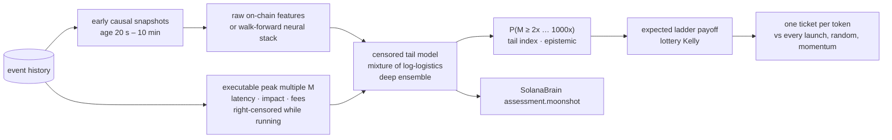

# Moonshot engine (`nardis_neural.solana.moonshot`)

The [edge engine](EDGE.md) looks for many small, repeatable wins. This module is for the
other end of the distribution: the rare launch that goes 100x or 1000x. That problem is
different in kind. The typical ticket loses, the result is decided by a handful of tokens,
and the useful question is not "what is the expected return?" but "**how heavy is this
token's right tail?**"



## 1. Labels (`labels.py`)

For a signal at `t`, a ticket of `size_sol` is bought at `t + latency` through the exact
curve or AMM maths. From then on the position is marked at its **liquidation multiple**:
the SOL you would get for selling the whole bag, with fees and impact, divided by the SOL
paid. The reserve shift from our own entry is carried forward and scaled through
liquidity adds and pulls. Every exit decided at `s` fills against the pool at
`s + latency`.

* **Peak multiple `M`**: the best such multiple within `horizon_seconds` (6 h by default).
  If the horizon runs past the end of the data while the token is still trading, the label
  is **right-censored**: we only know `M ≥ observed`. A token with no activity for
  `resolve_idle_seconds` before the end of the data is treated as finished, which is
  known causally.
* **Ladder multiple**: what a concrete exit plan actually returned. It sells 35 % of the
  original bag at 2x, 15 % at 10x, 15 % at 100x and 15 % at 1000x. After 2x, the
  remaining "moon bag" is sold when the mark falls 60 % from its running peak. Before 2x,
  everything is sold at a 50 % stop. Each tranche is priced exactly for its own size and
  moves the pool for the next one.

Censoring is what makes causal training possible. A model deployed at time `T` is trained
with every label **truncated at `T`**. A runner that was still climbing at `T` enters the
likelihood as "at least this much", which is exactly what a live system would have known.

## 2. Tail model (`tail.py`)

The model works on `y = log M` with a **mixture of logistic distributions**:

```
P(M ≥ k | x) = Σ_j π_j(x) · σ((μ_j(x) − log k) / s_j(x))
```

Each component is a log-logistic in `M`, whose survival decays as a power law
`k^(−1/s_j)`. The network therefore learns, per token, both where the bulk of outcomes
sits and how fat the tail is. Components for duds, normal pumps and runners emerge
without supervision.

* **Censored likelihood**: a density for resolved rows, `log P(M ≥ observed)` for censored
  rows.
* **Token weighting**: the snapshots of one token are strongly correlated, so each token
  carries the same total weight and bootstrap resampling is done by token.
* **Deep ensemble**: members are fitted on token-bootstrap resamples, with early stopping
  on the most recently launched tokens. The predictive survival is the members' average,
  and their spread is the epistemic uncertainty.
* **Inputs**: `raw` uses the 68 on-chain features and is fast on any CPU. `neural` adds
  the walk-forward out-of-fold neural forecasts, uncertainty, expert gates and risk
  probabilities, the same stack the edge model uses.

Outputs per token: `P(M ≥ k)` for 2/5/10/100/1000x, the median multiple, the **expected
ladder payoff** (quadrature over the predicted distribution with the ladder's payoff
function), the **tail index** of the heaviest active component, the ensemble spread, and a
**lottery-Kelly** fraction. That fraction is the bet size that maximises expected
log-wealth under the predicted payoff distribution, scaled by ¼ and capped at 5 %. For a
bet whose typical outcome is a loss, this is the sizing rule that avoids ruin. A mean-based
rule would size up exactly where the distribution is most dangerous.

## 3. Research protocol (`research.py`)

1. Early snapshots (20 s to 10 min after launch) are the ticket candidates.
2. Tokens are split by launch time. The model trains on the earlier 65 % of tokens with
   labels censored at the cutoff (the first test entry).
3. On the later 35 % of tokens it is scored **once**:
   * tail calibration and ranking AUC of `P(M ≥ k)` for every level, using resolved rows;
   * NLL against a feature-free tail model fitted on the same rows;
   * a portfolio with **one ticket per token**, bought at the first snapshot where the
     expected ladder payoff is at least the ticket (`--min-ev`, default 1.0) and
     lottery-Kelly > 0. It is compared with buying every launch, random tickets and
     momentum (highest 60 s return) at the same budget.
4. A threshold-sensitivity table is printed for transparency. It is never used to choose
   the threshold.
5. The production model is refitted on all tokens with labels up to the end of the data.

## 4. Results on the simulator

Two independent `degen` markets: 150 launches over 8 hours each (about 6 % runners, 42 %
duds, 30 % rugs), seeds 7 and 19. The settings were raw inputs, 0.5 SOL tickets, 1 s
latency, a 6 h horizon and a 5-member ensemble. The test period covers the 52 most recent
tokens of each market. Multiples are **net of latency, impact and fees** under the ladder
exit plan.

| market | policy | tickets | total PnL (SOL) | mean multiple | 95 % CI | median | best |
|---|---|---|---|---|---|---|---|
| A | **tail model** | 46 | **+172.0** | **8.48x** | [3.56, 14.39] | 1.64x | 95.6x |
| A | momentum (same budget) | 46 | +108.5 | 5.72x | [2.50, 10.12] | 1.37x | 66.7x |
| A | every launch | 52 | +172.1 | 7.62x | [3.27, 13.09] | 1.61x | 95.6x |
| A | random (same budget) | | +45.8 (p95 +72.3) | | | | |
| B | **tail model** | 37 | **+179.8** | **10.72x** | [3.77, 19.76] | 1.82x | 120.5x |
| B | momentum (same budget) | 37 | +108.7 | 6.88x | [2.32, 12.67] | 1.22x | 72.7x |
| B | every launch | 52 | +179.7 | 7.91x | [2.65, 14.26] | 1.09x | 120.5x |
| B | random (same budget) | | +40.8 (p95 +74.4) | | | | |

Tail quality on the test tokens:

| market | test NLL (feature-free) | AUC ≥2x | AUC ≥10x | AUC ≥100x | runners in test / ticketed |
|---|---|---|---|---|---|
| A | 0.10 (1.11) | 0.95 | 1.00 | 0.97 | 6 / 6 |
| B | 0.00 (1.44) | 0.95 | 0.97 | 0.96 | 5 / 5 |

How to read this:

* The model ranks the tail very well. It ticketed every runner in both test periods and
  skipped 6 of 52 launches (A) and 15 of 52 (B). It **matches the PnL of buying every
  launch with fewer tickets**, so more SOL per ticket, and beats momentum and random picks
  by a wide margin. In market B, a stricter threshold (E[payoff] ≥ 10x) kept 18 tickets
  and still made +172 SOL (20x per ticket). That figure comes from the test period, so it
  is not a result to rely on.
* **Calibration is imperfect where it matters most.** The 1000x probabilities are too
  high: about 0.01 to 0.02 predicted against about 0.001 observed. In market B, 5x and 10x
  were under-predicted. Power-law tails are fitted from a handful of runners. Treat the
  far-tail numbers as rankings, not as odds.
* Realised ladder multiples on runners were 26x to 120x, while their launch-to-peak runs
  were 100x to 3,000x. That gap is the honest cost of arriving 20 s or more after launch,
  paying latency on the way out, and banking tranches on the way up.
* **The simulator is generous.** Buying every launch is profitable in these markets, and
  rugs pump before they dump, so they often pay the 2x tranche. Real launch markets are far
  harsher. The results show that the machinery finds fat tails without look-ahead. They say
  nothing about live profitability.

Reproduce:

```bash
nardis-neural solana simulate --out sim/degen --market degen --tokens 150 --hours 8 --seed 7
nardis-neural solana bootstrap --events sim/degen --workspace ws --profile auto
nardis-neural solana moonshot-research --workspace ws --archetypes sim/degen/archetypes.json
cat ws/moonshot/REPORT.md
```

## 5. Hardening: calibration, input clamping, manipulation guard

A tail model is exactly what manipulators aim at. Fake volume, bundled supply and staged
"smart money" all look like the early footprint of a runner. Three layers keep the model
from being walked into a trap, and each of them can only **lower** its optimism:

1. **Tail calibration** (`TailModel.calibration`). After training, the predicted hit
   counts for each level (2x … 1000x) are compared with what actually happened on the
   held-out, most recent tokens. Each level gets a ratio, observed ÷ predicted, shrunk
   towards 1 by one pseudo-token and clipped to [0.05, 2]. Probabilities are then
   rescaled and kept non-increasing in `k`. This targets the far-tail overestimate
   measured in section 4. The results table there was produced before this step.
2. **Input clamping**. Each input is clamped to its training range (0.1 to 99.9 %
   quantiles) before the network, so a crafted extreme feature cannot push the
   prediction off a cliff. `out_of_range_share` reports how many inputs were clamped.
3. **Manipulation guard** (`moonshot/guard.py`). A `trust` score in [0, 1] multiplies the
   chase score and the Kelly hint. It combines:
   * P(rug) from the risk model;
   * live mint or freeze authority, and unburned LP;
   * wash trading, bundled supply, creator-cluster supply and rug-linked wallets;
   * holder concentration and dev selling;
   * supply held by a hidden multi-wallet funding cluster that is not the creator's, which
     catches staged insiders funded through relay wallets;
   * the neural OOD score, clamped inputs and ensemble disagreement.

   **Hard vetoes** zero the chase score. They fire on P(rug) ≥ 60 %, a live mint or freeze
   authority, one hidden wallet cluster holding ≥ 25 % of supply, bundled supply ≥ 20 %, a
   creator cluster holding ≥ 30 %, bots making up ≥ 80 % of volume, OOD ≥ 4, or ≥ 25 % of
   inputs outside the training range. Each veto
   appears in `flags` as a readable reason. The factors are hand-set and monotone: more red
   flags never raise trust. Thresholds are in `GuardConfig` (`brain.guard`).

## 6. Using it from the trading algorithm

```python
brain = SolanaBrain("workspaces/sol")  # the tail model loads if moonshot-research was run
for a in brain.moonshot_ranking():  # active tokens in the entry window, best first, vetoes removed
    m = a.moonshot
    m["chase_score"], m["chase_rank"]  # trust × expected ladder multiple; 1 = best
    m["p_ge_10x"], m["p_ge_100x"], m["p_ge_1000x"]  # calibrated survival probabilities
    m["expected_multiple"], m["lottery_kelly"]  # payoff expectation; sizing hint (× trust)
    m["trust"], m["vetoed"], m["tail_index"], m["epistemic"], m["out_of_range_share"]
    a.flags  # human-readable red flags, including "moonshot veto: …"
```

Every assessment from `assess` / `assess_many` / `assess_active` carries the same
`moonshot` block, with `chase_rank` computed within the batch. The trading system decides
what to do with it. This module never places orders.

Nothing here guarantees 1000x, and no model can promise it. What it gives you is a ranked,
manipulation-aware estimate of *how likely* a large run is, how uncertain that estimate is,
and how much of a bankroll such a lottery ticket can justify.
