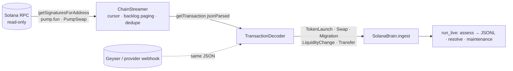
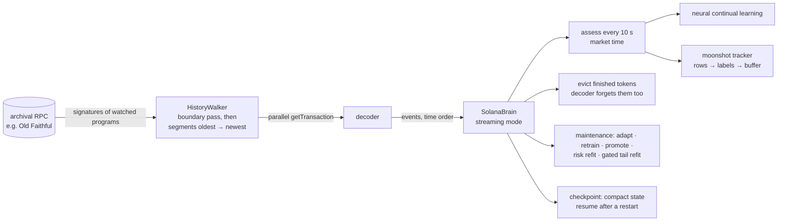

# Solana intelligence layer (`nardis_neural.solana`)

The generic neural brain forecasts from abstract tensors. This package teaches it
Solana. It turns raw on-chain activity (pump.fun launches, swaps, AMM migrations, LP
changes, SOL transfers) into causal, market-microstructure-aware observations, learns
which wallets matter, estimates launch risk, and produces cost-aware assessments.

It is still an ML module: **no private keys, no RPC writes, no transaction submission,
no BUY/SELL instructions.** Your trading system decides what to do with the numbers.


## 1. Protocol maths (`amm.py`)

* **pump.fun bonding curve**: virtual reserves 30 SOL / 1.073 B tokens, a 1 % fee,
  graduation after about 85 real SOL (≈ 793 M tokens sold), with bonding progress.
* **Constant-product AMM pools**: 0.25 % fee, exact buy and sell output.
* **`round_trip_cost(pool, size)`**: the fraction lost by buying `size` SOL and
  immediately selling everything back (two fees plus two-way price impact). This is the
  hurdle every forecast has to clear, and it feeds both the features and the labels.

## 2. Causal market state (`events.py`, `market.py`, `wallets.py`)

`SolanaMarket.ingest(event)` must be called in time order; it rejects events that go back
in time. For each token it keeps columnar NumPy logs of swaps, reserves and liquidity,
plus incremental holder balances, first-buy slots and creator bookkeeping.

**Wallet intelligence**
* *Funding clusters*: SOL transfers link funder and funded wallet in a union-find
  structure. **Hub detection** stops exchange hot wallets from gluing the whole market
  into one cluster (a source that funded more than `hub_threshold` wallets stops merging).
* *Reputation*: every buy is queued. Once `reputation_horizon` seconds of **market time**
  have passed, the realised move (read from state that now exists) updates a
  Beta-Bernoulli posterior for the buyer. Reputations are therefore learned online and are
  never informed by the future.
* *Rug attribution*: a creator dumping at least `dev_dump_fraction` of its bag marks the
  creator's whole funding cluster; an LP pull marks the wallet that pulled it.

`EventStore` persists history as one Parquet table per event type and replays it in
canonical order (launch → transfer → migration → LP → swap at equal timestamps).

## 3. Features (`features.py`)

53 named current-state features (`CURRENT_FEATURES`):

| Group | Features |
|---|---|
| Lifecycle / pool | age, #swaps, time since last trade, bonding progress, migrated, real liquidity and its 5-minute change, market cap, round-trip cost, drawdown from ATH, run-up from low |
| Price action | 5s / 30s / 60s / 300s log returns, 30s / 300s realised volatility |
| Order flow | buys and sells per minute, buy ratio, buy-SOL share, 60s and 300s net SOL flow, volume, unique buyers and sellers, new-trader share, average buy size |
| Holders & insiders | #holders, top-10 share, HHI, Gini, dev share, dev sold fraction, **sniper share** (first N slots), **bundle share** (co-funded early buyers), **fresh-wallet share**, **creator-cluster share** |
| Smart money & bots | reputation-weighted **smart flow**, #smart buyers, **bot share**, **rug-associated share** |
| Execution competition | priority fees, **Jito tip share**, slot density |
| Token safety | mint and freeze authority revoked, LP burned fraction |
| Edge dynamics | bonding-curve velocity, holder growth, smart-buyer share, top-holder sell share, buy acceleration |

**Trade bars** (fast 1 s × 60, medium 5 s × 48, slow 30 s × 40) carry 10 features each:
return, realised vol, volume, buy share, #trades, #unique wallets, net flow, liquidity,
priority fee, high-low range. Prices are **forward-filled through quiet bars**, so "nobody
traded" is information rather than missing data. Bars before launch are masked.

**Wallet graph**: the token plus its `graph_top_k` most active wallets (node features:
volume, position, reputation, evidence, is-creator, is-sniper, cluster size) with
three edge types: `wallet_trades_token`, `wallet_funded_wallet` and
`wallet_same_cluster`. This feeds the neural graph expert (GraphSAGE/GAT) directly.

## 4. Labels (`labels.py`)

Labels come from the **complete** history; features come from a causal replay. The two
never mix.

* Per horizon (default 15 s / 60 s / 5 m): log return, max upside, max drawdown, realised
  volatility. Horizons that aren't complete yet are omitted, and masked in training.
* **Cost-aware returns**: `expm1(return) − round_trip_cost(trade_size_sol)`.
* **Risk events** within `risk_horizon_seconds`:
  * `rug`: price crash ≥ `rug_price_drop`, or an LP pull ≥ `rug_liquidity_drop`, without
    graduating;
  * `graduation`: the bonding curve completes and migrates;
  * `dev_dump`: the creator sells ≥ `dev_dump_fraction` of what it held.

## 5. Datasets without leakage (`dataset.py`)

`build_solana_dataset(history, cfg)` replays history into a fresh market and takes
snapshots every `sample_interval_seconds` while a token is still trading. The sampling
schedule is itself causal, and each snapshot is labelled from the hindsight market. A test
rebuilds a random snapshot from a market that only ever saw the past and checks that the
features are identical.

## 6. Risk model (`risk.py`)

A three-member MLP ensemble on `[MarketStateEmbedding ‖ named Solana features]` predicts
P(rug), P(graduation) and P(dev dump). It uses class-balanced BCE, a chronological split
with early stopping, and per-label temperature calibration fitted on validation data. It
reports member disagreement as uncertainty and is refitted during `maintenance()` once
enough resolved live samples have accumulated.

## 7. `SolanaBrain` (`brain.py`)

```python
from nardis_neural.solana import SolanaBrain, EventStore

brain = SolanaBrain.bootstrap("workspaces/sol", EventStore.load("history/"))  # trains everything
# live loop (events decoded by your indexer):
brain.ingest(swap_or_launch_or_transfer)
report = brain.assess("MintAddress…")
report.prediction.expected_returns  # neural forecasts per horizon (+ uncertainty, OOD, experts)
report.risk  # {"rug": …, "graduation": …, "dev_dump": …}
report.round_trip_cost  # for SolanaConfig.trade_size_sol at current reserves
report.expected_net_return  # E[return] − cost, per horizon
report.prob_net_positive  # P(return beats the round-trip cost)
report.flags  # e.g. "bundled launch: 23.1% held by co-funded early wallets"
brain.resolve()  # label matured assessments → replay buffer + risk samples
brain.maintenance()  # adapt / full retrain / promote (shadow-gated) / refit risk
```

The brain keeps the whole event history in the workspace and rebuilds the market by
replaying it on restart. Continual learning, shadow mode, promotion gates and rollback all
come from the core engine (see [CONTINUAL_LEARNING.md](CONTINUAL_LEARNING.md)).

## 8. Launch simulator (`simulator.py`)

An agent-based simulator used for tests and demos. It is not a market model.

* **Wallets**: retail (CEX-funded long ago), smart money (joins healthy launches early,
  takes profit), snipers (first slots, high priority fees and Jito tips, quick flips), wash
  bots, honest devs, and rug crews (dev plus 4–8 bundle wallets funded minutes before
  launch from shared funders).
* **Archetypes**: `organic`, `graduate` (completes the curve and migrates), `rug` (bundled
  hype then a dump, or an LP pull on AMM launches, often with live mint authority), `dud`,
  `wash`, and `runner`: a rare viral launch whose demand and ticket sizes keep compounding
  for hours after graduation, with heavy-tailed virality (roughly 100x to 3,000x from the
  launch price). Runners are off in the `default` mix; the `degen` preset
  (`solana simulate --market degen`, or `--runners 0.1`) is mostly duds and rugs with a few
  percent runners, for the [moonshot engine](MOONSHOT.md).
* **Ambiguity on purpose**: 40 % of rugs are *stealth* (aged exchange-funded wallets,
  small crews trickling in over the first minute, authorities revoked); 25 % of honest
  launches are *decoys* (the dev's co-funded friends buy in the launch slots); honest
  launches also attract early whales.
* Pricing uses the exact curve and AMM maths above, and events are strictly time-ordered
  per token.

## 8b. Measured behaviour (synthetic data, 4-core CPU)

| | |
|---|---|
| simulate 40 launches (~50 k events) | ~4 s |
| replay 52 k events into a market | ~0.8 s |
| build one observation (53 features + 3 bar streams + graph) | ~1 ms |
| dataset from 40 launches (~7.8 k leakage-free snapshots) | ~25 s |
| `assess_many` 1 / 8 / 32 tokens (tiny 2-member test model) | ~23 / 38 / 74 ms |
| neural ensemble on held-out snapshots (tiny model) | downside AUC 0.84, return rank-corr 0.13 |
| risk model, **token-disjoint** validation | AUC ≈ 0.99 (rug, dev dump), ≈ 1.0 (graduation) |

**Read the risk numbers with care.** Validation holds out entire later-launched tokens,
and training only uses rows observed before the validation period, so the high AUC is
not leakage. The simulated world is simply easy: a ≥ 60 % crash requires a large insider
position, so holder concentration and early flow reveal rugs almost perfectly, and
graduation is predictable from buying momentum near the end of the curve. Real-world risk
accuracy will be lower, and you only find out by bootstrapping on real on-chain history.

## 9. CLI

```bash
nardis-neural solana simulate --out sim/history --tokens 40 --seed 1 --prefix A
nardis-neural solana simulate --out sim/live --tokens 10 --seed 2 --prefix B --start-time 1750014400
nardis-neural solana build-dataset --events sim/history --out sim/dataset      # optional inspection
nardis-neural solana bootstrap --events sim/history --workspace workspaces/sol --config configs/small.yaml
nardis-neural solana replay --workspace workspaces/sol --events sim/live --out sim/assessments.jsonl
nardis-neural solana assess --workspace workspaces/sol
```

## 10. Connecting real chain data (`solana/ingest/`)



**Decoding (`decoder.py`)**
* **pump.fun**: Anchor events are read from `Program data:` logs.
  `CreateEvent` → launch, `TradeEvent` → swap (with the virtual reserves after the
  trade), `CompleteEvent` → migration. Discriminators are `sha256("event:<Name>")[:8]`.
  Only the stable leading fields are read, so program upgrades that append fields keep
  working.
* **AMMs** (PumpSwap, Raydium AMM v4 / CPMM, Meteora, Orca) are handled without
  per-venue layouts. A pool is a WSOL vault plus a token vault owned by the same non-signer
  authority in a transaction that invokes a known AMM program. Vault balance deltas give
  the event: SOL in + tokens out is a buy, the reverse a sell, both in a liquidity add,
  both out a removal. Post-transaction vault balances are the reserves. For
  concentrated-liquidity venues the reserves are re-expressed so that price equals the
  execution price. Tokens first seen on an AMM get an implicit launch, with mint and
  freeze authority looked up via `getAccountInfo`.
* **SOL transfers** of at least `min_transfer_sol` become funding edges.
  **Jito tips** (transfers to the eight tip accounts) and **priority fees**
  (`fee − 5000 × signatures`) are attached to the transaction's first swap.
* Failed transactions are skipped. Timestamps are `blockTime` plus a microsecond sequence,
  so events stay strictly ordered.

**Streaming (`stream.py`, `rpc.py`)**
* `SolanaRpc` is a standard-library JSON-RPC client that only allows query methods
  (`sendTransaction`, airdrops and so on raise `PermissionError`). It retries 429 and
  5xx responses with exponential backoff.
* `ChainStreamer` keeps a persisted per-program cursor and pages back to it on every
  poll, so bursts are never dropped. A backlog above `max_backlog` is counted in `gaps`.
  It de-duplicates signatures seen by several programs and decodes in slot order.
* `run_live` ingests, assesses every `assess_every` seconds (writing JSONL), resolves
  matured outcomes and runs maintenance periodically. Malformed or out-of-order events are
  counted and skipped, never crashing the loop.

**Verification.** `encode.py` renders market events back into realistic transaction JSON.
The test suite round-trips a whole simulated market through transactions and gets
identical swaps, reserves, tips, fees, holder statistics and insider features. It also
checks the streamer against a fake chain (bursts larger than a page, restarts, duplicate
programs) and runs chain → decoder → brain → assessments end to end. The event layouts
and program IDs follow the public pump.fun IDL and have not been re-checked here against
live mainnet transactions. Run `solana backfill --raw` on a real endpoint once to confirm.

```bash
export SOLANA_RPC_URL=https://your-provider.example/?api-key=…   # any standard Solana RPC
nardis-neural solana backfill --out history/ --limit 5000 --raw history/raw.jsonl
nardis-neural solana bootstrap --events history/ --workspace workspaces/sol
nardis-neural solana stream --workspace workspaces/sol --out assessments.jsonl
nardis-neural solana decode --input dump.jsonl --out events/   # offline: provider exports / archives
```

## 11. Training by streaming history (`ingest/history.py`, `streaming.py`)

The model can learn from weeks or months of chain history **without storing it**. Events
are streamed, decoded, fed through the brain and thrown away:



* **Only the watched programs are fetched** (pump.fun and PumpSwap by default), never whole
  blocks. The walker first pages each program's signature listing backwards once, keeping
  only the cursors at every segment edge (one hour by default). It then replays the
  segments oldest first. Only one segment's signatures are ever held in memory.
* **No look-ahead from today's chain state**: historical replays do not look up mint
  accounts, since their current authorities would leak the future.
* **Bounded memory**: tokens quiet for `--evict-idle-hours` (2 h by default) are
  forgotten after their moonshot rows are labelled, and the decoder drops their state too.
  What was learned stays in the wallet intelligence: reputations, rug marks and funding
  clusters. A later relaunch of an evicted mint is rejected rather than treated as a new
  token. Per-wallet state is stored in compact typed arrays. Risk samples and moonshot rows
  are rolling windows (50 k and 200 k rows).
* **Learning while streaming**:
  * the neural ensemble keeps using its continual-learning loop (replay, adaptation, full
    retraining, shadow and promotion gates);
  * the risk model refits on newly resolved samples;
  * the moonshot tail model is retrained from the tracker's buffer every 6 h of market
    time. Still-running tokens enter as right-censored rows. A candidate replaces the
    installed model only if it matches it on the most recent 20 % of tokens.
* **Resumable**: `stream/market.pkl` (written atomically) and `moonshot/online.npz`
  checkpoint the state. A restarted run skips everything up to the checkpointed market
  time.
* **A fresh workspace bootstraps itself** from the first `--warmup-hours` after the first
  launch.

```bash
export SOLANA_RPC_URL=https://…   # an endpoint that serves old slots (Old Faithful / archival)
nardis-neural solana stream-train --workspace workspaces/sol \
    --start 2025-09-01 --end 2025-09-22 --workers 16 --profile auto
# or replay a saved event directory through the same loop
nardis-neural solana stream-train --workspace workspaces/sol --events history/
```

Throughput is set by the RPC endpoint. There is one `getTransaction` per watched
transaction, run in parallel across `--workers`, so busy weeks of pump.fun take hours of
streaming per day of history. Model work is small by comparison with the `cpu-lite`
profile.

Every threshold, horizon, bar spec and window lives in `SolanaConfig`
(`nardis-neural solana init-config`).
