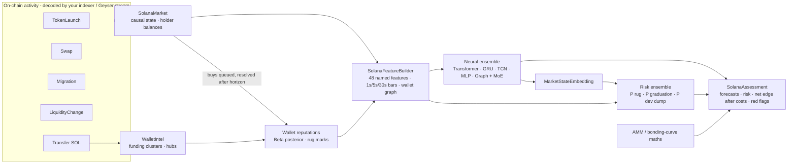

# Solana intelligence layer (`nardis_neural.solana`)

The generic neural brain forecasts from abstract tensors. This package teaches it
Solana. It turns raw on-chain activity (pump.fun launches, swaps, AMM migrations, LP
changes, SOL transfers) into causal, market-microstructure-aware observations, learns
which wallets matter, estimates launch risk, and produces cost-aware assessments.

It is still an ML module: **no private keys, no RPC writes, no transaction submission,
no BUY/SELL instructions.** Your trading system decides what to do with the numbers.



## 1. Protocol maths (`amm.py`)

* **pump.fun bonding curve**: virtual reserves 30 SOL / 1.073 B tokens, a 1 % fee,
  graduation after about 85 real SOL (≈ 793 M tokens sold), with bonding progress.
* **Constant-product AMM pools**: 0.25 % fee, exact buy and sell output.
* **`round_trip_cost(pool, size)`**: the fraction lost by buying `size` SOL and
  immediately selling everything back (two fees plus two-way price impact). This is the
  hurdle every forecast has to clear, and it feeds both the features and the labels.

## 2. Causal market state (`events.py`, `market.py`, `wallets.py`)

`SolanaMarket.ingest(event)` must be called in time order; it rejects events that go back
in time. For each token it keeps columnar NumPy logs of swaps, reserves and liquidity,
plus incremental holder balances, first-buy slots and creator bookkeeping.

**Wallet intelligence**
* *Funding clusters*: SOL transfers link funder and funded wallet in a union-find
  structure. **Hub detection** stops exchange hot wallets from gluing the whole market
  into one cluster (a source that funded more than `hub_threshold` wallets stops merging).
* *Reputation*: every buy is queued. Once `reputation_horizon` seconds of **market time**
  have passed, the realised move (read from state that now exists) updates a
  Beta-Bernoulli posterior for the buyer. Reputations are therefore learned online and are
  never informed by the future.
* *Rug attribution*: a creator dumping at least `dev_dump_fraction` of its bag marks the
  creator's whole funding cluster; an LP pull marks the wallet that pulled it.

`EventStore` persists history as one Parquet table per event type and replays it in
canonical order (launch → transfer → migration → LP → swap at equal timestamps).

## 3. Features (`features.py`)

48 named current-state features (`CURRENT_FEATURES`):

| Group | Features |
|---|---|
| Lifecycle / pool | age, #swaps, time since last trade, bonding progress, migrated, real liquidity and its 5-minute change, market cap, round-trip cost, drawdown from ATH, run-up from low |
| Price action | 5s / 30s / 60s / 300s log returns, 30s / 300s realised volatility |
| Order flow | buys and sells per minute, buy ratio, buy-SOL share, 60s and 300s net SOL flow, volume, unique buyers and sellers, new-trader share, average buy size |
| Holders & insiders | #holders, top-10 share, HHI, Gini, dev share, dev sold fraction, **sniper share** (first N slots), **bundle share** (co-funded early buyers), **fresh-wallet share**, **creator-cluster share** |
| Smart money & bots | reputation-weighted **smart flow**, #smart buyers, **bot share**, **rug-associated share** |
| Execution competition | priority fees, **Jito tip share**, slot density |
| Token safety | mint and freeze authority revoked, LP burned fraction |

**Trade bars** (fast 1 s × 60, medium 5 s × 48, slow 30 s × 40) carry 10 features each:
return, realised vol, volume, buy share, #trades, #unique wallets, net flow, liquidity,
priority fee, high-low range. Prices are **forward-filled through quiet bars**, so "nobody
traded" is information rather than missing data. Bars before launch are masked.

**Wallet graph**: the token plus its `graph_top_k` most active wallets (node features:
volume, position, reputation, evidence, is-creator, is-sniper, cluster size) with
three edge types: `wallet_trades_token`, `wallet_funded_wallet` and
`wallet_same_cluster`. This feeds the neural graph expert (GraphSAGE/GAT) directly.

## 4. Labels (`labels.py`)

Labels come from the **complete** history; features come from a causal replay. The two
never mix.

* Per horizon (default 15 s / 60 s / 5 m): log return, max upside, max drawdown, realised
  volatility. Horizons that aren't complete yet are omitted, and masked in training.
* **Cost-aware returns**: `expm1(return) − round_trip_cost(trade_size_sol)`.
* **Risk events** within `risk_horizon_seconds`:
  * `rug`: price crash ≥ `rug_price_drop`, or an LP pull ≥ `rug_liquidity_drop`, without
    graduating;
  * `graduation`: the bonding curve completes and migrates;
  * `dev_dump`: the creator sells ≥ `dev_dump_fraction` of what it held.

## 5. Datasets without leakage (`dataset.py`)

`build_solana_dataset(history, cfg)` replays history into a fresh market and takes
snapshots every `sample_interval_seconds` while a token is still trading. The sampling
schedule is itself causal, and each snapshot is labelled from the hindsight market. A test
rebuilds a random snapshot from a market that only ever saw the past and checks that the
features are identical.

## 6. Risk model (`risk.py`)

A three-member MLP ensemble on `[MarketStateEmbedding ‖ named Solana features]` predicts
P(rug), P(graduation) and P(dev dump). It uses class-balanced BCE, a chronological split
with early stopping, and per-label temperature calibration fitted on validation data. It
reports member disagreement as uncertainty and is refitted during `maintenance()` once
enough resolved live samples have accumulated.

## 7. `SolanaBrain` (`brain.py`)

```python
from nardis_neural.solana import SolanaBrain, EventStore

brain = SolanaBrain.bootstrap("workspaces/sol", EventStore.load("history/"))  # trains everything
# live loop (events decoded by your indexer):
brain.ingest(swap_or_launch_or_transfer)
report = brain.assess("MintAddress…")
report.prediction.expected_returns  # neural forecasts per horizon (+ uncertainty, OOD, experts)
report.risk  # {"rug": …, "graduation": …, "dev_dump": …}
report.round_trip_cost  # for SolanaConfig.trade_size_sol at current reserves
report.expected_net_return  # E[return] − cost, per horizon
report.prob_net_positive  # P(return beats the round-trip cost)
report.flags  # e.g. "bundled launch: 23.1% held by co-funded early wallets"
brain.resolve()  # label matured assessments → replay buffer + risk samples
brain.maintenance()  # adapt / full retrain / promote (shadow-gated) / refit risk
```

The brain keeps the whole event history in the workspace and rebuilds the market by
replaying it on restart. Continual learning, shadow mode, promotion gates and rollback all
come from the core engine (see [CONTINUAL_LEARNING.md](CONTINUAL_LEARNING.md)).

## 8. Launch simulator (`simulator.py`)

An agent-based simulator used for tests and demos. It is not a market model.

* **Wallets**: retail (CEX-funded long ago), smart money (joins healthy launches early,
  takes profit), snipers (first slots, high priority fees and Jito tips, quick flips), wash
  bots, honest devs, and rug crews (dev plus 4–8 bundle wallets funded minutes before
  launch from shared funders).
* **Archetypes**: `organic`, `graduate` (completes the curve and migrates), `rug` (bundled
  hype then a dump, or an LP pull on AMM launches, often with live mint authority), `dud`,
  `wash`.
* **Ambiguity on purpose**: 40 % of rugs are *stealth* (aged exchange-funded wallets,
  small crews trickling in over the first minute, authorities revoked); 25 % of honest
  launches are *decoys* (the dev's co-funded friends buy in the launch slots); honest
  launches also attract early whales.
* Pricing uses the exact curve and AMM maths above, and events are strictly time-ordered
  per token.

## 8b. Measured behaviour (synthetic data, 4-core CPU)

| | |
|---|---|
| simulate 40 launches (~50 k events) | ~4 s |
| replay 52 k events into a market | ~0.8 s |
| build one observation (48 features + 3 bar streams + graph) | ~1 ms |
| dataset from 40 launches (~7.8 k leakage-free snapshots) | ~25 s |
| `assess_many` 1 / 8 / 32 tokens (tiny 2-member test model) | ~23 / 38 / 74 ms |
| neural ensemble on held-out snapshots (tiny model) | downside AUC 0.84, return rank-corr 0.13 |
| risk model, **token-disjoint** validation | AUC ≈ 0.99 (rug, dev dump), ≈ 1.0 (graduation) |

**Read the risk numbers with care.** Validation holds out entire later-launched tokens,
and training only uses rows observed before the validation period, so the high AUC is
not leakage. The simulated world is simply easy: a ≥ 60 % crash requires a large insider
position, so holder concentration and early flow reveal rugs almost perfectly, and
graduation is predictable from buying momentum near the end of the curve. Real-world risk
accuracy will be lower, and you only find out by bootstrapping on real on-chain history.

## 9. CLI

```bash
nardis-neural solana simulate --out sim/history --tokens 40 --seed 1 --prefix A
nardis-neural solana simulate --out sim/live --tokens 10 --seed 2 --prefix B --start-time 1750014400
nardis-neural solana build-dataset --events sim/history --out sim/dataset      # optional inspection
nardis-neural solana bootstrap --events sim/history --workspace workspaces/sol --config configs/small.yaml
nardis-neural solana replay --workspace workspaces/sol --events sim/live --out sim/assessments.jsonl
nardis-neural solana assess --workspace workspaces/sol
```

## 10. Connecting real data

Decode chain activity into the five event types. You need, per swap, the pool's reserves
*after* the swap (virtual reserves on pump.fun), the priority fee, the Jito tip and the
slot. You also need SOL transfers between wallets for funding analysis. Stream them in
order into `SolanaBrain.ingest`. Every threshold, horizon, bar spec and window lives in
`SolanaConfig` (`nardis-neural solana init-config`).
