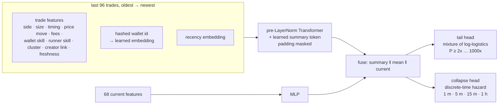

# Tape Transformer (`nardis_neural.solana.tape`)

Every other model in this repository sees a token through aggregates: per-minute bars and
68 summary features. That throws away the two things that decide a memecoin launch: **who**
is trading, and **in what order**. The Tape Transformer reads the raw trade tape directly.



## 1. The tape (`features.py`)

For a snapshot at `now`, the last `max_trades` (96) trades at or before `now` are kept,
left-padded, with the most recent last. Each trade is a vector of 18 features; the full
list is in the generated reference, *Trade tape*. They cover the trade itself (side, SOL,
signed flow, time since the previous trade, age, time until now, price relative to now,
priority fee, Jito tip) and the trader as the market knows them at `now` (60-s skill,
runner skill, creator, creator's cluster, fresh funding, cluster size, lifetime trades,
first trade in this token, bought within the launch slots).

Each trade also carries a **wallet hash bucket**: a blake2b hash of the wallet address. It
is stable, so the learned embedding means the same wallet in every workspace, replay and
live session. Training tapes are cut by a causal replay (`dataset.py`) under the same rule
as every other snapshot. A test checks that a replayed tape equals the tape from a market
that has only seen the past.

## 2. The network (`model.py`)

* **Trade embedding** is `Linear(trade features) + Linear(wallet embedding)`, plus a learned
  recency embedding counted from the most recent trade, so left padding changes nothing.
* **Wallet embeddings** start at unit scale; a small initialisation left wallet identity
  drowned out by the trade features. Two defences stop the table from memorising noise:
  * **frequency gating**: only wallets seen in at least `min_wallet_tokens` (3) distinct
    training tokens get their own embedding. Everyone else shares an "unknown wallet" slot,
    and their trades still count through their features;
  * **wallet dropout**: 20 % of identities are hidden during training, so no single wallet
    becomes a crutch.
* A learned **summary token** is appended, and a 2-layer pre-LayerNorm Transformer (d = 64,
  4 heads) attends over the tape with padding masked. The summary token keeps an empty
  tape well defined.
* The summary token, the masked mean of the trades and an MLP of the current features
  are fused into one vector.
* **Tail head**: a mixture of logistics on `log` peak multiple. It uses the same censored
  likelihood, per-level calibration, expected ladder payoff and lottery Kelly as the
  [moonshot tail model](MOONSHOT.md), sharing the code.
* **Collapse head**: a discrete-time hazard over 1 min, 5 min, 15 min and 1 h. It gives the
  probability that the ticket's value falls to half of its entry value within each window.
  It is trained with the censored survival likelihood: a row survives every bin it was
  fully observed through, and its event bin if it collapsed. This is the **exit signal**.
* **Ensemble**: 3 members by default, trained on token-bootstrap resamples, with early
  stopping on the most recently launched tokens. Every token carries the same total weight.

About 2.2 M parameters per member, most of them in the wallet table (131 k buckets × 16).
It runs comfortably on a laptop CPU, an M1, or a 4-vCPU cloud VM.

## 3. Research (`research.py`)

The protocol matches the moonshot research: entry-window snapshots, tokens split by launch
time, training labels censored at the cutoff, and one scoring pass on the later tokens. The
raw-feature tail model is trained on the **same** rows and scored on the **same** test rows,
so the comparison is direct:

* tail: NLL, calibration and AUC per level for both models;
* collapse: for each window, predicted vs observed collapse rate, AUC and Brier score on
  rows whose outcome for that window is known;
* one ticket per token for both models, against buying every launch.

```bash
nardis-neural solana tape-research --workspace ws --archetypes sim/degen/archetypes.json
cat ws/tape/REPORT.md
```

## 4. Results on the simulator

One `degen` market: 150 launches over 8 hours (seed 7, the same market as market A in
[MOONSHOT.md](MOONSHOT.md)). There were 98 training tokens and 52 test tokens, with 3
ensemble members of about 2.2 M parameters each; 851 wallets earned their own embedding.
Both models were trained and scored on identical rows. Training and scoring took about
20 minutes on a 4-core CPU, including the production refit.

| | Tape Transformer | raw-feature tail model |
|---|---|---|
| test NLL of log peak multiple | **0.210** | 0.300 |
| AUC P(≥2x) | 0.916 | 0.914 |
| AUC P(≥10x) | 0.958 | **0.982** |
| AUC P(≥100x) | 0.935 | **0.982** |
| AUC P(≥1000x) | 0.809 | **0.980** |

Collapse, the new exit signal (value halves within the window, 3,016 test rows):

| window | predicted | observed | AUC | Brier |
|---|---|---|---|---|
| 1 min | 0.035 | 0.042 | 0.926 | 0.034 |
| 5 min | 0.126 | 0.138 | 0.973 | 0.048 |
| 15 min | 0.148 | 0.157 | 0.970 | 0.050 |
| 1 h | 0.189 | 0.164 | 0.966 | 0.054 |

How to read this:

* **The collapse head is the win.** It separates tokens that are about to break from those
  that are not (AUC 0.93–0.97), and it is well calibrated at every window. No other model
  in the repository produces an exit signal.
* **The whole distribution fits better** (lower NLL), but the tape model **ranks the far
  tail worse** than the aggregate model. Runners are rare, and a tape of the last 96 trades
  sees less of a token's history than the aggregate features. For picking moonshot
  entries, keep using the tail model's `chase_score`; use the tape for exits.
* In this generous simulator every token cleared the "expected payoff ≥ ticket" rule for
  both models, so the one-ticket-per-token comparison could not separate them.
* One market, one seed. This is a synthetic benchmark, not evidence of live performance.

## 5. Entry and exit policies across two markets

`tape-research` also splits tokens three ways by launch time: 76 train, 22 tune and 52
test tokens per market. Entries come from the blend of both models. The exit alarm (window
and threshold) is chosen on the tune tokens, with their outcomes truncated before the test
period, then scored once on test. The runs used seeds 7 and 19 (market A and market B of
[MOONSHOT.md](MOONSHOT.md)). Seed 19 also had the `top_cluster_share` feature, which did not
exist yet when seed 7 ran.

| | seed 7 | seed 19 |
|---|---|---|
| AUC P(≥10x): tape / tail / blend | 0.909 / **0.957** / 0.940 | **0.920** / 0.184 / 0.831 |
| AUC P(≥100x): tape / tail / blend | 0.931 / **0.967** / 0.964 | **0.964** / 0.164 / 0.941 |
| collapse AUC 1 min / 5 min / 15 min / 1 h | 0.92 / 0.97 / 0.96 / 0.95 | 0.90 / 0.97 / 0.97 / 0.97 |
| alarm chosen on tune | P(collapse ≤ 5 min) ≥ 0.7 | P(collapse ≤ 1 min) ≥ 0.3 |
| test PnL, ladder only | +172.1 SOL | +179.7 SOL |
| test PnL, ladder + learned exit | **+177.2 SOL** | +157.5 SOL |
| median ticket, ladder only → with alarm | 1.61x → 1.93x | 1.09x → 1.77x |

What this shows:

* **The collapse head generalises.** AUC is 0.90–0.97 at every window in both markets.
* **Neither entry model always wins.** On seed 7 the aggregate tail model ranked the tail
  best. On seed 19, trained on fewer tokens, its ranking broke (AUC below 0.5, i.e.
  inverted), while the tape stayed above 0.86 at every level. **The blend was never the
  worst**, so when both models are installed `chase_score` ranks by the blend
  (`expected_multiple_blend`).
* **The learned exit is not yet a reliable edge.** It lifted the median ticket in both
  markets, but it also sold some runners early: +3 % total PnL on seed 7, −12 % on
  seed 19. Treat the alarm as an input to your exit logic, not a rule. The forward-test
  ledger settles every paper ticket both with and without the alarm
  (`alarm_minus_ladder_pnl_sol`), so live data decides.
* Two synthetic markets are still a small sample (`research-suite --tape` runs more).

## 6. Using it

```python
brain = SolanaBrain("workspaces/sol")  # the tape model loads if tape-research was run
for a in brain.assess_active():
    a.tape["p_ge_10x"], a.tape["expected_multiple"]  # entry view from the tape
    a.tape["p_collapse_1m"], a.tape["p_collapse_5m"]  # exit view: will the run break soon?
```

The collapse probabilities are meant for positions you already hold. A sharp rise in
`p_collapse_1m` or `p_collapse_5m` is the model's view that the run is about to break. As
everywhere in this module, it is a probability for the trading system to act on, not an
order.
